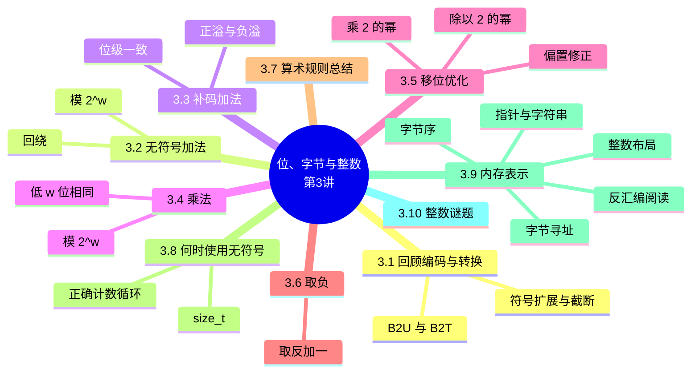

# 位、字节与整数（二）：整数运算与内存表示（Bits, Bytes, and Integers – Part 2）

> **本章主线**：回顾编码与转换 → 整数算术（无符号加法、补码加法、乘法、移位优化、取负）→ 算术规则总结 → 何时使用无符号 → 数据在内存中的表示（字节序、指针、字符串）→ 整数谜题综合检验。
> 一句话版本：**第 2 讲解决"数字长什么样"，本讲解决"数字怎么算、怎么存"**——运算在有限位宽上回绕，存储受字节序左右。



---

## 3.1 回顾：整数编码与转换

上一讲建立了完整的整数"世界观"，本讲在其上继续。先快速回顾三块基石：

1. **编码公式**：无符号 $B2U_w(\vec{x}) = \sum_{i=0}^{w-1} x_i 2^i$；补码 $B2T_w(\vec{x}) = -x_{w-1}2^{w-1} + \sum_{i=0}^{w-2} x_i 2^i$——补码的最高位是**负权重的符号位**。
2. **w = 5 例子**：$10 = 01010_2$（$8+2$）；$-10 = 10110_2$（$-16+4+2$）。
3. **转换规则**：有符号 ↔ 无符号**保持位模式、重新解释**；含混合类型的表达式 **`int` 隐式转 `unsigned`**。
4. **扩展与截断**：扩展时无符号补 0、有符号符号扩展；截断即丢弃高位（模 $2^w$ 运算）。

> 回顾口诀：**编码看公式、转换保位重释、扩展补符号、截断即取模**。

## 3.2 无符号加法（Unsigned Addition）

**标准加法函数**：两个 $w$ 位无符号数相加，真实结果需要 $w+1$ 位——**丢弃进位（carry）输出**，保留低 $w$ 位。这实现了**模算术（modular arithmetic）**：

$$
UAdd_w(u, v) = u + v \bmod 2^w
$$

**完整例题：无符号加法（char，w = 8）**

**题目陈述**：计算 `0xE9 + 0xD5`（`unsigned char` 类型）。

**完整解题步骤**（每一步注明依据）：

1. 二进制竖式：$1110\ 1001_2 + 1101\ 0101_2$；
2. 真实和：$1\ 1011\ 1110_2$（$223 + 213 = 446 = \text{0x1BE}$，需要 9 位）；
3. **丢弃最高进位 1**，保留低 8 位：$1011\ 1110_2 = \text{0xBE} = 190$；
4. 验证模运算：$446 \bmod 256 = 190$ ✓。
5. **最终答案**：`0xE9 + 0xD5 = 0xBE`（十进制 190）。

**回绕（Wrap Around）可视化**：如果把无符号加法画成 $u$、$v$ 平面上的曲面——整数加法的真和形成**线性平面**；无符号加法在真和 $\ge 2^w$ 处发生**回绕**（结果跳回 0 附近），形成锯齿状曲面。关键性质：**至多回绕一次**。

> 该例演示的核心技巧/易错点：**无符号加法的"溢出"不是错误，而是模算术的既定行为**——真和落在 $[2^w, 2^{w+1}-1]$ 时结果比真和小 $2^w$。

## 3.3 补码加法（Two's Complement Addition）

**TAdd 与 UAdd 位级行为完全一致**：都是"正常加法 + 丢弃最高位"，区别仅在**最终解释**。C 语言中：

```c
int s, t, u, v;
s = (int) ((unsigned) u + (unsigned) v);
t = u + v;   /* s == t 恒成立 */
```

**完整例题：补码加法（char 按 8 位补码解释）**

**题目陈述**：计算 `0xE9 + 0xD5`（按有符号 char，w = 8）。

**完整解题步骤**（每一步注明依据）：

1. 按补码解释：$0\text{xE9} = -23$，$0\text{xD5} = -43$；
2. 位级运算与无符号完全相同：$1110\ 1001_2 + 1101\ 0101_2 = 1\ 1011\ 1110_2$，丢弃进位得 $1011\ 1110_2 = \text{0xBE}$；
3. **按补码重新解释** $0\text{xBE}$：$1011\ 1110_2 = -64 - 2 = -66$；
4. 验证真和：$-23 + (-43) = -66$，恰好落在 $[-128, 127]$ 内，无溢出 ✓。
5. **最终答案**：$-23 + (-43) = -66$（位级与无符号加法相同，只是解释不同）。

**TAdd 溢出（Overflow）**：真实和需要 $w+1$ 位，丢弃 MSB 后按补码解释——出现两类溢出：

1. **正溢出（PosOver）**：真和 $> TMax$（$2^{w-1}-1$）→ 结果变成负数；
2. **负溢出（NegOver）**：真和 $< TMin$（$-2^{w-1}$）→ 结果变成正数。

**TAdd 的完整刻画（分段函数）**：

$$
TAdd_w(u,v) = \begin{cases} u + v + 2^w & u+v < TMin_w \quad (\text{负溢出})\\ u + v & TMin_w \le u+v \le TMax_w \\ u + v - 2^w & TMax_w < u+v \quad (\text{正溢出}) \end{cases}
$$

**可视化**：4 位补码范围 $[-8, +7]$——真和 $\ge 8$ 时回绕为负（正溢出），真和 $< -8$ 时回绕为正（负溢出）；**至多回绕一次**。

> 口诀：**加太大变负、加太小变正——溢出一次，方向相反**；位级操作对有符号无符号一视同仁。

## 3.4 乘法（Multiplication）

**问题**：两个 $w$ 位数 $x$、$y$ 的精确乘积可能超过 $w$ 位：

1. **无符号**：最多 $2w$ 位——结果范围 $0 \le x \cdot y \le (2^w - 1)^2 = 2^{2w} - 2^{w+1} + 1$；
2. **补码负数**：最多 $2w-1$ 位——$x \cdot y \ge (-2^{w-1}) \cdot (2^{w-1}-1) = -2^{2w-2} + 2^{w-1}$；
3. **补码正数**：最多 $2w$ 位，但**仅当 $x = y = TMin$**（$(TMin)^2 = 2^{2w-2}$）。

**若要保持精确结果**，乘积每算一次字长就得扩大一次——C 不这样做；需要时由软件实现（如**任意精度算术包**）。

**标准乘法函数**：丢弃高 $w$ 位，保留低 $w$ 位——同样是**模算术**：

$$
UMult_w(u, v) = u \cdot v \bmod 2^w
$$

**完整例题：无符号乘法（char，w = 8）**

**题目陈述**：计算 `0xE9 * 0xD5`（`unsigned char`）。

**完整解题步骤**（每一步注明依据）：

1. 十进制：$223 \times 213$；
2. 精确乘积：$223 \times 213 = 49629 = 0\text{xC1DD}$（16 位）；
3. **丢弃高 8 位**，保留低 8 位：$\text{0xDD} = 221$；
4. 验证模运算：$49629 \bmod 256 = 221$ ✓。
5. **最终答案**：`0xE9 * 0xD5 = 0xDD`（十进制 221）。

**完整例题：补码乘法（char 按有符号解释）**

**题目陈述**：计算 `0xE9 * 0xD5`（有符号 char，w = 8）。

**完整解题步骤**（每一步注明依据）：

1. 按补码解释：$0\text{xE9} = -23$，$0\text{xD5} = -43$；
2. 精确乘积：$(-23) \times (-43) = 989 = 0\text{x03DD}$（11 位）；
3. 丢弃高 8 位得 $\text{0xDD}$，按补码解释：$0\text{xDD}$ 的无符号值 221 减去 256 得 $-35$；
4. 验证：$989 \bmod 256 = 221$，$TMult_8(-23, -43) = -35$ ✓。
5. **最终答案**：$(-23) \times (-43) = -35$（**低 $w$ 位与无符号乘法相同**，只是解释不同）。

**关键结论**：有符号与无符号乘法**低 $w$ 位完全相同**（高位的处理有差异，但被丢弃）。

> 口诀：**乘法的"低 $w$ 位"人人平等，解释不同只看高位**——位级上无符号与补码乘法完全一致。

## 3.5 用移位优化乘除法

### 3.5.1 乘以 2 的幂：左移

**操作**：$u << k$ 给出 $u \cdot 2^k$——**有符号与无符号都成立**（丢弃高 $k$ 位即模运算）。

1. $u << 3 \equiv u \times 8$；
2. $(u << 5) - (u << 3) \equiv u \times 32 - u \times 8 = u \times 24$；
3. **多数机器上"移位 + 加法"比乘法快**——编译器自动把乘常数替换为移位序列。

> 口诀：**乘 $2^k$ 左移 $k$，组合移位做任意乘**。

### 3.5.2 无符号除以 2 的幂：逻辑右移

**操作**：$u >> k$ 给出 $\lfloor u / 2^k \rfloor$——**无符号用逻辑右移**（高位补 0），右移即向下取整除法。

### 3.5.3 有符号除以 2 的幂：算术右移（有缺陷）

**操作**：$x >> k$ 给出 $\lfloor x / 2^k \rfloor$——**有符号用算术右移**（复制符号位）。问题：**当 $x < 0$ 时取整方向错误**——算术右移向 $-\infty$ 取整（floor），而除法应当向 0 取整。例如 $x = -6$，$k = 2$：$-6 / 4 = -1.5$，期望 $-1$（向 0），算术移位却给出 $-2$（补充说明/拓展示例）。

### 3.5.4 正确的有符号除法：偏置（Bias）修正

**目标**：向 0 取整。**做法**：先加偏置 $2^k - 1$ 再右移：

$$
\lceil x / 2^k \rceil = \lfloor (x + 2^k - 1) / 2^k \rfloor
$$

C 写法：`(x + (1 << k) - 1) >> k`——偏置把被除数向 0 **方向推进**。分两种情况：

1. **无舍入**（$x$ 恰好整除 $2^k$）：加偏置后低位恰好进位抵消，**偏置无效果**；
2. **有舍入**（$x$ 不整除）：偏置使商**增加 1**，实现"向上取整"到向 0。

**完整例题：偏置除法**

**题目陈述**：用算术移位 + 偏置计算 $-6 / 4$（$k = 2$），并与直接算术右移对比。

**完整解题步骤**（每一步注明依据，8 位补码）：

1. 期望结果：$-6 / 4 = -1.5$，向 0 取整为 $-1$；
2. 直接算术右移：$-6 = 1111\ 1010_2$，`>> 2` 得 $1111\ 1110_2 = -2$——**错误**（向 $-\infty$ 取整）；
3. 偏置修正：$-6 + (2^2 - 1) = -6 + 3 = -3 = 1111\ 1101_2$；
4. 算术右移：$1111\ 1101_2 >> 2 = 1111\ 1111_2 = -1$ ✓；
5. **最终答案**：$(-6 + 3) >> 2 = -1$，符合向 0 取整的期望。
6. 补充：无舍入情形——$-8 / 4$：$-8 + 3 = -5 = 1111\ 1011_2$，`>> 2` 得 $1111\ 1110_2 = -2$ = $-8/4$ ✓（偏置被整除抵消，无效果）。

> 该例演示的核心技巧/易错点：**负数右移 ≠ 负数除法**；先加 $2^k-1$ 再右移，是把"向负无穷取整"掰回"向 0 取整"的标准技法。

## 3.6 取负：取反加一（Negation）

**核心恒等式**：

$$
\sim x + 1 = -x
$$

**推导依据**：观察 $\sim x + x = 111\ldots 111 = -1$（每一位 $x_i + \sim x_i = 1$，全 1 即 $-1$），两边加 1 得 $\sim x + x + 1 = 0$，即 $\sim x + 1 = -x$。

**完整例题：取反加一**

**题目陈述**：用取反加一求 $x = 15213$ 的相反数（16 位），并考察 $x = 0$ 与 $x = TMin$ 两个特殊值。

**完整解题步骤**（每一步注明依据）：

1. $x = 15213 = 0011\ 1011\ 0110\ 1101_2$（0x3B6D）；
2. 取反：$\sim x = 1100\ 0100\ 1001\ 0010_2$（0xC492）；
3. 加一：$1100\ 0100\ 1001\ 0011_2$（0xC493）$= -15213$ ✓（对照：$+15213$ 与 $-15213$ 的位模式恰好互补加一）；
4. $x = 0$：$\sim 0 + 1 = 111\ldots 111 + 1 = 000\ldots 0 = 0$（模 $2^w$ 回绕）——**$-0 = 0$** ✓；
5. $x = TMin$：$\sim TMin + 1 = 011\ldots 1 + 1 = 100\ldots 0 = TMin$——**$-TMin = TMin$**（补码不对称性的又一体现，经典反例）。
6. **最终答案**：取反加一对大多数值正确，但对 $TMin$ 失效（结果为自身）。

> 该例演示的核心技巧/易错点：**$TMin$ 是"取反加一"的唯一致命伤**——它没有正数对应物，负了还是自己。

## 3.7 算术规则总结

**加法与乘法的基本规则（有符号/无符号统一视角）**：

1. **位级操作完全相同**：无符号与补码的加/乘，都是"正常运算后**截断**（丢弃高位）"；
2. **无符号**：模 $2^w$ 算术——数学加法 + 可能减去 $2^w$（溢出时）；
3. **有符号**：修正的模 $2^w$ 算术（结果落在合法范围）——数学加法 + 可能加上或减去 $2^w$。

| 运算 | 无符号 | 补码 | 位级 |
|---|---|---|---|
| 加法 | $u + v \bmod 2^w$ | 修正模 $2^w$（正溢 $-2^w$、负溢 $+2^w$） | 相同 |
| 乘法 | $u \cdot v \bmod 2^w$ | 修正模 $2^w$ | 相同（低 $w$ 位） |
| 左移 $k$ | $\times 2^k$ | $\times 2^k$ | 相同 |
| 右移 $k$ | $\lfloor u/2^k \rfloor$（逻辑） | $\lfloor x/2^k \rfloor$（算术，负数需偏置） | **不同**（逻辑 vs 算术） |

> 口诀：**加乘都是"先算真值再截断"；只有右移分逻辑算术两条路**。

## 3.8 何时使用无符号（Why Should I Use Unsigned?）

**不要在不理解后果时使用无符号**——上一讲的两个陷阱（`i >= 0` 死循环、`sizeof` 混入比较）已证明其隐蔽性。

**正确使用无符号做循环下标（counting down）**：

```c
unsigned i;
for (i = cnt - 2; i < cnt; i--)
    a[i] += a[i + 1];
```

1. C 标准**保证无符号加法是模算术**——$0 - 1$ 回绕为 **UMax**，所以 `i < cnt` 在 `i` 从 0 变为 UMax 时自然终止；
2. **更佳做法**：用 `size_t`（定义为"长度 = 字长"的无符号类型）：

```c
size_t i;
for (i = cnt - 2; i < cnt; i--)
    a[i] += a[i + 1];
```

- `cnt = UMax` 时依然正确（`cnt - 2` 不会溢出）；
- **思考题**：若 `cnt` 是有符号且为负，会发生什么？（补充说明/拓展：`cnt - 2` 转无符号后成为巨大的正数，循环从巨大下标开始访问——越界风险）。

**该用无符号的场景**：

1. **模算术**：多精度（multiprecision）算术——无符号天然符合模 $2^w$；
2. **用位表示集合**：逻辑右移、无符号扩展，位语义清晰；
3. **系统编程**：位掩码（bit masks）、设备命令等。

> 口诀：**无符号用于"模算术、位集合、系统编程"；普通计数循环若非必要别用它**。

## 3.9 数据在内存中的表示（Representations in Memory）

### 3.9.1 字节寻址与进程地址空间

**程序通过地址引用数据**：

1. **概念模型**：把内存想象成**一个非常大的字节数组**（现实中并非如此，但可以这样想）；
2. **地址** = 该数组的下标；**指针变量**存储的就是地址；
3. **进程私有地址空间**：系统为每个"进程"（正在执行的程序）提供私有地址空间——程序可以破坏**自己的**数据，但碰不到**别人的**。

### 3.9.2 机器字长（Word Size）

**字长**：整型数据与地址的**名义大小**：

1. 直到不久以前，多数机器字长为 **32 位（4 字节）**——地址空间被限制在 **4GB**（$2^{32}$ 字节）；
2. 越来越多机器用 **64 位字长**——理论上可寻址 **18 EB**（$18.4 \times 10^{18}$ 字节）；
3. 机器仍支持多种数据格式：字长的**分数或倍数**，且**总是整数个字节**。

### 3.9.3 字节序（Byte Ordering）

多字节数据在内存中的**字节排列顺序**有两种约定：

1. **大端（Big Endian）**：**最低有效字节**放在**最高地址**——Sun（Oracle SPARC）、PPC Mac、Internet 协议；
2. **小端（Little Endian）**：**最低有效字节**放在**最低地址**——x86、ARM（Android、iOS、Linux）。

**完整例题：字节序**（int x = 0x01234567，&x = 0x100）

**题目陈述**：分别按大端与小端画出 4 个字节在地址 0x100–0x103 的存放。

**完整解题步骤**（每一步注明依据——按"最低有效字节在最低/最高地址"的定义摆放）：

1. 数值 0x01234567 的字节从高到低为：01、23、45、67；
2. **大端**（低字节在高地址）：0x100=01、0x101=23、0x102=45、0x103=67——**与书写顺序一致**；
3. **小端**（低字节在低地址）：0x100=67、0x101=45、0x102=23、0x103=01——**书写顺序反转**。
4. **最终答案**：

| 地址 | 0x100 | 0x101 | 0x102 | 0x103 |
|---|---|---|---|---|
| 大端 | 01 | 23 | 45 | 67 |
| 小端 | 67 | 45 | 23 | 01 |

> 该例演示的核心技巧/易错点：**"端"由最低有效字节的位置决定**——大端像人写字（先高后低），小端像机器计数（先低后高）。

### 3.9.4 整数在内存中的布局

**完整例题：int 与 long 的内存布局**（int A = 15213，int B = -15213，long C = 15213，按地址递增方向排列）

**题目陈述**：给出三个变量在 IA32/x86-64（小端）与 Sun（大端）下的字节序列。

**完整解题步骤**（每一步注明依据）：

1. $A = 15213 = 0\text{x00003B6D}$（32 位）：字节 6D、3B、00、00。
    - IA32/x86-64（小端）：`6D 3B 00 00`；
    - Sun（大端）：`00 00 3B 6D`。
2. $B = -15213 = 0\text{xFFFFC493}$：字节 93、C4、FF、FF。
    - IA32/x86-64（小端）：`93 C4 FF FF`；
    - Sun（大端）：`FF FF C4 93`。
3. $C = 15213$（`long int`）：
    - IA32（4 字节 long）：`6D 3B 00 00`；
    - x86-64（8 字节 long）：`6D 3B 00 00 00 00 00 00`；
    - Sun（大端）：`00 00 3B 6D`。
4. **最终答案**：见上——**同一数值在不同机器上的内存字节序列可能完全不同**。

> 该例演示的核心技巧/易错点：**查看内存字节序列必须知道机器字节序**——同一份数据文件在小端机写出、大端机读入，若不转换就会数值颠倒。

### 3.9.5 查看数据表示：show_bytes

**代码**：把指针强转为 `unsigned char *` 即可把任意对象当字节数组看待：

```c
typedef unsigned char *pointer;

void show_bytes(pointer start, size_t len) {
    size_t i;
    for (i = 0; i < len; i++)
        printf("%p\t0x%.2x\n", start + i, start[i]);
    printf("\n");
}
```

- `%p`：打印指针（地址）；`%x`：打印十六进制。

**运行示例**（Linux x86-64，`int a = 15213`）：

```
0x7fffb7f71dbc    6d
0x7fffb7f71dbd    3b
0x7fffb7f71dbe    00
0x7fffb7f71dbf    00
```

**解读**：地址从低到高输出 `6d 3b 00 00`——小端机器上 `15213 = 0x00003B6D` 的最低有效字节 6D 在最低地址，与字节序规则一致。

### 3.9.6 指针的表示

```c
int B = -15213;
int *P = &B;
```

**观察**：不同编译器与机器会给对象分配**不同的位置**（Sun 上 `EF FF FB 2C`、IA32 上 `AC 28 F5 FF`、x86-64 上 `3C 1B FE 82 FD 7F 00 00`），**甚至同一程序每次运行结果都不同**（现代系统有地址空间随机化）。因此指针的值本身几乎没有"标准答案"——能确定的是：**小端机器上指针按小端存储，长度等于字长**。

### 3.9.7 字符串的表示

**C 字符串**：字符数组，每个字符按 **ASCII** 编码（7 位标准字符集）：

1. 字符 `'0'` 的编码为 `0x30`，数字 `i` 的编码为 `0x30 + i`；
2. 字符串以 **null 结尾**（最后一个字符为 0）；
3. **字节序不构成问题**——字符是单字节，不存在多字节排列问题。例：字符串 `"18213"` 的字节序列 `31 38 32 31 33 00`（即 `'1' '8' '2' '1' '3' '\0'`）在 IA32 与 Sun 上**完全相同**。

> 口诀：**整数看字节序，字符串看字符序**——字符串是"逐字符走"，天然跨端安全。

### 3.9.8 阅读字节反转的列表（反汇编）

**反汇编（disassembly）**：机器码的文本表示，由读取机器码的程序生成。例：

| 地址 | 指令代码 | 汇编解读 |
|---|---|---|
| 8048365 | `5b` | `pop %ebx` |
| 8048366 | `81 c3 ab 12 00 00` | `add $0x12ab,%ebx` |
| 804836c | `83 bb 28 00 00 00 00` | `cmpl $0x0,0x28(%ebx)` |

**解码数字**（指令中的立即数按小端存储，需反转阅读）：

1. 数值：$\text{0x12ab}$；
2. 补齐 32 位：$\text{0x000012ab}$；
3. 拆成字节：`00 00 12 ab`；
4. **反转**：`ab 12 00 00`——这正是机器码 `81 c3 ab 12 00 00` 中紧跟操作码的后 4 字节。

> 口诀：**反汇编里的立即数要"倒着读"**——`ab 12 00 00` 到内存中就是小端的 0x000012ab。

## 3.10 整数谜题（Integer C Puzzles）

以下命题来自课堂练习（初始化为 `int x = foo(); int y = bar(); unsigned ux = x; unsigned uy = y;`），**判断哪些恒为真**。答案与反例（补充说明/拓展）：

| 命题 | 答案 | 反例 / 理由 |
|---|---|---|
| $x < 0 \Rightarrow (x \times 2) < 0$ | 假 | $x = TMin$：$TMin \times 2$ 溢出回绕为 0 |
| $ux \ge 0$ | 真 | 无符号恒非负 |
| $x\ \&\ 7 == 7 \Rightarrow (x<<30) < 0$ | 假 | **优先级陷阱**：`==` 高于 `&`，原式实为 `x & (7==7)` 即 `x & 1`；$x = 1$ 前提真，但 $1<<30 \ge 0$ |
| $ux > -1$ | 真 | $-1$ 转无符号 = UMax |
| $x > y \Rightarrow -x < -y$ | 假 | $x = -1,\ y = TMin$：$-TMin = TMin$（溢出），$1 < TMin$ 假 |
| $x \times x \ge 0$ | 假 | $x = 65535$：$x^2 = 0\text{xFFFE0001} = -131071$ |
| $x > 0\ \&\&\ y > 0 \Rightarrow x + y > 0$ | 假 | $x = y = TMax$：$TMax + TMax = -2$（正溢出） |
| $x \ge 0 \Rightarrow -x \le 0$ | 真 | 非负数的相反数非正（$x=0$ 时 $-0=0$） |
| $x \le 0 \Rightarrow -x \ge 0$ | 假 | $x = TMin$：$-TMin = TMin < 0$ |
| $(x \| -x) >> 31 == -1$ | 假 | $x = 0$：$0 >> 31 = 0 \ne -1$ |
| $ux >> 3 == ux / 8$ | 真 | 无符号逻辑右移即除以 $2^k$ |
| $x >> 3 == x / 8$ | 假 | $x = -1$：$-1 >> 3 = -1$ 但 $-1 / 8 = 0$（算术右移向负无穷取整） |
| $x\ \&\ (x-1) \ne 0$ | 假 | $x = 0$（或 1、或 2 的幂）：$0\ \&\ (-1) = 0$ |

**总结**：13 个命题中仅 4 个恒真（$ux \ge 0$、$ux > -1$、$x \ge 0 \Rightarrow -x \le 0$、$ux >> 3 == ux/8$），其余 9 个都可被**溢出回绕、取整方向、运算符优先级**三者之一击破。

> 口诀：**无符号恒非负；溢出与取整是两大陷阱；`==` 与 `&` 混写时先看优先级**。

## 知识定位与框架衔接

### 前置知识（地基）

1. **第 2 讲（02-bits-ints-part1）**：B2U/B2T 编码、转换规则、扩展截断——本讲所有运算都是"在既有位模式上做算术"。
2. **课程导论"现实一"**：整数不是整数——本讲的溢出、回绕、舍入正是这一现实的完整技术论证。

### 后置知识（上层建筑）

1. **浮点数（第 4 讲）**：浮点运算的舍入与特殊值（NaN、无穷）将延续"有限表示导致反直觉行为"的主题。
2. **datalab 实验（L1）**：本讲覆盖了整数部分全部所需知识（位运算、移位、补码、溢出）。
3. **机器级编程**：字节序、反汇编阅读直接服务于后续汇编实验（bomblab L2、attacklab L3）；字节序也是网络编程（proxylab L7）中序列化的基础。
4. **安全编程**：整数溢出是缓冲区溢出与算术漏洞的经典根源（如 $x \times x \ge 0$ 的陷阱被真实攻击利用）。

### 本讲在整个课程中的位置（运算手册比喻）

如果说第 2 讲是"数字的身份证"，本讲就是**"数字的运算手册与户口本"**：加法/乘法给出"在有限位宽下如何计算"（模算术），右移/偏置给出"除法的正确姿势"，取反加一给出"负数的最小实现"；后半部分（字节序、指针、字符串）则回答"数据最终在内存里怎么摆"。**算术规则（截断 = 模运算）+ 字节序（小端/大端）**是本讲必须带走的两样东西——前者解释所有溢出行为，后者解释所有跨平台数据陷阱。

### 核心灵魂问题（学完本讲应能回答）

1. **为什么 TAdd 与 UAdd 位级行为一致、解释却不同？什么情况下"相同的位模式"给出不同的数学结果？** ——都是"加法后丢弃进位"；当结果最高位为 1 时，无符号解释为大正数、补码解释为负数，如 $0\text{xBE}$ 既是 190 也是 $-66$。
2. **为什么 `x >> k` 不能直接当作 `x / 2^k` 用？什么条件下两者相等？** ——算术右移向 $-\infty$ 取整，除法向 0 取整；当 $x \ge 0$ 或 $x$ 恰能被 $2^k$ 整除时两者相等，负数非整除时需加偏置 $(x + 2^k - 1) >> k$。
3. **如何检测无符号/有符号加法溢出？** ——无符号：若 $u + v < u$ 则溢出（回绕）；有符号：同号相加结果异号则溢出（$u, v > 0$ 结果 $< 0$ 或 $u, v < 0$ 结果 $\ge 0$）。
4. **大端与小端如何影响你的代码？什么时候必须关心字节序？** ——本地单机运算由硬件透明处理；一旦数据跨机器（网络协议、二进制文件、共享内存），必须按统一字节序（网络序即大端）转换。

> **一句话总结本讲**：**算术不过"截断取模"，除法右移要带偏置，取负只需取反加一；数据落盘看字节序——小端存低字节在低地址，大端相反；字符串逐字符走，跨端安全**。

---

## 课件 PDF

<iframe src="https://naimore3.github.io/Naimore3-s-Learning-Notes/课程笔记/大二上/计算机系统基础/bits_ints/03-bits-ints-part2.pdf" width="100%" height="800px" style="border: none;"></iframe>

[打开 PDF](https://naimore3.github.io/Naimore3-s-Learning-Notes/课程笔记/大二上/计算机系统基础/bits_ints/03-bits-ints-part2.pdf)
