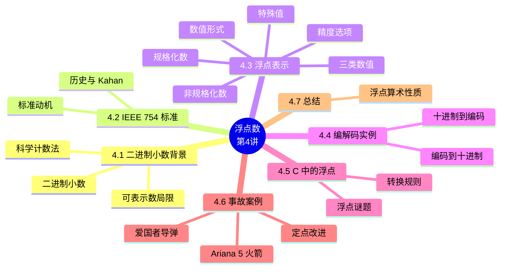

# 浮点数（Floating Point）

> **本章主线**：从科学计数法直觉出发（尾数 × 基数^指数）→ 二进制小数的表示与局限 → IEEE 754 标准的诞生 → 浮点的编码机制（规格化/非规格化/特殊值）→ 编解码实例 → C 中的浮点与转换 → 真实事故案例（Ariana 5、爱国者导弹）→ 总结。
> 一句话版本：**浮点数 = （符号，尾数，阶码）三段式编码**——用有限位宽逼近实数，换来范围与精度的折中，代价是"先精确运算再舍入"，从而违反结合律与分配律。



---

## 4.1 背景：二进制小数（Fractional Binary Numbers）

### 4.1.1 科学计数法与浮点数的直觉

**科学计数法（Scientific Notation）**把一个数分解为三部分：**尾数（mantissa）**、**基（radix / base）**与**指数（exponent，阶码）**。例：

$$6.02 \times 10^{21} \qquad \text{（尾数 6.02，基 10，指数 21）}$$

1. **规格化形式（normalized form）**：小数点前只有**一位非 0 数字**——对给定数，规格化形式**唯一**。
2. **非规格化形式不唯一**：同一个数有多种写法。例：$\frac{1}{1{,}000{,}000{,}000}$
    - 规格化（唯一）：$1.0 \times 10^{-9}$；
    - 非规格化（不唯一）：$0.1 \times 10^{-8}$、$10.0 \times 10^{-10}$。
3. **二进制版本**：基为 2，如 $0.101_2 \times 2^{-10}$——**只要分别编码尾数与指数，就能表示一个浮点数（实数）**。

> 一句话记忆：**浮点数 = 尾数 × 基^指数**，规格化让写法唯一，省下一位隐式的前导 1。

### 4.1.2 二进制小数的表示

二进制小数把"二进制小数点"右侧的位解释为 **2 的负幂**：

$$
b_i b_{i-1} \cdots b_1 b_0 . b_{-1} b_{-2} \cdots b_{-j} = \sum_k b_k \cdot 2^k
$$

权重序列为：$\ldots, 2^2, 2^1, 2^0, 2^{-1}, 2^{-2}, \ldots$

**例子**：

1. $5\frac{3}{4} = \frac{23}{4}$：$101.11_2 = 4 + 1 + \frac{1}{2} + \frac{1}{4}$；
2. $2\frac{7}{8} = \frac{23}{8}$：$010.111_2 = 2 + \frac{1}{2} + \frac{1}{4} + \frac{1}{8}$；
3. $1\frac{7}{16} = \frac{23}{16}$：$001.0111_2 = 1 + \frac{1}{4} + \frac{1}{8} + \frac{1}{16}$。

**三个观察**：

1. **除以 2 = 右移一位**（无符号）；**乘以 2 = 左移一位**；
2. $0.111111\ldots_2$ 无限趋近 1.0：$\frac{1}{2} + \frac{1}{4} + \frac{1}{8} + \cdots \to 1.0$，记为 **$1.0 - \varepsilon$**；
3. 二进制小数与十进制小数**没有一一对应**——很多十进制小数无法用有限二进制表示（见下节）。

### 4.1.3 可表示数的局限

**局限一（精度）**：二进制小数**只能精确表示形如 $x / 2^k$ 的数**；其他有理数产生**循环位模式**：

| 数值 | 二进制表示 |
|---|---|
| $1/3$ | $0.0101010101[01]\ldots_2$ |
| $1/5$ | $0.001100110011[0011]\ldots_2$ |
| $1/10$ | $0.0001100110011[0011]\ldots_2$ |

**局限二（范围）**：在 $w$ 位内**二进制小数点只有一个固定位置**——要么覆盖很大的数，要么覆盖很小的数，**无法同时兼顾**（这就是需要"浮动的小数点"即浮点数的根本原因）。

> 口诀：**定点只能精确到 $x/2^k$，且范围受限；浮点让小数点"漂移"，换来动态范围**。

## 4.2 IEEE 754 标准：为什么需要它

### 4.2.1 历史背景

1. 直到 1980 年代初，**各机器的浮点数格式各不相同**，互相不兼容——机器之间传送数据时带来麻烦；
2. 1970 年代后期，**IEEE 成立委员会**着手制定浮点数标准；
3. **1985 年完成 IEEE 754 标准的制定**——主要贡献者是 **UC Berkeley 数学教授 William Kahan**（被誉为 IEEE 754 之父）；
4. 如今**所有计算机都采用 IEEE 754** 表示浮点数。

### 4.2.2 标准的设计动机

1. **统一标准**：所有主流 CPU 支持；少数 CPU 未完整实现（如早期 GPU、Cell BE 处理器）；
2. **由数值考量驱动**：为舍入、上溢、下溢设计了**良好的标准行为**；
3. **代价**：硬件上**很难做快**——制定标准时，**数值分析专家压过了硬件设计者**。

> 一句话记忆：**IEEE 754 = 数值分析家定规则，硬件工程师吃苦头**——但它换来了跨平台一致的浮点行为。

## 4.3 浮点表示（IEEE Floating Point Representation）

### 4.3.1 数值形式与编码

**数值形式**：

$$
v = (-1)^s \times M \times 2^E
$$

1. **符号位 s**：决定正负；
2. **尾数 M**：通常是 $[1.0, 2.0)$ 区间的小数；
3. **指数 E**：用 2 的幂加权。

**编码（三段式）**：最高位 MSB 是符号位 s；**exp 字段编码 E**（但**不等于** E）；**frac 字段编码 M**（但**不等于** M）：

```
s   exp     frac
1   8 位    23 位    （单精度）
1   11 位   52 位    （双精度）
```

例：$15213_{10} = (-1)^0 \times 1.1101101101101_2 \times 2^{13}$。

### 4.3.2 精度选项

| 格式 | 位数 | 组成（s + exp + frac） | 十进制精度 | 指数范围 |
|---|---|---|---|---|
| 单精度（float） | 32 | 1 + 8 + 23 | ≈ 7 位有效数字 | $10^{\pm 38}$ |
| 双精度（double） | 64 | 1 + 11 + 52 | ≈ 16 位有效数字 | $10^{\pm 308}$ |
| 其他 | 半精度、四精度 | — | — | — |

### 4.3.3 三类数值

根据 exp 字段，浮点数分为三类：

| exp 字段 | frac 字段 | 类别 |
|---|---|---|
| $00\ldots 0$ | 任意 | **非规格化**（denormalized） |
| $\ne 00\ldots 0$ 且 $\ne 11\ldots 1$ | 任意 | **规格化**（normalized） |
| $11\ldots 1$ | 任意 | **特殊值**（special） |

### 4.3.4 规格化数（Normalized Values）

**条件**：$exp \ne 000\ldots 0$ 且 $exp \ne 111\ldots 1$。

1. **指数用偏置（biased）编码**：$E = exp - Bias$，其中 **$Bias = 2^{k-1} - 1$**（$k$ 为指数位数）：
    - 单精度：$Bias = 127$（exp 取 1…254，$E$ 取 -126…127）；
    - 双精度：$Bias = 1023$（exp 取 1…2046，$E$ 取 -1022…1023）。
2. **尾数带隐含前导 1**：$M = 1.xxx\ldots x_2$——xxx…x 即 frac 字段的位：
    - 最小值：frac = 000…0 时 $M = 1.0$；
    - 最大值：frac = 111…1 时 $M = 2.0 - \varepsilon$；
    - **"免费"获得额外一位前导 1**：因为规格化形式的小数点前**总是 1**，故可隐含表示，不占位。

**SP 与 DP 的计算式**：

$$SP:\ v = (-1)^S \times (1 + \text{Significand}) \times 2^{(Exp-127)}$$

$$DP:\ v = (-1)^S \times (1 + \text{Significand}) \times 2^{(Exp-1023)}$$

> 口诀：**规格化 = 隐含前导 1 + 偏置指数**——exp 全 0 与全 1 让位给非规格化与特殊值。

### 4.3.5 非规格化数（Denormalized Values）

**条件**：$exp = 000\ldots 0$。

1. **指数固定**：$E = 1 - Bias$（代替 $exp - Bias$）；
2. **尾数带隐含前导 0**：$M = 0.xxx\ldots x_2$；
3. **两类情况**：
    - $frac = 000\ldots 0$：表示**零值**——注意 **+0 与 -0 是两个不同位模式**（表示不同含义）；
    - $frac \ne 000\ldots 0$：表示**最接近 0.0 的数**，且**等间距（equispaced）**地分布。

**为什么需要非规格化数**：规格化数的最小值是 $1.0 \times 2^{-126}$；非规格化数让数值能平滑过渡到 0（否则 0 与最小规格化数之间会出现巨大的"空洞"，下溢时直接跳到 0 会丢失精度信息）。

### 4.3.6 特殊值（Special Values）

**条件**：$exp = 111\ldots 1$。

1. **$frac = 000\ldots 0$：无穷（$\infty$）**——表示**上溢**的运算结果，正负都有：
    - $1.0 / 0.0 = -1.0 / -0.0 = +\infty$；$1.0 / -0.0 = -\infty$；
2. **$frac \ne 000\ldots 0$：NaN（Not-a-Number）**——表示**无法确定数值**的情形：
    - $\sqrt{-1}$、$\infty - \infty$、$\infty \times 0$。

**编码全景图**（数轴方向，从小到大）：

$$
-\infty \quad \longleftarrow \quad -\text{规格化} \quad \longleftarrow \quad -\text{非规格化} \quad \longleftarrow \quad -0 / +0 \quad \longrightarrow \quad +\text{非规格化} \quad \longrightarrow \quad +\text{规格化} \quad \longrightarrow \quad +\infty
$$

NaN 分布在数轴两端（负无穷左侧与正无穷右侧之外）。

### 4.3.7 三类数值汇总表

| 类别 | exp | E | M | 典型位模式 | 数值 |
|---|---|---|---|---|---|
| 非规格化 | $00\ldots 0$ | $1 - Bias$ | $0.xxx\ldots x_2$ | $00\ldots 0\ 00\ldots 0$ | $\pm 0$ |
| 非规格化 | $00\ldots 0$ | $1 - Bias$ | $0.xxx\ldots x_2$ | $00\ldots 0\ \ne 0$ | 接近 0 的数（等间距） |
| 规格化 | $00\ldots 0$ 与 $11\ldots 1$ 之间 | $exp - Bias$ | $1.xxx\ldots x_2$ | 一般情况 | $(-1)^s \times 1.xxx \times 2^E$ |
| 特殊值 | $11\ldots 1$ | — | — | $11\ldots 1\ 00\ldots 0$ | $\pm \infty$ |
| 特殊值 | $11\ldots 1$ | — | — | $11\ldots 1\ \ne 0$ | NaN |

> 口诀：**exp 全 0 是"贴地飞行"（非规格化），exp 全 1 是"神仙打架"（∞ 与 NaN），中间才是正常范围（规格化）**。

## 4.4 浮点编解码实例

### 4.4.1 十进制 → 浮点编码

**完整例题 1：编码 15213.0（float，单精度）**

**题目陈述**：求 `float F = 15213.0;` 的 32 位 IEEE 754 编码。

**完整解题步骤**（每一步注明依据）：

1. **转二进制**：$15213_{10} = 11101101101101_2$；
2. **规格化**：$= 1.1101101101101_2 \times 2^{13}$（小数点移到第一位 1 之后）；
3. **尾数字段 frac**：取小数点后 23 位——$1101101101101$ 后补 0 到 23 位：$11011011011010000000000_2$（$M = 1.1101101101101_2$，隐含前导 1 不占位）；
4. **指数字段 exp**：$E = 13$，$Bias = 127$，$exp = 13 + 127 = 140 = 10001100_2$；
5. **符号位 s = 0**（正数）。
6. **最终答案**：`0 10001100 11011011011010000000000`。

**完整例题 2：编码 -12.75（float）**

**题目陈述**：求 -12.75 的 IEEE 754 单精度编码（十六进制）。

**完整解题步骤**（每一步注明依据）：

1. **转二进制**：-12.75 整数部分 $12 = 8 + 4 = 1100_2$，小数部分 $0.75 = 0.5 + 0.25 = 0.11_2$；
2. **合并并规格化**：$1100.11_2 = 1.10011_2 \times 2^3$；
3. **指数**：$exp = 127 + 3 = 130 = 1000\ 0010_2$；
4. **尾数 frac**：$10011$ 后补 0 到 23 位：$100\ 1100\ 0000\ 0000\ 0000\ 0000$；
5. **符号位 s = 1**（负数）。
6. **最终答案**：`1100 0001 0100 1100 0000 0000 0000 0000` = **0xC14C0000H**。

> 该例演示的核心技巧/易错点：**编码三步走：转二进制 → 规格化找 E → 拼字段（s + exp + frac）**——exp 是"真指数 + Bias"，frac 是"去掉前导 1 的尾数"。

### 4.4.2 浮点编码 → 十进制

**完整例题 3：解码 BEE00000H**

**题目陈述**：BEE00000H 是某个 IEEE 754 单精度数的十六进制表示，求其十进制值。

**完整解题步骤**（每一步注明依据，公式 $v = (-1)^S \times (1 + \text{Significand}) \times 2^{(Exp-127)}$）：

1. **展开二进制**：$1011\ 1110\ 1110\ 0000\ 0000\ 0000\ 0000\ 0000$；
2. **符号位**：s = 1 → **负数**；
3. **指数**：$exp = 0111\ 1101_2 = 125_{10}$，偏置调整：$E = 125 - 127 = -2$；
4. **尾数**：$M = 1 + 1 \times 2^{-1} + 1 \times 2^{-2} + 0 \times 2^{-3} + \cdots = 1 + 0.5 + 0.25 = 1.75$；
5. **合成**：$v = -1.75 \times 2^{-2} = -0.4375$。
6. **最终答案**：**-0.4375**。

**完整例题 4：解码 0xC0A00000**

**题目陈述**：float 的十六进制表示为 0xC0A00000，求其十进制值。

**完整解题步骤**（每一步注明依据，$Bias = 2^{k-1} - 1 = 127$）：

1. **展开二进制**：$1100\ 0000\ 1010\ 0000\ 0000\ 0000\ 0000\ 0000$；
2. **分段**：s = 1，exp = $1000\ 0001_2 = 129$，frac = $010\ 0000\ldots$；
3. **指数**：$E = exp - Bias = 129 - 127 = 2$；
4. **尾数**：$M = 1.010\ldots_2 = 1 + \frac{1}{4} = 1.25$；
5. **合成**：$v = (-1)^1 \times 1.25 \times 2^2 = -5$。
6. **最终答案**：**-5**。

> 该例演示的核心技巧/易错点：**解码三连问：符号？exp 减 Bias 得 E？frac 前补隐含 1 得 M？**——BEE00000 与 C0A00000 恰好示范了"指数为负"与"指数为正"两种情形。

## 4.5 浮点数在 C 中

### 4.5.1 转换规则

**C 保证两个级别**：`float`（单精度）、`double`（双精度）。

**int/float/double 之间转换会改变位表示**：

1. **double/float → int**：**截断小数部分**（类似向 0 取整）；**越界或 NaN 时行为未定义**（一般置为 TMin）；
2. **int → double**：**精确转换**——只要 int 的字长 ≤ 53 位（double 的有效位）即无损；
3. **int → float**：**按舍入模式舍入**——不会溢出，但可能丢失精度。

**转换方向汇总**（结合 C 语言语义）：

1. `int → float`：不会溢出，但**可能有数据被舍入**；
2. `int/float → double`：因为 double 有效位数更多，**能保留精确值**；
3. `double → float/int`：**可能溢出**，且因有效位数变少**可能被舍入**；
4. `float/double → int`：int 没有小数部分，数据**向 0 方向被截断**。

**long double**：长度与格式随编译器和处理器不同——IA-32 上是 **80 位扩展精度**格式。

> 口诀：**"加宽"多无损（int→double 精确），"收窄"要舍入（→int 截断、→float 舍入）**。

### 4.5.2 浮点谜题（Floating Point Puzzles）

对 `int x = …; float f = …; double d = …;`（假设 d 与 f 均非 NaN），判断以下表达式是否恒真（答案与反例，补充说明/拓展）：

| 表达式 | 恒真？ | 理由 / 反例 |
|---|---|---|
| `x == (int)(float) x` | **假** | float 仅 24 位有效位，大 int 被舍入：$x = 2^{24}+1 = 16777217$ 转 float 得 16777216，转回 int 不等 |
| `x == (int)(double) x` | **真** | double 有 53 位有效位 ≥ 32 位 int，全部可精确表示 |
| `f == (float)(double) f` | **真** | float → double 精确（24 < 53），double → float 舍回原值 |
| `d == (double)(float) d` | **假** | d 精度高于 float，转 float 即舍入丢失（如 d = 0.1） |
| `f == -(-f)` | **真** | IEEE 754 取负只翻转符号位，是精确运算 |

> 口诀：**int 进 double 稳，float 装不下 int；double 降 float 掉精度，取反永远精确**。

## 4.6 真实事故案例：浮点错误的代价

### 4.6.1 Ariana 5 火箭爆炸（转换溢出）

**事故**：1996 年 6 月 4 日，欧洲**阿丽亚娜 5 火箭**首次航行，发射仅 **37 秒**后偏离航线、解体爆炸，火箭上载有价值 **5 亿美元**的通信卫星。

**原因**：在将**一个 64 位浮点数转换为 16 位带符号整数**时产生**溢出异常**——溢出的值是火箭的**水平速率**，比 Ariana 4 所能达到的速率**高出了 5 倍**。设计 Ariana 4 软件时，设计者确认水平速率绝不会超过 16 位整数；而设计 Ariana 5 时**没有重新检查这部分**，直接沿用了旧设计。

**启示**：在不同数据类型之间转换时，往往隐藏着不易察觉的错误，可能带来重大损失——**编程时要非常小心**。

### 4.6.2 爱国者导弹事故（0.1 的表示误差）

**事故**：1991 年 2 月 25 日海湾战争，美国在沙特阿拉伯达摩设置的**爱国者导弹**拦截伊拉克飞毛腿导弹失败，飞毛腿击中美军军营，**28 名士兵死亡**。原因是导弹系统时钟内的软件错误——**浮点数精度问题**。

**问题机理**：爱国者导弹系统内置时钟用计数器实现，**每 0.1 秒计数一次**；程序用 **0.1 的一个 24 位定点二进制小数 x** 乘以计数值，得到以秒为单位的时间。

**完整例题：100 小时运行后的距离误差**

**题目陈述**：已知导弹已连续工作 100 小时，飞毛腿速度约 2000 米/秒，求时钟计算误差导致的距离误差。

**完整解题步骤**（每一步注明依据）：

1. **0.1 的二进制表示是无限循环**：$0.1 = 0.00011[0011]\ldots_2$；
2. **24 位定点近似**：$x = 0.000\ 1100\ 1100\ 1100\ 1100\ 1100_B$（截断到 24 位）；
3. **单次误差**：$0.1 - x = 0.000\ 0000\ 0000\ 0000\ 0000\ 0000\ 1100\ [1100]\ldots_B = 2^{-20} \times 0.1 \approx 9.54 \times 10^{-8}$ 秒/次；
4. **100 小时 = 计数次数**：$100 \times 60 \times 60 \times 10 = 36 \times 10^5$ 次；
5. **总时钟偏差**：$9.54 \times 10^{-8} \times 36 \times 10^5 \approx 0.343$ 秒；
6. **距离误差**：$2000 \times 0.343 \approx 687$ 米。
7. **最终答案**：约 **687 米**——飞毛腿导弹足以落在偏差 687 米的军营里。

### 4.6.3 改进方案的对比计算

**方案 A：用 float 表示 0.1**

1. 规格化：$0.1 = 1.10011001100110011001100_2 \times 2^{-4}$，机器数为 `0 0111101 1 100 1100 1100 1100 1100 1100`（float 仅 **24 位有效位**，后续位被截断）；
2. 误差：$|x - 0.1| = 2^{-24} \times 0.1 \approx 5.96 \times 10^{-9}$；
3. 100 小时后时钟偏差：$5.96 \times 10^{-9} \times 36 \times 10^5 \approx 0.0215$ 秒；
4. 距离偏差：$0.0215 \times 2000 \approx 43$ 米——**比爱国者系统精确约 16 倍**。

**方案 B：用 32 位二进制定点表示 0.1**（$x = 0.000\ 1100\ 1100\ 1100\ 1100\ 1100\ 1100\ 1101_B$）

1. 误差：$|x - 0.1| = 2^{-30} \times 0.1 \approx 9.31 \times 10^{-11}$；
2. 100 小时后时钟偏差：$9.31 \times 10^{-11} \times 36 \times 10^5 \approx 0.000335$ 秒；
3. 距离偏差：$0.000335 \times 2000 \approx 0.67$ 米。

**三种方案对比表**：

| 方案 | 单次误差 | 100 小时偏差 | 距离误差 |
|---|---|---|---|
| 24 位定点（爱国者实况） | $2^{-20} \times 0.1 \approx 9.54\times10^{-8}$ | ≈ 0.343 秒 | ≈ 687 米 |
| float（24 位有效位） | $2^{-24} \times 0.1 \approx 5.96\times10^{-9}$ | ≈ 0.0215 秒 | ≈ 43 米 |
| 32 位定点 | $2^{-30} \times 0.1 \approx 9.31\times10^{-11}$ | ≈ 0.000335 秒 | ≈ 0.67 米 |

**结论与启示**：

1. **32 位定点表示 0.1 比 float 精度高 64 倍**；
2. **float 计算更慢**：必须先把计数值转换为 IEEE 754 格式浮点数，再对两个 IEEE 754 数相乘——比直接二进制数相乘慢得多；
3. **启示**：
    - 程序员应对**底层机器级数据的表示与运算**有深刻理解；
    - 计算机世界里经常"**差之毫厘，失之千里**"，需要细心再细心、精确再精确；
    - **不能遇到小数就用浮点数**——当需要用一个整数变量乘以一个确定的小数常量时，可先用一个确定的**定点整数**与整数变量相乘，**再通过移位运算来确定小数点**。

> 口诀：**能定点就定点，移位补小数点；差之毫厘失之千里，先算精度再谈速度**。

## 4.7 总结：浮点算术的性质

1. **IEEE 浮点具有清晰的数学性质**：表示形如 $M \times 2^E$ 的数；
2. **可脱离实现进行推理**：运算仿佛"**先以完美精度计算，再舍入**"；
3. **但不同于实数算术**：
    - **违反结合律与分配律**（回顾课程导论"现实一"：$(x+y)+z \ne x+(y+z)$ 的浮点版本）；
    - 给编译器与严肃数值应用程序员**带来麻烦**。

**课堂练习**（需掌握）：CS:APP 教材习题 **2.47、2.54**。

## 知识定位与框架衔接

### 前置知识（地基）

1. **第 2、3 讲（位、字节与整数）**：位模式、补码、移位、溢出——浮点编码是同一套"位模式 + 解释"哲学的延续，只是把编码空间分给了符号/指数/尾数三段。
2. **课程导论"现实一"**：整数不是整数、浮点不是实数——本讲完整给出浮点"不是实数"的技术根源（有限有效位 + 舍入 + 特殊值）。

### 后置知识（上层建筑）

1. **datalab 实验（L1）**：浮点部分的位操作题目（如用整数运算实现浮点比较）直接依赖本讲的编码结构。
2. **机器级编程（第 5 讲起）**：x86 的 SSE/AVX 浮点指令、浮点寄存器与内存布局（小端/大端）都以 IEEE 754 编码为前提。
3. **数值计算与安全**：浮点舍入误差的累积（如爱国者导弹）是科学计算与关键系统的经典教训；CS:APP 习题 2.47、2.54 是本讲的巩固练习。

### 本讲在整个课程中的位置（编码金字塔比喻）

如果说整数是"精确的位模式算术"，浮点数就是**"带刻度的量尺"**——它用有限位宽换来从 $10^{-38}$ 到 $10^{38}$ 的动态范围，代价是**每个数都可能"差一点"**。本讲是整门课的**"精度与范围的权衡教科书"**：前半部分（编码）回答"浮点数长什么样"，后半部分（转换、案例）回答"什么时候会出错、错得多离谱"。把 **"先精确后舍入"** 与 **"三段式编码"** 两句话刻进脑子，后续所有涉及浮点的话题都能归位。

### 核心灵魂问题（学完本讲应能回答）

1. **为什么规格化数要隐含前导 1，而非规格化数要隐含前导 0？** ——规格化数的小数点前**总是 1**，隐含表示省一位有效位（"免费"精度）；非规格化数用于填补 0 附近的最小值，只能以 0 开头，保证向 0 的平滑过渡与等间距分布。
2. **为什么 exp 全 0 表示非规格化、全 1 表示特殊值，而不是直接参与正常范围？** ——这是"用两个极端编码换三种语义"的设计：全 1 编码 ∞ 与 NaN（处理溢出与未定义结果），全 0 编码 0 与最小数（保证渐进下溢），中间留给常规规格化数。
3. **0.1 为什么不能精确表示？爱国者导弹的 687 米误差是怎么累积出来的？** ——0.1 的二进制是无限循环小数，任何有限位表示都是近似；误差虽然单次仅 $10^{-8}$ 量级，但乘以 $3.6 \times 10^6$ 次计数后放大到 0.343 秒、再乘以 2000 米/秒的速度就成了致命的 687 米——**小误差 × 大次数 = 大灾难**。
4. **为什么浮点不满足结合律？"先精确后舍入"如何解释？** ——每个中间结果都先按精确值计算、再舍入到目标精度；$(a+b)+c$ 与 $a+(b+c)$ 的**舍入时机不同**，两个"精确中间值"被舍入到不同结果，故通常不相等。

> **一句话总结本讲**：**浮点 = （符号，偏置阶码，隐含前导 1 的尾数）三段编码，三类数值分工（规格化管正常、非规格化管贴 0、特殊值管 ∞ 与 NaN）**；运算"先精确后舍入"，所以浮点不等于实数；0.1 这类无限循环小数是精度事故的永恒温床，能定点就不浮点。

---

## 课件 PDF

<iframe src="https://naimore3.github.io/Naimore3-s-Learning-Notes/课程笔记/大二上/计算机系统基础/float/04-float.pdf" width="100%" height="800px" style="border: none;"></iframe>

[打开 PDF](https://naimore3.github.io/Naimore3-s-Learning-Notes/课程笔记/大二上/计算机系统基础/float/04-float.pdf)
