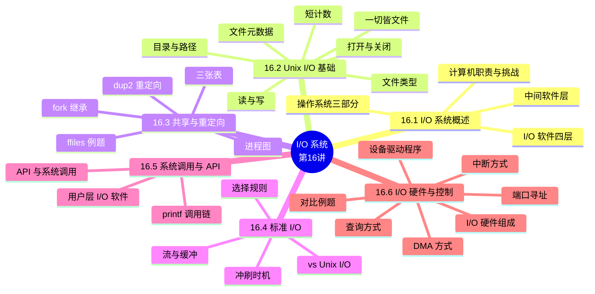

# I/O 系统（I/O Systems）

> **本章主线**：I/O 系统概述（OS 的中间层角色、四层 I/O 软件）→ Unix I/O 基础（一切皆文件、打开/关闭/读/写、短计数、元数据）→ 文件共享与重定向（描述符表/fork/dup2）→ 标准 I/O（流与缓冲）→ 系统调用与 API → I/O 硬件与控制方式（程序查询/中断/DMA）→ 小结。
> 一句话版本：**I/O = 数据在设备与内存之间的搬运**——软件层用"文件"统一抽象一切设备，硬件层用"查询/中断/DMA"三种方式搬运数据；用户程序永远通过系统调用间接访问硬件。



---

## 16.1 I/O 系统概述

### 16.1.1 计算机的职责与 I/O 的挑战

**计算机的职责是处理数据**：计算机（CPU、缓存、内存）负责计算，同时要在 **I/O 设备与内存之间搬运数据**。

**I/O 设备的挑战**：

1. **种类繁多**：存储、网络、显示等不同类别；
2. **需要支持大量设备驱动程序**；
3. **驱动程序运行在内核态，可能使系统崩溃**。

**应对**：I/O 设备通过**端口（port）、总线（bus）、设备控制器（controller）**连接；**设备驱动程序封装设备细节**，向 I/O 子系统呈现**统一设备访问接口**。

### 16.1.2 操作系统的三部分与五大功能

**操作系统的三个组成部分**：

1. **内核**：操作系统**五大管理功能**都由内核负责；
2. **外壳**：接收用户操作、提供交互界面——一般用户界面有两种（**文本界面**与 **GUI 图形界面**），程序员接口是 **API**；
3. **管理工具和附属软件**：OS 发布时附带的工具。

**操作系统的五大管理功能**：**处理器管理**（CPU 的控制与管理）、**存储器管理**（内存分配与管理）、**设备管理**（外部设备控制与管理）、**文件管理**、**作业管理和控制**（含用户接口）。

### 16.1.3 操作系统在程序执行过程中的作用

以 hello 程序为例（回顾）：

1. **Shell 进程生成子进程**，子进程调用 **execve 系统调用**启动加载器，装入 Hello 程序并跳转到第一条指令执行；
2. **Hello 本身不直接访问键盘、显示器、磁盘和主存等硬件**，而是依靠 **OS 提供的服务间接访问**——例如 `printf()` 函数最终调出**内核服务程序**访问硬件；
3. **操作系统是应用程序和硬件之间的中间软件层**。

**操作系统的两大作用**：

1. **硬件资源管理**（两个目的）：**统筹安排和调度硬件资源**，防止硬件资源被用户程序滥用；对广泛使用的复杂低级设备，为用户程序提供**简单一致的使用接口**；
2. **为用户（最终用户、用户程序）使用系统提供一个操作接口**。

**I/O 请求如何传递给 OS**：最终用户通过键盘、鼠标经**操作界面**；用户程序通过**函数（高级语言）转换为系统调用**。**大部分 I/O 软件属于操作系统内核态程序，最初的 I/O 请求在用户程序中提出**。

### 16.1.4 I/O 软件的四层结构

**I/O 软件被组织成从高到低的四个层次**（越低越接近设备、越远离用户程序）：

1. **用户层 I/O 软件**（I/O 函数调用系统调用）；
2. **与设备无关的操作系统 I/O 软件**；
3. **设备驱动程序**；
4. **I/O 中断处理程序**。

**关键机制**：从用户 I/O 软件切换到内核 I/O 软件的唯一办法是 **"异常"机制：系统调用（自陷）**。

> 口诀：**I/O 请求起于用户态，终于内核态——中间靠系统调用（自陷）跨越边界**。

## 16.2 Unix I/O 基础（Unix I/O）

### 16.2.1 一切皆文件

**Linux 文件是 m 字节的序列**：$B_0, B_1, \ldots, B_k, \ldots, B_{m-1}$。

**酷事实：所有 I/O 设备都表示为文件**：

1. `/dev/sda2`（/usr 磁盘分区）；
2. `/dev/tty2`（终端）；
3. **甚至内核也表示为文件**：`/boot/vmlinuz-3.13.0-55-generic`（内核镜像）、`/proc`（内核数据结构）。

**文件到设备的优雅映射**使内核能导出一个简单的接口——**Unix I/O**：

1. **打开和关闭文件**：`open()` 与 `close()`；
2. **读写文件**：`read()` 与 `write()`；
3. **改变当前文件位置（寻址）**：`lseek()`——指明下一次读或写进入文件的偏移（**当前文件位置**）。

### 16.2.2 文件类型与文本文件

**每个文件有一个类型**，指示其在系统中的角色：

1. **普通文件（regular file）**：包含任意数据；
2. **目录（directory）**：相关文件组的索引；
3. **套接字（socket）**：与另一台机器上的进程通信。

**其他类型**（超出范围）：命名管道（FIFO）、符号链接、字符与块设备。

**普通文件**：应用常区分**文本文件**（只含 ASCII 或 Unicode 字符）与**二进制文件**（其他一切，如目标文件、JPEG 图像）——但**内核不知道两者的区别**！

**文本行与行尾（EOL）**：

1. 文本文件是文本行的序列；文本行是以换行符 `'\n'` 结尾的字符序列（`\n` 是 0xa，即 ASCII 换行符 LF）；
2. **行尾表示**：Linux 与 Mac OS 用 `'\n'`（0xa，LF）；**Windows 与 Internet 协议用 `'\r\n'`（0xd 0xa，CR+LF）**——跨平台处理文本时要注意。

### 16.2.3 目录层次与路径名

**目录**由**链接数组**组成，每个链接把**文件名映射到一个文件**；每个目录至少含两个条目：**`.`**（指向自身）与 **`..`**（指向父目录）。目录操作命令：`mkdir`（建空目录）、`ls`（查看）、`rmdir`（删除空目录）。

**目录层次**：所有文件组织成以根目录 **`/`** 为锚的层次结构；**内核为每个进程维护当前工作目录（cwd）**，用 `cd` 命令修改。

**路径名（pathname）**：

1. **绝对路径名**：以 `/` 开头，表示从根出发的路径，如 `/home/droh/hello.c`；
2. **相对路径名**：表示从当前工作目录出发的路径，如 `../droh/hello.c`。

### 16.2.4 打开与关闭文件

**打开文件**（告知内核准备访问该文件）：

```c
int fd;  /* 文件描述符 */
if ((fd = open("/etc/hosts", O_RDONLY)) < 0) {
    perror("open");
    exit(1);
}
```

1. 返回一个小的整数标识——**文件描述符（file descriptor）**；`fd == -1` 表示出错；
2. **每个由 Linux shell 创建的进程一开始就与终端关联三个打开文件**：**0 = 标准输入（stdin）、1 = 标准输出（stdout）、2 = 标准错误（stderr）**。

**关闭文件**（告知内核完成访问）：`close(fd)`；**在线程程序中关闭一个已关闭的文件是灾难的根源**；**教训：总是检查返回码**——即使是对 `close()` 这类看似温和的函数。

### 16.2.5 读与写文件

**读文件**（把字节从当前文件位置复制到内存，然后更新位置）：

```c
char buf[512];
int fd, nbytes;
if ((nbytes = read(fd, buf, sizeof(buf))) < 0) {
    perror("read");
    exit(1);
}
```

1. 返回从 fd 读入 buf 的字节数——返回类型 `ssize_t` 是**有符号整数**；`nbytes < 0` 表示出错；
2. **短计数（short count）是可能的，且不是错误**：`nbytes < sizeof(buf)` 完全合法。

**写文件**（把字节从内存复制到当前文件位置，然后更新位置）：`write(fd, buf, n)`；同样**短计数可能且不是错误**。

**简单示例：逐字节复制 stdin 到 stdout**：

```c
while (Read(STDIN_FILENO, &c, 1) != 0)
    Write(STDOUT_FILENO, &c, 1);
```

### 16.2.6 短计数的发生场景

**短计数会发生在**：

1. **读时遇到 EOF（文件结尾）**；
2. **从终端读文本行**；
3. **读写网络套接字**。

**短计数绝不会发生在**：

1. **读磁盘文件**（除 EOF 外）；
2. **写磁盘文件**。

**最佳实践**：**始终允许短计数的可能性**。

### 16.2.7 文件元数据（Metadata）

**元数据是关于数据的数据**——内核维护的每文件元数据，用 `stat` 与 `fstat` 函数访问。`struct stat` 关键字段：

| 字段 | 含义 |
|---|---|
| st_dev / st_ino | 设备 / **inode 号** |
| st_mode | **保护位与文件类型** |
| st_nlink | **硬链接数** |
| st_uid / st_gid | 属主用户 ID / 属组 ID |
| st_rdev | 设备类型（若为 inode 设备） |
| st_size | 总大小（字节） |
| st_blksize / st_blocks | 文件系统 I/O 块大小 / 已分配的块数 |
| st_atime / st_mtime / st_ctime | 最后访问时间 / 最后修改时间 / 最后更改时间 |

## 16.3 文件共享与重定向

### 16.3.1 内核如何表示打开文件

内核用**三张表**表示打开文件：

1. **描述符表（descriptor table）**：**每个进程一张**——每个打开的描述符指向打开文件表的一个条目；
2. **打开文件表（open file table）**：**所有进程共享**——每个条目含**文件位置（file pos）**与**引用计数（refcnt）**；
3. **v-node 表（v-node table）**：**所有进程共享**——每个条目含**文件访问权限、文件大小、文件类型**等（对应 stat 结构）。

**要点**：**文件位置按"打开文件"维护，而不是按进程**——同一进程两个描述符指向同一文件时，各自有独立位置。

### 16.3.2 文件共享的两种方式

**方式一：两个描述符通过两个不同的打开文件表项共享同一磁盘文件**——例如**用同一文件名调用 open 两次**。此时两个描述符**逻辑不同（各自的文件位置独立）**，但**物理上是同一个文件**。

**方式二：fork 后父子进程共享**——见下节。

### 16.3.3 fork 与进程图

**创建进程：fork()**：

1. `int fork(void)`：**返回 0 给子进程，返回子进程 PID 给父进程**；
2. **子进程几乎与父进程相同**：获得父进程虚拟地址空间的**相同（但独立）副本**；获得父进程**打开文件描述符的相同副本**；**PID 不同**；
3. **fork 有趣（也常令人困惑）的原因：调用一次，返回两次**。

**进程图（process graph）**是刻画并发程序中语句**偏序**的工具：

1. 每个顶点是一条语句的执行；$a \rightarrow b$ 表示 $a$ 在 $b$ 之前发生；
2. 边可标注变量的当前值；printf 顶点可标注输出；
3. 每个图以**无入边的顶点**开始；
4. 图的**任意拓扑排序**对应一个可行的全序。

**fork 示例**（fork.c：x=1，子进程 ++x，父进程 --x）：输出**顺序不确定**，两种合法结果：

```
parent: x=0       或       child : x=2
child : x=2               parent: x=0
```

**进程图分析**：`main → fork → (child: printf→exit) | (parent: printf→exit)`。可行全序如 `a b e c f d`；不可行全序如 `a b f c e d`（f 是父的 printf，e 是子的 printf，二者无依赖可互换，但每条边方向必须从左到右）。

**fork 后文件共享**：**子进程继承父进程的打开文件**（exec 不改变这种关系，可用 `fcntl` 改变）——fork 后子进程的描述符表与父进程相同，且**打开文件表中每个相关条目 refcnt +1**（同一打开文件表项被父子共享，**文件位置也被共享**）。

### 16.3.4 I/O 重定向：dup2

**问题**：shell 如何实现 I/O 重定向 `ls > foo.txt`？

**答案**：调用 **`dup2(oldfd, newfd)`**——把（每进程的）描述符表项 oldfd **复制**到表项 newfd。

**重定向例子**（`dup2(4, 1)`）：

- 描述符表 before：fd 1 → 打开文件表项 a（终端）；fd 4 → 打开文件表项 b（磁盘文件）；
- 描述符表 after：fd 1 → **b**（fd 4 所指）；fd 4 → b；
- 原文件表项 a 的 **refcnt 从 1 减为 0**（关闭）；文件表项 b 的 **refcnt 从 1 增为 2**。

**Shell 重定向实现步骤**：

1. **Step #1**：打开 stdout 应重定向到的文件（在子进程执行 shell 代码时、exec 之前）——fd 4 指向磁盘文件 B；
2. **Step #2**：调用 `dup2(4, 1)`——使 fd=1（stdout）指向 fd=4 所指的磁盘文件；此后写到 stdout 的内容进入文件 B。

### 16.3.5 完整例题：ffiles1（dup2 与共享位置）

**题目陈述**：文件内容为 `"abcde"`，程序如下，输出什么？

```c
fd1 = Open(fname, O_RDONLY, 0);
fd2 = Open(fname, O_RDONLY, 0);
fd3 = Open(fname, O_RDONLY, 0);
Dup2(fd2, fd3);
Read(fd1, &c1, 1);
Read(fd2, &c2, 1);
Read(fd3, &c3, 1);
printf("c1 = %c, c2 = %c, c3 = %c\n", c1, c2, c3);
```

**完整解题步骤**（每一步注明依据——三个 open 各建独立打开文件表项，`dup2(fd2, fd3)` 使 fd3 与 fd2 **共享同一打开文件表项与文件位置**）：

1. 三次 `Open` 同一文件名 → fd1、fd2、fd3 各自指向**独立**的打开文件表项，各自文件位置均为 0；
2. `Dup2(fd2, fd3)` → fd3 的表项被覆盖为 fd2 的表项——**fd2 与 fd3 共享文件位置**；
3. `Read(fd1, &c1, 1)`：fd1 位置 0 → 读得 `'a'`，fd1 位置变为 1；
4. `Read(fd2, &c2, 1)`：fd2 位置 0 → 读得 `'a'`，fd2（及 fd3）位置变为 1；
5. `Read(fd3, &c3, 1)`：fd3 与 fd2 共享位置（现在是 1）→ 读得 `'b'`，位置变为 2；
6. **最终答案**：`c1 = a, c2 = a, c3 = b`。

> 该例演示的核心技巧/易错点：**dup2 之后两个描述符共用"文件位置"**——fd3 的第一次读取发生在位置 1 而不是 0，因为 fd2 已经推进了共享位置。

### 16.3.6 完整例题：ffiles2（fork 与共享位置）

**题目陈述**：文件内容为 `"abcde"`，程序如下，输出有哪几种可能？

```c
int s = getpid() & 0x1;
fd1 = Open(fname, O_RDONLY, 0);
Read(fd1, &c1, 1);
if (fork()) {          /* Parent */
    sleep(s);
    Read(fd1, &c2, 1);
    printf("Parent: c1 = %c, c2 = %c\n", c1, c2);
} else {               /* Child */
    sleep(1 - s);
    Read(fd1, &c2, 1);
    printf("Child: c1 = %c, c2 = %c\n", c1, c2);
}
```

**完整解题步骤**（每一步注明依据——fork 后父子**共享 fd1 的打开文件表项，即共享文件位置**；`s = getpid() & 1` 随机为 0 或 1，决定谁先睡醒）：

1. `Read(fd1, &c1, 1)`：位置 0 → c1 = `'a'`，位置变为 1；
2. `fork()`：父与子共享 fd1（位置 1）；
3. 若 `s = 1`（父睡 1 秒、子睡 0 秒）→ **子先醒**：子读得 `'b'`（位置 2），父随后读得 `'c'`；
4. 若 `s = 0`（父睡 0 秒、子睡 1 秒）→ **父先醒**：父读得 `'b'`，子随后读得 `'c'`；
5. **最终答案**：两种可能输出——

```
Child:  c1 = a, c2 = b       或       Parent: c1 = a, c2 = b
Parent: c1 = a, c2 = c               Child:  c1 = a, c2 = c
```

> 该例演示的核心技巧/易错点：**fork 共享文件位置，谁先读谁拿 'b'**——两个进程的读取不是各自从位置 0 开始，而是从同一个推进中的位置继续。

### 16.3.7 完整例题：ffiles3（重定向与 O_APPEND）

**题目陈述**：依次执行下列写操作后，文件内容是什么？

```c
fd1 = Open(fname, O_CREAT|O_TRUNC|O_RDWR, S_IRUSR|S_IWUSR);
Write(fd1, "pqrs", 4);
fd3 = Open(fname, O_APPEND|O_WRONLY, 0);
Write(fd3, "jklmn", 5);
fd2 = dup(fd1);            /* 分配一个描述符 */
Write(fd2, "wxyz", 4);
Write(fd3, "ef", 2);
```

**完整解题步骤**（每一步注明依据——fd1 与 fd2 共享打开文件表项与位置；fd3 是独立表项且 **O_APPEND 使每次写都从文件末尾开始**）：

1. `Write(fd1, "pqrs", 4)`：文件 = `pqrs`，fd1 位置 = 4；
2. `Open(O_APPEND|O_WRONLY)`：fd3 独立表项，每次写自动定位到文件末尾；
3. `Write(fd3, "jklmn", 5)`：从末尾（位置 4）追加 → 文件 = `pqrsjklmn`，长度 9；
4. `fd2 = dup(fd1)`：fd2 与 fd1 **共享位置 4**；
5. `Write(fd2, "wxyz", 4)`：**从位置 4 覆盖写**——`jklm` 被 `wxyz` 覆盖 → 文件 = `pqrswxyzn`（保留末尾的 `n`），长度 9；
6. `Write(fd3, "ef", 2)`：O_APPEND 从末尾（位置 9）追加 → 文件 = `pqrswxyznef`。
7. **最终答案**：**`pqrswxyznef`**。

> 该例演示的核心技巧/易错点：**dup 共享位置意味着"覆盖写"；O_APPEND 每次写都追加**——两者叠加会产生"中间被改写、尾部被追加"的混合结果。

## 16.4 标准 I/O（Standard I/O）

### 16.4.1 标准 I/O 函数与流

**C 标准库（libc.so）**包含一组更高级的标准 I/O 函数（K&R 附录 B 有文档）：

1. 打开与关闭：`fopen` 与 `fclose`；
2. 读写字节：`fread` 与 `fwrite`；
3. 读写文本行：`fgets` 与 `fputs`；
4. 格式化读写：`fscanf` 与 `fprintf`。

**流（stream）**：标准 I/O 把打开的文件建模为**流**——它是**文件描述符与内存中的缓冲区**的抽象。C 程序开始运行时有三个打开的流（定义在 stdio.h）：**stdin**（描述符 0）、**stdout**（描述符 1）、**stderr**（描述符 2）。

### 16.4.2 缓冲 I/O 的动机

1. 应用经常**一次读/写一个字符**：`getc`、`putc`、`ungetc`、`gets`、`fgets`（逐字符读文本行直到换行）；
2. 若用 Unix I/O 实现则**非常昂贵**：每次 `read`/`write` 都要内核调用——**超过 10,000 个时钟周期**；
3. **解决方案：缓冲读**——用一次 Unix `read` 抓取一整块字节，用户输入函数**从缓冲区一次取一个字节**，缓冲区空了再重新填充。

**缓冲冲刷时机**：缓冲区在遇到 `'\n'`、调用 `fflush`、调用 `exit`、或从 `main` 返回时被冲刷到输出描述符——例如六个 `printf("h")...printf("\n")` 最终合并为一次 `write(1, buf, 6)`。

**用 strace 亲见缓冲**：

```
write(1, "hello\n", 6) = 6
```

6 个 printf 只产生**一次** `write` 系统调用。

### 16.4.3 标准 I/O vs Unix I/O

**标准 I/O 基于底层 Unix I/O 实现**：

```
fopen/fread/fwrite/fscanf/fprintf/fgets/fputs/fflush/fseek/fclose
        ↓ （内部调用）
open/read/write/lseek/stat/close   （通过系统调用访问）
```

### 16.4.4 用户层 I/O 的两种请求方式

**方式一：高级语言的标准 I/O 库函数**（fopen/fread/fwrite/fclose；printf/putc/scanf/getc）——**程序移植性很好**，但有以下不足：

1. 不能保证文件安全性（**无加/解锁机制**）；
2. 所有 I/O 都是**同步**的——程序必须等 I/O 完成才能继续；
3. 有时不适合甚至无法使用——如**不提供读取文件元数据的函数**（文件大小、创建时间等）；
4. 用于**网络编程容易造成缓冲区溢出**等风险。

**方式二：OS 提供的 API 函数或系统调用**——Windows 用 `CreateFile`、`ReadFile`、`WriteFile`、`CloseHandle`、`ReadConsole`、`WriteConsole`；Unix/Linux 用 `open`、`read`、`write`、`close` 等系统调用封装函数。

### 16.4.5 优缺点对比与选择规则

| 维度 | 标准 I/O | Unix I/O |
|---|---|---|
| 效率 | **缓冲**减少 read/write 系统调用次数 | 最通用、**最低开销** |
| 短计数 | **自动处理** | 处理**棘手易错** |
| 文本行读取 | 封装好 | 需要自己缓冲，棘手易错 |
| 元数据 | **不提供**访问函数 | **提供**（stat/fstat） |
| 信号安全 | 非 async-signal-safe，**不适合信号处理器** | **async-signal-safe**，可用于信号处理器 |
| 网络套接字 | **不适合**（流与套接字限制交互差） | 适合 |

**选择规则（通用规则：用你能用的最高层 I/O 函数）**：

1. **标准 I/O**：处理**磁盘或终端文件**时使用；
2. **原始 Unix I/O**：在**信号处理器内部**（async-signal-safe）使用；极少数需要**绝对最高性能**时使用。

> 口诀：**磁盘终端用标准 I/O，信号处理器与极限性能才碰 Unix I/O**。

**二进制文件禁忌**：绝不在二进制文件上使用**面向文本的 I/O**（fgets、scanf——会解释 EOL 字符）与**字符串函数**（strlen、strcpy、strcat——把字节值 0 当作字符串结束符）。

## 16.5 系统调用与 API（用户 I/O 软件）

### 16.5.1 API 与系统调用的关系

1. **OS 提供一组系统调用**，为用户进程的 I/O 请求进行具体 I/O 操作；
2. **API 与系统调用概念上不完全相同**：API 是**功能更广泛、抽象程度更高**的编程接口；系统调用**仅指通过软中断（自陷）指令向内核态发出特定服务请求的函数**；
3. **系统调用封装函数是 API 函数中的一种**；
4. **API 函数最终通过调用系统调用实现 I/O**：一个 API 可能调用多个系统调用；不同 API 可能调用同一个系统调用；**但并非所有 API 都需要调用系统调用**；
5. **从编程者看**：API 与系统调用没有差别；**从内核设计者看差别很大**——API 与系统调用封装函数在**用户态**执行，但具体**服务例程在内核态**执行。

### 16.5.2 printf → sys_write 的完整调用链

以 `printf("hello, world\n")` 为例（进程 p）：

```
用户空间（用户态）：main() → printf() → write()  [内含 int $0x80 陷阱指令]
                                                ↓ 系统调用（自陷）
内核空间（内核态）：system_call() → sys_write()
```

1. 用户程序中涉及 I/O 操作的函数最终被转换为**与具体机器架构相关的指令序列（I/O 请求指令序列）**；
2. 每个指令系统都有**陷阱指令**（又称软中断指令、系统调用指令）——为 OS 提供灵活的系统调用机制；
3. 在 I/O 请求指令序列中，具体 I/O 请求被转换为**一条陷阱指令**，陷阱指令前面是**系统调用参数的设置指令**；
4. **字符串输出最终由内核中的 sys_write 系统调用服务例程实现**；sys_write 可用三种 I/O 方式实现：**程序查询、中断和 DMA**（见 16.6）。

### 16.5.3 用户空间 I/O 软件与 spooling

**I/O 软件不只在内核**：库例程与用户程序链接、辅助程序在内核外运行——库例程把参数传给系统调用或做更多工作（`printf("%d : %s, %ld\n", ...)`、C++ 的 `<<`/`>>`）。

**Spooling 系统**：守护进程从 spooling 目录读作业并送给打印机（受保护的设备，**只有 spooler 能访问**）；spooling 也可用于网络、邮件系统等。

**I/O 软件五层总览**：

| 层次 | 职责 |
|---|---|
| 用户进程 | 产生 I/O 调用、格式化、spool |
| 设备无关软件 | 命名、保护、阻塞、缓冲、分配 |
| 设备驱动程序 | 控制设备寄存器、状态 |
| 中断处理程序 | I/O 任务完成后唤醒驱动程序 |
| 硬件 | 执行 I/O |

## 16.6 I/O 硬件与控制方式

### 16.6.1 I/O 硬件的组成与寄存器

**I/O 硬件建立了外设与主机之间的"通路"**：主机 → I/O 总线（桥）→ 设备控制器 → 电缆 → 外设。

**关键概念**：

1. **端口（port）**：设备的连接点；
2. **总线（bus）**：计算机内部组件之间传数据的线——菊花链或共享直连；
3. **设备控制器（device controller）**：使设备能和外设总线对话的硬件；把 OS 的简单指令翻译为设备动作——例：磁盘控制器把"访问扇区 23"翻译成"磁头从盘片边缘移动 1.672725272 cm"，并向 OS "宣传"磁盘参数、隐藏内部几何结构（现代硬盘控制器是物理设备上的芯片）；
4. **主机适配器（host adapter）**：使计算机能与外设对话的硬件（有时独立电路板，含处理器、微码、私有内存、总线控制器）。

**设备寄存器**：设备通常有寄存器供设备驱动程序放置命令、地址、数据，或从中读数据——**Data-in 寄存器、Data-out 寄存器、状态（status）寄存器、控制（control）寄存器**；通常 1-4 字节或 FIFO 缓冲。

**设备地址的两种使用方式**：

1. **直接 I/O 指令**；
2. **内存映射 I/O（memory-mapped I/O）**：设备数据和命令寄存器映射到处理器地址空间——特别适合大地址空间（如图形）。

**设备控制器的结构**：设备控制器又称 I/O 控制器、I/O 模块、I/O 接口——通过发送**命令字**到 I/O 控制寄存器发命令；通过读**状态寄存器**获取状态；通过发送/读取数据与外设交换；**CPU 能访问的各类寄存器称为 I/O 端口**；对外设的访问通过向 I/O 端口发命令、读状态、读/写数据来进行。

### 16.6.2 I/O 端口的两种寻址方式

1. **统一编址方式（内存映射方式）**：与主存空间**统一编址**，主存单元和 I/O 端口在同一地址空间（把 I/O 端口映射到某主存区域）——如 **RISC 机器、Motorola** 处理器；**VRAM（显示存储器）通常也与主存统一编址**；
2. **独立编址方式（特殊 I/O 指令方式）**：**单独编号**，成为独立的 I/O 地址空间（需专门 I/O 指令）——如 **Intel 与 Zilog** 处理器。

> 口诀：**统一编址"借"内存地址，独立编址"自备"I/O 指令**。

### 16.6.3 设备驱动程序与 I/O 指令

1. 控制外设进行输入/输出的**底层 I/O 软件是设备驱动程序**；
2. 驱动程序的设计者需了解设备控制器与设备的工作原理：控制器中有哪些**可访问寄存器**、**控制/状态寄存器中每一位的含义**、控制器与外设之间的**通信协议**——而**外设的机械特性无需了解**；
3. 驱动程序通过访问 I/O 端口控制外设：**将控制命令送到控制寄存器**启动外设；**读取状态寄存器**了解状态；**访问数据缓冲寄存器**进行数据输入输出；
4. **对 I/O 端口的访问由 I/O 指令完成，它们是特权指令**——同样，"开中断""关中断"等指令也是特权指令，只能在操作系统内核程序中使用。

### 16.6.4 三种 I/O 控制方式

1. **程序查询 I/O（Programmed I/O / Polling）**：需要**处理器的持续关注**（无条件传输方式、查询方式）；
2. **中断驱动 I/O（Interrupt driven I/O）**：处理器**启动 I/O 后可以继续**，直到被中断打断；
3. **直接内存访问（DMA）**：**DMA 模块**管理 I/O 单元与主存之间的数据交换。

### 16.6.5 程序查询（Polling）方式

**基本思想**：I/O 设备（含设备控制器）把状态放入**状态寄存器**（打印缺纸、打印机忙、未就绪等）；**OS 阶段性查询状态寄存器中的特定状态**来决定下一步动作——未"就绪"就一直"等待"。

**sys_write 打印的程序段**（示例）：

```c
copy_string_to_kernel(strbuf, kernelbuf, n);   /* 将字符串复制到内核缓冲区 */
for (i = 0; i < n; i++) {                      /* 对每个打印字符循环 */
    while (printer_status != READY);           /* 等待直到打印机"就绪" */
    *printer_data_port = kernelbuf[i];         /* 向数据端口输出一个字符 */
    *printer_control_port = START;             /* 发送"启动打印"命令 */
}
```

**如何判断"就绪"、如何"等待"**：读状态寄存器，判断特定位（1=就绪、0=未就绪）是否为 1；"等待"就是反复"读状态 → 判断 → 再读状态"。

**汇编例子（打印 AL 中字符的 PRINT 子程序）**：先 **PUSH 保护现场**，用 `OUT` 向数据锁存器（端口 378H）输出字符，`IN` 读状态寄存器（379H）、`TEST AL, 80H` 检查忙位、`JE WAIT` 忙则循环等待，`MOV AL, 0DH` 置选通位后 `OUT` 到命令寄存器（37AH），最后 **POP 恢复现场**、`RET`——**过程的开始总是保护现场，最后总是恢复现场**。

**特点与代价**：

1. **优点**：简单、易控制、外围接口控制逻辑少；
2. **缺点**：CPU 与外设**串行工作**，效率低、速度慢，**适合慢速设备**；
3. **查询开销极大**：CPU 用 **100% 的时间**为 I/O 服务——"踏步"现象本质是**忙等待**（不断执行 IN-TEST-JE 三条指令）；探询期间可独占查询，也可定时查询（需保证数据不丢失）。

### 16.6.6 中断（Interrupt）方式

**基本思想**：当外设准备好（ready）时向 CPU 发**中断请求**；CPU 响应后**中止现行程序的执行**，转入**中断服务程序**进行输入/输出操作，并启动外设工作；服务程序执行完后返回原被中止的**断点**继续执行——**外设与 CPU 并行工作**。程序切换（响应中断）由**硬件**完成，即执行**中断隐指令**。

**中断过程的三个环节**：

1. **中断检测**（硬件实现）；
2. **中断响应**（硬件实现）——主机发现外部中断请求、中止现行程序、到调出中断服务程序的过程；
3. **中断处理**（软件实现）。

**中断响应的三个条件**：

1. CPU 处于**开中断状态**；
2. 在**一条指令执行完**时；
3. **至少有一个未被屏蔽的中断请求**。

**关键区别（思考题）**：中断响应的时点与异常处理的时点**是否相同**？——**不同**：中断在**指令执行结束时**查询并响应；**异常发生在指令执行过程中**，一旦发现就马上处理。

**采用中断方式进行字符串打印**：

```c
copy_string_to_kernel(strbuf, kernelbuf, n);
enable_interrupts();                    /* 开中断，允许外设发中断请求 */
while (printer_status != READY);        /* 等待直到打印机"就绪" */
*printer_data_port = kernbuf[i];        /* 输出第一个字符 */
*printer_control_port = START;          /* 启动打印 */
scheduler();                            /* 阻塞用户进程 P，调度其他进程执行 */
```

**"字符打印"中断服务程序**：若 n==0 则 `unblock_user()`（P 解除阻塞、进就绪队列）；否则输出下一字符、n 减 1、i 加 1；最后 `acknowledge_interrupt()`（中断回答，清除中断请求）与 `return_from_interrupt()`。

### 16.6.7 DMA 方式

**基本思想**：在**高速外设与主存之间直接传送数据**，由专门硬件（**DMA 控制器**）控制总线进行传输。

**适用场合**：高速设备（磁盘、光盘等）；**成批数据交换**且数据间间隔时间短——一旦启动，数据连续读写。

**工作方式**：

1. **"请求-响应"方式**：每当高速设备准备好数据就发一次"DMA 请求"，DMA 控制器接受请求后**申请总线使用权**；
2. **DMA 控制器的总线使用优先级比 CPU 高**（为什么？——因为高速设备的数据不能等，错过就会丢失）；
3. **与中断控制方式结合**：DMA 控制器控制总线传送数据时 **CPU 执行其他程序**；DMA 传送结束时通过 **"DMA 结束中断"** 告知 CPU。

**DMA 方式下 CPU 的工作**（字符串输出示例）：

```c
copy_string_to_kernel(strbuf, kernelbuf, n);
initialize_DMA();                  /* 初始化 DMA 控制器（准备传送参数） */
*DMA_control_port = START;         /* 发送"启动 DMA 传送"命令 */
scheduler();                       /* 阻塞用户进程 P，调度其他进程执行 */
```

DMA 控制器接受"启动"命令后控制总线进行传送，通常用**"周期挪用"法**：设备每准备好一个数据，挪用一次"存储周期"、使用一次总线事务传送数据，**计数器减 1**；计数器为 0 时发送 **DMA 结束中断请求**。

**"DMA 结束"中断服务程序**：`acknowledge_interrupt()`、`unblock_user()`、`return_from_interrupt()`。

**优点**：**CPU 仅在 DMA 控制器初始化和处理"DMA 结束中断"时介入**，DMA 传送过程中不参与——CPU 用于 I/O 的开销非常小。

**两种方式下中断服务程序的分工**：中断控制方式——ISR 主要从数据缓冲器取数或写数据到缓冲器，然后启动外设；DMA 控制方式——ISR 进行数据校验等**后处理**工作。

### 16.6.8 完整例题：轮询方式与中断方式的定量比较

**题目陈述**：某机控制一台设备输出一批数据：数据由主机输出到接口的数据缓冲器 OBR 需 1μs；再由 OBR 输出到设备需 1ms。一条指令的执行时间为 1μs（含隐指令）。试计算程序传送方式与中断传送方式的**数据传输速度**与**对主机的占用率**。

**完整解题步骤**（每一步注明依据——占用率 = I/O 过程中处理器花在 I/O 上的时间比例；每个数据的传送都要重新启动，是字符型设备）：

1. **程序直接控制（查询）方式**：查询程序 10 条指令，第 5 条为启动设备的指令——每传送一个数据需要 **1ms（设备传送）+ 5μs（查询启动）**：
    - 数据传输率 $= \frac{1}{(1000 + 5)\ \mu s} \approx$ **每秒 995 个数据**；
    - **主机占用率 = 100%**（CPU 全程等待设备）。
2. **中断传送方式**：中断服务程序 30 条指令，第 20 条启动设备——每传送一个数据需要 **1ms（设备传送）+ 1μs（中断响应）+ 20μs（服务程序启动）**：
    - 数据传输率 $= \frac{1}{(1000 + 1 + 20)\ \mu s} \approx$ **每秒 979 个数据**；
    - **主机占用率** $= \frac{1 + 30}{1000 + 1 + 20} = \frac{31}{1021} \approx$ **3%**（中断响应 1μs + 30 条服务程序）。
3. **对比**：中断方式传输率略降（约 979 vs 995），但**主机占用率从 100% 骤降到 3%**——CPU 在设备工作时可执行其他程序。
4. **思考题答案**：**为什么中断服务程序（30 条）比查询程序（10 条）长？**——因为中断服务程序有**额外开销**：保存现场、保存旧屏蔽字、设置新屏蔽字、开中断、查询中断源等。
5. **最终答案**：查询方式 995 个/秒、占用率 100%；中断方式 979 个/秒、占用率约 3%。

> 该例演示的核心技巧/易错点：**中断用"一点速度损失"换"绝大部分 CPU 时间"**——占用率公式的分母是"设备时间 + CPU 参与时间"，分子是"CPU 参与时间"。

## 16.7 本章小结

1. **用户程序通常通过编程语言库函数或 OS 的 API 函数实现 I/O 操作**；
2. **I/O 库函数最终都会调用系统调用的封装函数**，通过封装函数中的**陷阱指令**使用户进程从**用户态转到内核态**执行；
3. **内核空间 I/O 软件主要包含三个层次**：与设备无关的操作系统软件、设备驱动程序、中断服务程序；
4. **具体 I/O 操作通过设备驱动程序和中断服务程序控制 I/O 硬件来实现**；
5. **设备驱动程序的实现主要取决于具体的 I/O 控制方式**：程序查询方式、中断方式、DMA 方式。

**练习**：CS:APP 习题 10.1、10.2、10.3。

## 知识定位与框架衔接

### 前置知识（地基）

1. **课程导论"现实五"**：计算机不止执行程序——I/O 系统正是这一现实的核心章节：数据的输入输出（I/O 系统）与网络通信。
2. **过程调用（机器级编程第三讲）**：hello 程序的执行、shell 生成子进程、fork 的进程图建模——本讲的 fork 文件共享直接建立在其上。
3. **操作系统概念**：内核态/用户态、系统调用、进程——本讲从 I/O 视角深化这些概念。

### 后置知识（上层建筑）

1. **网络编程与并发（第 17 讲起）**：套接字本质是文件描述符，Unix I/O 的短计数、read/write 语义直接用于网络编程；标准 I/O 不适合网络套接字的结论在 proxylab（L7）中尤为重要。
2. **虚拟内存与异常控制流**：系统调用（自陷）是异常机制的一种；DMA 与中断与虚拟内存/缓存层次协同。
3. **实验**：tshlab（L5，实现 Unix shell 需要重定向 dup2、fork、exec）；proxylab（L7，网络 I/O 必须用 Unix I/O 而非标准 I/O）。

### 本讲在整个课程中的位置（搬运工比喻）

如果说前面的章节是"计算"（CPU 与数据表示），本讲就是**"搬运"**——数据在设备与内存之间的流动。软件侧用**"一切皆文件"**统一了设备接口（open/read/write/close 四件套），硬件侧用**"查询/中断/DMA"**三档效率解决"CPU 要不要等设备"的问题。**一句话：用户态永远通过系统调用（自陷）触碰硬件；设备驱动与中断服务程序是内核态的最后两公里**。

### 核心灵魂问题（学完本讲应能回答）

1. **为什么 read/write 会出现"短计数"而它又不是错误？** 什么时候必须处理它？——EOF、终端文本行、网络套接字都可能产生短计数；磁盘文件（除 EOF）不会；最佳实践是**总是允许短计数**，用循环确保读写完整长度。
2. **dup2(4,1) 之后，原来的 stdout（fd 1）指向哪里？文件表项引用计数如何变化？** ——fd 1 被复制为 fd 4 的表项；原终端表项 refcnt 减为 0（被关闭），磁盘文件表项 refcnt 增为 2。
3. **fork 之后父子进程的"文件位置"是共享还是独立？** ——**共享**：fork 复制的是描述符表，父子指向**同一打开文件表项**（同一文件位置）；谁先 read 谁读到下一个字节（ffiles2 演示）。
4. **程序查询、中断、DMA 三种方式的本质区别是什么？** ——查询：CPU 忙等设备（100% 占用，适合慢速设备）；中断：CPU 启动后去干别的，设备完成时打断（并行工作）；DMA：连数据搬运都交给 DMA 控制器，CPU 只在初始化与结束时介入（适合高速成批数据）。

> **一句话总结本讲**：**I/O = 文件抽象（一切皆设备）+ 系统调用（自陷跨越内核边界）+ 三种控制方式（查询忙等、中断并行、DMA 托管）**；选标准 I/O 还是 Unix I/O，看对象是磁盘终端还是信号处理器/网络。

---

## 课件 PDF

<iframe src="https://naimore3.github.io/Naimore3-s-Learning-Notes/课程笔记/大二上/计算机系统基础/io_system/10-16-io4.pdf" width="100%" height="800px" style="border: none;"></iframe>

[打开 PDF](https://naimore3.github.io/Naimore3-s-Learning-Notes/课程笔记/大二上/计算机系统基础/io_system/10-16-io4.pdf)
