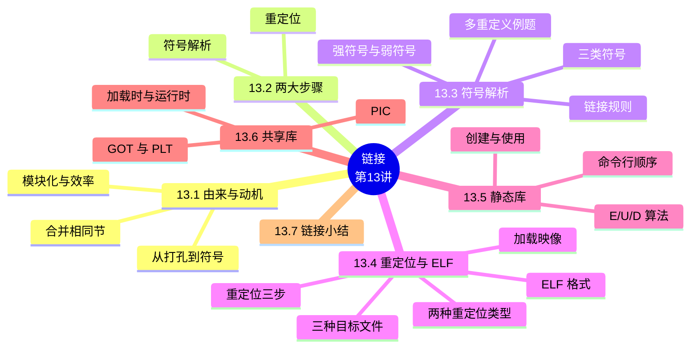

# 链接（Linking）

> **本章主线**：链接的由来与动机（从打孔纸带到符号）→ 链接的两大步骤（符号解析 + 重定位）→ 符号解析（三类符号、强/弱规则、多重定义陷阱）→ 重定位与 ELF 目标文件（格式、重定位条目、两种类型）→ 静态库（ar 归档、E/U/D 算法、命令行顺序）→ 共享库（动态链接、PIC、GOT/PLT 惰性绑定）→ 小结。
> 一句话版本：**链接 = 把多个目标文件的"节"合并、把符号引用绑定到定义、把地址改成最终值**——它发生在编译时、加载时或运行时，静态库与共享库是它的两种打包哲学。



---

## 13.1 链接的由来与动机

### 13.1.1 从打孔纸带到符号

**链接的概念早于高级编程语言**：

1. 最早的程序员用**机器语言**编写程序，记录在**纸带或卡片**上（穿孔表示 0、未穿孔表示 1）——若在第 5 条指令前加入指令，程序员必须**重新计算 jmp 指令的目标地址（重定位）**，再重新打孔，太原始了；
2. **汇编语言出现**：用**助记符**表示操作码、用**符号**表示跳转位置和变量位置、用助记符表示寄存器——大大简化问题；
3. **更高级语言出现**：程序越来越复杂，需要**多人开发不同的程序模块**：
    - **子程序（函数）起始地址和变量起始地址是符号定义（definition）**；
    - **调用子程序和使用变量就是符号的引用（reference）**；
    - 一个模块定义的符号可以被另一个模块引用；
    - 最终须**链接（合并）**，合并时在符号引用处**填入定义处的地址**——先确定 L0 的地址，再在 jmp 指令中填入 L0 的地址。

**符号定义/引用识别**（main.c + swap.c 例子）：`int buf[2] = {1,2}`、`void swap()`、`int *bufp0 = &buf[0]` 是定义；`swap()`、`extern int buf[]`、`&buf[0]`、`&buf[1]` 是引用；**局部变量 temp 分配在栈中、不会被过程外引用，因此不是符号定义**。

### 13.1.2 关于 static 的使用

**变量**：

1. `static` 声明的变量称为**静态变量**（静态全局或静态局部）；
2. **static 变量与普通全局变量存储方式相同、作用域不同**：多个源文件编译成一个可执行文件时，普通全局变量在**各个源文件都有效**，static 变量**只能在它定义的源文件**中使用；
3. 在**静态数据区**，内存中所有字节默认值都是 **0x00**；
4. **静态局部变量**存储于进程的全局数据区——**即使函数返回，它的值也保持不变**。

**函数**：

1. 普通函数的定义和声明默认是 **extern** 的，在所有源文件中可见；
2. **static 函数只在声明它的文件中可见**，不能被其他文件使用；
3. **static 函数优点**：多个文件可以定义同名静态函数，**不会发生冲突**。

> 口诀：**static 让"全局"变"私有"——函数与变量皆如此，换来命名不冲突**。

### 13.1.3 为什么需要链接器：模块化与效率

**Reason 1：模块化（Modularity）**

1. 程序可以写成**多个较小的源文件**的集合，而不是一个庞然大物；
2. 可以构建**常用函数库**（如数学库、C 标准库）。

**Reason 2：效率（Efficiency）**

1. **时间——分离编译（separate compilation）**：改一个源文件只需编译它并重新链接，**无需重编译其他源文件**；多个文件可以**并发编译**；
2. **空间——库**：把常用函数聚合成一个文件，两种链接选项：
    - **静态链接**：可执行文件与运行内存映像**只包含实际使用的库代码**；
    - **动态链接**：可执行文件**不含库代码**；执行期间**单个库代码副本可被所有运行进程共享**。

### 13.1.4 链接过程的本质：合并相同的"节"

**链接的本质 = 合并相同的"节"（section）**：

| 可重定位目标文件 | 节 | 可执行目标文件 |
|---|---|---|
| 系统代码 | .text | 系统代码 |
| main() | .text | main()、swap() |
| 更多系统代码 | .text | 更多系统代码 |
| `int buf[2]={1,2}` | .data | `int buf[2]={1,2}`、`int *bufp0=&buf[0]` |
| `int *bufp0=&buf[0]` | .data | `int *bufp1`（.bss） |
| `static int *bufp1` | .bss | .symtab、.debug |

所有目标模块的 .text 合并成可执行文件的一个 .text，.data、.bss 同理。

## 13.2 链接的两大步骤（What Do Linkers Do?）

**Step 1：符号解析（Symbol Resolution）**

1. 程序定义和引用符号（全局变量与函数）：`void swap() {...}` 定义符号 swap；`swap();` 引用符号 swap；`int *xp = &x;` 定义 xp、引用 x；
2. **符号定义存储在目标文件的符号表（symbol table）中**——符号表是条目数组，每个条目包含符号的**名称、大小和位置**；
3. 符号解析阶段，链接器把**每个符号引用与恰好一个符号定义关联**。

**符号解析的目的与实质**：将每个模块中引用的符号与某个目标模块中的定义符号建立关联（**符号解析也称符号绑定**）。**"符号的定义"实质 = 被分配了存储空间**——为函数名指定其代码所在区，为变量名指定其占用的静态数据区；**所有定义符号的值就是其目标所在的首地址**。本地符号（本模块内定义并引用）解析较简单；全局符号（外部定义的、内部定义的）涉及多个模块，较复杂。

**Step 2：重定位（Relocation）**

1. **合并**独立的代码与数据节为单一节；
2. 把符号从 .o 文件中的相对位置**重定位到可执行文件中的最终绝对内存地址**；
3. **更新所有对符号的引用**以反映新位置。

## 13.3 符号解析（Symbol Resolution）

### 13.3.1 链接器符号的三种类型

| 类型 | 含义 | 例子 |
|---|---|---|
| 全局符号（自定他用） | 由模块 m 定义、可被其他模块引用 | 非 static 的 C 函数与全局变量 |
| 外部符号（他定自用） | 模块 m 引用、由其他模块定义 | 被引用的外部函数/变量 |
| 本地符号（自定自用） | 只由模块 m 定义并引用 | static 属性的函数与全局变量 |

**重要**：**本地链接器符号不是局部程序变量**——局部非 static C 变量存在**栈**上；局部 static C 变量存在 **.bss 或 .data** 中。编译器为每个 `static int x` 定义在 .data 分配空间，并在符号表创建**唯一名字**（如 x、x.1721、x.1724）。**C 语言中源文件扮演模块的角色**：带 static 的全局变量/函数模块私有，不带 static 的全局变量公共可被其他模块引用。

**哪些名字进入符号表**（Symbol Identification）：`int time; int foo(int a){...} int main(int argc, char* argv[]){ printf("%d\n", foo(5)); }`——符号表中有 **time、foo、main、printf**；a、b、argc、argv 是参数/局部变量**不在**符号表中；`"%d\n"` 是字符串常量也不是符号。

### 13.3.2 强符号与弱符号

程序符号分为**强（strong）或弱（weak）**：

1. **强符号**：**过程（函数）与已初始化的全局变量**；
2. **弱符号**：**未初始化的全局变量**，或带 **extern** 说明符声明的。

**判断练习**（main.c/swap.c）：`int buf[2] = {1,2}` 强；`void swap();` 是引用；`int *bufp0 = &buf[0]` 强；`static int *bufp1` 本地局部符号；`extern int buf[]` 弱引用；`void swap()` 定义强。

### 13.3.3 链接器的符号规则

1. **规则 1**：**多个强符号不允许**——每个条目只能定义一次，否则**链接错误**；
2. **规则 2**：**给定一个强符号与多个弱符号，选择强符号**——对弱符号的引用解析到强符号；
3. **规则 3**：**若有多个弱符号，任选一个**——可用 `gcc -fno-common` 覆盖此行为。

### 13.3.4 链接器谜题（Linker Puzzles）

**重要事实：链接器不做类型检查！**

| p1.c | p2.c | 结果 |
|---|---|---|
| `int x; p1(){}` | `p1(){}` | **链接错误**：两个强符号 p1 |
| `int x; p1(){}` | `int x; p2(){}` | 对 x 的引用指向**同一个未初始化的 int**（两个弱符号） |
| `int x; int y; p1(){}` | `double x; p2(){}` | p2 写 x **可能覆盖 y**（弱+弱但类型不同，p2 按 8 字节 double 写） |
| `int x=7; int y=5; p1(){}` | `double x; p2(){}` | p2 写 x **将覆盖 y**！（强+弱选强，但 p2 的 double 写覆盖相邻 y） |
| `int x=7; p1(){}` | `int x; p2(){}` | 对 x 的引用指向**同一个已初始化变量**（强+弱选强） |

### 13.3.5 多重定义符号的解析：完整例题

**例题 1（链接错误）**：main.c 有 `int x=10`（强），p1.c 有 `int x=20`（强）与 `int p1()`——**x 有两次强定义，链接器输出出错信息**（main 只有一次强定义、p1 一次强一次弱都合法）。

**例题 2（弱符号共享地址）**：main.c：`int y=100`（强）、`int z`（弱）、main 里 `z=1000`；p1.c：`int y`（弱）、`int z`（弱）、p1 里 `y=200; z=2000`。

**题目陈述**：打印结果是什么？

**完整解题步骤**（每一步注明依据）：

1. **y**：一次强（100）+ 一次弱 → 按规则 2 取强，初始值 100；
2. **z**：两次弱 → 按规则 3 任选一个（两个弱符号共享同一地址）；
3. **执行**：main 中 `z=1000` 写入共享地址；p1 中 `y=200`、`z=2000` 覆盖写入；
4. **最终答案**：打印 **`y = 200, z = 2000`**。

> 该例演示的核心技巧/易错点：**在两个不同模块定义相同变量名，很可能发生意想不到的结果**——弱符号不是"各用各的"，而是**共享同一个地址**。

**例题 3（类型不匹配）**：main.c：`int d=100`（强）、`int x=200`（强）、printf("d=%d,x=%d", d, x)；p1.c：`double d`（弱）、p1 里 `d=1.0`。

**题目陈述**：打印结果是什么？为什么？

**完整解题步骤**（每一步注明依据）：

1. **符号解析**：d 一强一弱 → 取强（main.c 的 `int d`，仅 4 字节）；x 仅一次强定义；
2. **p1 执行 `d = 1.0`**：按 double 写入 **8 字节**到 d 的地址——double 1.0 的机器数是 `3FF0 0000 0000 0000H`；
3. **IA-32 小端存储**：低 4 字节 `00 00 00 00` 落在 d 处（d 读作 int = **0**）；高 4 字节 `3F F0 00 00` 落在**紧邻的 x 处**（x 读作 int = **0x3FF00000**）；
4. 计算：$0\text{x3FF00000} = 2^{30} - 2^{20} = 1072693248$。
5. **最终答案**：打印 **`d=0, x=1072693248`**——重复定义的变量具有不同类型时，更容易出现难以理解的结果。

> 该例演示的核心技巧/易错点：**弱符号的"类型"由强符号决定，但写入宽度按引用方类型执行**——double 写 8 字节溢出了 int 的 4 字节边界，静默覆盖邻居变量。

### 13.3.6 全局变量的使用建议与 .h 中的 extern

**全局变量**：能避免就避免；否则——

1. 能 static 就 static；
2. **定义全局变量时初始化**；
3. 引用外部全局变量用 **extern**（视为弱符号；但若在某个文件中未定义，仍会造成链接错误）。

**警告**：多重定义全局变量会造成意想不到的错误，且**默默发生**——编译系统不会警告，并会在**程序执行很久之后**才表现出来，且远离错误引发处；在一个几百个模块的大型软件中，这类错误很难修正。**大部分程序员并不了解链接器如何工作，养成良好的编程习惯非常重要**。

**.h 文件的正确用法**（#1）：`global.h` 中 `extern int g; int f();`；c1.c 包含后使用 g；c2.c `int g = 0;` 定义一次。

**.h 文件的正确用法**（#2）：用 `#ifdef INITIALIZE` 区分声明与定义——c2.c 定义 `#define INITIALIZE` 使 `int g = 23; static int init = 1;` 生效，c1.c 则用 `extern int g; static int init = 0;`。

## 13.4 重定位与 ELF 目标文件

### 13.4.1 三种目标文件（模块）

1. **可重定位目标文件（.o）**：代码与数据的形式可与其他可重定位目标文件合并形成可执行文件——**每个 .o 文件恰好由一个源（.c）文件产生**；
2. **可执行目标文件（a.out）**：代码与数据的形式**可直接复制进内存执行**；
3. **共享目标文件（.so）**：一种特殊的可重定位目标文件，可在**加载时或运行时**被装入内存并动态链接——Windows 称为**动态链接库（DLL）**。

**ELF（Executable and Linkable Format）**是 x86-64 Linux/Unix 系统目标文件的标准二进制格式——**一种统一格式**覆盖 .o、a.out、.so（统称 ELF 二进制）。

### 13.4.2 ELF 目标文件格式

**可重定位目标文件的节**：

| 节 | 内容 |
|---|---|
| ELF 头 | 字长、字节序、文件类型（.o/exec/.so）、机器类型等 |
| 段头表（程序头表） | 页大小、虚拟地址、段大小（**可执行文件必需**） |
| .text | 代码 |
| .rodata | 只读数据：跳转表、字符串常量等 |
| .data | **已初始化的全局变量** |
| .bss | **未初始化的全局变量**——"Block Started by Symbol" / "Better Save Space"；**有节头但不占用空间** |
| .symtab | 符号表：过程与静态变量名、节名与位置 |
| .rel.text | .text 节的重定位信息：需修改的指令地址 + 修改指令 |
| .rel.data | .data 节的重定位信息：需修改的指针数据地址 |
| .debug | 符号调试信息（gcc -g） |
| 节头表 | 每节的偏移与大小 |

**可执行目标文件与 .o 的不同**：

1. ELF 头的 `e_entry` 字段给出**执行时第一条指令的地址**（可重定位文件中为 0）；
2. **多一个 .init 节**——定义 `_init` 函数，用于可执行文件开始执行时的初始化工作；
3. **少两个 .rel 节**（无需重定位）；
4. **多一个程序头表（段头表）**——是一个结构数组。

**readelf 对比**：main.o 的 ELF 头 `Type: REL`、无程序头表、15 个节头、入口 0x0；可执行文件 main 的 ELF 头 `Type: EXEC`、入口 `0x8048580`、8 个程序头、29 个节头。

### 13.4.3 可执行文件的存储器映像（32 位）

程序（段）头表描述如何映射：只读代码段（.init、.text、.rodata，装入地址 **0x08048000**）与读写数据段（.data、.bss）**从可执行文件装入**；其上是**堆（heap，由 malloc 动态生成，brk 之上）**、**共享库区域**、**用户栈（%esp，动态生成）**；最高 1GB 为**内核虚存区**（0xC0000000）。

### 13.4.4 重定位的三步与重定位条目

**重定位工作分三步**（符号解析完成后）：

1. **合并相同的节**：将集合 E 中所有目标模块的相同节合并成新节（如所有 .text 合并为可执行文件的 .text）；
2. **对定义符号进行重定位（确定地址）**：确定新节中所有定义符号在虚拟地址空间中的地址——为函数确定首地址（进而确定每条指令的地址）、为变量确定首地址；完成后每条指令和每个全局变量都可确定地址；
3. **对引用符号进行重定位（确定地址）**：修改 .text 节和 .data 节中对每个符号的引用（地址）——**需要用到 .rel_data 和 .rel_text 节中保存的重定位信息**。

**重定位条目**：汇编器遇到引用时生成一个重定位条目——**数据引用的条目在 .rel_data 节，指令引用的条目在 .rel_text 节**；条目位于**可重定位目标（.o）文件**中。

```
typedef struct {
    int offset;      /* 节内偏移 */
    int symbol:24,   /* 所绑定符号 */
        type: 8;     /* 重定位类型 */
} Elf32_Rel;
```

**IA-32 两种最基本的重定位类型**：

1. **R_386_32**：绝对地址（如 `0: R_386_32 buf`——把 buf 的绝对地址填入）；
2. **R_386_PC32**：PC 相对地址（如 `7: R_386_PC32 swap`——把 swap 相对 PC 的偏移填入）。

### 13.4.5 完整例题：R_386_PC32 的重定位（call 指令）

**题目陈述**：main.o 中 main 的机器代码从 0x8048380 开始，main 占 0x12 字节；swap 紧跟 main 后、其机器代码首地址按 4 字节边界对齐。求 swap 的起始地址与重定位后 call 指令的机器代码。

**完整解题步骤**（每一步注明依据——PC 相对地址方式下，重定位值公式为 $\text{ADDR}(r\_sym) - ((\text{ADDR}(.text) + r\_offset) - init)$）：

1. **swap 起始地址**：$0x8048380 + 0x12 = 0x8048392$，按 4 字节边界对齐后为 **0x8048394**；
2. **call 指令位置**：call 在 main 内偏移 6（指令 `e8 fc ff ff ff`），其下一条指令地址（即 PC）$= 0x8048380 + 0x07 - (-4) = 0x804838b$（原占位立即数 fc ff ff ff = -4）；
3. **重定位值** $= \text{转移目标地址} - PC = 0x8048394 - 0x804838b = 0x9$；
4. **最终答案**：call 指令的机器代码为 **`e8 09 00 00 00`**。

> 该例演示的核心技巧/易错点：**PC 相对跳转填的是"目标 − 下一条指令地址"**——链接器算的是差值而不是目标本身，指令随代码段移动而自动保持正确。

### 13.4.6 完整例题：R_386_32 的重定位（数据指针）

**题目陈述**：swap.o 中 `int *bufp0 = &buf[0]` 的重定位过程是怎样的？

**完整解题步骤**（每一步注明依据）：

1. **符号表**：swap.o 中 bufp0（Data/Global，.data 节偏移 0，4 字节）、buf（Notype/Global，**UND 未定义**——在其他模块定义）、swap（Func/Global）、bufp1（Data/**Local**，COM 公共块）；
2. **.data 节内容**：bufp0 在偏移 0 占 4 字节，初值 0x0（等待填入 buf 的地址）；
3. **重定位条目**：.rel.data 中 `r_offset=0x0, r_sym=9（buf）, r_type=R_386_32`——objdump 显示为 `0: R_386_32 buf`；
4. **重定位**：把合并后 buf 的**绝对地址**填入 bufp0 处；
5. **最终答案**：bufp0 的初值 0x0 被替换为 buf 的绝对地址（R_386_32 类型直接填目标地址）。

> 该例演示的核心技巧/易错点：**数据引用的绝对重定位直接填地址本身**；与 R_386_PC32（填差值）形成对照——绝对地址适合数据指针，PC 相对适合指令跳转。

### 13.4.7 加载可执行目标文件

**加载器（loader）加载可执行目标文件**：只读代码段（.init、.text、.rodata）与读写数据段（.data、.bss）**从可执行文件装入**到 0x400000 起始的位置（64 位）；栈（运行时创建，%rsp）、共享库的内存映射区域、运行时堆（malloc 创建，brk）随之就位。

## 13.5 静态库（Static Libraries）

### 13.5.1 如何打包常用函数

**极端做法**：

1. **Option 1：把所有函数放进一个源文件**——程序员把大目标文件链入程序：空间与时间都低效；
2. **Option 2：每个函数一个源文件**——程序员显式链接适当的二进制：更高效，但**加重程序员负担**。

**旧式解决方案：静态库（.a 归档文件）**

1. 把相关的可重定位目标文件**串联**成一个带索引的单一文件（称为 archive 归档）；
2. 增强链接器：**在归档中查找符号来解析未解析的外部引用**；
3. 若归档成员文件解析了某引用，就把它**链接进可执行文件**。

**创建静态库**：`atoi.c`/`printf.c`/`random.c` → 各自 .o → `ar rs libc.a atoi.o printf.o ... random.o`——**归档器支持增量更新**：重编译变化的函数并替换 .o 即可。

**常用库**：

1. **libc.a（C 标准库）**：4.6 MB、**1496 个目标文件**——I/O、内存分配、信号处理、字符串处理、数据与时间、随机数、整数数学；
2. **libm.a（C 数学库）**：2 MB、444 个目标文件——浮点数学（sin、cos、tan、log、exp、sqrt 等）。

### 13.5.2 完整例题：链接器的符号解析全过程（E/U/D 算法）

**题目陈述**：`gcc -static -o myproc main.o ./mylib.a`（main→myfunc1→printf，mylib.a 含 myproc1.o 与 myproc2.o），链接器如何解析符号？

**完整解题步骤**（每一步注明依据——E 为待合并目标文件集合、U 为未解析引用集合、D 为定义符号集合）：

1. **初始**：E、U、D 为空；
2. **扫描 main.o**：加入 E；myfunc1 加入 U，main 加入 D；
3. **扫描 mylib.a**：将 U 中符号（myfunc1）与 mylib.a 中所有模块（myproc1.o、myproc2.o）依次匹配——myproc1.o 定义了 myfunc1 → **myproc1.o 加入 E**，myfunc1 从 U 转移到 D；
4. **迭代**：myproc1.o 中发现未解析符号 printf → 加入 U；不断在 mylib.a 各模块上迭代匹配 U 中的符号，直到 U、D 都不再变化；
5. **扫描 libc.a**（默认库）：printf.o 定义 printf → 加入 E，printf 从 U 移到 D；处理完 libc.a 时 **U 一定为空**；
6. **最终答案**：E 中有 main.o、myproc1.o、printf.o 及其调用模块；D 中有 main、myfunc1、printf 及其引用符号——**myproc2.o 没有被加入 E，被丢弃**。

**命令行顺序问题**：若命令为 `gcc -static -o myproc ./mylib.a main.o`——先扫 mylib.a 时 U 为空，两个 .o 都不被加入 E 而被**丢弃**；再扫 main.o 时 myfunc1 加入 U 却再也无法解析 → **链接错误**！**被链接模块应按调用顺序指定**。

> 该例演示的核心技巧/易错点：**归档文件只在"当前有未解析符号"时才有用**——库放前面等于白扫；命令行顺序决定成败。

### 13.5.3 使用静态库的算法与顺序陷阱

**链接器解析外部引用的算法**：

1. **按照命令行给出的顺序扫描 .o 和 .a 文件**；
2. 扫描期间把当前未解析的引用记录到列表 U；
3. 每遇到一个新的 .o 或 .a 中的模块，都试图用它解析 U 中的符号；
4. 扫描结束时 U 中还有未解析符号 → **错误**。

**命令行顺序陷阱**（libtest.o 调用 libmine.a 中的 libfun）：

```
gcc -L. libtest.o -lmine      ✓ 先扫 libtest.o（libfun 入 U），再扫 libmine.a 解析
gcc -L. -lmine libtest.o      ✗ 先扫 libmine.a（U 空，库成员被丢弃），libfun 无法解析
```

**好的做法：将静态库放在命令行的最后**（-lxxx = libxxx.a）。

**链接顺序综合分析**（func.o → libx.a/liby.a，libx.a → libz.a，相互独立）：`func.o libx.a liby.a libz.a`、`func.o liby.a libx.a libz.a`、`func.o libx.a libz.a liby.a` 均可行；若 **libx.a 与 liby.a 互相引用**，则需 `func.o libx.a liby.a libx.a`（重复列出）。

### 13.5.4 静态库的缺点

1. **存储上的重复**：每个可执行文件都包含用到的每个库函数（如每个程序都要 libc）；
2. **运行时的重复**：每个运行进程各有一份；
3. **修复不便**：系统库的小 bug 修复要求**每个应用显式重新链接**（如 2016 年 glibc 的 CVE-2015-7547 getaddrinfo 漏洞——难道要 rebuild 一切？）。

## 13.6 共享库（Shared Libraries / 动态链接）

### 13.6.1 共享库的动机与两种动态链接时机

**静态库的缺点**（主存/磁盘/更新三重视角）：

1. 库函数（如 printf）被包含在**每个运行进程的代码段**中——对并发运行上百个进程的系统造成**极大的主存浪费**；
2. 库函数被合并进可执行目标——磁盘上数千个可执行文件造成**磁盘空间极大浪费**；
3. 程序员需关注函数库新版本并定期下载、重新编译和链接——**更新困难、使用不便**。

**解决方案：共享库（Shared Libraries）**

1. 是一个目标文件，包含代码和数据；
2. 从程序中**分离**出来，**磁盘和内存中都只有一个备份**；
3. 可动态地在**装入时或运行时**被加载并链接；
4. Windows 称**动态链接库（DLL，.dll 文件）**；Linux 称**动态共享对象（.so 文件）**。

**动态链接的两种方式**：

1. **加载时动态链接（load-time linking）**：在可执行文件**第一次被加载并运行时**进行——Linux 通常由**动态链接器（ld-linux.so）**自动处理；标准 C 库（libc.so）通常按此方式动态链接；
2. **运行时动态链接（run-time linking）**：在程序**已经开始运行后**进行——Linux 中通过调用 **dlopen()** 接口实现（分发软件包、构建高性能 Web 服务器、运行时库拦截等）。

**共享库优点**：内存中一个备份被所有进程共享；一个共享库目标文件被所有程序共享链接；升级时自动加载、动态链接；可分模块、独立、用不同语言开发；第三方共享库可作插件，功能易于扩展。

### 13.6.2 创建与使用共享库

**创建动态库**（以向量库 libvector.so 为例）：

1. `gcc -Og -c addvec.c multvec.c -fpic`——**-fpic 生成位置无关代码（PIC，Position Independent Code）**；
2. `gcc -shared -o libvector.so addvec.o multvec.o`。

**PIC 的作用**：1）保证**共享库代码的位置可以是不确定的**；2）即使共享库代码长度发生变化，也不会影响调用它的程序。

**加载时动态链接的使用**（myproc 调用 mylib.so）：

```
gcc -o myproc main.o ./mylib.so
```

**加载过程**：加载 myproc 时，加载器发现程序头表中有 **.interp 段**（包含动态链接器路径名 **ld-linux.so**）→ 加载器按指定路径加载并启动动态链接器运行 → 动态链接器完成重定位工作后，把控制权交给 myproc，启动第一条指令执行。

**运行时动态链接的使用**（dll.c）：

```c
handle = dlopen("./libvector.so", RTLD_LAZY);   /* 动态加载共享库 */
addvec = dlsym(handle, "addvec");               /* 取函数指针 */
addvec(x, y, z, 2);                             /* 像普通函数一样调用 */
dlclose(handle);                                /* 卸载共享库 */
```

编译：`gcc -rdynamic -o prog2r dll.o -ldl`。

**如何知道需要哪些动态库**：.interp 段指定动态链接器；**.dynamic 段**指定要使用的动态库名称（NEEDED 条目）；用 **`ldd`** 查看依赖（`ldd prog` 显示 libc.so.6、ld-linux-x86-64.so.2 及其地址）。

### 13.6.3 惰性绑定（Lazy Binding）：GOT 与 PLT

**惰性绑定（lazy binding / 动态绑定）**：把每个过程地址的绑定**推迟到第一次调用该过程时**。

1. **动机**：典型应用只调用共享库（如 libc.so）导出的成百上千个函数中的**一小部分**；
2. **收益**：推迟解析可避免**加载时成百上千次不必要的重定位**；第一次调用有**一次较大的运行时开销**，此后每次调用开销很小；
3. **实现**：通过 **GOT 与 PLT** 两个数据结构的紧凑而稍复杂的交互。

**GOT（全局偏移表）**：

1. 是位于**数据段**的地址表；
2. 对模块引用的**每个全局数据对象（过程或全局变量）**有一个 **8 字节条目**；
3. 编译器为每个 GOT 条目生成重定位记录——**加载时动态链接器重定位每个条目**，使其包含对象的绝对地址；
4. **每个引用全局对象的模块都有自己的 GOT**。

**PLT（过程链接表）**：

1. 每个 PLT 条目是 **16 字节的可执行代码**——不直接调用函数，而是**调用 PLT 条目**，由它负责调用真正的函数；
2. 每个 PLT 条目有对应的 **GOT 条目**，动态链接器解析后它才包含函数的实际地址。

**完整例子（fopen.c：fopen/fprintf/fclose）**：PLT[1] fclose@plt：`jmpq *GOT[3]`——**第一次调用前** GOT[3] 指向 PLT 内继续执行的部分（pushq 序号 → jmpq PLT[0] 调动态链接器解析 → 回填 GOT[3] 为真实地址）；**第一次调用后** GOT[3] 指向真正的 fclose，后续调用直达。

| GOT 条目 | 第一次调用前 | 第一次调用后 | 含义 |
|---|---|---|---|
| GOT[0] | 0x600788 | 0x600788 | .dynamic 的地址 |
| GOT[1] | ...e22190 | ...e22190 | 重定位条目地址 |
| GOT[2] | ...c14c20 | ...c14c20 | 动态链接器地址 |
| GOT[3] | 0x400426 | ...626260 | fclose（解析后指向真实函数） |
| GOT[4] | 0x400436 | ...67100 | fputs |
| GOT[6] | 0x400456 | ...66e60 | fopen |

> 口诀：**PLT 是"中转站"，GOT 是"地址簿"——第一次调用经中转站查簿登记，之后直达**。

## 13.7 链接小结

1. **链接是允许程序由多个目标文件构造出来的技术**；
2. 链接可以发生在程序生命周期的不同时刻：**编译时**（程序编译时）、**加载时**（程序装入内存时）、**运行时**（程序执行中）；
3. **理解链接能帮你避免棘手的错误**，并成为更好的程序员。

**本章要点**（小结）：

1. 链接涉及**三种目标文件**：可重定位、可执行、共享目标（共享库是特殊的可重定位目标）；
2. **ELF 有链接视图与执行视图**：链接视图（可重定位格式）含 ELF 头、各节、节头表；执行视图（可执行格式）含 ELF 头、程序头表（段头表）及各种节组成的段；
3. **静态链接**合并多个可重定位模块的相同节生成完全链接的可执行文件（所有引用都确定最终虚拟地址，可直接加载执行）；**动态链接**的可执行文件是部分链接的，需动态链接器加载共享库并重定位剩余引用（加载时或运行时）；
4. 链接需完成**符号解析**（引用 ↔ 定义关联）与**重定位**（合并代码数据、确定每个符号最终存储地址、按确切地址修改引用处地址）；
5. 多个目标模块可能定义相同符号——链接器按**强/弱符号规则**确定唯一定义；
6. **加载器加载可执行文件时，只是把只读代码段与可读写数据段通过页表映射到虚拟地址空间确定位置，并没有真正把代码和数据从磁盘装入主存**。

**练习**：CS:APP 习题 7.1、7.2、7.3、7.4、7.5。

## 知识定位与框架衔接

### 前置知识（地基）

1. **机器级编程（第 5 讲起）**：汇编代码、节（.text/.data）、符号——链接的操作对象（符号表、重定位）正是编译器/汇编器在机器级留下的"接线清单"。
2. **课程导论与 hello 程序**：`gcc hello.c` 到 `./hello` 的过程——本讲补上其中"链接器（ld）"与"加载器（execve）"这两个关键环节。

### 后置知识（上层建筑）

1. **虚拟内存**：共享库被所有进程共享、加载器用页表映射而非真正装入——正是虚拟内存章节的伏笔；GOT/PLT 惰性绑定依赖共享库的虚拟内存共享机制。
2. **异常控制流与进程**：动态链接器（ld-linux.so）作为程序启动的一部分；dlopen 运行时链接与进程/库管理。
3. **实验与工程实践**：bomblab/attacklab 需要理解反汇编与符号；真实工程中的"未定义引用"错误、多重定义 bug 修复、库版本更新都依赖本章知识。

### 本讲在整个课程中的位置（装配工比喻）

如果说编译是"翻译"，链接就是**"装配"**——把编译器产出的多个"零件"（.o 文件）按符号表拼成完整程序。本讲是"程序如何从源码变成可执行文件"链条的**最后一公里**：`cpp → cc1 → as → ld → loader`。**强/弱符号规则**解释了大量"诡异但合法"的 bug（如 d=0、x=1072693248），**静态库/共享库**则是空间与便利性的两种权衡，**GOT/PLT** 是"懒人优化"的经典。

### 核心灵魂问题（学完本讲应能回答）

1. **强/弱符号规则是什么？为什么"链接器不做类型检查"会带来灾难？** ——多强出错、强弱取强、多弱任选；类型检查缺失意味着弱符号的实际布局（如 double 写 8 字节）可能静默覆盖相邻变量（d/x 例题），且错误远离引发处、延迟暴露。
2. **为什么静态库必须放在命令行的最后？** ——链接器按命令行顺序扫描，U（未解析列表）为空时扫描归档会把它"白扫"一遍，其中的模块被丢弃；等后面真正需要时已无法找回——`./mylib.a main.o` 必错，`main.o ./mylib.a` 才对。
3. **动态链接的两种时机与各自机制是什么？** ——加载时（.interp 段指定 ld-linux.so，程序启动时解析）与运行时（dlopen/dlsym，程序执行中按需加载）；两者都由动态链接器完成重定位。
4. **惰性绑定（GOT/PLT）解决了什么问题？第一次调用与后续调用有何不同？** ——避免加载时为成百上千个可能用不到的库函数重定位；第一次调用经 PLT 触发动态链接器解析并回填 GOT，此后 PLT 直接跳转到 GOT 中的真实地址，开销很小。

> **一句话总结本讲**：**链接 = 符号解析（把引用绑到定义，强/弱规则定生死）+ 重定位（合并节、填地址，PC 相对 vs 绝对）**；静态库"打包进程序"（简单但重复），共享库"按需动态链接"（省空间但引入 GOT/PLT 惰性绑定）——一切按命令行顺序进行，库永远放最后。

---

## 课件 PDF

<iframe src="https://naimore3.github.io/Naimore3-s-Learning-Notes/课程笔记/大二上/计算机系统基础/linking/11-13-linking.pdf" width="100%" height="800px" style="border: none;"></iframe>

[打开 PDF](https://naimore3.github.io/Naimore3-s-Learning-Notes/课程笔记/大二上/计算机系统基础/linking/11-13-linking.pdf)
