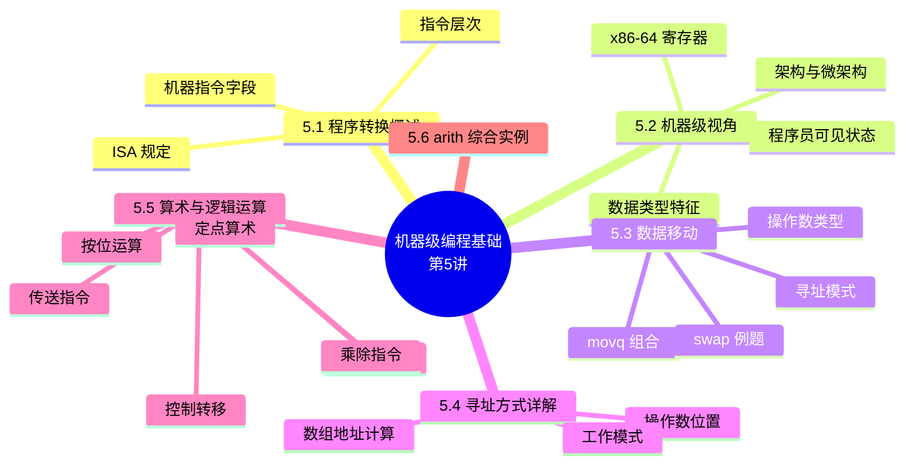

# 机器级编程（一）：基础（Machine-Level Programming I: Basics）

> **本章主线**：程序转换概述（C → 汇编 → 机器码的逆向工程）→ 机器级视角（ISA、程序员可见状态、寄存器）→ 数据移动（操作数类型、movq、寻址模式）→ 寻址方式详解（含数组地址计算）→ 算术与逻辑运算（LEA、传送、定点算术、乘除、按位、控制转移）→ 综合实例。
> 一句话版本：**本讲是"C 语言与机器之间的翻译官"**——让汇编成为可读的语言：数据放哪（寄存器/内存）、怎么取（寻址方式）、怎么算（指令类型）。



---

## 5.1 程序转换概述

### 5.1.1 教学目标与五讲地图

**教学目标**：了解高级语言、汇编语言、机器语言之间的关系；掌握指令格式、操作数类型、寻址方式、操作类型；了解 C 语句与机器级代码的对应关系；了解复杂数据类型（数组、结构等）的机器级实现。

**主要方法**：**逆向工程方法**——从高级语言程序出发，用其对应的机器级代码以及内存（栈）中信息的变化来说明底层实现。

**本章五讲划分**：

| 讲次 | 主题 | 核心内容 |
|---|---|---|
| 第一讲 | 程序转换概述 | 机器指令和汇编指令；机器级程序员感觉到的属性和功能特性；高级语言程序转换为机器代码的过程 |
| 第二讲 | IA-32/x86-64 指令系统 | 指令格式、操作数、寻址方式 |
| 第三讲 | C 语言程序的机器级表示 | 选择语句、循环结构、过程调用的机器级实现 |
| 第四讲 | 复杂数据类型的分配和访问 | 数组、结构体、联合体、数据对齐 |
| 第五讲 | 越界访问和缓冲区溢出 | 安全相关 |

### 5.1.2 指令的层次

计算机中的指令分三种（本讲提及的"指令"均指**机器指令**）：

1. **微指令**：微程序级命令，属于**硬件范畴**；
2. **机器指令**：介于微指令与伪指令之间，处于**硬件和软件的交界面**；
3. **伪（宏）指令**：由若干机器指令组成的指令序列，属于**软件范畴**；
4. **汇编指令**：机器指令的**汇编表示形式（符号表示）**——机器指令与汇编指令**一一对应**，它们都与具体机器结构有关，都属于**机器级指令**。

### 5.1.3 软硬件接口：ISA 与机器指令

**ISA（Instruction Set Architecture，指令集体系结构）**位于软件与硬件之间：**硬件的功能通过 ISA 提供出来，软件通过 ISA 规定的"指令"使用硬件**。ISA 规定了：

1. 可执行指令的集合——指令格式、操作种类、每种操作对应操作数的规定；
2. 指令可以接受的操作数类型；
3. 操作数可存放的**寄存器组结构**（每个寄存器的名称、编号、长度和用途）；
4. 操作数可存放的**存储空间大小与编址方式**；
5. 操作数按**大端还是小端**存放；
6. **寻址方式**（指令获取操作数的方式）；
7. 指令执行过程的**控制方式**（程序计数器、条件码定义等）。

**机器指令的字段结构**：机器指令是 0/1 序列，由若干字段组成——**操作码 + 寻址方式 + 寄存器编号 + 立即数（位移量）**。

**汇编指令的两种格式**（功能相同，写法不同）：

- Intel 格式：`mov [bx+di-6], cl`
- AT&T 格式：`movb %cl, -6(%bx,%di)`

其中 mov、movb、bx、%bx 等都是**助记符**；指令功能用**寄存器传送语言（RTL）**描述：$M[R[bx] + R[di] - 6] \leftarrow R[cl]$（R 表示寄存器内容，M 表示存储单元内容）。

### 5.1.4 从 C 到机器码的完整链条

以交换两个数组元素为例（回顾软硬件接口）：

1. **C 代码**：`temp = v[k]; v[k] = v[k+1]; v[k+1] = temp;`
2. **汇编指令**：`lw $15, 0($2)`、`lw $16, 4($2)`、`sw $16, 0($2)`、`sw $15, 4($2)`；
3. **机器指令**：`1000 1100 0100 1111 0000 0000 0000 0000` 等 0/1 序列；
4. **微指令**：`EXTop=1, ALUSelA=1, ALUSelB=11, ALUop=add, IorD=1, ...`。

**本课覆盖范围**：只讲 **x86-64**（标准）；IA32 是传统 x86，教材以 x86-64 为主。

> 口诀：**C 是意图、汇编是符号、机器码是字节、微指令是硬件**——层层翻译，逐级落地。

## 5.2 机器级视角（Assembly/Machine Code View）

### 5.2.1 架构 vs 微架构

1. **架构（Architecture，即 ISA）**：编写正确的机器/汇编代码所需理解的处理器设计部分——如指令集规范、寄存器；
2. **机器码（Machine Code）**：处理器执行的**字节级程序**；
3. **汇编代码（Assembly Code）**：机器码的**文本表示**；
4. **微架构（Microarchitecture）**：架构的**实现**——如缓存大小、核心频率；
5. **示例 ISA**：Intel x86、IA32、Itanium、x86-64；**ARM**（几乎所有手机）；**RISC-V**（新兴开源 ISA）。

### 5.2.2 程序员可见状态（Programmer-Visible State）

机器级程序员眼中的 CPU + 内存：

1. **PC（程序计数器）**：下一条指令的地址——x86-64 中称为 **RIP**；
2. **寄存器文件（Register file）**：被频繁使用的程序数据；
3. **条件码（Condition codes）**：存储最近一次算术或逻辑运算的状态信息——用于条件分支；
4. **内存（Memory）**：字节寻址的数组——存放代码与用户数据，以及**支持过程的栈（Stack）**。

### 5.2.3 汇编的数据类型特征

1. **"整数"数据**：1、2、4、8 字节——数据值，以及**地址（无类型指针）**；
2. **浮点数据**：4、8、10 字节；
3. **SIMD 向量数据**：8、16、32、64 字节；
4. **代码**：编码指令序列的**字节序列**；
5. **没有聚合类型**（数组、结构体）——它们只是**内存中连续分配的字节**。

### 5.2.4 x86-64 整数寄存器

x86-64 有 **16 个 64 位整数寄存器**：

| 64 位 | 低 32 位 | 64 位 | 低 32 位 |
|---|---|---|---|
| %rax | %eax | %r8 | %r8d |
| %rbx | %ebx | %r9 | %r9d |
| %rcx | %ecx | %r10 | %r10d |
| %rdx | %edx | %r11 | %r11d |
| %rsi | %esi | %r12 | %r12d |
| %rdi | %edi | %r13 | %r13d |
| %rsp | %esp | %r14 | %r14d |
| %rbp | %ebp | %r15 | %r15d |

**要点**：

1. 可通过 %eax 等**引用低 4 字节**（也可引用低 1、2 字节）；
2. 寄存器**不在内存（或缓存）中**——访问寄存器不经过内存层次；
3. **%rsp 保留给栈指针**专用；其他寄存器在特定指令中有特殊用途。

**历史来源（IA32 时代，多已过时）**：%eax（accumulate 累加器）、%ecx（counter 计数器）、%edx（data 数据）、%ebx（base 基址）、%esi（source index 源变址）、%edi（destination index 目的变址）、%esp（stack pointer 栈指针）、%ebp（base pointer 基址指针）；%ax/%al/%ah 等是 16/8 位虚拟寄存器（向后兼容）。

## 5.3 数据移动（Moving Data）

### 5.3.1 操作数类型

`movq Source, Dest`（**AT&T 格式**：源在左、目的在右）：

1. **立即数（Immediate）**：常量整数数据——如 `$0x400`、`$-533`；类似 C 常量但**带 `$` 前缀**；用 1、2 或 4 字节编码；
2. **寄存器（Register）**：16 个整数寄存器之一——如 %rax、%r13；但 **%rsp 保留**给特殊用途；
3. **内存（Memory）**：地址由寄存器给出的**连续 8 个字节**——最简单的形式 `(%rax)`；另有各种"寻址模式"。

**警告**：Intel 文档写作 `mov Dest, Source`（**顺序相反**！）——阅读 Intel 资料时务必注意操作数顺序。

### 5.3.2 movq 操作数组合

| 源 | 目的 | 示例 | C 类比 |
|---|---|---|---|
| 立即数 | 寄存器 | `movq $0x4, %rax` | `temp = 0x4;` |
| 立即数 | 内存 | `movq $-147, (%rax)` | `*p = -147;` |
| 寄存器 | 寄存器 | `movq %rax, %rdx` | `temp2 = temp1;` |
| 寄存器 | 内存 | `movq %rax, (%rdx)` | `*p = temp;` |
| 内存 | 寄存器 | `movq (%rax), %rdx` | `temp = *p;` |

**关键限制**：**不能用一条指令完成内存 → 内存的传送**（C 的赋值需要先加载到寄存器再存回内存）。

### 5.3.3 简单寻址模式

1. **普通模式 `(R)`**：$Mem[Reg[R]]$——寄存器 R 指定内存地址（补充说明/拓展：这就是 C 中的**指针解引用**）。例：`movq (%rcx), %rax`；
2. **位移模式 `D(R)`**：$Mem[Reg[R] + D]$——寄存器 R 指定内存区域起点，常量位移 D 指定偏移。例：`movq 8(%rbp), %rdx`。

### 5.3.4 完整寻址模式 D(Rb, Ri, S)

**最一般形式**：

$$
D(R_b, R_i, S): \quad Mem[Reg[R_b] + S \times Reg[R_i] + D]
$$

1. **D**：常量"位移"（displacement），1、2 或 4 字节；
2. **R_b**：基址寄存器——16 个整数寄存器任意一个；
3. **R_i**：变址寄存器——任意寄存器，**除 %rsp 外**；
4. **S**：比例因子（scale）——**1、2、4 或 8**（补充说明/拓展：对应 char/short/int 或指针/long/double 的字节数，方便按元素寻址）。

**特殊情形**（省略某些字段）：

1. $(R_b, R_i)$：$Mem[Reg[R_b] + Reg[R_i]]$；
2. $D(R_b, R_i)$：$Mem[Reg[R_b] + Reg[R_i] + D]$；
3. $(R_b, R_i, S)$：$Mem[Reg[R_b] + S \times Reg[R_i]]$。

**完整例题：地址计算**（设 %rdx = 0xf000，%rcx = 0x0100）

**题目陈述**：求下列各寻址表达式计算出的内存地址。

**完整解题步骤**（每一步注明依据——套用公式 $Mem[Reg[R_b] + S \times Reg[R_i] + D]$）：

| 表达式 | 地址计算 | 地址 |
|---|---|---|
| `0x8(%rdx)` | $0xf000 + 0x8$ | **0xf008** |
| `(%rdx,%rcx)` | $0xf000 + 0x100$ | **0xf100** |
| `(%rdx,%rcx,4)` | $0xf000 + 4 \times 0x100$ | **0xf400** |
| `0x80(,%rdx,2)` | $2 \times 0xf000 + 0x80$ | **0x1e080** |

> 该例演示的核心技巧/易错点：**缺省字段按 0 处理**——`0x80(,%rdx,2)` 没有基址寄存器，只有位移、变址与比例。

### 5.3.5 完整例题：swap 函数（简单寻址模式）

**题目陈述**：以下 C 函数对应什么汇编？逐条解释并演示其执行过程。

```c
void swap(long *xp, long *yp) {
    long t0 = *xp;
    long t1 = *yp;
    *xp = t1;
    *yp = t0;
}
```

**完整解题步骤**（每一步注明依据）：

1. **参数与局部变量的寄存器分配**：%rdi = xp，%rsi = yp，%rax = t0，%rdx = t1；
2. **汇编逐条对应**：

```asm
swap:
    movq  (%rdi), %rax    # t0 = *xp     （普通寻址，加载）
    movq  (%rsi), %rdx    # t1 = *yp     （普通寻址，加载）
    movq  %rdx, (%rdi)    # *xp = t1     （寄存器→内存，存储）
    movq  %rax, (%rsi)    # *yp = t0     （寄存器→内存，存储）
    ret
```

3. **执行演示**（设内存 0x120 处存 123、0x100 处存 456，xp = 0x120，yp = 0x100）：
    - 第一步后：%rax = 123（t0 = *xp）；
    - 第二步后：%rdx = 456（t1 = *yp）；
    - 第三步后：内存 0x120 变为 456（*xp = t1）；
    - 第四步后：内存 0x100 变为 123（*yp = t0）。
4. **最终答案**：两个内存单元的内容**交换**——这正是"通过指针交换两数"的机器级实现，全程不经过内存到内存的单条指令，而是"加载 → 加载 → 存储 → 存储"。

> 该例演示的核心技巧/易错点：**C 中的 `*p` 读写对应寻址模式 `(R)`**；值交换必须借道寄存器，因为 movq 不支持内存到内存。

## 5.4 寻址方式详解（IA-32 视角）

### 5.4.1 操作数位置与三类寻址

**寻址方式**：根据指令给定信息得到**操作数或操作数地址**。操作数所在位置决定寻址方式：

1. **指令中 → 立即寻址**（操作数直接写在指令里）；
2. **寄存器中 → 寄存器寻址**（操作数在寄存器中）；
3. **存储单元中 → 存储器操作数**（按字节编址，用其他寻址方式得到地址）。

**指令中需给出的信息**：操作性质（操作码）、源操作数 1 或/和源操作数 2（立即数、寄存器编号、存储地址）、目的操作数地址（寄存器编号、存储地址）。**存储地址的描述与操作数的数据结构有关**。

### 5.4.2 两种工作模式

1. **实地址模式**（基本用不到）：为与 8086/8088 兼容而设，加电或复位时进入——寻址空间 **1MB**，20 位地址 $(CS) << 4 + (IP)$；
2. **保护模式**（需要掌握）：加电后进入，采用**虚拟存储管理**，多任务情况下隔离、保护；80286 以上高档微处理器最常用的工作模式——寻址空间 **$2^{32}$ B**，32 位线性地址**分段**（段基址 + 段内偏移量）：**SR 段寄存器**（间接）确定操作数所在段的段基址，**有效地址**给出操作数在段内的偏移地址。

### 5.4.3 存储器操作数地址计算：完整例题

**题目陈述**：设内存中有如下变量布局，求各变量/元素的寻址方式与地址（int x；float a[100]；short b[4][4]；char c；long *c1；double d[10]）。

**完整解题步骤**（每一步注明依据——按各数据类型大小 4/4/2/1/4/8 字节顺序分配，注意对齐）：

1. **内存布局**：x 在 100；a[0] 在 104；b[0][0] 在 504；c 在 536；d[0] 在 544；d[9] 在 616；
2. **a[i] 的地址**：$104 + i \times 4$（float 4 字节）——$i=99$ 时 $104 + 99 \times 4 = 500$；属**比例变址 + 位移**寻址；
3. **b[i][j] 的地址**：$504 + i \times 8 + j \times 2$（每行 4 个 short 共 8 字节，行内 short 2 字节）——$i=3, j=2$ 时 $504 + 24 + 4 = 532$；属**基址 + 比例变址 + 位移**寻址；
4. **d[i] 的地址**：$544 + i \times 8$（double 8 字节，544 对齐到 8）——$i=9$ 时 $544 + 72 = 616$；属**比例变址 + 位移**寻址；
5. **x、c**：单变量，用**位移/基址**寻址即可；
6. **指令示例**：把 b[i][j] 取到 EAX 可写 `movw 504(%ebp,%esi,2), %eax`——其中 $i \times 8$ 在 EBP 中、j 在 ESI 中、**2 为比例因子**。
7. **最终答案**：见下表。

| 变量 | 地址公式 | 示例计算 | 寻址方式 |
|---|---|---|---|
| x | 100 | — | 位移/基址 |
| a[i] | $104 + 4i$ | i=99 → 500 | 比例变址 + 位移 |
| b[i][j] | $504 + 8i + 2j$ | (3,2) → 532 | 基址 + 比例变址 + 位移 |
| c | 536 | — | 位移/基址 |
| d[i] | $544 + 8i$ | i=9 → 616 | 比例变址 + 位移 |

> 该例演示的核心技巧/易错点：**数组元素地址 = 基址 + i × 元素大小（+ j × 行内大小）**——比例因子 S 恰好等于元素字节数，这就是 D(Rb,Ri,S) 中 S 取 1/2/4/8 的原因。

## 5.5 算术与逻辑运算

### 5.5.1 LEA：地址计算指令

**leaq Src, Dst**：Src 是地址模式表达式——**把表达式表示的地址（而不是该地址处的值）放入 Dst**。

**两大用途**：

1. **不访问内存地计算地址**：如 `p = &x[i]` 的翻译；
2. **计算形如 $x + k \times y$ 的算术表达式**（$k = 1, 2, 4, 8$）。

**完整例题：m12（用 leaq 优化乘法）**

**题目陈述**：`long m12(long x) { return x * 12; }` 被编译器翻译成什么汇编？

**完整解题步骤**（每一步注明依据）：

1. 目标：计算 $x \times 12 = x \times 3 \times 4$；
2. `leaq (%rdi,%rdi,2), %rax`——%rax = x + 2x = **3x**（利用 leaq 做 $x + 2y$ 型算术）；
3. `salq $2, %rax`——3x 左移 2 位 = **12x**（乘以 4）；
4. **最终答案**：两条指令 `leaq (%rdi,%rdi,2), %rax` + `salq $2, %rax` 完成 x*12，**不包含任何乘法指令**。

> 该例演示的核心技巧/易错点：**LEA 是"算术伪装成取址"**——编译器用 leaq + 移位组合替代乘法，这是常见的性能优化。

**补充示例**：`leaq $0x1000, %rax`（%rax = 1000H）、`leaq (%rbx), %rax`（%rax = %rbx）——LEA 不访问内存。

### 5.5.2 传送指令类型（IA-32）

1. **通用数据传送**：MOV（movb/movw/movl）、**MOVS 符号扩展**（movsbw、movswl）、**MOVZ 零扩展**（movzwl、movzbl）、XCHG（交换）、PUSH/POP（入栈/出栈）；
2. **地址传送**：LEA——如 `leal (%edx,%eax), %eax` 的功能为 $R[eax] \leftarrow R[edx] + R[eax]$（执行前若 R[edx]=i、R[eax]=j，则执行后 R[eax]=i+j）；
3. **输入输出**：IN/OUT（I/O 端口与寄存器之间交换）；
4. **标志传送**：PUSHF/POPF（EFLAG 压栈 / 栈顶送 EFLAG）。

### 5.5.3 定点算术运算指令

| 指令 | 功能 | 标志影响 |
|---|---|---|
| ADD/SUB | 加/减 | 影响标志；**不区分无/带符号** |
| INC/DEC | 增 1/减 1 | 影响除 CF 外的标志 |
| NEG | 取负 | 影响标志；对 0 取负结果为 0/CF=0，否则 CF=1 |
| CMP | 比较（做减法得标志） | 影响标志；**不区分无/带符号** |
| MUL/IMUL | 无符号乘/带符号乘 | **不影响标志**；区分无/带符号 |
| DIV/IDIV | 无符号除/带符号除 | **不影响标志**；区分无/带符号 |

**完整例题：定点加法（16 位）**

**题目陈述**：设 $R[ax] = FFFAH$、$R[bx] = FFF0H$，执行 Intel 格式指令 `add ax, bx` 后，AX、BX 内容是什么？标志 CF、OF、ZF、SF 各是什么？并分别按无符号数与带符号数验证。

**完整解题步骤**（每一步注明依据）：

1. **执行**：$R[ax] \leftarrow R[ax] + R[bx] = FFFAH + FFF0H = 1FFEAH$，取低 16 位得 **FFEAH**，BX 内容不变；
2. **标志**：有进位输出 → **CF=1**；符号位未变（无带符号溢出）→ **OF=0**；结果非 0 → **ZF=0**；结果最高位为 1 → **SF=1**；
3. **按无符号数验证**：FFFA 真值 $65535-5 = 65530$，FFF0 真值 65520，和应为 131050，但 FFEA 真值 $65535-21 = 65514 \ne 131050$——**CF=1 说明无符号溢出** ✓；
4. **按带符号数验证**：FFFA 真值 $-6$，FFF0 真值 $-16$，FFEA 真值 $-22 = -6 + (-16)$——**OF=0 说明无溢出，结果正确** ✓。
5. **最终答案**：$AX = FFEAH$（$BX$ 不变），$CF=1, OF=0, ZF=0, SF=1$——同一运算，无符号视角溢出、带符号视角正确。

> 该例演示的核心技巧/易错点：**CF 管无符号、OF 管带符号**——一条加法同时设置两种溢出标志，用哪种解释就查哪个标志。

### 5.5.4 整数乘除指令

**乘法指令**可给出 1、2 或 3 个操作数：

1. **一个操作数 SRC**：另一个源操作数**隐含在 AL/AX/EAX** 中，结果存放在 AX（16 位）或 **DX-AX**（32 位）或 **EDX-EAX**（64 位）——DX-AX 表示 32 位乘积的高、低 16 位分别在 DX 和 AX；
2. **两个操作数 DST、SRC**：DST 与 SRC 相乘，结果在 **DST** 中；
3. **三个操作数 REG、SRC、IMM**：SRC 与立即数 IMM 相乘，结果在 **REG** 中。

**除法指令**：只明显指出**除数**，用 EDX-EAX 中内容除以指定除数——8 位时 16 位被除数在 AX，商送回 AL、余数在 AH；16 位时 32 位被除数在 DX-AX，商送回 AX、余数在 DX；32 位时被除数在 EDX-EAX，商送 EAX、余数在 EDX。

**完整例题：定点乘法**（设 $R[eax] = 000000B4H$、$R[ebx] = 00000011H$、$M[000000F8H] = 000000A0H$）

**题目陈述 1**：执行 `mulb %bl` 与 `imulb %bl` 后，哪些寄存器变化？变化是否相同？为什么？

**完整解题步骤**（每一步注明依据——`mulb` 功能为 $R[ax] \leftarrow R[al] \times R[bl]$）：

1. **mulb %bl（无符号）**：$B4H \times 11H = 180 \times 17 = 3060 = 0BF4H$——$R[ax] = 0BF4H$，真值 3060 ✓；
2. **imulb %bl（带符号）**：$B4H$ 按带符号解释为 $-76$，$-76 \times 17 = -1292 = FAF4H$——$R[ax] = FAF4H$，真值 -1292 ✓；
3. **对比**：两种执行下 **AH 的变化不一样**——无符号乘法取 16 位全积，带符号乘法也取 16 位全积但按补码解释；
4. **结论**：若积**只取低 n 位**，则带符号与无符号**相同**；若**取 2n 位**，则带符号乘法采用**布斯（Booth）乘法**，结果不同。
5. **最终答案**：mulb 得 $AX = 0BF4H$（3060），imulb 得 $AX = FAF4H$（-1292）——**AH 的内容不同**。

**题目陈述 2**：执行 `imull $-16, (%eax,%ebx,4), %eax` 后哪些寄存器与存储单元变化？乘积的机器数与真值各是多少？

**完整解题步骤**（每一步注明依据——三操作数乘法 $R[eax] \leftarrow (-16) \times M[R[eax] + R[ebx] \times 4]$）：

1. **计算地址**：$R[eax] + R[ebx] \times 4 = 000000B4H + 00000011H \ll 2 = 000000F8H$；
2. **读取操作数**：$M[000000F8H] = 000000A0H$（带符号解释为 160）；
3. **相乘**：$R[eax] = (-16) \times 160 = -2560$；
4. **机器数**：$-2560 = FFFFF600H$（32 位补码）。
5. **最终答案**：**EAX 变为 FFFFF600H（真值 -2560）**，其他寄存器与存储单元不变。

> 该例演示的核心技巧/易错点：**乘法结果位数决定无/带符号是否一致**——低 n 位相同、2n 位不同；三操作数乘法常用于"常数 × 内存单元 → 寄存器"。

### 5.5.5 按位运算指令

**逻辑运算**（仅 NOT 不影响标志；其他指令 OF=CF=0，ZF 与 SF 根据结果设置：全 0 则 ZF=1，最高位为 1 则 SF=1）：

1. NOT（非）、AND（与）、OR（或）、XOR（异或）——均有字节/字/长字变体；
2. **TEST**：做"与"操作**测试**，仅影响标志。

**移位运算**（左/右移时，最高/最低位移入 CF）：

1. **SHL/SHR**：逻辑左/右移；
2. **SAL/SAR**：算术左/右移——左移判溢出，右移高位**补符号位**；
3. **ROL/ROR**：循环左/右移；
4. **RCL/RCR**：带进位循环左/右移——把 CF 作为操作数的一部分参与循环。

**完整例题：按位运算（5x/2）**

**题目陈述**：设 short 型变量 x 被分配在 AX 中，$R[ax] = FF80H$。执行以下代码段后变量 x 的机器数与真值是多少？

```asm
movw %ax, %dx
salw $2, %ax
addl %dx, %ax
sarw $1, %ax
```

**完整解题步骤**（每一步注明依据——short 是带符号数，故为算术移位、带符号加法）：

1. **语义**：代码计算 $((x \ll 2) + x) \gg 1 = \frac{5x}{2}$；
2. **第一步** `movw %ax, %dx`：%dx = 原 x = FF80H；
3. **第二步** `salw $2, %ax`：算术左移 2 位——$FF80H \ll 2 = FE00H$（-128 × 4 = -512 = FE00H）；
4. **第三步** `addl %dx, %ax`：$FF80H + FE00H = FD80H$（低 16 位）；
5. **第四步** `sarw $1, %ax`：算术右移 1 位——$FD80H \gg 1 = FEC0H$；
6. **符号检查**：算术左移前后符号未变，**OF=0，无溢出**；
7. **验证**：$FEC0H$ 解释为 short = **-320**；原 $x = FF80H = -128$，$\frac{5 \times (-128)}{2} = -320$ ✓。
8. **最终答案**：$AX = FEC0H$，真值 **-320**。

> 该例演示的核心技巧/易错点：**算术右移保持符号**（高位补 1）；`salw`/`sarw` 中的 `w` 表示 16 位操作数宽度（对应 x 是 short）。

### 5.5.6 控制转移指令

指令执行可按顺序执行，或**跳转到转移目标指令处执行**：

1. **无条件转移**：**JMP DST**——无条件转移到目标指令 DST 处执行；
2. **条件转移**：**Jcc DST**——cc 为条件码，根据标志判断条件；满足则转移，否则按顺序执行；
3. **条件设置**：**SETcc DST**——把条件码 cc 保存到 DST（通常是 8 位寄存器）；
4. **调用与返回**（用于过程调用）：**CALL DST**——返回地址 RA **入栈**，转到 DST 处执行；**RET**——从栈中取出返回地址 RA，转到 RA 处执行。

> 以上指令类型**不要死记硬背**——遇到具体指令时能查阅并理解即可。

## 5.6 综合实例：arith 函数

**完整例题：C 表达式与汇编的逐条对应**

**题目陈述**：以下 C 函数如何翻译为汇编？各寄存器分别承载哪些值？

```c
long arith(long x, long y, long z) {
    long t1 = x + y;
    long t2 = z + t1;
    long t3 = x + 4;
    long t4 = y * 48;
    long t5 = t3 + t4;
    long rval = t2 * t5;
    return rval;
}
```

**完整解题步骤**（每一步注明依据）：

1. **参数寄存器分配**：%rdi = x、%rsi = y、%rdx = z；
2. **逐条对照汇编**：

```asm
arith:
    leaq  (%rdi,%rsi), %rax     # t1 = x + y            （leaq 做加法）
    addq  %rdx, %rax            # t2 = z + t1           （普通加法）
    leaq  (%rsi,%rsi,2), %rdx   # rdx = y + 2y = 3y
    salq  $4, %rdx              # t4 = 3y << 4 = 48y    （y*48 用移位+leaq）
    leaq  4(%rdi,%rdx), %rcx    # t5 = x + 4 + 48y      （t3+t4 合并成一次取址）
    imulq %rcx, %rax            # rval = t2 * t5
    ret
```

3. **寄存器使用表**：

| 寄存器 | 用途 |
|---|---|
| %rdi | 参数 x |
| %rsi | 参数 y |
| %rdx | 参数 z、t4 |
| %rax | t1、t2、rval |
| %rcx | t5 |

4. **最终答案**：编译器用 **leaq 承担加法/乘法**（$y \times 48$ 化为 $3y \ll 4$），把 `t3 + t4`（$x+4+48y$）**合并为一次 leaq 取址运算**，最后仅用一次 `imulq` 完成乘法。

> 该例演示的核心技巧/易错点：**编译器把算术"伪装"成寻址**——`leaq` 与移位几乎替代了所有乘小常数；阅读汇编时要能从一条 leaq 反推出原始 C 表达式。

**作业**：练习 3.1、3.2、3.3、3.4、3.6；作业 3.58、3.60。

## 知识定位与框架衔接

### 前置知识（地基）

1. **第 2、3 讲（位、字节与整数）**：补码、溢出、位运算——汇编的算术指令（ADD/IMUL/SAL）正是这些概念在机器指令层的落地。
2. **课程导论"现实二"**：你必须懂汇编——本讲开始把这条现实变成课程内容。
3. **C 语言基础**：指针（`*p`、`&x[i]`）、数组、结构体——汇编的寻址模式与它们一一对应。

### 后置知识（上层建筑）

1. **本讲后续（机器级编程 II–V）**：控制流（条件分支、循环）、过程调用（栈、CALL/RET）、复杂数据类型（数组、结构体、联合体、对齐）、缓冲区溢出——本讲的寄存器、寻址、指令类型是这一切的词汇表。
2. **实验**：bomblab（L2）要求读懂反汇编；attacklab（L3）要求理解机器码与栈——本讲是两者的直接前置。
3. **编译器原理**：理解"编译器如何翻译 C"（如 x*12 被优化为 leaq+salq），为后续调优与逆向打基础。

### 本讲在整个课程中的位置（翻译官比喻）

本讲是整门课的**"翻译官"**：C 语言是"意图"，机器码是"字节"，汇编是两者之间的**可读中间层**。五讲地图中，本讲是第一讲——先把"数据放哪、怎么取、怎么算"这三大基本问题解决，后续控制流、过程调用、复杂数据类型才能在此基础上展开。**记住三句话：寄存器是工作台、内存是仓库、寻址方式是从仓库取货的路由**。

### 核心灵魂问题（学完本讲应能回答）

1. **为什么 movq 不能完成"内存到内存"的传送？** ——ISA 设计决定：一条传送指令至多携带**一个显式内存操作数**（加载或存储），C 中 `*a = *b` 必须先 `movq (%rb), %reg` 再 `movq %reg, (%ra)` 借道寄存器。
2. **leaq 明明叫"加载有效地址"，为什么能用来做算术（如 x*12）？** ——LEA **只计算地址表达式、不访问内存**，于是编译器把 $x + k \times y$（k=1,2,4,8）这类"可用寻址公式表达"的算术直接伪装成取址，省下乘法指令。
3. **AT&T 与 Intel 格式的核心区别是什么？** ——**操作数顺序相反**：AT&T 是 `movq Source, Dest`，Intel 是 `mov Dest, Source`；此外 AT&T 用 `$` 表立即数、`%` 表寄存器、`q/w/l/b` 表宽度。
4. **为什么 %rsp 被保留、%rsp 不能作变址寄存器？** ——%rsp 是**栈指针**，由 PUSH/POP/CALL/RET 等栈操作专用维护；让它作变址会导致栈状态被意外读取/破坏。

> **一句话总结本讲**：**程序转换是把 C 意图逐级翻译成字节；机器级视角是"寄存器 + 内存 + 条件码 + PC"四件套；数据移动靠 movq 与寻址模式 $Mem[R_b + S \times R_i + D]$；算术由 LEA、移位与定点指令承担，编译器总把乘小常数伪装成取址**。

---

## 课件 PDF

<iframe src="https://naimore3.github.io/Naimore3-s-Learning-Notes/课程笔记/大二上/计算机系统基础/machine_basics/05-machine-basics.pdf" width="100%" height="800px" style="border: none;"></iframe>

[打开 PDF](https://naimore3.github.io/Naimore3-s-Learning-Notes/课程笔记/大二上/计算机系统基础/machine_basics/05-machine-basics.pdf)
