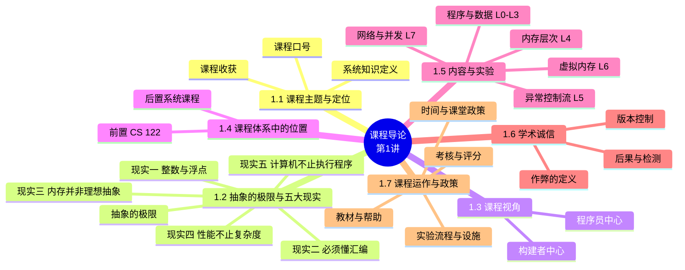
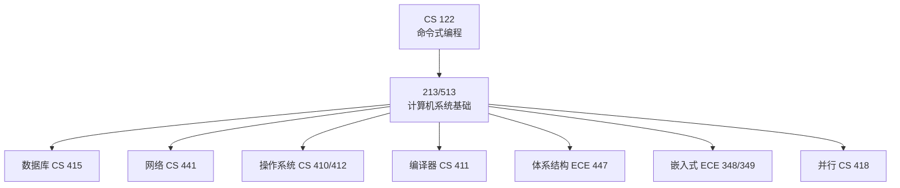

# 计算机系统基础：课程导论（Course Overview）

> **本章主线**：课程定位（知识就是力量）→ 为什么要理解底层（抽象的极限 + 五大现实）→ 课程视角（程序员中心 vs 构建者中心）→ 课程在体系中的位置 → 课程内容与实验（L0–L7）→ 学术诚信 → 课程运作与政策。
> 一句话版本：**这是整门课的"全景地图"**——先回答"为什么学、学什么、怎么学"，五大现实为后续每一章提供动机。



---

## 1.1 课程主题与定位（Course Theme）

**课程定位**：本课程对应 CMU 15-213/18-213/15-513《Introduction to Computer Systems》，是"计算机系统基础"类课程的**开篇导论**。课程口号是 **(Systems) Knowledge is Power!**——**系统知识就是力量**。

1. **系统知识的含义**：研究**硬件**（处理器、内存、磁盘、网络基础设施）与**软件**（操作系统、编译器、库、网络协议）如何**协同支撑应用程序的执行**，以及程序员如何**最好地利用这些资源**。
2. **学习本课的两大收获**：
    - 成为**更高效的程序员**：能够高效地发现并消除 bug；能够理解并调优程序性能。
    - 为后续"系统类"课程（编译器、操作系统、网络、计算机体系结构、嵌入式系统、存储系统等）**打下基础**。

> 一句话记忆：**学系统 = 理解"程序在机器上到底怎么跑"，从而写出又快又稳的代码**。

## 1.2 为什么要理解底层：抽象的极限与五大现实

### 1.2.1 抽象的极限：抽象是好的，但别忘了现实

大多数计算机课程都强调**抽象**：抽象数据类型、渐近分析……这些抽象让程序员可以忽略底层细节。但**抽象是有极限的**：

1. **bug 出现时**：高级语言模型会失效，必须深入底层实现才能定位问题。
2. **控制力不足时**：有时抽象接口无法提供你所需的控制级别或性能级别。
3. **理解实现才能用好抽象**：需要理解底层实现的细节。

> 口诀：**抽象管日常，底层管兜底**——抽象让你走得快，理解底层让你走得稳。

### 1.2.2 现实一：整数不是整数，浮点不是实数

**核心事实**：计算机中的**整数（int）与数学整数**、**浮点数（float）与数学实数**，行为并不一致——根源在于**表示的有限性**。

**例 1：$x^2 \ge 0$ 是否恒成立？**

1. 浮点运算：**是**（浮点平方不会出现"负的平方"这类离谱结果）。
2. 整数运算：**不一定**！
    - $40000 \times 40000 = 1600000000$，正常；
    - $50000 \times 50000 = ?$——**溢出回绕**（补充说明/拓展：$50000^2 = 2500000000$ 超出 32 位有符号整数最大值 $2^{31}-1 = 2147483647$，按补码回绕为 $2500000000 - 2^{32} = -1794967296$），结果竟然为**负**！

**例 2：$(x+y)+z = x+(y+z)$ 是否恒成立？（结合律）**

1. 无符号与有符号整数：**是**（整数运算满足结合律）。
2. 浮点：**不成立**！
    - $(1e20 + -1e20) + 3.14 = 0 + 3.14 = 3.14$ ✓
    - $1e20 + (-1e20 + 3.14) = ?$（补充说明/拓展）：$1e20$ 的数量级远大于 $3.14$，浮点舍入会把 $3.14$ "吸收"掉，$(-1e20 + 3.14)$ 的结果仍是 $-1e20$，于是 $1e20 + (-1e20) = 0$——结果**不是 3.14 而是 0**！

**计算机算术的两个基本观察**：

1. 算术运算**不会产生随机值**——它们具有重要的数学性质；
2. 但**不能假设所有"通常"的数学性质都成立**——因为表示是有限的。

**整数运算与浮点运算对照表**：

| 运算类型 | 满足的性质 | 失效场景 | 根本原因 |
|---|---|---|---|
| 整数运算 | "环"性质：交换律、结合律、分配律 | 溢出时（如 $50000 \times 50000$） | 有限位宽导致**溢出回绕** |
| 浮点运算 | "序"性质：单调性、符号值 | 大数吞小数、结合律失效（如 $1e20 + (-1e20 + 3.14)$） | 有限精度导致**舍入** |

**对程序员的启示**：必须理解**哪些抽象在哪些上下文中适用**——这是编译器作者与严肃应用程序员必须面对的重要议题。

> 口诀：**整数怕溢出，浮点怕舍入**；两者都不是它们数学意义上的"同名者"。

### 1.2.3 现实二：你必须懂汇编

**很可能你永远不会用汇编写程序**——编译器比人更优秀、更有耐心。但**理解汇编是理解"机器级执行模型"的关键**：

1. **理解 bug 存在时的程序行为**：一旦出错，高级语言模型会失效，只有机器级视角能看到真相。
2. **调优程序性能**：理解编译器**做了**哪些优化、**没做**哪些优化，从而定位程序低效的来源。
3. **实现系统软件**：编译器以机器码为生成目标；操作系统必须管理进程状态。
4. **制造与对抗恶意软件**：x86 汇编是"黑客的通用语"。

> 一句话记忆：**写汇编是少数人的工作，懂汇编是系统程序员的基本功**。

### 1.2.4 现实三：内存并非理想的"随机存取"抽象

**随机存取内存（RAM）是一种"非物理"的抽象**——它的行为与"任意位置访问代价相同"的理想模型并不一致：

1. **内存不是无界的**：必须被分配与管理；许多应用是"内存主导型"的。
2. **内存引用 bug 尤其隐蔽**：其影响在**时间与空间上都十分遥远**。
3. **内存性能并不均匀**：缓存与虚拟内存效应可显著影响程序性能；**让程序适配内存系统的特征**可以带来数量级的加速。

**完整例题：结构体越界写入（内存引用 bug）**

**题目陈述**：考虑如下 C 代码：

```c
typedef struct {
    int a[2];
    double d;
} struct_t;

double fun(int i) {
    volatile struct_t s;
    s.d = 3.14;
    s.a[i] = 1073741824; /* 可能越界 */
    return s.d;
}
```

对不同的 $i$ 调用 fun(i)，返回值如下（**结果与系统相关**）：

| $i$ | 0 | 1 | 2 | 3 | 4 | 6 |
|---|---|---|---|---|---|---|
| fun(i) 返回值 | 3.14 | 3.14 | 3.1399998664856 | 2.00000061035156 | 3.14 | 段错误（Segmentation fault） |

**完整解题步骤**（每一步注明依据）：

1. **确定写入的值**：$1073741824 = 2^{30} = 0x40000000$。
2. **确定结构体内存布局**：$a[0]$ 位于偏移 0，$a[1]$ 位于偏移 4；`double d` 按 8 字节对齐，占据偏移 8–15（低 4 字节 $d_3 \ldots d_0$ 在偏移 8–11，高 4 字节 $d_7 \ldots d_4$ 在偏移 12–15）。于是 `s.a[i] = 1073741824` 实际是在**偏移 $4i$ 处写入 $0x40000000$**。
3. **逐 i 分析**：
    - $i=0$、$i=1$：写入 $a[0]$、$a[1]$ 内部，不触碰 $d$ → 返回 3.14。
    - $i=2$：写入偏移 8，**覆盖 $d$ 的低 4 字节**。$d$ 原值 $3.14 = 0x40091EB851EB851F$，低 4 字节被改为 $0x40000000$ 后 $d \approx 0x40091EB840000000$ → 返回 **3.1399998664856**。
    - $i=3$：写入偏移 12，**覆盖 $d$ 的高 4 字节** → $d \approx 0x400000001EB851EB$ → 返回 **2.00000061035156**。
    - $i=4$：写入偏移 16，越出结构体但仍在栈帧内，恰好落在不影响 $d$ 的位置 → 返回 3.14（纯属巧合，结果依赖系统与编译器）。
    - $i=6$：写入偏移 24，越过栈帧、触碰保护页 → **段错误**。
4. **最终答案**：越界写入"静默地"破坏了相邻数据——返回值在 $i=2,3$ 时暴露出异常，$i=4$ 时又"恢复正常"，$i=6$ 才彻底崩溃。

> 该例演示的核心技巧/易错点：**数组越界不一定会立刻崩溃**——它可能悄悄改写无关变量，甚至让你在"看起来正常"的结果里埋下定时炸弹（错误与症状在时间与空间上完全分离）。

**为什么 C/C++ 会这样**：C 与 C++ **不提供任何内存保护**——越界数组引用、非法指针值、malloc/free 的滥用，都可能引发恶劣 bug（是否产生可观察效果取决于系统与编译器）。

**"行动距离效应"（action at a distance）**：被破坏的对象与正在访问的对象在逻辑上**毫无关系**；bug 的影响可能在其**产生很久之后**才被首次观察到。

**应对之道**：

1. 使用 Java、Ruby、Python、ML 等**内存安全语言**；
2. **理解**可能发生的各种交互；
3. 使用或开发**检测工具**（如 **Valgrind**）。

### 1.2.5 现实四：性能不止渐近复杂度

**渐近复杂度（大 O）不是性能的全部**：

1. **常数因子同样重要**——甚至**精确的运算次数也不能预测性能**。
2. 代码写法不同，可轻松出现 **10:1 的性能差异**。
3. 必须在多个层面优化：**算法、数据表示、过程、循环**。
4. 必须**理解系统**才能优化性能：程序如何被编译与执行；如何测量性能并定位瓶颈；如何**在不破坏模块化与通用性**的前提下提升性能。

**完整例题：copyij 与 copyji——循环嵌套顺序的威力**

**题目陈述**：以下两个函数完成相同的 2048×2048 矩阵复制，仅**内外层循环顺序不同**：

```c
void copyij(int src[2048][2048], int dst[2048][2048]) {
    int i, j;
    for (i = 0; i < 2048; i++)
        for (j = 0; j < 2048; j++)
            dst[i][j] = src[i][j];
}

void copyji(int src[2048][2048], int dst[2048][2048]) {
    int i, j;
    for (j = 0; j < 2048; j++)
        for (i = 0; i < 2048; i++)
            dst[i][j] = src[i][j];
}
```

实测（2.0 GHz Intel Core i7 Haswell）：copyij 耗时 **4.3ms**，copyji 耗时 **81.8ms**——**约 19 倍的差距**！

**完整解题步骤**（每一步注明依据）：

1. **前提：C 数组按行优先（row-major）存储**——`src[i][j]` 的内存地址随 $j$ 连续递增，同一行的元素相邻存放。
2. **分析 copyij**：内层循环以 $j$ 递增，访问的是**同一行内相邻元素**，**步长为 1 个元素**，空间局部性极好、缓存命中率高 → 读吞吐约 **14000–16000 MB/s**（接近内存带宽上限）。
3. **分析 copyji**：内层循环以 $i$ 递增，访问的是**同一列、跨行的元素**，**步长为 2048 个元素（整行）**，每次访问都"跳"过一整行，缓存行利用率极低 → 读吞吐骤降至约 **4000 MB/s**。
4. **最终答案**：**内存层次结构真实存在，性能取决于访问模式**——同样的运算量，仅仅改变循环顺序，性能相差近 20 倍。

> 该例演示的核心技巧/易错点：**优化"数据访问模式"（利用局部性）往往比优化"运算本身"收益更大**——这也是后续"内存层次"章节的核心动机。

### 1.2.6 现实五：计算机不止执行程序

计算机并不仅仅是"执行程序的引擎"：

1. **需要数据的输入与输出**：**I/O 系统**对程序的可靠性与性能**至关重要**。
2. **通过网络相互通信**：网络环境下会涌现大量系统级问题——
    - 自主进程之间的**并发操作**；
    - 应对**不可靠的传输介质**；
    - **跨平台兼容性**；
    - 复杂的**性能问题**。

> 口诀：**单机看程序，联网看系统**——I/O 与网络把"程序"变成"系统"。

## 1.3 课程视角：构建者中心 vs 程序员中心

**大多数系统课程是"构建者中心"（Builder-Centric）**——目标是培养"造系统的人"：

1. 计算机体系结构课：用 Verilog **设计**流水线处理器；
2. 操作系统课：**实现**操作系统的部分组件；
3. 编译器课：为简单语言**编写**编译器；
4. 网络课：**实现并模拟**网络协议。

**本课程是"程序员中心"（Programmer-Centric）**——目标是培养"用好系统的人"：

1. 通过更了解底层系统，成为**更高效的程序员**；
2. 写出**更可靠、更高效**的程序；
3. 融入需要**操作系统钩子**的特性（如并发、信号处理器）；
4. 覆盖**别处学不到**的材料；
5. 不是专为"极客黑客"开设——**"我们激发每个人心中的黑客"**。

**两种视角对比表**：

| 维度 | 构建者中心（其他系统课） | 程序员中心（本课） |
|---|---|---|
| 目标 | 造出系统组件 | 用好底层系统 |
| 典型活动 | Verilog 设计处理器、实现 OS 组件、写编译器、模拟协议 | 理解编译/执行/内存/网络，调优程序 |
| 产出 | 系统本身 | 更可靠、更高效的应用程序 |

> 口诀：**别人教你"造"，本课教你"用"——用得好，一样是高手**。

## 1.4 课程在 CS/ECE 课程体系中的位置

本课程（213/513）在课程体系中扮演**承上启下**的枢纽角色：以**命令式编程**（CS 122）为先修，为后续**数据库、网络、操作系统、编译器、体系结构、嵌入式、并行**等一大批系统类课程提供"底层原理地基"。



**详细说明**：

1. **前置知识**：CS 122 命令式编程（Imperative Programming）——本课假设你已具备 C 语言编程能力。
2. **本课定位**：**计算机系统基础（Foundation of Computer Systems）**——硬件、软件与网络背后**统一的基本原则**。
3. **后置受益课程**：CS 415 数据库、CS 441 网络、CS 440 分布式系统、CS 412 操作系统实践、CS 411 编译器、CS 410 操作系统、CS 418 并行计算、ECE 340 数字计算、ECE 447 体系结构、ECE 349/ECE 348 嵌入式系统/系统工程、ECE 545/549 毕业设计。

> 一句话记忆：**213/513 是"系统课程的十字路口"——前面是编程，后面是系统**。

## 1.5 课程内容总览：主题与实验（L0–L7）

课程内容划分为**五大主题模块**，每个模块配有**配套实验（Lab）**——实验是课程的**心脏**，每个实验持续 1–2+ 周，融合**编程与测量**，提供对系统某一方面的深入理解。

**主题模块与实验对照表**：

| 主题模块 | 内容要点 | 涉及领域 | 配套实验 |
|---|---|---|---|
| 程序与数据 | 位运算、算术、汇编程序；C 控制与数据结构表示 | 体系结构、编译器 | L0 C 编程实验（测试/复习 C 能力）；L1 datalab（位操作）；L2 bomblab（拆除二进制炸弹）；L3 attacklab（代码注入攻击基础） |
| 内存层次 | 内存技术、内存层次、缓存、磁盘、局部性 | 体系结构、操作系统 | L4 cachelab（构建缓存模拟器并优化局部性） |
| 异常控制流 | 硬件异常、进程、进程控制、Unix 信号、非局部跳转 | 编译器、操作系统、体系结构 | L5 tshlab（编写自己的 Unix shell，首次接触并发） |
| 虚拟内存 | 虚拟内存、地址翻译、动态存储分配 | 体系结构、操作系统 | L6 malloclab（编写自己的 malloc 包，体验系统级编程） |
| 网络与并发 | 高层与底层 I/O、网络编程、Internet 服务、Web 服务器、并发与线程、select I/O 多路复用 | 网络、操作系统、体系结构 | L7 proxylab（编写自己的 Web 代理） |

**实验理念（Lab Rationale）**：

1. 每个实验都有**明确的目标**——解一个谜题，或赢一场竞赛；
2. 完成实验应让你获得**新技能与新概念**；
3. 用**健康且有趣**的方式引入竞争：设定合理的满分阈值；在 Autolab **匿名记分榜**上公布中间结果，"为荣耀而战"。

> 口诀：**主题五大块、实验跟着走**——每个实验都是对应主题的"实战演练场"。

## 1.6 学术诚信（Academic Integrity）

学术诚信是系统课程的**红线**，务必高度重视（尤其是入学第一学期）。

**作弊/抄袭的定义**——两类行为：

1. **未授权使用信息**：
    - **复制代码**：拷贝、重打、甚至只是"看一眼文件"；
    - **口头描述**：把代码从一个人口头转述给另一个人；
    - **上网搜索题解**：用搜索引擎搜 15-213、15213、malloclab 等关键词——仅"输入搜索"即构成作弊；
    - **照抄旧材料**：抄以往课程或在线解答的代码；
    - **复用自己上学期的代码**（若该代码为 213/513 专属且你已获得学分）。
2. **未授权提供信息**：
    - **提供拷贝**：把代码文件发给别人；
    - **提供访问途径**：把材料放进未受保护的目录或公开代码仓库（如 GitHub）；
    - **没有追诉时效**：学术诚信违规不因时间流逝而失效。

**什么不算作弊（且被鼓励）**：

1. 解释如何使用系统或工具；
2. 帮助他人解决高层设计问题；
3. 使用课程提供的代码；
4. 使用 CS:APP 网站上的代码。

**具体行为对照表**：

| 行为 | 是否作弊 |
|---|---|
| 用搜索引擎搜 15-213、malloclab 等关键词 | 是（输入即违规） |
| 看旁边同学的代码 | 是 |
| 把代码交给别人（现在或将来） | 是 |
| 把代码发布到公开互联网（现在或将来） | 是 |
| 攻击课程基础设施 | 是 |
| Google 一个 man page（如 fputs） | 否（鼓励） |
| 向朋友请教 gdb 用法 | 否（鼓励） |
| 向 TA/教员求助并展示你的代码 | 否（鼓励） |
| 查阅教材中的代码示例 | 否（鼓励） |
| 与同学讨论 lab 的高层思路 | 否（鼓励） |

**后果与检测**：

1. **最好情况**：该作业记 **-100%**——"还不如不交"；
2. **最坏情况（默认）**：**退课并挂科**；永久记录；失去本人、教员与同伴的尊重；
3. **检测手段**：先进的代码抄袭检测工具——2015 年秋 20 名学生被抓并挂科（部分被开除）；2016 年 1 月，11 人因可追溯至 2014 年春的违规受罚；
4. **忠告**：不要做！**合理安排时间**，卡住时**主动找助教求助**。若已作弊，尽快坦白。"无知不是借口"。

**情景判断**（一句话版）：Bob 把自己的代码打印稿"留"在 Charlie 椅子上 → 提供方与使用方都涉事；Bob 陪 Alice 一起过她的代码 → 正常互助；Charlie 偷看 Bob 屏幕看他如何实现 free list → 作弊；Alice 问 Bob 如何在 gdb 设断点 → 正常；Charlie 去找 TA 求助 → 正常。不确定时，细读 syllabus，再不确定就问 staff。

**版本控制：你的好朋友**：

1. 使用 **ECE GIT 服务器**（git.ece.cmu.edu），而非 GitHub；
2. **频繁提交**（commit early and often），并**写清提交说明**；
3. **缺失的 GIT 历史可能对你不利**；
4. 若被怀疑学术诚信问题，**提交历史可充当"人品证人"**——稳定、一致、持续的工作记录是最好的自证。

> 口诀：**学术诚信没有"灰色地带"——拿不准就去问；GIT 历史是你最忠实的证人**。

## 1.7 课程运作与政策（Logistics and Policies）

### 1.7.1 教材与帮助渠道

**教材（两本）**：

1. **《Computer Systems: A Programmer's Perspective》第三版（CS:APP 3e）**，Bryant 与 O'Hallaron 著，Pearson 2016——"这本书对课程**真的很重要**"：它告诉你**如何做实验**，其中的**练习题**与考题同源（典型考题）。
2. **《The C Programming Language》第二版**，Kernighan 与 Ritchie 著，Prentice Hall 1988——出自 C 语言发明者之手，**至今仍是最好的 C 语言书**（虽未覆盖 C 的较新扩展）。

**帮助渠道**：

1. **课程网页**：完整课表、讲义、作业、考题与解答、FAQ；
2. **Piazza**：作业问题的最佳去处；帖子默认私密；**不要直接贴代码**（放到 Autolab 后再发帖）；
3. **Canvas**：课堂测验；
4. **邮件**：仅用于预约面谈；
5. **Office hours**：周日到周四 5:00–9:00pm（周四 5:30–9:00）；
6. **Walk-in 辅导**与 **1:1 预约**：可与任意教学人员预约。

> 口诀：**作业问 Piazza，概念看讲义，卡壳找 Office hour**。

### 1.7.2 考核与评分

**课程三大组成部分**：

1. **讲座（Lectures）**：讲授高层概念；15-213/18-213 有 Canvas **课堂测验**，边缘分数时表现可帮你**向上提档**；
2. **实验（Labs，共 8 个）**：课程的**心脏**，每个持续 1–2+ 周，**编程 + 测量**，深入理解系统的某一方面；
3. **考试（Exams：期中 + 期末）**：测试对**概念与数学原理**的理解。

**评分构成**：

1. **考试占 50%**：期中 20% + 期末 30%；
2. **实验占 50%**：按工作量加权；
3. **总分**按直线标准（90/80/70/60）给出，辅以**少量调分**——**只上调，不下调**。

### 1.7.3 实验流程与设施

**标准实验流程（Doing the Lab）**：

1. 到 **theproject.zone**（课程实验门户）阅读**实验说明书（writeup）**——阅读过程中回答**评估问题**；
2. 完成全部评估问题后获得一个**提交码（submission code）**（L0 不需要）；
3. 到 **Autolab** 下载实验材料（通常为 **tar 包**，须在**新目录**中解压）；
4. 在 **git.ece.cmu.edu** 创建仓库，加入所有文件并提交；
5. 带着提交码到 **Autolab** 提交评分。

**Autolab 系统**：核心思想是**自动评分（Autograding）**与**记分榜（Scoreboards）**——即时反馈、实时排名、匿名展示；每学期服务 3000+ 学生；用浏览器即可完成下载材料、提交、查看记分榜、查看完整提交历史与评分记录、查看 TA 的风格点评。

**实验设施（Intel 计算机系统集群）**：即传说中的 **"shark machines"**（`ssh shark.ics.cs.cmu.edu`）——Intel 捐赠的 21 台服务器：**10 台学生机**、**1 台头节点**、**10 台评分机**；每台为 Intel Core i7（8 个 Nehalem 核）、32 GB DRAM、RHEL 6.1。

**实验与考试政策**：

1. 所有实验**独立完成**（work alone）；
2. 实验截止 **11:59pm**；必须通过 Autolab **电子提交（无例外）**；
3. 考试在**网络隔离的机房**在线进行，多天自选时间；
4. 成绩申诉：评分完成后 **7 天内**通过 Piazza **私信**，按 syllabus 中的正式流程。

### 1.7.4 时间与课堂政策

**宽限日（Grace Days）与迟到惩罚**：

1. 每学期共 **5 个宽限日**；每个实验**自动**最多使用 0/1/2 个；
2. 宽限日覆盖：日程冲突、出行、生病、小挫折；
3. 宽限日用完后，**每天罚 15%**；**截止日后 3 天**不再接受任何提交；
4. 灾难性事件（重病、家人去世等）：与**学业导师**一起制定恢复计划；
5. **建议**：一旦开始落后，真的很难追上——尽量把宽限日留到**最后几个实验**。

**课堂规则**：

1. **允许**使用笔记本；
2. **禁止**任何电子通讯（邮件、即时消息、手机通话等）；
3. **强烈鼓励**出席 213 课堂（边缘分数时可加分）；
4. **禁止任何形式的录制**。

## 知识定位与框架衔接

### 前置知识（地基）

1. **C 语言程序设计（命令式编程）**：本课直接从 C 出发（L0 即为 C 编程实验），假定你已具备扎实的 C 基础；后续所有机器级分析（汇编、内存布局）都以 C 程序为对象。
2. **计算机基本组成概念**：对 CPU、内存、I/O 设备有基本认识即可——本课将把这些概念"拆开重讲"。

### 后置知识（上层建筑）

1. **本课后续章节**：位与整数 → 浮点数 → 机器级编程（汇编）→ 内存层次 → 异常控制流 → 虚拟内存 → 链接 → 系统级 I/O → 网络与并发——**五大现实将在每一章被逐一展开与回应**。
2. **后续系统类课程**：操作系统、计算机体系结构、编译器、网络、数据库、并行计算、嵌入式系统——本课为它们提供底层原理地基。

### 本讲在整个课程中的位置（全景地图比喻）

本讲相当于出发前的**"路线图"**（或盖房子前的"设计总览"）：它不涉及任何具体技术细节，而是回答四个问题——**这门课是什么、为什么学、学什么、怎么学**。其中 **五大现实** 是贯穿整门课的**"动机引擎"**：后续每一章都在回应其中至少一条现实（如"整数与浮点"章回应现实一、"汇编"章回应现实二、"内存层次"章回应现实三与四……）。建议把五大现实作为**理解每章"为什么要讲这个"的挂载点**。

### 核心灵魂问题（学完本讲应能回答）

1. **为什么整数乘法可能得到负数，而浮点加法不满足结合律？** 根源是什么？——根源是**表示的有限性**：整数有限位宽导致**溢出回绕**（$50000 \times 50000$ 为负），浮点有限精度导致**舍入**（$1e20$ 吞掉 $3.14$，结合律失效）。
2. **为什么 copyij 比 copyji 快约 19 倍，尽管两者运算量完全相同？** ——**访问模式（局部性）决定缓存利用率**：行优先连续访问命中率高，列优先大跨步访问缓存失效，性能相差近一个数量级。
3. **什么是"行动距离效应"？它为什么让内存 bug 如此难以排查？** ——被破坏的对象与正在访问的对象逻辑无关，影响在**时间与空间上远离产生点**，症状出现时早已"查无实据"。

> **一句话总结本讲**：**本课 = "知识就是力量"的系统版——理解硬件与软件如何协同执行程序，用五大现实为全书各章提供动机，用 8 个实验把知识变成肌肉记忆。**

---

## 课件 PDF

<iframe src="https://naimore3.github.io/Naimore3-s-Learning-Notes/课程笔记/大二上/计算机系统基础/overview/01-overview.pdf" width="100%" height="800px" style="border: none;"></iframe>

[打开 PDF](https://naimore3.github.io/Naimore3-s-Learning-Notes/课程笔记/大二上/计算机系统基础/overview/01-overview.pdf)
