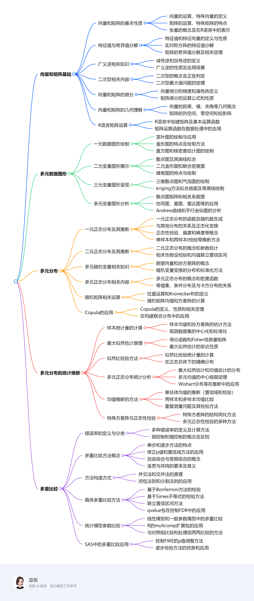

# 讲义总览

1. **向量和矩阵基础**
    - **基本性质**：介绍向量、矩阵和张量的概念、运算（如转置、加减、数乘、乘法），以及秩、迹、行列式、逆矩阵等相关性质，还给出了四块求逆公式和Woodbury恒等式。
    - **特征值与奇异值分解**：讲解特征值、特征向量的定义和性质，实对称方阵的特征值分解，以及矩阵的奇异值分解及其与特征值分解的关系，这些分解在数据降维、矩阵近似等方面有重要应用。
    - **广义逆**：包括减号逆和加号逆（Moore - Penrose广义逆）的定义、性质及应用，如在正交投影、线性方程组求解和线性最小二乘问题中的应用。
    - **二次型**：阐述二次型的概念，正定与半正定二次型的判定，以及二次型最大值问题的相关定理。
    - **微分**：介绍向量和矩阵的微分运算，包括梯度、海色阵的定义，以及相关的运算公式和性质。
    - **几何理解**：从向量的距离、模、夹角，到坐标旋转变换，再到矩阵的列空间、零空间和投影阵等方面，给出向量和矩阵的几何解释。
    - **R语言运算**：列举R语言中常用的矩阵运算函数，如创建矩阵、转置、求对角阵、矩阵乘法等，为后续数据处理和分析提供工具。
2. **多元数据图形**
    - **一元数据图形**：介绍茎叶图、盒形图、直方图、核密度估计图等一元数据图形的绘制方法和应用场景，可用于查看数据分布、检测异常值等。
    - **二元变量图形**：包括散点图、散点图的曲线拟合、二元盒形图、二元联合密度图、蜂窝图等，用于展示两个变量之间的关系。
    - **三元变量图形**：三维散点图和气泡图可展示三个变量的信息，kriging方法可用于曲面拟合和等高线绘制。
    - **多元变量图形**：散点图矩阵、相关系数图、协同图、星图、雷达图、脸谱图、Andrew曲线、平行坐标图等用于展示多个变量之间的关系，帮助分析数据结构和特征。
3. **多元分布**
    - **一元正态分布及其统计推断**：涵盖一元正态分布的密度、分布函数、分位数函数、随机数生成，以及与其他分布的关系、正态化变换、正态性检验、偏度和峰度、重尾分布、混合模型分布等内容，还介绍了单样本t检验、两样本t检验、均值的置信区间和最大似然估计等统计推断方法。
    - **二元正态分布及其统计推断**：介绍二元正态分布的概念、参数估计、相关性假设检验、均值的联立置信区间等，通过实例展示如何分析两个变量之间的关系。
    - **多元随机变量**：讲解多元随机变量的期望向量、协方差阵的概念和性质，以及多元随机变量变换的分布和随机向量的标准化方法。
    - **多元正态分布**：包括多元正态分布的概念、密度函数、等值集、条件分布等，以及多元正态分布与卡方分布的关系，在实际数据建模中有广泛应用。
    - **随机矩阵**：介绍随机矩阵的拉直运算、Kronecker积，以及随机矩阵的均值和方差阵的计算方法。
    - **Copula**：Copula是一种用于从边缘分布构建联合分布的工具，介绍了其定义、性质和相关定理，以及在实际中的应用。
4. **多元分布的统计推断**
    - **样本统计量**：介绍多元分布样本的均值、协方差阵的估计方法，以及观测数据集的中心化、标准化和相关阵估计，为后续统计推断提供基础。
    - **最大似然估计**：基于最大似然估计方法，介绍得分函数、Fisher信息量矩阵等概念，以及最大似然估计的渐近性质。
    - **似然比检验**：通过似然比检验统计量，检验参数假设，在正态总体下，部分检验统计量有精确分布。
    - **多元正态分布统计**：针对多元正态分布，介绍最大似然估计、均值估计的分布、多元均值的中心极限定理等，以及Wishart分布、Hotelling T方分布和Wilks分布在多元正态分布推断中的应用。
    - **均值推断**：包括多元正态分布单总体均值的推断（联立置信域和均值检验）、独立两样本和多样本多元正态分布均值比较，以及重复测量问题及其检验方法。
    - **特殊方差阵与正态性检验**：介绍多元正态分布特殊方差阵的结构简化方法，以及多元正态性检验的多种方法，如推广的QQ图、多元偏度峰度检验等。
5. **多重比较**
    - **错误率定义**：介绍多重比较中的各种错误率，如平均单次比较错误率（PCER）、总错误率（FWER）、广义总错误率（gFWER）、错误发现率（FDR）等，以及弱控制和强控制的概念。
    - **方法概念**：包括单步和逐步方法、修正p值、置信域方法、自由组合与受限组合、连贯与共鸣等多重比较方法的基本概念。
    - **方法构造**：并交法、交并法、闭包法则和分割法则是多重比较方法的构造方式，各有特点和适用场景。
    - **具体方法**：基于Bonferroni方法的检验（包括Bonferroni方法、Holm方法、Šidák方法等）、基于Simes不等式的检验方法、联立置信区间方法（如Scheffe方法、Shaffer - Holm逐步检验方法），以及qvalue包在控制FDR中的应用。
    - **统计模型参数比较**：在线性模型、一般参数模型中进行多重比较的方法，以及R的multcomp扩展包在统计模型参数多重比较中的应用，包括glht函数、summary函数、confint函数的使用，以及与对照组比较和处理组之间两两比较的方法。
    - **SAS中的应用**：在SAS单因素方差分析中，介绍控制FWE的p值调整方法，如Bonferroni方法、Bootstrap方法等，以及逐步检验方法的优势和应用。 