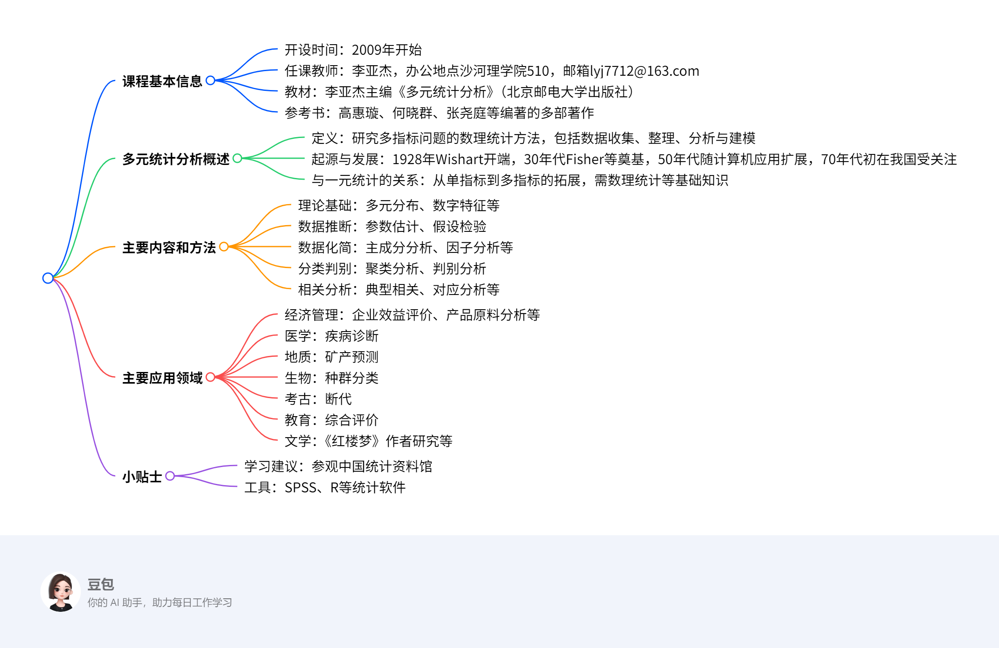

# 第一章：绪论
该文档是关于多元统计分析课程的PPT内容，主要涵盖课程基本信息、多元统计分析的定义、发展、主要内容、方法、应用以及小贴士等方面。

1. **课程基本信息**
    - **开设时间**：2009年开始。
    - **任课教师**：李亚杰，办公地点在沙河理学院510，邮箱lyj7712@163.com。
    - **教材和参考书**：列举了多种相关教材和参考书，如《多元统计分析》（杨维权等编、于秀林和任雪松编著、张润楚编著等多个版本 ）、《应用多元统计分析》（高惠璇编）等。
2. **多元统计分析概述**
    - **定义**：运用数理统计方法研究解决多指标（多元、多维数据）问题的理论和方法，包括收集、整理、分析多元数据并得出结论（建模）。
    - **起源与发展**：起源于上世纪初，1928年Wishart发表论文标志开端，20世纪30年代Fisher、Hotelling等奠定理论基础，50年代随计算机发展广泛应用，70年代初期在我国受到关注 。
3. **主要内容和方法**
    - **理论基础**：为后续分析提供理论支撑。
    - **多元数据的统计推断**：对多元数据进行推断分析。
    - **简化数据结构**：如多元回归分析、聚类分析、主成分分析等方法，在不损失过多有用信息的前提下简化数据表示，便于解释。
    - **变量间的相互联系**：通过多元回归、典型相关等方法研究变量间是否存在相关关系及具体体现。
    - **分类与判别**：基于特征对对象或变量分组，如判别分析、聚类分析等。
4. **主要应用领域**
    - **社会**：研究城镇居民消费水平时，用聚类分析归并相关指标研究消费结构。
    - **经济**：评价企业经济效益用主成分分析和因子分析法综合指标；比较不同原料生产产品寿命差异用假设检验；分析全国人均收入特征用对应分析；品酒用多维标度法分析酒之间的结构关系。
    - **医学**：利用判别分析方法，根据症状指标数据判定新病人所患疾病。
    - **地质**：运用因子分析等方法研究矿石化学成分关系，了解矿体性质和形成原因。
    - **生物**：聚类分析方法根据鱼类测量特征对其进行种群分类。
    - **考古**：通过判别分析根据人头盖骨、动物牙齿等特征进行考古断代。
    - **教育**：高考招生中用因子分析等方法了解学生学习科目偏好和思维能力对成绩的影响。
    - **文学**：研究《红楼梦》作者时使用聚类分析、主成分分析等方法。
5. **小贴士**
    - **参观中国统计资料馆**：鼓励通过参观丰富统计知识和视野。
    - **统计应用软件**：介绍了S - PLUS 2000、R、SPSS等多种软件，强调工具对学习和应用多元统计分析的重要性。 
