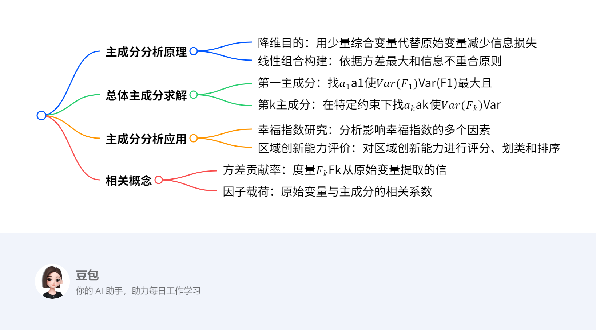

# 第七章：主成分分析
## 概览
---
1. **一段话总结**：
主成分分析是多元统计分析中的一种重要方法，旨在**降维**，用少量综合变量代替原始变量，减少信息损失。通过构建线性组合，依据方差最大化及变量间互不相关的原则确定主成分。如在研究幸福指数、国民收入与支出等案例中，计算协方差阵或相关阵的特征值和特征向量，确定方差贡献率，以此判断保留主成分的数量。还介绍了因子载荷、信息被提取率等概念，以及主成分分析在人脸识别、区域创新能力评价等多领域的应用。
---

---
3. **详细总结**：
    - **主成分分析原理**：主成分分析是多元统计分析方法，核心目的是**降维**，即使用少量综合变量$F$代替原始变量$X$，同时保证信息（特征）损失最少。这些综合变量通过原始变量的线性组合得到，且要求信息损失少、信息不重合，即$Var(F_{i})$尽可能大且$Cov(F_{i}, F_{j}) = 0$（$i \neq j$）。
    - **总体主成分**：设$X = (X_{1}, X_{2}, \cdots, X_{p})^{T}$为$p$维随机变量，主成分通过线性组合$F_{i} = a_{i}^{T}X$（$i = 1,2,\cdots,p$）确定。以第一主成分为例，要在$a_{1}^{T}a_{1} = 1$的约束条件下，找到$a_{1}$使$Var(F_{1}) = a_{1}^{T}\sum a_{1}$达到最大，此时$F_{1}$就是第一主成分；第$k$主成分则是在$a_{k}^{T}a_{k} = 1$及$Cov(F_{k}, F_{i}) = 0$（$i = 1,2,\cdots,k - 1$）的条件下，找$a_{k}$使$Var(F_{k}) = a_{k}^{T}\sum a_{k}$最大。
    - **主成分分析步骤（以实例说明）**：
        - **计算相关矩阵**：在对某年全国30个省市自治区的8项经济指标作主成分分析时，首先计算样本相关阵$R$ ，如下表：

        | |GDP|居民消费水平|固定资产投资|职工平均工资|货物周转量|居民消费价格指数|商品零售价格指数|工业总产值|
        |---|---|---|---|---|---|---|---|---|
        |GDP|1.000|0.267|0.848|0.191|0.617|-0.273|-0.264|0.874|
        |居民消费水平|0.267|1.000|0.443|0.718|-0.151|-0.229|-0.593|0.363|
        |固定资产投资|0.848|0.443|1.000|0.401|0.408|-0.247|-0.366|0.688|
        |职工平均工资|0.191|0.718|0.401|1.000|-0.356|-0.146|-0.539|0.104|
        |货物周转量|0.617|-0.151|0.408|-0.356|1.000|-0.251|0.022|0.659|
        |居民消费价格指数|-0.273|-0.229|-0.247|-0.146|-0.251|1.000|0.763|-0.119|
        |商品零售价格指数|-0.264|-0.593|-0.366|-0.539|0.022|0.763|1.000|-0.192|
        |工业总产值|0.874|0.363|0.688|0.104|0.659|-0.119|-0.192|1.000|

        - **计算特征值及方差贡献率**：计算样本相关阵$R$的特征值及方差贡献率，前3个特征值累计贡献率已达88.27% ，说明前3个主成分基本包含了全部指标具有的信息，如下表：

        |主成分|特征值|方差贡献率|累计方差贡献率|
        |---|---|---|---|
        |1|3.665|45.813|45.813|
        |2|2.183|27.293|73.106|
        |3|1.213|15.163|88.270|
        |4|0.404|5.048|93.317|
        |5|0.205|2.561|95.878|
        |6|0.179|2.232|98.109|
        |7|0.118|1.475|99.585|
        |8|0.033|0.415|100.000|

        - **计算特征向量及主成分得分**：计算样本相关阵$R$的特征向量，得到前三个主成分的表达式，如$F_{1}^{*}=0.45X_{1}^{*}+0.33X_{2}^{*}+\cdots+0.416X_{8}^{*}$等。通过主成分得分函数换算得到样本主成分得分，并可进行排序、评价和分类等操作。
    - **主成分分析的应用**：主成分分析在多个领域有广泛应用，如幸福指数研究、区域创新能力评价、人脸识别、人类群体遗传结构分析、判断《红楼梦》作者等。在实际应用中，可根据具体问题确定主成分的数量和命名，常见方法有碎石图、凯泽潜在根法、信息被提取率（共同度）等 ，不同学科领域对保留主成分的比例要求不同，如自然科学≥95%，社会科学≥60%。
    - **相关概念**：
        - **方差贡献率**：度量了$F_{k}$从原始变量$X_{1}, X_{2}, \cdots, X_{p}$中提取的信息。
        - **因子载荷**：原始变量$X_{i}$与主成分$F_{k}$的相关系数$\rho_{i k}=\frac{c_{i k}\sqrt{\lambda_{k}}}{\sqrt{\sigma_{i i}}}$ ，$c_{i k}^{2}\lambda_{k}/\sigma_{i i}$表示第$i$个原始变量$X_{i}$被$F_{k}$提取的信息的比重。
        - **信息被提取率（共同度）**：若选取了$m$个主成分，$v_{i}^{(m)}=\sum_{k = 1}^{m}\rho_{i k}^{2}=\sum_{k = 1}^{m}c_{i k}^{2}\lambda_{k}/\sigma_{i i}$称为第$i$个原始变量$X_{i}$被$m$个主成分$F_{1}, F_{2}, \cdots, F_{m}$的信息被提取率。
---
4. **关键问题**：
    - **问题1：如何确定主成分的个数？**
        - **答案**：可以通过计算方差贡献率来确定，一般当累计方差贡献率达到一定比例（如自然科学≥95%，社会科学≥60%）时，对应的主成分个数即可保留。也可结合碎石图、凯泽（Kaiser）潜在根法、信息被提取率（共同度）等方法综合判断。
    - **问题2：主成分分析与其他分析方法（如聚类分析、因子分析）有什么联系和区别？**
        - **答案**：联系在于主成分分析可与这些方法融合使用，如主成分聚类。区别在于主成分分析主要用于降维，将多个原始变量转化为少数综合变量；聚类分析侧重于将数据对象分组；因子分析是从多个变量中提取公共因子，解释原始变量之间的相关性。
    - **问题3：在实际应用中，主成分分析对数据有什么要求？**
        - **答案**：数据需具有一定的相关性，可通过KMO检验和Bartett's检验判断，KMO值越趋于1，变量相关性越强，越适合做主成分分析；Bartett's检验中越拒绝原假设（相关系数矩阵为单位阵），也越适合。此外，数据应尽量避免异常值，否则可能影响分析结果的准确性。 
## 1 主成分分析原理
### 主成分分析原理 - 降维
主成分分析旨在**降维**，核心是用少量综合变量 **$F$** 代替原始变量 **$X$** ，并使信息（特征）损失最少。

### 实现方式
- **线性组合**：通过原始变量的线性组合构建综合变量。
- **信息损失少**：要求综合变量的方差 **$Var(F)$尽可能大**，以最大程度保留原始数据信息。
- **信息不重合**：各综合变量 **$F_{i}$与$F_{j}$互不相关** ，确保不同综合变量包含的信息不重叠。 
## 2 总体主成分
### 总体主成分
1. **第一主成分**
    - **原理**：要找向量$\mathbf{a}_1$，在约束条件$\mathbf{a}_1^T\mathbf{a}_1 = 1$下，使$Var(\mathbf{F}_1)=Var(\mathbf{a}_1^T\mathbf{X})=\mathbf{a}_1^T\mathbf{\Sigma}\mathbf{a}_1$达到最大 ，其中$\mathbf{\Sigma}$是$\mathbf{X}$的协方差阵，$\mathbf{F}_1=\mathbf{a}_1^T\mathbf{X}$称为第一主成分。
    - **求解方法 - 拉格朗日乘数法**：构造函数$L(\mathbf{a}_1, \lambda)=\mathbf{a}_1^T\mathbf{\Sigma}\mathbf{a}_1+\lambda(1 - \mathbf{a}_1^T\mathbf{a}_1)$ ，通过求偏导并令其为0求解。也可利用二次型理论，已知存在正交阵$\mathbf{P}$，使得$\mathbf{P}^T\mathbf{\Sigma}\mathbf{P}=\text{diag}(\lambda_1,\cdots,\lambda_p)$ ，$\lambda_1\geq\cdots\geq\lambda_p$为$\mathbf{\Sigma}$特征值，相应正交单位特征向量为$\mathbf{p}_1,\cdots,\mathbf{p}_p$ 。当$\mathbf{a}_1 = \mathbf{p}_1$（对应最大特征值$\lambda_1$的特征向量 ）时，$Var(\mathbf{F}_1)$达到最大，且$Var(\mathbf{F}_1)=\lambda_1$ 。 
    - **例子**：假设有二维随机变量$\mathbf{X}=(X_1,X_2)^T$，协方差阵$\mathbf{\Sigma}=\begin{pmatrix}2&1\\1&2\end{pmatrix}$ 。
        - 求$\mathbf{\Sigma}$的特征值：$|\mathbf{\Sigma}-\lambda\mathbf{I}|=(2 - \lambda)^2 - 1=\lambda^2 - 4\lambda + 3 = 0$ ，解得$\lambda_1 = 3$，$\lambda_2 = 1$ 。
        - 求特征向量：对于$\lambda_1 = 3$ ，$(\mathbf{\Sigma}-3\mathbf{I})\mathbf{v}_1=\mathbf{0}$ ，即$\begin{pmatrix}-1&1\\1&-1\end{pmatrix}\begin{pmatrix}v_{11}\\v_{12}\end{pmatrix}=\begin{pmatrix}0\\0\end{pmatrix}$ ，取$\mathbf{v}_1=\begin{pmatrix}\frac{\sqrt{2}}{2}\\\frac{\sqrt{2}}{2}\end{pmatrix}$（单位化后 ）。对于$\lambda_2 = 1$ ，$(\mathbf{\Sigma}-1\mathbf{I})\mathbf{v}_2=\mathbf{0}$ ，即$\begin{pmatrix}1&1\\1&1\end{pmatrix}\begin{pmatrix}v_{21}\\v_{22}\end{pmatrix}=\begin{pmatrix}0\\0\end{pmatrix}$ ，取$\mathbf{v}_2=\begin{pmatrix}-\frac{\sqrt{2}}{2}\\\frac{\sqrt{2}}{2}\end{pmatrix}$（单位化后 ）。
        - 第一主成分：根据上述理论，第一主成分$\mathbf{F}_1=\mathbf{v}_1^T\mathbf{X}=\frac{\sqrt{2}}{2}X_1+\frac{\sqrt{2}}{2}X_2$ ，此时$Var(\mathbf{F}_1)=\lambda_1 = 3$ 。
2. **第$k$主成分（$k > 1$）**
    - **原理**：在$\mathbf{a}_k^T\mathbf{a}_k = 1$及$Cov(\mathbf{F}_k, \mathbf{F}_i)=\mathbf{a}_k^T\mathbf{\Sigma}\mathbf{a}_i = 0$（$i = 1,2,\cdots,k - 1$ ）条件下，找$\mathbf{a}_k$使$Var(\mathbf{F}_k)=Var(\mathbf{a}_k^T\mathbf{X})=\mathbf{a}_k^T\mathbf{\Sigma}\mathbf{a}_k$达到最大 ，$\mathbf{F}_k=\mathbf{a}_k^T\mathbf{X}$称为第$k$主成分。
    - **求解方法**：同样基于协方差阵$\mathbf{\Sigma}$的特征值和特征向量求解。在已经确定前$k - 1$个主成分对应的特征向量（正交单位向量 ）$\mathbf{a}_1,\cdots,\mathbf{a}_{k - 1}$后，从$\mathbf{\Sigma}$剩余的特征向量中选取对应特征值次大的（在满足与前面主成分不相关条件下 ）作为$\mathbf{a}_k$ 。 
    - **例子（续上例求第二主成分 ）**：因为已经得到第一主成分对应的特征向量$\mathbf{v}_1$ ，对于第二主成分，根据条件，选取对应特征值$\lambda_2 = 1$的特征向量$\mathbf{v}_2$ ，第二主成分$\mathbf{F}_2=\mathbf{v}_2^T\mathbf{X}=-\frac{\sqrt{2}}{2}X_1+\frac{\sqrt{2}}{2}X_2$ ，$Var(\mathbf{F}_2)=\lambda_2 = 1$ 。
3. **定理**
设$\mathbf{\Sigma}$是$\mathbf{X}=(\mathbf{X}_1,\mathbf{X}_2,\cdots,\mathbf{X}_p)^T$的协方差阵，其特征值按大小排序为$\lambda_1\geq\cdots\geq\lambda_p$ ，相应的正交单位特征向量为$\mathbf{a}_1,\cdots,\mathbf{a}_p$ ，则$\mathbf{X}$的第$k$主成分可表示为$\mathbf{F}_k=\mathbf{a}_k^T\mathbf{X}=\sum_{i = 1}^{p}a_{ki}X_i$ ，其中$\mathbf{a}_k=(a_{1k},a_{2k},\cdots,a_{pk})^T$ ，并且$Var(\mathbf{F}_k)=\lambda_k$ 。 

### 保留几个主成分
 - **依据方差贡献率判断**：方差贡献率是衡量主成分重要性的指标，$Var(\mathbf{F}_k)=\lambda_k$ ，第$k$主成分的方差贡献率为$\frac{\lambda_k}{\sum_{i = 1}^{p}\lambda_i}$ 。通常累计方差贡献率达到一定比例（如80% - 90%以上 ）时，对应的主成分个数可保留。例如，若前$m$个主成分的累计方差贡献率$\sum_{k = 1}^{m}\frac{\lambda_k}{\sum_{i = 1}^{p}\lambda_i}\geq 85\%$ ，则保留前$m$个主成分 。 具体计算时，先求出协方差阵的所有特征值$\lambda_i$，再依次计算各主成分方差贡献率及累计方差贡献率，根据设定阈值确定保留主成分数量。 
## 例题
### 主成分分析例题
通过对给定随机变量从协方差阵和相关阵分别进行主成分分析，展示主成分分析的具体过程。

### 求解方法
1. **从协方差阵出发**
    - 计算协方差阵的**特征值**和**正交单位特征向量**。
    - 根据特征值和特征向量确定**主成分**表达式，主成分是原始变量以特征向量为系数的线性组合。
2. **从相关阵出发**
    - 先将原始变量标准化，标准化后的变量的协方差阵就是原始变量的相关阵。
    - 计算相关阵（即标准化后变量的协方差阵）的特征值和正交单位特征向量。
    - 确定主成分表达式。

### 例子解题步骤
1. **从协方差阵Σ出发**
    - 已知协方差阵$\Sigma=\begin{pmatrix}1&2\\2&100\end{pmatrix}$。
    - 计算特征值和特征向量：通过求解特征方程$|\Sigma - \lambda I| = 0$ ，即$\begin{vmatrix}1 - \lambda&2\\2&100 - \lambda\end{vmatrix}=(1 - \lambda)(100 - \lambda)-4 = \lambda^2 - 101\lambda + 96 = 0$ ，解得特征值$\lambda_1 = 100.04$，$\lambda_2 = 0.9596$ 。对于$\lambda_1 = 100.04$ ，代入$(\Sigma - \lambda_1I)a_1 = 0$求解特征向量并单位化得到$a_1=(0.0202,0.9998)^T$ ；对于$\lambda_2 = 0.9596$ ，代入$(\Sigma - \lambda_2I)a_2 = 0$求解特征向量并单位化得到$a_2=(0.9998, - 0.0202)^T$ 。
    - 确定主成分：根据主成分定义，$F_1 = 0.0202X_1 + 0.9998X_2$，$F_2 = 0.9998X_1 - 0.0202X_2$ 。
2. **从相关阵R出发**
    - 已知相关阵$R=\begin{pmatrix}1&0.2\\0.2&1\end{pmatrix}$，将原始变量$X=(X_1,X_2)^T$标准化后记为$X^*=(X_1^*,X_2^*)^T$ ，$X^*$的协方差阵就是$R$ 。
    - 计算特征值和特征向量：求解特征方程$|R - \lambda I| = 0$ ，即$\begin{vmatrix}1 - \lambda&0.2\\0.2&1 - \lambda\end{vmatrix}=(1 - \lambda)^2 - 0.04 = \lambda^2 - 2\lambda + 0.96 = 0$ ，解得特征值$\lambda_1^* = 1.2000$，$\lambda_2^*$（文中未完整给出，推测可类似计算 ） ，对应的正交单位特征向量$a_1^*=(0.7071,0.7071)^T$ 。
    - 确定主成分：$F_1^* = 0.7071X_1^* + 0.7071X_2^*$ ，进一步根据标准化关系$X^*=\left(\frac{X_1 - \overline{X_1}}{1},\frac{X_2 - \overline{X_2}}{10}\right)^T$（文中设定 ）展开得到$F_1^* = 0.7071(X_1 - \overline{X_1}) + 0.07071(X_2 - \overline{X_2})$ ，$F_2^*$（文中未完整给出，可类似推导 ） 。 
## 3 主成分分析几何意义
### 主成分分析几何意义
通过散点图来直观理解主成分分析。假设有变量$X_1$和$X_2$ ，其数据点在平面直角坐标系中形成散点分布。

#### 基本原理
主成分分析是在数据点分布的平面上寻找新的坐标轴$\mathbf{A}_1$和$\mathbf{A}_2$（一般为正交 ） ，将原始数据点投影到新坐标轴上。**$\mathbf{A}_1$方向**是数据变异最大（方差最大 ）的方向，对应第一主成分；**$\mathbf{A}_2$方向**是与$\mathbf{A}_1$正交且数据变异次大的方向，对应第二主成分。这样通过新坐标轴上的投影数据来代表原始数据，实现降维。 

#### 求解方法（以二维数据为例）
1. **计算协方差矩阵**：设数据点$(x_{i1},x_{i2})$（$i = 1,2,\cdots,n$ ），先计算$X_1$和$X_2$的均值$\overline{x}_1$和$\overline{x}_2$ ，然后计算协方差矩阵$\Sigma=\begin{pmatrix}Cov(X_1,X_1)&Cov(X_1,X_2)\\Cov(X_2,X_1)&Cov(X_2,X_2)\end{pmatrix}$ ，其中$Cov(X_i,X_j)=\frac{1}{n - 1}\sum_{k = 1}^{n}(x_{ki}-\overline{x}_i)(x_{kj}-\overline{x}_j)$ 。
2. **求特征值和特征向量**：求解协方差矩阵$\Sigma$的特征方程$|\Sigma - \lambda I| = 0$得到特征值$\lambda_1$和$\lambda_2$（假设$\lambda_1\geq\lambda_2$ ） ，再分别代入$(\Sigma - \lambda_iI)\mathbf{v}_i = 0$求出对应的特征向量$\mathbf{v}_1$和$\mathbf{v}_2$并单位化 。特征向量$\mathbf{v}_1$和$\mathbf{v}_2$分别确定了$\mathbf{A}_1$和$\mathbf{A}_2$的方向。
3. **确定主成分**：第一主成分$F_1=\mathbf{v}_1^T\begin{pmatrix}X_1\\X_2\end{pmatrix}$ ，第二主成分$F_2=\mathbf{v}_2^T\begin{pmatrix}X_1\\X_2\end{pmatrix}$ 。

#### 例子解题步骤
1. 假设有数据点$(49.3,8)$，$(39,99.6)$，$(265.3,83)$ 。
2. **计算均值**：
    - 计算$X_1$均值：$\overline{x}_1=\frac{49.3 + 39 + 265.3}{3}\approx117.87$ 。
    - 计算$X_2$均值：$\overline{x}_2=\frac{8 + 99.6 + 83}{3}\approx63.53$ 。
3. **计算协方差矩阵**：
    - $Cov(X_1,X_1)=\frac{1}{3 - 1}[(49.3 - 117.87)^2+(39 - 117.87)^2+(265.3 - 117.87)^2]\approx13451.71$ 。
    - $Cov(X_1,X_2)=\frac{1}{3 - 1}[(49.3 - 117.87)(8 - 63.53)+(39 - 117.87)(99.6 - 63.53)+(265.3 - 117.87)(83 - 63.53)]\approx - 1740.34$ 。
    - $Cov(X_2,X_2)=\frac{1}{3 - 1}[(8 - 63.53)^2+(99.6 - 63.53)^2+(83 - 63.53)^2]\approx2015.47$ 。
    - 协方差矩阵$\Sigma=\begin{pmatrix}13451.71& - 1740.34\\ - 1740.34&2015.47\end{pmatrix}$ 。
4. **求特征值和特征向量**：
    - 求解特征方程$|\Sigma - \lambda I| = 0$ ，即$\begin{vmatrix}13451.71 - \lambda& - 1740.34\\ - 1740.34&2015.47 - \lambda\end{vmatrix}=0$ ，得到特征值（计算过程略 ）$\lambda_1$和$\lambda_2$ 。
    - 对于$\lambda_1$ ，代入$(\Sigma - \lambda_1I)\mathbf{v}_1 = 0$求解得到特征向量$\mathbf{v}_1$并单位化；对于$\lambda_2$ ，代入$(\Sigma - \lambda_2I)\mathbf{v}_2 = 0$求解得到特征向量$\mathbf{v}_2$并单位化 。
5. **确定主成分**：
    - 第一主成分$F_1=\mathbf{v}_1^T\begin{pmatrix}X_1\\X_2\end{pmatrix}$ 。
    - 第二主成分$F_2=\mathbf{v}_2^T\begin{pmatrix}X_1\\X_2\end{pmatrix}$ 。     
## 例子
### 主成分分析在经济指标中的应用
以某年全国30个省市自治区的8项经济指标（GDP、居民消费水平等 ）为例，展示主成分分析过程。

### 求解方法
1. **计算样本相关阵**：反映各原始变量间相关性，是后续分析基础。
2. **计算特征值及方差贡献率**：特征值衡量主成分对数据变异的解释能力，方差贡献率 = 特征值 / 总特征值之和，累计方差贡献率用于判断保留主成分数量，一般达一定比例（如80%以上 ）即可。 
3. **计算特征向量**：确定主成分表达式，主成分是原始变量以特征向量为系数的线性组合。
4. **确定主成分表达式**：根据特征向量和原始变量得到主成分具体形式。
5. **计算主成分得分**：通过主成分得分函数，代入标准化后原始变量值计算。
6. **排序、评价与分类**：依据主成分得分进行地区经济指标的排序、评价，还可通过主成分得分绘制散点图分类。

### 例子解题步骤
1. **计算样本相关阵**：得到8项经济指标间相关系数矩阵，展示指标相关性。
2. **计算特征值及方差贡献率**：前3个特征值累计贡献率达88.27% ，说明前3个主成分基本涵盖全部信息。
3. **计算特征向量**：获取对应特征向量。
4. **确定主成分表达式**：
    - $F_1^* = 0.45X_1^* + 0.33X_2^* + \cdots + 0.416X_8^*$
    - $F_2^* = 0.277X_1^* - 0.388X_2^* + \cdots + 0.307X_8^*$
    - $F_3^* = 0.106X_1^* + 0.254X_2^* + \cdots + 0.193X_8^*$
5. **计算主成分得分**：利用主成分得分函数换算，得到各省市主成分得分，如北京$F_1$得分为0.494等。
6. **排序、评价与分类**：
    - **排序评价**：给出各省市在不同主成分及综合得分（F ）排名，如北京综合得分 -0.13 ，排名15 。
    - **分类**：可据第1和第2主成分得分绘制散点图分类研究。 