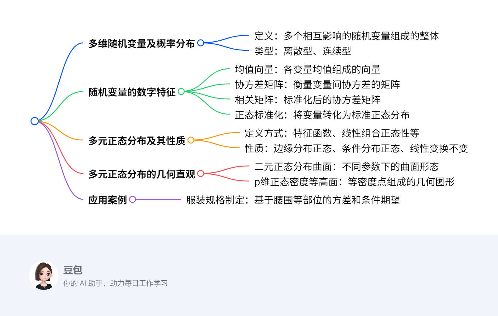

# 第三章：多元分布的基本概念及数字特征
## 概览
### 一段话总结

本章聚焦多元分布的基本概念及数字特征，先介绍多维随机变量及其概率分布，包括离散型和连续型，接着阐述随机变量的数字特征，如均值向量、协方差矩阵、相关矩阵，以及正态标准化和协差阵与相关阵的关系；重点讲解多元正态分布，其定义可通过特征函数、线性组合正态性等多种方式，性质包括边缘分布与条件分布的正态性、线性变换不变性等，还从几何直观展示了二元正态分布曲面与等高面，最后以服装规格制定为例说明其应用。

---

### 思维导图

---
### 详细总结
### 一、多维随机变量及概率分布
1. **多维随机变量定义**：如气象分析中的雨量、湿度、温度等多个相互影响的随机变量，构成多维随机变量，用向量X=(X₁,X₂,…,Xₚ)表示，“维”指分量个数。
2. **概率分布类型**
    - **离散型**：通过联合概率质量函数描述。
    - **连续型**：由联合概率密度函数刻画，如二元连续型随机变量的密度函数f(x,y)。

### 二、随机变量的数字特征
1. **均值向量**：设p维随机向量X=(X₁,X₂,…,Xₚ)，其均值向量为μ=(E(X₁),E(X₂),…,E(Xₚ))ᵀ。
2. **协方差矩阵**：协方差阵Σ=(cov(Xᵢ,Xⱼ))ₚ×ₚ，其中cov(Xᵢ,Xⱼ)=E[(Xᵢ-μᵢ)(Xⱼ-μⱼ)]，如某年龄段女子腰围方差为39.86（协方差阵对角元素）。
3. **相关矩阵**：相关阵R=(ρᵢⱼ)ₚ×ₚ，ρᵢⱼ=cov(Xᵢ,Xⱼ)/(√var(Xᵢ)√var(Xⱼ))，协差阵与相关阵关系为R=D⁻¹ΣD⁻¹，D为对角阵，对角元素为各变量标准差。
4. **正态标准化**：对X标准化得Z=D⁻¹(X-μ)，使Z均值为0，协差阵为单位阵。

### 三、多元正态分布及其性质
1. **定义方式**
    - 密度函数定义：p维正态分布密度函数f(x)=(2π)⁻ᵖ/²|Σ|⁻¹/²exp{-½(x-μ)ᵀΣ⁻¹(x-μ)}。
    - 特征函数定义：通过特征函数φ(t)=exp(itᵀμ-½tᵀΣt)定义。
    - 线性组合定义：任意线性组合aᵀX服从一维正态分布（a不全为0）。
2. **主要性质**
    - 边缘分布：若X~Nₚ(μ,Σ)，则任意k维子向量服从k维正态分布。
    - 条件分布：给定部分变量下，其余变量的条件分布仍为正态分布。
    - 线性变换：若X~Nₚ(μ,Σ)，则Y=AX+b~N_q(Aμ+b,AΣAᵀ)（A为q×p矩阵）。

### 四、多元正态分布的几何直观
1. **二元正态分布曲面**
    - 当σ₁₁=1,σ₂₂=1,ρ₁₂=0时，曲面关于均值对称，呈钟形。
    - 当σ₁₁=2,σ₂₂=4,ρ₁₂=0.75时，曲面在相关方向上拉伸。
2. **p维正态密度等高面**：等高面方程为(x-μ)ᵀΣ⁻¹(x-μ)=c²，为超椭球面，体现数据分布的几何形态。

### 五、应用案例：服装规格制定
1. **找重要指标**：通过计算各部位方差，如腰围方差39.86最大，选为首要部位。
2. **制定规格**：基于首要部位，计算第二部位的条件方差，选相对最大的；给定两部位，计算其余部位的条件期望，实现细致分类，制定规格型号。

---
### 关键问题
1. **多元正态分布有哪几种定义方式？**
    - **答案**：多元正态分布有多种定义方式，包括通过密度函数定义、利用特征函数定义，以及以任意线性组合服从一维正态分布作为充要条件来定义，还可借助标准正态分布性质定义。
2. **随机变量数字特征中的协方差矩阵与相关矩阵有何关系？**
    - **答案**：协方差矩阵Σ描述变量间协方差，相关矩阵R是标准化后的协方差矩阵，关系为R=D⁻¹ΣD⁻¹，其中D为对角阵，对角元素是各变量标准差，标准化使变量无量纲，便于比较变量间相关性。
3. **多元正态分布在服装规格制定中如何应用？**
    - **答案**：在服装规格制定中，先计算各部位方差，如某年龄段女子腰围方差39.86最大，确定为首要部位；再选条件方差相对最大的作为第二部位；然后根据这两个部位计算其余部位的条件期望，实现细致分类，从而制定服装规格型号。
## 多维随机变量及概率分布
### 多维随机变量
- **概念**：设 \(X_1, X_2, \cdots, X_p\) 是来自同一概率空间的随机变量，它们组成的整体就是 \(p\) 维（\(p\) 元）随机向量，记为 \(\boldsymbol{X}=(X_1, X_2, \cdots, X_p)'\) ，“维”（“元” ）体现分量个数 。比如研究气象时，雨量、湿度、温度等多个相互影响的随机变量构成多维随机变量，需整体研究 。

### 多维随机向量的概率分布
#### 一元随机变量分布回顾
- **分布函数**：设 \(X\) 是随机变量，\(F(x)=P(X\leq x)\) 为 \(X\) 的概率分布函数（简称分布函数），记 \(X\sim F(x)\) ，描述随机变量取值小于等于 \(x\) 的概率 。
- **离散型**：随机变量 \(X\) 所有可能取值为 \(x_k(k = 1,2,\cdots)\) ，且 \(P\{X = x_k\}=p_k\)（\(k = 1,2,\cdots\) ），\(\{p_k\}\) 是离散型随机变量 \(X\) 的分布律（概率分布），满足 \(p_1 + p_2+\cdots = 1\) 。
- **连续型**：若分布函数 \(F(x)\) 存在非负函数 \(f(x)\) ，使 \(F(x)=\int_{-\infty}^x f(t)dt\) 对任意实数 \(x\) 成立，则 \(X\) 是连续型随机变量，\(f(x)\) 是概率密度函数（概率密度） 。

#### 多维（\(p\) 维）随机向量分布
- **多元分布函数**：设 \(\boldsymbol{X}=(X_1, X_2, \cdots, X_p)'\) 是 \(p\) 维随机向量，多元分布函数 \(F(\boldsymbol{x}) = F(x_1, x_2, \cdots, x_p)=P(X_1\leq x_1, X_2\leq x_2, \cdots, X_p\leq x_p)\) ，记 \(\boldsymbol{X}\sim F(\boldsymbol{x})\) ，其中 \(\boldsymbol{x}=(x_1, x_2, \cdots, x_p)'\in R^p\)（\(R^p\) 是 \(p\) 维欧氏空间 ）。 
- **离散型随机向量**：若 \(p\) 维随机向量 \(\boldsymbol{X}=(X_1, X_2, \cdots, X_p)'\) ，存在有限或可列个 \(p\) 维数向量 \(\boldsymbol{x}_1, \boldsymbol{x}_2, \cdots\) ，使 \(P(\boldsymbol{X}=\boldsymbol{x}_k)=p_k\)（\(k = 1,2,\cdots\) ）且 \(p_1 + p_2+\cdots = 1\) ，则 \(\boldsymbol{X}\) 是离散型随机向量，\(\{P(\boldsymbol{X}=\boldsymbol{x}_k)\}\) 是概率分布 。 
- **连续型随机向量**：若 \(\boldsymbol{X}\sim F(\boldsymbol{x})\triangleq F(x_1, x_2, \cdots, x_p)\) ，存在非负函数 \(f(x_1, x_2, \cdots, x_p)\) ，对一切 \(\boldsymbol{x}=(x_1, x_2, \cdots, x_p)'\in R^p\) 有 \(F(\boldsymbol{x})\triangleq F(x_1, x_2, \cdots, x_p)=\int_{-\infty}^{x_1}\cdots\int_{-\infty}^{x_p}f(t_1, t_2, \cdots, t_p)dt_1\cdots dt_p\) ，则 \(\boldsymbol{X}\) 是连续型随机向量，\(f(x_1, x_2, \cdots, x_p)\) 是分布密度函数（密度函数、分布密度） 。 
- **密度函数条件**：\(p\) 元函数 \(f(x_1, x_2, \cdots, x_p)\) 作为 \(R^p\) 中随机向量密度函数，需满足：① \(f(x_1, x_2, \cdots, x_p)\geq0\)，对任意 \((x_1, x_2, \cdots, x_p)'\in R^p\) ；② \(\int_{-\infty}^{+\infty}\cdots\int_{-\infty}^{+\infty}f(x_1, x_2, \cdots, x_p)dx_1\cdots dx_p = 1\) 。 
  - **例子（例1）**：验证 \(f(x_1, x_2)=\begin{cases}e^{-(x_1 + x_2)},&x_1\geq0, x_2\geq0\\0,&\text{其它}\end{cases}\) 是随机向量 \(\boldsymbol{X}=(X_1, X_2)'\) 密度函数。 
    - **步骤1：验证非负性**：当 \(x_1\geq0, x_2\geq0\) 时，\(e^{-(x_1 + x_2)}>0\)；其它情况 \(f(x_1, x_2)=0\) ，满足 \(f(x_1, x_2)\geq0\) 。 
    - **步骤2：验证积分和为1**：\(\int_{-\infty}^{+\infty}\int_{-\infty}^{+\infty}f(x_1, x_2)dx_1dx_2=\int_{0}^{+\infty}\int_{0}^{+\infty}e^{-(x_1 + x_2)}dx_1dx_2\) ，先对 \(x_1\) 积分 \(\int_{0}^{+\infty}e^{-(x_1 + x_2)}dx_1 = e^{-x_2}\int_{0}^{+\infty}e^{-x_1}dx_1 = e^{-x_2}\) ，再对 \(x_2\) 积分 \(\int_{0}^{+\infty}e^{-x_2}dx_2=-e^{-x_2}\big|_0^{+\infty}=1\) ，满足积分条件，故是密度函数 。 

#### 边缘分布
- **概念**：设 \(\boldsymbol{X}=(X_1, X_2, \cdots, X_p)'\) 是 \(p\) 维随机向量，由 \(q(<p)\) 个分量组成的子向量 \(\boldsymbol{X}^{(i)}=(X_{i_1}, X_{i_2}, \cdots, X_{i_q})'\) 的分布是 \(\boldsymbol{X}\) 的边缘（边际）分布，\(\boldsymbol{X}\) 自身分布是联合分布 。可调整分量次序，设 \(\boldsymbol{X}^{(1)}\) 是前 \(q\) 个分量，剩余 \(p - q\) 个分量为 \(\boldsymbol{X}^{(2)}\) ，即 \(\boldsymbol{X}=\begin{bmatrix}\boldsymbol{X}^{(1)}\\\boldsymbol{X}^{(2)}\end{bmatrix}_{p - q}^q\) ，取值 \(\boldsymbol{x}=\begin{bmatrix}\boldsymbol{x}^{(1)}\\\boldsymbol{x}^{(2)}\end{bmatrix}\) 。 
- **边缘分布函数**：若 \(\boldsymbol{X}\) 分布函数是 \(F(x_1, x_2, \cdots, x_p)\) ，则 \(\boldsymbol{X}^{(1)}\) 的边缘分布函数 \(F(x_1, x_2, \cdots, x_q)=P(X_1\leq x_1, \cdots, X_q\leq x_q)=P(X_1\leq x_1, \cdots, X_q\leq x_q, X_{q + 1}\leq\infty, \cdots, X_p\leq\infty)=F(x_1, x_2, \cdots, x_q, \infty, \cdots, \infty)\) 。 
- **边缘密度函数**：若 \(\boldsymbol{X}\) 有分布密度 \(f(x_1, x_2, \cdots, x_p)\) ，则 \(\boldsymbol{X}^{(1)}\) 的边缘密度函数 \(f_1(x_1, x_2, \cdots, x_q)=\int_{-\infty}^{+\infty}\cdots\int_{-\infty}^{+\infty}f(x_1, \cdots, x_p)dx_{q + 1},\cdots, dx_p\) 。 
  - **例子（例2）**：求例1中 \(\boldsymbol{X}=(X_1, X_2)'\) 的边缘密度函数。 
    - **求 \(f(x_1)\) 步骤**：\(f(x_1)=\int_{-\infty}^{+\infty}f(x_1, x_2)dx_2\) ，当 \(x_1\geq0\) 时，\(f(x_1)=\int_{0}^{+\infty}e^{-(x_1 + x_2)}dx_2 = e^{-x_1}\int_{0}^{+\infty}e^{-x_2}dx_2 = e^{-x_1}\) ；当 \(x_1<0\) 时，\(f(x_1, x_2)=0\) ，积分结果为 \(0\) ，即 \(f(x_1)=\begin{cases}e^{-x_1},&x_1\geq0\\0,&\text{其它}\end{cases}\) 。 
    - **求 \(f(x_2)\) 步骤**：同理，\(f(x_2)=\int_{-\infty}^{+\infty}f(x_1, x_2)dx_1\) ，当 \(x_2\geq0\) 时，\(f(x_2)=\int_{0}^{+\infty}e^{-(x_1 + x_2)}dx_1 = e^{-x_2}\) ；当 \(x_2<0\) 时，结果为 \(0\) ，即 \(f(x_2)=\begin{cases}e^{-x_2},&x_2\geq0\\0,&\text{其它}\end{cases}\) 。 
  - **例子（例3）**：判断例2中 \(X_1\) 与 \(X_2\) 是否相互独立。
    - **判断步骤**：
        - 先明确联合密度函数 \(f(x_1, x_2)=\begin{cases}e^{-(x_1 + x_2)},&x_1\geq0, x_2\geq0\\0,&\text{其它}\end{cases}\) ，以及由例2求得的边缘密度函数 \(f_{X_1}(x_1)=\begin{cases}e^{-x_1},&x_1\geq0\\0,&\text{其它}\end{cases}\) ，\(f_{X_2}(x_2)=\begin{cases}e^{-x_2},&x_2\geq0\\0,&\text{其它}\end{cases}\) 。
        - 验证联合密度函数与边缘密度函数乘积是否相等：当 \(x_1\geq0, x_2\geq0\) 时，\(f_{X_1}(x_1)\cdot f_{X_2}(x_2)=e^{-x_1}\cdot e^{-x_2}=e^{-(x_1 + x_2)} = f(x_1, x_2)\) ；当 \(x_1<0\) 或 \(x_2<0\) 时，\(f_{X_1}(x_1)\cdot f_{X_2}(x_2)=0 = f(x_1, x_2)\) ，即 \(f(x_1, x_2)=f_{X_1}(x_1)\cdot f_{X_2}(x_2)\) 。 
    - **结论**：故 \(X_1\) 与 \(X_2\) 相互独立。

#### 随机变量独立性
- **定义**：若 \(p\) 个随机变量 \(X_1, X_2, \cdots, X_p\) 的联合分布等于各自边缘分布的乘积，则称它们相互独立 。 

### 求解方法总结
- **判断密度函数**：验证非负性（函数值是否非负）和积分规范性（全空间积分是否为1 ）。 
- **求边缘分布（以二维为例）**：对于联合密度函数 \(f(x_1, x_2)\) ，求 \(X_1\) 边缘密度，对 \(f(x_1, x_2)\) 关于 \(x_2\) 在 \((-\infty, +\infty)\) 积分；求 \(X_2\) 边缘密度，对 \(f(x_1, x_2)\) 关于 \(x_1\) 在 \((-\infty, +\infty)\) 积分 。 
## 随机变量的数字特征
### 均值（向量）/数学期望
- **定义**：设 \( \boldsymbol{X} = (X_1, X_2, \dots, X_p)' \)，若各分量期望 \( E(X_i) \)（\( i = 1, \dots, p \)）存在且有限，则 \( \boldsymbol{X} \) 的均值（向量）为 \( E(\boldsymbol{X}) = (E(X_1), E(X_2), \dots, E(X_p))' \) ，也记 \( \boldsymbol{\mu} = (\mu_1, \mu_2, \dots, \mu_p)' \)（\( \mu_i = E(X_i) \)  ）。  
- **性质**（\(\boldsymbol{X}、\boldsymbol{Y}\) 为随机向量，\(\boldsymbol{A}、\boldsymbol{B}\) 为适配常数矩阵 ）：  
  - \( E(\boldsymbol{A}\boldsymbol{X}) = \boldsymbol{A}E(\boldsymbol{X}) \)  
  - \( E(\boldsymbol{A}\boldsymbol{X}\boldsymbol{B}) = \boldsymbol{A}E(\boldsymbol{X})\boldsymbol{B} \)  
  - \( E(\boldsymbol{A}\boldsymbol{X} + \boldsymbol{B}\boldsymbol{Y}) = \boldsymbol{A}E(\boldsymbol{X}) + \boldsymbol{B}E(\boldsymbol{Y}) \)  

### 方差/协差阵
- **定义**：设 \( \boldsymbol{X} = (X_1, X_2, \dots, X_p)' \)，其方差（协差阵）定义为：  
  \[
  D(\boldsymbol{X}) \triangleq E\left[ (\boldsymbol{X} - E(\boldsymbol{X}))(\boldsymbol{X} - E(\boldsymbol{X}))' \right]
  \]  
  展开为 \( p \times p \) 矩阵，元素为 \( \text{Cov}(X_i, X_j) \)（\( i,j = 1, \dots, p \) ），即：  
  \[
  D(\boldsymbol{X}) = \begin{bmatrix} 
  \text{Cov}(X_1,X_1) & \text{Cov}(X_1,X_2) & \dots & \text{Cov}(X_1,X_p) \\
  \text{Cov}(X_2,X_1) & \text{Cov}(X_2,X_2) & \dots & \text{Cov}(X_2,X_p) \\
  \vdots & \vdots & \ddots & \vdots \\
  \text{Cov}(X_p,X_1) & \text{Cov}(X_p,X_2) & \dots & \text{Cov}(X_p,X_p) 
  \end{bmatrix}
  \]  
  简记 \( D(\boldsymbol{X}) = \boldsymbol{\Sigma} \) 或 \( \text{Var}(\boldsymbol{X}) \) ，其中 \( \text{Cov}(X_i, X_j) \) 也记 \( \sigma_{ij} \) ，即 \( \boldsymbol{\Sigma} = (\sigma_{ij})_{p \times p} \) 。  

- **推广（两随机向量协差阵）**：设 \( \boldsymbol{Y} = (Y_1, Y_2, \dots, Y_p)' \)，\(\boldsymbol{X}\) 与 \(\boldsymbol{Y}\) 的协差阵：  
  \[
  \text{Cov}(\boldsymbol{X}, \boldsymbol{Y}) \triangleq E\left[ (\boldsymbol{X} - E(\boldsymbol{X}))(\boldsymbol{Y} - E(\boldsymbol{Y}))' \right]
  \]  
  当 \( \boldsymbol{X} = \boldsymbol{Y} \) 时，退化为 \( D(\boldsymbol{X}) \) 。  

- **不相关与独立关系**：若 \( \text{Cov}(\boldsymbol{X}, \boldsymbol{Y}) = \boldsymbol{0} \)，称 \( \boldsymbol{X} \) 与 \( \boldsymbol{Y} \) 不相关；**独立可推出不相关，但不相关一般推不出独立** 。  

- **协差阵性质**（\(\boldsymbol{A}、\boldsymbol{B}\) 为适配常数矩阵，\(\boldsymbol{a}\) 为常数向量 ）：  
  - \( D(\boldsymbol{X} + \boldsymbol{a}) = D(\boldsymbol{X}) \)（加常数向量不改变方差 ）  
  - \( D(\boldsymbol{A}\boldsymbol{X}) = \boldsymbol{A}D(\boldsymbol{X})\boldsymbol{A}' = \boldsymbol{A}\boldsymbol{\Sigma}\boldsymbol{A}' \)  
  - \( \text{Cov}(\boldsymbol{A}\boldsymbol{X}, \boldsymbol{B}\boldsymbol{Y}) = \boldsymbol{A}\text{Cov}(\boldsymbol{X}, \boldsymbol{Y})\boldsymbol{B}' \)  
  - 对 \( n \) 维随机向量 \( \boldsymbol{X} \)（\( \boldsymbol{\mu} = E(\boldsymbol{X}) \)，\( \boldsymbol{\Sigma} = D(\boldsymbol{X}) \) ），若 \( \boldsymbol{A} \) 为 \( n \times n \) 常数阵，则 \( E(\boldsymbol{X}'\boldsymbol{A}\boldsymbol{X}) = \text{tr}(\boldsymbol{A}\boldsymbol{\Sigma}) + \boldsymbol{\mu}'\boldsymbol{A}\boldsymbol{\mu} \)（\(\text{tr}(\cdot)\) 为矩阵迹 ）。  

- **协差阵特性**：对任意随机向量 \( \boldsymbol{X} \)，其协差阵 \( \boldsymbol{\Sigma} \) 是**对称非负定阵**（通常正定 ）。  

### 相关阵
- **定义**：若 \( \boldsymbol{X} = (X_1, X_2, \dots, X_p)' \) 的协差阵存在，且各分量方差 \( D(X_i) > 0 \)，则相关阵 \( \boldsymbol{R} = \text{Corr}(\boldsymbol{X}) = (\rho_{ij})_{p \times p} \) ，其中：  
  \[
  \rho_{ij} = \frac{\text{Cov}(X_i, X_j)}{\sqrt{D(X_i)}\sqrt{D(X_j)}} = \frac{\sigma_{ij}}{\sqrt{\sigma_{ii}}\sqrt{\sigma_{jj}}} \quad (i,j = 1, \dots, p)
  \]  
  \( \rho_{ij} \) 是 \( X_i \) 与 \( X_j \) 的**相关系数** 。  

- **标准化变换**：对 \( X_j \) 做标准化 \( X_j^* = \frac{X_j - E(X_j)}{\sqrt{D(X_j)}} \)（\( j = 1, \dots, p \) ），构成新随机向量 \( \boldsymbol{X}^* = (X_1^*, X_2^*, \dots, X_p^*)' \) 。  

- **协差阵与相关阵关系**：令 \( \boldsymbol{C} = \text{diag}(\sqrt{\sigma_{11}}, \sqrt{\sigma_{22}}, \dots, \sqrt{\sigma_{pp}}) \)，则 \( \boldsymbol{X}^* = \boldsymbol{C}^{-1}(\boldsymbol{X} - E(\boldsymbol{X})) \) 。此时：  
  - 均值 \( E(\boldsymbol{X}^*) = \boldsymbol{0} \)（标准化后均值为0 ）  
  - 协差阵 \( D(\boldsymbol{X}^*) = \boldsymbol{C}^{-1}D(\boldsymbol{X})\boldsymbol{C}^{-1} = \boldsymbol{C}^{-1}\boldsymbol{\Sigma}\boldsymbol{C}^{-1} = \boldsymbol{R} \)（即标准化数据的协差阵等价于原数据的相关阵 ）  

### 核心逻辑与方法
1. **均值计算**：对随机向量 \( \boldsymbol{X} \)，逐分量求期望 \( E(X_i) \)，再按定义组合成均值向量 \( E(\boldsymbol{X}) \) 。  
2. **协差阵计算**：先求分量间协方差 \( \text{Cov}(X_i, X_j) = E\left[ (X_i - \mu_i)(X_j - \mu_j) \right] \)，再按矩阵形式排列得到 \( D(\boldsymbol{X}) \) 。  
3. **相关阵计算**：基于协差阵与分量方差，通过 \( \rho_{ij} = \frac{\sigma_{ij}}{\sqrt{\sigma_{ii}}\sqrt{\sigma_{jj}}} \) 计算相关系数，再组合成相关阵 \( \boldsymbol{R} \) 。  
4. **性质应用**：利用均值、协差阵的线性性质（如 \( E(\boldsymbol{A}\boldsymbol{X}) = \boldsymbol{A}E(\boldsymbol{X}) \) ）简化运算；利用“独立 ⇒ 不相关”判断随机向量关系，但需注意反向不成立 。  

### 示例（假设简单二维随机向量，演示核心计算）
#### 题目
设二维随机向量 \( \boldsymbol{X} = (X_1, X_2)' \)，已知 \( E(X_1) = 1 \)，\( E(X_2) = 2 \)；方差 \( D(X_1) = 1 \)，\( D(X_2) = 4 \)；协方差 \( \text{Cov}(X_1, X_2) = 1 \) 。  
- 求 \( \boldsymbol{X} \) 的均值 \( E(\boldsymbol{X}) \)、协差阵 \( D(\boldsymbol{X}) \)、相关阵 \( \boldsymbol{R} \) 。  

#### 求解步骤
1. **计算均值 \( E(\boldsymbol{X}) \)**：  
   按定义，\( E(\boldsymbol{X}) = (E(X_1), E(X_2))' = (1, 2)' \) 。  

2. **计算协差阵 \( D(\boldsymbol{X}) \)**：  
   协差阵元素为 \( \sigma_{ij} = \text{Cov}(X_i, X_j) \)，其中：  
   - \( \sigma_{11} = \text{Cov}(X_1, X_1) = D(X_1) = 1 \)  
   - \( \sigma_{12} = \text{Cov}(X_1, X_2) = 1 \)  
   - \( \sigma_{21} = \text{Cov}(X_2, X_1) = 1 \)（协方差对称，\( \sigma_{ij} = \sigma_{ji} \) ）  
   - \( \sigma_{22} = \text{Cov}(X_2, X_2) = D(X_2) = 4 \)  

   因此，协差阵：  
   \[
   D(\boldsymbol{X}) = \begin{bmatrix} 1 & 1 \\ 1 & 4 \end{bmatrix}
   \]  

3. **计算相关阵 \( \boldsymbol{R} \)**：  
   先求相关系数 \( \rho_{ij} \)：  
   - \( \rho_{11} = \frac{\sigma_{11}}{\sqrt{\sigma_{11}}\sqrt{\sigma_{11}}} = 1 \)（自身相关系数为1 ）  
   - \( \rho_{12} = \frac{\sigma_{12}}{\sqrt{\sigma_{11}}\sqrt{\sigma_{22}}} = \frac{1}{\sqrt{1} \times \sqrt{4}} = \frac{1}{2} \)  
   - \( \rho_{21} = \rho_{12} = \frac{1}{2} \)（相关系数对称 ）  
   - \( \rho_{22} = 1 \)  

   因此，相关阵：  
   \[
   \boldsymbol{R} = \begin{bmatrix} 1 & \frac{1}{2} \\ \frac{1}{2} & 1 \end{bmatrix}
   \]  

#### 验证“标准化协差阵 = 相关阵”
构造标准化向量 \( \boldsymbol{X}^* = (X_1^*, X_2^*)' \)，其中：  
\( X_1^* = \frac{X_1 - E(X_1)}{\sqrt{D(X_1)}} = X_1 - 1 \)，\( X_2^* = \frac{X_2 - E(X_2)}{\sqrt{D(X_2)}} = \frac{X_2 - 2}{2} \)  

计算 \( D(\boldsymbol{X}^*) \)：  
- \( D(X_1^*) = D(X_1 - 1) = D(X_1) = 1 \)（方差性质：常数不影响方差 ）  
- \( D(X_2^*) = D\left( \frac{X_2 - 2}{2} \right) = \frac{1}{4}D(X_2) = 1 \)  
- \( \text{Cov}(X_1^*, X_2^*) = \text{Cov}\left( X_1 - 1, \frac{X_2 - 2}{2} \right) = \frac{1}{2}\text{Cov}(X_1, X_2) = \frac{1}{2} \times 1 = \frac{1}{2} \)  

因此，\( D(\boldsymbol{X}^*) = \begin{bmatrix} 1 & \frac{1}{2} \\ \frac{1}{2} & 1 \end{bmatrix} = \boldsymbol{R} \)，验证了“标准化协差阵等价于原相关阵”的结论 。  

**总结**：通过定义与性质，可系统计算随机向量的均值、协差阵、相关阵，且标准化变换能建立协差阵与相关阵的联系，是分析随机向量数字特征的核心工具 。
## 3.3 多元正态分布及其性质
### 3.3.1 多元正态分布的定义
#### 定义方式
- **密度函数定义**：若 \( p \) 维随机向量 \( \boldsymbol{X}=(X_1,X_2,\cdots,X_p)' \) 的密度函数为  
  - \[
  f(\boldsymbol{x};\boldsymbol{\mu},\boldsymbol{\Sigma}) = \frac{1}{(2\pi)^{p/2}|\boldsymbol{\Sigma}|^{1/2}} \exp\left\{-\frac{1}{2}(\boldsymbol{x}-\boldsymbol{\mu})'\boldsymbol{\Sigma}^{-1}(\boldsymbol{x}-\boldsymbol{\mu})\right\}
  \]  
  - 其中 \( \boldsymbol{\mu}=(\mu_1,\mu_2,\cdots,\mu_p)' \) 为均值向量，\( \boldsymbol{\Sigma}=(\sigma_{ij})_{p\times p} \) 为正定协方差阵，则称 \( \boldsymbol{X} \) 服从 \( p \) 维正态分布，记为 \( \boldsymbol{X} \sim N_p(\boldsymbol{\mu},\boldsymbol{\Sigma}) \) 。  
  
- **标准正态线性组合定义**：设 \( \boldsymbol{U}=(U_1,U_2,\cdots,U_q)' \) 是独立同分布于 \( N(0,1) \) 的随机向量，\( \boldsymbol{\mu} \) 为 \( p \) 维常数向量，\( \boldsymbol{A} \) 为 \( p \times q \) 常数矩阵，则 \( \boldsymbol{X}=\boldsymbol{A}\boldsymbol{U}+\boldsymbol{\mu} \) 服从 \( p \) 维正态分布，记为 \( \boldsymbol{X} \sim N_p(\boldsymbol{\mu},\boldsymbol{A}\boldsymbol{A}') \) 。  
- **充要条件定义**：\( p \) 维随机向量 \( \boldsymbol{X} \) 服从多元正态分布的充要条件是其任意线性组合 \( a_1X_1+a_2X_2+\cdots+a_pX_p \)（\( a_1,a_2,\cdots,a_p \) 为不全为零的常数）服从一维正态分布 。

### 3.3.2 多元正态分布的性质
#### 核心性质
- **边缘分布正态性**：若 \( \boldsymbol{X} \sim N_p(\boldsymbol{\mu},\boldsymbol{\Sigma}) \)，则其任意 \( q \) 维子向量 \( \boldsymbol{X}^{(1)}=(X_1,X_2,\cdots,X_q)' \) 也服从正态分布，即 \( \boldsymbol{X}^{(1)} \sim N_q(\boldsymbol{\mu}^{(1)},\boldsymbol{\Sigma}_{11}) \)，其中 \( \boldsymbol{\mu}^{(1)} \) 为 \( \boldsymbol{\mu} \) 的前 \( q \) 个分量，\( \boldsymbol{\Sigma}_{11} \) 为 \( \boldsymbol{\Sigma} \) 的前 \( q \) 行前 \( q \) 列子矩阵 。  
- **线性变换不变性**：若 \( \boldsymbol{X} \sim N_p(\boldsymbol{\mu},\boldsymbol{\Sigma}) \)，\( \boldsymbol{A} \) 为 \( s \times p \) 常数矩阵，\( \boldsymbol{d} \) 为 \( s \) 维常数向量，则 \( \boldsymbol{A}\boldsymbol{X}+\boldsymbol{d} \sim N_s(\boldsymbol{A}\boldsymbol{\mu}+\boldsymbol{d},\boldsymbol{A}\boldsymbol{\Sigma}\boldsymbol{A}') \) 。  
- **独立性与协方差阵**：若 \( \boldsymbol{X} \sim N_p(\boldsymbol{\mu},\boldsymbol{\Sigma}) \)，则 \( X_1,X_2,\cdots,X_p \) 相互独立的充要条件是 \( \boldsymbol{\Sigma} \) 为对角阵 。  
- **条件分布正态性**：若 \( \boldsymbol{X} \sim N_p(\boldsymbol{\mu},\boldsymbol{\Sigma}) \)，将 \( \boldsymbol{X},\boldsymbol{\mu},\boldsymbol{\Sigma} \) 剖分为  
  \[
  \boldsymbol{X}=\begin{bmatrix}\boldsymbol{X}^{(1)}\\\boldsymbol{X}^{(2)}\end{bmatrix}, \boldsymbol{\mu}=\begin{bmatrix}\boldsymbol{\mu}^{(1)}\\\boldsymbol{\mu}^{(2)}\end{bmatrix}, \boldsymbol{\Sigma}=\begin{bmatrix}\boldsymbol{\Sigma}_{11}&\boldsymbol{\Sigma}_{12}\\\boldsymbol{\Sigma}_{21}&\boldsymbol{\Sigma}_{22}\end{bmatrix}
  \]  
  则在 \( \boldsymbol{X}^{(2)}=\boldsymbol{x}^{(2)} \) 条件下，\( \boldsymbol{X}^{(1)} \) 的条件分布为 \( N_q(\boldsymbol{\mu}^{(1)}+\boldsymbol{\Sigma}_{12}\boldsymbol{\Sigma}_{22}^{-1}(\boldsymbol{x}^{(2)}-\boldsymbol{\mu}^{(2)}),\boldsymbol{\Sigma}_{11}-\boldsymbol{\Sigma}_{12}\boldsymbol{\Sigma}_{22}^{-1}\boldsymbol{\Sigma}_{21}) \) 。

#### 求解方法
1. **线性组合分布求解**：  
   已知 \( \boldsymbol{X} \sim N_p(\boldsymbol{\mu},\boldsymbol{\Sigma}) \)，求线性组合 \( \boldsymbol{A}\boldsymbol{X}+\boldsymbol{d} \) 的分布时，直接利用性质2，计算均值 \( \boldsymbol{A}\boldsymbol{\mu}+\boldsymbol{d} \) 和协方差阵 \( \boldsymbol{A}\boldsymbol{\Sigma}\boldsymbol{A}' \) 。  
2. **条件分布求解**：  
   先对 \( \boldsymbol{\Sigma} \) 进行分块，再利用条件分布公式计算条件均值和条件协方差阵 。  

### 3.3.3 多元正态分布的几何直观
#### 二元正态分布等高线
- **等高线方程**：二元正态密度函数 \( f(x_1,x_2)=C \)（\( C>0 \)）的等高线满足  
  \[
  \left(\frac{x_1-\mu_1}{\sigma_1}\right)^2 - 2\rho\left(\frac{x_1-\mu_1}{\sigma_1}\right)\left(\frac{x_2-\mu_2}{\sigma_2}\right) + \left(\frac{x_2-\mu_2}{\sigma_2}\right)^2 = a^2
  \]  
  其中 \( \rho \) 为相关系数，该方程表示中心在 \( (\mu_1,\mu_2)' \) 的椭圆 。  
- **参数影响**：  
  - \( \sigma_1,\sigma_2 \) 决定椭圆的长短轴长度，\( \rho \) 决定椭圆的倾斜方向和扁平程度：\( |\rho| \) 越接近1，椭圆越扁平；\( \rho=0 \) 时，椭圆轴与坐标轴平行 。  

#### p维正态分布等高面
- **等高面方程**：\( p \) 维正态密度函数 \( f(\boldsymbol{x})=C \) 的等高面为  
  \[
  (\boldsymbol{x}-\boldsymbol{\mu})'\boldsymbol{\Sigma}^{-1}(\boldsymbol{x}-\boldsymbol{\mu})=a^2 \quad (a \geq 0)
  \]  
  表示中心在 \( \boldsymbol{\mu} \) 的椭球面，其形状由 \( \boldsymbol{\Sigma}^{-1} \) 的特征值和特征向量决定 。  

### 示例解析
#### 例4：三维正态向量的线性变换
- **题目**：若 \( \boldsymbol{X}=(X_1,X_2,X_3)' \sim N_3(\boldsymbol{\mu},\boldsymbol{\Sigma}) \)，其中  
  \[
  \boldsymbol{\mu}=\begin{bmatrix}\mu_1\\\mu_2\\\mu_3\end{bmatrix}, \boldsymbol{\Sigma}=\begin{bmatrix}\sigma_{11}&\sigma_{12}&\sigma_{13}\\\sigma_{21}&\sigma_{22}&\sigma_{23}\\\sigma_{31}&\sigma_{32}&\sigma_{33}\end{bmatrix}
  \]  
  求 \( X_2 \) 和 \( (X_1,-X_3)' \) 的分布 。  
- **步骤**：  
  1. **求 \( X_2 \) 的分布**：  
     取线性组合系数向量 \( \boldsymbol{a}'=(0,1,0) \)，则 \( \boldsymbol{a}'\boldsymbol{X}=X_2 \)，其均值为 \( \boldsymbol{a}'\boldsymbol{\mu}=\mu_2 \)，协方差为 \( \boldsymbol{a}'\boldsymbol{\Sigma}\boldsymbol{a}=\sigma_{22} \)，故 \( X_2 \sim N(\mu_2,\sigma_{22}) \) 。  
  2. **求 \( (X_1,-X_3)' \) 的分布**：  
     取矩阵 \( \boldsymbol{A}=\begin{bmatrix}1&0&0\\0&0&-1\end{bmatrix} \)，则 \( \boldsymbol{A}\boldsymbol{X}=(X_1,-X_3)' \)，均值为  
     \[
     \boldsymbol{A}\boldsymbol{\mu}=\begin{bmatrix}1&0&0\\0&0&-1\end{bmatrix}\begin{bmatrix}\mu_1\\\mu_2\\\mu_3\end{bmatrix}=\begin{bmatrix}\mu_1\\-\mu_3\end{bmatrix}
     \]  
     协方差阵为  
     \[
     \boldsymbol{A}\boldsymbol{\Sigma}\boldsymbol{A}'=\begin{bmatrix}1&0&0\\0&0&-1\end{bmatrix}\begin{bmatrix}\sigma_{11}&\sigma_{12}&\sigma_{13}\\\sigma_{21}&\sigma_{22}&\sigma_{23}\\\sigma_{31}&\sigma_{32}&\sigma_{33}\end{bmatrix}\begin{bmatrix}1&0\\0&0\\0&-1\end{bmatrix}=\begin{bmatrix}\sigma_{11}&-\sigma_{13}\\-\sigma_{31}&\sigma_{33}\end{bmatrix}
     \]  
     故 \( (X_1,-X_3)' \sim N_2\left(\begin{bmatrix}\mu_1\\-\mu_3\end{bmatrix},\begin{bmatrix}\sigma_{11}&-\sigma_{13}\\-\sigma_{31}&\sigma_{33}\end{bmatrix}\right) \) 。  

#### 例5：服装标准制定中的条件分布应用
- **题目**：对某年龄段女子身体测量5个指标 \( \boldsymbol{X}=(X_1,X_2,X_3,X_4,X_5)' \)（身高、胸围、腰围、上体长、臀围），假设 \( \boldsymbol{X} \sim N_5(\boldsymbol{\mu},\boldsymbol{\Sigma}) \)，已知  
  \[
  \boldsymbol{\mu}=\begin{bmatrix}154.98\\83.39\\70.26\\61.32\\91.52\end{bmatrix}, \boldsymbol{\Sigma}=\begin{bmatrix}29.66&6.51&1.85&9.36&10.34\\6.51&30.53&25.54&3.54&19.53\\1.85&25.54&39.86&2.23&20.70\\9.36&3.54&2.23&7.03&5.21\\10.34&19.53&20.70&5.21&27.36\end{bmatrix}
  \]  
  求以腰围 \( X_3 \) 和胸围 \( X_2 \) 为条件时，其他指标的条件期望 。  
- **步骤**：  
  1. **确定分块**：将 \( \boldsymbol{X} \) 分为 \( \boldsymbol{X}^{(1)}=(X_1,X_4,X_5)' \) 和 \( \boldsymbol{X}^{(2)}=(X_2,X_3)' \)，对应  
     \[
     \boldsymbol{\mu}^{(1)}=\begin{bmatrix}154.98\\61.32\\91.52\end{bmatrix}, \boldsymbol{\mu}^{(2)}=\begin{bmatrix}83.39\\70.26\end{bmatrix}, \boldsymbol{\Sigma}_{12}=\begin{bmatrix}6.51&1.85\\3.54&2.23\\19.53&20.70\end{bmatrix}, \boldsymbol{\Sigma}_{22}=\begin{bmatrix}30.53&25.54\\25.54&39.86\end{bmatrix}
     \]  
  2. **计算条件均值**：条件均值为  
     \[
     \boldsymbol{\mu}^{(1)}+\boldsymbol{\Sigma}_{12}\boldsymbol{\Sigma}_{22}^{-1}(\boldsymbol{x}^{(2)}-\boldsymbol{\mu}^{(2)})
     \]  
     先求 \( \boldsymbol{\Sigma}_{22}^{-1} \)，再计算 \( \boldsymbol{\Sigma}_{12}\boldsymbol{\Sigma}_{22}^{-1} \)，最终得到在 \( X_2=x_2,X_3=x_3 \) 时，\( X_1,X_4,X_5 \) 的条件期望表达式 🔶6-95。  
  3. **应用意义**：通过条件期望可根据胸围和腰围尺寸预测身高、上体长和臀围的平均水平，用于制定服装规格型号 。  

### 核心结论
多元正态分布的定义、性质及几何直观构成了多元统计分析的理论基础，其线性变换不变性和条件分布正态性在实际问题（如生物统计、工程测量、经济建模）中具有广泛应用。通过分块协方差阵和线性代数运算，可高效求解各类多元正态分布相关问题，尤其是在降维、预测和规格制定中发挥关键作用 🔶6-61🔶6-72。