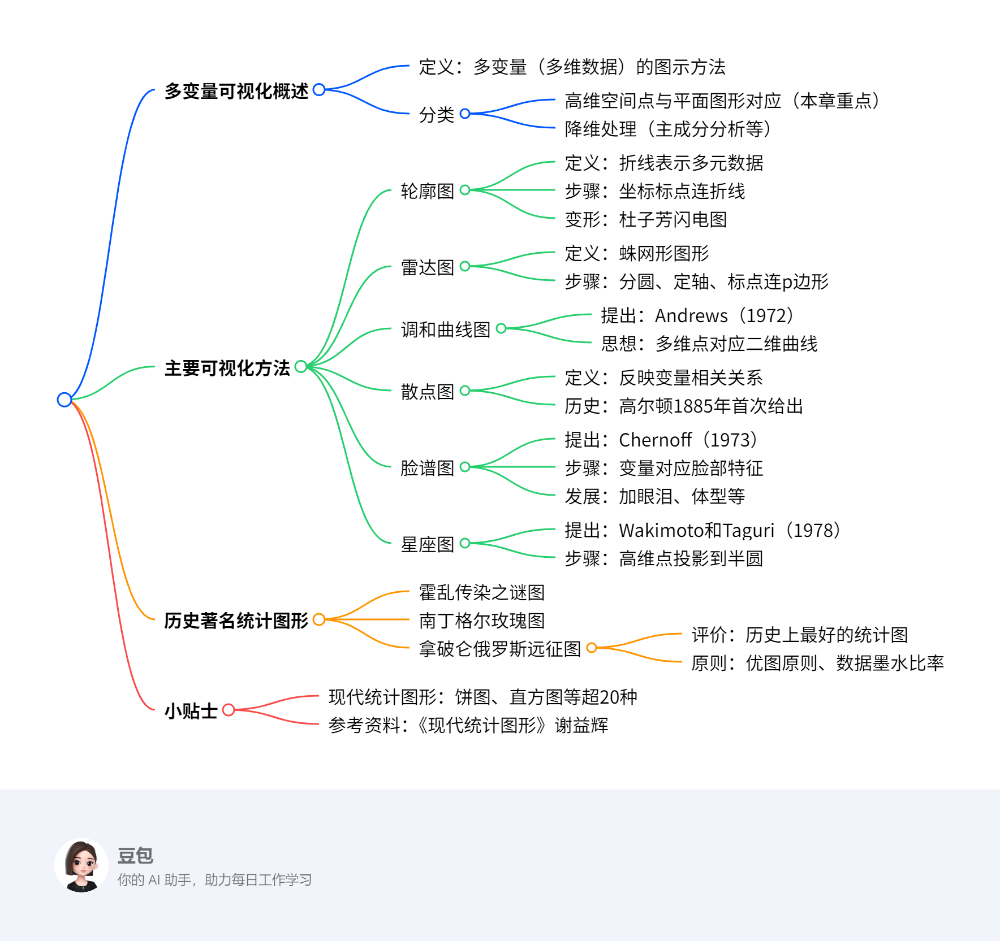

---
### 一段话总结
多变量的可视化是将高维数据通过图形直观呈现的方法，**主要分为高维空间点与平面图形对应（如轮廓图、雷达图、调和曲线图、散点图、脸谱图、星座图）和降维后展示（如主成分分析）两类**。其中，轮廓图以折线展示多元数据，雷达图呈蛛网形，散点图由高尔顿首次提出用于反映变量关系，脸谱图由Chernoff于1973年提出用脸部特征表示变量，星座图将高维点投影到半圆内；此外，历史上著名统计图形包括霍乱传染图、南丁格尔玫瑰图和拿破仑远征图，优秀统计图遵循“最短时间、最少墨水传达最大信息”原则。

---
### 思维导图

---
### 详细总结
### 一、多变量可视化的定义与分类
1. **定义**：多变量（多维数据）的图示方法，旨在直观呈现高维数据特征。
2. **分类**
    - **高维空间点与平面图形对应**：本章介绍的轮廓图、雷达图等。
    - **降维处理**：如主成分分析、因子分析，降为2维或1维后展示。

### 二、主要可视化方法
#### 1. 轮廓图
- **定义**：将多元数据以折线方式表示在平面中。
- **作图步骤**
    1. 建立坐标系，横坐标为变量，纵坐标为变量取值。
    2. 标点并连接成折线，n次观测得n条折线。
- **变形**：杜子芳将折线图旋转90度得到闪电图，纵向展开可容纳更多指标（如地铁公交服务比较）。

#### 2. 雷达图（蛛网图、蜘蛛图）
- **作图步骤**
    1. 作圆，按变量数p等分圆周。
    2. 连接圆心与分点作为坐标轴并标刻度。
    3. 标点并连接成p边形，n次观测得n个p边形。
- **应用案例**：比较国内五大钢铁公司（宝钢、鞍钢、武钢、首钢）与韩国浦项钢铁的10个经营指标。

#### 3. 调和曲线图
- **提出**：Andrews（1972）提出的三角多项式作图法。
- **思想**：将多维空间的点对应于二维平面的一条曲线，通过函数表达式实现。

#### 4. 散点图
- **定义**：以点分布反映变量间相关关系。
- **历史**：1885年高尔顿研究父母与子女身高关系时首次给出，1884年他在实验室测量9337人“身高、体重等资料”。
- **作图步骤**：以两变量观测数据为横纵坐标描点。

#### 5. 脸谱图
- **提出**：美国统计学家H.Chernoff于1973年提出。
- **作图步骤**：变量对应脸的部位形状或大小，一个样品画一张脸谱。
- **发展**：可加眼泪表示坏情况，加体型变量，取消脸对称性引入更多特征。
- **应用案例**：某公司不同时期财务情况、中国各省区电子制造业创新指数。

#### 6. 星座图
- **提出**：Wakimoto和Taguri于1978年提出。
- **作图步骤**：将p维点投影到平面半圆内，用角度和半径确定位置，具体分四步设定参数与投影。

### 三、历史著名统计图形
1. **霍乱传染之谜图**：展示疾病传播与因素的关系。
2. **提灯女士（南丁格尔）的玫瑰图**：用扇形面积表示死亡原因分布。
3. **拿破仑俄罗斯远征图（1812，Minard）**
    - **评价**：被统计学家誉为“历史上最好的统计图”。
    - **信息包含**：行军路线、人数、气温、日期等。
    - **优图原则**：Edward R. Tufte提出，强调“最短时间、最少墨水、最小篇幅传达最大量信息”，度量指标为“数据墨水比率”。

### 四、小贴士
1. **现代统计图形种类**：饼图、直方图、茎叶图、箱线图、雷达图、脸谱图、热图等超20种。
2. **参考资料**：谢益辉《现代统计图形》，可查阅优秀统计图案例与原则。

### 五、钢铁公司指标对比表
|指标|宝钢|鞍钢|武钢|首钢|浦项|
|----|----|----|----|----|----|
|负债保障率|2.89|2.95|2.34|1.85|3.12|
|长期负债倍数|5.16|9.15|6.07|2.63|6.96|
|流动比率|1.31|1.83|1.16|2.22|2.1|
|资产利润率|21.71|17.34|24.77|11.89|25.34|

---
### 关键问题
1. **多变量可视化主要分为哪两类？各自包含哪些主要方法？**
    - **答案**：分为两类，一类是**高维空间的点与平面上的某种图形对应**，包括轮廓图、雷达图、调和曲线图、散点图、脸谱图、星座图；另一类是**对多变量数据进行降维处理**，如主成分分析、因子分析等。
2. **脸谱图是谁在何时提出的？其基本作图思路是什么？**
    - **答案**：脸谱图由美国统计学家H.Chernoff于1973年提出，基本思路是将观测的多个变量（指标）分别用脸的某一部位的形状或大小来表示，一个样品（观测）对应一张脸谱。
3. **历史上被称为“最好的统计图”是哪幅？它包含了哪些关键信息？**
    - **答案**：是1812年Minard绘制的《拿破仑俄罗斯远征图》，包含行军路线和部队调遣、军队人数、气温、日期等关键信息，通过简单图示全面展现战争主要过程，符合“优图原则”。