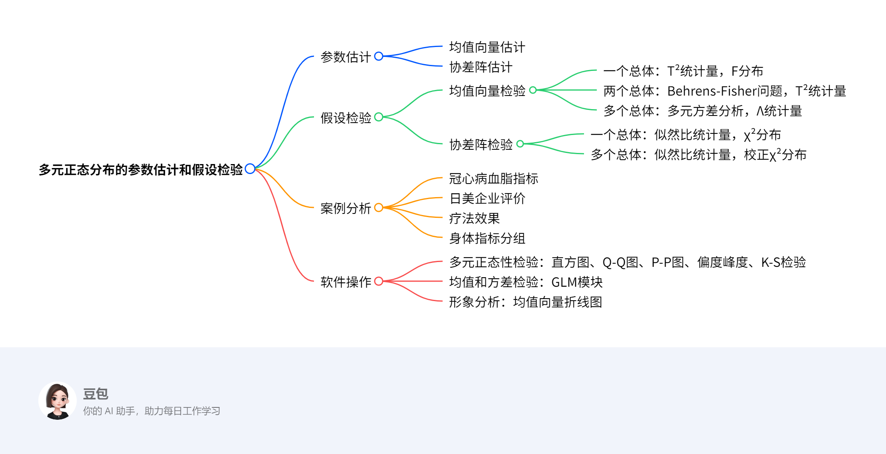

# 第五章：多元正态分布的参数估计和假设检验
## 概览
---
### 一段话总结
文档聚焦多元正态分布的参数估计与假设检验，参数估计涵盖均值向量和协差阵的极大似然估计等内容；假设检验包括均值向量（一个、两个及多个总体，如借助T²统计量、多元方差分析等）和协差阵（一个及多个总体，基于似然比统计量）的检验，还通过冠心病血脂指标、日美在华投资企业评价等案例分析，并介绍了SPSS中多元正态性检验（如直方图、Q-Q图等）、均值和方差检验及形象分析的软件操作步骤，关键信息如检验统计量、分布及案例结论等已加粗突出。

---
### 思维导图

### 详细总结
### 5.1 多元正态分布的参数估计
- **均值向量的估计**：通过样本均值向量进行估计，样本均值向量是总体均值向量的极大似然估计和无偏估计。
- **协差阵的估计**：样本协差阵是总体协差阵的极大似然估计，但需注意其无偏性调整。

### 5.2 多元正态分布的假设检验
#### 5.2.1 均值向量的检验
| 检验类型 | 原假设 | 统计量 | 分布 | 案例应用 |
|---------|---------|---------|---------|---------|
| 一个总体 | $H_0:μ=μ_0$ | $T^2=n( \bar{X}-μ_0 )^T S^{-1}( \bar{X}-μ_0 )$ | $\frac{(n-1)-p+1}{(n-1)p}T^2 \sim F(p,n-p)$ | 例5.1：冠心病血脂指标与正常均值比较 |
| 两个总体 | $H_0:μ_1=μ_2$ | $T^2=\frac{nm}{n+m}( \bar{X}-\bar{Y} )^T S_p^{-1}( \bar{X}-\bar{Y} )$ | $\frac{(n+m-2)-p+1}{(n+m-2)p}T^2 \sim F(p,n+m-p-1)$ | 例5.2：日美企业对中国经营环境评价差异 |
| 多个总体 | $H_0:μ_1=μ_2=…=μ_k$ | 威尔克斯Λ统计量 | 转化为F分布或卡方分布 | 例5.4：三组人身体指标差异 |

#### 5.2.2 协差阵的检验
| 检验类型 | 原假设 | 统计量 | 分布 | 案例应用 |
|---------|---------|---------|---------|---------|
| 一个总体 | $H_0:Σ=Σ_0$ | 似然比统计量$λ$ | $-2\lnλ \sim χ^2(\frac{p(p+1)}{2})$ | - |
| 多个总体 | $H_0:Σ_1=Σ_2=…=Σ_k$ | 似然比统计量$λ_4$ | 校正后的$(1-d)M \sim χ^2(f)$，$f=\frac{p(p+1)(k-1)}{2}$ | 例5.5：三组身体指标协方差阵相等性 |

### 5.3 案例分析及软件操作
- **多元正态性检验方法**
    - **图形法**：直方图（需勾选正态曲线）、Q-Q图和P-P图（样本点应围绕对角线）。
    - **数值法**：偏度（标准正态为0）和峰度（标准正态为3，软件常用excess_K=K-3）、K-S检验（原假设为总体服从正态分布）。
- **SPSS操作关键步骤**
    - **均值向量检验**：Analyze→General Linear Model→Multivariate，选入指标和分组变量。
    - **协差阵检验**：同上，在Options中勾选Homogeneity tests。
    - **形象分析**：基于同类可比指标的均值向量绘制折线图，需协方差阵相同。

---
### 关键问题
#### 问题1：多元正态分布中一个总体均值向量检验的核心步骤是什么？
**答案**：核心步骤为提出原假设$H_0:μ=μ_0$，计算样本均值向量$\bar{X}$和样本协差阵$S$，构造$T^2$统计量$T^2=n( \bar{X}-μ_0 )^T S^{-1}( \bar{X}-μ_0 )$，将$T^2$转化为$F$统计量$\frac{(n-1)-p+1}{(n-1)p}T^2$，其服从$F(p,n-p)$分布，通过比较$F$值与临界值判断是否拒绝原假设，如例5.1中利用该方法检验单位成年男性血脂与正常均值的差异。

#### 问题2：多个总体协差阵检验的统计量如何构造及应用？
**答案**：构造似然比统计量$λ_4$，基于各组样本协差阵计算，通过$M=-2\lnλ_4$及校正因子$d$得到$(1-d)M$，其近似服从自由度$f=\frac{p(p+1)(k-1)}{2}$的卡方分布。如例5.5中对三组身体指标数据，计算得$M=22.6054$，$d=0.1006$，$(1-d)M=20.3316$，与卡方分布临界值比较，因$p=0.4373646>0.10$，不拒绝协差阵相等的原假设。

#### 问题3：SPSS中如何进行多元正态性的图形检验？
**答案**：在SPSS中，可通过两种方式进行图形检验。一是生成直方图：Analyze→Descriptive Statistics→Frequencies，选择变量后点击Charts，选中Histograms及with normal curve；二是绘制Q-Q图和P-P图：Graphs→Histogram下直接生成，或通过Analyze→Descriptive Statistics→Descriptives，在Options中选择相关统计量，若资料服从正态分布，Q-Q图中样本点应围绕第一象限对角线，P-P图同理。
## 5.1 多元正态分布的参数估计

### 5.1.1 均值向量的估计
#### 求解方法
- **极大似然估计**：设多元正态总体 \(X \sim N_p(\mu, \Sigma)\)，样本 \(X_1, X_2, \dots, X_n\) 独立同分布，似然函数为 \(L(\mu, \Sigma) = (2\pi)^{-np/2}|\Sigma|^{-n/2}\exp\left\{-\frac{1}{2}\sum_{i=1}^n (X_i - \mu)^T\Sigma^{-1}(X_i - \mu)\right\}\)。对 \(\mu\) 求导并令导数为0，可得均值向量 \(\mu\) 的极大似然估计为 \(\hat{\mu} = \frac{1}{n}\sum_{i=1}^n X_i = \bar{X}\)。
- **无偏性**：\(E(\bar{X}) = \mu\)，即样本均值向量是总体均值向量的无偏估计。

#### 例子
**问题**：已知3个样本向量 \(X_1 = (1.2, 2.5)^T\)，\(X_2 = (0.8, 1.9)^T\)，\(X_3 = (1.5, 2.1)^T\)，求总体均值向量 \(\mu\) 的估计值。

**解题步骤**：
1. 计算样本均值向量 \(\bar{X}\)：
    - 第一个分量均值：\(\bar{x}_1 = \frac{1.2 + 0.8 + 1.5}{3} = 1.1667\)
    - 第二个分量均值：\(\bar{x}_2 = \frac{2.5 + 1.9 + 2.1}{3} = 2.1667\)
2. 故均值向量的估计值为 \(\hat{\mu} = \bar{X} = (1.1667, 2.1667)^T\)。

### 5.1.2 协差阵的估计
#### 求解方法
- **极大似然估计**：对似然函数关于 \(\Sigma\) 求导，可得协差阵 \(\Sigma\) 的极大似然估计为 \(\hat{\Sigma} = \frac{1}{n}\sum_{i=1}^n (X_i - \bar{X})(X_i - \bar{X})^T\)。
- **无偏估计**：极大似然估计 \(\hat{\Sigma}\) 是有偏的，无偏估计为 \(S = \frac{1}{n-1}\sum_{i=1}^n (X_i - \bar{X})(X_i - \bar{X})^T\)，其中 \(S\) 称为样本协差阵，满足 \(E(S) = \Sigma\)。

#### 例子
**问题**：使用例5.1中的5名成年男性血脂指标数据（甘油三酯、总胆固醇、高密度脂蛋白胆固醇含量），样本数据如下：
- \(X_1 = (1.78, 0.83, -1.01)^T\)
- \(X_2 = (0.67, 0.96, -0.84)^T\)
- \(X_3 = (0.56, 0.83, -0.39)^T\)
- \(X_4 = (0.66, 1.12, -1.03)^T\)
- \(X_5 = (0.21, 0.16, -0.40)^T\)

求协差阵 \(\Sigma\) 的极大似然估计 \(\hat{\Sigma}\) 和无偏估计 \(S\)。

**解题步骤**：
1. 计算样本均值向量 \(\bar{X}\)：
    - 甘油三酯均值：\(\bar{x}_1 = \frac{1.78 + 0.67 + 0.56 + 0.66 + 0.21}{5} = 0.776\)
    - 总胆固醇均值：\(\bar{x}_2 = \frac{0.83 + 0.96 + 0.83 + 1.12 + 0.16}{5} = 0.780\)
    - 高密度脂蛋白均值：\(\bar{x}_3 = \frac{-1.01 - 0.84 - 0.39 - 1.03 - 0.40}{5} = -0.574\)
    - 即 \(\bar{X} = (0.776, 0.780, -0.574)^T\)。
2. 计算各样本与均值的偏差向量：
    - \(X_1 - \bar{X} = (1.78 - 0.776, 0.83 - 0.780, -1.01 + 0.574)^T = (1.004, 0.05, -0.436)^T\)
    - \(X_2 - \bar{X} = (0.67 - 0.776, 0.96 - 0.780, -0.84 + 0.574)^T = (-0.106, 0.18, -0.266)^T\)
    - \(X_3 - \bar{X} = (0.56 - 0.776, 0.83 - 0.780, -0.39 + 0.574)^T = (-0.216, 0.05, 0.184)^T\)
    - \(X_4 - \bar{X} = (0.66 - 0.776, 1.12 - 0.780, -1.03 + 0.574)^T = (-0.116, 0.34, -0.456)^T\)
    - \(X_5 - \bar{X} = (0.21 - 0.776, 0.16 - 0.780, -0.40 + 0.574)^T = (-0.566, -0.62, 0.174)^T\)
3. 计算偏差向量的外积并求和：
    - 以第一个样本为例，外积为：
    \[
    \begin{pmatrix}
    1.004 \\
    0.05 \\
    -0.436
    \end{pmatrix}
    \begin{pmatrix}
    1.004 & 0.05 & -0.436
    \end{pmatrix}
    = \begin{pmatrix}
    1.008 & 0.050 & -0.438 \\
    0.050 & 0.003 & -0.022 \\
    -0.438 & -0.022 & 0.190
    \end{pmatrix}
    \]
    - 同理计算其他样本外积并求和，得到：
    \[
    \sum_{i=1}^5 (X_i - \bar{X})(X_i - \bar{X})^T = \begin{pmatrix}
    1.751 & 0.080 & -0.240 \\
    0.080 & 0.476 & -0.200 \\
    -0.240 & -0.200 & 0.360
    \end{pmatrix}
    \]
4. 计算极大似然估计 \(\hat{\Sigma}\)：
    - \(\hat{\Sigma} = \frac{1}{5} \times \begin{pmatrix}
    1.751 & 0.080 & -0.240 \\
    0.080 & 0.476 & -0.200 \\
    -0.240 & -0.200 & 0.360
    \end{pmatrix} = \begin{pmatrix}
    0.350 & 0.016 & -0.048 \\
    0.016 & 0.095 & -0.040 \\
    -0.048 & -0.040 & 0.072
    \end{pmatrix}\)
5. 计算无偏估计 \(S\)：
    - \(S = \frac{1}{5-1} \times \begin{pmatrix}
    1.751 & 0.080 & -0.240 \\
    0.080 & 0.476 & -0.200 \\
    -0.240 & -0.200 & 0.360
    \end{pmatrix} = \begin{pmatrix}
    0.438 & 0.020 & -0.060 \\
    0.020 & 0.119 & -0.050 \\
    -0.060 & -0.050 & 0.090
    \end{pmatrix}\)
## 5.2 多元正态分布的假设检验

### 5.2.1 均值向量的检验

#### 1. 一个多元正态总体均值向量的检验
##### 求解方法
- **前提条件**：总体 \(X \sim N_p(\mu, \Sigma)\)，协差阵 \(\Sigma\) 未知，样本 \(X_1, \dots, X_n\) 独立同分布。
- **原假设与备择假设**：\(H_0: \mu = \mu_0\)，\(H_1: \mu \neq \mu_0\)。
- **检验统计量**：\(T^2 = n(\bar{X} - \mu_0)^T S^{-1}(\bar{X} - \mu_0)\)，其中 \(\bar{X}\) 为样本均值，\(S\) 为样本协差阵。
- **统计量分布**：当 \(H_0\) 成立时，\(\frac{(n-1)-p+1}{(n-1)p}T^2 \sim F(p, n-p)\)。
- **决策规则**：若 \(F > F_{\alpha}(p, n-p)\)，则拒绝 \(H_0\)。

##### 例子（例5.1）
**问题**：研究某单位5名成年男性的血脂指标（甘油三酯、总胆固醇、高密度脂蛋白胆固醇）与正常均值 \(\mu_0 = (1.02, 2.73, 2.04)^T\) 的差异，数据如下：
| 序号 | 甘油三酯 | 总胆固醇 | 高密度脂蛋白 |
|------|----------|----------|--------------|
| 1    | 1.78     | 0.83     | -1.01        |
| 2    | 0.67     | 0.96     | -0.84        |
| 3    | 0.56     | 0.83     | -0.39        |
| 4    | 0.66     | 1.12     | -1.03        |
| 5    | 0.21     | 0.16     | -0.40        |

**解题步骤**：
1. 计算样本均值 \(\bar{X} = (0.776, 0.780, -0.574)^T\)。
2. 计算样本协差阵 \(S\)（过程见5.1节例子），得：
   \[
   S = \begin{pmatrix}
   0.438 & 0.020 & -0.060 \\
   0.020 & 0.119 & -0.050 \\
   -0.060 & -0.050 & 0.090
   \end{pmatrix}
   \]
3. 计算 \(T^2\)：
   \[
   T^2 = 5 \times (0.776-1.02, 0.780-2.73, -0.574-2.04) \times S^{-1} \times (0.776-1.02, 0.780-2.73, -0.574-2.04)^T
   \]
   经计算 \(T^2 = 295.743\)。
4. 转化为 \(F\) 统计量：
   \[
   F = \frac{(5-1)-3+1}{(5-1) \times 3} \times 295.743 = \frac{3}{12} \times 295.743 = 73.936
   \]
5. 查 \(F\) 分布表，\(F_{0.05}(3, 2) = 19.16\)，由于 \(73.936 > 19.16\)，拒绝 \(H_0\)，即该单位男性血脂与正常均值有显著差异。

#### 2. 两个多元正态总体均值向量的检验
##### 求解方法
- **前提条件**：两总体 \(X \sim N_p(\mu_1, \Sigma)\)，\(Y \sim N_p(\mu_2, \Sigma)\)，协差阵相等且未知，样本量分别为 \(n, m\)。
- **原假设与备择假设**：\(H_0: \mu_1 = \mu_2\)，\(H_1: \mu_1 \neq \mu_2\)。
- **检验统计量**：\(T^2 = \frac{nm}{n+m}(\bar{X} - \bar{Y})^T S_p^{-1}(\bar{X} - \bar{Y})\)，其中 \(S_p = \frac{(n-1)S_1 + (m-1)S_2}{n+m-2}\) 为合并协差阵。
- **统计量分布**：当 \(H_0\) 成立时，\(\frac{(n+m-2)-p+1}{(n+m-2)p}T^2 \sim F(p, n+m-p-1)\)。

##### 例子（例5.2）
**问题**：比较日、美在华投资企业对中国经营环境的评价差异，各10家企业对政治、经济、法律、文化环境打分（1~10号为美国企业，11~20号为日本企业），部分数据如下：
| 组别 | 政治 | 经济 | 法律 | 文化 |
|------|------|------|------|------|
| 美国 | 65   | 35   | 25   | 60   |
| 美国 | 75   | 50   | 30   | 55   |
| 日本 | 55   | 55   | 40   | 65   |
| 日本 | 50   | 60   | 45   | 70   |

**解题步骤**：
1. 计算样本均值：
   - 美国企业：\(\bar{X} = (64, 43, 30.5, 63)^T\)
   - 日本企业：\(\bar{Y} = (50.5, 51, 40, 40.5)^T\)
2. 计算样本协差阵 \(S_1, S_2\) 并合并：
   \[
   S_p = \frac{9S_1 + 9S_2}{18}
   \]
   其中 \(S_1, S_2\) 由样本偏差计算得（具体过程略），合并后：
   \[
   S_p = \begin{pmatrix}
   410 & -170 & -80 & 84 \\
   -170 & 422 & 8 & 422 \\
   -80 & 8 & 512.5 & 60 \\
   84 & 422 & 60 & 510
   \end{pmatrix}
   \]
3. 计算 \(T^2\)：
   \[
   T^2 = \frac{10 \times 10}{20} \times (64-50.5, 43-51, 30.5-40, 63-40.5) \times S_p^{-1} \times (13.5, -8, -9.5, 22.5)^T
   \]
   经计算 \(T^2 = 146.13\)。
4. 转化为 \(F\) 统计量：
   \[
   F = \frac{(20-2)-4+1}{(20-2) \times 4} \times 146.13 = \frac{15}{72} \times 146.13 = 30.44
   \]
5. 查 \(F\) 分布表，\(F_{0.01}(4, 15) = 4.89\)，由于 \(30.44 > 4.89\)，拒绝 \(H_0\)，即两国企业评价有显著差异。

#### 3. 多个多元正态总体均值向量的检验（多元方差分析）
##### 求解方法
- **前提条件**：\(k\) 个总体 \(X_i \sim N_p(\mu_i, \Sigma)\)，协差阵相等且未知，样本量分别为 \(n_1, \dots, n_k\)，总样本量 \(n = \sum n_i\)。
- **原假设与备择假设**：\(H_0: \mu_1 = \dots = \mu_k\)，\(H_1\)：至少存在 \(i \neq j\) 使 \(\mu_i \neq \mu_j\)。
- **检验统计量**：威尔克斯（Wilks）\(\Lambda\) 统计量，\(\Lambda = \frac{|A|}{|A+B|}\)，其中 \(A\) 为组内离差阵，\(B\) 为组间离差阵。
- **统计量分布**：\(\Lambda\) 分布可转化为 \(F\) 或 \(\chi^2\) 分布近似，具体转化公式根据 \(p, k, n\) 确定。

##### 例子（例5.4）
**问题**：研究三组人身体指标（4个变量）是否有差异，每组20人，部分数据如下：
| 组别 | 变量1 | 变量2 | 变量3 | 变量4 |
|------|-------|-------|-------|-------|
| 1组  | 260   | 75    | 40    | 18    |
| 1组  | 200   | 72    | 34    | 17    |
| 2组  | 310   | 122   | 30    | 21    |
| 2组  | 260   | 59    | 37    | 11    |

**解题步骤**：
1. 计算各组均值 \(\bar{X}_i\) 和总均值 \(\bar{X}\)：
   - 1组均值：\(\bar{X}_1 = (238, 84, 32, 17)^T\)
   - 2组均值：\(\bar{X}_2 = (275, 90, 31, 18)^T\)
   - 3组均值：\(\bar{X}_3 = (292.75, 90.2, 31.75, 18.4)^T\)
   - 总均值：\(\bar{X} = (268.58, 88.07, 31.58, 18.07)^T\)
2. 计算组内离差阵 \(A\) 和组间离差阵 \(B\)：
   \[
   A = \sum_{i=1}^3 \sum_{\alpha=1}^{n_i} (X_{i\alpha} - \bar{X}_i)(X_{i\alpha} - \bar{X}_i)^T
   \]
   \[
   B = \sum_{i=1}^3 n_i(\bar{X}_i - \bar{X})(\bar{X}_i - \bar{X})^T
   \]
   计算得 \(|A| = 0.621\)，\(|A+B| = 0.709\)。
3. 计算 \(\Lambda\) 统计量：
   \[
   \Lambda = \frac{0.621}{0.709} = 0.876
   \]
4. 转化为近似 \(F\) 统计量（过程略），得 \(F = 7.6913\)，查 \(F_{0.01}(4, 57) \approx 3.69\)，由于 \(7.6913 > 3.69\)，拒绝 \(H_0\)，即三组身体指标有显著差异。

### 5.2.2 协差阵的检验

#### 1. 一个p元正态总体协差阵的检验
##### 求解方法
- **原假设与备择假设**：
  - \(H_0: \Sigma = \Sigma_0\)（已知矩阵），\(H_1: \Sigma \neq \Sigma_0\)；
  - 特殊情况：\(H_0: \Sigma = \sigma^2 I_p\)，\(H_1: \Sigma \neq \sigma^2 I_p\)。
- **检验统计量**：
  - 一般情况：似然比统计量 \(\lambda_2 = \frac{|\Sigma_0|^{n/2}}{\exp\left\{\frac{n}{2}\text{tr}(\Sigma_0^{-1}S)\right\}}\)，近似有 \(-2\ln\lambda_2 \sim \chi^2\left(\frac{p(p+1)}{2}\right)\)；
  - 特殊情况：\(\lambda_3 = \frac{(nS^2)^{n/2}}{|\Sigma_0|^{n/2}} \cdot \frac{L(\hat{\sigma}^2, I_p)}{L(\hat{\mu}, \hat{\Sigma})}\)，其中 \(S^2 = \frac{1}{p}\text{tr}(S)\)。

#### 2. 多个p元正态总体协差阵的检验
##### 求解方法
- **前提条件**：\(k\) 个总体 \(X_i \sim N_p(\mu_i, \Sigma_i)\)，检验协差阵是否相等。
- **原假设与备择假设**：\(H_0: \Sigma_1 = \dots = \Sigma_k\)，\(H_1\)：至少存在 \(i \neq j\) 使 \(\Sigma_i \neq \Sigma_j\)。
- **检验统计量**：似然比统计量 \(\lambda_4 = \frac{\prod_{i=1}^k |S_i|^{n_i/2}}{|S_p|^{n/2}}\)，其中 \(S_i\) 为各组协差阵，\(S_p = \frac{1}{n-k}\sum_{i=1}^k (n_i-1)S_i\)，\(n = \sum n_i\)。
- **校正统计量**：\(M = -2\left[\sum_{i=1}^k (n_i-1)\ln|S_i| - (n-k)\ln|S_p|\right]\)，近似有 \((1-d)M \sim \chi^2(f)\)，其中 \(f = \frac{p(p+1)(k-1)}{2}\)，校正因子 \(d = \frac{2p^2+3p-1}{6(p+1)(k-1)}\sum_{i=1}^k \left(\frac{1}{n_i-1} - \frac{1}{n-k}\right)\)。

##### 例子（例5.5）
**问题**：检验例5.4中三组身体指标数据的协差阵是否相等（\(\alpha = 0.1\)），每组20人（\(n_1 = n_2 = n_3 = 20\)，\(n = 60\)）。

**解题步骤**：
1. 计算各组协差阵 \(S_1, S_2, S_3\)（部分元素如下）：
   - \(S_1\) 主对角线元素：51705.0, 7021.5, 12288.95, 321.10
   - \(S_2\) 主对角线元素：43173.75, 9959.00, 12441.2, 476.8
   - \(S_3\) 主对角线元素：30530, 162178, 955.8, 413.8
2. 计算合并协差阵 \(S_p\)：
   \[
   S_p = \frac{19S_1 + 19S_2 + 19S_3}{57}
   \]
3. 计算行列式对数和：
   \[
   \sum_{i=1}^3 (n_i-1)\ln|S_i| = 19(\ln|S_1| + \ln|S_2| + \ln|S_3|)
   \]
   \[
   (n-k)\ln|S_p| = 57\ln|S_p|
   \]
4. 计算 \(M\)：
   \[
   M = -2\left[19(\ln|S_1| + \ln|S_2| + \ln|S_3|) - 57\ln|S_p|\right] = 22.6054
   \]
5. 计算校正因子 \(d\)：
   \[
   d = \frac{2 \times 4^2 + 3 \times 4 - 1}{6(4+1)(3-1)} \times 3 \times \left(\frac{1}{19} - \frac{1}{57}\right) = 0.1006
   \]
6. 计算校正统计量：
   \[
   \xi = (1-d)M = (1-0.1006) \times 22.6054 = 20.3316
   \]
7. 查 \(\chi^2\) 分布表，自由度 \(f = \frac{4 \times 5 \times 2}{2} = 20\)，\(\chi_{0.10}^2(20) = 28.412\)，由于 \(20.3316 < 28.412\)，不拒绝 \(H_0\)，即认为三组协差阵相等。
## 5.3 案例分析及软件操作

### 5.3.1 多元正态性检验
#### 检验方法与原理
- **核心逻辑**：若总体为多元正态分布，则各分量需满足一元正态分布，故可通过检验单变量正态性推断多元正态性。
- **图形检验法**
    - **直方图**：通过频数分布图形与正态曲线的吻合度判断，横坐标为变量区间，纵坐标为频率/组距时面积和为1。
    - **Q-Q图和P-P图**：Q-Q图以样本分位数为横坐标、理论正态分位数为纵坐标；P-P图以样本累计频率为横坐标、理论累计概率为纵坐标，服从正态分布时样本点应近似分布在对角线上。
- **数值检验法**
    - **偏度与峰度系数**：标准正态分布偏度为0，峰度为3；软件中常用excess_K=峰度-3，绝对值越大偏离正态性越明显。
    - **K-S（Kolmogorov-Smirnov）检验**：比较样本经验分布与理论正态分布的最大差异，原假设为“总体服从正态分布”，统计量\(D = \max|F_n(x) - \Phi(x)|\)，\(\sqrt{n}D\)近似服从正态分布。

#### SPSS操作实例（以血糖浓度数据为例）
- **直方图绘制**
    1. 菜单路径：`Analyze`→`Descriptive Statistics`→`Frequencies`
    2. 选择待分析变量（如“血糖浓度”），点击`Charts`按钮
    3. 勾选`Histograms`和`with normal curve`，确认运行
- **Q-Q图与P-P图**
    1. 菜单路径：`Graphs`→`Legacy Dialogs`→`Q-Q Plots`（或`P-P Plots`）
    2. 将变量拖入`Variables`框，选择`Test Distribution`为`Normal`
- **偏度峰度检验**
    1. 菜单路径：`Analyze`→`Descriptive Statistics`→`Descriptives`
    2. 点击`Options`，勾选`Skewness`和`Kurtosis`，输出结果中查看系数值
- **K-S检验**
    1. 菜单路径：`Analyze`→`Nonparametric Tests`→`1-Sample K-S`
    2. 选择变量，在`Test Distribution`中选`Normal`，运行后查看Sig.值（若>0.05则接受正态假设）

#### 实例结果解读
- **直方图示例**：若血糖浓度直方图与叠加的正态曲线基本吻合（如图中Mean=79.74，Std.Dev=5.94），提示可能服从正态分布。
- **Q-Q图示例**：若样本点紧密围绕对角线（如血糖浓度图中观测值与理论值趋势一致），支持正态性假设。

### 5.3.2 多元正态分布均值和方差的检验
#### 均值向量检验（GLM模块多元方差分析）
- **SPSS操作步骤**
    1. 菜单路径：`Analyze`→`General Linear Model`→`Multivariate`
    2. 将分析指标（如例5.2中的“政治环境”“经济环境”等）选入`Dependent Variables`
    3. 将分组变量（如“国家类别”）选入`Fixed Factor(s)`
    4. 点击`OK`运行，结果中查看`Multivariate Tests`表的F值和Sig.值（Sig.<0.05表示均值向量存在显著差异）
- **协差阵齐性检验**
    1. 在上述操作中，点击`Options`按钮
    2. 勾选`Homogeneity tests`（协差阵齐性检验）
    3. 结果中查看`Levene's Test`或`Box's M`检验（Box's M检验原假设为“各总体协差阵相等”，Sig.<0.05时拒绝假设）

#### 实例应用（例5.2日美企业评价数据）
- **操作要点**：将4个环境评分变量作为因变量，“国家”（美/日）作为固定因子，运行Multivariate分析。
- **结果解读**：若`Pillai's Trace`或`Wilks' Lambda`对应的Sig.<0.05，说明两国企业在整体评价上存在差异；同时通过`Box's M`检验判断协差阵是否齐性（若Sig.>0.05则满足齐性假设）。

### 5.3.3 形象分析
#### 基本概念与前提
- **总体形象图**：将总体均值向量的各分量绘制为折线图，用于直观比较多组数据的轮廓差异。
- **前提条件**：
    - 各指标为同类可比变量（如均为评分指标或均为生理指标）
    - 多总体协方差阵相同（需先通过5.3.2节协差阵检验）
- **理论基础**：Srivastava（1981）提出的形象分析假设检验理论，通过比较折线图形状判断总体差异。

#### 绘制步骤与实例
- **手工绘制步骤**
    1. 计算各组均值向量（如例5.4中三组身体指标的均值）
    2. 将指标维度作为横轴（如变量1到变量4），均值作为纵轴
    3. 用不同颜色折线连接各组均值点，形成对比图形
- **SPSS实现思路**：
    1. 先计算各组均值（`Analyze`→`Compare Means`→`Means`）
    2. 将均值数据整理为SPSS数据格式，每个指标作为一列，组类别作为标识
    3. 使用`Graphs`→`Line`→`Multiple Lines`绘制分组折线图
- **实例解读**：若日美企业评价的4个指标均值折线图形状差异显著（如美国企业在“政治环境”评分较高，日本企业在“经济环境”评分较高），结合5.2.1节的均值向量检验结果，可直观支持“两国评价存在差异”的结论。

### 关键软件操作总结表
| 检验类型 | SPSS核心菜单路径 | 关键参数设置 | 结果判断依据 |
|---------|----------------|-------------|-------------|
| 正态性图形检验 | `Analyze`→`Frequencies`→`Charts` | 勾选`Histograms`+`normal curve` | 直方图与正态曲线吻合度 |
| 均值向量检验 | `Analyze`→`GLM`→`Multivariate` | 因变量选入`Dependent Variables` | `Multivariate Tests`的Sig.值 |
| 协差阵齐性检验 | `GLM`→`Multivariate`→`Options` | 勾选`Homogeneity tests` | `Box's M`的Sig.值（>0.05齐性） |
| 形象图绘制 | `Graphs`→`Line`→`Multiple Lines` | 以指标为横轴，组均值为纵轴 | 折线图形状差异与统计检验结合 |