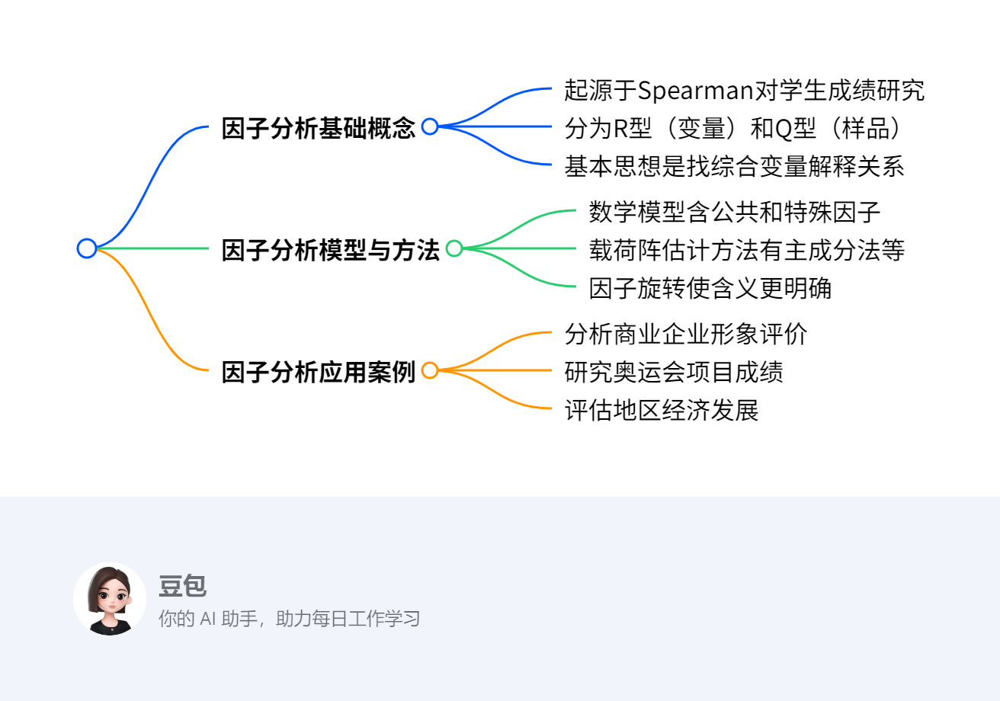
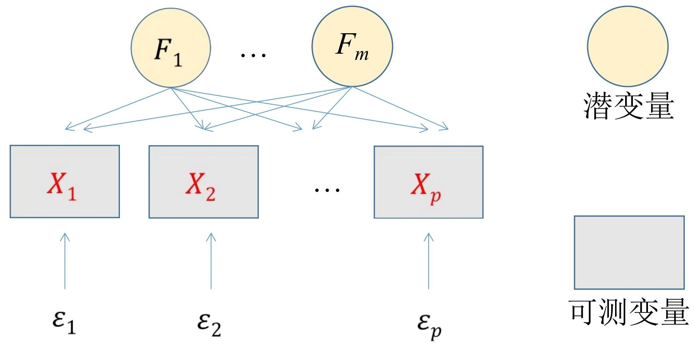

# 第八章：因子分析
## 总览
---
### 一段话总结
因子分析是通过对研究变量的信息矩阵分析，找出少数综合变量（因子）解释多个可观测变量间复杂关系的方法。它源于Spearman对学生考试成绩的研究，**主要有R型（对变量）和Q型（对样品）两种类型**。其数学模型包含公共因子和特殊因子，**因子载荷阵估计方法多样**，如主成分法等。**因子旋转可使因子含义更明确**，还可通过最小二乘法、回归法等计算因子得分，在商业、体育、经济等多领域广泛应用，如分析企业形象评价、奥运会项目成绩、地区经济发展、消费者偏好等。 

---

---
### 详细总结
1. **因子分析的起源与基本概念**
    - **起源**：1904年Charles Spearman发表论文《对智力测验得分进行统计分析》，研究学生考试成绩，成为因子分析的起点。他发现学生各科考试成绩间存在某种潜在联系，提出最初的因子分析模型 $X_{i}=a_{i}F+\varepsilon_{i}$。
    - **基本思想**：通过分析研究变量的信息矩阵（协方差阵、相关系数矩阵或样品相似系数矩阵），找出少数几个不可观测的综合变量（因子），描述原始变量间的相关或相似关系。
    - **类型**：常用的因子分析类型是R型因子分析（对变量作因子分析）和Q型因子分析（对样品作因子分析），本章侧重讨论R型因子分析。
2. **因子分析的数学模型**
    - **正交因子模型**：用矩阵表示因子分析模型，将原始变量分解为公共因子和特殊因子两部分。
    - **因子载荷的统计意义**：因子载荷反映了原始变量与公共因子之间的相关程度。
    - **变量共同度的统计意义**：变量方差等于公共因子方差与特殊因子方差之和，即变量方差 = 共同度 + 剩余方差。方差贡献率是衡量公共因子相对重要程度的指标，方差贡献率越大，该公共因子越重要。
3. **因子载荷阵的估计方法**：有主成分法、主因子法、最小二乘法、极大似然法等多种方法，这些方法出发点不同，所得结果也不完全相同。以主成分法为例，通过计算可得到因子载荷阵，进而确定公共因子及其对原始变量的贡献。
4. **因子旋转**：因子载荷不唯一，为使因子含义更明确，Thurstone提出“简单结构”，旋转后的载荷矩阵每列元素平方值向0和1两极分化。凯泽提出相关方法，当公共因子数m>2时，可逐次对每两个公共因子进行旋转，使两列元素平方的相对方差之和达到最大。通过因子旋转，可使因子有更明确的含义，如在奥运会十项全能运动项目得分数据的因子分析中，旋转后得到短跑速度因子、爆发性臂力因子、爆发腿力因子和长跑耐力因子。
5. **因子得分**：计算因子得分的方法有最小二乘法和回归法等。在实际应用中，如对全国30个省市自治区的经济发展八项指标作因子分析时，通过SPSS软件操作，可得到因子得分系数矩阵，进而得到因子得分函数，生成样本标准化因子得分变量，用于对样品或变量进行评价和分类。
6. **因子分析的应用案例**
    - **商业企业形象评价**：消费者通过一系列指标评价百货商场，真正关心的是商店环境、商店服务和商品价格，这些潜在因素通过具体指标间接反映。
    - **奥运会项目成绩分析**：对奥运会十项全能运动项目得分数据进行因子分析，可找出影响运动员成绩的主要因子，如短跑速度因子、爆发性臂力因子等。
    - **地区经济发展评估**：对全国30个省市自治区的经济发展八项指标作因子分析，可提取总量因子、消费因子和价格因子，对各地区经济发展进行评价和分类。
    - **消费者偏好研究**：研究消费者对购买牙膏偏好的调查数据，通过因子分析可提取护牙因子和美牙因子，为牙膏生产企业开发新产品提供参考。

|应用案例|分析内容|关键结果|
|---|---|---|
|商业企业形象评价|通过指标评价商场，找出潜在影响因素|潜在因素为商店环境、服务和价格|
|奥运会项目成绩分析|对十项全能项目得分进行因子分析|得到短跑速度、爆发性臂力等因子|
|地区经济发展评估|对30个省市自治区八项经济指标分析|提取总量、消费、价格因子|
|消费者偏好研究|分析消费者对牙膏偏好数据|提取护牙因子和美牙因子|
---
### 关键问题
1. **因子分析中如何确定因子的个数？**
    - 答案：通常根据特征根和累计方差贡献率来确定。一般选取特征根大于1的因子，或者使累计方差贡献率达到一定比例（如70% - 85%以上）的因子个数。例如在研究消费者对购买牙膏偏好的调查数据时，提取两个因子累计方差贡献率就达到82%，第三个特征根相比下降较快，因此选取两个公共因子。
2. **因子分析与主成分分析的主要区别是什么？**
    - 答案：因子分析旨在用少数几个潜在变量（公共因子）解释多个显在变量中的复杂关系，每个原始变量分解为公共因子和特殊因子两部分；主成分分析是将多个指标化为少数几个互不相关的综合指标（主成分），主要用于数据降维。因子分析的因子通常是不可观测的，而主成分是原始变量的线性组合，是可观测的。
3. **在实际应用中，R型因子分析和Q型因子分析分别适用于哪些场景？**
    - 答案：R型因子分析适用于研究多个变量之间的相关性，找出影响这些变量的公共因子，如分析学生多门课程成绩之间的关系，找出潜在的影响因素（如学习能力等）；分析消费者对多种产品属性的评价数据，提取关键因子。Q型因子分析适用于对样品进行分类和综合评价，如对不同企业的经营数据进行分析，对企业进行分类；对不同地区的环境监测数据进行分析，找出相似的地区类别 。 
## 8.1 什么是因子分析
该节主要介绍了因子分析的基本概念，具体内容如下：

1. **实际案例引入**：以学生课程成绩和商业企业形象评价为例，说明实际中存在多个可观测变量受潜在因素影响的情况。学生课程成绩受学习能力等潜在共同因素影响，同时也受课程特点因素影响，如英语受语言能力影响。在商业企业形象评价中，消费者通过一系列指标评价商场，但真正关心商店环境、商店服务和商品价格，其中商店环境和服务质量需通过其他具体指标间接反映。
2. **因子分析核心概念**
    - **定义**：因子分析是利用少数几个**潜在变量（公共因子）**去解释多个**显在变量（可观测变量）**中存在的复杂关系。
    - **变量分解**：每个原始可观测变量可分解为两部分，一部分是**公共因子**，它是影响多个变量的共同因素；另一部分是**特殊因子**，是每个原始变量独自具有的因素，特殊因子的存在使不同原始变量有所区别。 
### 8.1.1 Spearman的因子分析
#### 研究背景与发现
Spearman对“高级预备学校”33名学生的古典语（C）、法语（F）、英语（E）、数学（M）、判别（D）和音乐（Mu）六门考试成绩相关性进行研究。通过分析相关阵，他发现**不考虑对角元素时，任意两列元素大致成比例**。如C列和E列对应元素比值近似相等，约为1.2 。

#### 因子分析模型提出
基于上述发现，Spearman提出**因子分析模型**：$X_{i}=a_{i}F+\varepsilon_{i}$ 。其中，$X_{i}$为第$i$门科目标准化后的考试成绩（均值为0，方差为1 ）；$F$是**公共因子**，对各科考试成绩均有影响，假设其均值为0，方差为1 ；$\varepsilon_{i}$是**特殊因子**，仅对第$i$门成绩有影响，假设均值为0且与$F$不相关。

#### 相关推导与重要指标
 - **协方差推导**：通过计算$Cov(X_{i},X_{j}) = E(a_{i}F+\varepsilon_{i})(a_{j}F+\varepsilon_{j}) = a_{i}a_{j}Var(F)=a_{i}a_{j}$ ，得出$\frac{Cov(X_{i},X_{j})}{Cov(X_{i},X_{k})}=\frac{a_{j}}{a_{k}}$ ，与观察到的列元素成比例现象一致。
 - **方差推导与重要指标**：由$Var(X_{i}) = Var(a_{i}F+\varepsilon_{i}) = a_{i}^{2}Var(F)+Var(\varepsilon_{i})$ ，且$F$与$X_{i}$方差均为1，可得$1 = a_{i}^{2}+Var(\varepsilon_{i})$ 。这里**$a_{i}^{2}$称为共同度**，反映因子$F$解释$X_{i}$方差的比例；**$a_{i}$称为因子载荷**，是因子分析重要指标。

#### 求解方法
1. **数据收集与相关阵计算**：收集多门科目成绩数据，计算成绩之间的相关系数，构建相关阵。
2. **观察相关阵特征**：观察相关阵中列元素（非对角元素）是否大致成比例。
3. **构建与验证模型**：若存在列元素成比例现象，构建$X_{i}=a_{i}F+\varepsilon_{i}$模型，并通过协方差、方差等推导验证模型合理性，计算因子载荷$a_{i}$和共同度$a_{i}^{2}$ 。

#### 例子
假设有5名学生的语文（$X_1$）、数学（$X_2$）成绩数据如下（已标准化）：
|学生|语文成绩|数学成绩|
| ---- | ---- | ---- |
|1|0.5|0.4|
|2|-0.3| -0.2|
|3|0.8|0.6|
|4|-0.1| -0.1|
|5|0.4|0.3|

1. **计算相关阵**
   - 计算语文和数学成绩的协方差$Cov(X_1,X_2)$ ：
     - 均值$\bar{X_1}=\frac{0.5 - 0.3 + 0.8 - 0.1 + 0.4}{5}=0.26$ ，$\bar{X_2}=\frac{0.4 - 0.2 + 0.6 - 0.1 + 0.3}{5}=0.24$ 。
     - $Cov(X_1,X_2)=\frac{1}{5}\sum_{k = 1}^{5}(X_{1k}-\bar{X_1})(X_{2k}-\bar{X_2})=\frac{(0.5 - 0.26)(0.4 - 0.24)+(-0.3 - 0.26)(-0.2 - 0.24)+(0.8 - 0.26)(0.6 - 0.24)+(-0.1 - 0.26)(-0.1 - 0.24)+(0.4 - 0.26)(0.3 - 0.24)}{5}=0.096$ 。
   - 语文成绩方差$Var(X_1)=\frac{1}{5}\sum_{k = 1}^{5}(X_{1k}-\bar{X_1})^2 = 0.1624$ ，数学成绩方差$Var(X_2)=\frac{1}{5}\sum_{k = 1}^{5}(X_{2k}-\bar{X_2})^2 = 0.1224$ 。
   - 相关系数$r_{12}=\frac{Cov(X_1,X_2)}{\sqrt{Var(X_1)Var(X_2)}}=\frac{0.096}{\sqrt{0.1624\times0.1224}}\approx0.69$ ，相关阵为$\begin{bmatrix}1&0.69\\0.69&1\end{bmatrix}$ 。
2. **观察相关阵特征**：由于只有两门科目，可简单看相关系数体现的相关性。这里相关系数为0.69 ，说明存在一定关联。
3. **构建模型并计算**
   - 假设符合$X_{i}=a_{i}F+\varepsilon_{i}$模型。设$F$为学习能力公共因子，$\varepsilon_{1}$、$\varepsilon_{2}$为语文和数学各自特殊因子。
   - 由$Cov(X_1,X_2)=a_1a_2 = 0.096$ ，假设$a_1 = 0.4$ ，则$a_2=\frac{0.096}{0.4}=0.24$ 。
   - 对于语文，根据$1 = a_{1}^{2}+Var(\varepsilon_{1})$ ，可得$Var(\varepsilon_{1})=1 - 0.4^2 = 0.84$ ，共同度$a_{1}^{2}=0.16$ ；对于数学，$Var(\varepsilon_{2})=1 - 0.24^2 = 0.9424$ ，共同度$a_{2}^{2}=0.0576$ 。 