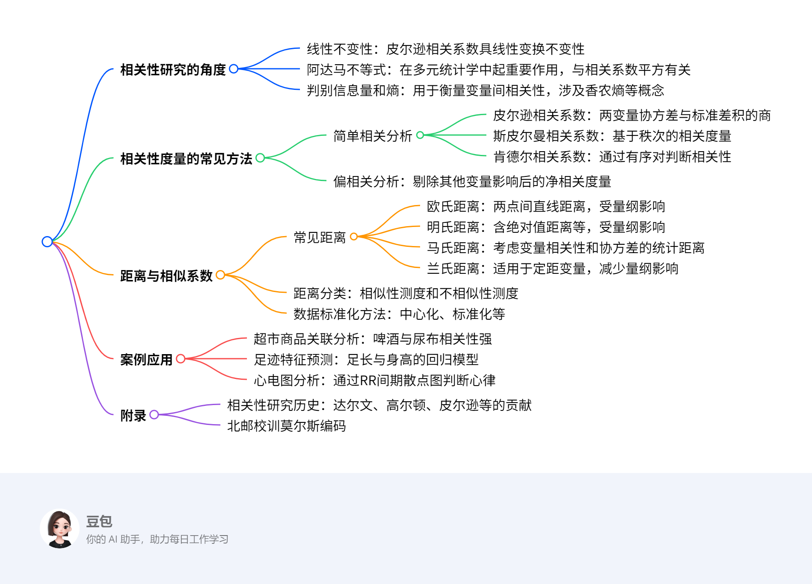

# 第六章：相关性度量
## 概览
---
### 一段话总结
文档围绕多元统计分析中的相关性度量展开，介绍了相关性研究的线性不变性、阿达马不等式、判别信息量和熵三个角度，阐述了简单相关分析（含皮尔逊、斯皮尔曼、肯德尔相关系数）、偏相关分析等常见方法，以及欧氏距离、明氏距离、马氏距离等距离与相似系数，还通过啤酒与尿布的关联、足迹与身高的测算、心电图分析等案例，展示了相关性度量在实际中的应用。

---
### 思维导图

---
### 详细总结
### 一、相关性研究的角度
1. **线性不变性**：皮尔逊相关系数在变量线性变换（如AX、BY，A、B为非零常数）下保持不变，即$\rho(AX,BY)=\rho(X,Y)$，这使其在数据尺度变换时仍能反映真实相关性。
2. **阿达马不等式**：对于正定矩阵$A=(a_{ij})_{n\times n}$，有$|A|\leq\prod_{i=1}^{n}a_{ii}$。在多元统计中，该不等式用于推导相关系数平方$R^2$，如$R^2=1-[\frac{|A|}{\prod_{i=1}^{n}a_{ii}}]$，反映变量间的线性关联程度。
3. **判别信息量和熵**：
    - 判别信息量（互信息）$I(X;Y)=\int\int p(x,y)\ln\frac{p(x,y)}{p(x)p(y)}dxdy$，衡量变量X和Y的依赖程度，当$(X,Y)\sim N(\mu_1,\mu_2,\sigma_1^2,\sigma_2^2,\rho)$时，$I(X;Y)=-\frac{1}{2}\ln(1-\rho^2)$。
    - 熵$H(f(x))=-E[\ln f(x)]$，用于描述变量的不确定性，多元正态分布下$H(f(x))=\frac{1}{2}\ln(2\pi e)+\frac{1}{2}\ln|\Sigma|$。

### 二、相关性度量的常见方法
1. **简单相关分析**
    - **皮尔逊相关系数**：$\rho=\frac{Cov(X,Y)}{\sqrt{D(X)D(Y)}}$，样本相关系数$r=\frac{\sum(x_i-\bar{x})(y_i-\bar{y})}{\sqrt{\sum(x_i-\bar{x})^2\sum(y_i-\bar{y})^2}}$，如高数与概率统计成绩的相关系数可达0.89。
    - **斯皮尔曼相关系数**：基于变量秩次计算，如黄曲霉素含量与肝癌死亡率数据中，通过秩差平方和$d^2$计算，公式为$r_s=1-\frac{6\sum d^2}{n(n^2-1)}$。
    - **肯德尔相关系数**：通过有序对的一致性判断，$\tau=\frac{2P}{C_n^2}-1$，其中P为一致对数目。
2. **偏相关分析**：剔除其他变量影响后的净相关，如剔除Z后X与Y的偏相关系数$r_{XY\cdot Z}=\frac{r_{XY}-r_{XZ}r_{YZ}}{\sqrt{(1-r_{XZ}^2)(1-r_{YZ}^2)}}$，可纠正如儿童身高与言语能力研究中年龄因素的干扰。

### 三、距离与相似系数
1. **常见距离**
    - **欧氏距离**：$d_{ij}=\sqrt{\sum_{k=1}^{m}(x_{ik}-x_{jk})^2}$，如甲乙两城市三项指标的欧氏距离为57.21。
    - **明氏距离**：$d_{ij}(q)=[\sum_{k=1}^{m}|x_{ik}-x_{jk}|^q]^{1/q}$，q=1时为绝对值距离，q=2时为欧氏距离，q→∞时为切比雪夫距离。
    - **马氏距离**：$d_{ij}=\sqrt{(x_i-x_j)^T\Sigma^{-1}(x_i-x_j)}$，考虑变量协方差，如甲乙城市的马氏距离为2.25。
    - **兰氏距离**：$d_{ij}=\sum_{k=1}^{m}\frac{|x_{ik}-x_{jk}|}{x_{ik}+x_{jk}}$，减少量纲影响。
2. **距离分类**
    - **不相似性测度**：包括定距型变量的欧氏距离、绝对距离，定序型变量的卡方测度，二值变量的欧氏距离等。
    - **相似性测度**：定距型变量的皮尔逊相关系数、夹角余弦，二值变量的简单匹配系数、Jaccard系数等。
3. **数据标准化方法**：中心化（$x_{ij}'=x_{ij}-\bar{x}_j$）、标准化（$z_{ij}=\frac{x_{ij}-\bar{x}_j}{s_j}$）、极差标准化等，使不同量纲数据可比较。

### 四、案例应用
1. **超市商品关联分析**：通过购物篮数据计算相关系数，发现啤酒与尿布相关性最强，指导商品摆放。
2. **足迹特征预测**：中国刑事警察学院设计的足迹测算尺，利用标准化身高=标准化足长×6.875的回归模型，如足长24cm对应身高约170cm。
3. **心电图分析**：通过Lorenz散点图分析RR间期，窦性心律呈特定分布，室上性早搏时B线斜率在0.18～0.8之间。

### 五、附录
1. **相关性研究历史**：达尔文提出生物特征相关性，高尔顿绘制历史第一张散点图研究父母与子女身高关系，皮尔逊给出第一个相关系数计算公式。
2. **北邮校训莫尔斯编码**：“厚德博学敬业乐群”对应莫尔斯电码，体现信息论应用。

---
### 关键问题
1. **问题**：皮尔逊相关系数的定义及为何具有线性不变性？
    - **答案**：皮尔逊相关系数定义为两变量协方差与标准差积的商，即$\rho=\frac{Cov(X,Y)}{\sqrt{D(X)D(Y)}}$。其具有线性不变性是因为对于任意非零常数A、B，$\rho(AX,BY)=\rho(X,Y)$，这是由于线性变换不改变变量间的相对变化趋势，仅改变尺度，因此相关系数保持不变。
2. **问题**：偏相关分析与简单相关分析的主要区别是什么？
    - **答案**：简单相关分析只考虑两个变量的直接关系，不考虑其他变量影响；而偏相关分析在计算时会控制其他变量，剔除其影响后考察两个变量的净相关。例如研究儿童身高和言语能力时，若不考虑年龄，简单相关会得出身高越高言语能力越强的错误结论，而偏相关剔除年龄影响后可得到真实关系。
3. **问题**：马氏距离与欧氏距离的主要区别及应用场景是什么？
    - **答案**：欧氏距离是两点间直线距离，受变量量纲影响，且未考虑变量相关性；马氏距离考虑了变量的协方差矩阵，消除了量纲影响，还考虑了变量间相关性，是一种统计距离。应用场景如在多指标分类问题中，马氏距离可更准确地判断样本属于哪个总体，如甲乙城市的指标分析中，马氏距离能更合理地衡量差异。
## 6.1 相关性研究的角度

### 6.1.1 不变性
#### 1. 线性不变性
- **定义**：相关性度量在变量进行线性变换后保持不变的性质，其中线性变换是最常用的变换形式。
- **数学表达**：对于任意非零常数 $A$ 和 $B$，有 $\rho(AX, BY) = \rho(X, Y)$，即皮尔逊相关系数在线性变换下保持不变。
- **原理分析**：
    - 设随机变量 $X$ 和 $Y$ 的协方差为 $\text{Cov}(X, Y)$，方差分别为 $\text{Var}(X)$ 和 $\text{Var}(Y)$。
    - 对 $X$ 进行线性变换 $AX$，对 $Y$ 进行线性变换 $BY$，则新变量的协方差为 $\text{Cov}(AX, BY) = AB \cdot \text{Cov}(X, Y)$。
    - 新变量的方差分别为 $\text{Var}(AX) = A^2 \cdot \text{Var}(X)$，$\text{Var}(BY) = B^2 \cdot \text{Var}(Y)$。
    - 代入皮尔逊相关系数公式：$\rho(AX, BY) = \frac{AB \cdot \text{Cov}(X, Y)}{\sqrt{A^2 \cdot \text{Var}(X) \cdot B^2 \cdot \text{Var}(Y)}} = \frac{\text{Cov}(X, Y)}{\sqrt{\text{Var}(X) \cdot \text{Var}(Y)}} = \rho(X, Y)$。
- **应用场景**：当数据需要进行尺度变换（如温度从摄氏度转换为华氏度）或位置变换（如身高数据减去均值）时，线性不变性确保相关系数能真实反映变量间的相关性。

#### 2. 不同变量维度下的皮尔逊相关系数
- **情况1：$p=1, q=1$（单变量与单变量）**
    - 样本相关系数公式：$r = \frac{\sum (x_i - \bar{x})(y_i - \bar{y})}{\sqrt{\sum (x_i - \bar{x})^2 \sum (y_i - \bar{y})^2}}$，其中 $\bar{x}$ 和 $\bar{y}$ 分别为 $X$ 和 $Y$ 的样本均值。
    - **例子**：已知身高 $X$（cm）和体重 $Y$（kg）的样本数据如下：
        | 序号 | $X$ | $Y$ |
        |------|-----|-----|
        | 1    | 162 | 46  |
        | 2    | 167 | 56  |
        | 3    | 175 | 60  |
    - 计算步骤：
        1. 计算均值：$\bar{x} = \frac{162 + 167 + 175}{3} = 168$，$\bar{y} = \frac{46 + 56 + 60}{3} = 54$。
        2. 计算分子：$(162-168)(46-54) + (167-168)(56-54) + (175-168)(60-54) = (-6)(-8) + (-1)(2) + (7)(6) = 48 - 2 + 42 = 88$。
        3. 计算分母根号内：$\sum (x_i - \bar{x})^2 = (162-168)^2 + (167-168)^2 + (175-168)^2 = 36 + 1 + 49 = 86$；$\sum (y_i - \bar{y})^2 = (46-54)^2 + (56-54)^2 + (60-54)^2 = 64 + 4 + 36 = 104$；分母为 $\sqrt{86 \times 104} \approx \sqrt{8944} \approx 94.68$。
        4. 相关系数 $r = \frac{88}{94.68} \approx 0.93$，说明身高和体重呈强正相关。
- **情况2：$p=1, q>1$（单变量与多变量）**
    - 相关系数矩阵：$[r, r_1, \dots, r_q]$，其中 $r$ 为单变量与第一个多变量的相关系数，$r_i$ 为与第 $i$ 个多变量的相关系数。
- **情况3：$p>1, q>1$（多变量与多变量）**
    - 采用矩阵形式表示协方差和相关系数，通过矩阵运算分析多变量间的相关性。

### 6.1.2 阿达马不等式（Hadamard inequality）
#### 1. 阿达马不等式内容
- 对于 $n$ 阶正定矩阵 $A = (a_{ij})_{n \times n}$，其行列式满足 $|A| \leq \prod_{i=1}^{n} a_{ii}$，即矩阵行列式不超过对角线元素的乘积。

#### 2. 在多元统计学中的应用
- **相关系数平方 $R^2$ 的推导**：
    - 设变量 $X_1, X_2, \dots, X_p$ 的协方差矩阵为 $\Sigma$，其行列式为 $|\Sigma|$，对角线元素为 $\sigma_{11}, \sigma_{22}, \dots, \sigma_{pp}$。
    - 根据阿达马不等式，$|\Sigma| \leq \prod_{i=1}^{p} \sigma_{ii}$，定义 $R^2 = 1 - \frac{|\Sigma|}{\prod_{i=1}^{p} \sigma_{ii}}$，则 $R^2 \in [0, 1]$。
    - $R^2$ 反映了多变量间的线性相关程度，$R^2$ 越大，变量间相关性越强。
- **例子：$p=2$ 时的应用**
    - 设两个变量 $X$ 和 $Y$ 的协方差矩阵为 $\begin{pmatrix} \sigma_{xx} & \sigma_{xy} \\ \sigma_{yx} & \sigma_{yy} \end{pmatrix}$，行列式 $|\Sigma| = \sigma_{xx}\sigma_{yy} - \sigma_{xy}^2$。
    - 根据阿达马不等式，$|\Sigma| \leq \sigma_{xx}\sigma_{yy}$，则 $R^2 = 1 - \frac{\sigma_{xx}\sigma_{yy} - \sigma_{xy}^2}{\sigma_{xx}\sigma_{yy}} = \frac{\sigma_{xy}^2}{\sigma_{xx}\sigma_{yy}} = \rho^2$，即皮尔逊相关系数的平方。
    - 这表明当 $p=2$ 时，$R^2$ 等于皮尔逊相关系数的平方，体现了阿达马不等式与相关系数的联系。

#### 3. 分块矩阵与阿达马不等式
- 对于分块正定矩阵 $A = \begin{pmatrix} A_{11} & A_{12} \\ A_{21} & A_{22} \end{pmatrix}$，其中 $A_{11}$ 和 $A_{22}$ 为方阵，有 $|A| \leq |A_{11}| \cdot |A_{22}|$，进一步扩展了阿达马不等式的应用场景。

### 6.1.3 判别信息量和熵
#### 1. 判别信息量（互信息）
- **定义**：用于衡量两个随机变量 $X$ 和 $Y$ 的依赖程度，记为 $I(X; Y)$，数学表达式为：$I(X; Y) = \int \int p(x, y) \ln \frac{p(x, y)}{p(x)p(y)} dx dy$，其中 $p(x, y)$ 为联合概率密度，$p(x)$ 和 $p(y)$ 为边缘概率密度。
- **正态分布下的互信息**：
    - 当 $(X, Y) \sim N(\mu_1, \mu_2, \sigma_1^2, \sigma_2^2, \rho)$ 时，互信息为 $I(X; Y) = -\frac{1}{2} \ln(1 - \rho^2)$。
    - **例子**：已知两正态分布变量 $X$ 和 $Y$ 的相关系数 $\rho = 0.8$，计算互信息：
        - $I(X; Y) = -\frac{1}{2} \ln(1 - 0.8^2) = -\frac{1}{2} \ln(1 - 0.64) = -\frac{1}{2} \ln(0.36) \approx -\frac{1}{2} \times (-1.0216) \approx 0.5108$。
        - 结果表明 $X$ 和 $Y$ 之间存在较强的信息依赖关系。

#### 2. 熵（Entropy）
- **定义**：用于描述随机变量的不确定性，记为 $H(f(x))$，对于连续变量，熵的定义为 $H(f(x)) = -E[\ln f(x)] = -\int f(x) \ln f(x) dx$，其中 $f(x)$ 为概率密度函数。
- **多元正态分布的熵**：
    - 设 $X \sim N(\mu, \Sigma)$，则熵为 $H(f(x)) = \frac{1}{2} \ln[(2\pi e)^p |\Sigma|]$，其中 $p$ 为变量维度，$|\Sigma|$ 为协方差矩阵的行列式。
    - **例子**：一维正态分布 $X \sim N(\mu, \sigma^2)$，熵为 $H(f(x)) = \frac{1}{2} \ln(2\pi e \sigma^2)$。
        - 当 $\sigma^2 = 1$ 时，$H(f(x)) = \frac{1}{2} \ln(2\pi e) \approx \frac{1}{2} \times 3.2958 \approx 1.6479$，体现了单位方差正态分布的不确定性度量。

#### 3. 互信息与熵的关系
- 互信息可表示为熵的差：$I(X; Y) = H(X) + H(Y) - H(X, Y)$，其中 $H(X, Y)$ 为联合熵，反映了变量 $X$ 和 $Y$ 共同的不确定性，互信息越大，说明变量间的相关性越强，共同不确定性越小。
## 6.2 相关性度量的常见方法

### 6.2.1 简单相关分析
#### 1. 皮尔逊相关系数（Pearson coefficient）
- **定义**：衡量两个连续变量线性相关程度的统计量，取值范围为[-1, 1]，绝对值越大相关性越强。
- **数学公式**：
  - 总体相关系数：$\rho_{XY} = \frac{\text{Cov}(X,Y)}{\sqrt{\text{Var}(X)\text{Var}(Y)}} = \frac{E[(X-\mu_X)(Y-\mu_Y)]}{\sqrt{E[(X-\mu_X)^2]E[(Y-\mu_Y)^2]}}$
  - 样本相关系数：$r = \frac{\sum_{i=1}^{n}(x_i-\bar{x})(y_i-\bar{y})}{\sqrt{\sum_{i=1}^{n}(x_i-\bar{x})^2\sum_{i=1}^{n}(y_i-\bar{y})^2}}$
- **求解步骤**：
  1. 计算样本均值$\bar{x}, \bar{y}$
  2. 计算分子：各数据点与均值差的乘积和
  3. 计算分母：两组数据离差平方和的平方根
  4. 代入公式得到$r$
- **例子**：计算高数成绩(X)和概率成绩(Y)的相关性
  | 学生 | X | Y |
  |---|---|---|
  | 1 | 98 | 93 |
  | 2 | 87 | 91 |
  | 3 | 92 | 89 |
  - 步骤：
    1. $\bar{x} = (98+87+92)/3 = 92.33$，$\bar{y} = (93+91+89)/3 = 91$
    2. 分子：$(98-92.33)(93-91) + (87-92.33)(91-91) + (92-92.33)(89-91)$  
    $= 5.67×2 + (-5.33)×0 + (-0.33)×(-2) = 11.34 + 0 + 0.66 = 12$
    3. 分母：$\sqrt{[(98-92.33)^2+(87-92.33)^2+(92-92.33)^2][(93-91)^2+(91-91)^2+(89-91)^2]}$  
    $= \sqrt{[32.15+28.41+0.11][4+0+4]} = \sqrt{60.67×8} ≈ \sqrt{485.36} ≈ 22.03$
    4. $r = 12/22.03 ≈ 0.545$，说明两者呈中等正相关

#### 2. 斯皮尔曼秩相关系数（Spearman's rank correlation）
- **定义**：基于变量秩次计算的相关系数，适用于有序数据或非线性关系，取值范围[-1, 1]。
- **数学公式**：$r_s = 1 - \frac{6\sum d_i^2}{n(n^2-1)}$，其中$d_i$为两组数据秩次差。
- **求解步骤**：
  1. 将两组数据分别排序，赋予秩次（相同值取平均秩）
  2. 计算每对数据的秩次差$d_i$
  3. 计算秩差平方和$\sum d_i^2$
  4. 代入公式计算$r_s$
- **例子**：黄曲霉素含量(X)与肝癌死亡率(Y)的相关性（表6.2.1）
  | 地区 | X | Y | X秩 | Y秩 | d_i | d_i² |
  |---|---|---|---|---|---|---|
  | 1 | 0.7 | 18.5 | 1 | 2 | -1 | 1 |
  | 2 | 1 | 20.9 | 2 | 3 | -1 | 1 |
  | 3 | 1.7 | 14.4 | 3 | 1 | 2 | 4 |
  | 4 | 3.7 | 64.5 | 4 | 6 | -2 | 4 |
  | 5 | 4 | 27.3 | 5 | 4 | 1 | 1 |
  | 6 | 5.1 | 46.5 | 6 | 5 | 1 | 1 |
  - 步骤：
    1. $\sum d_i^2 = 1+1+4+4+1+1=12$
    2. $r_s = 1 - \frac{6×12}{6×(6²-1)} = 1 - \frac{72}{210} ≈ 0.657$，正相关较强

#### 3. 肯德尔秩相关系数（Kendall's tau）
- **定义**：通过比较有序对的一致性来衡量相关性，取值范围[-1, 1]，适用于小样本或有序数据。
- **数学公式**：$\tau = \frac{2(P-Q)}{n(n-1)}$，其中$P$为一致对数目，$Q$为不一致对数目。
- **求解步骤**：
  1. 对第一组数据排序，确定第二组数据的顺序
  2. 对每对数据$(i,j)$，若$x_i < x_j$且$y_i < y_j$，或$x_i > x_j$且$y_i > y_j$，则为一致对$P$
  3. 若$x_i < x_j$且$y_i > y_j$，或$x_i > x_j$且$y_i < y_j$，则为不一致对$Q$
  4. 代入公式计算$\tau$
- **例子**：分析3个样本的X和Y数据
  | 样本 | X | Y |
  |---|---|---|
  | 1 | 1.7 | 14.4 |
  | 2 | 1 | 20.9 |
  | 3 | 0.7 | 18.5 |
  - 步骤：
    1. 按X排序后：样本3(X=0.7), 样本2(X=1), 样本1(X=1.7)
    2. 对应Y值：18.5, 20.9, 14.4
    3. 计算一致对和不一致对：
      - 样本3与样本2：Y=18.5 < 20.9，一致对，$P=1$
      - 样本3与样本1：Y=18.5 > 14.4，不一致对，$Q=1$
      - 样本2与样本1：Y=20.9 > 14.4，不一致对，$Q=1$
    4. $\tau = \frac{2(1-2)}{3×2} = \frac{2×(-1)}{6} = -0.333$，负相关

### 6.2.2 偏相关分析
#### 1. 偏相关系数定义
- **定义**：在控制其他变量影响后，衡量两个变量的线性相关程度，记为$r_{XY·Z}$（控制Z变量时X与Y的相关）。
- **数学公式**：$r_{XY·Z} = \frac{r_{XY} - r_{XZ}r_{YZ}}{\sqrt{(1-r_{XZ}^2)(1-r_{YZ}^2)}}$，其中$r_{XY}$为X与Y的简单相关系数，$r_{XZ}, r_{YZ}$为X、Y与Z的相关系数。

#### 2. 与简单相关系数的区别
- **简单相关**：仅考虑两变量直接关系，未控制其他变量（如年龄对身高和言语能力的影响）。
- **偏相关**：剔除控制变量的中介作用，反映净相关。例如：
  - 研究儿童身高(X)与言语能力(Y)时，年龄(Z)同时影响X和Y
  - 简单相关可能得出X与Y正相关，但偏相关$r_{XY·Z}$可剔除年龄影响，得到真实关联

#### 3. 求解步骤
  1. 计算X与Y、X与Z、Y与Z的简单相关系数$r_{XY}, r_{XZ}, r_{YZ}$
  2. 代入偏相关公式计算
- **例子**：控制年龄(Z)后，身高(X)与言语能力(Y)的相关性
  - 已知：$r_{XY}=0.7$，$r_{XZ}=0.8$，$r_{YZ}=0.6$
  - 计算：$r_{XY·Z} = \frac{0.7 - 0.8×0.6}{\sqrt{(1-0.8^2)(1-0.6^2)}} = \frac{0.7 - 0.48}{\sqrt{0.36×0.64}} = \frac{0.22}{\sqrt{0.2304}} = \frac{0.22}{0.48} ≈ 0.458$
  - 说明：剔除年龄影响后，身高与言语能力的相关性减弱，表明原简单相关部分由年龄驱动。

#### 4. 高阶偏相关
- **定义**：控制k个变量时的偏相关，如控制$Z_1, Z_2$时，$r_{XY·Z1Z2} = \frac{r_{XY·Z1} - r_{XZ2·Z1}r_{YZ2·Z1}}{\sqrt{(1-r_{XZ2·Z1}^2)(1-r_{YZ2·Z1}^2)}}$
- **应用场景**：多变量分析中排除多个混杂因素，如医学研究中控制性别、年龄、体重等变量后分析指标相关性。
## 6.3 距离与相似系数

### 6.3.1 距离的基本概念
#### 1. 距离的定义
- **定义**：设$x_i, x_j$为两个样本点，距离$d_{ij}=d(x_i, x_j)$需满足以下性质：
  - 非负性：$d_{ij} \geq 0$，且$d_{ij}=0$当且仅当$x_i=x_j$
  - 对称性：$d_{ij}=d_{ji}$
  - 三角不等式：$d_{ik} \leq d_{ij} + d_{jk}$

#### 2. 数据矩阵表示
- 设$n$个样本，每个样本有$m$个特征，数据矩阵为：
  $$
  X = \begin{pmatrix}
  x_{11} & x_{12} & \cdots & x_{1m} \\
  x_{21} & x_{22} & \cdots & x_{2m} \\
  \vdots & \vdots & \ddots & \vdots \\
  x_{n1} & x_{n2} & \cdots & x_{nm}
  \end{pmatrix}
  $$
- 样本$i$和$j$的特征向量为$x_i=(x_{i1}, x_{i2}, \dots, x_{im})^T$，$x_j=(x_{j1}, x_{j2}, \dots, x_{jm})^T$

### 6.3.2 常见距离度量方法
#### 1. 欧氏距离（Euclidean distance）
- **定义**：最常用的直线距离，忽略特征量纲影响
- **公式**：
  $$d_{ij} = \sqrt{\sum_{k=1}^{m}(x_{ik} - x_{jk})^2}$$
  $$d_{ij}^2 = \sum_{k=1}^{m}(x_{ik} - x_{jk})^2 \quad (\text{欧氏距离平方})$$
- **求解步骤**：
  1. 计算各特征差的平方
  2. 求和后开平方
- **例子**：计算三城市指标的欧氏距离（表6.3.1）
  | 城市 | 非农业人口 | 工业总产值 | 建成区面积 |
  |---|---|---|---|
  | 甲(A) | 160 | 60 | 115 |
  | 乙(B) | 110 | 43 | 93 |
  - 步骤：
    $$d_{AB} = \sqrt{(160-110)^2 + (60-43)^2 + (115-93)^2} = \sqrt{50^2 + 17^2 + 22^2} = \sqrt{2500+289+484} = \sqrt{3273} \approx 57.21$$

#### 2. 明氏距离（Minkowski distance）
- **定义**：欧氏距离的推广，通过参数$q$调整距离度量方式
- **公式**：
  $$d_{ij}(q) = \left(\sum_{k=1}^{m}|x_{ik} - x_{jk}|^q\right)^{1/q}$$
  - $q=1$：曼哈顿距离（Manhattan distance），$d_{ij}(1) = \sum_{k=1}^{m}|x_{ik} - x_{jk}|$
  - $q=2$：欧氏距离
  - $q \to \infty$：切比雪夫距离（Chebychev distance），$d_{ij}(\infty) = \max_k|x_{ik} - x_{jk}|$
- **例子**：计算甲乙城市的曼哈顿距离
  $$d_{AB}(1) = |160-110| + |60-43| + |115-93| = 50+17+22=89$$

#### 3. 马氏距离（Mahalanobis distance）
- **定义**：考虑特征相关性和方差的统计距离，消除量纲影响
- **公式**：
  $$d_{ij} = \sqrt{(x_i - x_j)^T\Sigma^{-1}(x_i - x_j)}$$
  其中$\Sigma$为样本协方差矩阵
- **求解步骤**：
  1. 计算样本均值向量$\bar{x}$和协方差矩阵$\Sigma$
  2. 计算样本差向量$x_i - x_j$
  3. 计算协方差矩阵的逆$\Sigma^{-1}$
  4. 代入公式计算
- **例子**：计算甲乙城市的马氏距离（假设协方差矩阵$\Sigma = \begin{pmatrix}1300 & 0 & 0 \\ 0 & 163 & 0 \\ 0 & 0 & 401.3\end{pmatrix}$）
  - 步骤：
    1. 样本差向量：$x_A - x_B = (50, 17, 22)^T$
    2. 协方差矩阵逆：$\Sigma^{-1} = \begin{pmatrix}1/1300 & 0 & 0 \\ 0 & 1/163 & 0 \\ 0 & 0 & 1/401.3\end{pmatrix}$
    3. 计算：
    $$
    (x_A - x_B)^T\Sigma^{-1}(x_A - x_B) = 50^2/1300 + 17^2/163 + 22^2/401.3 \approx 1.923 + 1.773 + 1.206 = 4.902
    $$
    $$d_{AB} = \sqrt{4.902} \approx 2.25$$

#### 4. 兰氏距离（Canberra distance）
- **定义**：适用于正数值特征，减少量纲影响的距离
- **公式**：
  $$d_{ij} = \sum_{k=1}^{m}\frac{|x_{ik} - x_{jk}|}{x_{ik} + x_{jk}}$$
- **例子**：计算甲乙城市的兰氏距离
  - 步骤：
    $$d_{AB} = \frac{|160-110|}{160+110} + \frac{|60-43|}{60+43} + \frac{|115-93|}{115+93}$$
    $$= \frac{50}{270} + \frac{17}{103} + \frac{22}{208} \approx 0.185 + 0.165 + 0.106 = 0.456$$

#### 5. 自定义距离
- **定义**：根据需求自定义距离函数，如加权距离：
  $$d_{ij} = \sqrt{\sum_{k=1}^{m}w_k(x_{ik} - x_{jk})^2}$$
  其中$w_k$为特征权重

### 6.3.3 相似系数
#### 1. 余弦相似度（Cosine similarity）
- **定义**：衡量向量方向的相似性，忽略长度差异
- **公式**：
  $$\cos\theta_{ij} = \frac{\sum_{k=1}^{m}x_{ik}x_{jk}}{\sqrt{\sum_{k=1}^{m}x_{ik}^2}\sqrt{\sum_{k=1}^{m}x_{jk}^2}}$$
- **求解步骤**：
  1. 计算两向量的点积
  2. 计算两向量的模长
  3. 代入公式计算
- **例子**：计算向量$x=(1,2,3)$和$y=(2,4,6)$的余弦相似度
  - 步骤：
    $$\text{点积} = 1×2 + 2×4 + 3×6 = 2+8+18=28$$
    $$|x| = \sqrt{1^2+2^2+3^2} = \sqrt{14}, \quad |y| = \sqrt{2^2+4^2+6^2} = \sqrt{56}=2\sqrt{14}$$
    $$\cos\theta = \frac{28}{\sqrt{14}×2\sqrt{14}} = \frac{28}{2×14}=1$$
    （两向量共线，相似度为1）

#### 2. 相似系数与距离的关系
- 距离越大，相似系数越小，如：
  $$\text{相似系数} = 1 - \frac{d_{ij}}{d_{\text{max}}}$$
  其中$d_{\text{max}}$为最大距离

### 6.3.4 距离分类
#### 1. 不相似性测度（Dissimilarities）
- **定距型变量**：欧氏距离、曼哈顿距离、切比雪夫距离等
- **定序型变量**：卡方测度、φ²测度
- **二值变量**：
  - 欧氏距离：$d_{ij} = \sqrt{b+c}$（$b$为$x_i=1,x_j=0$的特征数，$c$为$x_i=0,x_j=1$的特征数）
  - Lance and Williams测度：$d_{ij} = \frac{2(b+c)}{a+b+c}$（$a$为共同1的特征数）

#### 2. 相似性测度（Similarities）
- **定距型变量**：皮尔逊相关系数、余弦相似度
- **二值变量**：
  - 简单匹配系数：$S_{ij} = \frac{a+d}{a+b+c+d}$
  - Jaccard系数：$J_{ij} = \frac{a}{a+b+c}$

### 6.3.5 数据标准化方法
#### 1. 中心化（Centering）
- **公式**：$x_{ik}' = x_{ik} - \bar{x}_k$，其中$\bar{x}_k$为第$k$特征的均值
- **作用**：使特征均值为0，消除位置影响

#### 2. 标准化（Standardization）
- **公式**：$z_{ik} = \frac{x_{ik} - \bar{x}_k}{s_k}$，其中$s_k$为第$k$特征的标准差
- **作用**：使特征均值为0，方差为1，消除量纲影响
- **例子**：特征值$[1,3,5]$的标准化
  - 均值$\bar{x}=3$，标准差$s=2$
  - 标准化后：$\frac{1-3}{2}=-1$，$\frac{3-3}{2}=0$，$\frac{5-3}{2}=1$

#### 3. 极差标准化
- **公式**：$x_{ik}' = \frac{x_{ik} - \min_k x_k}{\max_k x_k - \min_k x_k}$
- **作用**：将特征值映射到[0,1]区间

#### 4. 对数变换
- **公式**：$x_{ik}' = \log_{10}(x_{ik})$（$x_{ik} > 0$）
- **作用**：压缩大值范围，减轻右偏分布影响

### 6.3.6 距离矩阵与应用
#### 1. 距离矩阵定义
- 设$n$个样本，距离矩阵$D$为：
  $$
  D = \begin{pmatrix}
  0 & d_{12} & d_{13} & \cdots & d_{1n} \\
  d_{21} & 0 & d_{23} & \cdots & d_{2n} \\
  \vdots & \vdots & \vdots & \ddots & \vdots \\
  d_{n1} & d_{n2} & d_{n3} & \cdots & 0
  \end{pmatrix}
  $$

#### 2. 应用场景
- **聚类分析**：根据距离矩阵将样本分组
- **模式识别**：通过距离判断样本类别
- **商品关联分析**：计算商品销售数据的距离，发现关联模式

### 6.3.7 案例：距离度量的量纲影响
#### 1. 问题描述
- 两点$A(5,10)$和$B(10,1)$，分别用cm和kg度量特征1和特征2，计算欧氏距离
- 若特征1单位改为m（1m=100cm），点A变为(0.05,10)，点B变为(0.1,1)

#### 2. 计算步骤
- 原始单位：
  $$d_{AB} = \sqrt{(5-10)^2 + (10-1)^2} = \sqrt{25+81} = \sqrt{106} \approx 10.3$$
- 变换单位：
  $$d_{AB} = \sqrt{(0.05-0.1)^2 + (10-1)^2} = \sqrt{0.0025+81} \approx \sqrt{81.0025} \approx 9.0$$
- **结论**：欧氏距离受量纲影响，需标准化后再计算