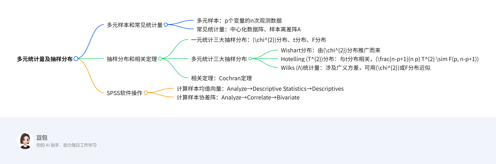

# 第四章：多元统计量及抽样分布
## 概览
---
### 一段话总结
文档为《第04章-多元统计量及抽样分布》内容，主要介绍多元统计分析中多元样本与常见统计量，如中心化数据阵、样本离差阵等，重点阐述多元正态总体下三大抽样分布（Wishart分布、Hotelling \(T^{2}\) 分布、Wilks \(Λ\) 统计量），它们由一元统计的\(\chi^{2}\)、t、F分布推广而来，是区间估计和假设检验的基础，还提及相关定理及在SPSS中计算样本均值向量、协差阵的步骤。

---
### 思维导图

---
### 详细总结
#### 一、多元样本和常见统计量
1. **多元样本**：p个变量的n次观测数据。
2. **常见统计量**
    - **中心化数据阵**：\(a_{i j}=\sum_{\alpha=1}^{n}\left(X_{\alpha i}-\overline{X}_{i}\right)\left(X_{\alpha j}-\overline{X}_{j}\right)\)。
    - **样本离差阵A**：即中心化数据阵。

#### 二、抽样分布和相关定理
1. **一元统计三大抽样分布**：\(\chi^{2}\)分布、t分布、F分布。
2. **多元统计三大抽样分布**
    - **Wishart分布**
        - 1928年Wishart论文实现重要突破。
        - 由\(\chi^{2}\)分布推广而来，设总体\(X ~ N_{p}(0, \sum )\)，随机阵\(W ~ W_{p}(n, \sum )\)。
    - **Hotelling \(T^{2}\)分布**
        - 推广自一元t分布，设总体\(X ~ N_{p}(0, \sum )\)，随机阵\(W ~ W_{p}(n, \sum )\)，X与W独立，\(T^{2}=n X' W^{-1}X\)。
        - 非中心情况：若\(X~N_p(μ,Σ)\)（\(μ≠0\)），\(T^{2} ~ T^{2}(p, n, μ)\)。
        - 与F分布关系：若\(T^{2} ~ T^{2}(p, n)\)，则\(\frac{n-p+1}{n p} T^{2} ~ F(p, n-p+1)\)。
    - **Wilks \(Λ\)统计量**
        - 一元F统计量在多元下的推广，涉及广义方差（常用协方差矩阵行列式）。
        - 特殊情况可化为F统计量，其他情况可用\(\chi^{2}\)或F分布近似。
3. **相关定理**：Cochran定理，涉及独立标准正态变量的平方和分解。

#### 三、SPSS软件操作
1. **计算样本均值向量**
    - 步骤：Analyze→Descriptive Statistics→Descriptives，选择变量，在Options中选Mean。
    - 示例结果：如变量x1均值50，x2均值4。
2. **计算样本协差阵**
    - 步骤：Analyze→Correlate→Bivariate，选择变量，在Options中选Cross-product deviations and covariances。
    - 示例结果：样本离差阵A和样本协差阵S（\(S=A/(n-1)\)），如x1离差平方和136，x1与x2交叉乘积和-6，协方差-2和0.667。

---
### 关键问题
1. **问题**：多元统计中的三大抽样分布与一元统计的三大抽样分布有何联系？
    - **答案**：多元统计的Wishart分布由一元\(\chi^{2}\)分布推广而来，Hotelling \(T^{2}\)分布由一元t分布推广而来，Wilks \(Λ\)统计量与一元F分布相关，它们都是一元分布在多元正态总体下的扩展，是多元统计区间估计和假设检验的基础。
2. **问题**：Hotelling \(T^{2}\)分布与F分布有怎样的具体关系？
    - **答案**：若\(T^{2} ~ T^{2}(p, n)\)，则\(\frac{n-p+1}{n p} T^{2} ~ F(p, n-p+1)\)，通过该关系可将\(T^{2}\)分布转化为F分布进行统计推断。
3. **问题**：在SPSS中如何计算样本协差阵？
    - **答案**：在SPSS中，选择菜单项Analyze→Correlate→Bivariate，将变量移入Variables列表框，单击Options按钮，选择Cross-product deviations and covariances复选框，单击OK按钮，结果中Covariance即为样本协差阵，且样本协差阵是样本离差阵A除以(n-1)。
## 4.1 多元样本和常见统计量  

### 一、多元样本的定义  
**多元样本**指对p个变量进行n次观测得到的数据集合。例如，当p=2（如身高、体重），n=100时，多元样本即为100组包含身高和体重的观测数据🔶1-15。  

### 二、常见统计量及计算方法  
#### 1. 中心化数据阵  
- **定义**：用于刻画数据相对于均值的偏差程度，矩阵元素由各变量观测值与均值的偏差乘积之和构成。  
- **计算公式**：  
  \[
  a_{i j}=\sum_{\alpha=1}^{n}\left(X_{\alpha i}-\overline{X}_{i}\right)\left(X_{\alpha j}-\overline{X}_{j}\right)
  \]  
  其中，\(X_{\alpha i}\)表示第\(\alpha\)次观测中第\(i\)个变量的值，\(\overline{X}_{i}\)为第\(i\)个变量的样本均值。  

#### 2. 样本离差阵A  
- **定义**：即中心化数据阵，是描述多元数据离散程度的核心矩阵1-21🔷。  

### 三、求解方法与实例  
#### 求解步骤：  
1. 计算各变量的样本均值\(\overline{X}_{i}\)。  
2. 对每个观测值，计算其与对应变量均值的偏差。  
3. 按公式计算中心化数据阵的元素\(a_{i j}\)，构成样本离差阵A。  

#### 实例：  
**问题**：设p=2（变量X1、X2），n=3次观测数据如下：  
- 观测1：(X1=10, X2=5)  
- 观测2：(X1=12, X2=6)  
- 观测3：(X1=8, X2=4)  
计算样本离差阵A。  

**解题步骤：**  
1. **计算样本均值**：  
   - \(\overline{X}_{1} = \frac{10+12+8}{3} = 10\)  
   - \(\overline{X}_{2} = \frac{5+6+4}{3} = 5\)  

2. **计算偏差值**：  
   - 对X1：各观测偏差为 \(10-10=0\)，\(12-10=2\)，\(8-10=-2\)  
   - 对X2：各观测偏差为 \(5-5=0\)，\(6-5=1\)，\(4-5=-1\)  

3. **计算中心化数据阵元素**：  
   - \(a_{11} = \sum(X_{\alpha1}-\overline{X}_1)^2 = 0^2 + 2^2 + (-2)^2 = 8\)  
   - \(a_{12} = a_{21} = \sum(X_{\alpha1}-\overline{X}_1)(X_{\alpha2}-\overline{X}_2) = 0×0 + 2×1 + (-2)×(-1) = 0 + 2 + 2 = 4\)  
   - \(a_{22} = \sum(X_{\alpha2}-\overline{X}_2)^2 = 0^2 + 1^2 + (-1)^2 = 2\)  

4. **构造样本离差阵A**：  
   \[
   A = \begin{pmatrix}
   8 & 4 \\
   4 & 2
   \end{pmatrix}
   \]  

### 四、关键要点总结  
- 多元样本是多元统计分析的基础数据结构，通过**中心化处理**可消除均值影响，聚焦数据离散特征。  
- 样本离差阵A直接反映各变量内部及变量间的离散程度与相关性，其元素\(a_{i j}\)刻画了第\(i\)个变量与第\(j\)个变量的协变关系🔶1-17。  
- 实际应用中，常通过矩阵运算或统计软件（如SPSS）快速计算离差阵，为后续方差分析、相关性分析等提供基础。

## 4.2 抽样分布和相关定理  

### 一、一元与多元抽样分布的关联  
#### 1. 一元统计三大抽样分布  
- **χ²分布**：若\(X_1,X_2,\dots,X_n \sim N(0,1)\)独立，则\(\chi^2 = X_1^2 + X_2^2 + \dots + X_n^2 \sim \chi^2(n)\)。  
- **t分布**：若\(X \sim N(0,1)\)，\(Y \sim \chi^2(n)\)独立，则\(t = \frac{X}{\sqrt{Y/n}} \sim t(n)\)。  
- **F分布**：若\(X \sim \chi^2(n)\)，\(Y \sim \chi^2(m)\)独立，则\(F = \frac{X/n}{Y/m} \sim F(n,m)\)。  

#### 2. 多元统计三大抽样分布（推广自一元分布）  
- **Wishart分布（\(W_p(n, \Sigma)\)）**：多元χ²分布的推广，用于描述样本协差阵的分布。  
- **Hotelling \(T^2\)分布（\(T^2(p, n)\)）**：多元t分布的推广，用于检验多元均值差异。  
- **Wilks Λ统计量（\(\Lambda(p, n_1, n_2)\)）**：多元F分布的推广，用于多变量方差分析。  

### 二、多元抽样分布详细解析  
#### 1. Wishart分布  
- **定义**：设\(X_1,X_2,\dots,X_n \sim N_p(0, \Sigma)\)独立，则Wishart分布统计量为\(W = \sum_{i=1}^n X_iX_i' \sim W_p(n, \Sigma)\)。  
- **性质**：当\(p=1\)时，\(W_1(n, \sigma^2) = \sigma^2\chi^2(n)\)，退化为一元χ²分布。  

#### 2. Hotelling \(T^2\)分布  
- **定义**：设\(X \sim N_p(0, \Sigma)\)，\(W \sim W_p(n, \Sigma)\)独立，则\(T^2 = nX'W^{-1}X \sim T^2(p, n)\)。  
- **与F分布的关系**：\(\frac{n-p+1}{np}T^2 \sim F(p, n-p+1)\)，可通过F分布查表进行统计推断。  
- **非中心情况**：若\(X \sim N_p(\mu, \Sigma)\)，则\(T^2 \sim T^2(p, n, \mu)\)（非中心Hotelling \(T^2\)分布）。  

#### 3. Wilks Λ统计量  
- **定义**：设\(A \sim W_p(n_1, \Sigma)\)，\(B \sim W_p(n_2, \Sigma)\)独立，则\(\Lambda = \frac{|A|}{|A+B|}\)，其中\(|A|\)表示矩阵A的行列式。  
- **性质**：当\(p=1\)时，\(\Lambda = \frac{A}{A+B} \sim \frac{1}{1+F}\)，与F分布相关。  
- **近似分布**：当\(p\)和\(n_2\)不满足特殊情况时，可用\(\chi^2\)或F分布近似。  

### 三、相关定理  
#### 1. Cochran定理  
- **内容**：若\(X_1,X_2,\dots,X_n \sim N(0,1)\)独立，\(X = (X_1,\dots,X_n)'\)，则\(X'X = \sum_{i=1}^k X_iX_i'\)，其中各\(X_iX_i'\)为独立的二次型。  
- **应用**：用于证明Wishart分布的可加性和独立性。  

### 四、求解方法与实例  
#### 1. Hotelling \(T^2\)统计量计算实例  
**问题**：设\(p=2\)，样本均值向量\(\overline{X} = (50, 4)\)，样本离差阵\(A = \begin{pmatrix}136 & -6 \\ -6 & 2\end{pmatrix}\)，总体均值\(\mu = (45, 3)\)，计算\(T^2\)统计量并检验均值差异。  

**解题步骤：**  
1. **计算样本协差阵**：\(S = \frac{A}{n-1}\)，假设\(n=4\)，则\(S = \frac{1}{3}\begin{pmatrix}136 & -6 \\ -6 & 2\end{pmatrix} = \begin{pmatrix}45.33 & -2 \\ -2 & 0.67\end{pmatrix}\)。  
2. **构造\(T^2\)统计量**：  
   \[
   T^2 = n(\overline{X} - \mu)'S^{-1}(\overline{X} - \mu)
   \]  
   - 计算均值差：\(\overline{X} - \mu = (50-45, 4-3) = (5, 1)\)  
   - 计算\(S^{-1}\)：  
     \[
     S = \begin{pmatrix}45.33 & -2 \\ -2 & 0.67\end{pmatrix}, \quad S^{-1} = \frac{1}{45.33×0.67 - (-2)^2}\begin{pmatrix}0.67 & 2 \\ 2 & 45.33\end{pmatrix} \approx \begin{pmatrix}0.023 & 0.69 \\ 0.69 & 15.63\end{pmatrix}
     \]  
   - 代入计算：  
     \[
     T^2 = 4 \times (5, 1) \begin{pmatrix}0.023 & 0.69 \\ 0.69 & 15.63\end{pmatrix} \begin{pmatrix}5 \\ 1\end{pmatrix}
     \]  
     \[
     = 4 \times [5×0.023 + 1×0.69, \, 5×0.69 + 1×15.63] \begin{pmatrix}5 \\ 1\end{pmatrix}
     \]  
     \[
     = 4 \times [0.115 + 0.69, \, 3.45 + 15.63] \begin{pmatrix}5 \\ 1\end{pmatrix}
     \]  
     \[
     = 4 \times (0.805, 19.08) \begin{pmatrix}5 \\ 1\end{pmatrix} = 4 \times (0.805×5 + 19.08×1) = 4 \times (4.025 + 19.08) = 4 \times 23.105 = 92.42
     \]  
3. **转化为F分布**：  
   \[
   \frac{n-p+1}{np}T^2 = \frac{4-2+1}{4×2}×92.42 = \frac{3}{8}×92.42 \approx 34.66 \sim F(2, 4-2+1)=F(2,3)
   \]  
4. **统计推断**：查F分布表，\(F_{0.05}(2,3)=9.55\)，由于34.66 > 9.55，拒绝原假设，认为总体均值存在显著差异。  

#### 2. Wilks Λ统计量应用实例  
**问题**：设\(p=1\)，\(A \sim \chi^2(10)\)，\(B \sim \chi^2(5)\)，计算\(\Lambda = \frac{A}{A+B}\)并转化为F分布。  

**解题步骤：**  
1. **计算Λ统计量**：\(\Lambda = \frac{A}{A+B} = \frac{1}{1+B/A}\)  
2. **与F分布关联**：当\(p=1\)时，\(\frac{1-\Lambda}{\Lambda} \cdot \frac{n_2}{n_1} = \frac{B/A}{1} \cdot \frac{5}{10} = \frac{B/5}{A/10} \sim F(5,10)\)。  
3. **统计推断**：若\(\Lambda=0.6\)，则\(\frac{1-0.6}{0.6} \cdot \frac{5}{10} = \frac{0.4}{0.6} \cdot 0.5 = 0.333 \sim F(5,10)\)，查F分布表进行显著性检验。  

### 五、关键要点总结  
- 多元抽样分布是一元分布的高维推广，**Wishart分布**是样本协差阵的理论基础，**Hotelling \(T^2\)分布**用于多元均值检验，**Wilks Λ统计量**用于多变量方差分析。  
- 三大分布可通过**Cochran定理**和矩阵运算与一元分布建立联系，实际应用中常转化为F分布或χ²分布进行推断。  
- 求解多元统计量时，需注意矩阵求逆、行列式计算等操作，复杂问题可借助SPSS等软件实现。