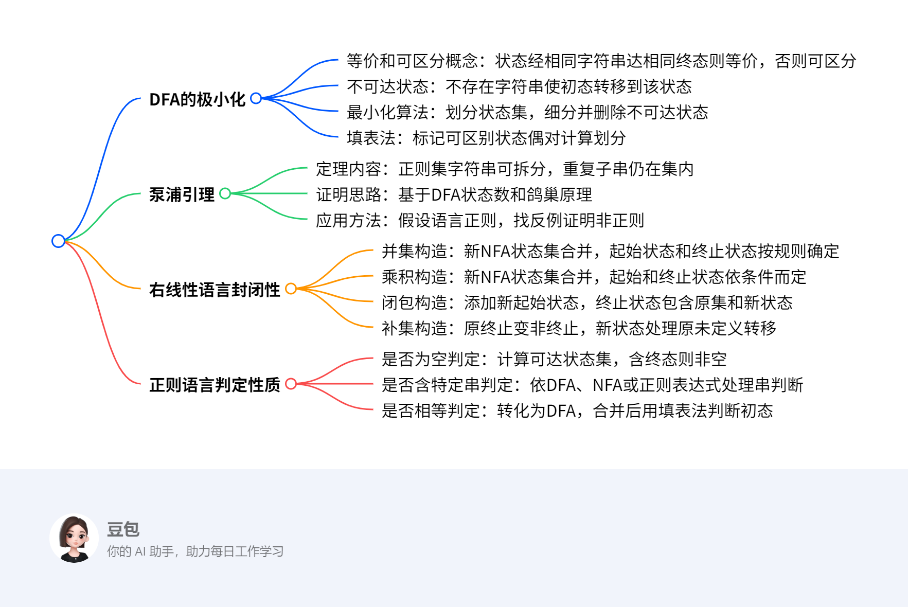

# 3.9 右线性语言的性质
## 概览
---
### 一段话总结
本文主要围绕右线性语言展开，**介绍了DFA的极小化，包括等价、可区分、不可达状态的概念及最小化算法和填表法**；**阐述了泵浦引理，用于判定语言是否为正则集**；**证明了右线性语言在并、积、闭包、补、交等运算下的封闭性**；还**给出了正则语言的几个判定性质及相应算法**，最后布置了相关作业。

---

---
### 详细总结
1. **DFA的极小化**
    - **相关概念**：对于DFA \(M = (Q,T,\delta,q_{0},F)\)，不同状态 \(q_{1},q_{2} \in Q\)，若对每个\(\omega \in T^{*}\)，\((q_{1},\omega) \vdash^{*}(q,\varepsilon)\)和\((q_{2},\omega)\vdash^{*}(q,\varepsilon)\)且\(q \in F\)，则\(q_{1}\)与\(q_{2}\)状态等价，记为\(q_{1}\equiv q_{2}\)，否则称\(q_{1},q_{2}\)可区分；若不存在任何\(\omega \in T^{*}\)，使\((q_{0},\omega)\vdash^{*}(q,\varepsilon)\)，则状态\(q\)为不可达状态；若DFA不存在互为等价状态及不可达状态，则称其为最小化的。
    - **最小化算法**：把DFA的状态集\(Q\)构成一个划分，使任何两个子集的状态都是可区分的，同一子集中的任何两个状态都是等价的。先构成基本划分\(\Pi=\{\Pi', \Pi''\}\)（\(\Pi'\)为终态集，\(\Pi''\)为非终态集），再细分\(\Pi\)，当输入字符使子集中状态到达的状态分属不同子集时，细分该子集，重复直至不可再分，删除不可达状态得到最小化DFA。
    - **填表法**：基于递归标记可区别状态偶对，基础是终态和非终态标记为可区别；归纳是若\(p\)和\(q\)可区别，\(\delta(r,a)=p\)，\(\delta(s,a)=q\)，则\(r\)和\(s\)可区别。通过填表找出所有等价状态偶对，计算状态集合划分块，构造等价DFA。
2. **泵浦引理**
    - **定理内容**：设\(L\)是正则集，存在常数\(k\)，对字符串\(\omega \in L\)且\(|\omega| \geq k\)，则\(\omega\)可写成\(\omega_{1}\omega_{0}\omega_{2}\)，其中\(|\omega_{1}\omega_{0}| \leq k\)，\(|\omega_{0}|>0\)，对所有的\(i \geq 0\)有\(\omega_{1}\omega_{0}^{i}\omega_{2} \in L\) 。
    - **证明思路**：设\(L\)是DFA \(D=(Q,T,\delta,q_{0},F)\)的语言，取\(k = |Q|\)，利用鸽巢原理，对于长度不小于\(n = |Q|\)的字符串，其标记路径上必有重复状态。
    - **应用方法**：用于证明某个语言不是正规语言，步骤为选任意的\(n\)，找到满足条件的串\(\omega \in L\)，任选满足\(\omega = xyz\) 、\(y \neq \varepsilon\) 、\(|xy| \leq n\)的\(x,y,z\)，找到\(k \geq 0\)，使\(xy^{k}z \notin L\)。
3. **右线性语言的封闭性**
    - **并集**：设\(L_{1}\)和\(L_{2}\)是右线性语言，构造NFA \(M=(Q,T,\delta,q_{0},F)\)，\(Q = Q_{1} \cup Q_{2} \cup \{q_{0}\}\)，\(F\)根据\(\varepsilon\)是否在\(L_{1}\)和\(L_{2}\)中确定，证明\(L_{1} \cup L_{2}\)为右线性语言。
    - **乘积**：构造NFA \(M=(Q,T,\delta,q_{0},F)\)，\(Q = Q_{1} \cup Q_{2}\) ，\(q_{0}=q_{1}\)，\(F\)依\(q_{2}\)是否在\(F_{2}\)中而定，证明\(L_{1}L_{2}\)为右线性语言。
    - **闭包**：构造NFA \(M=(Q,T,\delta,q_{0},F)\)，\(Q = Q_{1} \cup \{q_{0}\}\)，\(F = F_{1} \cup \{q_{0}\}\)，证明\(L_{1}^{*}\)是右线性语言。
    - **补集**：构造接受\(\overline{L_{1}}\)的\(M=(Q,T,\delta,q_{0},F)\)，将\(M_{1}\)的终止状态变为非终止状态，添加新状态处理原未定义转移，证明\(\overline{L_{1}}\)是右线性语言。
    - **交集**：利用\(L_{1} \cap L_{2}=\overline{\overline{L_{1}} \cup \overline{L_{2}}}\)证明其封闭性。
4. **正则语言的判定性质**
    - **是否为空判定**：测试从初态是否可达某一终态，先求可达状态集合，若包含终态则语言非空，否则为空。算法复杂度为\(O(n^{2})\) 。
    - **是否包含特定字符串判定**：以DFA表示时，从初态处理输入字符串，结束于终态则包含；以NFA或\(\varepsilon - NFA\)表示时，可转化为DFA或直接模拟处理；以正规表达式表示时，转化为\(\varepsilon - NFA\)再处理。算法复杂度因表示形式而异。
    - **是否相等判定**：先将两个正规语言转化为DFA，重命名使状态无重名，相并构造新DFA，运用填表算法判断原DFA初态是否可区别，复杂度上限为\(O(n^{4})\)，优化后为\(O(n^{2})\)。
5. **作业布置**：Chap3习题17（部分小题）使用泵浦引理证明集合不是正则集；习题20构造最小状态的等价DFA。
---
### 关键问题
1. **泵浦引理在证明语言非正则时，如何选择合适的字符串ω？**
    - 答案：选择的字符串\(\omega\)要能体现语言的特性，且长度至少为泵浦引理中的常数\(k\)（通常取状态数\(n\)）。例如证明\(L = \{a^{n}b^{n} | n \geq 1\}\)不是正则集时，选\(\omega = a^{n}b^{n}\)，它能突出语言中\(a\)和\(b\)个数相等的特性，便于后续推导矛盾。
2. **填表法中归纳步骤的原理是什么？**
    - 答案：填表法归纳步骤原理是，若\(p\)和\(q\)已标记为可区别，且状态\(r\)和\(s\)通过某个输入符号\(a\)分别转移到\(p\)和\(q\)，即\(\delta(r,a)=p\)，\(\delta(s,a)=q\) ，那么若\(p\)和\(q\)可为字符串\(w\)区别，则\(r\)和\(s\)可为字符串\(aw\)区别，因为\(\delta'(r,aw)=\delta'(p,w)\)，\(\delta'(s,aw)=\delta'(q,w)\) ，所以\(r\)和\(s\)也标记为可区别。
3. **右线性语言封闭性证明中，构造NFA时如何确定新的起始状态和终止状态？**
    - 答案：在并集构造中，新起始状态\(q_{0}\)是新增的，终止状态\(F\)在\(\varepsilon \notin L_{1}\)且\(\varepsilon \notin L_{2}\)时为\(F_{1} \cup F_{2}\)，否则为\(F_{1} \cup F_{2} \cup \{q_{0}\}\)；乘积构造中，新起始状态\(q_{0}=q_{1}\)，终止状态\(F\)根据\(q_{2}\)是否在\(F_{2}\)中确定；闭包构造中，新起始状态\(q_{0}\)是新增的，终止状态\(F = F_{1} \cup \{q_{0}\}\)；补集构造中，新起始状态\(q_{0}=q_{1}\)，终止状态\(F=(Q_{1}-F_{1}) \cup \{\gamma\}\) ，\(\gamma\)是新增状态。 
## 泵浦引理
泵浦引理是判断一个语言是否为正则集的重要工具，它给出了正则语言应满足的一个必要条件。

- **定理内容**：设$L$是正则集，存在常数$k$，对于字符串$\omega \in L$且$|\omega| \geq k$，则$\omega$可写成$\omega_{1}\omega_{0}\omega_{2}$ 。其中，$|\omega_{1}\omega_{0}| \leq k$，$|\omega_{0}| > 0$ ，并且对所有的$i \geq 0$ ，都有$\omega_{1}\omega_{0}^{i}\omega_{2} \in L$ 。从直观上理解，当给定一个正则集和该集合上一个足够长的字符串时，在这个字符串中能找到一个非空的子串$\omega_{0}$，把这个子串重复任意次（包括0次）后组成的新字符串，依然在同一个正则集内。
- **证明思路**：设$L$是$DFA$ $D=(Q,T,\delta,q_{0},F)$的语言，取$k = |Q|$。对于任一长度不小于$n = |Q|$的字符串$w = a_{1}a_{2}...a_{m}$（$m \geq n$ ，$a_{k} \in T$ ，$1 \leq k \leq m$ ），考察状态序列$p_{0}=q$ ，$p_{1}=\delta'(q,a_{1})$ ，$p_{2}=\delta'(q,a_{1}a_{2})$ ，$\cdots$ ，$p_{n}=\delta'(q,a_{1}a_{2}...a_{n})$ ，$p_{n + 1}=\delta'(q,a_{1}a_{2}...a_{n + 1})$ ，$\cdots$ ，$p_{m}=\delta'(q,a_{1}a_{2}...a_{m})$ 。由鸽巢原理可知，$p_{0}$，$p_{1}$ ，$p_{2}$ ，$\cdots$ ，$p_{n}$中至少有两个状态是重复的，即存在$i$ ，$j$ ，$0 \leq i < j \leq n$ ，使得$p_{i}=p_{j}$ 。令$w = xyz$ ，其中$x = a_{1}a_{2}...a_{i}$ ，$y = a_{i + 1}a_{i + 2}...a_{j}$ ，$z = a_{j + 1}a_{j + 2}...a_{m}$ ，那么对任何$k \geq 0$ ，都有$xy^{k}z \in L(D)$ 。这就说明了满足正则集的字符串具有这样可“泵浦”的特性 。
- **应用举例**：证明$L = \{a^{n}b^{n} | n \geq 1\}$不是正则集。假设$L$是正则集，根据泵浦引理，对于足够大的$n$ ，$a^{n}b^{n}$可写成$\omega_{1}\omega_{0}\omega_{2}$ ，其中$0 < |\omega_{0}|$ ，$|\omega_{1}\omega_{0}| \leq n$ ，而$|\omega| = 2n > n$ 。由于$|\omega_{1}\omega_{0}| \leq n$ ，所以$\omega_{0}$中不可能含$b^{+}$（若含$b^{+}$ ，$|\omega_{1}\omega_{0}|$就会大于$n$ ），$\omega_{0}$只可能取$a^{+}$ ，设$|\omega_{0}| = k \geq 1$（$k$为常数） 。取$i = 0$ ，则$\omega_{1}\omega_{0}^{0}\omega_{2}=\omega_{1}\omega_{2}=a^{n - k}b^{n}$ ，此时$a$和$b$的字符个数不同，即新组成的串$\omega_{1}\omega_{2} \notin L$ ，这与假设矛盾，所以$L$不是正则集。 
## 右线性语言的封闭性
