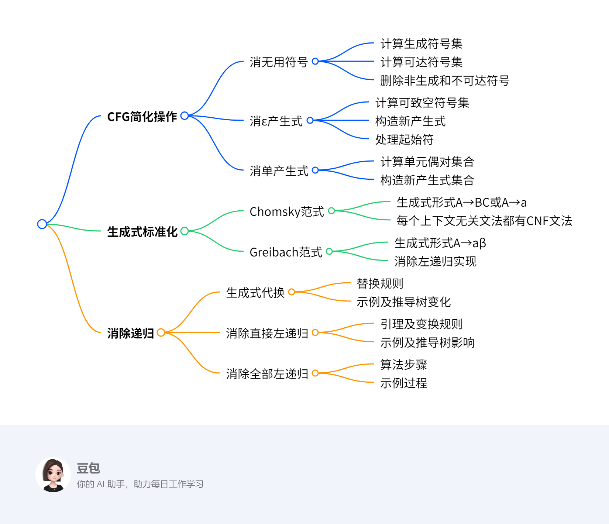

# 第四章：上下文无关文法与下推自动机2
## 总览
---
### 一段话总结
上下文无关文法（CFG）的变换包括**消无用符号、消ε产生式、消单产生式、对生成式形式进行标准化**等操作。其中，消无用符号需先计算生成符号集和可达符号集，再删除非生成和不可达符号；消ε产生式要计算可致空符号集；消单产生式需计算单元偶对集合。CFG简化步骤依次为消除ε产生式、单产生式和无用符号，可使变换后的文法语言为原语言去掉空串。此外，还介绍了消除递归的方法，包括生成式代换、消除直接左递归和全部左递归，这是因为左递归会导致句法分析算法死循环。 

---
### 思维导图

---
### 详细总结
1. **上下文无关文法（CFG）的变换**
    - **生成式的标准形式**
      |范式|生成式形式|意义|
      |----|----|----|
      |Chomsky范式（CNF）|A→BC, A→a（A, B, C∈N , a∈T）|每个上下文无关文法都有一个CNF文法|
      |Greibach范式（GNF）|A→aβ（a∈T , β∈N*）|对每个2型语言都可找到一个文法使产生式的右端都以终结符开始，中心思想是消除左递归|
    - **变换算法**
      - **消去无用符号**：有用符号需满足\(S \stackrel{*}{\Rightarrow} \alpha X \beta \stackrel{*}{\Rightarrow} w\)（\(w \in T^{*}\) , \(\alpha, \beta \in(N \cup T)^{*}\)），无用符号包括非生成符号和不可达符号。计算生成符号集时，终结符是生成符号，若产生式\(A \to \alpha\)中\(\alpha\)的符号都是生成符号，则A也是；计算可达符号集时，S是可达符号，若A可达且\(A \to \alpha\)，则\(\alpha\)中的符号都可达。最后消去非生成和不可达符号及相关产生式，且必须先执行计算生成符号集算法，再执行计算可达符号集算法。
      - **消去ε产生式**：目的是方便文法设计和规范化，消去后除不能产生空串外不影响其他字符串产生。可致空符号指\(A \Rightarrow \varepsilon\)的非终结符A，计算可致空符号集后，按规则构造新产生式集P1，若起始符S可致空，还需引入新起始符S1。
      - **消去单产生式**：单产生式形如A→B（A、B为非终结符），消去目的是简化证明、减少推导步数和规范化。通过计算单元偶对集合，对每个单元偶对(A,B)，在新文法中加入产生式A→α（B→α为非单产生式）。
2. **CFG的简化**：简化步骤为消除ε产生式、单产生式和无用符号，若原CFG语言至少包含一个非空字符串，变换后的文法语言为原语言去掉空串，且要注意简化步骤的次序。
3. **消除递归**
    - **递归的定义**：在2型文法中，若存在\(A\Rightarrow\alpha A\beta\)（A∈N），称G是递归文法；若存在\(A\Rightarrow A\beta\)，是左递归文法；若存在\(A\Rightarrow\alpha A\)，是右递归文法；若存在\(A\Rightarrow A\)，是循环文法。
    - **生成式的代换**：对形如A→αBβ（B∈N,α,β∈(N∪T)*）的生成式，若B→r1| r2|…| rk，则可将A→αBβ用A→αr1β|…|αrkβ取代。
    - **消除直接左递归**：若P中有A生成式\(A￫Aα1 | Aα2 | … | Aαm |β1 |β2 | … |βn\)（βi的第一个字符不是A），可引入新非终结符A’，将A生成式变换为\(A￫β1|β2|…|βn|β1A’|β2A’|…|βnA’\)，\(A’￫α1|α2|…|αm|α1A’|α2A’|…|αmA’\)。
    - **消除全部左递归**：对于给定的无无用符号、无循环且无ε生成式的2型文法，通过特定算法可消除左递归，该算法原理与求解正规表达式方程组类似。
---
### 关键问题
1. **为什么消除无用符号时必须先执行计算生成符号集算法，再执行计算可达符号集算法？**
    - 答案：若先执行计算可达符号集算法，可能会保留一些虽然可达但无法生成终结符串的非终结符及其相关产生式，导致无用符号不能完全删除。例如文档中的例子，若先用算法2，再用算法1，会残留多余的产生式。
2. **消去ε产生式后，新文法的语言与原文法语言有何不同？**
    - 答案：消去ε产生式后，新文法的语言比原文法语言少了空串\(\varepsilon\)，其他字符串的产生不受影响。因为消去ε产生式的过程中，只是去除了能产生空串的产生式，对于其他非空字符串的推导路径没有改变。
3. **消除左递归的算法5与求解正规表达式方程组的算法类似，体现在哪些方面？**
    - 答案：二者类似体现在都是通过逐步变换的方式来消除某种递归结构。算法5通过对非终结符的排序，依次处理每个非终结符的产生式，消除左递归；求解正规表达式方程组也是通过对变量（类似非终结符）的处理，逐步消除递归关系，使表达式更加简洁、易于分析。 
## 4.2 上下文无关文法的变换
这段内容介绍了两种生成式的标准形式：Chomsky范式（CNF）和Greibach范式（GNF）。

- **Chomsky范式（CNF）**：生成式形式为**A→BC**（A、B、C为非终结符，属于集合N ）和**A→a**（a为终结符，属于集合T ）。并且每个上下文无关文法都有与之对应的CNF文法，这意味着任何上下文无关文法都可以转化为满足这种特定形式的文法，从而为后续对文法的分析和处理提供了一种规范的形式。
- **Greibach范式（GNF）**：生成式形式为**A→aβ**，其中a是终结符，β是由非终结符组成的字符串（β∈N*） 。其意义在于，对于每个2型语言（即上下文无关语言），都能找到一个符合GNF的文法，使得产生式的右端都以终结符开始。**中心思想是消除左递归**，左递归会导致一些句法分析算法出现死循环，将文法转化为GNF形式可以避免这种情况，使句法分析更加顺畅。 
### CFG的简化
[无用符号和无用产生式的消除](https://blog.csdn.net/m0_73647441/article/details/142342516)
这段内容主要讲述了上下文无关文法（CFG）的简化步骤、结论以及需要注意的要点：

1. **简化步骤**
    - **消除ε产生式**：ε产生式指形如\(A→ε\)的产生式。消除它的目的是使文法更加规范，方便后续处理。消除后，文法将不能产生空串，但不会影响其他字符串的产生。例如，若原文法中有\(S→aSbS|ε\)，消除ε产生式后，会生成一系列新产生式来替代原产生式，保证除空串外其他字符串的推导不受影响。
    - **消除单产生式**：单产生式是形如\(A→B\)（\(A\)、\(B\)为非终结符）的产生式。消除单产生式可简化证明过程，减少推导步数。比如在复杂的推导中，过多单产生式会使过程繁琐，消除后能让推导更简洁。
    - **消除无用符号**：无用符号包括非生成符号（无法推出终结符串的符号）和不可达符号（从起始符无法到达的符号）。通过计算生成符号集和可达符号集，可找出并删除这些无用符号及相关产生式，使文法更精简。如对于文法\(G = (\{S, A, B\}, \{a\}, P, S)\)，若\(B\)是不可达符号，就需删除\(B\)及包含\(B\)的产生式。
2. **结论**：**如果上下文无关文法\(G\)的语言中至少包含一个非空字符串，按照上述三个步骤从\(G\)构造出的新文法\(G1\)，其语言\(L(G1)\)等于原语言\(L(G)\)去掉空串，即\(L(G1) = L(G) - \{ε\}\)** 。这表明简化后的文法在功能上与原文法基本一致，只是不再产生空串。
3. **注意事项**：**强调上述简化步骤的顺序不能随意更改**。若顺序颠倒，可能无法完全删除无用符号，导致简化后的文法达不到预期效果。例如在消除无用符号时，必须先计算生成符号集，再计算可达符号集，若顺序错误，就可能保留一些本应删除的无用符号。 
#### 消无用符号
这段内容主要介绍了上下文无关文法中消去无用符号的相关知识，具体如下：

1. **无用符号和有用符号的定义**
    - **无用符号**：包括非生成符号和不可达符号。
    - **有用符号**：对于上下文无关文法\(G=(N,T,P,S)\)，符号\(X\in N\cup T\)是有用的，当且仅当\(S\stackrel{*}{\Rightarrow}\alpha X\beta\stackrel{*}{\Rightarrow}w\) ，其中\(w\in T^{*}\)，\(\alpha,\beta\in(N\cup T)^{*}\)。具体又分为生成符号（存在\(w\in T^{*}\)，满足\(X\stackrel{*}{\Rightarrow}w\) ）和可达符号（存在\(\alpha,\beta\in(N\cup T)^{*}\)，满足\(S\stackrel{*}{\Rightarrow}\alpha X\beta\) ）。
2. **消去无用符号的步骤**
    - **计算生成符号集**
        - **思路**：利用归纳法，基础是任何终结符\(a\in T\)都是生成符号；归纳条件是若产生式\(A\rightarrow\alpha\)中\(\alpha\in(N\cup T)^{*}\)的每一个符号都是生成符号，则\(A\)也是生成符号。
        - **算法步骤**：先令\(N_0 = \varnothing\) ，再确定\(N’ = \{A | A→ω且ω∈T*\}\) ；若\(N_0≠N’\)，更新\(N_0=N’\) ，然后让\(N’= N_0\cup\{ A | A→α且α∈(T\cup N_0)* \}\)并重复判断，直到\(N_0=N’\)，最终\(N_1 = N’\) 。该算法用于找出能推出终结符串的非终结符作为有用符号。
    - **计算可达符号集**
        - **思路**：同样用归纳法，基础是\(S\)是可达符号；归纳条件是若\(A\)是可达符号，且有产生式\(A\rightarrow\alpha\) （\(\alpha\in(N\cup T)^{*}\) ），则\(\alpha\)中的每一个符号都是可达符号。
        - **算法步骤**：首先\(N_0 = \{S\}\) ，接着确定\(N’= \{x | A∈N_0且A→αxβ\}∪ N_0\) ；若\(N_0≠N’\) ，更新\(N_0=N’\)并重复操作，直至\(N_0=N’\) ，最后\(N_1 = N’ ∩ N\) ，\(T_1=N’∩T\) ，\(P_1\)由\(P\)内只含\(N’\)中符号的生成式组成，以此找出从\(S\)可达的所有符号。
    - **消去非生成符号及不可达符号**：以文法\(G=(\{S, A, B\}, \{a\}, P, S)\) ，\(P: S→AB, S→a, A→a\)为例，先使用算法1删除推不出终结符串的\(B\)及相关产生式\(S→AB\) ；再用算法2删除不出现在\(S\)能推导出的句型中的\(A\)及相关产生式\(A→a\) ，得到简化后的文法\(G_1=(\{S\}, \{a\}, \{ S→a\}, S )\)。需要注意，必须先执行算法1，再执行算法2，否则可能无法完全删除无用符号。
3. **定理**：任何非空的上下文无关语言，都可由不存在无用符号的上下文无关文法产生，但文中未给出证明过程。 
#### 消ε产生式
这段内容聚焦于上下文无关文法中消去ε产生式，从目的、影响、相关符号定义、算法步骤到实例与练习，进行了全面讲解。

1. **消去ε产生式概述**
    - **目的**：**方便文法设计，促进文法规范化**。
    - **影响**：**消去后仅无法产生字符串ε，对原语言其他字符串的产生无影响**。
    - **可致空符号**：在上下文无关文法\(G = (N, T, P, S)\)里，若符号\(A\in N\)满足\(A\stackrel{+}{\Rightarrow}\varepsilon\)，\(A\)就是可致空符号。计算该符号集合对消去ε产生式及其影响很关键。
2. **生成无ε文法的算法3**
    - **定义**：**若\(G\)中无ε产生式，或仅有\(S→ε\)且\(S\)不在其他产生式右边，\(G\)就是无ε文法**。
    - **思路**：通过归纳步骤找可致空符号。**基础是\(A→ε\)的\(A\)是可致空符号；归纳是若\(B→C_1C_2…C_k\)中\(C_i\)都是可致空符号，则\(B\)也是**。
    - **算法步骤**：
        - 用算法1找出能推出ε的非终结符集合\(N'\) 。
        - 构造新产生式集合\(P_1\) ：对于\(A→β_0 C_1β_1 C_2…C_nβ_n\in P\) （\(n≥0\) ，\(C_k\in N'\) ，\(β_j\notin N'\) ），在\(P_1\)加入\(A→β_0Y_1β_1Y_2β_2…Ynβ_n\) （\(Y_k\)是\(C_k\)或\(\varepsilon\) ），但不加入\(A→ε\) 。若\(S\in N'\) ，在\(P_1\)加\(S_1→ε|S\) （\(S_1\)是新起始符），\(N_1 = N\cup\{S_1\}\) ；若\(S\notin N'\) ，\(N_1 = N\) ，\(S_1 = S\) ，得到新文法\(G_1=( N_1,T, P_1,S_1)\) 。
3. **示例与练习**
    - **示例**：对于\(G = (N, T, P, S)\) （\(N = \{S\}\) ，\(T = \{a, b\}\) ，\(P: S→aSbS | bSaS|ε\) ），先确定\(N' = \{S\}\) ，再构造\(P_1\) ，因\(S\in N'\) ，得到\(S_1→ε∣S\) ，\(N_1 = \{S,S_1\}\) ，从而得出无ε文法\(G_1\) 。
    - **练习**：针对含可致空符号\(D\)的给定文法，按步骤消去ε产生式后，得到新的产生式集合。 
#### 消单产生式
这段内容主要介绍了上下文无关文法中消去单产生式的相关知识，包括单产生式定义、消去目的、算法思路、步骤及示例，具体如下：

1. **单产生式定义与消去目的**
    - **定义**：**单产生式是形如A→B的产生式，其中A、B均为非终结符**。例如在给定文法\(G = (\{S,A,B\}, \{ (,), +, *, a\}, P, S)\)中，若有产生式\(S→A\)，这就是一个单产生式。
    - **消去目的**：**可简化某些证明，减少推导步数，利于文法规范化**。比如在复杂的文法推导和证明过程中，过多单产生式会增加推导的复杂性，消去它们能让过程更简洁明了。
2. **单元偶对**：**对于上下文无关文法\(G = (N, T, P, S)\)，若\(A,B \in N\)，当且仅当\(A \stackrel{*}{\Rightarrow} B\)且推导过程仅使用单产生式时，称\((A,B)\)是单元偶对**。计算所有单元偶对的集合是消去单产生式的关键步骤，它能确定哪些非终结符之间存在通过单产生式的推导关系。
3. **消去单产生式算法**
    - **算法思路**：**对每个单元偶对\((A,B)\)，在新文法\(G_1\)中加入产生式\(A \to \alpha\)，其中\(B \to \alpha\)为非单产生式，以此消去原文法\(G\)中的单产生式，得到新的上下文无关文法\(G_1 = (N_1, T, P_1, S)\)**。这意味着利用非单产生式来替代单产生式的推导效果，同时去除单产生式。
    - **算法步骤**：
        - **构造非终结符集\(N_A\)**：对每个\(A \in N\)，构造可由\(A\)推出的单生成式中的非终结符集\(N_A = \{B|A \stackrel{*}{\Rightarrow} B\}\) 。构造过程分三步，先令\(N_0 = \{A\}\)；然后\(N' = \{C | 如果B→C \in P且B \in N_0\} \cup N_0\)；若\(N' \neq N_0\)，更新\(N_0 = N'\)并重复第二步，直到\(N' = N_0\)，此时\(N_A = N'\) 。这一步是为了找出从\(A\)出发通过单产生式能推导到的所有非终结符。
        - **构造\(P_1\)**：如果\(B \to \alpha \in P\)且不是单生成式，对于\(B \in N_A\)的所有\(A\)，把\(A \to \alpha\)加入到\(P_1\)中 。即对于那些能通过单产生式从\(A\)推导到\(B\)，且\(B\)有非单产生式\(B \to \alpha\)的情况，将\(A \to \alpha\)加入新产生式集合\(P_1\)。
        - **得到新文法\(G_1\)**：完成上述步骤后，得到新文法\(G_1 = (N_1, T, P_1, S)\)，其中\(N_1\)通常与原\(N\)相同（文档未提及\(N_1\)有特殊变化），\(T\)为原终结符集，\(P_1\)是新构造的产生式集合。
4. **示例**：对于文法\(G = (\{S,A,B\}, \{ (,), +, *, a\}, P, S)\)，\(P: S→S + A|A\)，\(A→A * B|B\)，\(B→(S)|a\) 。
    - 先构造\(N_S\)、\(N_A\)、\(N_B\)，通过迭代计算得到\(N_S = \{B, A, S\}\)，\(N_A = \{A,B\}\)，\(N_B = \{B\}\) 。
    - 然后构造\(P_1\)，根据规则将相关非单产生式添加到\(P_1\)中，最终得到\(P_1\)为\(S→S + A|A * B|(S)|a\)，\(A→A * B|(S)|a\)，\(B→(S)|a\) ，完成了从原文法到无单生成式文法的转换。 
### 对生成式形式进行标准化
这段内容主要围绕上下文无关文法中递归的相关概念、消除递归的方法及算法展开，具体如下：

1. **递归的定义**：在2型文法中，根据推导形式对递归进行分类：
    - 若存在\(A\stackrel{+}{\Rightarrow}\alpha A\beta\)（\(A\in N\)），则称\(G\)是递归文法。
    - 若存在\(A\stackrel{+}{\Rightarrow}A\beta\) ，\(G\)是左递归文法。
    - 若存在\(A\stackrel{+}{\Rightarrow}\alpha A\) ，\(G\)是右递归文法。
    - 若存在\(A\stackrel{+}{\Rightarrow}A\) ，\(G\)是循环文法。
2. **生成式的代换**：
    - **定义**：2型文法中形如\(A→\alpha\)的生成式称为\(A\)生成式。
    - **引理1**：对于\(A→\alpha B\beta\)（\(B\in N\)，\(\alpha,\beta\in(N\cup T)^*\) ）且\(B→r_1|r_2|…|r_k\)的情况，可生成新文法\(G_1\)，其产生式将\(A→\alpha B\beta\)替换为\(A→\alpha r_1\beta|…|\alpha r_k\beta\) ，**目的是保持生成语言不变**。例如，对于文法\(G\)有\(S→aSS | b\)，设\(\alpha = a\)，\(B = S\)，\(\beta = S\) ，\(B→aSS | b\) ，替换后\(G_1\)的产生式为\(S→aaSSS|abS | b\)。
3. **消除直接左递归**：
    - **引理2**：对于\(P\)中有\(A\)生成式\(A→A\alpha_1 | A\alpha_2 | … | A\alpha_m |\beta_1 |\beta_2 | … |\beta_n\)（\(\beta_i\)首字符不是\(A\) ）的情况，引入新非终结符\(A’\)构成\(G_1\)，\(P_1\)中用\(A→\beta_1|\beta_2|…|\beta_n|\beta_1A’|\beta_2A’|…|\beta_nA’\)和\(A’→\alpha_1|\alpha_2|…|\alpha_m|\alpha_1A’|\alpha_2A’|…|\alpha_mA’\)取代原\(A\)生成式，**证明思路是\(G\)和\(G_1\)正则式相同**。如\(S→S + A | A\)，\(A→A*B | B\)，\(B→(S) | a\) ，变换为\(S→A | AS’\) ，\(S’→ + A | + AS’\) 等。
4. **消除左递归的算法（算法5）**：
    - **原因**：左递归会使后续句法分析算法陷入死循环，所以要消除。
    - **适用条件**：针对不存在无用符号、无循环且无\(\varepsilon\)生成式的2型文法。
    - **步骤**：对非终结符排序，按顺序对每个非终结符\(A_i\)的产生式进行变换。若有\(A_i→A_i\alpha_1|…| A_i\alpha_n|\beta_1|…|\beta_p\) ，变换为\(A_i→\beta_1|…|\beta_p|\beta_1 A_i ’|\beta_p A_i ’\) ，\(A_i ’→\alpha_1|…|\alpha_n|\alpha_1 A_i ’|…|\alpha_n A_i ’\)；对于\(A_i→A_j\alpha\) ，\(A_j→\beta_1|…|\beta_n\) ，用\(A_i→\beta_1\alpha|\beta_2\alpha|…|\beta_n\alpha\)代替。例如对\(A_1→A_2A3|a\) ，\(A_2→A_3A_1| A_1b\) ，\(A_3→A_1A_2 | A_3A_3 | a\) ，按算法步骤进行逐步变换消除左递归。 