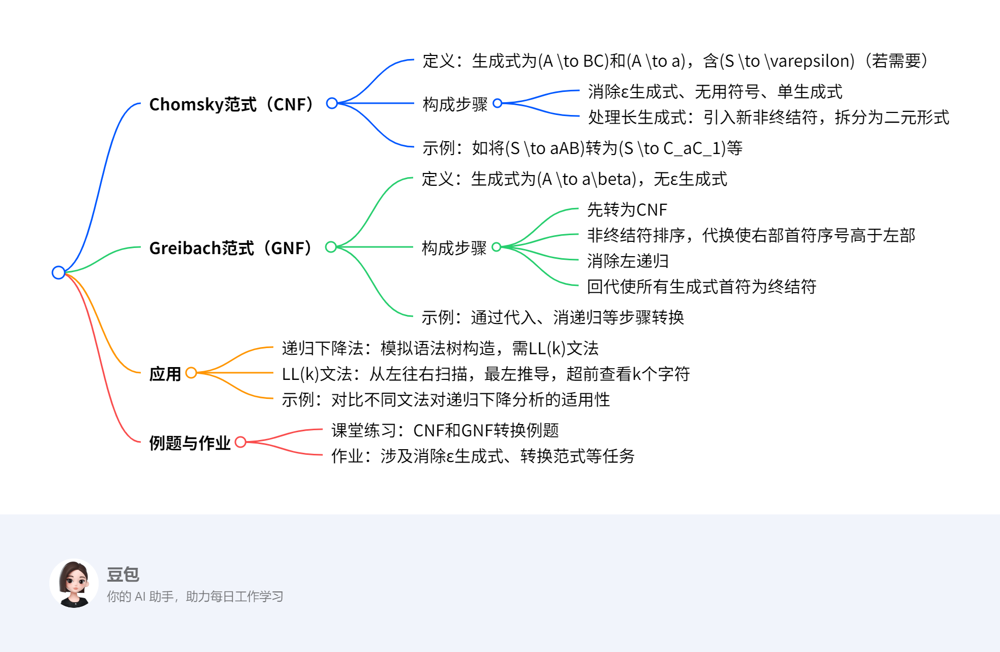

# 第四章：上下文无关文法与下推自动机3
## 概览
---
### 一段话总结
文档主要介绍**Chomsky范式（CNF）和Greibach范式（GNF）**这两种上下文无关文法的范式。CNF生成式形式为\(A \to BC\)和\(A \to a\)，构成步骤包括消除ε生成式等操作并对长生成式拆分；GNF生成式形式为\(A \to a\beta\)，需先转为CNF，再经排序、代换、消左递归、回代等步骤构成。文中还提及上下文无关文法变换在编辑器语法分析（如递归下降法、LL(k)文法）中的应用，并给出相关例题与作业。

---
### 思维导图

---
### 详细总结
#### 一、Chomsky范式（CNF）
**定义**：2型文法\(G=(N,T,P,S)\)，生成式为\(A \to BC\)（\(A,B,C \in N\)）和\(A \to a\)（\(a \in T\)），若含\(\varepsilon \in L(G)\)，则仅有\(S \to \varepsilon\)且\(S\)不在其他生成式右侧。  
**构成步骤**：  
1. **消除ε生成式、无用符号、单生成式**（算法1-4）。  
2. **处理长生成式**：  
   - 若生成式为\(A \to D_1D_2\cdots D_n\)（\(n \geq 2\)），对每个\(D_i\)，若为终结符则引入新非终结符\(B_i \to D_i\)，若为非终结符则\(B_i = D_i\)，将原生成式转为\(A \to B_1B_2\cdots B_n\)。  
   - 若\(n > 2\)，进一步拆分为二元形式，如\(A \to B_1C_1\)，\(C_1 \to B_2C_2\)，…，\(C_{n-1} \to B_{n-1}B_n\)（\(C_i\)为新非终结符）。  

**示例**：  
- 文法\(G\)含\(S \to aAB\)，转换为\(S \to C_aC_1\)，\(C_a \to a\)，\(C_1 \to AB\)；\(A \to BBB\)转为\(A \to BC_2\)，\(C_2 \to BB\)。  

#### 二、Greibach范式（GNF）
**定义**：2型文法\(G=(N,T,P,S)\)，生成式为\(A \to a\beta\)（\(A \in N\)，\(a \in T\)，\(\beta \in N^*\)），无ε生成式。  
**构成步骤**：  
1. **转为CNF**（生成式为\(A \to a\)或\(A \to BC\)）。  
2. **非终结符排序与代换**：按顺序对\(A_i \to A_j\beta\)（\(j < i\)）用高序号非终结符代换，使右部首符序号高于左部。  
3. **消除左递归**：对最高序号非终结符\(A_n \to A_n\gamma\)，引入新非终结符消除左递归，使生成式以终结符开头。  
4. **回代**：从高到低将\(A_n\)、\(A_{n-1}\)等生成式回代，使所有生成式右部首符为终结符。  

**示例**：  
- CNF文法\(A \to BC\)，\(B \to CA|b\)，\(C \to AB|a\)，经代换、消递归、回代后，最终生成式均以终结符开头（如\(C \to bCB|a|\cdots\)）。  

#### 三、上下文无关文法变换的应用
**递归下降法**：  
- 原理：通过函数递归调用模拟语法树自上而下构造（最左推导）。  
- LL(k)文法：需超前查看\(k\)个字符决定生成式，第一个\(L\)为从左往右扫描，第二个\(L\)为最左推导。  
- **示例对比**：  
  - 文法\(E \to F*F|F/F\)无法用递归下降法，因无法通过超前查看区分\(*\)和\(/\)。  
  - 转换为GNF后可减少重复解析，提高性能。  

#### 四、例题与作业
| 类型         | 内容                                                                 |
|--------------|----------------------------------------------------------------------|
| **课堂练习** | CNF转换：如将\(S \to bA|aB\)转为\(S \to C_bA|C_aB\)，\(C_b \to b\)等。 |
|              | GNF转换：如消ε生成式后转为CNF，再排序、消递归等。                   |
| **作业**     | 11题：消除ε、单生成式和无用符号，转为CNF。                           |
|              | 15题：将文法转为等价GNF。                                            |

---
### 关键问题
1. **Chomsky范式和Greibach范式的核心区别是什么？**  
   **答案**：CNF生成式为\(A \to BC\)（二元非终结符）和\(A \to a\)（终结符），侧重结构规范化；GNF生成式为\(A \to a\beta\)（以终结符开头），侧重首符为终结符，便于语法分析（如递归下降法）。  

2. **将上下文无关文法转换为GNF的关键步骤有哪些？**  
   **答案**：关键步骤包括：  
   1. 先转为CNF；  
   2. 非终结符排序并代换，使右部首符序号高于左部；  
   3. 消除左递归，使最高序号非终结符生成式以终结符开头；  
   4. 从高到低回代，使所有生成式首符为终结符。  

3. **为什么递归下降法需要文法满足LL(k)条件？**  
   **答案**：递归下降法通过超前查看\(k\)个字符决定采用哪个生成式，LL(k)文法要求从左往右扫描时，能通过最左推导和超前查看\(k\)个字符唯一确定生成式，避免解析歧义。若不满足，无法在有限查看范围内决定分支，导致解析失败。
## Chomsky范式
### **Chomsky范式（CNF）概述**  
**定义**：  
- **适用范围**：2型文法（上下文无关文法）\( G=(N, T, P, S) \)。  
- **生成式形式**：  
  - **必选形式**：\( A \to BC \)（\( A, B, C \)为非终结符）和\( A \to a \)（\( a \)为终结符）。  
  - **特殊情况**：若文法包含空串\( \varepsilon \)，则允许存在唯一生成式\( S \to \varepsilon \)，且非终结符\( S \)不能出现在任何其他生成式的右侧。  
- **核心性质**：**每个上下文无关文法都存在等效的CNF**（定理4.3.1）。  

### **CNF的构成步骤**  
1. **预处理**：  
   - 使用算法1-4依次消除**ε生成式**（空串生成式）、**无用符号**（无法导出终结符或无法从起始符到达的符号）和**单生成式**（形如\( A \to B \)的生成式）。  

2. **处理长生成式（\( n \geq 2 \)）**：  
   - **步骤1**：对生成式\( A \to D_1D_2\cdots D_n \)，若\( D_i \)为**终结符**，引入新非终结符\( B_i \)并添加生成式\( B_i \to D_i \)；若\( D_i \)为**非终结符**，则令\( B_i = D_i \)，将原生成式转换为\( A \to B_1B_2\cdots B_n \)。  
   - **步骤2**：若\( n > 2 \)，进一步拆解为二元生成式链。例如：  
     \[
     A \to B_1C_1, \quad C_1 \to B_2C_2, \quad \dots, \quad C_{n-1} \to B_{n-1}B_n
     \]  
     其中\( C_i \)为新引入的非终结符，确保每个生成式右侧仅含**2个非终结符**。  

### **CNF构成示例**  
**原始文法**（已预处理，无ε、循环、无用符号和单生成式）：  
\[
G = (\{A, B, S\}, \{a, b\}, P, S), \quad P: S \to aAB \mid BA,\ A \to BBB \mid a,\ B \to AS \mid b
\]  

**转换过程**：  
1. **直接符合CNF的生成式**：  
   - \( S \to BA \)（\( BA \)为两个非终结符，符合\( A \to BC \)）。  
   - \( A \to a \)、\( B \to AS \)（\( AS \)为两个非终结符）、\( B \to b \)均符合CNF，直接保留到新文法\( G_1 \)的生成式集合\( P_1 \)。  

2. **处理不符合CNF的生成式**：  
   - **\( S \to aAB \)**：  
     - 终结符\( a \)需引入新非终结符\( C_a \)，添加\( C_a \to a \)。  
     - 非终结符\( A, B \)直接保留，令\( C_1 \to AB \)，最终生成式为\( S \to C_aC_1 \)。  
   - **\( A \to BBB \)**（\( n=3 > 2 \)）：  
     - 拆解为二元链：引入新非终结符\( C_2 \)，生成式变为\( A \to BC_2 \)和\( C_2 \to BB \)。  

**等效CNF文法\( G_1 \)**的生成式：  
\[
P_1: \quad S \to BA \mid C_aC_1,\ C_a \to a,\ C_1 \to AB,\ A \to BC_2 \mid a,\ C_2 \to BB,\ B \to AS \mid b
\]  

### **总结**  
- **核心目标**：将任意上下文无关文法转换为仅含**二元非终结符生成式**和**终结符生成式**的规范形式，便于语法分析（如自底向上分析）。  
- **关键操作**：通过引入新非终结符，将长生成式拆解为二元结构，确保所有生成式符合CNF定义。
## Greibach范式
### **Greibach范式（GNF）概述**  
**定义**：  
- **适用范围**：2型文法（上下文无关文法）\( G=(N, T, P, S) \)。  
- **生成式形式**：  
  - 所有生成式均为 **\( A \to a\beta \)**（\( A \in N \)为非终结符，\( a \in T \)为终结符，\( \beta \in N^* \)为非终结符串）。  
  - **核心要求**：文法**不含ε生成式**（即不允许生成式右部为空串\( \varepsilon \)）。  
- **核心性质**：**任何2型文法都存在等效的GNF**（定理4.3.2）。  

### **GNF的构成步骤**  
1. **转换为Chomsky范式（CNF）**：  
   - 先将原始文法转换为CNF，确保生成式仅含 **\( A \to a \)**（终结符）或 **\( A \to BC \)**（两个非终结符）形式。  

2. **非终结符排序与代换**：  
   - **排序规则**：为非终结符指定顺序（如\( A_1, A_2, \dots, A_n \)），低位在前，高位在后（例：\( A \)为低位，\( C \)为高位）。  
   - **代换目标**：对形如 **\( A_i \to A_j\beta \)**（\( j < i \)，即右部首符序号低于左部）的生成式，通过代入高序号非终结符的生成式，将其转换为 **\( A_i \to A_l\beta \)**（\( l > i \)，即右部首符序号高于左部）。  

3. **消除左递归**：  
   - 对最高序号的非终结符（如\( A_n \)）的左递归生成式（如 **\( A_n \to A_n\gamma \)**），引入新非终结符\( A_n' \)，将其拆分为：  
     \[
     A_n \to a\beta \mid a\beta A_n', \quad A_n' \to \gamma \mid \gamma A_n'
     \]  
     确保\( A_n \)的生成式**以终结符开头**。  

4. **回代过程**：  
   - 从最高序号非终结符开始，将其生成式**回代入低序号非终结符的生成式**，使每个生成式的右部**首字符为终结符**。  
   - 例：将\( A_n \)的生成式代入\( A_{n-1} \)，再将\( A_{n-1} \)的新生成式代入\( A_{n-2} \)，以此类推。  

5. **处理消递归引入的新非终结符**：  
   - 对消除左递归时引入的新非终结符（如\( A_1', A_2', \dots \)），通过代换使其生成式右部**首字符也为终结符**。  

### **GNF构成示例**  
**原始CNF文法**：  
\[
\begin{cases} 
A \to BC \quad \text{①} \\
B \to CA \mid b \quad \text{②} \\
C \to AB \mid a \quad \text{③} 
\end{cases}
\]  

**转换步骤**：  
1. **非终结符排序**：设顺序为\( A \)（低位）、\( B \)、\( C \)（高位）。  
2. **代换处理**：  
   - 对\( C \to AB \)（\( A \)序号低于\( C \)），代入\( A \to BC \)得：  
     \[
     C \to BC B \mid a \quad \text{④}
     \]  
   - 再代入\( B \to CA \mid b \)得：  
     \[
     C \to CAC B \mid bC B \mid a \quad \text{⑤}
     \]  
3. **消除左递归**（针对\( C \to CACB \mid \dots \)）：  
   - 拆分为：  
     \[
     C \to bCB \mid a \mid bCBC' \mid aC', \quad C' \to ACB \mid ACBC' \quad \text{⑥⑦}
     \]  
4. **回代**：  
   - 将\( C \)的生成式⑥代入\( B \to CA \mid b \)，得：  
     \[
     B \to bCBA \mid aA \mid bCBC'A \mid aC'A \mid b \quad \text{⑧}
     \]  
   - 将\( B \)的生成式⑧代入\( A \to BC \)，得：  
     \[
     A \to bCBAC \mid aAC \mid bCBC'AC \mid aC'AC \mid bC \quad \text{⑨}
     \]  
   - 最终所有生成式均以终结符（\( a/b \)）开头，符合GNF要求。  

### **核心要点总结**  
- **目标**：将任意上下文无关文法转换为**右部以终结符开头**的规范形式，便于语法分析（如递归下降法）。  
- **关键操作**：  
  - **排序与代换**：确保生成式右部首符序号高于左部，避免低序号非终结符前置。  
  - **消左递归**：通过引入新非终结符，打破递归环并强制以终结符开头。  
  - **回代**：从高到低逐层代入，确保所有生成式首符为终结符。  
- **应用场景**：GNF常用于构造**LL(k)文法**，支持递归下降语法分析器的设计。
## 上下文无关文法变换的应用

### **上下文无关文法变换的应用——递归下降法与LL(k)文法**  

#### **一、递归下降法的核心原理**  
- **定义**：递归下降法是编辑器语法分析中常用的方法，通过**函数间的递归调用**模拟语法树**自上而下的构造过程**（即最左推导过程）。  
- **关键逻辑**：每个非终结符对应一个解析函数，函数根据当前输入字符选择合适的生成式进行推导。  

#### **二、LL(k)文法的定义与特征**  
- **定义**：  
  - **LL(k)**中，第一个 **L** 表示**从左往右扫描输入字符串**，第二个 **L** 表示**最左推导**，**k** 表示**超前查看k个字符**以确定生成式。  
  - **核心要求**：文法必须满足**通过超前查看k个字符，能唯一确定当前非终结符应使用的生成式**，否则无法用递归下降法解析。  

#### **三、示例分析：递归下降法的适用性**  
##### **例1：不适用递归下降法的文法**  
- **文法G**：  
  \[
  E \to F * F, \quad E \to F / F, \quad F \to \text{id}, \quad F \to (E)
  \]  
- **问题**：  
  - 两个E生成式均以非终结符 **F** 开头，而F可推导为任意长表达式（如`id`或`(E)`）。  
  - **结论**：**无论超前查看多少字符，都无法区分应选择乘号（`*`）还是除号（`/`）的生成式**，因此该文法不适用递归下降法。  

##### **例2：适用递归下降法的文法（经GNF转换）**  
- **文法G'**：  
  \[
  E \to \text{id}G, \quad E \to (EH, \quad G \to *F, \quad G \to /F, \quad F \to \text{id}, \quad F \to (E, \quad H \to )
  \]  
- **改进点**：  
  - E的生成式以终结符 **id** 或 **(** 开头，G的生成式以 ***** 或 **/** 开头。  
  - **结论**：**通过超前查看首字符（如`id`、`(`、`*`、`/`），可直接确定生成式**，适用于递归下降法。  

#### **四、Greibach范式（GNF）的作用**  
- **核心价值**：  
  - 将文法转换为**GNF形式（生成式以终结符开头）**，确保每个生成式右部**首字符为终结符**，从而满足LL(k)文法的条件。  
  - **附加优势**：减少解析过程中的重复判断，**提高语法分析性能**。  

#### **五、总结**  
| **关键点**         | **说明**                                                                 |  
|--------------------|--------------------------------------------------------------------------|  
| **递归下降法**     | 基于函数递归的自上而下语法分析方法，依赖LL(k)文法。                       |  
| **LL(k)文法条件**  | 需通过超前查看k个字符唯一确定生成式，核心是**生成式首字符可区分**。       |  
| **GNF的作用**      | 通过转换生成式以终结符开头，使文法满足LL(k)条件，**提升解析效率**。       |  
| **示例对比**       | 首字符为非终结符的文法（如例1）无法使用递归下降法，首字符为终结符的文法（如例2）适用。 |