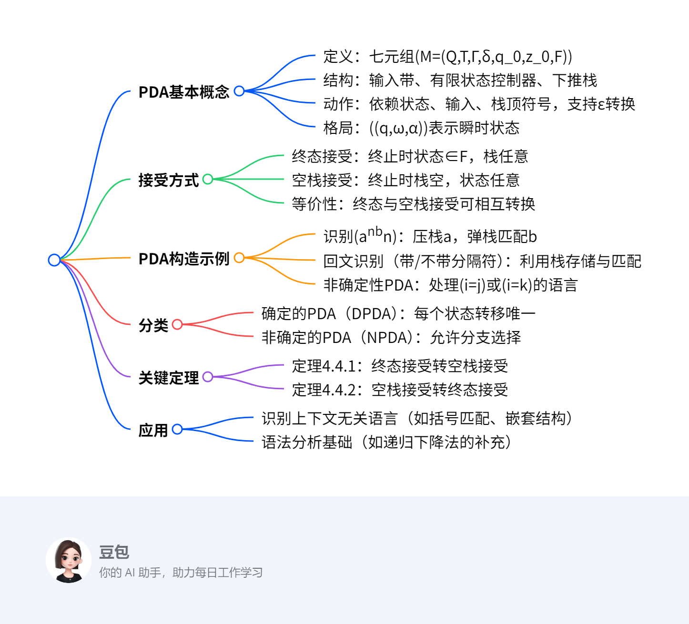

# 第四章：上下文无关文法与下推自动机4
## 总览
---
### 一段话总结  
文档主要介绍**下推自动机（PDA）** 的基本概念、构造方法及应用，包括PDA的形式定义（七元组结构）、两种接受语言的方式（终态接受和空栈接受）及其等价性，重点阐述PDA作为上下文无关语言接收器的原理。通过实例（如识别\(a^nb^n\)、回文语言等）展示PDA的构造过程，并区分确定的PDA（DPDA）与非确定的PDA（NPDA）。最后提及空栈接受与终态接受的等价性定理及相关作业练习。

---
### 思维导图  


---
### 详细总结  

#### 一、PDA的形式定义与结构  
**定义**：  
- **七元组表示**：\(M=(Q,T,Γ,δ,q_0,z_0,F)\)，其中：  
  - \(Q\)：有限状态集；\(T\)：输入字母表；\(Γ\)：栈字母表；  
  - \(\delta\)：转移函数，定义为\(\delta(q,a,Z) = \{(p,α)\}\)（\(a∈T∪\{ε\}\)，\(Z∈Γ\)，\(α∈Γ^*\)）；  
  - \(q_0\)：初始状态；\(z_0\)：初始栈底符号；\(F\)：终态集（空栈接受时\(F=∅\)）。  

**结构组件**：  
1. **输入带**：存放输入字符串，读头单向移动。  
2. **有限状态控制器**：根据当前状态、输入字符和栈顶符号决定动作。  
3. **下推栈**：后进先出（LIFO），支持压栈（push）和弹栈（pop）操作，栈顶符号决定转移规则。  

**转移函数类型**：  
- **标准转移**：\(\delta(q,a,Z) = \{(p,α)\}\)，消耗输入字符\(a\)，栈顶\(Z\)替换为\(α\)，状态转为\(p\)。  
- **ε转移**：\(\delta(q,ε,Z) = \{(p,α)\}\)，不消耗输入，直接调整状态和栈。  

#### 二、PDA的格局与接受方式  
**格局（瞬时状态）**：  
- 表示为\((q,ω,α)\)，其中：  
  - \(q\)：当前状态；\(ω\)：剩余输入字符串（\(ω=ε\)表示输入处理完毕）；  
  - \(α\)：栈内容（\(α=ε\)表示栈空）。  

**接受方式**：  
| **方式**       | **定义**                                                                 | **特点**                          |  
|----------------|--------------------------------------------------------------------------|-----------------------------------|  
| **终态接受**   | \(L(M) = \{\omega \mid (q_0,\omega,z_0) \vdash^*(q,ε,α), q∈F, α∈Γ^*\}\)   | 终止时状态在\(F\)中，栈非空      |  
| **空栈接受**   | \(L(M) = \{\omega \mid (q_0,\omega,z_0) \vdash^*(q,ε,ε), q∈Q\}\)         | 终止时栈空，状态任意（\(F=∅\)）   |  

**等价性定理**：  
1. **定理4.4.1**：终态接受语言可转换为空栈接受语言，通过引入辅助状态和栈底符号实现。  
2. **定理4.4.2**：空栈接受语言可转换为终态接受语言，通过添加初始状态和终态实现。  

#### 三、PDA构造示例  
**例1：识别\(L = \{a^nb^n \mid n≥0\}\)**  
- **状态设计**：\(Q = \{q_0,q_1,q_2\}\)（\(q_0\)初始/终态，\(q_1\)处理a，\(q_2\)处理b）。  
- **转移规则**：  
  - \(\delta(q_0,a,z_0) = \{(q_1,az_0)\}\)（压栈a）；  
  - \(\delta(q_1,b,a) = \{(q_2,ε)\}\)（弹栈a匹配b）；  
  - \(\delta(q_2,ε,z_0) = \{(q_0,ε)\}\)（栈空时返回终态）。  
- **格局示例**：输入\(aabb\)的识别过程为：  
  \[
  (q_0,aabb,z_0) \vdash (q_1,abb,az_0) \vdash (q_1,bb,aaz_0) \vdash (q_2,b,az_0) \vdash (q_2,ε,z_0) \vdash (q_0,ε,ε)
  \]  

**例2：识别回文语言\(\{\omega c \omega^T \mid \omega∈\{a,b\}^*\}\)（DPDA）**  
- **思路**：用栈存储\(\omega\)，遇到分隔符\(c\)后弹栈匹配\(\omega^T\)。  
- **关键转移**：  
  - \(\delta(q_0,a,z) = \{(q_0,az)\}\)（压栈a）；  
  - \(\delta(q_0,c,z) = \{(q_1,z)\}\)（切换状态到匹配阶段）；  
  - \(\delta(q_1,a,a) = \{(q_1,ε)\}\)（弹栈a匹配输入a）。  

**例3：非确定PDA识别\(L = \{a^ib^jc^k \mid i=j \text{或} i=k, k≠0\}\)**  
- **不确定性应用**：通过ε转移分支猜想匹配b或c，无需显式判断。  

#### 四、确定的PDA（DPDA）与非确定的PDA（NPDA）  
| **类型**   | **定义**                                                                 | **示例语言**                |  
|------------|--------------------------------------------------------------------------|-----------------------------|  
| **DPDA**   | 对任意状态、输入、栈顶，转移唯一（无ε转移与非ε转移冲突）               | \(a^nb^n\)、带分隔符回文    |  
| **NPDA**   | 允许同一状态下有多个转移选择（如ε转移与非ε转移并存）                   | 不带分隔符回文、\(i=j\)或\(i=k\) |  

**关键区别**：DPDA的转移函数\(\delta\)满足：  
- 对同一\(q,z\)，不同时存在\(\delta(q,a,z)\)和\(\delta(q,ε,z)\)；  
- 每个转移至多一个后续状态。  

#### 五、关键定理与应用  
**定理应用**：  
- **等价性定理**：证明PDA两种接受方式的等价性，确保理论完整性。  
- **与上下文无关语言（CFL）的等价性**：PDA是CFL的接收器，即CFL当且仅当存在PDA接受该语言。  

**应用场景**：  
- **语法分析**：如编译器中识别嵌套结构（括号匹配、函数调用）。  
- **语言识别**：处理有限自动机无法识别的无限状态语言（如\(a^nb^n\)）。  

---  
### 关键问题  
1. **PDA与有限自动机（FA）的核心区别是什么？**  
   **答案**：PDA引入**下推栈**作为额外存储，解决FA无法处理的上下文无关语言（如需要计数或嵌套结构的语言），而FA仅依赖有限状态，无法处理无限状态依赖问题。  

2. **终态接受与空栈接受的本质区别是什么？**  
   **答案**：  
   - 终态接受要求终止时**状态属于终态集\(F\)**，栈可以非空；  
   - 空栈接受要求终止时**栈为空**，状态可以是任意状态（\(F=∅\)）。  
   两者通过定理4.4.1和4.4.2可相互转换，本质上识别相同的语言类。  

3. **DPDA与NPDA的主要差异如何影响语言识别？**  
   **答案**：  
   - **DPDA**：转移确定，适合构造高效的语法分析器（如递归下降法），但只能识别部分CFL（如确定性CFL）。  
   - **NPDA**：允许非确定转移，可识别所有CFL，但实现时需回溯或状态枚举，效率较低。  
   例如，不带分隔符的回文语言\(\omega\omega^T\)只能用NPDA识别，因无法确定中间分隔点。

## **下推自动机（PDA）的格局与接受方式**  
### **一、PDA格局的定义与组成**  
**格局**是描述PDA瞬时工作状态的三元组，形式为：  
\[
\mathbf{(q, \omega, \alpha)}
\]  
- **\(q\)**：当前状态（有限控制器状态）。  
- **\(\omega\)**：待输入字符串（\(\omega = \varepsilon\)表示输入已处理完毕）。  
- **\(\alpha\)**：下推栈内容（\(\alpha = \varepsilon\)表示栈为空）。  

**转移示例**：  
若转移函数\(\delta(q, a, Z) = \{(p, r)\}\)，则格局转移可表示为：  
\[
(q, a\omega, Z\alpha) \vdash (p, \omega, r\alpha)
\]  
- **含义**：在状态\(q\)，输入字符\(a\)，栈顶符号\(Z\)时，消耗\(a\)，栈顶\(Z\)替换为\(r\)，状态转为\(p\)，剩余输入变为\(\omega\)。  

**初始与终止格局**：  
- **初始格局**：\((q_0, \omega, z_0)\)（\(q_0\)为初始状态，\(z_0\)为初始栈底符号）。  
- **终止格局**：  
  - **终态接受**：\((q, \varepsilon, \alpha)\)，其中\(q \in F\)（终态集），\(\alpha \in \Gamma^*\)（栈可为非空）。  
  - **空栈接受**：\((q, \varepsilon, \varepsilon)\)，其中\(q \in Q\)（状态任意），栈必须为空。  


### **二、PDA接受语言的两种方式**  
#### **1. 终态接受**  
- **定义**：  
  \[
  L(M) = \{\omega \mid (q_0, \omega, z_0) \vdash^* (q, \varepsilon, \alpha), \ q \in F, \ \alpha \in \Gamma^*\}
  \]  
- **关键**：以**状态进入终态集\(F\)**为接受条件，栈中内容不要求为空。  
- **示例**：识别\(a^nb^n\)的PDA（见下文示例），最终状态\(q_0 \in F\)，栈空时接受。  

#### **2. 空栈接受**  
- **定义**：  
  \[
  L(M) = \{\omega \mid (q_0, \omega, z_0) \vdash^* (q, \varepsilon, \varepsilon), \ q \in Q\}
  \]  
- **关键**：以**栈为空**为接受条件，状态可为任意状态（此时\(F = \emptyset\)）。  
- **特点**：终止状态与状态集无关，仅依赖栈是否为空。  


### **三、PDA构造示例：识别\(L = \{a^nb^n \mid n \geq 0\}\)**  
#### **1. 设计思路**  
- **压栈阶段**：输入\(a\)时将其压入栈，状态转为\(q_1\)。  
- **弹栈匹配阶段**：输入\(b\)时弹出栈顶\(a\)，状态转为\(q_2\)，直至栈空。  
- **接受条件**：输入处理完毕且栈空时，通过\(\varepsilon\)转移回到初始状态\(q_0\)（终态）。  

#### **2. 形式定义**  
\[
M = (Q, T, \Gamma, \delta, q_0, z_0, F)
\]  
- **状态集**：\(Q = \{q_0, q_1, q_2\}\)（\(q_0\)为初态/终态，\(q_1\)处理\(a\)，\(q_2\)处理\(b\)）。  
- **输入字母表**：\(T = \{a, b\}\)。  
- **栈字母表**：\(\Gamma = \{z_0, a\}\)（\(z_0\)为栈底符号）。  
- **终态集**：\(F = \{q_0\}\)。  
- **转移函数**：  
  - \(\delta(q_0, a, z_0) = \{(q_1, az_0)\}\)（压栈\(a\)）。  
  - \(\delta(q_1, a, a) = \{(q_1, aa)\}\)（连续压栈\(a\)）。  
  - \(\delta(q_1, b, a) = \{(q_2, \varepsilon)\}\)（弹栈\(a\)匹配\(b\)）。  
  - \(\delta(q_2, \varepsilon, z_0) = \{(q_0, \varepsilon)\}\)（栈底\(z_0\)为空时返回终态）。  
  - \(\delta(q_2, b, a) = \{(q_2, \varepsilon)\}\)（连续弹栈\(a\)匹配\(b\)）。  

#### **3. 图形表示**  
```
q0 ──(a, z0/az0)──> q1  
q1 ──(a, a/aa)──> q1  
q1 ──(b, a/ε)──> q2  
q2 ──(ε, z0/ε)──> q0  
q2 ──(b, a/ε)──> q2  
```  

#### **4. 格局转移示例（输入\(aabb\)）**  
\[
\begin{align*}
&(q_0, aabb, z_0) \vdash (q_1, abb, az_0) \quad \text{（压栈\(a\)）} \\
&\vdash (q_1, bb, aaz_0) \quad \text{（再压栈\(a\)）} \\
&\vdash (q_2, b, az_0) \quad \text{（弹栈\(a\)匹配\(b\)）} \\
&\vdash (q_2, \varepsilon, z_0) \quad \text{（再弹栈\(a\)匹配\(b\)）} \\
&\vdash (q_0, \varepsilon, \varepsilon) \quad \text{（栈空，进入终态）} \\
\end{align*}
\]  
**结论**：输入被接受，符合终态接受条件。  


### **四、课堂练习与关键要点**  
#### **1. 练习：构造PDA识别\(L = \{a^mb^n \mid m \neq n, m, n \geq 1\}\)**  
- **思路**：利用两个分支分别处理\(m > n\)和\(m < n\)，通过栈计数并允许非确定性转移。  
- **图形表示**（部分转移）：  
  - \(q_0 \xrightarrow{(a, z_0/az_0)} q_1\)（压栈\(a\)）。  
  - \(q_1 \xrightarrow{(b, a/ε)} q_2\)（弹栈\(a\)匹配\(b\)）。  
  - \(q_2 \xrightarrow{(ε, z_0/ε)} q_f\)（栈空时接受，对应\(m = n\)，但需排除，故实际通过其他路径处理\(m \neq n\)）。  

#### **2. 关键要点总结**  
| **概念**       | **核心内容**                                                                 |  
|----------------|-----------------------------------------------------------------------------|  
| **格局**       | 三元组\((q, \omega, \alpha)\)描述PDA的状态、剩余输入和栈内容，是转移的基础。 |  
| **终态接受**   | 依赖状态进入终态集，栈可非空，适用于需明确终止状态的场景。                 |  
| **空栈接受**   | 依赖栈为空，状态任意，适用于仅需验证结构匹配的场景（如括号匹配）。         |  
| **PDA构造**    | 通过压栈记录信息，弹栈匹配规则，利用状态转移实现计数或嵌套结构识别。       |
## 确定的下推自动机(DPDA)
### **确定的下推自动机（DPDA）概述**  
**定义**：  
- **核心特征**：对于每个状态、输入字符和栈顶符号，**后续状态转移唯一确定**，不存在分支选择。  
- **形式化条件**（满足以下其一）：  
  1. **非ε转移唯一**：对任意状态\( q \)、栈顶符号\( z \)和输入字符\( a \)，\( \delta(q, a, z) \)最多含一个转移，且**无ε转移**（\( \delta(q, \varepsilon, z) = \emptyset \)）。  
  2. **仅允许唯一ε转移**：当\( \delta(q, a, z) = \emptyset \)（无输入字符转移）时，\( \delta(q, \varepsilon, z) \)最多含一个ε转移。  
- **本质目的**：避免在ε转移和非ε转移间产生选择歧义，确保每一步操作唯一确定。  


### **DPDA构造示例：识别\( L = \{\omega c \omega^T \mid \omega \in \{a, b\}^*\} \)**  
#### **1. 解题思路**  
- **阶段①：压栈存储**  
  - 从初始状态\( q_0 \)开始，输入字符\( \omega \)（任意\( a/b \)串）时，**将字符压入栈中**，状态保持\( q_0 \)不变，直至遇到中心标记\( c \)。  
- **阶段②：切换状态**  
  - 遇到标记\( c \)时，状态切换为\( q_1 \)，栈内容不变，准备进入匹配阶段。  
- **阶段③：弹栈匹配**  
  - 在状态\( q_1 \)下，输入字符需与栈顶符号**逆向匹配**（即\( \omega^T \)），每次匹配成功则弹出栈顶符号，直至栈空时进入终态\( q_f \)。  

#### **2. 转移函数与图形表示**  
- **关键转移规则**：  
  - **压栈阶段**：  
    - \( \delta(q_0, a, z) = \{(q_0, a z)\} \)（输入\( a \)，压栈\( a \)，状态不变）。  
    - \( \delta(q_0, b, z) = \{(q_0, b z)\} \)（输入\( b \)，压栈\( b \)，状态不变）。  
  - **切换状态**：  
    - \( \delta(q_0, c, z) = \{(q_1, z)\} \)（遇到\( c \)，状态转为\( q_1 \)，栈顶不变）。  
  - **弹栈匹配**：  
    - \( \delta(q_1, a, a) = \{(q_1, \varepsilon)\} \)（输入\( a \)，弹栈\( a \)，状态不变）。  
    - \( \delta(q_1, b, b) = \{(q_1, \varepsilon)\} \)（输入\( b \)，弹栈\( b \)，状态不变）。  
    - \( \delta(q_1, \varepsilon, z_0) = \{(q_f, \varepsilon)\} \)（栈空时，通过ε转移进入终态\( q_f \)）。  
- **图形表示**：  
  ```
  q0 ──(a, z/az)──> q0  
  q0 ──(b, z/bz)──> q0  
  q0 ──(c, z/z)──> q1  
  q1 ──(a, a/ε)──> q1  
  q1 ──(b, b/ε)──> q1  
  q1 ──(ε, z0/ε)──> qf  
  ```  

#### **3. 形式定义（关键组件）**  
- **状态集**：\( Q = \{q_0, q_1, q_f\} \)（\( q_0 \)初始状态，\( q_f \)终态）。  
- **输入字母表**：\( T = \{a, b, c\} \)。  
- **栈字母表**：\( \Gamma = \{z_0, a, b\} \)（\( z_0 \)为栈底符号）。  
- **初始状态/栈底**：\( q_0 \)，\( z_0 \)。  
- **终态集**：\( F = \{q_f\} \)。  


### **DPDA与NPDA的核心区别**  
| **特征**         | **DPDA**                                | **NPDA**                                |  
|------------------|-----------------------------------------|-----------------------------------------|  
| **转移确定性**   | 每个状态转移唯一，无分支。              | 允许同一状态下有多个转移选择（如ε与非ε转移并存）。 |  
| **接受语言类**   | 仅识别**确定性上下文无关语言**（如带分隔符回文）。 | 可识别**所有上下文无关语言**（包括非确定性语言，如不带分隔符回文）。 |  
| **典型应用**     | 构造高效语法分析器（如递归下降法）。    | 理论上描述所有CFL，但实现需处理不确定性。 |  


### **关键要点总结**  
1. **DPDA的本质**：通过限制转移的唯一性，避免非确定性选择，确保分析过程可预测。  
2. **构造核心**：  
   - 利用栈**顺序存储**输入前缀（如\( \omega \)），通过标记符（如\( c \)）分隔存储与匹配阶段。  
   - 匹配阶段通过**逆向弹栈**验证输入后缀是否为前缀的逆（如\( \omega^T \)）。  
3. **条件约束**：同一状态和栈顶符号下，**不能同时存在ε转移和非ε转移**，确保每一步操作唯一。
## 非确定的下推自动机(NPDA)
### **非确定的下推自动机（NPDA）概述**  
**定义**：  
- **核心特征**：允许在同一状态、输入字符和栈顶符号下存在**多个转移选择**，包括同时支持**ε转移**与**非ε转移**，或同一条件下的不同状态/栈操作。  
- **与DPDA的本质区别**：**无需满足转移唯一性**，通过非确定性分支处理复杂语言结构（如多条件匹配、未知中间点的回文等）。  


### **NPDA构造示例：识别\( L = \{\omega\omega^T \mid \omega \in \{a, b\}^*\} \)**  
#### **1. 关键修改与非确定性引入**  
- **与DPDA的对比**：  
  - **DPDA版本**：需显式分隔符（如\( c \)）标记输入前缀结束，通过\( \delta(q_0, c, z) = \{(q_1, z)\} \)切换至匹配阶段。  
  - **NPDA版本**：**删除分隔符\( c \)**，将转移条件从**\( c, z/z \)**改为**\( \varepsilon, z/z \)**，允许机器在**任意时刻**通过ε转移从存储阶段（压栈）切换至匹配阶段（弹栈）。  
- **非确定性来源**：  
  - 机器无需等待特定字符（如\( c \)），可自行“猜想”何时停止压栈并开始匹配，**通过多个分支尝试不同的匹配点**。  

#### **2. 转移函数与图形表示**  
- **关键转移规则**：  
  - **压栈阶段（非确定分支前）**：  
    - \( \delta(q_0, a, z) = \{(q_0, az)\} \)（输入\( a \)，压栈\( a \)，保持状态\( q_0 \)）。  
    - \( \delta(q_0, b, z) = \{(q_0, bz)\} \)（输入\( b \)，压栈\( b \)，保持状态\( q_0 \)）。  
  - **非确定切换（ε转移）**：  
    - \( \delta(q_0, \varepsilon, z) = \{(q_1, z)\} \)（任意时刻通过ε转移切换至状态\( q_1 \)，开始匹配）。  
  - **弹栈匹配阶段**：  
    - \( \delta(q_1, a, a) = \{(q_1, \varepsilon)\} \)（输入\( a \)，弹栈\( a \)，保持状态\( q_1 \)）。  
    - \( \delta(q_1, b, b) = \{(q_1, \varepsilon)\} \)（输入\( b \)，弹栈\( b \)，保持状态\( q_1 \)）。  
    - \( \delta(q_1, \varepsilon, z_0) = \{(q_f, \varepsilon)\} \)（栈空时进入终态\( q_f \)）。  
- **图形表示**：  
  ```
  q0 ──(a, z/az)──> q0  
  q0 ──(b, z/bz)──> q0  
  q0 ──(ε, z/z)──> q1   // 非确定切换点  
  q1 ──(a, a/ε)──> q1  
  q1 ──(b, b/ε)──> q1  
  q1 ──(ε, z0/ε)──> qf  
  ```  

#### **3. 接受逻辑**  
- **非确定性分支**：  
  - 分支1：压栈全部输入后切换至匹配阶段（适用于\( \omega\omega^T \)，如\( aa \to a\#a \)）。  
  - 分支2：提前切换至匹配阶段（可能导致匹配失败，如压栈部分字符后尝试匹配不完整的\( \omega^T \)）。  
- **成功条件**：**至少存在一个分支**使输入处理完毕且栈空（或进入终态），即语言中存在至少一条有效推导路径。  


### **NPDA构造示例：识别\( L = \{a^ib^jc^k \mid i=j \text{或} i=k, k\neq0\} \)**  
#### **1. 解题思路**  
- **核心挑战**：同一输入需满足**两个条件之一**（\( i=j \)或\( i=k \)），DPDA无法确定优先匹配哪一条件。  
- **非确定性应用**：  
  - 通过**ε转移创建两个分支**，分别猜想匹配\( i=j \)（a与b匹配）或\( i=k \)（a与c匹配）。  
  - 每个分支独立处理压栈与弹栈，只要其中一个分支成功匹配，输入即被接受。  

#### **2. 关键转移规则（简化描述）**  
- **分支1：匹配\( i=j \)**  
  - 压栈所有a，输入b时弹栈a直至栈空（类似\( a^nb^n \)的DPDA逻辑）。  
- **分支2：匹配\( i=k \)**  
  - 压栈所有a，输入c时弹栈a直至栈空（忽略b的输入，直接匹配a与c）。  
- **非确定性切换**：通过ε转移在处理a之后、处理b或c之前选择分支，无需显式输入字符触发。  


### **NPDA的核心优势与应用场景**  
| **优势**         | **典型场景**                                                                 |  
|------------------|-----------------------------------------------------------------------------|  
| **处理多条件语言** | 识别满足“或”关系的语言（如\( i=j \)或\( i=k \)），通过分支并行验证条件。     |  
| **处理未知中间点** | 识别不带分隔符的回文（\( \omega\omega^T \)），无需预先确定分隔符位置。       |  
| **理论完整性**   | 可识别**所有上下文无关语言**（CFL），而DPDA仅能识别部分CFL（确定性CFL）。    |  

**总结**：NPDA通过允许非确定转移，降低了构造复杂语言识别器的难度，但其非确定性需通过回溯或状态枚举实现，实际应用中效率通常低于DPDA。
## 空栈接受与终态接受的等价
### **空栈接受与终态接受的等价性**  
#### **一、核心定理与等价性定义**  
**定理4.4.1**：若语言\( L_f \)可由终态接受的PDA \( M_f \)识别，则存在空栈接受的PDA \( M_\phi \)识别相同语言，即\( L_\phi = L_f \)。  
**定理4.4.2**：若语言\( L_\phi \)可由空栈接受的PDA \( M_\phi \)识别，则存在终态接受的PDA \( M_f \)识别相同语言，即\( L_f = L_\phi \)。  

**等价性本质**：两种接受方式在识别能力上等价，可通过构造辅助状态和栈操作相互转换。  


#### **二、终态接受转空栈接受（定理4.4.1证明思路）**  
**目标**：将终态接受的PDA \( M_f = (Q, T, \Gamma, \delta, q_0, z_0, F) \)转换为空栈接受的PDA \( M_\phi \)。  

**构造方法**：  
1. **添加辅助状态**：引入新状态\( q_e \)（弹出栈顶）和\( q_1 \)（初始状态）。  
2. **扩展栈字母表**：添加新栈底符号\( z_1 \)，确保初始栈为\( z_1 \)，并将原初始栈底\( z_0 \)压在\( z_1 \)之上。  
3. **定义转移函数\( \delta_1 \)**：  
   - **① 初始化栈**：\( \delta_1(q_1, \varepsilon, z_1) = \{(q_0, z_0z_1)\} \)，进入原PDA的初始状态\( q_0 \)，栈底为\( z_1 \)。  
   - **② 模拟原转移**：对所有\( q \in Q \)，\( a \in T \cup \{\varepsilon\} \)，\( z \in \Gamma \)，\( \delta_1(q, a, z) = \delta(q, a, z) \)，保持原PDA行为不变。  
   - **③ 终态处理**：对所有终态\( q_f \in F \)和栈符号\( z \in \Gamma \cup \{z_1\} \)，\( \delta_1(q_f, \varepsilon, z) = \{(q_e, \varepsilon)\} \)，进入弹出状态\( q_e \)。  
   - **④ 弹栈至空**：在状态\( q_e \)下，通过\( \varepsilon \)转移不断弹出栈顶符号，直至栈空（\( \alpha = \varepsilon \)）。  

**关键逻辑**：当原PDA进入终态时，通过辅助状态逐步弹空栈，将终态接受转换为空栈接受。  


#### **三、空栈接受转终态接受（定理4.4.2证明思路）**  
**目标**：将空栈接受的PDA \( M_\phi = (Q, T, \Gamma, \delta_\phi, q_0, z_0, \emptyset) \)转换为终态接受的PDA \( M_f \)。  

**构造方法**：  
1. **添加辅助状态**：引入新初始状态\( q_{0f} \)和终态\( q_f \)。  
2. **扩展栈字母表**：添加新栈底符号\( z_1 \)，初始栈为\( z_1 \)，并将原初始栈底\( z_0 \)压在\( z_1 \)之上。  
3. **定义转移函数\( \delta_f \)**：  
   - **① 初始化栈**：\( \delta_f(q_{0f}, \varepsilon, z_1) = \{(q_0, z_0z_1)\} \)，进入原PDA的初始状态\( q_0 \)。  
   - **② 模拟原转移**：对所有\( q \in Q \)，\( a \in T \cup \{\varepsilon\} \)，\( z \in \Gamma \)，\( \delta_f(q, a, z) = \delta_\phi(q, a, z) \)，保持原PDA行为不变。  
   - **③ 空栈处理**：当栈底符号\( z_1 \)暴露（即原栈空）时，通过\( \delta_f(q, \varepsilon, z_1) = \{(q_f, \varepsilon)\} \)进入终态\( q_f \)。  

**关键逻辑**：当原PDA栈空时，通过辅助状态触发终态，将空栈接受转换为终态接受。  


#### **四、空栈接受的定义（单选题解析）**  
**问题**：PDA用空栈接受方式的正确定义是？  
**选项分析**：  
- **A**：\( L(M) = \{\omega \mid (q_0, \omega, Z_0) \vdash^* (q, \varepsilon, \alpha), q \in F, \alpha \in \Gamma^* \} \)  
  **错误**：属于**终态接受**，要求状态\( q \in F \)，栈可非空。  
- **B**：\( L(M) = \{\omega \mid (q_0, \omega, Z_0) \vdash^* (q, \omega, \varepsilon), q \in F \} \)  
  **错误**：输入未处理完毕（\( \omega \)非空），且混淆了栈空与输入处理状态。  
- **C**：\( L(M) = \{\omega \mid (q_0, \omega, Z_0) \vdash^* (q, \varepsilon, \varepsilon), q \in Q \} \)  
  **正确**：空栈接受要求**输入处理完毕（\( \omega = \varepsilon \)）且栈空（\( \alpha = \varepsilon \)），状态任意（\( q \in Q \)）。  
- **D**：\( L(M) = \{\omega \mid (q_0, \omega, Z_0) \vdash^* (q, \varepsilon, \alpha), q \in F, \alpha \in \Gamma \} \)  
  **错误**：同时要求终态（\( q \in F \)）和栈非空（\( \alpha \in \Gamma \)），属于混合定义。  

**答案**：**C**  


#### **五、总结**  
| **接受方式**   | **核心条件**                 | **转换关键**                     |  
|----------------|------------------------------|----------------------------------|  
| **终态接受**   | 状态在终态集\( F \)，栈任意。 | 通过辅助状态弹栈至空（定理4.4.1）。 |  
| **空栈接受**   | 栈空（\( \alpha = \varepsilon \)），状态任意。 | 通过辅助状态触发终态（定理4.4.2）。 |  
| **等价性意义** | 证明PDA两种模型的统一性，便于理论分析与实际应用选择。 |                                |