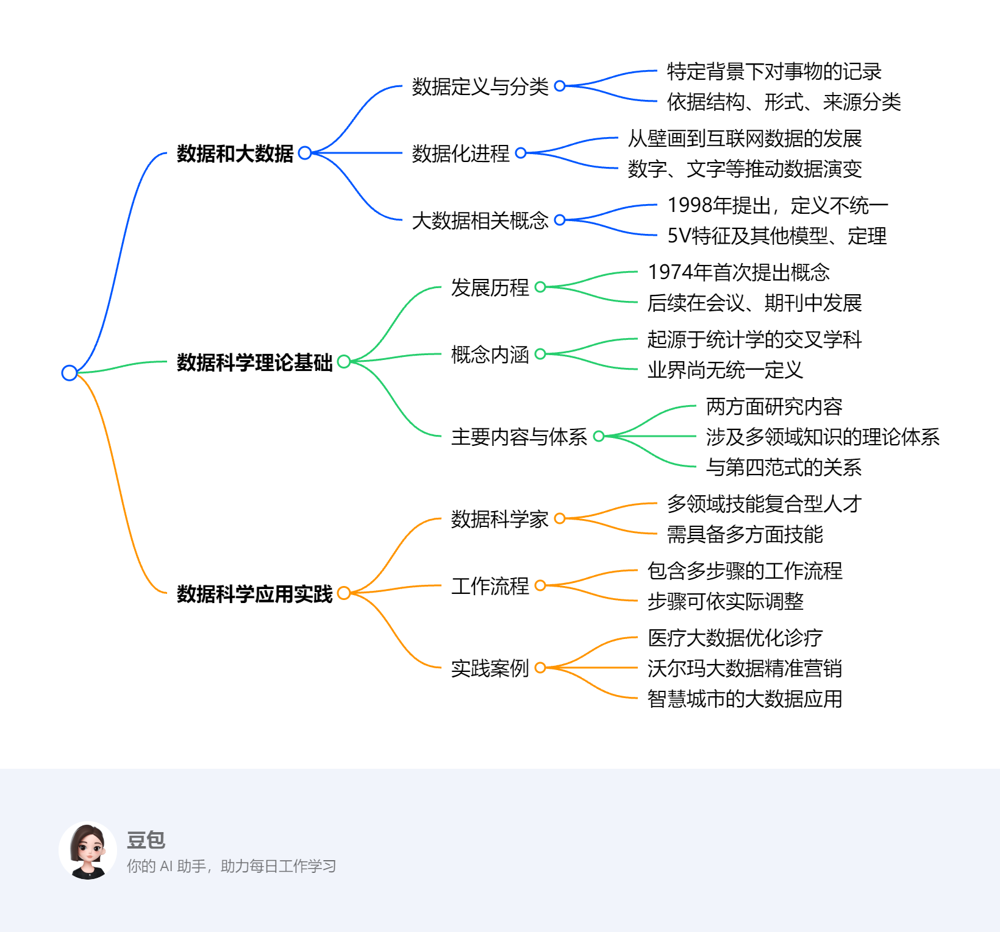

# 第一章：数据科学概论
第1章主要围绕数据科学的基础概念、理论和实践应用展开，具体内容如下：

1. **数据和大数据**
    - **数据**：是在一定背景下有意义的对现实世界事物定性或定量的记录，依据不同标准可分为结构化与非结构化数据等多种类型。DIKW模型阐述了数据、信息、知识和智慧的层级关系，数据科学旨在从数据中提炼有价值的信息和知识。
    - **数据化进程**：人类数据记录历史悠久，从旧石器时代的壁画到现代互联网数据，数据形式和体量不断变化。数字、文字、计算机和互联网的出现，推动了数据的发展，为数据科学奠定基础。
    - **大数据**：概念于1998年提出，目前尚无统一的定义。其具有多样性、大量性、高速性、价值性和真实性的5V特征，也可用5R模型、4P模型和HACE定理等描述。
2. **数据科学理论基础**
    - **发展历程**：1974年首次提出“数据科学”概念，之后在多个会议、期刊中被提及和探讨，近年来发展迅速。
    - **概念**：是一门起源于统计学的新兴交叉学科，结合多领域新技术，探索数据中的信息与知识，但目前业界尚无统一定义。
    - **主要内容**：包括用数据的方法研究科学和用科学的方法研究数据；理论体系涉及黑客技能、数学和统计学知识、实质性专业知识；它与第四范式共同构成大数据科学研究的理论基础。
3. **数据科学应用实践**
    - **数据科学家**：是具备多领域技能的复合型人才，能够发现问题、处理数据并解释数据背后的规律。其应具备数据分析、数学、统计学等多方面技能。
    - **工作流程**：包括提出问题、收集数据、处理和清洗数据、分析数据、数据可视化以及构建数据产品等步骤，各步骤可根据实际情况调整。
    - **实践案例**：医疗健康大数据通过分析医疗数据优化诊疗流程；沃尔玛利用社交大数据进行精准营销；智慧城市借助大数据实现智慧管理、出行、环境和生活服务等功能。 
