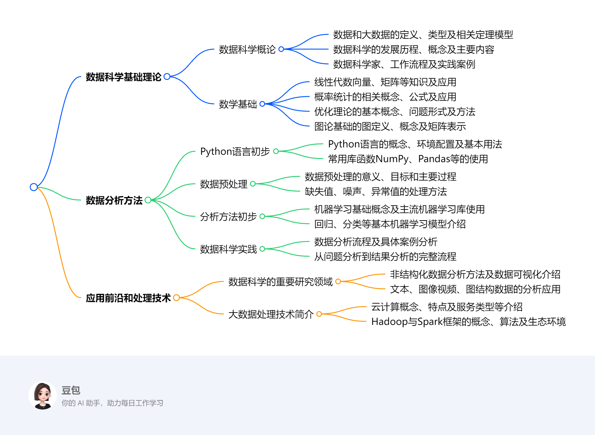

# 课程总览
数据科学导论课程旨在为数据科学与大数据及相关专业学生提供入门和导论性质的知识，帮助学生树立大数据意识，掌握数据科学的基本理论、方法和实践技能。课程主要涵盖数据科学的基本概念、数学基础、数据分析方法、应用前沿和处理技术等方面内容，具体课程结构如下：

1. **数据科学基础理论（第1 - 2章）**
    - **第1章 数据科学概论**：介绍数据科学的产生背景，包括数据和大数据的定义、类型、相关定理与模型等；阐述数据科学的理论基础，如发展历程、概念、主要内容；讲解数据科学家的概念、技能，数据科学工作流程以及实践案例，让学生对数据科学有整体的认识。
    - **第2章 数学基础**：介绍数据科学研究中广泛使用的数学工具，如线性代数、概率统计、优化理论和图论基础，并结合实例探讨它们的应用，为后续学习数据分析方法和处理技术打下数学基础。
2. **数据分析方法（第3 - 6章）**
    - **第3章 Python语言初步**：介绍Python语言的概念、环境配置、基本用法以及一些常用库函数，如NumPy、Pandas、SciPy、Matplotlib等，使学生能够使用Python进行数据处理和分析。
    - **第4章 数据预处理**：讲解数据预处理的意义、目标和主要过程，包括数据清洗、集成、变换、归约等方法，以及如何处理缺失值、噪声、异常值等问题，让学生掌握将原始数据转换为适合数据挖掘任务的干净数据的技能。
    - **第5章 分析方法初步**：介绍机器学习基础概念，如机器学习的定义、基本术语、模型评估与性能度量等；讲解主流的机器学习库Sklearn的基本使用方法；介绍回归、分类、聚类、神经网络、集成学习等基本机器学习模型，通过实例及代码演示，让学生掌握这些模型的应用。
    - **第6章 数据科学实践**：以实战案例系统总结前面章节的数据处理技术，介绍数据分析流程，包括数据挖掘目标、数据采样、数据预处理、数据探索、数据建模和数据分析工具等；通过Titanic生存预测、客户值分析、时间序列预测等具体案例，让学生从问题分析开始，掌握数据预处理、机器学习模型使用、结果分析等完整流程。
3. **应用前沿和处理技术（第7 - 8章）**
    - **第7章 数据科学的重要研究领域**：围绕非结构化数据，分别对文本数据、图像视频数据、图结构数据的分析与应用方法展开介绍；简要介绍数据可视化分析技术、应用场景、常用的可视化分析工具，让学生了解数据科学在不同领域的应用和发展。
    - **第8章 大数据处理技术简介**：介绍大数据处理的主流工具，如云计算的相关概念、特点、服务类型、部署方式；讲解计算平台的虚拟化技术、虚拟化产品及特点；介绍Hadoop与Spark这两个框架的基本概念、核心算法以及生态环境，并提供一个完整的搭建并使用Hadoop集群进行数据处理的应用案例，让学生掌握大数据处理的基本技术。 
