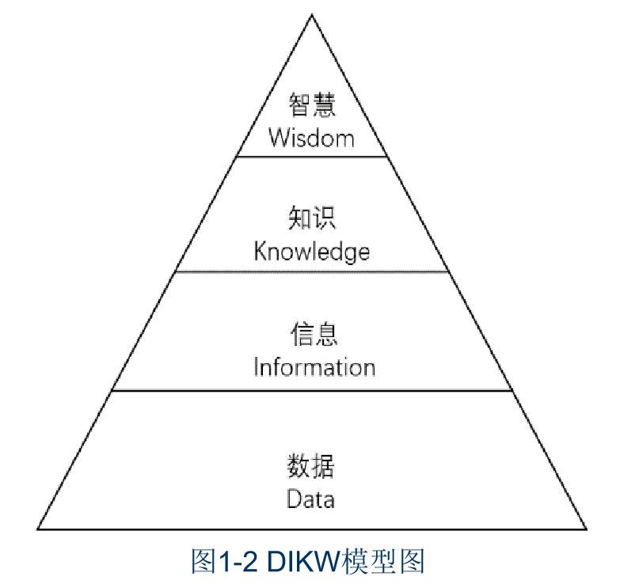
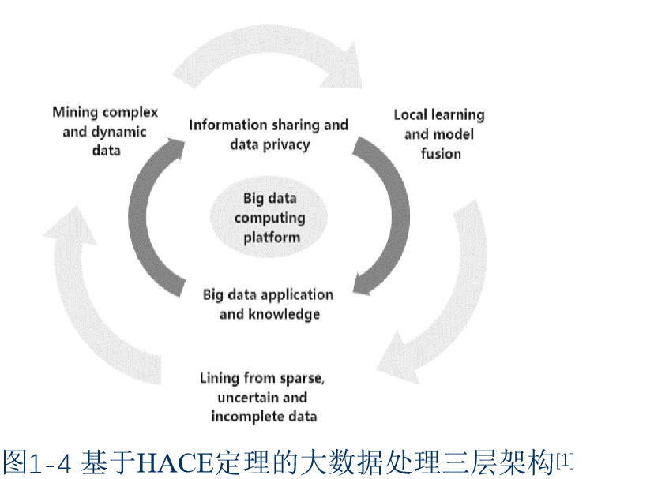
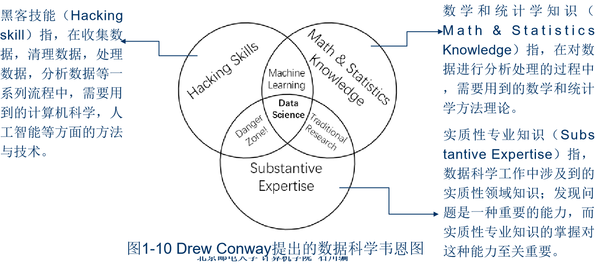
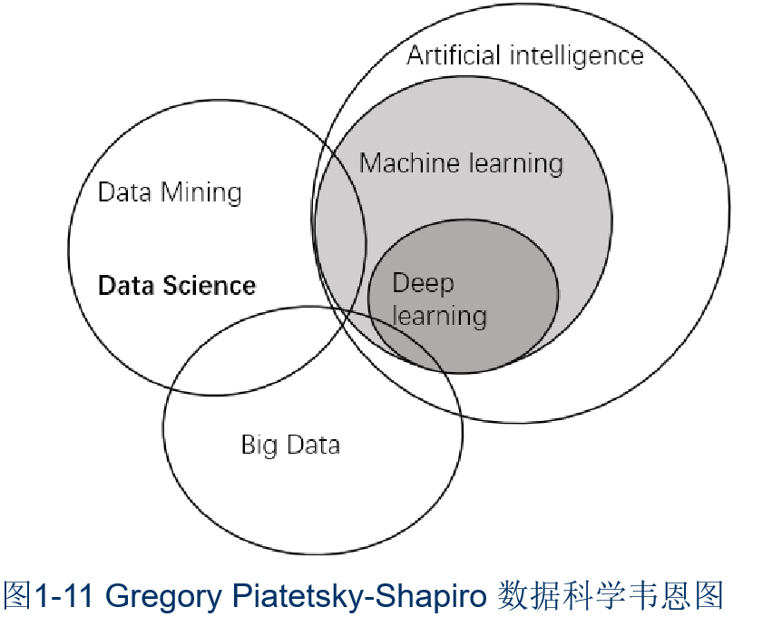
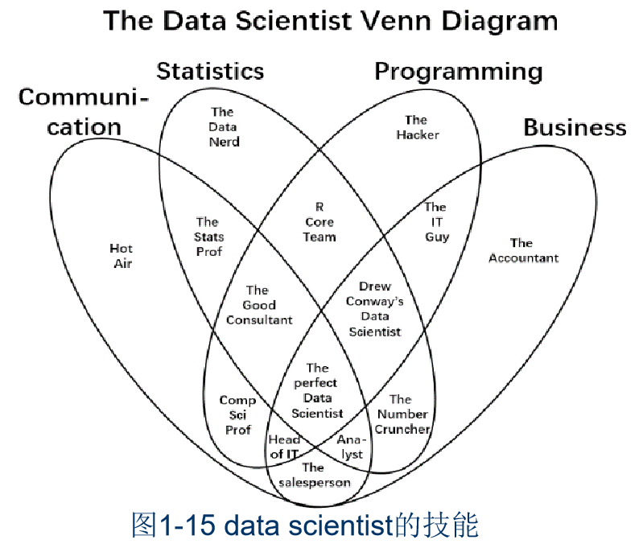
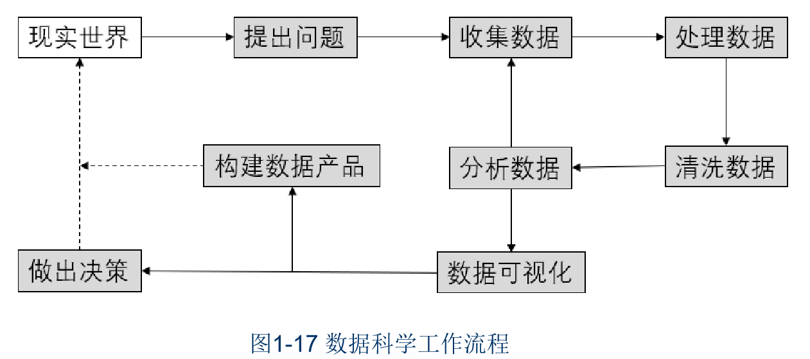

# 第一章: 数据科学概览
该文档是北京邮电大学石川教授关于“数据科学概论”课程的课件，主要介绍了数据科学相关知识，包括课程内容、数据和大数据的概念、数据科学的理论基础与应用实践，以及课程安排和要求。

1. **课程整体介绍**
    - **课程背景与定位**：数据蕴含价值，大数据时代数据量剧增，本课程作为导论课，衔接基础与专业课程，为后续学习奠基。
    - **课程目标**：助学生建立数据科学知识体系，掌握数据分析原理与初级实践，了解前沿技术。
    - **课程内容模块**：基础理论涵盖基本概念与数学知识；分析方法介绍常用数据分析手段；高级主题聚焦应用前沿与处理技术。
    - **先修与后续课程**：先修课程包括高等数学、线性代数等，后续课程有数据挖掘、机器学习等。
2. **数据和大数据详解**
    - **数据的定义与分类**：统计学、计算机科学、数据科学对数据定义不同。数据按结构、形式、来源可分为多种类型，不同分类服务于不同问题。
    - **数据化进程**：人类数据记录类型日益丰富，计算水平不断提高，推动了数据化的发展。
    - **大数据的概念与特性**：1998年首次提出，其定义强调规模超出处理能力。具有5V特征，还有5R、4P医疗模型、HACE定理等理论模型。
3. **数据科学理论基础剖析**
    - **发展历程**：1974年概念出现，之后在会议、期刊、研究机构等的推动下逐渐发展。
    - **概念内涵**：是融合多学科的新兴交叉学科，旨在探索数据中的信息与知识。
    - **主要内容**：研究各类数据，抽取出信息和知识；理论体系涉及黑客技能、数学统计知识、实质性专业知识等多领域知识。
4. **数据科学应用实践展示**
    - **数据科学家的角色**：定义随时间演变，需具备多种通用和技术技能。
    - **工作流程**：有完整流程，但可根据实际情况灵活调整。
    - **实践案例**：医疗健康大数据辅助诊疗；沃尔玛利用社交大数据精准推送；智慧城市融合多种技术实现智能服务。
5. **课程安排与要求说明**
    - **教材与参考资料**：以石川等人编写的教材为主，还有其他参考书籍辅助学习。
    - **教学内容与方式**：教学内容丰富，通过课堂讲授、作业、大作业等培养学生能力。
    - **考核方式**：考核包括期中期末考试、平时作业和大作业，按不同比例计入总成绩。 