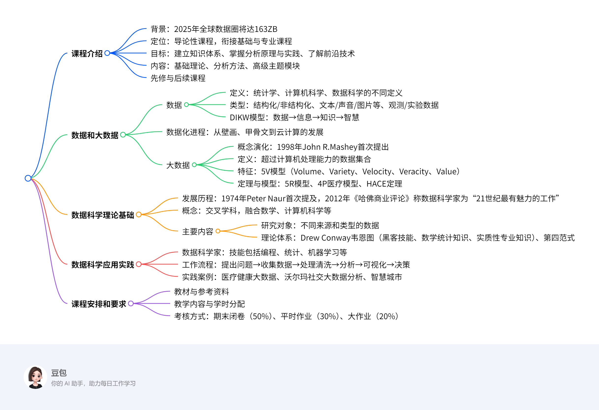

# 第一章: 数据科学概览
## 概览
---
### 一段话总结
北京邮电大学石川教授的《数据科学概论》课程围绕数据和大数据展开，介绍了数据的定义、类型及DIKW模型，数据化进程，大数据的概念、5V特征（大量性、多样性、高速性、真实性、价值性）及相关定理模型；阐述数据科学发展历程、概念及以数学与统计、黑客技能、实质性专业知识为核心的理论体系，还涉及数据科学家技能、工作流程及医疗健康、沃尔玛社交大数据分析、智慧城市等实践案例；课程安排包括教材、教学内容、以闭卷考试（50%）、平时作业（30%）和大作业（20%）为主的考核方式。

---
### 思维导图

---
### 详细总结
### 一、课程基本信息
1. **授课教师**：石川教授，研究方向包括数据挖掘、机器学习、人工智能等，创建图数据挖掘与机器学习实验室。
2. **课程定位**：导论性质课程，衔接基础课程与专业课程，包含理论知识和案例分析。
3. **课程目标**：建立数据科学知识体系，掌握数据分析原理与初级实践，了解前沿技术。
4. **课程内容模块**：
   - 基础理论模块：数据科学基本理论、数学基础。
   - 分析方法模块：Python语言、数据预处理、分析方法、实践。
   - 高级主题模块：应用前沿、云计算与大数据处理工具。
5. **先修课程**：高等数学、线性代数、概率论、数据结构等。
6. **后续课程**：数据挖掘、数据库、机器学习、深度学习等。

### 二、数据和大数据
1. **数据的定义**
   - 统计学：用于找出规律的变量观测值。
   - 计算机科学：能输入计算机处理的符号总称。
   - 数据科学：在一定背景下有意义的现实事物记录。
2. **数据类型**
   - 结构：结构化（数字、字符等）、非结构化（文字、图片等）。
   - 形式：文本、属性、声音、图片、视频数据。
   - 来源：观测数据、实验数据。
3. **DIKW模型**
   - 数据：原始、无组织的事实集合。
   - 信息：有组织的数据集合。
   - 知识：相关联的信息，融合经验。
   - 智慧：基于知识的解决问题能力。
4. **数据化进程**
   - 从旧石器时期的壁画、殷商甲骨文，到19世纪电子计算机、20世纪云计算技术的发展。
5. **大数据**
   - **概念演化**：1998年John R.Mashey首次提出，2011年Viktor Mayer-Schönberger因《大数据时代》让概念广为人知。
   - **定义**：超过计算机处理能力或传统工具处理能力的数据集合。
   - **5V特征**：
     |特征|描述|
     |----|----|
     |大量性（Volume）|数据量至少达P级（10³T）|
     |多样性（Variety）|种类和来源多样，包括结构化与非结构化数据|
     |高速性（Velocity）|数据增长快，处理速度要求高|
     |真实性（Veracity）|数据准确可信，反映事物本源|
     |价值性（Value）|价值密度低，但有重要价值|
   - **其他模型**：5R模型、4P医疗模型、HACE定理。

### 三、数据科学理论基础
1. **发展历程**
   - 1974年Peter Naur首次提及“数据科学”概念。
   - 2002年CODATA创立《Data Science Journal》。
   - 2012年《哈佛商业评论》称数据科学家为“21世纪最有魅力的工作”。
2. **概念**：起源于统计学，融合大数据、计算机科学、机器学习等的新兴交叉学科。
3. **主要内容**
   - **理论体系**：
     - Drew Conway韦恩图：黑客技能（数据处理技术）、数学和统计学知识、实质性专业知识。
     - 第四范式：数据密集型科学发现。

### 四、数据科学应用实践
1. **数据科学家**
   - 技能：通用技能（数据分析、机器学习等）、技术技能（Python、R、SQL等）。
2. **工作流程**：提出问题→收集数据→处理清洗→分析→构建数据产品→可视化→决策。
3. **实践案例**
   - 医疗健康大数据：引入人工智能，提升诊疗效率，减少开支。
   - 沃尔玛与社交大数据：通过挖掘Twitter、Facebook数据预测消费需求，精准推送。
   - 智慧城市：基于数字城市、物联网、云计算，实现对人和物的感知与智能服务。

### 五、课程安排与考核
1. **教材**：石川等《数据科学导论》。
2. **参考资料**：《数据科学导论：Python语言实现》《数据科学导论（第2版）》。
3. **教学方法**：每周1次3学时课堂讲授，6次课外实践作业，大作业以真实数据挖掘问题组队完成。
4. **考核方式**：期末闭卷考试（50%）、平时作业（30%）、大作业（20%）。

---
### 关键问题
1. **问题**：大数据的5V特征具体指什么？
   **答案**：大数据的5V特征包括大量性（Volume，数据量至少达P级）、多样性（Variety，种类和来源多样）、高速性（Velocity，数据增长和处理速度快）、真实性（Veracity，数据准确可信）、价值性（Value，价值密度低但有重要价值）。
2. **问题**：数据科学的理论体系由哪些部分构成？
   **答案**：数据科学的理论体系以Drew Conway的韦恩图为代表，包括黑客技能（数据收集、处理等计算机技术）、数学和统计学知识（分析数据的理论方法）、实质性专业知识（领域知识，用于发现问题）。
3. **问题**：该课程的考核方式及各部分占比如何？
   **答案**：课程考核包括期末闭卷考试（占50%）、平时作业（占30%）和大作业（占20%），大作业要求学生组成项目团队解决真实的数据挖掘问题。
## 知识总结
该文档是北京邮电大学石川教授关于“数据科学概论”课程的课件，主要介绍了数据科学相关知识，包括课程内容、数据和大数据的概念、数据科学的理论基础与应用实践，以及课程安排和要求。

1. **课程整体介绍**
    - **课程背景与定位**：数据蕴含价值，大数据时代数据量剧增，本课程作为导论课，衔接基础与专业课程，为后续学习奠基。
    - **课程目标**：助学生建立数据科学知识体系，掌握数据分析原理与初级实践，了解前沿技术。
    - **课程内容模块**：基础理论涵盖基本概念与数学知识；分析方法介绍常用数据分析手段；高级主题聚焦应用前沿与处理技术。
    - **先修与后续课程**：先修课程包括高等数学、线性代数等，后续课程有数据挖掘、机器学习等。
2. **数据和大数据详解**
    - **数据的定义与分类**：统计学、计算机科学、数据科学对数据定义不同。数据按结构、形式、来源可分为多种类型，不同分类服务于不同问题。
    - **数据化进程**：人类数据记录类型日益丰富，计算水平不断提高，推动了数据化的发展。
    - **大数据的概念与特性**：1998年首次提出，其定义强调规模超出处理能力。具有5V特征，还有5R、4P医疗模型、HACE定理等理论模型。
3. **数据科学理论基础剖析**
    - **发展历程**：1974年概念出现，之后在会议、期刊、研究机构等的推动下逐渐发展。
    - **概念内涵**：是融合多学科的新兴交叉学科，旨在探索数据中的信息与知识。
    - **主要内容**：研究各类数据，抽取出信息和知识；理论体系涉及黑客技能、数学统计知识、实质性专业知识等多领域知识。
4. **数据科学应用实践展示**
    - **数据科学家的角色**：定义随时间演变，需具备多种通用和技术技能。
    - **工作流程**：有完整流程，但可根据实际情况灵活调整。
    - **实践案例**：医疗健康大数据辅助诊疗；沃尔玛利用社交大数据精准推送；智慧城市融合多种技术实现智能服务。
5. **课程安排与要求说明**
    - **教材与参考资料**：以石川等人编写的教材为主，还有其他参考书籍辅助学习。
    - **教学内容与方式**：教学内容丰富，通过课堂讲授、作业、大作业等培养学生能力。
    - **考核方式**：考核包括期中期末考试、平时作业和大作业，按不同比例计入总成绩。 