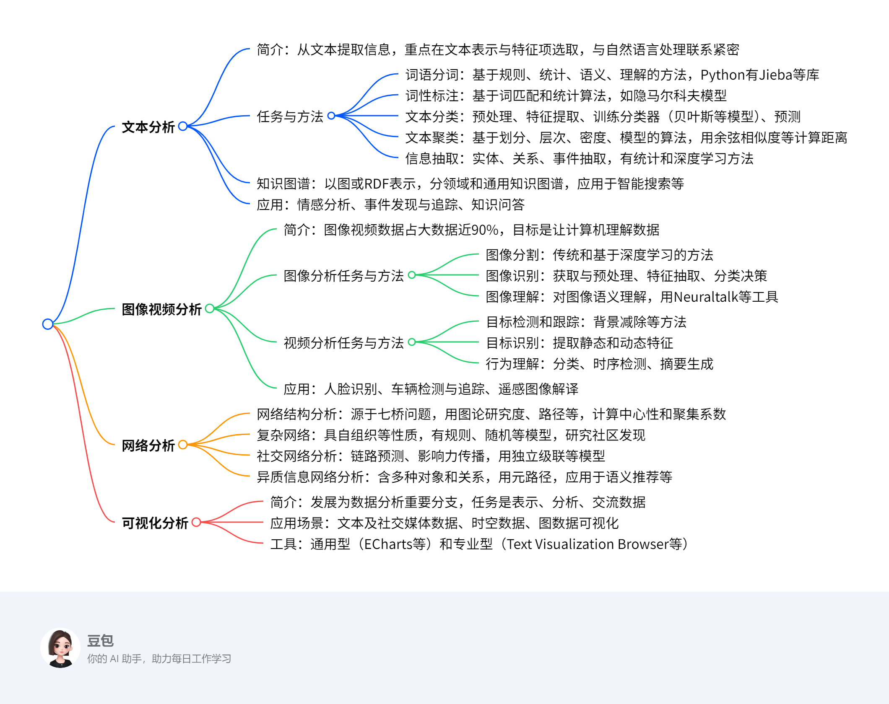

# 第七章：数据科学的重要研究领域
## 总览
---
### 一段话总结
文档围绕数据科学的重要研究领域展开，指出数据分为结构化、半结构化和非结构化三类，其中非结构化数据占比达80%，其处理需不同模式。重点介绍了文本分析（含分词、分类、信息抽取等任务及知识图谱应用）、图像视频分析（包括分割、识别、理解等任务及人脸识别等应用）、网络分析（涵盖结构分析、复杂网络、社交网络等分析）和可视化分析（涉及文本、时空、图数据可视化及ECharts等工具）四大领域的任务、方法及应用，展现了数据科学在多领域的重要价值与实践。

---
### 思维导图

---
### 详细总结
### 一、数据科学背景
- 数据分类：结构化数据、半结构化数据、非结构化数据，其中非结构化数据占比80%，其规模和复杂性不适用结构化数据的统一处理模式。
- 知识体系结构：涉及统计学、数据可视化等多领域，主要研究数据科学基础理论、数据预处理、数据分析与计算和数据管理等。

### 二、文本分析
#### （一）简介
- 也称文本挖掘，是从文本中提取信息的过程，重点在文本表示和特征项选取，与自然语言处理相互包含。
- 背景：80%的商业信息来自非结构化文本数据，目标是挖掘文本价值。

#### （二）任务与方法
|任务|方法|
|----|----|
|词语分词|基于规则（最大匹配法等）、统计（隐马尔科夫模型等）、语义、理解的算法，Python有Jieba、SnowNLP等库|
|词性标注|基于词匹配的字典查找算法和基于统计的隐马尔科夫模型等|
|文本分类|流程包括预处理（切分、分词、去停用词）、特征提取（词袋模型等）、训练分类器（贝叶斯等模型）、预测|
|文本聚类|流程有预处理、特征提取、聚类算法（k-means等）、调参，用余弦相似度等计算距离|
|信息抽取|实体抽取（统计和深度学习方法，如LSTM）、关系抽取（人工、有监督等方法）、事件抽取（模式匹配等方法）|

#### （三）知识图谱
- 起源于2012年Google发布的“Google Knowledge Graph”，有图网络和RDF两种表示形式。
- 类型：领域知识图谱（如医疗卫生领域SIDER）和通用知识图谱（如Cyc）。
- 应用：智能搜索、智能推荐、人机交互、数据分析与决策。

#### （四）应用
- 情感分析：抽取情感信息、分类、检索与归纳。
- 事件发现与追踪：切分信息内容、检测和追踪事件。
- 知识问答：分为一问一答等形式，有基于语义解析和搜索排序的方法。

### 三、图像视频分析
#### （一）简介
- 图像视频数据在大数据中占比接近90%，目标是让计算机从数据中提取特征理解世界，应用于公安、医疗等领域。

#### （二）图像分析任务与方法
- 图像分割：传统方法有基于阈值等，深度学习方法有基于特征编码等。
- 图像识别：流程包括获取与预处理、特征抽取（SIFT等）、分类决策（支持向量机等）。
- 图像理解：对图像语义理解，用Neuraltalk等工具描述图像。

#### （三）视频分析任务与方法
- 目标检测和跟踪：用背景减除、时间差分等方法。
- 目标识别：提取静态（借鉴图像特征）和动态特征（深度编码器等）。
- 行为理解：分类、时序检测、摘要生成。

#### （四）应用
- 人脸识别：利用唯一性等特点，流程包括采集、预处理、特征提取、识别。
- 车辆检测与追踪：检测识别车牌，用YOLO等算法追踪。
- 遥感图像解译：目视解译和计算机解译。

### 四、网络分析
#### （一）网络结构分析
- 源于1736年欧拉的七桥问题，网络由节点和边组成，用图论研究度、路径、中心性（度中心性等）、聚集系数等。

#### （二）复杂网络
- 定义：具有自组织等部分或全部性质的网络。
- 模型：规则、随机、小世界、无标度、自相似网络等。
- 社区发现：模块度衡量划分质量，算法有KL算法等。

#### （三）社交网络分析
- 链路预测：基于节点相似性、概率模型、似然函数的模型。
- 影响力传播：度量方法有度中心性等，模型有独立级联模型等，目标是最大化影响力。

#### （四）异质信息网络分析
- 定义：含多种类型对象或关系的有向图，用网络模式和元路径描述。
- 应用：语义推荐（如电影推荐）、套现用户检测。

### 五、可视化分析
#### （一）简介
- 最早诞生于17世纪，发展为数据分析重要分支，任务是表示、分析、交流数据。

#### （二）应用场景
- 文本及社交媒体数据：词云、树状图等可视化形式，分析用户行为和信息传播。
- 时空数据：如交通数据可视化，探索运行状况等。
- 图数据：边绑定和拓扑简化方法处理大规模网络。

#### （三）工具
|类型|工具|
|----|----|
|通用型|ECharts、PyeCharts、Matplotlib、Bokeh|
|专业型|Text Visualization Browser、Treevis、Gephi、Pajek、UCINET|

---
### 关键问题
#### （一）文本分析中信息抽取的主要任务有哪些？
信息抽取的主要任务包括实体抽取，即检测和分类实体；关系抽取，刻画命名实体间的关系，形成三元组；事件抽取，抽取事件实例、识别类型并抽取论元赋予角色。

#### （二）图像视频分析在实际生活中有哪些具体应用？
在实际生活中，图像视频分析有诸多应用。如人脸识别，可用于人脸搜索、聚类等；车辆检测与追踪，能实现车牌识别和特定对象追踪；遥感图像解译，可通过目视和计算机解译分析地物或现象。

#### （三）网络分析中的社区发现算法主要有哪些类型？
社区发现算法主要有全局方法，如KL算法、GN算法、谱聚类算法等；局部方法，包括基于局部模块度方法、R方法；随机游走方法，如随机游走、Markov链；模块度方法，像Newman算法、Louvain算法、谱方法；密度子图方法，例如Clique、Biclique、最密集子图等。
## 7.1 文本分析  
### 7.1.1 文本分析简介  
#### 定义与研究重点  
- **定义**：文本分析也称文本挖掘，是从文本中提取信息的过程，核心在于文本表示与特征项选取，通常通过对特征词量化实现文本表示。  
- **与自然语言处理的关系**：两者界限模糊，相互包含、影响，类似“数据挖掘”与“数据科学”的关系。  

#### 背景与意义  
- **背景**：80%的商业信息来自非结构化文本数据，如何挖掘文本价值是核心目标。  
- **意义**：在销售行业可分析用户评论优化产品；新闻行业可追踪事件；金融行业可实现客户分类；文学领域可发现写作风格。  

### 7.1.2 文本分析的任务与方法  
#### 词语分词  
- **任务**：将文本切分为单词，是文本分析的预处理步骤🔶1-65🔶。  
- **方法**：  
  - **基于规则**：如最大匹配法（从左到右查找词典中最长匹配词）、逆向最大匹配法。  
  - **基于统计**：隐马尔科夫模型（HMM）、最大熵模型等，通过概率统计建模分词。  
  - **基于语义**：特征词库法、邻接约束法，结合语义信息切分。  
  - **基于理解**：神经网络分词法、专家系统分词法，模拟人类语言理解。  
- **Python工具**：Jieba（支持三种分词模式及自定义词典）、SnowNLP（自带训练字典）、THULAC（中文文本挖掘专用）。  

**例子**：用Jieba分词“我爱自然语言处理”  
1. 导入Jieba库：`import jieba`  
2. 分词：`jieba.lcut("我爱自然语言处理")`  
3. 结果：`['我', '爱', '自然语言处理']`  

#### 词性标注  
- **任务**：为单词标注词性（如名词、动词），是文本处理的基础技术。  
- **方法**：  
  - **基于词匹配**：查词典标注词性，简单但无法解决一词多义。  
  - **基于统计**：隐马尔科夫模型（HMM），通过状态转移概率和输出概率建模。  
- **例子**：用HMM标注“我吃饭”的词性  
1. 状态集：{代词，动词，名词}  
2. 观测序列：我、吃、饭  
3. 计算状态转移概率（如代词→动词的概率）和输出概率（如“我”作为代词的概率）  
4. 用维特比算法求解最可能的词性序列：代词、动词、名词  

#### 文本分类  
- **任务**：将文档划分到预定义类别，如垃圾邮件识别、情感分析。  
- **流程**：  
  1. **预处理**：切分、分词、去停用词。  
  2. **特征提取**：词袋模型（统计词频）、词向量模型（如Word2Vec）。  
  3. **训练分类器**：贝叶斯模型、随机森林、支持向量机。  
- **例子**：用朴素贝叶斯分类垃圾邮件  
1. 预处理：将邮件分词并去停用词，如“促销”“打折”“立即购买”  
2. 特征提取：构建词袋向量，统计关键词出现频率  
3. 训练模型：计算垃圾邮件中各词的概率（如“促销”出现的概率）  
4. 预测：输入新邮件，计算属于垃圾邮件的概率，若超过阈值则判定为垃圾邮件  

#### 文本聚类  
- **任务**：将相似文档划分为簇，同一簇内相似度高，簇间相似度低。  
- **算法**：  
  - **基于划分**：k-means算法（指定簇数，迭代更新中心点）。  
  - **基于密度**：DBSCAN算法（基于密度识别簇）。  
- **距离计算**：余弦相似度（如向量夹角越小，相似度越高）。  
- **例子**：用k-means聚类新闻文档  
1. 预处理：提取文档关键词并向量化  
2. 设定k=3（簇数），随机初始化3个中心点  
3. 计算每个文档到中心点的余弦距离，分配到最近的簇  
4. 重新计算各簇中心点，迭代直至中心点稳定  

#### 信息抽取  
- **任务**：从文本中提取实体、关系、事件，形成结构化数据。  
- **子任务与方法**：  
  - **实体抽取**：命名实体识别（如人名、地名），方法包括基于统计的N-gram模型、基于深度学习的LSTM。  
  - **关系抽取**：刻画实体间关系（如三元组），方法有基于规则（人工定义“is-a”）、有监督（条件随机场）。  
  - **事件抽取**：提取事件类型、触发词、论元，如从“摄影师在Baghdad死亡”中抽取事件类型“死亡”，论元“摄影师”“Baghdad”。  

### 7.1.3 知识图谱与文本分析  
#### 知识图谱简介  
- **定义**：起源于Google 2012年发布的“Knowledge Graph”，以图网络（节点为实体，边为关系）或RDF三元组形式表示。  
- **类型**：  
  - **领域知识图谱**：如医疗卫生领域SIDER、影视领域IMDB。  
  - **通用知识图谱**：如Cyc、ConceptNet，包含海量常识知识。  

#### 应用  
- **智能搜索**：如Google搜索直接返回实体关系结果。  
- **智能推荐**：基于用户-物品关系网络推荐内容。  
- **例子**：菜品知识图谱中，“火锅”属于“菜系”，关联“烹饪方法”（炖、炸）和“食材”（牛肉、海鲜）。  

### 7.1.4 文本分析的应用  
#### 情感分析  
- **任务**：分析主观性文本的情感倾向，包括情感信息抽取（评价词、对象、观点持有者）、分类（正面/负面）、检索归纳。  
- **例子**：分析用户评论“这款手机屏幕清晰，但电池续航差”  
1. 抽取评价词：“清晰”（正面）、“差”（负面）  
2. 评价对象：“屏幕”“电池续航”  
3. 分类：整体情感倾向为中性（正面+负面）  

#### 事件发现与追踪  
- **任务**：切分新闻流数据、检测新事件、追踪事件发展，如“波音737事件”的热点主题演变分析。  

#### 知识问答  
- **形式**：一问一答、交互式问答、阅读理解。  
- **方法**：  
  - **基于语义解析**：将问句转为结构化查询（如“谁是爱因斯坦？”→查询“爱因斯坦”实体信息）。  
  - **基于搜索排序**：搜索候选答案并排序，如百度知道的问答匹配。
## 7.2 图像视频分析  
### 7.2.1 图像视频分析简介  
#### 背景与意义  
- **背景**：图像和视频数据占大数据总量的90%以上，蕴含丰富信息，目标是让计算机具备感知和理解视觉世界的能力。  
- **意义**：人类无法快速处理海量视觉数据，该技术广泛应用于公安（如人脸识别）、医疗（如医学影像诊断）、商业（如“淘立拍”商品识别）等领域。  

### 7.2.2 图像分析的任务与方法  
#### 图像分割  
- **任务**：将图像分解为物体和子区域，分为语义分割（标注像素类别）、实例分割（区分同类不同物体）、全景分割（兼顾前两者）。  
- **方法**：  
  - **传统方法**：  
    - **基于阈值**：按像素灰度值划分（如Otsu算法自动计算最佳阈值）。  
    - **基于边缘检测**：用Canny、Sobel算子提取物体边界。  
  - **深度学习方法**：  
    - **FCN（全卷积网络）**：通过反卷积层将特征图上采样为分割结果，适用于语义分割。  
    - **Mask R-CNN**：在目标检测基础上增加分割分支，实现实例分割。  
- **例子**：用FCN进行语义分割步骤：  
  1. 输入图像通过卷积层提取特征（如VGG16骨干网络）。  
  2. 特征图经反卷积层上采样至原图尺寸。  
  3. 每个像素输出类别概率，生成语义分割掩码（如区分“道路”“车辆”“行人”）。  

#### 图像识别  
- **任务**：对分割后的物体进行分类，流程包括图像获取、预处理、特征提取、分类决策。  
- **方法**：  
  - **特征提取**：  
    - **传统特征**：SIFT（尺度不变特征变换）、HOG（方向梯度直方图）。  
    - **深度学习特征**：用ResNet、DenseNet等卷积神经网络提取层次化特征。  
  - **分类算法**：支持向量机（SVM）、神经网络（如CNN）。  
- **例子**：用CNN识别手写数字（MNIST数据集）：  
  1. 输入28×28灰度图像，通过卷积层（如3×3卷积核）提取边缘特征。  
  2. 池化层降维，全连接层整合特征。  
  3. softmax层输出10个类别概率，取最大值作为识别结果（如数字“5”）。  

#### 图像理解  
- **任务**：对图像进行语义描述，如生成自然语言句子。  
- **方法**：基于深度学习的图像描述模型（如NeuralTalk、NeuralBabyTalk），结合CNN提取图像特征，RNN生成文本。  
- **例子**：NeuralBabyTalk描述图像“一个金发男孩穿蓝衬衫吃巧克力”：  
  1. CNN提取图像中“男孩”“衬衫”“巧克力”等物体特征。  
  2. RNN按顺序生成单词，通过注意力机制聚焦图像区域（如男孩的动作）。  
  3. 输出连贯句子，如“A young boy in blue shirt is eating chocolate”。  

### 7.2.3 视频分析的任务与方法  
#### 目标检测与跟踪  
- **任务**：从视频中分离目标并持续跟踪，如监控中的行人检测。  
- **方法**：  
  - **背景减除**：建立背景模型（如高斯混合模型），将当前帧与背景对比提取运动目标。  
  - **光流法**：基于像素运动向量估计目标位移，如Lucas-Kanade光流。  
- **例子**：用高斯混合模型检测运动车辆：  
  1. 初始化背景模型，统计像素值分布（如RGB三通道的高斯分布）。  
  2. 新帧到来时，计算像素与背景模型的匹配度，不匹配则标记为前景（车辆）。  
  3. 动态更新背景模型，适应光照变化。  

#### 目标识别  
- **任务**：分析视频中目标的类别，需结合时空特征。  
- **方法**：  
  - **静态特征**：沿用图像识别的CNN特征（如ResNet提取外观特征）。  
  - **动态特征**：用LSTM、3D CNN捕捉时间维度运动信息（如行人行走姿态）。  
- **例子**：用3D CNN识别视频中的“跑步”动作：  
  1. 输入连续视频帧（如16帧组成的视频片段）。  
  2. 3D卷积核同时处理空间（帧内）和时间（帧间）维度，提取运动特征。  
  3. 全连接层分类动作类别（如“跑步”“走路”）。  

#### 行为理解  
- **任务**：让计算机理解视频中的动态行为，如“开门”“喝水”。  
- **方法**：  
  - **时序行为检测**：定位视频中行为的开始和结束时间，并分类。  
  - **视频摘要生成**：提取关键帧或片段，压缩视频内容。  
- **例子**：时序行为检测流程（如“打电话”动作）：  
  1. 视频分帧，用I3D网络提取每帧特征。  
  2. 滑动窗口分析特征序列，预测每个窗口内的行为概率。  
  3. 结合CRF（条件随机场）优化时序连续性，输出“打电话”的起始和结束时间点。  

### 7.2.4 图像视频分析的应用  
#### 人脸识别  
- **特点**：唯一性、非接触性，流程包括图像采集、预处理、特征提取、匹配。  
- **方法**：  
  - **特征提取**：用FaceNet等模型生成128维人脸特征向量。  
  - **匹配**：计算特征向量的余弦相似度，阈值判断是否为同一人。  
- **例子**：门禁系统人脸识别步骤：  
  1. 摄像头采集人脸图像，对齐（如双眼定位）。  
  2. 预处理：灰度化、直方图均衡化，消除光照影响。  
  3. FaceNet提取特征向量，与数据库中注册的特征对比。  
  4. 相似度＞0.8则开门，否则拒绝。  

#### 车辆检测与追踪  
- **任务**：识别车牌并跟踪车辆，用于交通监控。  
- **方法**：  
  - **车牌识别**：YOLOv5检测车牌区域，OCR识别字符。  
  - **车辆追踪**：DeepSORT算法结合外观特征（如颜色、车型）和运动轨迹。  
- **例子**：高速路口车辆追踪：  
  1. YOLOv5实时检测过往车辆，定位车牌。  
  2. OCR识别车牌字符（如“京A12345”），记录时间戳。  
  3. DeepSORT通过车辆特征（如车身颜色、轴距）跟踪同一车辆，统计行驶轨迹。  

#### 遥感图像解译  
- **任务**：分析遥感图像中的地物（如农田、建筑），分为目视解译和计算机解译。  
- **方法**：  
  - **计算机解译**：用U-Net等语义分割模型识别地物类别。  
- **例子**：农田面积统计：  
  1. 输入高分遥感图像（分辨率1米）。  
  2. U-Net模型分割“农田”“建筑”“道路”等类别。  
  3. 统计农田类别像素数，乘以单像素面积（1m×1m），得到农田总面积。
## 7.3 网络分析  
### 7.3.1 网络结构分析  
#### 基本概念与图论基础  
- **起源**：最早源于1736年欧拉解决的七桥问题，网络由节点（实体）和边（关系）组成。  
- **核心概念**：  
  - **度**：无向图中节点的边数，有向图中入度与出度之和。  
  - **路径与平均路径长度**：两节点间最短路径的平均值，反映网络“紧密度”。  
  - **网络密度**：实际连接数与可能连接数的比值，公式为 \(d(g) = \frac{|E|}{C_{n}^{2}}\)。  

#### 节点中心性度量  
- **度中心性**：衡量节点的连接影响力，公式为 \(C_D = \frac{Degree(v)}{n-1}\)，节点度越高，传播信息能力越强。  
- **紧密中心性**：关注节点到其他节点的平均距离，公式为 \(C_C = \frac{\sum_{t \in V \backslash v} d_p(v,t)}{n-1}\)，距离越小，节点越接近网络中心。  
- **中介中心性**：计算节点在最短路径中的参与度，公式为 \(C_B = \frac{\sum_{j \neq k \neq v} \frac{|d_p^v(j,k)|}{d_p(j,k)}}{C_{n-1}^{2}}\)，值越高，节点在信息传递中越关键。  

#### 聚集系数  
- **全局聚集系数**：衡量网络中“三角形”结构的比例，公式为 \(\frac{闭三元组数量}{闭三元组数量+开三元组数量}\)。  
- **局部聚集系数**：节点邻居形成完全图的紧密程度，无向图公式为 \(C_i = \frac{2|e_{jk}|}{k_i(k_i-1)}\)，有向图为 \(C_i = \frac{|e_{jk}|}{k_i(k_i-1)}\)。  

#### 例子：无向图G的指标计算  
- **图结构**：11个节点，13条边，以节点v7为例：  
  1. **度中心性**：\(Degree(v7)=3\)，\(C_D=3/(11-1)=0.3\)。  
  2. **紧密中心性**：计算v7到其他10个节点的最短路径之和为19，\(C_C=19/(11-1)=1.9\)。  
  3. **中介中心性**：经过v7的最短路径数为33，\(C_B=33/C_{10}^{2}≈0.73\)。  
  4. **网络密度**：\(d(g)=13/C_{11}^{2}=13/55\)。  
  5. **全局聚集系数**：闭三元组9个，开三元组10个，\(C=9/(9+10)≈0.526\)。  

### 7.3.2 复杂网络  
#### 定义与特性  
- **定义**：钱学森提出，指具有自组织、小世界、无标度等部分或全部性质的网络。  
- **核心特性**：  
  - **小世界特性**：节点间平均路径长度短（如社交网络中“六度分隔”）。  
  - **无标度特性**：节点度分布服从幂律分布，少数节点（枢纽节点）拥有大量连接。  

#### 网络模型  
- **规则网络**：节点连接遵循固定模式，如全局耦合、最近邻耦合、星型耦合。  
- **小世界网络**：WS模型（随机重连边）和NW模型（保留全局连接），兼具短路径和高聚集性。  
- **无标度网络**：BA模型通过“优先连接”机制生成，如互联网、社交网络。  

#### 社区发现  
- **模块度**：衡量社区划分质量，公式为 \(Q = \frac{1}{2m}\sum_{ij}[A_{ij} - \frac{k_i k_j}{2m}]\delta(C_i,C_j)\)，Q越接近1，划分质量越高。  
- **算法**：  
  - **全局方法**：KL算法、谱二分算法（基于图的特征分解）。  
  - **局部方法**：Louvain算法（迭代合并节点提升模块度）、基于密度的方法。  

#### 例子：Louvain算法社区发现  
1. **初始化**：每个节点为独立社区。  
2. **局部优化**：遍历每个节点，计算其加入邻居社区后模块度的增益，选择增益最大的社区合并。  
3. **层次构建**：将社区视为新节点，构建新网络，重复步骤2直至模块度不再提升。  
4. **输出**：最终的社区划分结果。  

### 7.3.3 社交网络分析  
#### 链路预测  
- **定义**：预测网络中未连接节点间产生链接的可能性。  
- **方法**：  
  - **基于节点相似性**：  
    - **共同邻居**：节点u和v的共同邻居数越多，越可能连接。  
    - **Jaccard系数**：\(sim(u,v) = \frac{|N(u)∩N(v)|}{|N(u)∪N(v)|}\)。  
  - **基于概率模型**：贝叶斯网络、马尔科夫模型，建模节点连接的概率分布。  

#### 影响力传播  
- **影响力度量**：沿用度中心性、紧密中心性、中介中心性指标。  
- **传播模型**：  
  - **独立级联模型（ICM）**：初始激活节点以固定概率激活邻居，如病毒传播。  
  - **线性阈值模型（LTM）**：节点有阈值，当激活邻居数超过阈值时被激活。  
- **影响力最大化**：寻找k个种子节点使传播范围最大，如独立级联模型下用贪心算法迭代选择节点。  

#### 例子：ICM模型传播模拟  
1. **网络结构**：节点A、B、C，A与B、C相连，B与C相连。  
2. **初始激活**：激活节点A，传播概率p=0.5。  
3. **第一轮传播**：A尝试激活B（成功概率0.5）和C（成功概率0.5）。  
4. **第二轮传播**：若B被激活，尝试激活C（概率0.5）。  
5. **最终结果**：可能的激活节点集合为{A}、{A,B}、{A,C}、{A,B,C}，依概率分布。  

### 7.3.4 异质信息网络分析  
#### 基本概念  
- **定义**：包含多种节点和关系类型的有向图，如科研文献网络（作者、论文、会议）。  
- **核心概念**：  
  - **网络模式**：定义节点和关系类型的元图，如“作者-发表-论文”。  
  - **元路径**：连接两类节点的路径，如“作者→论文→会议→论文→作者”（APA），表示同会议作者关系。  

#### 应用实例  
- **语义推荐**：基于元路径挖掘用户与物品的关联，如电影推荐中通过“用户-观看-电影-导演-电影”路径推荐同导演作品。  
- **套现用户检测**：构建用户-商家-设备异质网络，用层次注意力机制学习节点表示，识别异常交互模式。  

#### 例子：科研文献异质网络中的元路径  
- **元路径定义**：作者→论文→会议（APC），表示作者在某会议发表论文。  
- **应用场景**：  
  1. **相似作者发现**：通过APC路径，找到与目标作者同领域会议的其他作者。  
  2. **论文推荐**：根据“作者-论文-关键词-论文”路径，推荐含相似关键词的论文。  
- **步骤**：  
  1. 构建异质网络，节点类型为作者、论文、会议、关键词。  
  2. 提取元路径APC，计算作者间的路径相似度（如共现次数）。  
  3. 按相似度排序，推荐相似作者及其论文。
## 7.4 可视化分析  
### 7.4.1 可视化分析简介  
#### 定义与发展  
- **起源**：最早可追溯至17世纪，20世纪经历了多维信息可视编码、交互可视化等阶段，如今成为数据分析的核心分支。  
- **定义**：利用人眼感知能力将数据转化为图形、颜色等易感知形式，以增强认知的技术，基本任务包括**表示数据、分析数据、交流数据**。  

#### 技术定位  
- 中国“新一代人工智能”和“大数据”专项将其列为关键共性技术，用于处理复杂、海量数据的可视化表达。  

### 7.4.2 可视化分析应用场景  
#### 文本及社交媒体数据可视化  
- **简单文本可视化**：  
  - **词云（Word Cloud）**：按词频大小调整字体尺寸，直观展示文本关键词，如用Python的Wordcloud库生成“人工智能”相关词云。  
  - **文档信息卡（Document Cards）**：将文档摘要、关键词等信息整合为卡片式布局，便于批量浏览。  
- **社交媒体数据可视化**：  
  - **传播分析**：用折线图展示热点事件热度随时间变化，如2019年“高以翔事件”的舆论热度走势（横轴时间，纵轴热度，不同颜色区分事件）。  
  - **工具实例**：知微大数据的“传播分析”系统，通过节点链接图展示信息传播路径。  

#### 时空数据可视化  
- **地理信息与交通数据**：  
  - **交通拥堵可视化**：用热力图表示道路拥堵程度（红色为严重拥堵，绿色为畅通），结合时间维度展示拥堵演变。  
  - **案例步骤**：  
    1. 采集路段历史速度、流量数据。  
    2. 用颜色映射（如HSL模型）将速度转换为可视化编码（低速→红色，高速→绿色）。  
    3. 叠加时间轴滑块，支持交互式查询不同时段的拥堵情况。  

#### 图数据可视化  
- **大规模网络简化方法**：  
  - **边绑定**：将走向相似的边聚集成束，减少视觉混乱，如社交网络中好友关系的边绑定效果。  
  - **拓扑简化**：通过层次聚类将大规模图转化为树结构，如ASK-Graphview工具对1600万条边的图进行分层可视化。  
- **应用实例**：科研合作网络可视化，用节点大小表示论文数量，边粗细表示合作频次，通过边绑定展示核心研究者的合作关系网。  

### 7.4.3 可视化分析工具  
#### 通用型可视化工具  
- **ECharts**：  
  - **特点**：基于JavaScript的开源库，支持折线图、热力图、关系图等，可高度定制交互效果。  
  - **例子**：绘制“高度与气温关系图”：  
    1. 准备数据：`x = [-80, -60, ..., 20]`（温度），`y = [80, 70, ..., 0]`（高度）。  
    2. 配置option对象，设置x轴、y轴类型及图表标题。  
    3. 调用`echarts.init()`初始化容器，`setOption()`渲染图表。  
- **PyeCharts**：Python与ECharts的接口库，支持在Python中生成交互式图表，如动态柱状图。  
- **Matplotlib**：Python基础绘图库，适合学术图表绘制，如绘制散点图展示数据分布。  

#### 专业型可视化工具  
- **Text Visualization Browser**：  
  - **功能**：专注文本数据可视化，支持折线图、节点链接图等，数据来源包括社交媒体、专利等。  
  - **使用场景**：分析科技文献关键词频次，用时间线折线图展示“人工智能”一词近十年出现频率。  
- **Gephi**：  
  - **定位**：开源网络可视化软件，支持力导向布局（如ForceAtlas2）、社区发现，适合社交网络分析。  
  - **步骤**：  
    1. 导入网络数据（.gdf或.csv格式）。  
    2. 应用ForceAtlas2布局算法，调整节点排斥力和吸引力。  
    3. 按社区颜色编码，可视化不同研究领域的科研合作网络。  
- **UCINET**：集成网络分析工具，结合NetDraw绘制三维网络图形，支持中心性计算与可视化同步展示。  

### 关键方法与案例总结  
| 应用场景       | 核心方法                     | 例子步骤                                                                 |
|----------------|------------------------------|--------------------------------------------------------------------------|
| 文本可视化     | 词云、文档卡片               | 1. 提取文本关键词及词频；2. 设置Wordcloud参数（字体、颜色）；3. 生成词云图 |
| 时空数据可视化 | 热力图、时空立方体           | 1. 处理GPS轨迹数据；2. 按时间-空间维度映射颜色；3. 动态展示轨迹密度       |
| 图数据可视化   | 边绑定、层次聚类             | 1. 导入大规模图数据；2. 应用边绑定算法聚集相似边；3. 分层展示网络结构     |
| 工具实践       | ECharts绘制关系图            | 1. 构建节点-边数据；2. 配置关系图布局（如力导向）；3. 渲染交互效果         |