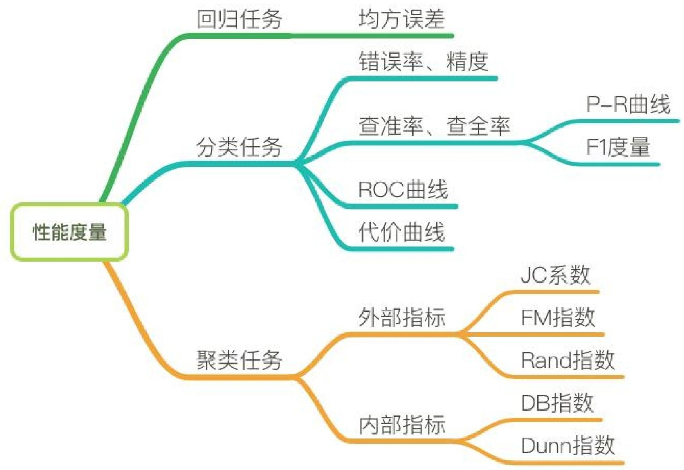

# 第五章：分析方法初步
---
### 一段话总结
这两篇文档围绕机器学习展开，**介绍了机器学习的基础概念、常用库Sklearn的使用，以及回归、分类、聚类等分析方法**。机器学习是人工智能核心，通过数据和经验优化程序性能，有监督学习和无监督学习等类型。Sklearn库支持多种机器学习方法，包含丰富数据集。回归分析用于解释变量关系和预测数值，分类是为样本分配类别标签，聚类旨在发现数据规律。这些知识为深入学习机器学习和数据分析提供了基础。

---
### 详细总结
- **《第五章：分析方法初步1.pdf》**
    1. **机器学习基础**：机器学习是多领域交叉学科，通过数据和经验优化程序性能，目的是分类和预测。介绍了数据集、训练、预测等基本术语，以及留出法、交叉验证法等模型评估方法，还阐述了从20世纪50年代至今的发展历程。
    2. **Sklearn库基本使用**：Sklearn是面向Python的机器学习软件包，支持多种有监督和无监督学习方法。安装需满足一定Python、Numpy和Scipy版本要求。使用流程包括获取数据（如Iris、Boston等数据集）、数据预处理、数据集拆分、定义模型、模型预测与评估、模型保存。
- **《第五章：分析方法初步2.pdf》**
    1. **回归**：回归分析用于解释变量间关系，分为线性回归、Logistic回归等。**线性回归**假设变量呈线性关系，通过最小二乘法确定参数，可用于预测数值，如Boston房价预测。**Logistic回归**基于逻辑函数解决因变量离散问题，用最大似然法确定参数，用于分类。此外还有岭回归、Lasso回归、树回归等其他回归模型。
    2. **分类**：分类是为新样本分配类别标签的学习方法，应用广泛。介绍了决策树、K - 近邻算法、朴素贝叶斯、支持向量机等分类方法的原理、优缺点及Sklearn实现方式。如决策树通过特征选择、生成和剪枝构建模型；K - 近邻算法根据数据相似性分类。
    3. **聚类**：聚类将相似对象分组，目的是发现规律。介绍了基于原型、密度、层次的聚类方法。**K均值聚类**是原型聚类的一种，通过寻找质心聚类；**DBSCAN**是密度聚类算法，基于密度完成聚类；**AGENS**是层次聚类算法，采用自底向上合并簇。
---
|分析方法|目的|主要算法|关键特点|Sklearn实现示例|
|---|---|---|---|---|
|回归|解释变量关系、预测数值|线性回归、Logistic回归等|线性回归假设线性关系，Logistic回归处理离散因变量|线性回归用于Boston房价预测，Logistic回归用于鸢尾花数据集分类|
|分类|为样本分配类别标签|决策树、K - 近邻算法等|决策树直观，K - 近邻算法简单无需训练|决策树、K - 近邻算法等用于鸢尾花数据集分类|
|聚类|发现数据规律，将相似对象分组|K均值聚类、DBSCAN、AGENS等|K均值聚类简单快速，DBSCAN无需预设簇个数，AGENS形成树形结构|K均值聚类、DBSCAN、AGENS用于鸢尾花数据集聚类|
---
### 关键问题
1. **回归和分类的主要区别是什么？**
    - 回归主要预测连续值，如房价、股票走势等；分类预测离散值，为样本分配类别标签，如垃圾邮件识别、手写数字识别。回归分析变量间的数值关系，通过拟合曲线预测；分类基于训练集学习分类规则。例如线性回归预测数值，决策树进行分类。
2. **Sklearn库在机器学习中的优势有哪些？**
    - Sklearn库支持多种主流机器学习方法，涵盖有监督和无监督学习。它包含大量优质数据集，方便进行模型训练和实践。其接口相似，便于快速熟悉和使用不同模型。例如在构建回归、分类和聚类模型时，都有统一的使用流程和相似的接口函数。
3. **K均值聚类和DBSCAN聚类的适用场景有何不同？**
    - K均值聚类适用于簇接近高斯分布、数据量较大且事先能大致估计簇个数的场景，因为它需要事先设定K值，对初始聚类中心敏感。DBSCAN聚类适用于稠密的非凸数据集，能发现任意形状的簇，且无需事先设定簇个数，但对高维数据处理效果不佳，参数调节复杂。如在分析客户消费习惯数据时，若数据分布近似高斯，可考虑K均值聚类；若数据分布不规则，DBSCAN聚类可能更合适。
## 5.1 机器学习基础
### 5.1.1何为机器学习
该节主要围绕机器学习的定义、目的、基本过程和应用领域展开，具体内容如下：
1. **定义**：机器学习是一门多领域交叉学科，涉及概率论、统计学等多门学科，致力于通过数据和以往经验，利用学习算法优化计算机程序性能，最终产生模型。假设T代表任务，P代表任务T的性能，E代表经验，机器学习就是利用E提高T的性能P。
2. **目的**：实现分类和预测。分类是依据输入数据（特征向量）判别其所属类别；预测是根据输入数据计算一个输出数值。
3. **基本过程**：使用包含输入数据和预期输出（分类或数值）的训练数据来训练模型，之后利用训练好的模型对新的实例数据进行分类和预测。
4. **应用领域**
    - **数据挖掘**：从大量数据中搜索隐藏信息，用于数据统计分析、趋势预测、异常检测等。
    - **计算机视觉**：对图片或视频进行处理，获取被拍摄对象的数据和信息，应用于医学图像处理、导弹制导、无人驾驶等领域。
    - **自然语言处理**：实现人与计算机通过自然语言有效通信，用于文本分类与聚类、信息检索和过滤、机器翻译等。
    - **生物特征识别**：利用人体生理或行为特征进行个人身份鉴定，如人脸识别、指纹识别等。 
### 5.1.2 机器学习基本术语
该节主要介绍了机器学习的基本术语，帮助读者更好地理解机器学习的概念和流程，具体内容如下：
1. **机器学习算法概述**：机器学习是一类从大量历史数据中挖掘隐含规律，以对新数据进行预测或分类的算法总称。在机器学习中，经验通常以数据形式存在，通过学习算法对数据进行学习，最终获取模型。
2. **数据集相关术语**
    - **数据集**：是一组记录的集合，其中每条记录是一个示例或样本。样本包含属性（特征）及属性值 ，属性张成的空间为属性空间，示例也可称为特征向量。
    - **训练与标记**：从数据中学得模型的过程叫训练，训练过程中使用的样本叫训练样本，其组成的数据集为训练集。训练模型是为了预测数据的潜在规律，这不仅需要训练样本的数据信息，还需要示例结果的信息，即标记。通常用$(x_{i}, y_{i})$表示第i个样例，其中$y_{i}$是示例$x_{i}$的标记 ，Y是所有标记的集合。
3. **学习任务分类**
    - **预测类型**：根据预测结果，学习任务分为分类（预测离散值）和回归（预测连续值） 。聚类则是将训练集样本分为若干组，每个组是一个簇，其划分策略在学习过程中生成，且不需要标记信息。
    - **学习方式**：按照训练数据有无标记信息，学习任务分为监督学习（分类和回归是代表）和无监督学习（聚类是代表）。
4. **模型评估相关术语**
    - **模型评估方法**：用于划分数据集为训练集和测试集，常见方法有留出法（将数据集划分为两个互斥集合，划分时需保持数据分布一致性）、交叉验证法（如k折交叉验证，k最常用值为10；留一法是其特例，评估结果准确但计算开销大）和自助法（有放回抽样，可减少因训练数据集不同导致的估计偏差）。
    - **性能度量**：分类任务的性能度量包括混淆矩阵（呈现算法性能可视化效果，包含真正、假正、假负、真负等概念）、准确率、精确率、召回率、F1度量、ROC曲线、AUC等；回归任务的性能度量有平均绝对误差、均方误差、均方根误差、决定系数（$R^{2}$）、校正决定系数（Adjusted $R^{2}$） ；聚类任务的性能度量分外部指标（如Jaccard系数、FM指数、Rand指数 ，与参考模型比较）和内部指标（如DB指数、Dunn指数，直接考察聚类结果）。 

|采样方法|与原始训练数据集的分布是否相同|相比原始训练数据集的容量|是否适用小数据集|是否适用大数据集|是否存在估计偏差|
|---|---|---|---|---|---|
|留出法|否|变小|否|是|是|
|交叉验证法|否|变小|否|是|是|
|自助法|否|不变|是|否|是| 

#### 分类性能度量
**分类性能度量 - 混淆矩阵**
- **定义**：混淆矩阵是一种特定的矩阵，用于呈现算法性能的可视化效果。在混淆矩阵中，每一列代表预测值，每一行代表实际的类别。
- **矩阵元素含义**：
    - **真正（True Positive，TP）**：被模型预测为正的正样本。
    - **假正（False Positive，FP）**：被模型预测为正的负样本。
    - **假负（False Negative，FN）**：被模型预测为负的正样本。
    - **真负（True Negative，TN）**：被模型预测为负的负样本。 

|真实数据|预测结果|  |
|----|----|----|
| |正样本|负样本|
|正样本|TP|FN|
|负样本|FP|TN| 

1. **混淆矩阵**
    - **定义**：一种用于呈现算法性能可视化效果的特定矩阵，每一列代表预测值，每一行代表实际类别。
    - **矩阵元素**：
        - **真正（TP）**：被模型预测为正的正样本。
        - **假正（FP）**：被模型预测为正的负样本。
        - **假负（FN）**：被模型预测为负的正样本。
        - **真负（TN）**：被模型预测为负的负样本。
2. **准确率（Accuracy）**
    - **定义**：所有被分类正确的点在所有点中的概率。
    - **公式**：$Accuracy = \frac{TP + TN}{TP + FN + FP + TN}$
3. **精确率（Precision）**
    - **定义**：针对预测正确的正样本，即预测出是正的里面真为正的概率，可理解为查准率。
    - **公式**：$Precision = \frac{TP}{TP + FP}$
4. **召回率（Recall）**
    - **定义**：正确预测的正例数与实际正例总数的比值，也称查全率。
    - **公式**：$Recall = \frac{TP}{TP + FN}$
5. **F1 score**
    - **定义**：精确率和召回率的调和值。
    - **公式**：$\frac{2}{F1} = \frac{1}{Precision} + \frac{1}{Recall}$，$F1 = \frac{2×Precision×Recall}{Precision + Recall}$。精确率和召回率越接近，F1值越大。
6. **ROC曲线**
    - **坐标轴定义**：ROC空间以伪阳性率（FPR）为X轴，真阳性率（TPR）为Y轴。
    - **指标定义**：
        - **真阳性率（TPR）**：在所有实际为阳性的样本中，被正确地判断为阳性的比率，$TPR = \frac{TP}{TP + FN}$。
        - **伪阳性率（FPR）**：在所有实际为阴性的样本中，被错误地判断为阳性的比率，$FPR = \frac{FP}{FP + TN}$。
    - **曲线意义**：从(0, 0)到(1, 1)的对角线将ROC空间划分为左上、右下两个区域，线上方的点代表较好的分类结果（胜过随机分类）。
7. **AUC**
    - **定义**：AUC（Area Under Curve）为ROC曲线下的面积（ROC的积分），通常取值范围在大于0.5小于1之间。随机挑选一个正样本和一个负样本，分类器判定正样本的值高于负样本的概率就是AUC值。
    - **性能判断**：
        - **AUC = 1**：完美分类器，采用这个预测模型时，存在至少一个阈值能得出完美预测。
        - **0.5 < AUC < 1**：优于随机猜测。若分类器（模型）妥善设定阈值，能有预测价值。
        - **AUC = 0.5**：跟随机猜测一样（如丢硬币），模型没有预测价值。
        - **AUC < 0.5**：比随机猜测还差；但只要总是反预测而行，就优于随机猜测。 
#### 回归性能度量指标整理
1. **平均绝对误差（MAE）**
    - **公式**：$MAE=\frac{\sum_{i = 1}^{n}|y_{i}-\hat{y_{i}}|}{n}$，其中$\hat{y}_{i}=f(x_{i})$。
    - **含义**：又被称为L1范数损失，表示预测值与观察值之间绝对误差的平均值。
2. **均方误差（MSE）**
    - **公式**：$MSE=\frac{\sum_{i = 1}^{n}(y_{i}-\hat{y_{i}})^{2}}{n}$。
    - **含义**：又被称为L2范数损失，表示预测值与观察值之间误差平方的平均值。
3. **均方根误差（RMSE）**
    - **公式**：$RMSE = \sqrt{MSE}$。
4. **决定系数（$R^{2}$，R-Square）**
    - **公式**：$R^{2}=1-\frac{\sum_{i}(\hat{y_{i}} - y_{i})^{2}}{\sum_{i}(\overline{y_{i}} - y_{i})^{2}}$，分母为标签Y的方差，分子为MSE。
    - **含义及评价标准**：取值范围为[0,1] 。$R^{2}$值越大，模型拟合效果越好；若为0，拟合效果差；若为1，拟合曲线无错误。
    - **缺点**：样本数量增加时，$R^{2}$值会增加，无法定量说明准确程度。
5. **校正决定系数（Adjusted $R^{2}$，Adjusted R-Square）**
    - **公式**：$Adjusted R^{2}=1-\frac{(1 - R^{2})(n - 1)}{n - p - 1}$，其中n为样本数量，p为特征数量。
    - **含义及优势**：抵消了样本数量对$R^{2}$的影响，可以定量说明模型的准确程度。 
#### 聚类性能度量
聚类性能度量，又称聚类有效性指标，用于评估聚类结果的优劣。好的聚类结果应具备簇内相似度高、簇间相似度低的特点。其度量指标主要分为外部指标和内部指标两类：
1. **外部指标**
    - **比较方式**：将聚类结果与 “参考模型”（如领域专家的划分结果）相比较，默认参考模型的划分是最优的，目的是使聚类结果尽可能接近参考模型。
    - **核心思想**：聚类结果中被划分在同一簇的样本，与参考模型中也被划分到同一簇的样本的配对概率越高，聚类效果越好。
    - **常用指标**
        - **Jaccard系数（JC）**：$JC = \frac{a}{a + b + c}$
        - **FM指数（FMI）**：$FMI = \sqrt{\frac{a}{a + b} \cdot \frac{a}{a + c}}$
        - **Rand指数（RI）**：$RI = \frac{2(a + d)}{n(n - 1)}$
        - **指标取值范围及意义**：以上指标取值均在[0,1]区间内，值越大代表聚类效果越好。其中，对于给定数据集$D = \{x_{1}, x_{2}, x_{3}, \cdots, x_{n}\}$ ，经过聚类算法划分的簇为$C = \{C_{1}, C_{2}, \cdots, C_{k}\}$ ，参考模型给出的簇划分为$C^{*} = \{C_{1}^{*}, C_{2}^{*}, \cdots, C_{s}^{*}\}$ 。令$l$与$l^{*}$分别表示数据在$C$与$C^{*}$中的簇标记向量，将样本两两配对考虑：
            - $a = |SS|$，$SS = \{(x_{i}, x_{j}) | l_{i} = l_{j}, l_{i}^{*} = l_{j}^{*}, i < j\}$
            - $b = |SD|$，$SD = \{(x_{i}, x_{j}) | l_{i} = l_{j}, l_{i}^{*} \neq l_{j}^{*}, i < j\}$
            - $c = |DS|$，$DS = \{(x_{i}, x_{j}) | l_{i} \neq l_{j}, l_{i}^{*} = l_{j}^{*}, i < j\}$
            - $d = |DD|$，$DD = \{(x_{i}, x_{j}) | l_{i} \neq l_{j}, l_{i}^{*} \neq l_{j}^{*}, i < j\}$
            - 集合$SS$包含在$C$中隶属相同簇并且在$C^{*}$中也隶属相同簇的样本对，且$a + b + c + d = \frac{n(n - 1)}{2}$。
2. **内部指标**
    - **评估方式**：直接考察聚类结果，不依赖参考模型，通过计算簇内样本间的距离以及簇间样本的距离来评估模型性能。
    - **核心思想**：用簇内样本间距离模拟簇内相似度，簇间样本距离模拟簇间相似度，以此构建性能指标。
    - **常用指标**
        - **DB指数（DBI）**：$DBI = \frac{1}{k}\sum_{i = 1}^{k}\max_{j \neq i}(\frac{avg(C_{i}) + avg(C_{j})}{d_{cen}(C_{i}, C_{j})})$，其中$avg(C)=\frac{2}{|C|(|C| - 1)}\sum_{1 \leq i < j \leq |C|}dist(x_{i}, x_{j})$，表示簇内样本间的平均距离；$diam(C)=\max_{1 \leq i < j \leq |C|}dist(x_{i}, x_{j})$，表示簇内样本间的最远距离；$d_{min}(C_{i}, C_{j})=\min_{x_{i} \in C_{i}, x_{j} \in C_{j}}dist(x_{i}, x_{j})$，表示两簇间样本的最近距离；$d_{cen}(C_{i}, C_{j}) = dist(u_{i}, u_{j})$，$u$代表簇$C$的中心点，$u = \frac{1}{|C|}\sum_{1 \leq i \leq |C|}x_{i}$ 。DBI值越小越好。
        - **Dunn指数（DI）**：$DI = \min_{1 \leq i \leq k}\{\min_{j \neq i}(\frac{d_{min}(C_{i}, C_{j})}{\max_{1 \leq x \leq k}diam(C_{x})})\}$ ，DI值越大越好。 
### 5.1.3 发展历程
该节主要介绍了机器学习在人工智能发展历程中的重要阶段及成果，具体如下：
1. **第一阶段（20世纪50年代初 - 60年代初：推理期）**：此阶段人工智能研究认为赋予机器逻辑推理能力就能使其拥有智能。1952年，IBM科学家亚瑟·塞缪尔研制出西洋跳棋程序，开创了人工智能下棋问题的先河。同时，基于贝叶斯决策理论的贝叶斯分类器起步，通过计算后验概率实现数据分类任务。1957年，罗森·布拉特提出感知机，成功处理线性分类问题，为如今的神经网络和深度学习奠定了基础。
2. **第二阶段（20世纪60年代中叶 - 70年代初：冷静时期）**：人们发现仅有逻辑推理能力无法让机器拥有智能。不过，基于逻辑表示的“符号主义”学习技术在此期间蓬勃发展，出现了如P. Winston的结构学习系统、R. S. Michalski的基于逻辑的归纳学习系统以及E. B. Hunt的概念学习系统等。同时，诞生了许多机器学习算法，例如1967年的最近邻算法，它基于模板匹配思想进行分类，简单却有效，至今仍在使用；同年提出的k均值算法是聚类算法中变种和改进型最多的算法，应用广泛。
3. **第三阶段（20世纪70年代中叶 - 80年代初：知识期）**：这一时期人们意识到要让机器拥有智能，必须使其具备知识。大量专家系统问世，并在多个应用领域取得成果。机器学习的研究在全球兴起，1980年，卡内基梅隆大学召开了第一届机器学习国际研讨会。1981年，多层感知器在伟博斯的神经网络反向传播（BP）算法中被具体提出，BP算法至今仍是神经网络架构的关键因素。
4. **第四阶段（20世纪80年代中期 - 现在：学习期）**：由于专家系统在知识总结方面面临困难，机器学习正式登上人工智能舞台。八十年代中期到九十年代中期，机器学习成为独立学科领域，多种技术百花齐放。
    - 基于神经网络的连接主义学习成果丰硕，1986年诞生了真正意义上用于训练多层神经网络的反向传播算法，为神经网络的完善和应用奠定基础；1989年，LeCun设计出第一个真正意义上的卷积神经网络，用于手写数字识别，是如今广泛使用的深度卷积神经网络的鼻祖。
    - 基于逻辑学习的符号主义学习也有重要成果，1986年昆兰提出ID3决策树算法，该算法简单且可解释性强，在一些问题上至今仍被使用。
    - 二十世纪九十年代中期，统计学习迅速发展，以支持向量机（SVM）技术为代表的机器学习算法出现。SVM由瓦普尼克和科尔特斯提出，将机器学习社区划分为神经网络社区和支持向量机社区。同一时期，AdaBoost代表的集成学习算法出现，它通过集成简单的弱分类器，能达到惊人的精度。
    - 二十一世纪初至今，随着大数据时代的到来，数据量增大和计算机计算能力增强，深度学习时代开启。2006年，Hinton提出神经网络Deep Learning算法，大大提高了神经网络的能力，引发了深度学习在学术界和工业界的浪潮。 
## 5.2 Sklearn库基本使用
该节主要围绕Scikit-learn（Sklearn）库展开，介绍了其基本使用方法，涵盖库的简介、安装要求、使用流程等内容，具体如下：
1. **Sklearn库简介**
    - **功能**：Sklearn是面向Python的机器学习软件包，支持主流的有监督机器学习方法（如通用线性模型、支持向量机等）和无监督机器学习方法（如聚类、主成份分析等） 。
    - **安装要求与方式**：安装需Python >= 3.5、Numpy >= 1.11.0、Scipy >= 0.17.0 ，若使用Python2.7可采用Scikit-learn0.20版本。安装方式有Pip命令（pip install –u scikit-learn ）和Conda命令（conda install scikit-learn ）。
    - **官方文档**：包括英文文档（https://scikit-learn.org/stable/ ）和中文文档（https://sklearn.apachecn.org/ ），方便用户查阅学习。
2. **基本使用介绍**
    - **使用流程**：传统机器学习任务使用Sklearn库的一般流程为获取数据、数据预处理、训练模型、模型预测与评估、保存模型。
        - **获取数据**：Sklearn包含大量优质数据集，如用于分类的鸢尾花数据集、用于回归的波士顿房价数据集等。可直接导入使用小数据集，大数据集首次使用时会自动下载。还能利用其提供的函数创建各种类型的人工数据集，如回归、分类、聚类问题的样本生成器。
        - **数据预处理**：涉及标准化（如StandardScaler、MinMaxScaler等方法）、非线性变换（如QuantileTransformer）、归一化（normalize函数、Normalizer类）、二值化（Binarizer类）、One-hot编码（OneHotEncoder类）等操作，可根据数据特点和模型需求选择合适的方法对数据进行处理，提升模型性能。
        - **数据集拆分**：常用train_test_split函数从样本中随机按比例选取训练集和测试集，有助于模型参数的选取，使模型更具泛化能力。
        - **定义模型**：Sklearn提供多种模型，如线性回归（LinearRegression）、逻辑回归（LogisticRegression）、朴素贝叶斯（naive_bayes）、决策树（tree）、支持向量机（SVC）、K近邻算法（neighbors）、神经网络（neural_network）等，可根据具体任务选择合适的模型进行训练和预测 。
        - **模型预测与评估**：以支持向量机为例，通过fit方法拟合模型，predict方法进行预测，get_params方法获取模型参数，score方法评估模型得分。还可使用交叉验证（如cross_val_score函数）进一步评估模型性能，cv参数决定交叉验证的数据划分方式，当cv为整数时采用K折交叉验证方法。
        - **模型保存**：可使用Pickle方法（通过pickle.dump和pickle.load函数）或Joblib方法（通过joblib.dump和joblib.load函数）保存和加载模型，方便后续使用，避免重复训练。 
## 5.3 回归
该内容主要介绍了回归分析的基本概念、分类方式，以及重点讲解的两种回归模型，具体如下：

1. **回归分析的目的**：解释一组自变量对因变量结果的影响，因变量的结果依赖于自变量。比如研究房屋数量、距离市中心距离等自变量对住房均价这个因变量的影响。
2. **回归分析的分类**
    - **按涉及变量多少分类**：分为一元回归（涉及一个自变量）和多元回归（涉及多个自变量 ）。
    - **按自变量多少分类**：简单回归分析（自变量较少）和多重回归分析（自变量较多）。
    - **按自变量与因变量关系分类**：线性回归分析（自变量与因变量呈线性关系）和非线性回归分析（自变量与因变量呈非线性关系）。
3. **重点讲解的回归模型**：本小节着重介绍运用广泛的线性回归和Logistic回归，线性回归用于数值预测，Logistic回归用于分类分析。 
### 5.3.1 线性回归
该部分内容围绕线性回归展开，从理论到实践，全面介绍了线性回归的基本概念、原理、求解过程以及在Sklearn库中的实现，具体内容如下：
1. **线性回归基础概念**：线性回归是预测分析中历史悠久且常用的技术，用于对若干输入变量（自变量）与一个连续的结果变量（因变量）之间的线性关系进行建模，以基于自变量数值解释并预测因变量，在众多领域有广泛应用，例如Boston房价预测，将房屋数量、距离市中心距离等作为自变量，住房均价作为因变量。
2. **线性回归模型表达式**
    - **一般形式**：\(f(x_{i}) = b + w_{1}x_{i1} + w_{2}x_{i2} + \cdots + w_{d}x_{id}\)，其中\(x_{i}\)是包含多个特征的输入向量，\(w\)表示各属性对预测结果的重要性，\(b\)为常数项。向量形式为\(f(x_{i}) = w^{T}x_{i} + b\) ，这种形式更简洁，便于理解和计算。
    - **一元线性回归**：当输入属性只有一个时，模型为\(f(x_{i}) = wx_{i} + b\)，目标是使\(f(x_{i})\)尽可能接近真实的\(y_{i}\) ，通过最小化均方误差\(MSE=\frac{\sum_{i = 1}^{n}(y_{i}-\widehat{y_{i}})^{2}}{n}\)（\(\widehat{y_{i}} = f(x_{i})\)）来确定\(w\)和\(b\) ，这一过程称为最小二乘“参数估计”。
3. **线性回归求解过程**：通过对均方误差关于\(w\)和\(b\)求偏导，并令偏导数为零，得到\(w\)和\(b\)的最优解公式。在多元线性回归中，将\(b\)视为\(w_{0}\) ，\(x_{0}\)恒为1，把数据集表示为矩阵形式，利用最小二乘法对参数向量\(\widehat{w}=(w ; b)\)进行估计，通过对误差函数求导得到\(\widehat{w} = (X^{T}X)^{-1}X^{T}y\)。
4. **Sklearn实现线性回归**：利用Python的Sklearn库构建多元线性回归模型，步骤包括获取Boston数据集，导入`LinearRegression`模型并使用`cross_val_predict`进行十折交叉验证获取预测结果，最后用`matplotlib`绘制预测值与真实值的散点图以评估模型性能。代码实现展示了具体的操作过程，有助于理解和实践。 
### 5.3.2 Logistic回归
该部分聚焦Logistic回归，涵盖其原理、求解、Sklearn实现及代码示例，为理解和应用该模型提供了全面指导。
1. **Logistic回归原理**：是解决因变量离散问题的回归方法，基于逻辑函数\(f(z)=\frac{e^{z}}{1 + e^{z}}\)（\(-\infty<z<+\infty\)），其值在\(0 - 1\)之间，可表示特定结果的概率。令\(z_{i}=w_{1}x_{i1}+w_{2}x_{i2}+\cdots +w_{d}x_{id}+b\) ，事件发生概率\(p_{i}(x_{i1},x_{i2},\cdots,x_{i d}) = f(z_{i})=\frac{e^{z_{i}}}{1 + e^{z_{i}}}\) 。这里\(f(z)\)代表因变量（通常取\(0\)或\(1\)），\(z\)是中间结果。当\(p_{\theta}(x_{i})<0.5\)（即\(z_{i}<0\)）时，预测\(y_{i}=0\) ；当\(p_{\theta}(x_{i})>0.5\)（即\(z_{i}>0\)）时，预测\(y_{i}=1\) 。
2. **确定模型参数w**：线性回归因变量连续，可用均方误差（MSE）定义损失函数。但Logistic回归因变量离散，需用最大似然法推导损失函数。假设样本输出为\(0\)或\(1\)两类，可得\(P(y = 1|x,\theta)=p_{\theta}(x)\) ，\(P(y = 0|x,\theta)=1 - p_{\theta}(x)\) ，进而得到\(P(y|x,\theta)=p_{\theta}(x)^{y}(1 - p_{\theta}(x))^{1 - y}\)（\(y = 0,1\)）。通过最大化似然函数\(L(\theta)=\prod_{i = 1}^{n}P(y_{i}|x_{i},\theta)\)求解模型系数\(\theta\) ，对似然函数对数化取反得到损失函数\(J(\theta)\) ，再利用梯度下降法迭代更新\(\theta\) ，公式为\(\theta=\theta-\alpha X^{T}(p_{\theta}(X)-Y)\)（\(\alpha\)为步长） 。
3. **Sklearn实现Logistic回归**：以鸢尾花数据集为例，在Sklearn库中，利用`linear_model`模块的`LogisticRegression`构建模型。步骤包括：从`datasets`导入鸢尾花数据集；用`train_test_split`划分数据集为训练集和测试集，用`fit`训练模型，`predict`获取预测结果；计算训练集和测试集的准确率评估模型性能。代码示例展示了具体实现过程，运行结果显示训练集准确率为\(0.981\) ，测试集准确率为\(0.978\) 。 
### 5.3.3 其他回归模型
该部分内容介绍了树回归的产生背景、原理和代表算法，具体内容如下：
1. **树回归产生背景**：简单线性回归在处理数据特征众多且关系复杂的情况时，构建全局模型难度大，因为现实中许多问题是非线性的，无法用全局线性模型拟合所有数据。比如分析大量复杂的经济数据，包含多种经济指标及其相互关系，简单线性回归难以准确建模。
2. **树回归原理**：树回归结合树结构与回归技术，把数据集切分成多个易于建模的部分，针对每个部分运用线性回归进行建模。如果首次切分后，数据仍难以用线性模型拟合，就继续切分。这种方式可以更好地适应复杂数据的特点，逐步对数据进行细化处理，提高模型的拟合效果。
3. **代表算法**：CART（Classification And Regression Trees，回归分类树）是树回归的代表性算法，它既能够应用于分类任务，也可以用于回归任务，是一种实用性很强的算法。在实际应用中，CART算法能够根据数据的特征和规律，自动构建合适的树结构，实现对数据的有效分类或回归预测 。 
## 5.4 分类
### 5.4.1 决策树
以“是否买电脑”数据集为例，计算ID3决策树中特征“age”的信息增益，详细计算过程如下：
1. **计算数据集的熵 \(H(D)\)**：数据集中关于是否购买电脑的结果里，有9个yes，5个no，总样本数为14。根据熵的计算公式\(H(D)=-\sum p_{k}log_{2}(p_{k})\) ，其中\(p_{k}\)是类别\(k\)出现的概率。购买电脑为yes的概率\(p_{yes}=\frac{9}{14}\) ，为no的概率\(p_{no}=\frac{5}{14}\) ，则：
\[\begin{align*}
H(D)&=-\frac{9}{14}log_{2}(\frac{9}{14})-\frac{5}{14}log_{2}(\frac{5}{14})\\
&\approx -0.646 - (-0.294)\\
&=0.94 \text{ bits}
\end{align*}\]
2. **计算条件熵 \(H(D|A)\)**：以“age”特征为例，“age”有“youth”“middle_aged”“senior”三个取值。当“age”为“youth”时，有2个no，3个yes；当“age”为“middle_aged”时，有4个yes；当“age”为“senior”时，有3个yes，2个no。根据条件熵计算公式\(H(D|A)=\sum p_{k}H(D | A=x_{k})\) ，先分别计算各取值下的熵：
    - “youth”时：\(H(D | age=youth)=-\frac{2}{5}log_{2}(\frac{2}{5})-\frac{3}{5}log_{2}(\frac{3}{5})\approx0.971\)
    - “middle_aged”时：\(H(D | age=middle_aged)=-\frac{4}{4}log_{2}(\frac{4}{4}) = 0\)
    - “senior”时：\(H(D | age=senior)=-\frac{3}{5}log_{2}(\frac{3}{5})-\frac{2}{5}log_{2}(\frac{2}{5})\approx0.971\)
  再计算条件熵：
  \[\begin{align*}
  H(D|A)&=\frac{5}{14}H(D | age=youth)+\frac{4}{14}H(D | age=middle_aged)+\frac{5}{14}H(D | age=senior)\\
  &=\frac{5}{14}\times0.971+\frac{4}{14}\times0+\frac{5}{14}\times0.971\\
  &\approx0.694 \text{ bits}
  \end{align*}\]
3. **计算信息增益 \(gain(A)\)**：根据信息增益公式\(gain(A)=H(D)-H(D | A)\) ，可得：
\(gain(A)=0.94 - 0.694 = 0.246 \text{ bits}\)

按照相同方法计算特征“income”“student”“credit_rating”的信息增益，对比后发现“age”的信息增益最大，所以选择“age”作为最具决定性的特征来划分数据集 。 

该部分围绕决策树展开，涵盖其概念、工作原理、特征选择、生成算法、剪枝操作、算法优缺点及Sklearn实现，具体内容如下：
1. **决策树的概念**：决策树又称分类树，其模型形状类似带有决策的流程图。内部节点记录待检测属性，叶节点记录决策结果，每个内部节点将数据分为若干子集，从一组无次序、无规则的元组中推理出分类规则，采用自顶向下递归方式进行属性值比较和分支。
2. **工作原理**：在数据集划分时，寻找起决定性作用的特征，按照该特征将原始数据集划分为多个子集。建模是迭代递归过程，从根节点开始分枝，由数据决定算法停止条件。通常先生成最大树，再通过剪枝处理得到最终模型，构造过程分为特征选择、决策树生成和决策树剪枝三个部分。
3. **特征选择**：选择有决定性作用的特征进行分类，通过信息增益、信息增益率和基尼指数等准则确定。信息增益是划分数据集前后信息的变化，信息增益越高，特征越具决定性，如ID3算法以此为属性划分标准；C4.5算法采用信息增益率，以减小对取值数目较多属性的偏好；CART决策树用基尼指数，其值越小，数据集纯度越高。
4. **决策树生成**：以ID3决策树为例，若数据集中子项属于同一分类，则返回类标签；否则计算信息增益确定最好特征，划分数据集并创建分支节点，对每个节点递归调用生成过程。如以是否买电脑数据集为例，先计算各特征信息增益，确定age为最佳划分特征，再对各子集继续划分，直至算法停止。CART决策树则假设为二叉树，通过递归二分特征构建，分类树用基尼指数最小化准则，回归树用平方误差最小化准则。
5. **决策树剪枝**：不处理生成的决策树易出现过拟合，导致测试集表现不佳。剪枝可减少过拟合，提高泛化能力。预剪枝在构造树时停止信息量少的分枝；后剪枝先生成树再剪枝，后剪枝决策树保留更多分支，欠拟合风险小，但训练时间开销大。
6. **算法优缺点**：优点是模型直观，便于理解，数据准备工作少，对缺失值和离群点不敏感，能处理非线性关系；缺点是缺少合适剪枝策略易过拟合。
7. **Sklearn实现**：以鸢尾花数据集为例，从Sklearn库的`datasets`导入数据集，在`tree`模块选择`DecisionTreeClassifier`模型，用`train_test_split`划分数据集，`fit`方法训练，`predict`方法返回预测结果，最后计算训练集和测试集准确率评估模型性能。 