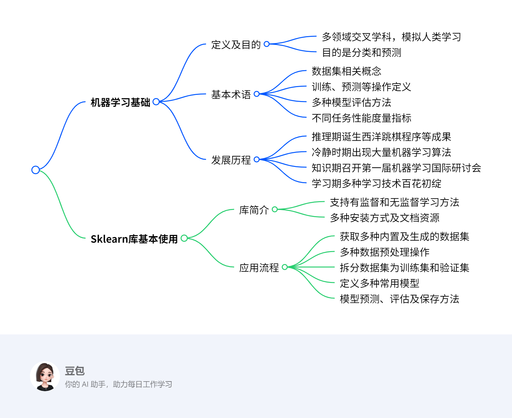
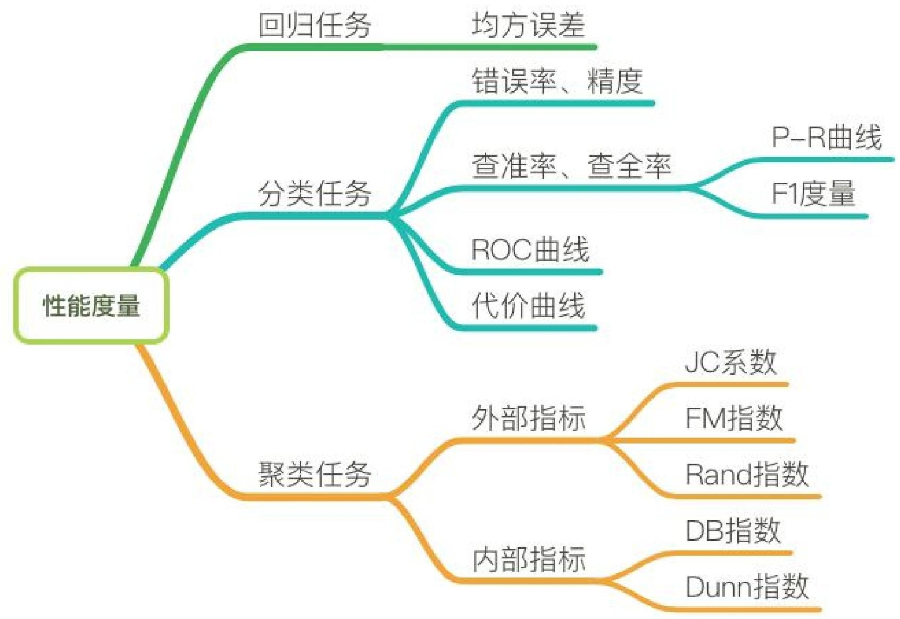

# 第五章：分析方法初步1
## 总览
---
### 一段话总结
本文主要介绍机器学习相关知识，**机器学习是多领域交叉学科，通过数据和经验优化程序性能，目的是分类和预测，基本术语包括数据集、训练、预测等，有多种模型评估方法和性能度量指标**。它历经推理期、冷静时期、知识期和学习期多个发展阶段。同时介绍了Scikit-learn库，其支持多种机器学习方法，使用流程包括获取数据、数据预处理、数据集拆分、定义模型、模型预测与评估和模型保存。

---

---
### 详细总结
1. **机器学习基础**
    - **定义与目的**：机器学习是一门多领域交叉学科，涉及概率论、统计学等多门学科，旨在模拟或实现人类学习行为，通过数据和经验优化计算机程序性能，其目的为分类和预测。
    - **基本术语**
        - **数据集相关**：数据集是记录集合，包含示例（样本），样本由属性（特征）描述，属性张成属性空间，示例也叫特征向量。
        - **训练与预测**：从数据中学得模型的过程为训练，训练需训练样本和标记信息；预测分为分类（预测离散值）、回归（预测连续值）和聚类（无标记信息分组），分类和回归属于监督学习，聚类属于无监督学习。
        - **模型评估**：常见方法有留出法（如将数据集按70%和30%划分为训练集和测试集，采用分层抽样保证数据分布一致）、交叉验证法（如k折交叉验证，k常用10；特例留一法，评估准确但计算开销大）和自助法（有放回抽样，约36.8%样本未出现在采样数据集，可作测试集）。
        - **性能度量**：分类任务有混淆矩阵（包含真正、假正、假负、真负概念）、准确率、精确率、召回率、F1 score、ROC曲线、AUC等指标；回归任务有平均绝对误差、均方误差、均方根误差、决定系数（$R^{2}$）、校正决定系数（Adjusted $R^{2}$）；聚类任务有外部指标（如Jaccard系数、FM指数、Rand指数）和内部指标（如DB指数、Dunn指数）。
    - **发展历程**：历经推理期（如1952年西洋跳棋程序、1957年感知机）、冷静时期（出现最近邻算法、k均值算法）、知识期（1980年第一届机器学习国际研讨会、1981年多层感知器和BP算法）和学习期（如反向传播算法、卷积神经网络、支持向量机、集成学习算法、深度学习算法）。
2. **Sklearn库基本使用**
    - **库简介**：Scikit-learn是面向Python的机器学习软件包，支持主流有监督和无监督机器学习方法，安装有Python和相关库版本要求，可通过Pip或Conda命令安装，有中英文官方文档。
    - **应用流程**
        - **获取数据**：包含大量优质数据集，如鸢尾花数据集（150个样本，4个特征，用于分类）、波士顿房价数据集（506个样本，13个特征，用于回归）等；还可创建人工数据集，如回归、分类、聚类问题样本生成器。
        - **数据预处理**：包括标准化、非线性变换、归一化、二值化、One - hot编码等操作。
        - **数据集拆分**：使用`train_test_split`函数将训练数据拆分为训练集和验证集，如按40%比例选取测试集。
        - **定义模型**：常用模型有线性回归、逻辑回归、朴素贝叶斯算法、决策树算法、支持向量机算法、K近邻算法、神经网络等。
        - **模型预测与评估**：以支持向量机为例，有拟合模型、预测模型、获取模型参数、模型得分等操作；还可进行交叉验证（如cv = 5表示5折交叉验证）。
        - **模型保存**：可使用Pickle方法或Joblib方法保存和加载模型。

|数据集名称|调用方式|适用算法|数据规模|特点|
|---|---|---|---|---|
|波士顿房价数据集|`load_boston()`|回归|506 * 13|用于回归分析，包含房价相关信息和均价数据|
|鸢尾花数据集|`load_iris()`|分类|150 * 4|常用分类实验数据集，包含三类鸢尾花数据|
|糖尿病数据集|`load_diabetes()`|回归|442 * 10| - |
|手写数字数据集|`load_digits()`|分类|5620 * 64|包含0 - 9手写数字数据，可绘制图像查看|
|Olivetti脸部图像数据集|`fetch_olivetti_faces()`|降维|400 * 64 * 64| - |
|新闻分类数据集|`fetch_20newsgroups()`|分类| - |大数据集，首次使用自动下载|
|带标签的人脸数据集|`fetch_lfw_people()`|分类、降维| - | - |
|路透社新闻语料数据集|`fetch_rcv1()`|分类|804414 * 4723| - |

---
### 关键问题
1. **机器学习中监督学习和无监督学习的主要区别是什么？**
    - 答案：监督学习需要使用标记信息，通过已有标记的数据进行训练，目标是学习输入与输出之间的关系，以进行预测，分类和回归是其代表；无监督学习不需要标记信息，主要是从数据中发现潜在的结构或模式，聚类是其代表。
2. **在Scikit-learn库中，如何选择合适的数据预处理方法？**
    - 答案：选择数据预处理方法需根据数据特点和模型需求。如果数据特征的尺度差异较大，可能需要标准化（如`StandardScaler`）或归一化（如`MinMaxScaler`）；若数据存在非线性关系，可考虑非线性变换；对于分类问题，若特征是类别型，可能需要One - hot编码；若是数值型数据，且想将其转换为0 - 1的二值数据，可使用二值化处理。
3. **决定系数（$R^{2}$）和校正决定系数（Adjusted $R^{2}$）在回归性能度量中有何不同？**
    - 答案：决定系数（$R^{2}$）取值范围为[0,1]，用于判断模型拟合效果，值越大拟合效果越好，但会随样本数量增加而增加，无法定量说明准确程度；校正决定系数（Adjusted $R^{2}$）抵消了样本数量对$R^{2}$的影响，考虑了特征数量，能定量说明模型的准确程度。 
## 5.1 机器学习基础
### 5.1.1何为机器学习
该节主要围绕机器学习的定义、目的、基本过程和应用领域展开，具体内容如下：

1. **定义**：机器学习是一门多领域交叉学科，涉及概率论、统计学等多门学科，致力于通过数据和以往经验，利用学习算法优化计算机程序性能，最终产生模型。假设T代表任务，P代表任务T的性能，E代表经验，机器学习就是利用E提高T的性能P。
2. **目的**：实现分类和预测。分类是依据输入数据（特征向量）判别其所属类别；预测是根据输入数据计算一个输出数值。
3. **基本过程**：使用包含输入数据和预期输出（分类或数值）的训练数据来训练模型，之后利用训练好的模型对新的实例数据进行分类和预测。
4. **应用领域**
    - **数据挖掘**：从大量数据中搜索隐藏信息，用于数据统计分析、趋势预测、异常检测等。
    - **计算机视觉**：对图片或视频进行处理，获取被拍摄对象的数据和信息，应用于医学图像处理、导弹制导、无人驾驶等领域。
    - **自然语言处理**：实现人与计算机通过自然语言有效通信，用于文本分类与聚类、信息检索和过滤、机器翻译等。
    - **生物特征识别**：利用人体生理或行为特征进行个人身份鉴定，如人脸识别、指纹识别等。 
### 5.1.2 机器学习基本术语
该节主要介绍了机器学习的基本术语，帮助读者更好地理解机器学习的概念和流程，具体内容如下：

1. **机器学习算法概述**：机器学习是一类从大量历史数据中挖掘隐含规律，以对新数据进行预测或分类的算法总称。在机器学习中，经验通常以数据形式存在，通过学习算法对数据进行学习，最终获取模型。
2. **数据集相关术语**
    - **数据集**：是一组记录的集合，其中每条记录是一个示例或样本。样本包含属性（特征）及属性值 ，属性张成的空间为属性空间，示例也可称为特征向量。
    - **训练与标记**：从数据中学得模型的过程叫训练，训练过程中使用的样本叫训练样本，其组成的数据集为训练集。训练模型是为了预测数据的潜在规律，这不仅需要训练样本的数据信息，还需要示例结果的信息，即标记。通常用$(x_{i}, y_{i})$表示第i个样例，其中$y_{i}$是示例$x_{i}$的标记 ，Y是所有标记的集合。
3. **学习任务分类**
    - **预测类型**：根据预测结果，学习任务分为分类（预测离散值）和回归（预测连续值） 。聚类则是将训练集样本分为若干组，每个组是一个簇，其划分策略在学习过程中生成，且不需要标记信息。
    - **学习方式**：按照训练数据有无标记信息，学习任务分为监督学习（分类和回归是代表）和无监督学习（聚类是代表）。
4. **模型评估相关术语**
    - **模型评估方法**：用于划分数据集为训练集和测试集，常见方法有留出法（将数据集划分为两个互斥集合，划分时需保持数据分布一致性）、交叉验证法（如k折交叉验证，k最常用值为10；留一法是其特例，评估结果准确但计算开销大）和自助法（有放回抽样，可减少因训练数据集不同导致的估计偏差）。
    - **性能度量**：分类任务的性能度量包括混淆矩阵（呈现算法性能可视化效果，包含真正、假正、假负、真负等概念）、准确率、精确率、召回率、F1度量、ROC曲线、AUC等；回归任务的性能度量有平均绝对误差、均方误差、均方根误差、决定系数（$R^{2}$）、校正决定系数（Adjusted $R^{2}$） ；聚类任务的性能度量分外部指标（如Jaccard系数、FM指数、Rand指数 ，与参考模型比较）和内部指标（如DB指数、Dunn指数，直接考察聚类结果）。 

|采样方法|与原始训练数据集的分布是否相同|相比原始训练数据集的容量|是否适用小数据集|是否适用大数据集|是否存在估计偏差|
|---|---|---|---|---|---|
|留出法|否|变小|否|是|是|
|交叉验证法|否|变小|否|是|是|
|自助法|否|不变|是|否|是| 

#### 分类性能度量
**分类性能度量 - 混淆矩阵**
- **定义**：混淆矩阵是一种特定的矩阵，用于呈现算法性能的可视化效果。在混淆矩阵中，每一列代表预测值，每一行代表实际的类别。
- **矩阵元素含义**：
    - **真正（True Positive，TP）**：被模型预测为正的正样本。
    - **假正（False Positive，FP）**：被模型预测为正的负样本。
    - **假负（False Negative，FN）**：被模型预测为负的正样本。
    - **真负（True Negative，TN）**：被模型预测为负的负样本。 

|真实数据|预测结果|  |
|----|----|----|
| |正样本|负样本|
|正样本|TP|FN|
|负样本|FP|TN| 

1. **混淆矩阵**
    - **定义**：一种用于呈现算法性能可视化效果的特定矩阵，每一列代表预测值，每一行代表实际类别。
    - **矩阵元素**：
        - **真正（TP）**：被模型预测为正的正样本。
        - **假正（FP）**：被模型预测为正的负样本。
        - **假负（FN）**：被模型预测为负的正样本。
        - **真负（TN）**：被模型预测为负的负样本。
2. **准确率（Accuracy）**
    - **定义**：所有被分类正确的点在所有点中的概率。
    - **公式**：$Accuracy = \frac{TP + TN}{TP + FN + FP + TN}$
3. **精确率（Precision）**
    - **定义**：针对预测正确的正样本，即预测出是正的里面真为正的概率，可理解为查准率。
    - **公式**：$Precision = \frac{TP}{TP + FP}$
4. **召回率（Recall）**
    - **定义**：正确预测的正例数与实际正例总数的比值，也称查全率。
    - **公式**：$Recall = \frac{TP}{TP + FN}$
5. **F1 score**
    - **定义**：精确率和召回率的调和值。
    - **公式**：$\frac{2}{F1} = \frac{1}{Precision} + \frac{1}{Recall}$，$F1 = \frac{2×Precision×Recall}{Precision + Recall}$。精确率和召回率越接近，F1值越大。
6. **ROC曲线**
    - **坐标轴定义**：ROC空间以伪阳性率（FPR）为X轴，真阳性率（TPR）为Y轴。
    - **指标定义**：
        - **真阳性率（TPR）**：在所有实际为阳性的样本中，被正确地判断为阳性的比率，$TPR = \frac{TP}{TP + FN}$。
        - **伪阳性率（FPR）**：在所有实际为阴性的样本中，被错误地判断为阳性的比率，$FPR = \frac{FP}{FP + TN}$。
    - **曲线意义**：从(0, 0)到(1, 1)的对角线将ROC空间划分为左上、右下两个区域，线上方的点代表较好的分类结果（胜过随机分类）。
7. **AUC**
    - **定义**：AUC（Area Under Curve）为ROC曲线下的面积（ROC的积分），通常取值范围在大于0.5小于1之间。随机挑选一个正样本和一个负样本，分类器判定正样本的值高于负样本的概率就是AUC值。
    - **性能判断**：
        - **AUC = 1**：完美分类器，采用这个预测模型时，存在至少一个阈值能得出完美预测。
        - **0.5 < AUC < 1**：优于随机猜测。若分类器（模型）妥善设定阈值，能有预测价值。
        - **AUC = 0.5**：跟随机猜测一样（如丢硬币），模型没有预测价值。
        - **AUC < 0.5**：比随机猜测还差；但只要总是反预测而行，就优于随机猜测。 
#### 回归性能度量指标整理
1. **平均绝对误差（MAE）**
    - **公式**：$MAE=\frac{\sum_{i = 1}^{n}|y_{i}-\hat{y_{i}}|}{n}$，其中$\hat{y}_{i}=f(x_{i})$。
    - **含义**：又被称为L1范数损失，表示预测值与观察值之间绝对误差的平均值。
2. **均方误差（MSE）**
    - **公式**：$MSE=\frac{\sum_{i = 1}^{n}(y_{i}-\hat{y_{i}})^{2}}{n}$。
    - **含义**：又被称为L2范数损失，表示预测值与观察值之间误差平方的平均值。
3. **均方根误差（RMSE）**
    - **公式**：$RMSE = \sqrt{MSE}$。
4. **决定系数（$R^{2}$，R-Square）**
    - **公式**：$R^{2}=1-\frac{\sum_{i}(\hat{y_{i}} - y_{i})^{2}}{\sum_{i}(\overline{y_{i}} - y_{i})^{2}}$，分母为标签Y的方差，分子为MSE。
    - **含义及评价标准**：取值范围为[0,1] 。$R^{2}$值越大，模型拟合效果越好；若为0，拟合效果差；若为1，拟合曲线无错误。
    - **缺点**：样本数量增加时，$R^{2}$值会增加，无法定量说明准确程度。
5. **校正决定系数（Adjusted $R^{2}$，Adjusted R-Square）**
    - **公式**：$Adjusted R^{2}=1-\frac{(1 - R^{2})(n - 1)}{n - p - 1}$，其中n为样本数量，p为特征数量。
    - **含义及优势**：抵消了样本数量对$R^{2}$的影响，可以定量说明模型的准确程度。 
#### 聚类性能度量
聚类性能度量，又称聚类有效性指标，用于评估聚类结果的优劣。好的聚类结果应具备簇内相似度高、簇间相似度低的特点。其度量指标主要分为外部指标和内部指标两类：

1. **外部指标**
    - **比较方式**：将聚类结果与 “参考模型”（如领域专家的划分结果）相比较，默认参考模型的划分是最优的，目的是使聚类结果尽可能接近参考模型。
    - **核心思想**：聚类结果中被划分在同一簇的样本，与参考模型中也被划分到同一簇的样本的配对概率越高，聚类效果越好。
    - **常用指标**
        - **Jaccard系数（JC）**：$JC = \frac{a}{a + b + c}$
        - **FM指数（FMI）**：$FMI = \sqrt{\frac{a}{a + b} \cdot \frac{a}{a + c}}$
        - **Rand指数（RI）**：$RI = \frac{2(a + d)}{n(n - 1)}$
        - **指标取值范围及意义**：以上指标取值均在[0,1]区间内，值越大代表聚类效果越好。其中，对于给定数据集$D = \{x_{1}, x_{2}, x_{3}, \cdots, x_{n}\}$ ，经过聚类算法划分的簇为$C = \{C_{1}, C_{2}, \cdots, C_{k}\}$ ，参考模型给出的簇划分为$C^{*} = \{C_{1}^{*}, C_{2}^{*}, \cdots, C_{s}^{*}\}$ 。令$l$与$l^{*}$分别表示数据在$C$与$C^{*}$中的簇标记向量，将样本两两配对考虑：
            - $a = |SS|$，$SS = \{(x_{i}, x_{j}) | l_{i} = l_{j}, l_{i}^{*} = l_{j}^{*}, i < j\}$
            - $b = |SD|$，$SD = \{(x_{i}, x_{j}) | l_{i} = l_{j}, l_{i}^{*} \neq l_{j}^{*}, i < j\}$
            - $c = |DS|$，$DS = \{(x_{i}, x_{j}) | l_{i} \neq l_{j}, l_{i}^{*} = l_{j}^{*}, i < j\}$
            - $d = |DD|$，$DD = \{(x_{i}, x_{j}) | l_{i} \neq l_{j}, l_{i}^{*} \neq l_{j}^{*}, i < j\}$
            - 集合$SS$包含在$C$中隶属相同簇并且在$C^{*}$中也隶属相同簇的样本对，且$a + b + c + d = \frac{n(n - 1)}{2}$。
2. **内部指标**
    - **评估方式**：直接考察聚类结果，不依赖参考模型，通过计算簇内样本间的距离以及簇间样本的距离来评估模型性能。
    - **核心思想**：用簇内样本间距离模拟簇内相似度，簇间样本距离模拟簇间相似度，以此构建性能指标。
    - **常用指标**
        - **DB指数（DBI）**：$DBI = \frac{1}{k}\sum_{i = 1}^{k}\max_{j \neq i}(\frac{avg(C_{i}) + avg(C_{j})}{d_{cen}(C_{i}, C_{j})})$，其中$avg(C)=\frac{2}{|C|(|C| - 1)}\sum_{1 \leq i < j \leq |C|}dist(x_{i}, x_{j})$，表示簇内样本间的平均距离；$diam(C)=\max_{1 \leq i < j \leq |C|}dist(x_{i}, x_{j})$，表示簇内样本间的最远距离；$d_{min}(C_{i}, C_{j})=\min_{x_{i} \in C_{i}, x_{j} \in C_{j}}dist(x_{i}, x_{j})$，表示两簇间样本的最近距离；$d_{cen}(C_{i}, C_{j}) = dist(u_{i}, u_{j})$，$u$代表簇$C$的中心点，$u = \frac{1}{|C|}\sum_{1 \leq i \leq |C|}x_{i}$ 。DBI值越小越好。
        - **Dunn指数（DI）**：$DI = \min_{1 \leq i \leq k}\{\min_{j \neq i}(\frac{d_{min}(C_{i}, C_{j})}{\max_{1 \leq x \leq k}diam(C_{x})})\}$ ，DI值越大越好。 
### 5.1.3 发展历程
该节主要介绍了机器学习在人工智能发展历程中的重要阶段及成果，具体如下：

1. **第一阶段（20世纪50年代初 - 60年代初：推理期）**：此阶段人工智能研究认为赋予机器逻辑推理能力就能使其拥有智能。1952年，IBM科学家亚瑟·塞缪尔研制出西洋跳棋程序，开创了人工智能下棋问题的先河。同时，基于贝叶斯决策理论的贝叶斯分类器起步，通过计算后验概率实现数据分类任务。1957年，罗森·布拉特提出感知机，成功处理线性分类问题，为如今的神经网络和深度学习奠定了基础。
2. **第二阶段（20世纪60年代中叶 - 70年代初：冷静时期）**：人们发现仅有逻辑推理能力无法让机器拥有智能。不过，基于逻辑表示的“符号主义”学习技术在此期间蓬勃发展，出现了如P. Winston的结构学习系统、R. S. Michalski的基于逻辑的归纳学习系统以及E. B. Hunt的概念学习系统等。同时，诞生了许多机器学习算法，例如1967年的最近邻算法，它基于模板匹配思想进行分类，简单却有效，至今仍在使用；同年提出的k均值算法是聚类算法中变种和改进型最多的算法，应用广泛。
3. **第三阶段（20世纪70年代中叶 - 80年代初：知识期）**：这一时期人们意识到要让机器拥有智能，必须使其具备知识。大量专家系统问世，并在多个应用领域取得成果。机器学习的研究在全球兴起，1980年，卡内基梅隆大学召开了第一届机器学习国际研讨会。1981年，多层感知器在伟博斯的神经网络反向传播（BP）算法中被具体提出，BP算法至今仍是神经网络架构的关键因素。
4. **第四阶段（20世纪80年代中期 - 现在：学习期）**：由于专家系统在知识总结方面面临困难，机器学习正式登上人工智能舞台。八十年代中期到九十年代中期，机器学习成为独立学科领域，多种技术百花齐放。
    - 基于神经网络的连接主义学习成果丰硕，1986年诞生了真正意义上用于训练多层神经网络的反向传播算法，为神经网络的完善和应用奠定基础；1989年，LeCun设计出第一个真正意义上的卷积神经网络，用于手写数字识别，是如今广泛使用的深度卷积神经网络的鼻祖。
    - 基于逻辑学习的符号主义学习也有重要成果，1986年昆兰提出ID3决策树算法，该算法简单且可解释性强，在一些问题上至今仍被使用。
    - 二十世纪九十年代中期，统计学习迅速发展，以支持向量机（SVM）技术为代表的机器学习算法出现。SVM由瓦普尼克和科尔特斯提出，将机器学习社区划分为神经网络社区和支持向量机社区。同一时期，AdaBoost代表的集成学习算法出现，它通过集成简单的弱分类器，能达到惊人的精度。
    - 二十一世纪初至今，随着大数据时代的到来，数据量增大和计算机计算能力增强，深度学习时代开启。2006年，Hinton提出神经网络Deep Learning算法，大大提高了神经网络的能力，引发了深度学习在学术界和工业界的浪潮。 
## 5.2 Sklearn库基本使用
该节主要围绕Scikit-learn（Sklearn）库展开，介绍了其基本使用方法，涵盖库的简介、安装要求、使用流程等内容，具体如下：

1. **Sklearn库简介**
    - **功能**：Sklearn是面向Python的机器学习软件包，支持主流的有监督机器学习方法（如通用线性模型、支持向量机等）和无监督机器学习方法（如聚类、主成份分析等） 。
    - **安装要求与方式**：安装需Python >= 3.5、Numpy >= 1.11.0、Scipy >= 0.17.0 ，若使用Python2.7可采用Scikit-learn0.20版本。安装方式有Pip命令（pip install –u scikit-learn ）和Conda命令（conda install scikit-learn ）。
    - **官方文档**：包括英文文档（https://scikit-learn.org/stable/ ）和中文文档（https://sklearn.apachecn.org/ ），方便用户查阅学习。
2. **基本使用介绍**
    - **使用流程**：传统机器学习任务使用Sklearn库的一般流程为获取数据、数据预处理、训练模型、模型预测与评估、保存模型。
        - **获取数据**：Sklearn包含大量优质数据集，如用于分类的鸢尾花数据集、用于回归的波士顿房价数据集等。可直接导入使用小数据集，大数据集首次使用时会自动下载。还能利用其提供的函数创建各种类型的人工数据集，如回归、分类、聚类问题的样本生成器。
        - **数据预处理**：涉及标准化（如StandardScaler、MinMaxScaler等方法）、非线性变换（如QuantileTransformer）、归一化（normalize函数、Normalizer类）、二值化（Binarizer类）、One-hot编码（OneHotEncoder类）等操作，可根据数据特点和模型需求选择合适的方法对数据进行处理，提升模型性能。
        - **数据集拆分**：常用train_test_split函数从样本中随机按比例选取训练集和测试集，有助于模型参数的选取，使模型更具泛化能力。
        - **定义模型**：Sklearn提供多种模型，如线性回归（LinearRegression）、逻辑回归（LogisticRegression）、朴素贝叶斯（naive_bayes）、决策树（tree）、支持向量机（SVC）、K近邻算法（neighbors）、神经网络（neural_network）等，可根据具体任务选择合适的模型进行训练和预测 。
        - **模型预测与评估**：以支持向量机为例，通过fit方法拟合模型，predict方法进行预测，get_params方法获取模型参数，score方法评估模型得分。还可使用交叉验证（如cross_val_score函数）进一步评估模型性能，cv参数决定交叉验证的数据划分方式，当cv为整数时采用K折交叉验证方法。
        - **模型保存**：可使用Pickle方法（通过pickle.dump和pickle.load函数）或Joblib方法（通过joblib.dump和joblib.load函数）保存和加载模型，方便后续使用，避免重复训练。 