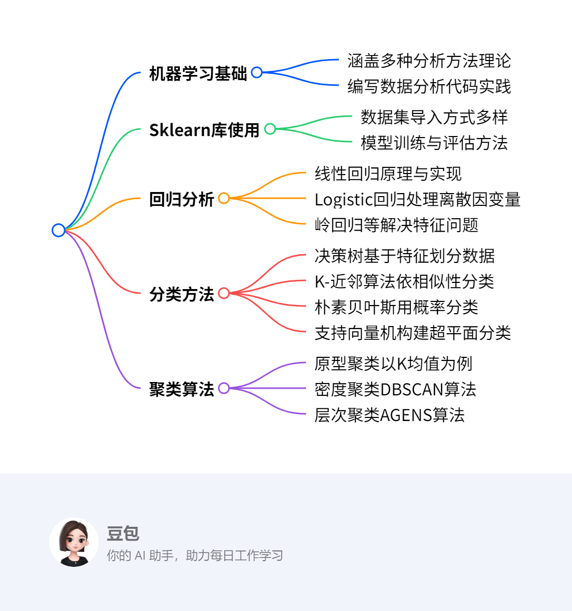
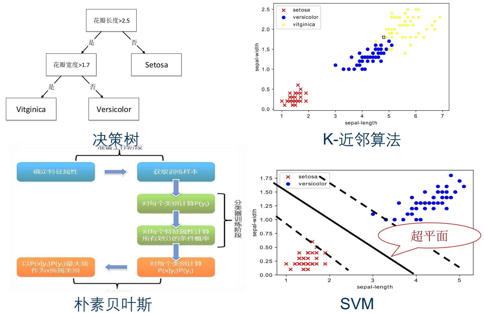

# 第五章：分析方法初步2
## 概览
---
### 一段话总结
本文围绕数据分析方法展开，介绍了机器学习基础，讲解Sklearn库的基本使用。详细阐述回归、分类、聚类等分析方法，**回归**包括线性回归、Logistic回归及其他回归模型；**分类**介绍决策树、K-近邻算法、朴素贝叶斯、支持向量机；**聚类**讲解基于原型、密度、层次的聚类算法。还给出各算法的原理、实现代码及优缺点，并布置课堂和课外作业巩固知识。 

---
### 思维导图

---
### 详细总结
1. **机器学习基础与Sklearn库**：重点讲解了多种分析方法的理论知识，要求能够编写简单的数据分析代码。Sklearn库在数据分析中应用广泛，可通过其datasets模块获取如Boston、iris等数据集，为后续模型训练提供数据支持。
2. **回归分析**
    - **线性回归**：用于对输入变量与连续结果变量间的线性关系建模。以Boston房价预测为例，通过最小二乘法确定参数，使均方误差最小化。多元线性回归是其扩展，可处理多个输入变量。利用Sklearn的linear_model模块可方便地构建和训练模型，并通过可视化对比预测值与真实值 。
    - **Logistic回归**：解决因变量为离散变量的问题，基于逻辑函数，将结果表示为概率值。通过最大似然法推导损失函数，使用梯度下降法求解模型系数。以鸢尾花数据集为例，借助Sklearn的linear_model模块构建模型并评估准确率。
    - **其他回归模型**：岭回归和Lasso回归用于处理特征点多于样本点的情况，通过引入惩罚项缩减不重要参数。树回归结合树结构与回归技术，处理复杂非线性数据，CART算法是其代表。
3. **分类方法**
    - **决策树**：形状类似流程图，内部节点依据属性划分数据，叶节点给出分类决策。ID3、C4.5、CART等算法是其代表，分别采用信息增益、信息增益率、基尼指数选择最优划分属性。以是否买电脑数据集演示ID3决策树生成过程，Sklearn的tree模块可实现决策树模型构建与评估。
    - **K-近邻算法**：基于相似数据在向量空间相邻的原理，计算未知数据与训练集数据的距离，选取最近的K个数据，以其多数标签作为未知数据标签。距离计算方法多样，如欧式距离等。以鸢尾花数据集为例，利用Sklearn的neighbors模块构建模型并评估。
    - **朴素贝叶斯**：依据贝叶斯规则预测类别概率，假设特征相互独立。在文本分类等领域应用广泛，通过计算不同类别下特征的联合概率进行分类。以账号分类为例展示其过程，Sklearn的naive_bayes模块可实现模型构建。
    - **支持向量机**：基于统计学习理论，通过寻找最佳超平面划分数据类别。支持向量决定超平面位置，最大化分类间隔以优化超平面。对于线性不可分数据，使用核函数映射到高维空间使其可分。以鸢尾花数据集为例，借助Sklearn的svm模块构建模型并评估。
4. **聚类算法**
    - **原型聚类**：K均值聚类是典型算法，通过寻找质心将数据点聚类。对iris数据集进行聚类时，先随机选取初始质心，计算点与质心距离划分数据点，再更新质心，重复直至数据点所属簇不再变化。该算法简单高效，但K值和初始质心选择影响较大。
    - **密度聚类**：DBSCAN算法基于样本分布密度，设定邻域参数划分数据点为核心点、边界点和噪声点，通过密度相连合并数据点形成簇，能发现任意形状的簇，但参数调节复杂，对高维数据处理效果不佳。
    - **层次聚类**：AGENS算法是凝聚层次聚类方法，采用单连接计算簇间距离，自底向上合并距离最近的簇，直至达到预设簇个数，类似哈夫曼树结构。
5. **作业**：课堂作业和课外作业要求使用Python实现回归、分类、聚类算法，部分作业需对比自己编写的函数和Sklearn库函数的效果，以加深对算法的理解和掌握。

|算法类别|具体算法|核心原理|关键指标或概念|Sklearn实现模块|优点|缺点|
|---|---|---|---|---|---|---|
|回归|线性回归|最小二乘法求参数，使均方误差最小化|均方误差、参数w和b|linear_model|可解释性强|对非线性关系拟合差|
|回归|Logistic回归|基于逻辑函数，最大似然法求损失函数|逻辑函数、最大似然法|linear_model|处理离散因变量有效|假设条件较强|
|分类|决策树|依据属性划分数据，生成树形结构|信息增益、信息增益率、基尼指数|tree|直观，数据准备少|易过拟合|
|分类|K-近邻算法|计算距离，选取最近K个数据分类|距离公式、K值|neighbors|简单易实现|计算量大，对样本不平衡敏感|
|分类|朴素贝叶斯|基于贝叶斯规则，假设特征独立|贝叶斯公式、特征独立性假设|naive_bayes|算法简单，时空开销小|对特征相关性敏感|
|分类|支持向量机|寻找最佳超平面，核函数处理非线性|超平面、支持向量、核函数|svm|避免维数灾难，鲁棒性好|大规模训练样本难实施，多分类困难|
|聚类|K均值聚类|寻找质心，依据距离聚类|质心、误差平方和SSE|cluster|简单快速，可伸缩性好|K值难确定，对初始质心敏感|
|聚类|密度聚类（DBSCAN）|基于密度，设定邻域参数聚类|邻域参数、核心点、边界点、噪声点|cluster|无需设定簇个数，发现任意形状簇|参数调节复杂，对高维数据效果差|
|聚类|层次聚类（AGENS）|单连接计算距离，自底向上合并簇|单连接、簇间距离|cluster|形成树形结构，直观展示聚类过程|计算复杂度较高|

---
### 关键问题
1. **线性回归和Logistic回归的主要区别是什么？**
    - 线性回归用于预测连续变量，假设自变量与因变量呈线性关系，通过最小二乘法确定参数，使均方误差最小化；Logistic回归用于处理因变量为离散变量的情况，基于逻辑函数将结果表示为概率值，通过最大似然法推导损失函数，使用梯度下降法求解模型系数。
2. **决策树算法中，信息增益、信息增益率和基尼指数分别有什么作用？**
    - 信息增益是ID3决策树属性划分标准，用于衡量划分数据集前后信息的变化，信息增益越高，该特征对分类的决定性越强；信息增益率是C4.5决策树采用的属性划分标准，用于减小信息增益对取值数目较多属性的偏好；基尼指数是CART决策树采用的属性划分标准，反映数据集的纯度，基尼指数越小，数据集纯度越高，选择划分后基尼指数最小的属性作为最优划分属性。
3. **K均值聚类算法中，K值的选择对聚类结果有什么影响？**
    - K值是事先给定的，若K值选择过小，可能导致多个簇被合并，无法准确反映数据的真实聚类结构；若K值选择过大，会使每个簇的数据点过少，聚类结果过于细碎。K值的选定非常难以估计，且初始聚类中心的选择也会对聚类结果产生较大影响，若初始值选择不当，可能无法得到有效的聚类结果。 
## 5.3 回归
该节主要介绍回归分析相关知识，具体内容如下：

- **回归分析的目的**：解释一组变量（自变量）对另一个变量（因变量）结果的影响，因变量的结果依赖于自变量。
- **回归分析的分类**：
    - **按涉及变量多少分**：**一元回归**（涉及一个自变量）和**多元回归**（涉及多个自变量）。
    - **按自变量多少分**：**简单回归分析**和**多重回归分析**。
    - **按自变量与因变量关系分**：**线性回归分析**（自变量与因变量呈线性关系）和**非线性回归分析**。
- **重点讲解的回归模型**：
    - **线性回归**：用于数值预测，是预测分析中历史悠久的方法，假设输入变量与结果变量呈线性关系，通过自变量数值解释并预测因变量。
    - **Logistic回归**：用于分类分析，解决因变量为离散变量的回归问题，基于逻辑函数，将函数值作为特定结果的概率值。 
### 5.3.1 线性回归
该节聚焦线性回归，从定义、原理、求解到实际应用与实现，进行了全面讲解，具体内容如下：

1. **线性回归基础**
    - **定义与用途**：线性回归是预测分析中历史悠久的技术，用于对输入变量和连续结果变量间的线性关系建模，通过自变量预测因变量，很多领域任务都可转化为回归问题。
    - **模型表示**：一般形式为 $f(x_{i}) = w^{T}x_{i} + b$，$w$ 直观体现各属性对预测结果的重要性 ，具有良好的可解释性。
2. **线性回归原理与求解**
    - **一元线性回归求解**：当输入属性只有一个时，$f(x_{i}) = wx_{i} + b$。通过最小化均方误差 $MSE$ 确定 $w$ 和 $b$，这一过程称为最小二乘“参数估计”，对均方误差关于 $w$ 和 $b$ 求偏导并令其为0，可得出 $w$ 和 $b$ 的最优解。
    - **多元线性回归求解**：$f(x_{i}) = w_{1}x_{i1} + w_{2}x_{i2} + \cdots + w_{d}x_{id} + b$，将 $b$ 视为 $w_{0}$，$x_{0}$ 恒为1，把数据集表示为矩阵形式 $y = X\widehat{w}$，使用最小二乘法估计参数 $\widehat{w}$，通过对损失函数 $E(w)$ 求导并令导数为0，得到 $\widehat{w} = (X^{T}X)^{-1}X^{T}y$。
3. **Sklearn实现线性回归**：以波士顿住房数据集为例构建多元线性回归模型。首先从Sklearn库的datasets中导入Boston数据集；接着导入linear_model模块中的LinearRegression，用cross_val_predict进行十折交叉验证获取预测结果；最后利用matplotlib绘制预测值与真实值的散点图，直观展示预测效果。 
### 5.3.2 Logistic回归
该节主要介绍了Logistic回归，包括其基本原理、确定参数的方法以及在Sklearn中的实现，具体内容如下：

1. **Logistic回归的引入**：线性回归要求变量均为连续变量，而当因变量为离散变量时，需要新的方法来拟合自变量x与因变量y的关系，Logistic回归应运而生，**它是解决因变量离散问题的回归方法**。
2. **Logistic回归的原理**
    - **基于逻辑函数**：Logistic回归基于逻辑函数$f(z)=\frac{e^{z}}{1 + e^{z}}$，$z$取值范围是$(-\infty,+\infty)$，$f(z)$值在$(0,1)$之间，会随$z$增大而增大，可作为特定结果的概率值。
    - **构建模型**：令$z_{i}=w_{1}x_{i1}+w_{2}x_{i2}+\cdots +w_{d}x_{id}+b$ ，基于自变量$x_{i}$事件发生的概率$p_{i}(x_{i1},x_{i2},\cdots,x_{i d}) = f(z_{i})=\frac{e^{z_{i}}}{1 + e^{z_{i}}}$ 。通常$f(z)$（用$p$表示）作为因变量，取值为0或1 ，$z$是中间结果。公式可改写为$ln(\frac{p_{i}}{1 - p_{i}})=z_{i}=w_{1}x_{i1}+w_{2}x_{i2}+\cdots +w_{d}x_{id}+w_{0}x_{0}$。将自变量转为向量形式$x_{i}$后，$z_{i}=x_{i}\theta$（$\theta=\widehat{w}$） ，$p_{\theta}(x_{i})=\frac{1}{1 + e^{-x_{i}\theta}}$。通过比较$p_{\theta}(x_{i})$与0.5的大小进行分类预测，$p_{\theta}(x_{i})<0.5$时，$y_{i}=0$（预测为负）；$p_{\theta}(x_{i})>0.5$时，$y_{i}=1$（预测为正） 。模型还可写成矩阵模式$p_{\theta}(X)=\frac{1}{1 + e^{-X\theta}}$。
3. **确定Logistic回归的参数w**
    - **损失函数推导**：由于逻辑回归不连续，不能用线性回归的均方误差（MSE）定义损失函数，而是采用最大似然法。假设样本输出为0或1两类，得到样本的概率分布函数$P(y|x,\theta)=p_{\theta}(x)^{y}(1 - p_{\theta}(x))^{1 - y}$（$y=0,1$）。通过最大化似然函数$L(\theta)=\prod_{i = 1}^{n}P(y_{i}|x_{i},\theta)$求解模型系数$\theta$ 。
    - **梯度下降求解**：对似然函数对数化取反得到损失函数$J(\theta)=-\sum_{i = 1}^{n}(y_{i}log(p_{\theta}(x_{i}))+(1 - y_{i})log(1 - p_{\theta}(x_{i})))$，用矩阵表示为$J(\theta)=-Y^{T}logp_{\theta}(X)-(E - Y)^{T}log(E - p_{\theta}(X))$。对$\theta$求导得$\frac{\partial J(\theta)}{\partial \theta}=X^{T}(p_{\theta}(X)-Y)$ ，使用梯度下降法，迭代公式为$\theta=\theta-\alpha X^{T}(p_{\theta}(X)-Y)$（$\alpha$为步长），多次迭代得到训练后的参数$\theta$。
4. **Sklearn实现Logistic回归**：以鸢尾花数据集为例构建逻辑回归模型。首先从Sklearn库的datasets中导入iris数据集；接着导入linear_model模块中的LogisticRegression，使用train_test_split方法划分数据集为训练集与测试集，用fit方法训练模型，predict方法返回预测结果；最后计算模型在训练集和测试集的识别准确率。代码实现中，数据集按7:3随机划分，最终训练集准确率为0.981，测试集准确率为0.978。 
### 5.3.3 其他回归模型
该节主要介绍了除线性回归和Logistic回归外的其他回归模型，包括岭回归、Lasso回归和树回归，具体内容如下：

1. **岭回归**：当特征点比样本点多时，线性回归无法构建模型，此时引入岭回归。**岭回归的主要思路是引入惩罚项**，以此减少不重要的参数，进而更好地理解数据，相比简单线性回归能获得更优的预测效果。
2. **Lasso回归**：与岭回归类似，**Lasso回归也是用于处理特征点多于样本点的问题**，通过限定回归系数来缩减系数，去除不重要的参数，辅助理解数据。不过，其计算复杂度比岭回归大幅增加 。
3. **树回归**：简单线性回归在处理具有众多特征且特征关系复杂的数据时，难以构建全局模型，因为现实中很多问题是非线性的，无法用全局线性模型拟合所有数据。**树回归将树结构与回归相结合**，把数据集切分成多个便于建模的部分，各部分利用线性回归技术建模，若首次切分后仍难以拟合线性模型，则继续切分。**CART算法是树回归的代表性算法**，可用于分类和回归，实用性强。 
## 5.4 分类
该节主要介绍了分类的概念、应用场景以及四种基本分类方法，具体内容如下：

1. **分类的定义**：分类是数据挖掘相关应用中的基础学习方法。在分类学习过程中，分类器会从已分好类的训练集里学习分类规则，进而为新样本数据分配类别标签 。
2. **分类的应用**：分类在预测领域应用极为广泛，常见的如垃圾邮件识别、手写数字识别、人脸识别、语音识别等场景，都是分类的实际应用。 
3. **四种基本分类方法**：**决策树**（decision tree）、**K-近邻算法**（k-Nearest Neighbor，KNN）、**朴素贝叶斯**（Naive Bayes）和**支持向量机**（Support Vector Machine, SVM），后续将对这四种方法展开详细讲解。 
### 5.4.1 决策树
该节围绕决策树展开，详细介绍了其定义、原理、算法、剪枝策略、优缺点及在Sklearn中的实现，具体内容如下：

1. **决策树基本概念**：决策树又称分类树，形状类似带决策的流程图。**内部节点记录待检测属性，叶节点记录决策结果，每个内部节点将数据分为若干子集**。它从无次序、无规则的数据中推理出分类规则，采用自顶向下的递归方式，在内部节点比较属性值并分支，叶节点为划分的类。1986年Quinlan提出ID3算法，1993年在此基础上提出C4.5算法，后来还出现了SLIQ和SPRINT等改进算法。
2. **决策树工作原理**
    - **特征选择**：通过特定准则确定最具决定性的特征来划分数据。引入信息增益概念，**信息增益指划分数据集前后信息的变化，用于衡量特征对分类的重要性**。ID3算法用信息增益作为属性划分标准，C4.5算法采用信息增益率，以减小信息增益对取值多的属性的偏好，**CART决策树使用基尼指数度量数据集纯度，选择划分后基尼指数最小的属性作为最优划分属性**。
    - **决策树生成**：以是否买电脑数据集为例，ID3决策树生成过程先计算各特征信息增益，选择信息增益最大的特征（如年龄）划分数据集，再对各子集递归计算信息增益并划分，直至数据集无法再分，决策树构建完成。CART决策树是二叉树，生成时计算特征的基尼系数，选择基尼指数最小的特征和切分点划分数据集，递归构建直至满足停止条件。
3. **决策树剪枝**：不进行剪枝的决策树易过拟合，导致训练集精度高但测试集表现不佳。**剪枝旨在减少过拟合，提高泛化能力**。预剪枝在构造树时停止信息量少的分枝，后剪枝先生成树再剪枝。后剪枝决策树保留更多分支，欠拟合风险小，泛化性能优，但训练时间开销大。
4. **决策树算法评价**
    - **优点**：模型直观，便于理解；数据准备工作少，缺失值和离群点不影响划分；能处理数据属性间的非线性关系。
    - **缺点**：缺少合适剪枝策略易导致过拟合。
5. **Sklearn实现决策树算法**：以鸢尾花数据集为例构建ID3决策树模型。从Sklearn库的datasets导入iris数据集，导入tree模块的DecisionTreeClassifier模型，用train_test_split划分数据集，fit方法训练，predict方法预测，最后计算训练集和测试集的准确率。代码实现后，训练集准确率为1.000，测试集准确率为0.978。 
### 5.4.2 K-近邻算法
该节主要介绍了K-近邻算法，涵盖算法思想、关键参数、计算过程、优缺点以及在Sklearn中的实现，具体内容如下：

1. **算法思想**：基于“物以类聚”的原理，**将数据置于N维向量空间，认为相似数据在空间中相邻且携带相邻类标签**。进行分类预测时，把训练集数据全部保留，将无标签数据的属性值与训练集对比，找出最相似的K个数据，以这K个数据中出现次数最多的标签值作为无标签数据的标签。
2. **关键参数k**：**k表示距离未知数据最相似的k个数据点**，一般小于30。k为1时，取最近数据点的标签作为预测标签；k不为1时，在最近的k个数据中选取出现次数最多的标签。对于二分类问题，k常设为奇数，避免两类出现次数相同。k值对模型性能影响较大。
3. **计算过程**：遍历数据集，使用距离公式计算距离，获取与目标数据距离最小的前k个样本值，统计其中出现次数最多的标签值，作为目标样本的预测值。寻找相似样本的策略包括欧式距离（如对于三个特征值的数据样本，距离计算为$\rho=\sqrt{(x_{2}-x_{1})^{2}+(y_{2}-y_{1})^{2}+(z_{2}-z_{1})^{2}}$ ）、相关性相似度、匹配系数、Jaccard等。
4. **算法优缺点**
    - **优点**：算法简单，理解和实现容易，无需估计参数和训练；特别适用于多分类问题。
    - **缺点**：样本不平衡时，小样本容量的类域易误分；计算量较大，需计算待分类文本到全体已知样本的距离；可理解性差，无法给出类似决策树的规则。
5. **Sklearn实现**：以鸢尾花数据集为例构建K-近邻模型。从Sklearn库的datasets导入iris数据集；导入neighbors模块的KNeighborsClassifier模型，用train_test_split划分数据集，fit方法训练模型，predict方法获取预测结果；计算训练集和测试集的准确率。代码实现后，训练集准确率为0.962，测试集准确率为0.978。 
### 5.4.3 朴素贝叶斯
该节主要围绕朴素贝叶斯算法展开，涵盖定义、理论基础、算法流程、实际应用、优缺点以及在Sklearn中的实现，具体内容如下：

1. **算法定义与适用场景**：**朴素贝叶斯是一种基于贝叶斯规则的概率分类器**，可用于二分和多分类任务。在数据量大、特征多且先验概率一致时效果显著，适用于文本分类、垃圾邮件过滤、病人分类等领域。
2. **贝叶斯决策理论**：对于新数据点，计算其属于不同类别的概率，**选择概率高的类别作为分类结果**。如在鸢尾花数据分类中，比较数据点属于不同种类鸢尾花的概率大小来确定分类。
3. **朴素贝叶斯算法**：数据集包含数据项属性和类别集合，分类时计算数据点属于各分类的概率，选择概率最大的类别作为预测分类。**当属性独立时**，通过特定公式计算概率，即$P(y_{i}|x)=\frac{P(x|y_{i})P(y_{i})}{P(x)}$可转化为$P(x|y_{i})P(y_{i}) = P(y_{i})\prod_{j = 1}^{m}P(a_{j}|y_{i})$。
4. **实际应用 - 账号分类**：以网站账号分类为例，已知真实账号和虚假账号的先验概率，以及账号的多个特征概率。通过计算不同类别下各特征概率的乘积与先验概率的乘积，比较大小来判断账号真实性。
5. **算法优缺点**
    - **优点**：算法逻辑简单，易于实现；分类时时空开销小。
    - **缺点**：属性较多或相关性较大时，分类效果不佳，因为算法假设属性相互独立。
6. **Sklearn实现**：以鸢尾花数据集为例构建模型。从Sklearn库的datasets导入iris数据集，使用naive_bayes模块的GaussianNB()方法搭建模型，用train_test_split划分数据集，fit方法训练，最后计算训练集和测试集的准确率。代码实现后，训练集准确率为0.943，测试集准确率为1.000。 
### 5.4.4 支持向量机
该节主要介绍了支持向量机（SVM），包括算法概述、原理、实现方式、优缺点以及在Sklearn中的应用，具体内容如下：

1. **SVM算法概述**：SVM是V.N. Vapnik等人在20世纪60年代提出的基于统计学习理论的新型学习方法，90年代中期开始受到广泛关注。它在解决小样本、非线性及高维识别问题上优势明显，具有无需调整参数、训练和执行效率高、能获得全局最优解等优点，在20世纪90年代到21世纪初是流行的机器学习算法之一。
2. **SVM算法原理**
    - **基本概念**：最初用于二分类问题，通过拟合合适边界（超平面）将相似点划分到同一类。**支持向量是确定超平面的关键数据点**，间隔表示数据点到超平面的距离，SVM通过最大化分类间隔获取最佳超平面。
    - **罚分值**：由于完美分开所有数据点较难，超平面间隔内常存在大量数据点。引入**罚分值**概念，对误分类数据点结合其与超平面的距离计算罚分并求和，通过最小化罚分总和找到最优超平面。
    - **核函数**：对于线性不可分数据集，可使用**核函数**将原始特征映射到高维空间，使其变得线性可分，进而使用线性可分SVM进行分类预测，常用的核函数有线性核、多项式核等。
3. **线性可分SVM算法实现**
    - **确定分类边界**：将同一类数据点两两相连得到该类边界，不同类别边界不交叉。
    - **找出最佳超平面**：使间隔最大化且罚分值最小。
    - **分类**：判断测试集位于超平面的哪一侧，完成分类任务。
4. **SVM算法优缺点**
    - **优点**：计算复杂性取决于支持向量数目，可避免“维数灾难”；对增、删非支持向量样本不敏感，具有较好的“鲁棒”性。
    - **缺点**：对大规模训练样本难以实施；解决多分类问题存在困难 。
5. **Sklearn实现SVM**：以鸢尾花数据集为例构建SVM分类模型。从Sklearn的datasets导入iris数据集，使用svm模块的SVC方法搭建模型，用train_test_split划分数据集，fit方法训练模型，最后计算训练集和测试集的准确率。代码实现后，训练集准确率为0.981，测试集准确率为0.978。 

## 5.5 聚类
该节是关于聚类的概述，主要介绍了聚类的来源、定义和作用，具体内容如下：

- **聚类的来源与发展**：聚类技术涉及数学、计算机科学等多个领域，在不同应用场景下不断发展，用于描述数据、衡量数据源相似性以及分类数据。
- **聚类的定义**：**聚类是将数据对象集合分组为多个类的过程，生成的簇内对象彼此相似，与其他簇中的对象存在差异**。聚类通过将相似对象归类，挖掘数据规律，帮助人们认识事物的客观规律，在市场营销、文本聚类、网页浏览分析等方面都有应用。 
### 5.5.1 概述
该节主要围绕聚类分析展开，介绍了其目的、应用和方法，具体如下：

1. **聚类分析的目的**：**聚类分析是把物理或抽象对象集合分组为类似对象组成的多个类的过程**。其核心目的是将具有相似特征的事物归类，进而挖掘其中的规律，以达到认识事物客观规律的目的。 
2. **聚类分析的应用**
    - **市场营销**：依据客户的购物记录、消费习惯和消费水平等信息对客户进行分类，明确不同客户群的特征，从而制定针对性的营销策略。
    - **文本聚类**：自动将相似文档划分到同一目录下，有助于快速理解和概括文档内容。
    - **网页浏览**：通过分析不同人群的点击行为识别浏览习惯，辅助电商针对不同人群设计不同的网站功能。
3. **聚类方法**
    - **基于原型的聚类**：**每个簇由一个中心数据点（原型）代表**，通过对原型的确定和调整实现聚类。
    - **基于密度的聚类**：**将数据点的密集区域视为簇，零散数据点当作噪声**。该方法最终的簇个数由算法自行确定，无法人为设定。
    - **基于层次的聚类**：**根据数据点间距离构建簇的等级结构，输出为树状**。构建方式分为自下而上（从单个数据点开始组合）和自上而下（从整个数据集开始分割）两种。 
### 5.5.2 原型聚类
该节聚焦原型聚类，着重介绍K均值聚类算法，同时提及其他相关算法，具体内容如下：

1. **原型聚类概述**：**原型聚类假设聚类结构可用一组原型刻画**，在实际聚类任务中很常见。通常先初始化原型，再迭代更新求解，不同的原型表示和求解方法会产生不同算法。
2. **K均值聚类算法**
    - **算法原理**：**通过寻找各簇质心（簇内所有点的均值）作为原型，将相邻点聚成簇实现聚类**。以Iris数据集为例，选用花瓣长度与花瓣宽度两个属性，设定簇个数k为3 。
    - **聚类步骤**：第一步是**初始质心**，从数据集中随机选取k个分散点作为初始质心；第二步是**划分数据点**，计算每个点到各质心的距离，将点划分到最近质心所在簇，距离计算可采用欧式距离等公式；第三步是**寻找新的质心**，按新簇计算质心，使所有点到质心距离的误差平方和（SSE）最小；第四步是**反复计算并更新质心**，重新划分数据点，重复操作直至数据点所属簇不再变化。
    - **算法优缺点**：**优点**是算法经典，简单快速，处理大数据集时可保持可伸缩性和高效性，在簇接近高斯分布时效果好；**缺点**是K值难以估计，初始聚类中心影响大，数据量很大时时间开销大，对噪声和孤立点敏感。
3. **其他原型聚类算法**：**学习向量量化（LVQ）**与K均值类似，但假设数据样本带有类别标记，利用监督信息辅助聚类，形成类别“子类”结构；**高斯混合聚类**采用概率模型表达聚类原型，结合了高斯分布、贝叶斯公式等原理。
4. **Sklearn实现K均值聚类**：选用iris数据库，提取四个属性值，用sklearn.cluster中的KMeans构造聚类器，设置k为3，对聚类结果绘制散点图展示。代码实现包括导入相关库和数据集、构造聚类器、训练聚类、获取聚类标签，最后通过绘制散点图展示不同簇的数据分布。 
### 5.5.3 密度聚类
该节主要介绍了密度聚类及其代表性算法DBSCAN，具体内容如下：

1. **密度聚类概述**：**密度聚类又称基于密度聚类，依据数据集在空间分布的稠密程度聚类**，假设聚类结构由样本分布紧密程度决定，将样本密度大于阈值的区域划入相近簇中。与基于质心的原型聚类不同，它无需事先设置k值。常见算法有DBSCAN、MDCA、OPTICS、DENCLUE等，重点讲解DBSCAN算法。
2. **DBSCAN算法原理**
    - **设定邻域参数**：**以数据点为中心，以eps为半径计算eps - 邻域内数据点密度**，Minpts代表一个簇中最少的数据点个数，以此判断区域密度高低，用户可根据数据集实际密度设置这两个参数。
    - **数据点分类**：数据点分为**核心点（邻域内数据点数目高于Minpts）、边界点（在核心点邻域内，但自身邻域数据点数小于Minpts，分割高低密度区域）和噪声点（既不是核心点也不是边界点，组成低密度区域）**。同时引入密度直达（同属一个邻域的数据点关系）、密度可达（如p->o->q这样通过密度直达传递的关系）、密度相连（q与p、q与t都密度可达，则p和t密度相连）的概念。
    - **聚类**：**目标是找到密度相连数据点的最大集合作为最终的簇**。先让核心点各自成簇，再依据密度相连概念合并簇并标记。最终，核心点密集区域被低密度噪声点包围，噪声点不单独成簇，聚类结果中部分数据点无标记，这些就是噪声点。
3. **DBSCAN算法评价**
    - **优点**：无需事先设定簇个数，能根据数据自身找出各簇；适用于稠密的非凸数据集，可发现任意形状的簇；能发现噪音点，对异常点不敏感；对样本输入顺序不敏感。
    - **缺点**：若两个簇无明显可分间隔，易被合并；参数调节复杂，对结果影响大；对高维数据处理效果不佳。
4. **Sklearn实现DBSCAN**：选用iris数据库，提取四个属性值，用sklearn.cluster中的DBSCAN方法构造聚类器，设置邻域参数为（0.4, 9） 。通过导入相关库和数据集、构造聚类器、训练聚类、获取聚类标签，最后绘制散点图展示聚类结果。    
### 5.5.4 层次聚类
该节主要介绍了层次聚类中的AGENS算法，具体内容如下：

1. **层次聚类概述**：**层次聚类是在不同层次对数据集进行划分，形成树形聚类结构的方法**。它分为凝聚层次聚类和分裂层次聚类，分裂层次聚类采用“自顶而下”的思想，先将所有样本看作一个簇，再迭代划分为更小的簇；**凝聚层次聚类采用“自底向上”的思想，先将每个样本看成一个簇，然后不断合并最近的簇，直至达到预设的聚类簇个数**。该节重点介绍凝聚层次聚类中的AGENS算法。
2. **AGENS算法**
    - **算法核心概念**：在凝聚层次聚类中，判定簇间距离有单连接和全连接两种标准方法。**单连接是计算每对簇中最相似两个样本的距离，合并距离最近的两个样本所属簇；全连接是通过比较找到分布于两个簇中最不相似（距离最远）的样本，以此完成簇的合并** 。AGNES算法是一种单连接凝聚层次聚类方法，采用自底向上的方式，先将每个样本视为一个簇，每次合并距离最短的两个簇，直到达到预设的聚类簇个数，其结构类似哈夫曼树，只是节点值为距离最小值。
    - **算法原理示例**：以包含5个簇（C1={A}、C2={B}、C3={C}、C4={D}、C5={E}）的数据集为例，通过计算簇间距离进行聚类。开始时计算出各簇间的初始距离，随后按步骤合并距离最近的簇。如Step1时，C1和C2合并；Step2时，C2和C3合并；Step3时，再次合并相关簇；最终所有簇合并为一个大簇，完成聚类过程。
3. **Sklearn实现AGENS算法**：选用iris数据库进行研究，利用Sklearn中cluster类的AgglomerativeClustering方法构造聚类器，设置参数n_clusters为3，表示聚类为3个簇。代码实现过程包括导入相关库和数据集，创建聚类器并进行训练，获取聚类标签，最后通过绘制散点图展示聚类结果，直观呈现不同簇的数据分布情况。 