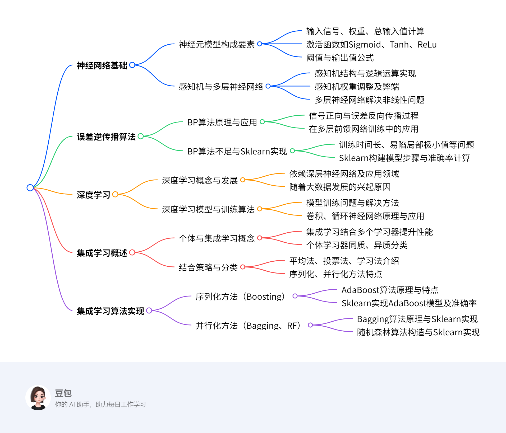
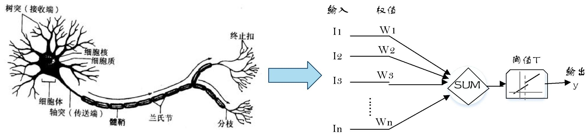
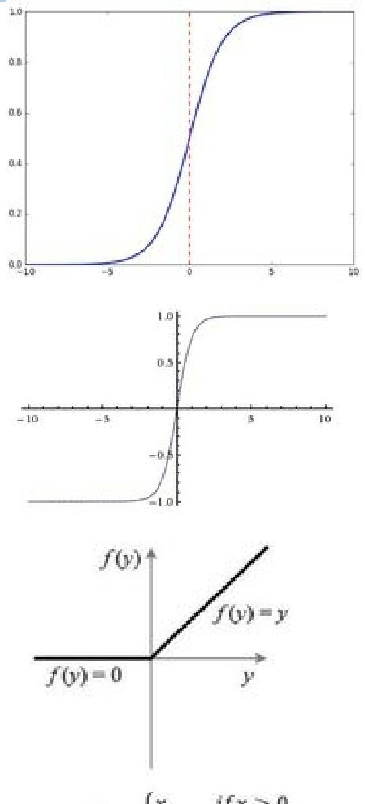
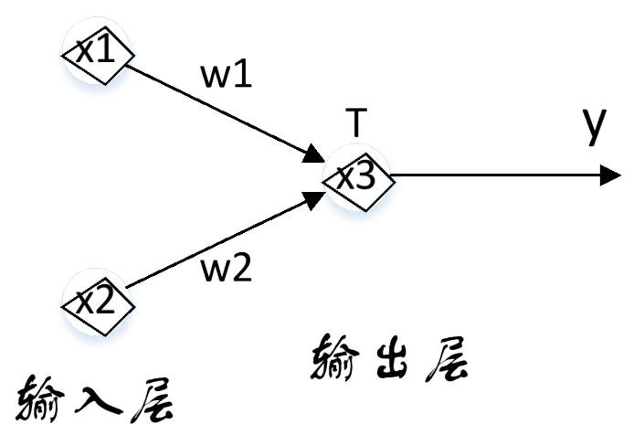

# 第五章：分析方法初步3
## 概览
---
### 一段话总结
本文围绕机器学习分析方法展开，**介绍了神经网络和集成学习两大板块**。神经网络中，从神经元模型出发，阐述其结构、激活函数，感知机及其局限性，多层神经网络的构建与应用；误差逆传播（BP）算法的原理、不足与Sklearn实现；深度学习的概念、发展、训练算法及卷积神经网络、循环神经网络等应用。集成学习方面，说明其通过结合多个学习器提升性能，涵盖结合策略、分类（序列化和并行化方法），并以Sklearn实现投票集成、AdaBoost、Bagging和随机森林算法，展示各算法在不同数据集上的应用及准确率 。

---

---
### 详细总结
1. **神经网络**
    - **神经元模型**：神经网络模拟人脑神经元功能，神经元模型是其基本组成单位。神经元接收输入信号$I_{1}, I_{2}, \cdots I_{n}$，通过权重$W_{1}, W_{2}, \cdots W_{n}$计算总输入值$SUM = I_{1}W_{1}+I_{2}W_{2}+\cdots+I_{n}W_{n}$ ，经激活函数$f$处理（如Sigmoid函数$f(x)=\frac{1}{1+e^{-x}}$、Tanh函数$f(x)=\frac{e^{x}-e^{-x}}{e^{x}+e^{-x}}$、ReLu函数$f(x)=max (0, x)$ ），与阈值$T$比较后输出$y=f(SUM - T)$。
    - **感知机与多层神经网络**
        - **感知机**：由输入层和输出层两层神经元组成，能实现逻辑与、或、非运算，如与操作（$w_{1}=w_{2}=1$ , $T=1.5$时，$x_{1}=x_{2}=1$ ，$y = 1$ ） 。通过训练数据集学习权重和阈值，权重调整规则为$w_{i} \leftarrow w_{i}+\Delta w_{i}$，$\Delta w_{i}=\eta(y-\hat{y})x_{i}$（$\eta \in(0,1)$为学习率）。但感知机只能处理线性可分问题。
        - **多层神经网络**：为解决非线性可分问题，在输入层和输出层间添加多层隐含层，形成多层前馈神经网络。其学习过程与感知机类似，通过调整权重和阈值收敛到正确结果，如对鸢尾花数据集进行类别预测。
    - **误差逆传播算法（BP算法）**
        - **原理与应用**：BP算法用于多层神经网络训练，学习过程包括信号正向传播和误差反向传播。信号正向传播时，输入样本经隐含层至输出层，若输出与期望不同则进行误差反向传播，将误差分摊给各神经元，用梯度下降法调整权值和阈值。多层前馈网络常被称为BP神经网络，BP算法也适用于其他网络训练。
        - **不足与Sklearn实现**：BP算法存在训练时间长、易陷入局部极小值、喜新厌旧等问题。使用Sklearn库构建神经网络模型对鸢尾花数据集分类，步骤包括获取数据集、构建模型（调用`MLPClassifier`）、计算准确率，训练集准确率达0.981，测试集为0.933。
    - **深度学习**
        - **基本概念与发展**：深度学习是流行的机器学习方法，依赖深层次神经网络，在多领域性能超传统方法，如人脸识别、Alpha GO围棋程序等。随着大数据发展，其复杂模型受关注，通过增加隐含层提升数据表达和学习能力。
        - **模型训练与算法**：网络深度增加使传统BP算法难以收敛，采用无监督逐层训练（先预训练，再用BP算法微调）和权值共享策略（如卷积神经网络CNN）。CNN适用于图像识别等领域，运用局部感受野概念，通过卷积和池化操作处理图像。循环神经网络RNN用于处理时间序列数据，LSTM解决了RNN的梯度消失问题。深度学习应用广泛，包括图像识别、自动驾驶、语音识别等。
2. **集成学习**
    - **概述**
        - **个体与集成**：集成学习结合多个学习器完成任务，提升泛化性能。个体学习器由已有算法产生，同质集成的个体学习器叫基学习器，异质集成的叫组件学习器。弱学习器泛化性能略优于随机猜测，集成学习将其变为强学习器。
        - **结合策略与分类**：结合策略有平均法（算术平均$H(x)=\frac{1}{n} \sum_{i=1}^{n} h_{i}(x)$、加权平均$H(x)=\frac{1}{n} \sum_{i=1} w_{i} h_{i}(x)$ ）、投票法（相对多数、绝对多数、加权投票）、学习法（如stacking）。根据个体学习器生成方式，集成学习分为序列化方法（个体学习器强依赖，串行生成，如Boosting算法族）和并行化方法（个体学习器相互独立，并行生成，如Bagging、随机森林）。
    - **序列化方法（以AdaBoost为例）**：基于PAC可学习型理论，先训练一个基学习器，根据其表现调整样本分布，使错误样本受更多关注，再训练下一个基学习器，最后加权结合。AdaBoost是Boosting中常用方法，由Yoav Freund和Robert E. Schapire在1995年提出，可使用多种方法构建子分类器，简单且不易过拟合。用Sklearn为鸢尾花数据集构建AdaBoost模型，设置弱学习器数量为100，准确率达0.9599673202614379。
    - **并行化方法**
        - **Bagging**：基于自助采样法获取数据集，对每个采样集训练基学习器，分类用投票法，回归用平均法。用未被采样样本作验证集估计泛化性能。用Sklearn为鸢尾花数据集构建Bagging集成模型，以KNN为基学习器，准确率为0.9464869281045751。
        - **随机森林（RF）**：Bagging和决策树结合，对训练样本和特征抽样，基学习器是决策树，预测结果为子树结果平均值。具有降噪性，可用于回归和分类任务，查看特征重要性，但树增多运算会变慢。构造过程包括有放回选样本、随机选属性分裂节点等步骤。用Sklearn为鸢尾花数据集构建RF集成模型，设置参数`n_estimators=10`，`max_features=2`，准确率为0.9599673202614379。
---
### 关键问题
1. **感知机为什么只能处理线性可分问题？**
    - 感知机只有一层功能神经元，其学习能力有限。它通过权重和阈值对输入信号进行简单的线性组合和判断，仅能找到一个超平面将数据分为两类。对于非线性可分的数据，无法用这样简单的线性模型找到合适的分类边界，权重会产生震荡，无法收敛到正确结果，比如无法解决异或问题。
2. **深度学习中卷积神经网络的局部感受野概念有什么优势？**
    - 局部感受野概念认为图像中局部像素联系紧密，远距离像素相关性弱。每个神经元只需对局部进行感知，减少了神经元需要处理的信息，降低了计算量。同时，在更高层将局部信息综合起来能得到全局信息，避免了传统识别算法中复杂的特征提取过程，使得卷积神经网络可以直接以图像作为输入，更高效地提取图像特征，在图像识别等领域表现出色。
3. **集成学习中序列化方法和并行化方法的主要区别是什么？**
    - 序列化方法中个体学习器之间具有强依赖关系，必须串行生成。如Boosting算法，先训练一个基学习器，根据其表现调整样本分布后再训练下一个，通过这种方式让后续学习器更关注前面学习器分类错误的样本 。而并行化方法中个体学习器之间不存在强依赖关系，可同时并行生成。像Bagging和随机森林，通过对训练数据集采样出不同子集，在各个子集上独立训练基学习器，然后将这些基学习器结合起来，各基学习器训练过程相互独立。 
## 5.6 神经网络
### 5.6.1 神经元模型
该节主要介绍了神经网络中的神经元模型，内容如下：

1. **神经网络与神经元概述**：神经网络通过对人脑神经元的建模和连接，模拟人脑神经系统功能，具备学习、联想等智能信息处理能力，其学习结果存储于突触连接中。神经元细胞从树突接收信号，经细胞体计算是否达传递阈值，再由轴突决定是否传递信号给其他神经元。
2. **神经元模型构建**：神经元模型是神经网络的基本组成单位。人工神经网络对神经元进行建模，模拟生物神经元信息处理的输入、处理、输出三个阶段，分别对应树突、细胞体和轴突。
3. **神经元结构**：
    - **输入信号**：用 \(I_{1}, I_{2}, \cdots I_{n}\)表示。
    - **权重**：以 \(W_{1}, W_{2}, \cdots W_{n}\)代表，权重决定了每个输入信号对神经元的影响程度 。
    - **总输入值**：通过公式 \(SUM = I_{1}W_{1}+I_{2}W_{2}+I_{3}W_{3}+\cdots+I_{n}W_{n}\)计算得出，反映了所有输入信号综合作用的结果。{align="right" width="40%"}
    - **激活函数**：**将神经元的输入映射到输出端，为网络引入非线性特性**。常见的激活函数有：
        - **Sigmoid函数**：呈S型生长曲线，常被用作神经网络的阈值函数，能将变量映射到\(0\)到\(1\)之间，公式为\(f(x)=\frac{1}{1+e^{-x}}\)。
        - **Tanh函数**：由双曲正弦和双曲余弦推导而来，公式是\(f(x)=\frac{e^{x}-e^{-x}}{e^{x}+e^{-x}}\) 。
        - **ReLu函数**：用于隐层神经元输出，公式为\(f(x)=max (0, x)\)，即当\(x>0\)时，输出为\(x\)；当\(x\leq0\)时，输出为\(0\)。
    - **阈值**：是神经元从抑制状态转变为兴奋状态的临界值。
    - **输出值**：根据公式\(y = f(SUM - T)\)计算得到，是神经元最终的输出结果。 
### 5.6.2 感知机与多层神经网络
该节主要介绍了感知机与多层神经网络，具体内容如下：

1. **感知机**
    - **结构**：**感知机由输入层和输出层两层神经元组成**，输入层负责接收并传递输入信号，输出层的功能神经元对信号进行处理。它是人工神经网络的最简形式。
    - **逻辑运算实现**：**感知机可实现逻辑与、或、非运算**。以阶跃函数$f(x)=\begin{cases}1, & x>0 \\ 0, & x<0\end{cases}$为激活函数时，如与操作（$w_{1}=w_{2}=1$ ，$T = 1.5$ ，$x_{1}=x_{2}=1$ 时，$y = 1$ ）；或操作（$w_{1}=w_{2}=1$ ，$T = 0.5$ ，$x_{1}=1$且$x_{2}=1$ 时，$y = 1$ ）；非操作（$w_{1}=-1$ ，$w_{2}=0$ ，$T=-0.5$ ） 。
    - **权重调整策略**：**感知机通过训练数据集学习权重和阈值**，将阈值视为输入为 -1 的结点权重，转化为权重学习问题。对于训练样例$(x,y)$，若当前输出为$\hat{y}$，权重调整规则为$w_{i}\leftarrow w_{i}+\Delta w_{i}$，$\Delta w_{i}=\eta(y - \hat{y})x_{i}$ ，$\eta\in(0,1)$为学习率，依据预测偏差调整权重。
    - **弊端**：**感知机学习能力有限，只能处理线性可分问题**，即存在超平面能将数据分为两类的情况。处理非线性可分数据时，权重会震荡无法收敛，比如无法解决异或问题。
2. **多层神经网络**
    - **结构与原理**：**为解决非线性可分问题，在输入层和输出层间添加多层隐含层，形成多层前馈神经网络**。每层神经元与下层全互连，同层及跨层无连接。其学习过程和感知机类似，通过训练数据集调整权重和阈值以收敛到正确结果。
    - **应用示例**：以鸢尾花数据集类别预测为例，网络输入包含花萼长度、宽度，花瓣长度、宽度四个属性，经隐层处理后在输出层得到鸢尾花的三个品种预测结果，通过比较输出层结点值大小确定最终预测类别。 
### 5.6.3 误差逆传播算法
该节主要介绍了误差逆传播（BP）算法，包括其应用、原理、不足以及在Sklearn库中的实现，具体内容如下：

1. **BP算法应用**：
    - **算法提出背景**：随着多层神经网络层数增多，感知机的权重调整规则无法满足需求，**误差逆传播（BP）算法应运而生**。它是训练多层神经网络的重要算法。
    - **发展历程**：由Werbos于1974年提出，1985年Rumelhart等人对其进行发展。
    - **应用范围**：**多层前馈网络训练常采用BP算法，因此多层前馈神经网络常被称为BP神经网络**。此外，它还可用于训练其他类型的网络。
2. **BP算法原理**：
    - **信号正向传播**：输入样本从输入层进入网络，经隐含层逐层传递至输出层。若输出层实际输出与期望输出（样本标签）相同，学习算法结束；若不同，则进入误差反向传播阶段。
    - **误差反向传播**：将输出误差按原通路反向传递至输入层，在反向传递过程中把误差分摊给各层神经元，得到各层神经元的误差信号，以此作为修正神经元权值的依据。使用梯度下降法调整各层神经元的权值和阈值，使误差信号降至最低。
3. **BP算法的不足**：
    - **训练时间较长**：对于某些特殊问题，运行时间可能长达数小时甚至更久，主要原因是学习率太小，可采用自适应学习率进行改进。
    - **易陷入局部极小值**：BP算法采用梯度下降法，从某一起始点沿误差函数斜面逐渐达到误差最小值。不同起始点可能导致不同的极小值，无法保证得到误差超平面的全局最优解。
    - **喜新厌旧**：训练过程中，学习新样本时存在遗忘旧样本的趋势。
4. **Sklearn实现BP神经网络算法**：
    - **数据集获取**：利用Sklearn库的datasets模块直接导入iris数据集。
    - **模型构建**：导入sklearn的neural_network模块，调用MLPClassifier构建神经网络模型。可通过修改激活函数、每层神经元个数、优化算法、学习率、最大迭代次数等参数优化网络模型。
    - **准确率计算**：计算模型在训练集和测试集的识别准确率。代码实现后，得到**神经网络模型训练集的准确率为0.981，测试集的准确率为0.933**。 
### 5.6.4 深度学习
该节主要围绕深度学习展开，涵盖其基本概念、发展历程、模型训练、应用以及相关神经网络等内容，具体总结如下：

1. **基本概念**：**深度学习是21世纪初流行的机器学习方法，依赖深层次神经网络**。在图像识别、语音识别等多领域性能超越传统机器学习方法，如在人脸识别比赛LFW和自然图像分类比赛ImageNet中表现超人类，Google的Alpha GO围棋程序击败人类棋手。其流行得益于Hinton教授2006年在Science杂志发表的论文，提高了深度神经网络模型训练效率。
2. **发展历程**：随着大数据时代来临，训练数据增多减少了过拟合现象，深度学习这类复杂模型受到关注。**深度学习模型通过增加隐含层数量，增强了对数据的表达和学习能力**。
3. **模型训练问题及算法**
    - **问题**：网络深度增加，传统BP算法在误差逆传播时难以收敛到稳定状态。
    - **训练算法**：**无监督逐层训练**，先预训练分组参数，得到局部较优值后用BP算法微调，减少训练开销；**权值共享策略**，如卷积神经网络（CNN）让一组神经元使用相同权重，降低网络参数选择复杂度。
4. **应用领域**：深度学习应用广泛，涉及图像/视频识别、语音识别、自然语言处理等。在图像和视频方面，可识别物体、分类搜索照片；应用于自动驾驶系统识别路况信息；还用于人脸识别实现刷脸支付等。
5. **相关神经网络**
    - **卷积神经网络（CNN）**：适用于图像识别、语音分析等领域。其神经元共享权值，减少自由参数个数，可直接以图像为输入，避免复杂特征提取。运用局部感受野概念，通过多层卷积与池化组合处理图像，卷积是对矩形图像区域加权和操作，池化用于缩小图像、保留重要信息。
    - **循环神经网络（RNN）**：适合处理样本时间顺序重要的任务，如自然语言处理、语音识别。通过让网络下一时刻状态与当前时刻相关，将上次隐藏层输出作为本次输入，对时间关系进行建模。
    - **长短期记忆模型（LSTM）**：本质是RNN，解决了RNN训练时严重的梯度消失问题，即误差梯度随时间差快速下降，导致难以学习远距离时间影响。被广泛应用于时间序列预测、机器翻译、语音识别等众多场合。 
### 图的表示学习
该节主要介绍了图表示学习，涵盖其概念、应用场景、浅层模型和深层模型，具体内容如下：

1. **图表示学习概念**：**图表示学习旨在将网络中的节点嵌入到低维向量空间**。这样做有诸多优势，一方面便于进行并行计算，另一方面能够应用经典机器学习算法来处理相关任务。
2. **应用场景**：在得到低维向量表示后，可应用于多种场景，包括**节点分类**（对网络中的节点进行类别划分）、**链接预测**（预测节点之间是否存在链接关系）、**社团检测**（发现网络中紧密连接的子群体）、**网络进化**（研究网络结构随时间的演变规律 ）等。
3. **浅层模型**：
    - **基于因子分解的方法**：如拉普拉斯特征映射，通过对相关矩阵进行因子分解，提取关键特征来实现节点在低维空间的表示。
    - **基于随机游走的方法**：以DeepWalk为代表，通过在图上进行随机游走生成节点序列，再利用这些序列学习节点的低维向量表示。
4. **深层模型**：
    - **针对图应用深度神经网络的方法**：借助深度神经网络强大的特征学习能力，对图结构数据进行处理，获取节点的有效表示。
    - **基于自动编码机的方法**：例如DNGR、SDNE，利用自动编码机的结构，将图数据编码为低维向量，再通过解码重构数据，在这个过程中学习到节点的低维表示。
    - **基于图神经网络的方法**：像GCN、GAT，专门针对图结构设计神经网络架构，直接对图数据进行卷积等操作，从而得到节点的低维向量表示，有效捕捉图中节点的局部和全局结构信息。 
## 5.7 集成学习