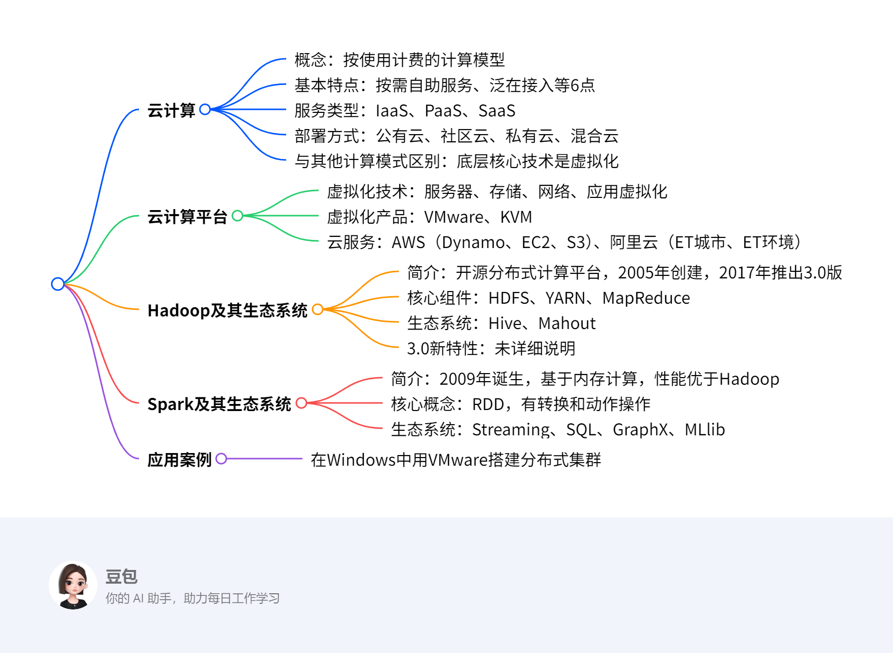

# 第八章：大数据处理技术
## 总览
---
### 一段话总结
文档围绕大数据处理技术展开，重点介绍了云计算，其具有按需自助服务、泛在接入等6大基本特点，服务类型包括IaaS、PaaS、SaaS，部署方式有公有云、私有云等；云计算平台涉及虚拟化技术、VMware和KVM等虚拟化产品，以及AWS、阿里云等云服务；Hadoop以HDFS和MapReduce为核心，有Common、YARN等模块，生态系统包含Hive、Mahout等，3.0版本有新特性；Spark基于内存计算，核心是RDD，生态系统涵盖Streaming、SQL等模块，性能比Hadoop更优，最后还提及了应用案例。

---
### 思维导图

---
### 详细总结
### 一、云计算
#### （一）概念
云计算是一种按使用计费的计算模型，提供对可配置的计算资源（如网络、服务器、存储等）进行按需存取。

#### （二）基本特点
- 按需自助服务：用户可自主规划计算和存储资源的使用。
- 泛在接入：用户能通过手机、平板等终端随时随地接入网络使用资源。
- 资源池化：云服务提供商将计算资源池化，共享给多个用户并动态分配。
- 快速弹性：用户可方便获取和释放资源，提高利用率。
- 计费服务：提供商监视资源使用并输出报表，保证费用结算透明。
- 高可靠性：通过数据多副本容错等措施保障服务可靠性。

#### （三）服务类型
|服务类型|描述|典型代表|
| ---- | ---- | ---- |
|IaaS（基础设施即服务）|将硬件设备封装成虚拟机提供给用户，用户可租用运行应用|亚马逊EC2、阿里云ECS|
|PaaS（平台即服务）|提供预先定义好的开发环境，用户专注于开发软件|Google App Engine、Microsoft Azure|
|SaaS（软件即服务）|将应用软件封装成服务提供给用户，用户按需求付费使用|邮箱、云盘、企业办公系统|

#### （四）部署方式
- 公有云：面向社会大众开放，资源存放在云端，用户无需投资建设，但安全风险高。
- 社区云：由社区共同拥有，社区外组织不能访问，适合有共同要求的单位组织。
- 私有云：建立在防火墙内，供内部用户使用，安全性好但成本高、利用率低。
- 混合云：由多个不同云基础设施组成，用户可根据数据敏感程度部署服务。

#### （五）与其他计算模式的区别
云计算底层核心技术是虚拟化，它是并行计算、分布式计算、集群计算、网格计算等技术发展的新阶段和商业实现。

### 二、云计算平台
#### （一）虚拟化技术
- 服务器虚拟化：分为寄居虚拟化和裸机虚拟化，使多个虚拟机在同一物理机上运行。
- 存储虚拟化：将存储设备与操作系统分隔，整合分散资源，提高利用率。
- 网络虚拟化：将不同网络资源结合成虚拟整体，包括虚拟局域网和虚拟专用网。
- 应用虚拟化：包括软件虚拟化和桌面虚拟化，解决版本兼容等问题。

#### （二）虚拟化产品
- VMware：提供桌面和服务器虚拟化产品，如VMware Workstation。
- KVM：开源虚拟化软件，由RedHat开发，用于虚拟化Linux内核基础设施。

#### （三）云服务
- AWS：提供Dynamo、EC2（弹性计算服务）、S3（简单存储服务）等。
- 阿里云：提供弹性计算、云数据存储等核心服务，其ET城市大脑和ET环境大脑有重要应用。

### 三、Hadoop及其生态系统
#### （一）简介
- Hadoop是Apache旗下开源分布式计算平台，以HDFS和MapReduce为核心，2005年由Doug Cutting和Mike Cafarella创建，2017年推出3.0正式版。
- 基本特点：易用性（可运行在廉价机器集群）、高可靠性（自动保存副本、处理节点故障）、高扩展性（可扩展到数千节点）。

#### （二）核心组件
- HDFS：分布式文件系统，支持超大文件，基于廉价硬件，流式数据访问，默认数据块副本数为3。
- YARN：资源管理器，将资源管理和作业调度/监控分开，支持更多计算模型，有FIFO、Capacity、Fair等调度器。
- MapReduce：计算模型，将计算过程分解为Map和Reduce阶段。

#### （三）生态系统
- Hive：基于Hadoop的数据仓库工具，可将结构化数据文件映射为表，提供HiveQL查询，数据模型包括表、分区、桶。
- Mahout：机器学习库，基于Hadoop实现，包含聚类、分类等算法。

### 四、Spark及其生态系统
#### （一）简介
- Spark 2009年诞生于加州大学伯克利分校，是主流大数据处理框架，基于内存计算，与Hadoop兼容，2014年在100TB数据排序中用206个节点23分钟，比Hadoop（2000个节点72分钟）快3倍。
- 主要优势：处理速度快（内存处理技术使速度达Hadoop几十至上百倍）、易于使用（提供80多个数据处理操作原语）。

#### （二）核心概念
- RDD（弹性分布数据集）：Spark核心概念，是容错、不可更新的分布式数据集，支持并行处理，操作包括转换（如map、filter）和动作（如reduce、collect）。
- 依赖关系：窄依赖（父RDD分区对应子RDD分区）和宽依赖（父RDD分区对应子RDD多个分区）。
- DAG调度：将作业分解为阶段，按依赖关系调度执行。

#### （三）生态系统
- Spark Streaming：流数据处理模块，将流数据按时间片累积为RDD处理。
- Spark SQL：处理结构化和半结构化数据，可通过JDBC运行SQL查询。
- Spark GraphX：图计算框架，提供类似Pregel的编程接口。
- Spark MLlib：机器学习模块，利用Spark内存计算优势提升性能。

### 五、应用案例
在Windows操作系统中使用VMware workstation创建多台虚拟机搭建分布式集群环境并运行案例代码，详细步骤见讲义。

---
### 关键问题
#### 1. 云计算的三种服务类型分别是什么？各有什么特点？
**答案**：云计算的三种服务类型是IaaS（基础设施即服务）、PaaS（平台即服务）、SaaS（软件即服务）。IaaS提供商将硬件设备封装成虚拟机提供给用户，用户可租用运行应用，节省维护成本和办公场地，面向系统管理员，如亚马逊EC2；PaaS是预先定义好的开发环境，用户不必处理软硬件构建维护，专注开发，面向开发和运维人员，如Google App Engine；SaaS把应用软件封装成服务提供给用户，用户直接使用并按需求付费，面向业务人员，如邮箱、企业办公系统。

#### 2. Hadoop的核心组件有哪些？各自的作用是什么？
**答案**：Hadoop的核心组件包括HDFS、YARN和MapReduce。HDFS（分布式文件系统）支持超大文件存储，基于廉价硬件，提供高吞吐量数据访问，用于存储大数据；YARN（资源管理器）将资源管理和作业调度分开，支持更多计算模型，负责集群资源的管理和调度；MapReduce（计算模型）将计算过程分解为Map和Reduce阶段，用于处理和生成大规模数据集。

#### 3. Spark相比Hadoop有什么优势？其核心概念RDD是什么？
**答案**：Spark相比Hadoop的优势在于处理速度快，基于内存计算技术，当数据完全驻留内存时，速度达Hadoop几十至上百倍，且易于使用，提供80多个数据处理操作原语。Spark的核心概念RDD（弹性分布数据集）是一个容错的、不可更新的分布式数据集，支持并行处理，可看作运行于内存中的对象，不同的分片、数据依赖等都可看作RDD，操作包括转换和动作。
## 8.1 云计算
### 8.1.1 云计算的概念
- **定义**：云计算是一种按使用计费的计算模型，提供对可配置的计算资源（如网络、服务器、存储、应用程序和服务）进行按需存取。
- **核心本质**：通过网络将计算资源虚拟化并动态分配，用户无需关心底层硬件，仅按需求使用资源并付费。

### 8.1.2 云计算的基本特点
1. **按需自助服务**
    - 用户可自主规划计算资源和存储资源的使用量，以及管理和部署服务的方式。
    - 例：企业可根据业务高峰时段需求，自助增加服务器算力，无需人工干预硬件部署。
2. **泛在接入**
    - 用户通过手机、平板、电脑等终端设备，随时随地接入网络使用云端资源。
    - 例：远程办公人员可通过笔记本电脑访问公司云端数据库，进行数据处理。
3. **资源池化**
    - 云服务提供商将计算资源（物理或虚拟化）池化，共享给多个用户，且用户间资源隔离。
    - 例：云计算中心将多台服务器的存储资源整合为虚拟存储池，不同企业用户可独立使用各自分配的存储空间。
4. **快速弹性**
    - 用户能快速获取或释放计算资源，提高资源利用率，节省成本。
    - 例：电商平台在促销活动期间快速申请更多服务器资源，活动结束后释放，避免资源浪费。
5. **计费服务**
    - 提供商实时监视资源使用情况，生成使用报表，确保费用结算透明。
    - 例：用户可在云端管理界面查看每月服务器、存储的使用时长和费用明细。
6. **高可靠性**
    - 通过数据多副本容错、计算节点同构可互换等措施，保障服务可靠性。
    - 例：当某计算节点故障时，系统自动切换到冗余节点，确保业务不中断。

### 8.1.3 云计算的服务类型
|服务类型|定义|特点|典型案例|
|----|----|----|----|
|**基础设施即服务（IaaS）**|将硬件设备（服务器、存储、网络等）封装为虚拟机，供用户租用|用户负责操作系统和应用程序的安装与管理，节省硬件维护成本|亚马逊EC2、阿里云ECS|
|**平台即服务（PaaS）**|提供预配置的开发环境（操作系统、中间件、开发工具等）|用户专注于应用开发，无需处理底层平台维护|Google App Engine、百度智能云BAE|
|**软件即服务（SaaS）**|将应用软件封装为服务，用户通过网络直接使用|按使用时长或功能付费，无需安装和升级软件|企业邮箱、阿里云盘、办公自动化系统|

### 8.1.4 云计算的部署方式
1. **公有云**
    - **特点**：云端资源面向社会公众开放，用户无需自建基础设施，但存在安全风险。
    - **例**：阿里云、腾讯云等面向中小企业提供的通用云计算服务。
2. **社区云**
    - **特点**：由特定社区（如行业协会、联盟）共同拥有，仅允许社区内成员访问，满足共同的安全和业务需求。
    - **例**：医疗行业多家医院共建的社区云，用于共享患者病历数据并确保隐私安全。
3. **私有云**
    - **特点**：云基础设施部署在企业防火墙内，仅供内部使用，安全性高但成本高、利用率低。
    - **例**：大型银行自建私有云，用于处理敏感金融数据和核心业务系统。
4. **混合云**
    - **特点**：结合两种或多种云部署方式（如私有云+公有云），通过混合云管理层统一调度资源。
    - **例**：企业将敏感数据存储在私有云，非敏感业务（如网站托管）部署在公有云，通过混合云实现资源优化。

### 8.1.5 云计算与其他计算模式的区别
1. **并行计算**：侧重时间或空间上的并行处理，如多线程同时计算不同数据块。
2. **分布式计算**：将任务分解为小任务分布到多个节点执行，如分布式数据库查询。
3. **集群计算**：通过网络将松散节点连接成整体协同计算，如科学计算集群🔶1-155🔶。
4. **网格计算**：整合异构计算资源形成虚拟集群，支持跨地域多类型设备协同。
5. **云计算与其他模式的关系**：云计算底层核心技术是虚拟化，它是上述技术的商业化集成与延伸，更注重资源的按需分配和服务化交付。

### 求解方法与案例：企业如何选择云计算部署方式
#### 方法步骤
1. **评估数据敏感性**：敏感数据（如财务、客户隐私）优先选择私有云或混合云（敏感部分放私有云）。
2. **分析业务弹性需求**：业务波动大的场景（如电商促销）适合公有云或混合云（公有云处理峰值）。
3. **考虑合规性要求**：金融、医疗等行业需遵循严格合规标准，优先选择私有云或合规性高的社区云。
4. **权衡成本与资源利用率**：中小企业可优先选择公有云（按需付费，降低初始投资），大型企业可考虑混合云（核心业务私有云，非核心公有云）。

#### 案例：某电商平台的部署方式选择
- **业务场景**：日常订单处理量稳定，但大促期间流量激增10倍以上，需保障用户数据安全。
- **步骤1**：用户注册信息、支付数据属于敏感数据，决定将这部分存储和处理放在私有云。
- **步骤2**：大促期间的网站访问、商品展示等非敏感业务，使用公有云弹性扩展资源。
- **步骤3**：通过混合云管理层实现私有云与公有云的资源调度，大促时自动将部分流量切换到公有云。
- **结果**：既保障了数据安全，又通过公有云的弹性降低了大促期间的硬件成本，资源利用率提升40%。
## 8.2 云计算平台
### 8.2.1 虚拟化技术
#### 服务器虚拟化
- **定义**：通过虚拟化层使多个虚拟机在同一物理机上独立运行，每个虚拟机拥有独立的CPU、内存、I/O设备及操作系统。
- **分类**：
  - **寄居虚拟化**：先安装主机操作系统，再安装虚拟机管理器（VMM），如VMware Workstation。
  - **裸机虚拟化**：直接在裸机上安装VMM，如KVM。
- **例**：企业通过服务器虚拟化在一台物理服务器上部署Windows和Linux虚拟机，分别运行财务系统和Web服务，提高硬件利用率。

#### 存储虚拟化
- **定义**：将存储设备与服务器操作系统分离，构建统一的虚拟存储池，整合分散的存储资源。
- **优势**：提高存储利用率，降低管理复杂度，如将多个分散硬盘虚拟为一个大容量存储池，供多台服务器共享使用。

#### 网络虚拟化
- **定义**：整合不同网络的硬件和软件资源，形成虚拟网络整体，包括虚拟局域网（VLAN）和虚拟专用网（VPN）。
- **应用**：企业通过网络虚拟化将一个物理网络划分为多个逻辑子网，不同部门使用独立子网，增强网络安全性和管理效率。

#### 应用虚拟化
- **软件虚拟化**：将软件与操作系统分离，提供虚拟运行环境，解决版本兼容问题，如通过虚拟化技术在Windows系统上运行旧版Linux应用。
- **桌面虚拟化**：将用户桌面镜像存放在数据中心，用户通过终端访问，如企业员工通过瘦客户端访问云端桌面，实现移动办公。

### 8.2.2 虚拟化产品及特点
#### VMware
- **特点**：专注虚拟化技术，提供桌面和服务器虚拟化产品，如VMware Workstation支持在个人电脑上创建多台虚拟机，运行不同操作系统。
- **应用**：开发者利用VMware Workstation搭建多系统测试环境，无需多台物理电脑。

#### KVM（Kernel based Virtual Machine）
- **特点**：开源虚拟化软件，由RedHat开发，基于Linux内核模块实现硬件仿真，性能接近裸机。
- **应用**：云计算中心使用KVM构建大规模虚拟机集群，降低成本。

### 8.2.3 AWS亚马逊云服务
#### 核心服务
- **Dynamo**：分布式存储系统，具备高可靠性和容错性，支持海量数据存储。
- **EC2（弹性计算服务）**：提供可伸缩的计算资源，用户按需租用虚拟机，如电商大促时快速扩容服务器。
- **S3（简单存储服务）**：基于Dynamo架构，存储任意类型文件，如企业备份数据到S3云端。

### 8.2.4 阿里云服务
#### 核心能力
- **弹性计算与存储**：提供云服务器、对象存储等，支持企业快速获取计算资源。
- **行业解决方案**：
  - **ET城市大脑**：利用城市数据优化公共资源，如实时调整交通信号灯，缩短通勤时间。
  - **ET环境大脑**：分析气象、污染数据，辅助政府监管生态环境，如监测企业排污情况。

### 求解方法：企业如何选择虚拟化技术
#### 方法步骤
1. **评估业务需求**：确定是否需要高性能计算、多系统兼容或桌面虚拟化。
2. **考量成本**：开源方案（如KVM）适合预算有限场景，商业方案（如VMware）提供更好技术支持。
3. **兼容性测试**：测试虚拟化技术对现有应用的支持程度。
4. **性能测试**：通过基准测试比较不同方案在CPU、内存等资源上的利用率。

#### 案例：某中小型企业的虚拟化方案选择
- **需求**：需要在一台物理服务器上运行ERP系统（Windows）和Web服务器（Linux），预算有限。
- **步骤1**：分析业务对性能要求，ERP系统需稳定运行，Web服务器需处理并发访问。
- **步骤2**：对比KVM和VMware成本，KVM开源免费，VMware Workstation需授权费。
- **步骤3**：测试KVM对Windows ERP的兼容性，发现通过QEMU仿真可稳定运行。
- **步骤4**：部署KVM，创建两台虚拟机，分别运行Windows和Linux，资源利用率提升60%，节省硬件成本50%。
## 8.3 Hadoop及其生态环境
### 8.3.1 Hadoop简介
- **基本概念**：Hadoop是Apache旗下开源分布式计算平台，核心为HDFS分布式文件系统和MapReduce计算模型，2005年由Doug Cutting和Mike Cafarella创建，目标是为Nutch搜索引擎提供分布式处理能力，2017年推出3.0正式版。
- **基本特点**
    - **易用性**：可运行在廉价机器构成的大型集群上，无需昂贵硬件。
    - **高可靠性**：自动保存数据多个副本，自动检测和处理节点故障，重新分配失败任务。
    - **高扩展性**：在可用计算机集簇间分配数据并完成计算任务，集簇可扩展至数千节点。
- **软件框架主要模块**
    - **Hadoop Common**：包含其他模块所需的库函数和实用函数。
    - **HDFS（Hadoop Distributed File System）**：在普通服务器集群上运行的分布式文件系统，支持高容错性的大数据存储，提供高吞吐量数据访问，适合大规模数据集应用。
    - **Hadoop MapReduce计算模型**：支持大数据处理的计算模型，提供简便的并行程序设计方法，通过Map和Reduce函数实现基本并行计算任务。
    - **Hadoop YARN（Yet Another Resource Negotiator）**：新的Hadoop资源管理器，管理集群计算资源，为调度和执行用户程序提供资源支持，提升集群利用率、实现资源统一管理和数据共享。

### 8.3.2 HDFS文件系统
- **基本概念**：Hadoop分布式文件系统是分布式、高度可扩展的文件系统，模仿GFS的开源实现，支持超大文件、基于廉价硬件、流式数据访问，但不适合低延迟数据访问、无法高效存储大量小文件、不支持多用户写入及任意修改。
- **基本概念**
    - **数据块**：与操作系统中文件块概念相似，默认大小128MB，为处理节点故障，默认将文件块副本数设为3份，存储在集群不同节点上。
    - **NameNode管理节点和DataNode工作节点**：NameNode管理文件系统命名空间，维护文件目录树及索引目录，记录每个文件中各个块所在数据节点的信息；客户端通过NameNode获取元数据信息，与DataNode交互访问文件系统。
- **文件读取过程**
    1. 客户端程序调用FileSystem对象的open()方法，打开文件，获得Distributed FileSystem类的实例。
    2. DistributedFileSystem发起远程过程调用，调用NameNode获得文件开始若干数据块的位置信息，返回输入流，客户端可读取文件数据。
    3. 客户端程序从输入流调用read()函数，输入流连接最近的DataNode，读取文件数据块。
    4. 到达数据块末尾时，数据流关闭到DataNode的连接，寻找下一个数据块的最优DataNode，继续读取。
    5. 客户端完成文件读取，调用数据流的close()方法。
- **文件写入过程**
    1. 客户端程序调用DistributedFileSystem的create()方法。
    2. DistributedFileSystem向NameNode发起远程过程调用，在文件系统命名空间创建没有数据块的新文件。
    3. 客户端写入数据，写入数据队列，并根据队列请求NameNode为新数据块分配空间。
    4. 数据流维护数据包内部队列，等待接收DataNode的应答信息。
    5. 客户端程序完成数据写入，调用数据流的close()方法。
    6. 客户端将所有剩余数据包发送到DataNode流水线，等待应答信息，最后联系NameNode，通知文件结束。

### 8.3.3 YARN资源管理器
- **基本概念**：YARN是Hadoop 2.0的主要组成部分，是软件架构中划分出的资源管理框架，将资源管理和作业调度/监控模块分开，使系统支持更多计算模型。
- **主要优势**：更好的扩展性、更高的集群使用效率、更多的负载类型、更好的灵活性。
- **资源调度**
    - **FIFO调度器**：按作业提交顺序依次执行，先提交的作业优先获得资源。
    - **Capacity调度器**：支持多组应用共享一个集群，每组应用配置专门队列，每个队列可使用一定集群资源，分配新作业时，计算每个队列中正在运行的任务数与该队列资源分配量的比值，将新作业分配到比值最小的队列中。
    - **Fair调度器**：为所有运行的应用公平分配资源，支持多个队列，每个队列配置一定资源，每个队列中的job公平共享所在队列的所有资源。

### 8.3.4 MapReduce计算模型
- **基本概念**：计算过程分解为Map阶段和Reduce阶段，Map函数处理Key/Value对，产生中间Key/Value，Reduce函数合并相同Key值的中间键值对，计算最终结果。
- **作业调度过程**
    1. 客户端节点的MapReduce程序运行作业，请求作业号。
    2. 复制作业资源文件。
    3. 提交作业。
    4. ResourceManager启动资源，NodeManager登陆。
    5. APPMaster初始化任务，获取输入分片。
    6. ResourceManager分配资源，NodeManager启动容器并登陆子节点。
    7. 子节点获取作业资源文件，启动MapTask或ReduceTask。

### 8.3.5 Hadoop生态系统
- **Hive**
    - **基本概念**：基于Hadoop的数据仓库工具，可将结构化数据文件映射为数据库表，提供HiveQL查询功能，用于解决海量结构化日志数据统计分析，学习成本低，用户可通过HiveQL快速实现简单的MapReduce统计，无需开发专门的MapReduce应用。
    - **数据模型**：包含表、分区、桶，表分为内部表和外部表。
- **Mahout机器学习库**
    - **基本概念**：2008年起源于Apache搜索引擎社区，2010年成为Apache顶级项目，基于Hadoop实现，将单机算法转化为MapReduce模式，提升算法处理数据量和性能，包含聚类、分类、推荐过滤、频繁子项挖掘等分布式机器学习算法。

### 8.3.6 Hadoop 3.0的新特性
文档中未明确提及Hadoop 3.0的新特性，可能需结合其他资料补充，但根据提供的文档内容，此部分暂缺。
## 8.4 Spark及其生态环境
### 8.4.1 Spark简介
- **起源与定位**：Spark于2009年诞生于加州大学伯克利分校AMP Lab，现为Apache顶级开源项目，是基于内存计算的主流大数据处理框架，能与Hadoop生态系统及数据源良好兼容。
- **性能优势**：2014年以206个节点、23分钟完成100TB数据排序，对比Hadoop 2000节点、72分钟的成绩，用十分之一计算资源实现3倍速度提升。
- **核心优势**
    - **处理速度快**：基于内存的数据处理技术，数据完全驻留内存时，处理速度达Hadoop系统的几十至上百倍。
    - **易于使用**：可管理文本、图等多种类型数据集，提供超过80个数据处理操作原语，方便用户编写程序。

### 8.4.2 Spark RDD算子
- **RDD概念**：弹性分布数据集（Resilient Distributed Dataset, RDD）是Spark核心概念，是容错、不可更新的分布式数据集，支持并行处理，可看作运行于内存中的对象，如读文件、计算结果等均可视为RDD。
- **数据集操作**
    - **转换（Transformation）**：对RDD施加操作返回新RDD，典型操作包括map、filter、groupByKey等。例如，对数据集合`[1,2,3,4,5]`应用`map(x => x*2)`，会生成新RDD`[2,4,6,8,10]`。
    - **动作（Action）**：对RDD计算后返回新值，典型动作有reduce、count等。如对`[2,4,6,8,10]`执行`reduce((x,y) => x+y)`，会得到累加结果30。
- **依赖关系**
    - **窄依赖**：父RDD分区与子RDD分区一一对应，或多个父RDD分区对应子RDD一个分区。例如，map操作属于窄依赖，每个输入分区只生成一个输出分区。
    - **宽依赖**：父RDD一个分区对应子RDD多个分区，如groupByKey操作，同一父分区的数据可能分散到多个子分区。
- **DAG调度**
    - **基本概念**：DAG Scheduler用作业（Job）和阶段（Stage）调度，作业是提交的顶层工作项目，以DAG形式表示并以RDD结束；阶段是并行任务组，每个任务对应RDD一个分区。
    - **调度过程**：应用程序经转换和动作操作触发作业运行，根据RDD依赖构建DAG图，DAG Scheduler解析图，生成阶段并确定依赖关系，决定持久化的RDD和阶段输出，找到最优调度方案后提交给Task Scheduler执行。
- **RDD运行过程**：创建RDD对象，SparkContext构建DAG，DAGScheduler分解为Stage，TaskScheduler分发Task至WorkerNode的Executor执行。

### 8.4.3 Spark生态系统
- **流数据处理模块（Spark Streaming）**
    - **功能**：构建在Spark上处理实时流数据，将流数据按时间片累积为RDD，用RDD操作处理，每个时间片数据生成Spark Job批处理。
    - **例子**：处理日志流时，设定时间片为5秒，每5秒将日志数据聚合成RDD，通过map解析日志、filter过滤错误日志，最后reduce统计各类日志数量。
- **SQL查询与结构化数据处理（Spark SQL）**
    - **功能**：提供操作大数据结构化和半结构化数据的接口，通过JDBC API暴露Spark数据集，支持SQL查询，可连接传统BI和可视化工具进行数据查询、汇总和展示🔶1-505🔶。
    - **例子**：读取CSV文件创建DataFrame，执行SQL查询“SELECT COUNT(*) FROM table WHERE condition”，Spark SQL将SQL转换为RDD操作执行并返回结果。
- **图数据处理（Spark GraphX）**：Spark中的图计算框架，实现常用图算法并行化，利用Spark计算引擎进行大规模图计算，提供类似Pregel的编程接口，可用于社交网络分析、推荐系统等场景。
- **机器学习（Spark MLlib）**
    - **功能**：Spark生态系统中可扩展的机器学习模块，利用Spark内存计算优势，适合迭代计算，多个步骤计算在内存中完成，提升性能。
    - **例子**：使用MLlib的K-means算法进行聚类分析，加载数据创建RDD，调用KMeans.train方法训练模型，设置聚类数和迭代次数，最后用模型对新数据预测分类。
## 8.5 应用案例
### 应用案例概述
- **案例目标**：在Windows操作系统中，使用VMware Workstation创建多台虚拟机，搭建分布式集群环境并运行案例代码。
- **实现方式**：通过虚拟机模拟分布式集群的节点环境，配置相关软件和服务，实现大数据处理的分布式计算场景。
- **关键步骤说明**：详细步骤在讲义中提及，主要涵盖虚拟机创建、集群环境配置、服务部署及代码运行等环节。

### 求解方法与案例步骤
- **方法阐述**
    - **环境准备**：在Windows系统中安装VMware Workstation虚拟机软件，准备Hadoop、Spark等大数据处理框架的安装包，以及相关依赖环境。
    - **虚拟机创建**：使用VMware Workstation创建多台虚拟机，可根据集群规划设置节点数量（如1个主节点和多个从节点），为每台虚拟机分配独立的IP地址、内存、存储等资源。
    - **系统配置**：在每台虚拟机中安装Linux操作系统（如CentOS），配置网络环境确保节点间通信正常，设置主机名、防火墙规则等。
    - **集群软件部署**：在主节点和从节点上部署Hadoop、Spark等框架，配置核心组件（如HDFS的NameNode和DataNode、YARN的ResourceManager和NodeManager等），通过配置文件定义节点角色和通信参数。
    - **代码运行**：将案例代码上传至集群，通过命令行或提交作业的方式在分布式环境中运行，观察数据处理过程和结果。
- **案例举例：Hadoop分布式文件系统测试**
    - **步骤1：创建虚拟机集群**
        1. 打开VMware Workstation，点击“创建新虚拟机”，选择“自定义”安装方式，安装CentOS系统，设置虚拟机名称为“hadoop-master”，分配2GB内存、20GB硬盘，设置网络适配器为“桥接模式”以获取独立IP。
        2. 重复上述步骤，创建2台从节点虚拟机，命名为“hadoop-slave1”和“hadoop-slave2”，配置资源略低于主节点。
    - **步骤2：配置集群环境**
        1. 分别进入各虚拟机，修改主机名：`hostnamectl set-hostname hadoop-master`（主节点），从节点类似修改为对应名称。
        2. 在主节点编辑`/etc/hosts`文件，添加所有节点的IP和主机名映射，如：`192.168.1.100 hadoop-master`，`192.168.1.101 hadoop-slave1`，`192.168.1.102 hadoop-slave2`。
        3. 配置SSH免密登录：在主节点执行`ssh-keygen -t rsa`，将公钥`~/.ssh/id_rsa.pub`复制到从节点的`~/.ssh/authorized_keys`文件中，实现主节点对从节点的免密访问。
    - **步骤3：部署Hadoop**
        1. 在主节点解压Hadoop安装包到`/usr/local/`目录，修改`hadoop-env.sh`配置Java路径，编辑`core-site.xml`设置HDFS的NameNode地址：`<property><name>fs.defaultFS</name><value>hdfs://hadoop-master:9000</value></property>`。
        2. 编辑`hdfs-site.xml`设置数据块副本数为2（因案例使用3节点）：`<property><name>dfs.replication</name><value>2</value></property>`。
        3. 将主节点的Hadoop目录通过`scp`命令复制到从节点相同路径，确保配置一致。
    - **步骤4：格式化HDFS并启动集群**
        1. 在主节点执行`hdfs namenode -format`格式化文件系统。
        2. 启动HDFS：`start-dfs.sh`，查看节点状态：`hdfs dfsadmin -report`，确认从节点已注册。
    - **步骤5：运行分布式文件测试**
        1. 在本地创建测试文件`test.txt`，内容为“Hello Hadoop Distributed File System!”。
        2. 将文件上传到HDFS：`hdfs dfs -put test.txt /user/test/`。
        3. 从HDFS下载文件并验证：`hdfs dfs -get /user/test/test.txt ./downloaded.txt`，查看内容是否一致。
        4. 查看HDFS中文件的块分布：`hdfs fsck /user/test/test.txt -files -blocks -locations`，确认数据已分布式存储在不同节点。