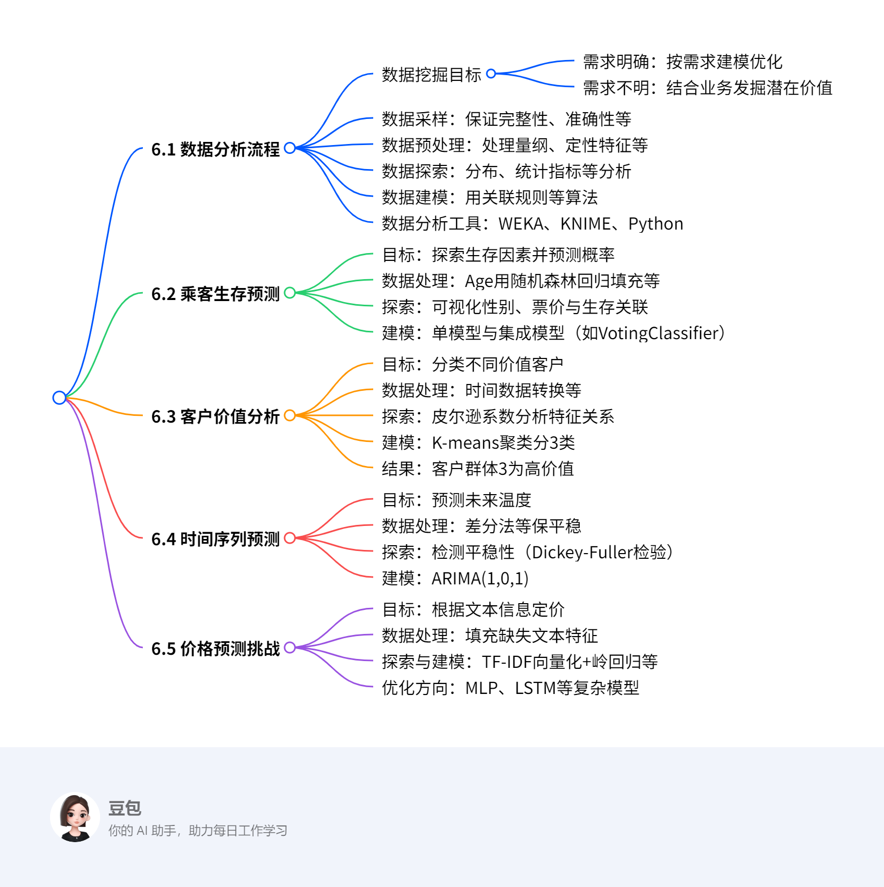

# 第六章：数据科学实践
## 总览

---
### 一段话总结
文档围绕数据科学实践展开，首先介绍数据分析流程，包括明确数据挖掘目标（分需求明确与不明情况）、数据采样（需保证完整性等）、预处理（处理量纲等问题）、探索（分布等分析）、建模（用关联规则等算法）及工具（如Python）；接着通过四个案例实践，泰坦尼克号乘客生存预测中对Age等特征预处理并建模，客户价值分析用K-means聚类分高、中、低价值客户，时间序列预测用ARIMA算法处理温度数据，价格预测挑战用TF-IDF和岭回归等处理文本信息，各案例均涵盖目标、数据处理、建模及结果分析等关键环节。

---
### 思维导图


---
### 详细总结
### 第六章 数据科学实践
#### 6.1 数据分析流程
- **数据挖掘目标**：需求明确时针对需求建模优化，不明确时结合业务发掘数据潜在价值，如电商系统中差异化营销、刷单分析、销售趋势预测等。
- **数据采样**：需保证数据完整性（处理缺失值）、准确性（排重纠错）、一致性（统一特征描述）、及时性（更新最新数据）。
- **数据预处理**：解决量纲不一致（标准化等）、定性特征（哑编码）、缺失值（均值/回归填充）、异常值（依场景处理）。
- **数据探索**：通过分布分析（直方图）、统计指标（集中/离中趋势）、周期性（时序数据）、关联分析（皮尔逊系数）观察数据规律。
- **数据建模**：用关联规则、监督/无监督学习算法从数据中找规律预测。
- **数据分析工具**：WEKA（开源机器学习软件）、KNIME（模块化数据流水线）、Python（灵活数据处理与算法封装）。

#### 6.2 乘客生存预测案例
- **目标**：探索泰坦尼克号乘客生存因素，据信息预测生存概率。
- **数据字段**：含Age、Fare、Sex等12个字段。
- **数据预处理**：
    - Cabin缺失值赋'U0'或二值化（1/0）。
    - Embarked用众数填充。
    - Age用RandomForestRegressor回归预测填充。
    - Sex转二值变量（男0女1），Fare分箱离散化，丢弃无用特征。
- **数据探索**：可视化性别、票价与生存关联，如女性生存概率更高。
- **模型构建**：用决策树、随机森林等单模型及VotingClassifier集成模型。

#### 6.3 客户价值分析案例
- **目标**：分类不同价值客户，制定个性化服务。
- **数据字段**：含Flight_count、Avg_discount等8个字段。
- **数据处理**：Fare等缺失值按案例1处理，时间数据用间隔代替。
- **数据探索**：皮尔逊系数显示Flight_count、Flight_mileage和Avg_discount相关性强。
- **模型构建**：K-means聚类分3类（高、中、低价值）。
- **结果**：

|客户类别|聚类个数|Flight_count|Avg_discount|Flight_mileage|Months|
|----|----|----|----|----|----|
|客户群体1|5304|-0.0934|0.0048|-0.1481|1.2378|
|客户群体2|4287|-0.5537|0.5205|-0.6870|-0.5909|
|客户群体3|3688|0.7654|-0.6482|0.9774|-0.3325|

#### 6.4 时间序列预测案例
- **目标**：据二战时期温度记录预测未来温度。
- **数据字段**：含STA、Date、MeanTemp。
- **数据探索**：温度具季节性，用滚动平均和Dickey-Fuller检验平稳性。
- **数据处理**：差分法和滚动平均法使序列平稳。
- **模型构建**：ARIMA(1,0,1)，据ACF和PACF确定参数p=1、q=1。

#### 6.5 价格预测挑战案例
- **目标**：据商品描述、类别和品牌信息定价。
- **数据字段**：含name、brand_name等7个字段。
- **数据处理**：category_name和brand_name缺失值填充标识符。
- **探索与建模**：TF-IDF向量化文本，用岭回归建模，可优化为MLP、LSTM等复杂模型。

---
### 关键问题
1. **数据分析流程包含哪些核心步骤？**
    - 答：包含数据挖掘目标确定（分需求明确与不明）、数据采样（保证完整性等）、数据预处理（处理量纲、缺失值等）、数据探索（分布、关联等分析）、数据建模（用算法找规律）、数据分析工具选择（如Python）。
2. **乘客生存预测案例中，Age特征如何处理？**
    - 答：因逃生遵循“妇女、儿童和老人优先”，不直接用均值/众数填充，而是用RandomForestRegressor回归模型，以Fare、Pclass等完整特征为输入，预测缺失的Age值。
3. **时间序列预测中，如何确定ARIMA模型的参数？**
    - 答：通过自相关函数（ACF）和偏自相关函数（PACF）确定，PACF第一次越过上置信区间的滞后值为p（如p=1），ACF第一次越过上置信区间的滞后值为q（如q=1），d为差分阶数（使序列平稳的差分次数，此处d=0）。
## 6.1 数据分析流程
## 6.1 数据分析流程
### 6.1.1 数据挖掘目标
- **核心定义**：明确数据分析的方向，分为两种场景：
    - **需求明确**：针对具体需求构建模型并优化，例如电商系统中根据用户消费水平实现差异化营销。
    - **需求不明**：结合业务背景发掘数据潜在价值，如分析商家销售行为识别刷单现象。
- **电商场景案例**：
    - 目标1：对不同用户群体推荐商品，实现精准营销。
    - 目标2：通过销售行为和评分分析刷单行为，提升平台信誉。
    - 目标3：基于历史销售数据预测趋势，推荐当季商品。

### 6.1.2 数据采样
- **质量要求**：确保数据完整、准确、一致、及时，避免“脏数据”影响分析。
- **具体策略**：
    - **完整性**：处理缺失值，如根据场景用均值、回归等方法填充。
    - **准确性**：去重、纠错，排除错误数据。
    - **一致性**：统一不同分析人员对数据特征的描述标准。
    - **及时性**：实时更新数据，避免因数据滞后导致问题。

### 6.1.3 数据预处理
- **处理对象**：原始数据中不完整、异常、量纲不一致或定性特征等问题。
- **关键方法及例子**：
    - **量纲不一致**：使用标准化法（如Z-score）或区间放缩法（如Min-Max），例如将身高（cm）和体重（kg）统一量纲。
    - **定性特征**：通过哑编码转换为定量数据，如性别“男/女”转换为[1,0]或[0,1]。
    - **缺失值填充**：
        - 简单方法：用均值、中位数、众数填充，如填充年龄缺失值用均值。
        - 回归填充：用RandomForestRegressor根据Fare、Pclass等特征预测Age缺失值。
    - **异常值处理**：依场景判断，如金融数据中大额交易可能为异常值，需单独分析或剔除。

### 6.1.4 数据探索
- **核心目的**：分析干净数据的规律、趋势及价值。
- **分析方法及实例**：
    - **分布分析**：绘制频率直方图或茎叶图，观察数据分布，如分析学生成绩分布判断是否符合正态分布。
    - **统计指标分析**：
        - 集中趋势：计算均值、中位数、众数，如某班级平均成绩。
        - 离中趋势：计算方差、标准差，如各学生成绩与平均分的离散程度。
    - **周期性分析**：对时序数据（如气温）用时序算法捕捉季节周期性。
    - **关联分析**：用皮尔逊系数、判定系数分析变量相关性，如身高与体重的相关性。

### 6.1.5 数据建模
- **核心逻辑**：通过算法发掘数据潜在规律，与数据探索的浅分析不同，需构建具体模型。
- **算法类型及应用**：
    - **关联规则**：如“购物篮分析”中发现“买啤酒的人常买尿布”。
    - **监督学习**：用随机森林、SVM等对泰坦尼克号乘客数据建模预测生存概率。
    - **无监督学习**：用K-means对客户价值分群，识别高价值客户。

### 6.1.6 数据分析工具
- **工具特点及应用场景**：
    - **WEKA**：开源机器学习软件，支持预处理、分类、聚类和可视化，适合初学者用Java或命令行操作。
    - **KNIME**：基于Java的模块化数据流水线工具，集成多种机器学习组件，适合流程化分析。
    - **Python**：
        - 优势：有Pandas、Scikit-learn等库，支持数据提取、处理及算法封装。
        - 应用：用Pandas读取CSV数据，用Scikit-learn的StandardScaler进行标准化。
## 6.2 案例1-乘客生存预测
### 6.2.1 数据挖掘目标
- **背景**：泰坦尼克号沉船事件中，2224名乘客和机组人员中有1502人死亡，生存与性别、年龄、社会阶层等因素相关。
- **目标**：探索影响生存的因素，基于乘客信息预测生存概率。

### 6.2.2 数据导入与字段说明
- **数据导入**：
    - 使用`pandas`读取训练集和测试集：`train_data = pd.read_csv(...)`、`test_data = pd.read_csv(...)`。
    - 合并数据并标记测试集生存状态：`test_data['Survived'] = 0`、`concat_data = train_data.append(test_data)`。
- **核心字段**：
    - `Age`（年龄）、`Fare`（票价）、`Pclass`（船舱等级）、`Sex`（性别）、`Survived`（是否获救）等-。

### 6.2.3 数据预处理
#### 缺失值处理
- **Cabin特征**：
    - **方案1**：缺失值赋特定标签`U0`：`concat_data['Cabin'] = concat_data.Cabin.fillna('U0')`。
    - **方案2**：二值化表示有无船舱（有舱为`1`，无舱为`0`）-。
- **Age特征**：
    - **原因**：逃生遵循“妇女、儿童优先”，直接填充均值不合理。
    - **步骤**：
        1. 用`Fare`、`Pclass`等特征构建随机森林回归模型。
        2. 划分训练集（`Age`非空）和预测集（`Age`空值）。
        3. 训练模型：`regr = RandomForestRegressor(n_estimators=1000)`。
        4. 预测并填充缺失值：`concat_data.loc[concat_data.Age.isnull(), 'Age'] = predict_ages`。
- **Fare与Embarked**：
    - `Fare`按船舱等级用众数填充，`Embarked`用众数或均值填充-。

#### 特征转换
- **定性特征处理**：
    - `Sex`转二值变量：男性→0，女性→1，使用`pd.get_dummies`生成哑变量-。
- **量纲统一**：
    - `Age`标准化：`StandardScaler().fit_transform(concat_data.Age.values.reshape(-1,1))`。
- **特征离散化**：
    - `Fare`分5箱并因子化：`pd.qcut(concat_data.Fare, 5)`→`pd.factorize`。
- **无用特征丢弃**：
    - 移除`Embarked`、`PassengerId`、`Name`等不相关特征。

### 6.2.4 数据探索
- **可视化分析**：
    - **性别与生存**：按`Sex`分组计算`Survived`均值，绘制柱状图，显示女性生存概率显著高于男性-。
    - **票价与生存**：用箱线图展示不同`Survived`状态下的`Fare`分布，高票价群体生存概率更高。

### 6.2.5 模型构建
#### 单模型与集成模型
- **单模型**：决策树、随机森林、支持向量机（SVM）、神经网络等。
- **多模型集成**：
    - **方法**：使用`VotingClassifier`集成多个模型，采用`soft voting`策略。
    - **示例配置**：
        -  estimators = [('rfc', 随机森林), ('dtc', 决策树), ('svm', SVM)]
        -  weights = [1, 1, 3]（SVM权重更高）。

### 6.2.6 关键求解步骤总结
1. **数据预处理流程**：
    - 缺失值填充（Age用回归，Cabin用二值化）→ 定性特征转换 → 标准化与离散化 → 丢弃无用特征。
2. **模型训练示例**：
    - 集成模型训练：`vclf.fit(预处理后数据, 生存标签)`，通过权重分配提升预测精度。
## 6.3 案例2 – 客户价值分析
### 6.3.1 数据挖掘目标
- **背景**：信息时代企业面临用户喜好捕捉困难，需通过海量数据分类客户，区分价值并制定个性化服务，实现利润最大化。
- **优化目标**：无具体预设目标，需通过数据分析发掘潜藏价值，如识别高价值客户群体。

### 6.3.2 数据导入与字段说明
- **数据字段**：
    - `Start_time`：初次飞行时间
    - `Fare`：飞行费用
    - `Age`：年龄
    - `Avg_discount`：平均折扣率
    - `End_time`：最近飞行时间
    - `City`：生活城市
    - `Flight_count`：飞行次数
    - `Flight_mileage`：飞行里程数

### 6.3.3 数据预处理
#### 缺失值处理
- **方法**：沿用案例1的处理方式，对`Fare`、`City`、`Age`的缺失值采用均值、众数或回归填充。
#### 时间数据转换
- **问题**：`Start_time`和`End_time`为字符串类型，需转换为可分析的数值特征。
- **方案**：用时间间隔（如“最近飞行时间-初次飞行时间”）代替原始时间字段，反映用户活跃周期。

### 6.3.4 数据探索
#### 相关性分析
- **方法**：计算皮尔逊系数矩阵，分析特征间相关性。
- **关键发现**：
    - `Flight_count`（飞行次数）、`Flight_mileage`（飞行里程数）、`Avg_discount`（平均折扣率）三者相关性较强。
    - 例如：飞行次数越多，飞行里程数通常越高，而平均折扣率可能越低（高价值客户享受折扣较少）。

### 6.3.5 模型构建：K-means聚类
#### 特征选择
- 丢弃`Fare`、`Age`等相关性较弱或非核心特征，保留`Flight_count`、`Avg_discount`、`Flight_mileage`、`Months`（飞行时间间隔）。
#### 聚类步骤
1. **数据准备**：标准化或归一化特征，确保量纲一致。
2. **模型训练**：
```python
from sklearn.cluster import KMeans
# 假设已处理好数据为data
kmeans = KMeans(n_clusters=3, random_state=42)
kmeans.fit(data)
```
3. **分群结果**：将客户分为3类（高、中、低价值）。
#### 聚类中心分析
| 客户类别 | 聚类个数 | Flight_count | Avg_discount | Flight_mileage | Months |
|----------|----------|--------------|--------------|----------------|--------|
| 客户群体1 | 5304     | -0.0934      | 0.0048       | -0.1481        | 1.2378 |
| 客户群体2 | 4287     | -0.5537      | 0.5205       | -0.6870        | -0.5909|
| 客户群体3 | 3688     | 0.7654       | -0.6482      | 0.9774         | -0.3325|

### 6.3.6 结果分析与营销策略
#### 高价值客户识别
- **客户群体3特征**：
    - `Flight_count`和`Flight_mileage`数值最大（飞行频繁、里程长）。
    - `Avg_discount`数值最小（折扣率低，支付能力强）。
- **策略**：优先提供个性化服务（如专属客服、高端权益），提升满意度以延长消费周期。
#### 中低价值客户特征
- **客户群体2**：平均折扣率高但飞行次数少，可能为促销敏感型客户，可通过限时折扣刺激消费。
#### 聚类应用价值
- 通过分群实现资源精准投放，例如针对高价值客户减少折扣，针对促销敏感型客户推送优惠活动，最大化企业利润。

### 6.3.7 关键求解流程总结
1. **数据预处理**：
    - 缺失值填充 → 时间数据转换为间隔特征 → 标准化处理。
2. **相关性分析**：
    - 计算皮尔逊系数 → 筛选核心特征（飞行次数、里程数、折扣率等）。
3. **聚类分群**：
    - 确定聚类数k=3 → 训练K-means模型 → 分析聚类中心特征。
4. **策略制定**：
    - 根据各群体特征设计差异化营销策略，如高价值客户聚焦服务质量，中低价值客户聚焦折扣激励。
## 6.4 案例3 – 时间序列预测
### 6.4.1 数据挖掘目标
- **背景**：基于二战时期某气象站的温度记录数据（含时间标签），通过历史温度序列预测未来该地区的温度变化。
- **核心差异**：与回归分析不同，时间序列预测依赖数据的先后顺序（改变顺序会影响模型结果），需捕捉时序特征。

### 6.4.2 数据导入与字段说明
- **数据字段**：
    - `STA`：气象台站号（标识站点）。
    - `Date`：温度测量时间（时序关键特征）。
    - `MeanTemp`：平均温度值（目标预测变量）。

### 6.4.3 数据探索
#### 季节性分析
- **方法**：绘制`MeanTemp`随`Date`变化的时间序列图。
- **结论**：温度呈现明显季节性规律（夏季高温、冬季低温），需在模型中考虑季节性因素。

#### 平稳性检测
- **滚动平均与方差**：
    - 计算固定窗口（如5期）的滚动均值和标准差，观察是否随时间波动。
    - 若均值/方差显著变化，说明序列非平稳。
- **Dickey-Fuller检验**：
    - **原理**：检验序列是否存在单位根（非平稳的标志）。
    - **决策规则**：p值<0.05时拒绝原假设（序列平稳）。

### 6.4.4 数据处理：平稳化序列
#### 差分法
- **公式**：`timeSeries_diff = timeSeries - timeSeries.shift(periods=1)`（一阶差分）。
- **作用**：消除序列中的趋势和季节性，例如对温度序列做一阶差分后，可减弱长期趋势影响。

#### 滚动平均法
- **公式**：  
  \[\hat{y_t} = \frac{x_{t-1} + x_{t-2} + ... + x_{t-N}}{N}\]
  （N为窗口大小，如N=5时取最近5期均值）。
- **代码示例**：`timeSeries_moving_diff = timeSeries.rolling(5).mean()`。
- **效果**：使序列均值趋于稳定，适用于短期平滑预测。

### 6.4.5 模型构建：ARIMA算法
#### 模型原理
- **核心思想**：将非平稳序列转化为平稳序列后，建立“自回归（AR）+差分（I）+移动平均（MA）”的组合模型。
- **参数含义**：
    - `p`：自回归阶数（依赖过去p期值）。
    - `d`：差分阶数（使序列平稳的差分次数）。
    - `q`：移动平均阶数（依赖过去q期误差）。

#### 参数确定方法
1. **ACF（自相关函数）**：  
   衡量相距k期的序列值相关性，用于确定`q`值（ACF首次超出置信区间的滞后值）。
2. **PACF（偏自相关函数）**：  
   衡量相距k期的序列值相关性（排除中间期影响），用于确定`p`值（PACF首次超出置信区间的滞后值）。
3. **案例参数**：  
   - 从ACF和PACF图中得出`p=1`（PACF首超置信区间在k=1），`q=1`（ACF首超在k=1），`d=0`（差分后已平稳）。

#### 模型训练步骤
1. **数据平稳化**：使用差分法或滚动平均法处理原始温度序列。
2. **参数确定**：通过ACF/PACF图确定`(p,d,q)=(1,0,1)`。
3. **模型构建**：  
   ```python
   from statsmodels.tsa.arima.model import ARIMA
   model = ARIMA(平稳后的序列, order=(1, 0, 1))
   model_fit = model.fit(disp=0)
   ```
4. **预测应用**：使用`model_fit.forecast(steps=未来期数)`生成温度预测值。

### 6.4.6 关键求解流程总结
1. **数据预处理**：  
   绘制时序图识别季节性 → 滚动平均/Dickey-Fuller检验平稳性 → 差分/滚动平均法平稳化序列。
2. **模型构建**：  
   ACF/PACF分析确定ARIMA参数 → 训练模型 → 基于历史数据预测未来温度。
3. **示例场景**：  
   若输入1945年1月至1946年1月的月均温度，通过ARIMA(1,0,1)可预测1946年2月温度，需考虑季节性波动对预测的影响。
## 6.5 案例4 – 价格预测挑战
### 6.5.1 数据挖掘目标
- **背景**：网上海量商品定价困难，服装具季节性价格趋势，电子产品依规格波动，需据商品文本信息（描述、类别、品牌）合理定价。
- **分析目标**：通过商品描述、类别、品牌信息及训练数据价格，为新商品定价，重点探索文本信息处理方式。

### 6.5.2 问题描述与数据示例
- **商品信息示例**：
    | 商品名称 | 品牌名称 | 商品描述 | 商品类别 |
    |---|---|---|---|
    | 美杜莎羊皮飞行员夹克外套男 | Versace | 时尚衣领设计，经典百搭等 | 服饰 |
    | 新款秋冬季男士韩版潮流连帽夹克 | 美特斯邦威 | 保暖、时尚设计 | 服饰 |
- **核心挑战**：品牌（如Versace与美特斯邦威）和描述细节（面料、工艺）对价格影响显著，需量化文本特征。

### 6.5.3 数据导入与预处理
#### 数据字段说明
- `train_id`：训练序号
- `name`：商品名称
- `item_condition_id`：物品状态
- `brand_name`：品牌名称
- `shipping`：是否包邮
- `item_description`：商品描述
- `category_name`：商品类别
- `price`：商品价格（目标变量）

#### 缺失值处理
- **文本特征缺失填充**：
    - `category_name`缺失值填充`'MISS'`：`df['category_name'] = df['category_name'].fillna('MISS')`
    - `brand_name`缺失值填充`'missing'`：`df['brand_name'] = df['brand_name'].fillna('missing')`

### 6.5.4 数据探索与建模方法
#### 文本特征向量化
- **TF-IDF向量化**：
    - **原理**：通过词频（TF）和逆文档频率（IDF）衡量词语重要性，公式为：
    \[w_{x,y} = tf_{x,y} \times \log\left(\frac{N}{df_x}\right)\]
    - **代码示例**：
    ```python
    from sklearn.feature_extraction.text import TfidfVectorizer
    vectorizer = TfidfVectorizer(ngram_range=(1, 3))  # 考虑1-3元语法
    text_features = vectorizer.fit_transform(df['item_description'])
    ```

#### 基础模型：岭回归（Ridge Regression）
- **模型构建步骤**：
    1. **特征拼接**：合并商品名称、品牌、描述等文本特征。
    2. **向量化**：使用TF-IDF或CountVectorizer转换文本为数值向量。
    3. **模型训练**：
    ```python
    from sklearn.linear_model import Ridge
    from sklearn.pipeline import Pipeline
    
    # 构建特征联合处理流程
    pipeline = Pipeline([
        ('vectorizer', FeatureUnion([
            ('name', CountVectorizer(ngram_range=(1, 2), max_features=50000)),
            ('description', TfidfVectorizer(ngram_range=(1, 3))),
            # 其他特征处理...
        ])),
        ('regressor', Ridge(alpha=0.5, max_iter=500))
    ])
    pipeline.fit(X_train, y_train)
    ```

### 6.5.5 进阶优化方法
#### 特征工程优化
- **无意义符号去除**：过滤特殊字符、标点，提升文本纯净度。
- **关键词组合**：如“苹果+手机”组合特征的价格预测价值高于单独关键词。

#### 复杂模型应用
- **多层全连接网络（MLP）**：
    - 处理数值特征（如`item_condition_id`）和文本特征的向量化结果。
- **卷积神经网络（TextCNN）**：
    - **原理**：通过滑动窗口提取文本局部特征，捕捉“高端面料”“限量款”等关键短语。
    - **结构示例**：嵌入层→卷积层→池化层→全连接层。
- **循环神经网络（LSTM/GRU）**：
    - 处理长文本描述的时序依赖关系，如“手工制作→高价格”的语义关联。

#### 集成学习策略
- **模型组合**：
    - 结合岭回归、MLP、TextCNN的预测结果，采用加权平均或投票机制。
    - 示例代码：
    ```python
    from sklearn.ensemble import VotingRegressor
    from sklearn.neural_network import MLPRegressor
    from sklearn.linear_model import Ridge
    
    model1 = Ridge(alpha=0.5)
    model2 = MLPRegressor(hidden_layer_sizes=(100, 50))
    # 假设textcnn已封装为模型3
    ensemble = VotingRegressor(estimators=[('ridge', model1), ('mlp', model2)], weights=[2, 3])
    ```

### 6.5.6 关键求解流程总结
1. **数据预处理**：
    - 填充文本缺失值→清洗特殊符号→标准化数值特征。
2. **文本特征处理**：
    - 分词→TF-IDF/CountVectorizer向量化→特征拼接（名称+描述+品牌）。
3. **模型训练与优化**：
    - 基础模型（岭回归）→复杂模型（TextCNN/MLP）→集成学习提升精度。
4. **示例场景**：
    - 输入新商品“某奢侈品牌羊绒大衣”的描述，通过TF-IDF提取“羊绒”“奢侈品牌”等特征，经岭回归预测价格，再结合TextCNN对“高端工艺”关键词的识别，调整最终定价。