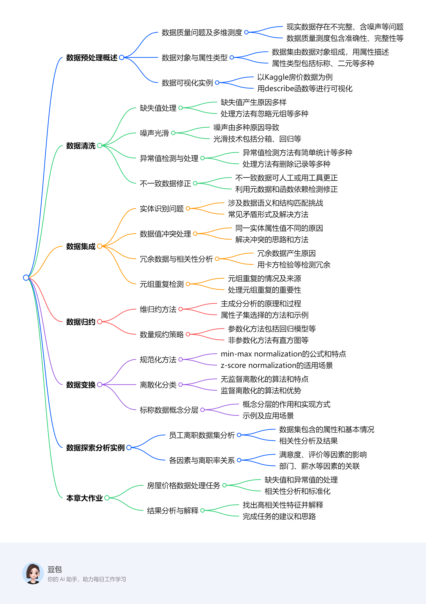

# 第四章：数据预处理的基本方法
该文档围绕数据预处理展开，涵盖数据清洗、集成、归约、变换等方法及应用实例，旨在提升数据质量，为后续分析和挖掘奠定基础，助力高质量决策。

1. **数据预处理概述**
    - **意义与目标**：现实数据存在不完整、含噪声、不一致等问题，影响挖掘结果和决策质量。数据质量测度包括准确性、完整性、一致性等多个维度，数据预处理旨在提升数据质量，为后续分析提供可靠基础。
    - **背景知识**：数据集由数据对象组成，数据对象用属性描述，属性类型包括标称、二元、序数、数值（离散和连续）等。可通过分位数图、直方图等对数据进行基本统计描述和可视化。
    - **数据可视化实例**：以Kaggle房价预测竞赛数据集为例，利用describe函数、绘制直方图等方式对数据进行可视化，可快速了解数据的基本情况，如分布特征、偏态和峰度等。
2. **数据清洗**
    - **缺失值处理**：缺失值产生原因多样，处理方法包括忽略元组、手工填入、填充全局常数、填充属性中心度量、填充最可能的值等，可根据数据集特点选择合适方法。
    - **噪声光滑**：噪声由多种因素导致，常用光滑技术有分箱、回归和离群点分析。分箱通过考察邻居值平滑数据，回归利用函数拟合数据，离群点分析检测并处理异常值。
    - **异常值的检测和处理**：异常值与总体数据行为不同，检测方法包括简单统计、3σ原则、箱型图、基于模型、基于距离、基于密度和基于聚类等。处理方法有删除记录、视为缺失值、用平均值修正或不处理等。
    - **不一致数据的修正**：可通过人工更正结合知识工程工具，利用元数据和属性间函数依赖检测并修正不一致数据。
3. **数据集成**
    - **实体识别问题**：数据集成需解决数据语义多样性和结构匹配问题，实体识别用于统一不同源数据矛盾，常见矛盾形式有同名异义、异名同义等，可利用元数据解决。
    - **检测并解决数据值冲突**：不同数据源对同一实体的属性值可能因多种因素不同，如单位、编码等，解决冲突需统一标准和转换规则。
    - **冗余数据与相关性分析**：数据集成易导致冗余，冗余属性可通过相关分析检测，标称数据用卡方检验，数值数据用相关系数和协方差评估相关性，进而删除冗余属性。
    - **元组重复**：需检测元组级重复，去规范化表使用可能导致数据冗余和不一致，应及时发现并处理。
4. **数据归约**
    - **策略**：包括维归约、数量归约和数据压缩，目标是在保持数据完整性前提下减小数据集容量，提高分析效率。
    - **维归约**：主成分分析（PCA）通过创建新变量集组合属性要素，对数据进行投影和降维；属性子集选择方法如向前选择、向后删除和决策树归纳，可筛选出重要属性。
    - **数量规约**：参数化方法有回归模型和对数线性模型；非参数化方法包括直方图、聚类、抽样和数据立方体聚集等，可根据数据特点选择合适方法进行数量规约。
5. **数据变换**
    - **策略**：包含平滑、聚集、属性构造、规范化、离散化和概念分层生成等，旨在将数据转换为适合挖掘的形式。
    - **规范化**：min - max normalization通过线性变换映射数据；z - score normalization基于均值和标准差规范化；decimal scaling通过移动小数点规范化，不同方法适用于不同场景。
    - **离散化**：将连续属性范围分成区间，减少属性值个数，分为无监督离散化（等宽算法、等频算法、K - means聚类算法）和监督离散化（ChiMerge算法等），可根据数据特点和需求选择。
    - **标称数据的概念分层生成**：标称数据值无序，概念分层可将数据变换到多个粒度值，可由用户说明或通过数据分组实现。
6. **数据探索分析实例**：以员工离职数据集为例，通过数据导入、统计概况分析、相关性矩阵和热图绘制、各属性分布分析等，找出影响员工离职的因素，如满意度、工作年限、评价等，为后续决策提供依据。
7. **本章大作业**：利用房屋价格数据集，完成缺失值检测与处理、异常值检测、相关性分析、属性标准化、离散化以及找出与房价相关性最高的三个特征并解释等任务，进一步巩固所学数据预处理知识和技能。 

## 数据预处理概述
该内容围绕数据预处理展开，涵盖数据预处理的意义、背景知识、可视化实例等方面，为后续数据处理和分析奠定基础，具体如下：

1. **数据预处理的意义与目标**
    - **数据质量问题**：现实世界的数据存在不完整、含噪声、不一致等问题，会影响挖掘结果和决策质量。
    - **数据质量的多维测度**：包括准确性、完整性、一致性、时效性、相关性、可信性和可解释性。例如，收集设备故障等会导致数据准确性问题；商品销售中顾客信息缺失体现了完整性问题；客户通讯录邮编与城市不匹配属于一致性问题。
2. **背景知识**
    - **数据对象与属性类型**：数据集由数据对象组成，数据对象用属性描述，属性类型包括标称属性（如发色用0、1表示）、二元属性（如性别）、序数属性（如餐厅评价）、数值属性（可分为离散和连续，如头发颜色是离散的，成绩是连续的）。
    - **数据的图形显示**：分位数图用于观察单变量数据分布趋势；分位数 - 分位数图比较两个概率分布；直方图概括属性分布；散点图确定两个数值变量间的联系。
3. **数据可视化实例**：以Kaggle房价预测竞赛数据集为例，使用describe函数统计汇总数据，绘制直方图观察SalePrice属性分布，计算偏态和峰度，绘制OverallQual/SalePrice箱型图及Grlivearea/SalePrice散点图，以了解数据基本情况。 

## 数据清洗
这部分内容主要介绍了数据清洗的相关知识，包括数据清洗的主要任务、针对不同问题的处理方法以及具体示例，具体如下：

1. **数据清洗的主要任务**：包含缺失值处理、噪声光滑、异常值的检测和处理以及不一致数据的修正。
2. **缺失值处理**
    - **缺失值产生的原因**：设备出错、与其他记录数据不一致被删除、因误解未录入、录入时被认为不重要等，如销售数据中客户收入可能因上述原因缺失。
    - **处理方法**：
        - **忽略元组**：适用于数据集大且元组缺失值多的情况，但会浪费元组剩余的非缺失属性值，当各属性缺失值百分比变化大时性能差。
        - **手工填入缺失值**：操作繁琐，数据量大时不可行。
        - **填充全局常数**：用同一个常量（如“Unknown”或“NAN”）替换缺失值，但可能使数据挖掘程序误判为新类别，可靠性欠佳。
        - **填充属性的中心度量（均值或中位数）**：数据分布对称时用均值，如电商平台顾客平均收入可填充“收入”缺失值；分布倾斜时用中位数；也可用同类样本的属性均值或中位数填充。
        - **填充最可能的值**：通过回归、贝叶斯方法或决策树归纳等确定，该方法利用已有数据信息多，应用普遍。
3. **噪声光滑**
    - **噪声的定义及产生原因**：噪声是可测度变量中的随机错误或偏差，由错误的数据收集手段、数据输入问题、数据传送问题、技术限制等导致。
    - **光滑技术**：
        - **分箱**：将数据排序后分割到相等深度的“桶”中，根据桶均值、中间值或边界值等平滑数据。
        - **回归**：让数据适配函数（如线性回归函数）来平滑，线性回归旨在找出两个变量间的“最佳”直线以进行预测。
        - **离群点分析**：通过聚类等方法检测离群点，将落在簇集合之外的值视为离群点。
4. **异常值的检测和处理**
    - **异常值的定义**：因系统误差、人为误差或数据变异，与总体行为特征、结构或相关性不同的数据。
    - **检测方法**：
        - **简单统计**：通过描述性统计分析，依据最大最小值判断变量取值是否合理，如客户年龄出现 -20岁或200岁属于异常值。
        - **3σ原则**：数据服从正态分布时，与平均值偏差超3倍标准差的值为异常值；不服从正态分布时，也可用远离平均值的标准差倍数描述。
        - **箱型图**：利用四分位距（IQR）检测异常值，也叫Tukey's test。
        - **基于模型检测**：建立数据模型，异常值是与模型拟合不佳的对象。优点是有统计学理论基础，数据充分时有效；缺点是多元数据选择少，高维数据性能差。
        - **基于距离**：定义对象间邻近性度量，远离其他对象的为异常值。优点是操作简单；缺点是时间复杂度高，不适用于大数据集，对参数敏感，无法处理不同密度区域的数据。
        - **基于密度**：局部密度显著低于近邻的点被分类为离群点，适合非均匀分布数据。优点是能定量度量，可处理不同区域数据；缺点是时间复杂度高，参数选择困难。
        - **基于聚类**：不属于任何簇的对象是离群点，但离群点会影响聚类结构，可先聚类、删除离群点后再聚类，但不一定能得到最优结果。
    - **处理方法**：删除含有异常值的记录、将异常值视为缺失值处理、用平均值修正、不处理直接挖掘建模。
5. **不一致数据的修正**：部分不一致数据可人工利用其他材料更正，如依据纸上记录更正数据输入错误；知识工程工具可检测违反限制的数据，如根据属性间函数依赖查找违规值。 
## 数据集成
这部分内容围绕数据集成展开，详细介绍了其主要任务，包括实体识别、数据值冲突处理、冗余数据与相关性分析以及元组重复检测等方面，具体总结如下：

1. **数据集成的主要任务概述**：数据集成主要任务包含实体识别问题、检测并解决数据值的冲突、冗余数据与相关性分析以及元组重复检测。
2. **实体识别问题**
    - **定义与挑战**：在数据集成时，处理数据语义多样性和结构差异，匹配多数据源模式与对象的过程就是实体识别，其任务是统一不同源数据的矛盾。
    - **常见形式及解决方法**：常见矛盾形式有同名异义（如不同数据源中ID代表不同实体）、异名同义（如不同数据源中不同字段表示同一含义）和单位不统一。通常利用元数据（即“描述数据的数据”，包含属性的名字、含义、数据类型等信息）来解决这些矛盾。
3. **检测和解决数据值冲突**：数据集成会涉及数据值冲突的检测与处理。由于表示方式、比例、编码、数据类型、单位以及字段长度等方面的差异，同一实体在不同数据源中的属性值可能不同。如重量属性在不同系统单位不同，不同学校课程设置和等级模式不同导致信息交换困难。
4. **冗余数据与相关性分析**
    - **冗余产生原因**：数据集成易产生冗余，如属性可由其他属性导出、同一属性多次出现或命名不一致等情况。
    - **检测方法**：对于标称数据，使用卡方检验检测属性间冗余；对于数值数据，通过计算相关系数和协方差评估属性间的相关性，判断是否存在冗余。相关性并不代表因果关系。
    - **实例分析**：以kaggle房价数据集为例，计算YearBuilt和YearRemodAdd两个标称属性的卡方值，因p值为1.0表明二者完全相关，可删除其一消除冗余；计算GrLivArea和SalePrice两个数值属性的协方差和相关系数，发现二者存在相关性但并非完全相关，不能删除其中任何一个属性。
5. **元组重复**：数据集成中除检测属性冗余外，还需检测元组级重复。去规范化表的使用会导致数据冗余，数据输入不正确或副本更新不一致也会引发问题。如订单数据库中订货人信息若不是订货人数据库的关键码，可能出现同一订货人名字对应不同地址的不一致情况。 

## 数据归约
该部分内容围绕数据归约展开，介绍了其定义、策略，重点阐述维归约和数量规约的多种方法及应用实例，具体如下：

1. **数据归约概述**
    - **定义**：数据仓库数据量庞大，完整数据集进行复杂分析或挖掘耗时久。数据归约是获取数据集的简约表示，在减小容量的同时保持数据完整性，确保分析结果基本相同。
    - **策略**：包含维归约、数量归约和数据压缩，且数据归约所花时间不应抵消在归约后数据挖掘节省的时间。
2. **维归约**
    - **主成分分析（PCA）**：通过创建较小的变量集组合属性要素，将原始数据投影到该集合，揭示数据联系。其过程包括数据规范化、计算标准正交向量、按重要性排序主成分、去除弱成分。PCA适用于有序和无序属性，能处理稀疏和倾斜数据，可将多维数据规约为二维，主成分还能用于多元回归和聚类分析。
    - **属性子集选择**：以Boston房价数据集为例，使用PCA方法，选取3个主成分时累计贡献率接近99%，实现从13维到3维的降维。还可使用线性回归模型和递归特征消除（RFE）模型进行属性子集选择，确定特征选择顺序。
3. **数量规约**
    - **参数化数据归约**：回归模型用直线拟合数据，如线性回归模型$Y = \alpha + \beta X$，常使用最小二乘方法；多元回归模型为$Y = b_0 + b_1X_1 + b_2X_2$。对数线性模型用于近似离散的多维概率分布，可实现维归约和数据光滑。
    - **非参数化数据归约**：直方图将属性数据分布划分为不相交子集或桶，包括等宽和等频直方图，对多种数据类型有效。聚类把数据元组划分为簇，用簇代表替换实际数据，对被污染或可组织成簇的数据效果好。抽样用小随机样本表示数据集，有多种抽样方式。数据立方体聚集对数据进行汇总和聚集。 