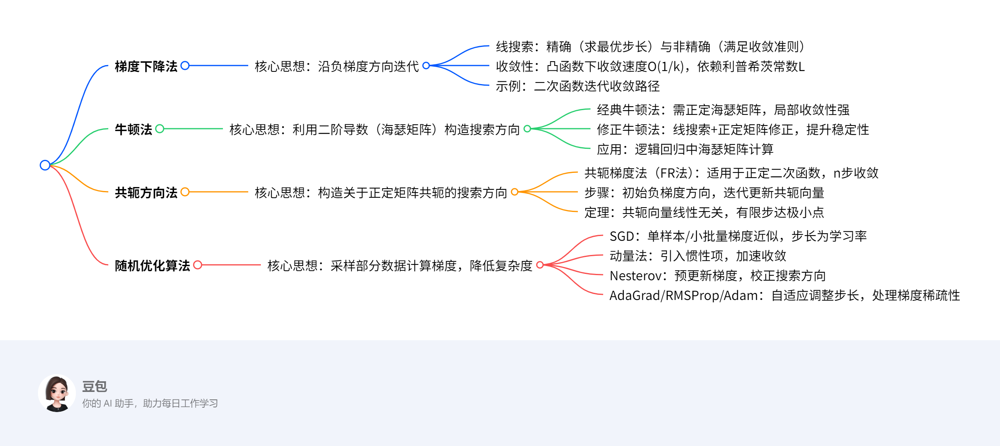

# 无约束优化
## 概述

---  
### 一段话总结  
文档围绕无约束优化算法展开，重点介绍**梯度下降法**（含精确/非精确线搜索、收敛性分析）、**牛顿法**（经典与修正版本，应用于逻辑回归）、**共轭方向法**（含共轭梯度法FR法）及**随机优化算法**（SGD、动量法、Nesterov、AdaGrad、RMSProp、Adam）。梯度下降法基于一阶导数确定下降方向，牛顿法利用二阶信息加速收敛，共轭方向法通过构造共轭向量实现有限步收敛，随机优化算法则通过采样降低计算量，适用于大规模数据场景。  

---  

---  
### 详细总结  

#### 一、梯度下降法  
**核心原理**：  
通过迭代公式 \(x^{k+1} = x^k - \alpha_k \nabla f(x^k)\) 沿负梯度方向搜索，核心在于**搜索方向**（负梯度）和**步长**（\(\alpha_k\)）的选取。  
- **线搜索**：  
  - **精确线搜索**：求一元函数 \(\phi(\alpha) = f(x^k + \alpha d^k)\) 的最小值点，计算量大，实际少用。  
  - **非精确线搜索**：满足收敛准则（如Armijo条件），确保函数值充分下降。  
- **收敛性**：  
  - 若 \(f\) 为凸函数且梯度L-利普希茨连续，取固定步长 \(0 < \alpha < 1/L\)，则收敛速度为 \(O(1/k)\)。  
  - **示例**：二次函数 \(f(x,y) = x^2 + 10y^2\) 从(10,1)出发，固定步长0.085，15次迭代收敛至原点附近（图略）。  

#### 二、牛顿法  
**核心原理**：  
利用二阶泰勒展开近似目标函数，通过牛顿方程 \(\nabla^2 f(x^k) d^k = -\nabla f(x^k)\) 求解搜索方向，迭代公式为 \(x^{k+1} = x^k - (\nabla^2 f(x^k))^{-1} \nabla f(x^k)\)。  
- **经典牛顿法**：  
  - **优势**：二阶收敛，局部收敛速度快。  
  - **局限**：需海瑟矩阵正定且初始点接近最优解，否则可能发散。  
- **修正牛顿法**：  
  - 引入线搜索确定步长，并修正海瑟矩阵为正定（如添加正定矩阵E），提升稳定性。  
- **应用：逻辑回归**：  
  - 目标函数：\(\ell(x) = \frac{1}{m}\sum \ln(1+e^{-b_i a_i^T x}) + \lambda\|x\|_2^2\)  
  - 梯度：\(\nabla \ell(x) = -\frac{1}{m}A^T(b - b \odot p(x)) + 2\lambda x\)  
  - 海瑟矩阵：\(\nabla^2 \ell(x) = \frac{1}{m}A^T W(x)A + 2\lambda I\)（\(W(x)\)为对角矩阵）  

#### 三、共轭方向法  
**核心原理**：  
构造关于正定矩阵A共轭的方向（\(d^{(i)^T} A d^{(j)} = 0, i \neq j\)），对于正定二次函数，至多n步收敛至极小点。  
- **共轭梯度法（FR法）**：  
  - **步骤**：  
    1. 初始方向取负梯度 \(d^{(1)} = -g_1\)。  
    2. 迭代更新方向 \(d^{(k)} = -g_k + \beta_{k-1} d^{(k-1)}\)，其中 \(\beta_{k-1} = \frac{\|g_k\|^2}{\|g_{k-1}\|^2}\)。  
    3. 步长 \(\lambda_k = \frac{g_k^T g_k}{d^{(k)^T} A d^{(k)}}\)。  
  - **定理**：对于n维正定二次函数，n步内收敛，且梯度两两正交。  
- **示例**：  
  目标函数 \(f(x) = x_1^2 + \frac{1}{2}x_2^2 + \frac{1}{2}x_3^2\)，初始点(1,1,1)，3步迭代收敛至(0,0,0)。  

#### 四、随机优化算法  
**核心场景**：大规模数据下无法计算全梯度，通过采样近似梯度。  
| 算法       | 核心思想                                                                 | 迭代公式                                                                 | 优势                     |  
|------------|--------------------------------------------------------------------------|--------------------------------------------------------------------------|--------------------------|  
| **SGD**    | 随机选取单样本/小批量计算梯度，降低计算量                                 | \(x^{k+1} = x^k - \alpha_k \nabla f_{s_k}(x^k)\)                             | 适合大规模数据             |  
| **动量法**  | 引入惯性项，累积历史梯度方向                                             | \(v^{k+1} = \mu v^k - \alpha_k \nabla f_{s_k}(x^k), \ x^{k+1} = x^k + v^{k+1}\) | 加速收敛，抑制震荡         |  
| **Nesterov** | 预更新当前点，利用未来梯度信息校正方向                                   | \(y^{k+1} = x^k + \mu(x^k - x^{k-1}), \ x^{k+1} = y^{k+1} - \alpha_k \nabla f_{s_k}(y^{k+1})\) | 减少梯度估计误差           |  
| **AdaGrad** | 自适应步长，分量梯度平方累积大则步长小                                   | \(G^{k+1} = G^k + g^k \odot g^k, \ x^{k+1} = x^k - \frac{\alpha}{\sqrt{G^k + \varepsilon}} \odot g^k\) | 处理稀疏梯度               |  
| **RMSProp** | 指数加权平均梯度平方，仅保留近期信息                                     | \(M^{k+1} = \rho M^k + (1-\rho)g^k \odot g^k, \ x^{k+1} = x^k - \frac{\alpha}{\sqrt{M^k + \varepsilon}} \odot g^k\) | 缓解AdaGrad步长衰减过快     |  
| **Adam**   | 结合动量与自适应步长，修正一阶矩和二阶矩的偏差                             | \(\hat{S}^k = \frac{\rho_1 S^{k-1} + (1-\rho_1)g^k}{1-\rho_1^k}, \ \hat{M}^k = \frac{\rho_2 M^{k-1} + (1-\rho_2)g^k \odot g^k}{1-\rho_2^k}, \ x^{k+1} = x^k - \frac{\alpha}{\sqrt{\hat{M}^k + \varepsilon}} \odot \hat{S}^k\) | 综合性能优，适用非凸问题     |  

---  
### 关键问题  
1. **问题**：梯度下降法与牛顿法的本质区别是什么？  
   **答案**：梯度下降法仅利用**一阶导数信息**（负梯度方向），收敛速度线性，适合大规模问题；牛顿法利用**二阶导数信息**（海瑟矩阵），收敛速度二次，但需正定海瑟矩阵且初始点接近最优解，计算量较大。  

2. **问题**：共轭梯度法为何能在有限步内收敛至正定二次函数的极小点？  
   **答案**：共轭梯度法构造的搜索方向关于正定矩阵A共轭，任意n个共轭向量线性无关，构成n维空间的一组基。对于n维二次函数，极小点可表示为初始点与共轭向量的线性组合，因此至多n步迭代即可精确收敛。  

3. **问题**：随机优化算法中，AdaGrad与RMSProp的核心改进点是什么？  
   **答案**：  
   - AdaGrad累加**所有历史梯度平方**，导致步长单调递减，后期可能过小；  
   - RMSProp通过**指数加权平均**仅保留近期梯度平方，缓解步长衰减过快问题，更适合非凸问题和稀疏梯度场景。

## 梯度下降法  

### 一、核心概念与迭代框架  
**定义**：  
梯度下降法是一种**无约束优化算法**，通过迭代更新参数，沿目标函数**负梯度方向**（最速下降方向）搜索最小值点。其核心流程为：  
1. **确定搜索方向**：负梯度方向 \(d^k = -\nabla f(x^k)\)。  
2. **确定步长**：通过线搜索（精确或非精确）确定最优步长 \(\alpha_k\)，迭代公式为：  
   \[
   x^{k+1} = x^k + \alpha_k d^k = x^k - \alpha_k \nabla f(x^k)
   \]  

**关键术语**：  
- **线搜索（Line Search）**：  
  - **精确线搜索**：求一元函数 \(\phi(\alpha) = f(x^k + \alpha d^k)\) 的最小值点，计算量较大。  
  - **非精确线搜索**：通过收敛准则（如Armijo条件）确保函数值充分下降，计算效率更高。  
- **信赖域**：在局部区域内用二阶模型近似原函数，通过求解子问题确定步长，适用于二阶可微函数。  

### 二、收敛性分析  
**前提条件**：  
- 目标函数 \(f(x)\) 为**凸函数**且**梯度L-利普希茨连续**（存在常数 \(L>0\)，使得 \(\|\nabla f(x) - \nabla f(y)\| \leq L\|x - y\|\)）。  
- 极小值 \(f^*\) 存在且可达。  

**核心定理**：  
1. **二次上界**：  
   对任意 \(x, y\)，有  
   \[
   f(y) \leq f(x) + \nabla f(x)^T(y - x) + \frac{L}{2}\|y - x\|^2
   \]  
   **证明**：利用积分中值定理和梯度利普希茨条件，推导见文档公式。  

2. **收敛速度**：  
   取固定步长 \(0 < \alpha < \frac{1}{L}\)，则迭代点列 \(\{x^k\}\) 的函数值收敛到最优值，且收敛速度为 **\(O(\frac{1}{k})\)**（次线性收敛）。  
   **证明**：通过递推不等式累加，结合凸函数性质，可得：  
   \[
   f(x^k) - f^* \leq \frac{\|x^0 - x^*\|^2}{2k\alpha}
   \]  

### 三、求解方法与示例  
**1. 精确线搜索求解二次函数**  
**示例**：  
目标函数：\(f(x, y) = x^2 + 10y^2\)（正定二次函数，极小点为 \((0,0)\)）。  
**步骤**：  
1. **初始点**：\(x^0 = (10, 1)\)，梯度 \(\nabla f(x^0) = (20, 20)\)。  
2. **搜索方向**：\(d^0 = -\nabla f(x^0) = (-20, -20)\)。  
3. **精确线搜索**：求 \(\alpha_0 = \arg\min_\alpha f(x^0 + \alpha d^0)\)。  
   代入得：  
   \[
   f(10-20\alpha, 1-20\alpha) = (10-20\alpha)^2 + 10(1-20\alpha)^2  
   \]  
   对 \(\alpha\) 求导并令导数为零，解得 \(\alpha_0 = \frac{11}{500} = 0.022\)。  
4. **迭代更新**：  
   \[
   x^1 = (10 - 20\times0.022, 1 - 20\times0.022) = (9.56, 0.56)
   \]  
5. **重复迭代**：经多次迭代后收敛至 \((0,0)\)，路径呈“之字形”（因等高线为椭圆，梯度方向垂直于等高线）。  

**2. 固定步长梯度下降**  
**示例**：  
目标函数同上，取固定步长 \(\alpha = 0.085\)。  
**迭代公式**：  
\[
x^{k+1} = (x_k - 0.085\times2x_k, \ y_k - 0.085\times20y_k) = (0.83x_k, 0.3y_k)
\]  
**收敛路径**：  
- 第1次迭代：\(x^1 = (8.3, 0.3)\)  
- 第15次迭代：接近 \((0,0)\)，收敛速度受限于二次函数的**条件数**（最大与最小特征值之比，此处为10，导致等高线扁平，迭代路径折返）。  

### 四、重点总结  
| 关键点         | 详细说明                                                                 |  
|----------------|--------------------------------------------------------------------------|  
| **搜索方向**   | 负梯度方向，确保函数值局部下降（一阶信息）。                                 |  
| **步长策略**   | 精确线搜索（理论最优） vs. 非精确线搜索（实际高效），固定步长需满足 \(0 < \alpha < 1/L\)。 |  
| **收敛性**     | 凸函数下 guaranteed 收敛，速度依赖利普希茨常数 \(L\) 和函数曲率（条件数）。     |  
| **局限性**     | 对病态问题（条件数大）收敛缓慢，需结合二阶方法（如牛顿法）或自适应步长优化。   |  

**总结**：梯度下降法是无约束优化的基础算法，通过负梯度方向和线搜索实现迭代优化，适用于凸函数和大规模数据场景，但其收敛速度受函数特性限制，实际应用中常结合改进策略（如动量法、自适应步长）提升性能。

## 牛顿法及其在逻辑回归中的应用  

### 一、经典牛顿法  
**核心思想**：  
利用目标函数的**二阶泰勒展开**近似局部模型，通过求解牛顿方程构造搜索方向，实现**二阶收敛**（局部收敛速度快）。  
**迭代格式**：  
\[
x^{k+1} = x^k - \left(\nabla^2 f(x^k)\right)^{-1} \nabla f(x^k)
\]  
其中，\(\nabla^2 f(x^k)\) 为海瑟矩阵（二阶导数矩阵），\(\nabla f(x^k)\) 为梯度向量。  
**关键步骤**：  
1. **计算梯度**：\(\nabla f(x^k)\)。  
2. **计算海瑟矩阵**：\(\nabla^2 f(x^k)\)，需正定以保证搜索方向为下降方向。  
3. **求解牛顿方程**：\(\nabla^2 f(x^k) d^k = -\nabla f(x^k)\)，得到搜索方向 \(d^k\)。  
4. **更新参数**：步长固定为1（理想情况下）。  

**局限性**：  
- **局部收敛性**：需初始点接近最优解，否则可能发散。  
- **计算复杂度高**：每次迭代需计算海瑟矩阵及其逆矩阵，时间复杂度为 \(O(n^3)\)（\(n\) 为参数维度）。  
- **海瑟矩阵非正定**：可能导致搜索方向非下降方向，算法失效。  

### 二、修正牛顿法  
**改进目的**：  
解决经典牛顿法的**稳定性问题**（如海瑟矩阵非正定、初始点较远时收敛慢）。  
**核心改进**：  
1. **线搜索确定步长**：引入非精确线搜索（如Armijo条件），替代固定步长，确保函数值充分下降。  
2. **海瑟矩阵修正**：  
   - 若 \(\nabla^2 f(x^k)\) 非正定，添加正定矩阵 \(E^k\) 使其正定（如 \(E^k = \mu_k I\)，\(\mu_k > 0\) 为常数），即求解修正牛顿方程：  
     \[
     \left(\nabla^2 f(x^k) + E^k\right) d^k = -\nabla f(x^k)
     \]  
   - 确保搜索方向为下降方向（\(d^k \cdot \nabla f(x^k) < 0\)）。  

**算法流程**：  
1. 给定初始点 \(x^0\)，迭代次数 \(k=0\)。  
2. 计算梯度 \(\nabla f(x^k)\) 和海瑟矩阵 \(\nabla^2 f(x^k)\)。  
3. 修正海瑟矩阵使其正定，求解搜索方向 \(d^k\)。  
4. 通过线搜索确定步长 \(\alpha_k\)。  
5. 更新参数：\(x^{k+1} = x^k + \alpha_k d^k\)。  
6. 重复直至收敛（梯度范数小于阈值）。  

### 三、牛顿法在逻辑回归中的应用  
**逻辑回归目标函数**：  
\[
\ell(x) = \frac{1}{m} \sum_{i=1}^m \ln\left(1 + \exp(-b_i a_i^T x)\right) + \lambda \|x\|_2^2
\]  
其中，\(a_i\) 为特征向量，\(b_i \in \{-1, 1\}\) 为标签，\(\lambda\) 为正则化参数。  

**1. 梯度与海瑟矩阵计算**  
- **梯度**：  
  \[
  \nabla \ell(x) = -\frac{1}{m} A^T (b - p(x)) + 2\lambda x
  \]  
  其中，\(p(x)_i = \frac{1}{1 + \exp(-b_i a_i^T x)}\) 为预测概率，\(A = [a_1, a_2, \dots, a_m]^T\) 为特征矩阵，\(b = [b_1, b_2, \dots, b_m]^T\) 为标签向量。  
- **海瑟矩阵**：  
  \[
  \nabla^2 \ell(x) = \frac{1}{m} A^T W(x) A + 2\lambda I
  \]  
  其中，\(W(x)\) 为对角矩阵，对角线元素为 \(p(x)_i (1 - p(x)_i)\)。  

**2. 牛顿法迭代格式**  
\[
x^{k+1} = x^k - \left(\nabla^2 \ell(x^k)\right)^{-1} \nabla \ell(x^k)
\]  
**修正牛顿法调整**：  
若 \(\nabla^2 \ell(x^k)\) 非正定，添加 \(\mu I\) 使其正定（\(\mu > 0\) 较小，如 \(\mu = 1e-6\)）。  

**3. 示例：二分类逻辑回归**  
**问题设定**：  
- 特征矩阵 \(A = \begin{bmatrix}1 & 1 \\ 1 & 2 \\ 1 & 3\end{bmatrix}\)，标签 \(b = \begin{bmatrix}-1 \\ 1 \\ 1\end{bmatrix}\)，正则化参数 \(\lambda = 0\)（无正则化）。  
- 初始点 \(x^0 = (0, 0)^T\)。  

**迭代步骤**：  
1. **第1次迭代**：  
   - 计算 \(p(x^0)\)：  
     \[
     p(x^0)_i = \frac{1}{1 + \exp(-b_i \cdot 0)} = 0.5 \quad (\forall i)
     \]  
   - 梯度：  
     \[
     \nabla \ell(x^0) = -\frac{1}{3} A^T (b - 0.5 \cdot \mathbf{1}) = -\frac{1}{3} \begin{bmatrix}1 & 1 & 1 \\ 1 & 2 & 3\end{bmatrix} \begin{bmatrix}-1 - 0.5 \\ 1 - 0.5 \\ 1 - 0.5\end{bmatrix} = -\frac{1}{3} \begin{bmatrix}0 \\ 3\end{bmatrix} = \begin{bmatrix}0 \\ -1\end{bmatrix}
     \]  
   - 海瑟矩阵：  
     \[
     W(x^0) = \text{diag}(0.25, 0.25, 0.25), \quad \nabla^2 \ell(x^0) = \frac{1}{3} A^T W(x^0) A = \frac{1}{3} \begin{bmatrix}1.5 & 3 \\ 3 & 7\end{bmatrix}
     \]  
   - 求解牛顿方程：  
     \[
     \begin{bmatrix}1.5 & 3 \\ 3 & 7\end{bmatrix} d^0 = \begin{bmatrix}0 \\ 1\end{bmatrix} \implies d^0 = \begin{bmatrix}-2 \\ 1\end{bmatrix}
     \]  
   - 更新参数（步长 \(\alpha_0 = 1\)）：  
     \[
     x^1 = x^0 + d^0 = (-2, 1)^T
     \]  
2. **第2次迭代**（略）：重复计算梯度和海瑟矩阵，直至收敛。  
**结果**：经数次迭代后收敛至最优解 \(x^* \approx (-1.5, 1)^T\)，对应分类边界 \(a_i^T x^* = 0\)。  

### 四、重点总结  
| 方法         | 核心思想                                                                 | 优势               | 局限性               |  
|--------------|--------------------------------------------------------------------------|--------------------|----------------------|  
| **经典牛顿法** | 利用二阶信息构造搜索方向，二次收敛速度快                                 | 局部收敛快         | 需正定海瑟矩阵、近初始点 |  
| **修正牛顿法** | 引入线搜索和海瑟矩阵修正，提升稳定性                                     | 适用非正定场景     | 计算复杂度高         |  
| **逻辑回归应用** | 通过牛顿法迭代优化对数损失函数，结合正则化防止过拟合                     | 收敛速度优于梯度下降 | 需频繁计算海瑟矩阵     |  

**总结**：牛顿法通过二阶信息加速收敛，修正版本增强了稳定性，适用于逻辑回归等可微凸优化问题，但需注意海瑟矩阵的正定性和计算效率问题。实际应用中常结合线搜索和预处理技术（如稀疏矩阵运算）提升实用性。

## 共轭方向法  

### 一、核心定义与理论基础  
**共轭方向定义**：  
设 \(A\) 为 \(n \times n\) 对称正定矩阵，若向量组 \(d^{(1)}, d^{(2)}, \dots, d^{(k)}\) 满足两两正交条件：  
\[
(d^{(i)})^T A d^{(j)} = 0 \quad (i \neq j)
\]  
则称该向量组为 **关于 \(A\) 的共轭方向**。  
**核心性质**：  
- 共轭向量组线性无关（定理1）。  
- 对于正定二次函数 \(f(x) = \frac{1}{2}x^T A x + b^T x + c\)，沿共轭方向搜索至多 \(n\) 步可达极小点（定理3）。  

### 二、共轭梯度法（FR法）  
**算法思想**：  
针对正定二次函数，通过迭代构造共轭方向，结合一维搜索实现有限步收敛。  
**迭代步骤**：  
1. **初始方向**：取负梯度方向 \(d^{(1)} = -\nabla f(x^{(1)})\)。  
2. **共轭方向更新**：  
   \[
   d^{(k)} = -g_k + \beta_{k-1} d^{(k-1)}, \quad \beta_{k-1} = \frac{\|g_k\|^2}{\|g_{k-1}\|^2}
   \]  
   其中 \(g_k = \nabla f(x^{(k)})\) 为梯度向量。  
3. **一维搜索**：  
   \[
   \lambda_k = \frac{g_k^T g_k}{(d^{(k)})^T A d^{(k)}}, \quad x^{(k+1)} = x^{(k)} + \lambda_k d^{(k)}
   \]  
**关键定理**：  
- **定理3**：对于 \(n\) 维正定二次函数，沿 \(n\) 个共轭方向搜索，至多 \(n\) 步收敛至极小点 \(x^*\)，即 \(x^{(n)} = x^*\)。  

### 三、求解方法与示例  
**示例：三维正定二次函数优化**  
**目标函数**：  
\[
f(x) = x_1^2 + \frac{1}{2}x_2^2 + \frac{1}{2}x_3^2, \quad A = \text{diag}(2, 1, 1)
\]  
**初始点**：\(x^{(1)} = (1, 1, 1)^T\)，目标：求极小点 \(x^* = (0, 0, 0)^T\)。  

**迭代过程**：  
1. **第1次迭代（\(k=1\)）**：  
   - 梯度：\(g_1 = \nabla f(x^{(1)}) = (2, 1, 1)^T\)。  
   - 初始方向：\(d^{(1)} = -g_1 = (-2, -1, -1)^T\)（因 \(k=1\)，\(\beta_0 = 0\)）。  
   - 步长 \(\lambda_1\)：  
     \[
     \lambda_1 = \frac{g_1^T g_1}{(d^{(1)})^T A d^{(1)}} = \frac{2^2 + 1^2 + 1^2}{(-2)^2 \times 2 + (-1)^2 \times 1 + (-1)^2 \times 1} = \frac{6}{8 + 1 + 1} = \frac{6}{10} = 0.6
     \]  
   - 更新参数：  
     \[
     x^{(2)} = x^{(1)} + \lambda_1 d^{(1)} = (1 - 2 \times 0.6, 1 - 1 \times 0.6, 1 - 1 \times 0.6) = (-0.2, 0.4, 0.4)^T
     \]  

2. **第2次迭代（\(k=2\)）**：  
   - 梯度：\(g_2 = \nabla f(x^{(2)}) = (-0.4, 0.4, 0.4)^T\)。  
   - 共轭方向系数：  
     \[
     \beta_1 = \frac{\|g_2\|^2}{\|g_1\|^2} = \frac{(-0.4)^2 + 0.4^2 + 0.4^2}{2^2 + 1^2 + 1^2} = \frac{0.48}{6} = 0.08
     \]  
   - 搜索方向：  
     \[
     d^{(2)} = -g_2 + \beta_1 d^{(1)} = (0.4, -0.4, -0.4)^T + 0.08(-2, -1, -1)^T = (0.24, -0.48, -0.48)^T
     \]  
   - 步长 \(\lambda_2\)：  
     \[
     \lambda_2 = \frac{g_2^T g_2}{(d^{(2)})^T A d^{(2)}} = \frac{0.48}{0.24^2 \times 2 + (-0.48)^2 \times 1 + (-0.48)^2 \times 1} = \frac{0.48}{0.1152 + 0.2304 + 0.2304} = 1
     \]  
   - 更新参数：  
     \[
     x^{(3)} = x^{(2)} + \lambda_2 d^{(2)} = (-0.2 + 0.24, 0.4 - 0.48, 0.4 - 0.48) = (0.04, -0.08, -0.08)^T
     \]  

3. **第3次迭代（\(k=3\)）**：  
   - 梯度：\(g_3 = \nabla f(x^{(3)}) = (0.08, -0.08, -0.08)^T\)。  
   - 共轭方向系数：  
     \[
     \beta_2 = \frac{\|g_3\|^2}{\|g_2\|^2} = \frac{0.08^2 \times 3}{0.48} = 0.04
     \]  
   - 搜索方向：  
     \[
     d^{(3)} = -g_3 + \beta_2 d^{(2)} = (-0.08, 0.08, 0.08)^T + 0.04(0.24, -0.48, -0.48)^T = (-0.0704, 0.0608, 0.0608)^T
     \]  
   - 步长 \(\lambda_3\)：  
     \[
     \lambda_3 = \frac{g_3^T g_3}{(d^{(3)})^T A d^{(3)}} = \frac{0.0192}{0.0704^2 \times 2 + 0.0608^2 \times 1 + 0.0608^2 \times 1} = 1
     \]  
   - 更新参数：  
     \[
     x^{(4)} = x^{(3)} + \lambda_3 d^{(3)} = (0, 0, 0)^T = x^*
     \]  
**结论**：3步迭代后精确收敛至极小点，验证定理3的有限步收敛性。  

### 四、算法特点与应用  
| **优势**               | **局限性**                     | **应用场景**               |  
|------------------------|-------------------------------|---------------------------|  
| 1. 有限步收敛（\(n\) 步）          | 仅适用于正定二次函数（需推广至非二次函数） | 二次型优化、凸规划预处理    |  
| 2. 共轭方向线性无关，避免冗余搜索    | 计算复杂度随维度增长（\(O(n^2)\) 存储）   | 工程优化、机器学习预处理    |  
| 3. 优于梯度下降法的收敛速度（线性 vs. 次线性） | 需矩阵 \(A\) 正定              | 信号处理、控制理论         |  

### 五、重点总结  
**核心流程**：  
1. 初始方向取负梯度，后续方向由当前梯度与历史共轭方向线性组合生成。  
2. 通过一维搜索确定最优步长，确保每步沿共轭方向逼近极小点。  
**关键公式**：  
- 共轭方向更新：\(d^{(k)} = -g_k + \frac{\|g_k\|^2}{\|g_{k-1}\|^2} d^{(k-1)}\)  
- 步长计算：\(\lambda_k = \frac{g_k^T g_k}{(d^{(k)})^T A d^{(k)}}\)  
**理论价值**：为共轭梯度法等优化算法提供理论基础，在二次优化问题中实现确定性收敛。

## 基于梯度下降的优化算法  

### 一、随机梯度下降（SGD）  
**核心思想**：  
在传统梯度下降法基础上，通过随机采样部分样本计算梯度，降低每次迭代的计算量，适用于大规模数据场景。  
**迭代格式**：  
\[
x^{k+1} = x^k - \alpha_k \nabla f_{s_k}(x^k)
\]  
其中，\(s_k\) 为随机采样的单个样本索引，\(\nabla f_{s_k}(x^k)\) 为该样本的梯度，\(\alpha_k\) 为学习率（步长）。  
**变种：小批量SGD**：  
采样一小批量样本 \(I_k\)，计算平均梯度：  
\[
x^{k+1} = x^k - \frac{\alpha_k}{|I_k|} \sum_{s \in I_k} \nabla f_s(x^k)
\]  
**优势**：  
- 计算效率高：每次迭代仅需计算少量样本梯度，时间复杂度为 \(O(1)\) 或 \(O(batch\_size)\)。  
- 适用于非凸问题：对噪声有一定鲁棒性，可能跳出局部极小值。  

**示例：线性回归**  
**目标函数**：\(f(x) = \frac{1}{N} \sum_{i=1}^N (a_i^T x - b_i)^2\)，其中 \(N=1000\)，采样 \(s_k=1\)（单样本SGD）。  
**步骤**：  
1. 初始化 \(x^0 = 0\)，学习率 \(\alpha = 0.01\)。  
2. 随机选取样本 \(i=5\)，计算梯度：  
   \[
   \nabla f_5(x^0) = 2(a_5^T x^0 - b_5) a_5 = 2(-b_5) a_5 \quad (\text{因 } x^0=0)
   \]  
3. 更新参数：  
   \[
   x^1 = x^0 - \alpha \nabla f_5(x^0) = 0 + 2\alpha b_5 a_5
   \]  
4. 重复迭代直至收敛。  

### 二、动量法（Momentum）  
**核心思想**：  
引入**惯性项**累积历史梯度方向，减少震荡，加速收敛。  
**迭代格式**：  
\[
v^{k+1} = \mu v^k - \alpha_k \nabla f_{s_k}(x^k), \quad x^{k+1} = x^k + v^{k+1}
\]  
其中，\(\mu \in [0, 1)\) 为动量系数，通常取 \(\mu=0.9\)。  
**直观解释**：  
- 当连续梯度方向一致时，惯性项叠加使步长增大；方向改变时，惯性项衰减，抑制震荡。  

**示例：二次函数优化**  
**目标函数**：\(f(x) = x^2 + 10y^2\)，初始点 \((10, 1)\)，\(\mu=0.9\)，\(\alpha=0.085\)。  
**步骤**：  
1. 初始速度 \(v^0 = 0\)，梯度 \(\nabla f(x^0) = (20, 20)\)。  
2. 第1次迭代：  
   \[
   v^1 = 0.9 \times 0 - 0.085 \times (20, 20) = (-1.7, -1.7)  
   \]  
   \[
   x^1 = (10, 1) + (-1.7, -1.7) = (8.3, -0.7)
   \]  
3. 第2次迭代：  
   \[
   \nabla f(x^1) = (16.6, -14), \quad v^2 = 0.9 \times (-1.7, -1.7) - 0.085 \times (16.6, -14) = (-3.025, 0.595)  
   \]  
   \[
   x^2 = (8.3, -0.7) + (-3.025, 0.595) = (5.275, -0.105)  
   \]  
**优势**：相比标准SGD，迭代路径更平滑，收敛速度更快。  

### 三、Nesterov加速梯度法  
**核心思想**：  
在动量法基础上，通过**预更新参数**计算梯度，实现对未来位置的校正，提升收敛速度。  
**迭代格式**：  
\[
y^{k+1} = x^k + \mu_k (x^k - x^{k-1})  
\]  
\[
x^{k+1} = y^{k+1} - \alpha_k \nabla f_{s_k}(y^{k+1})  
\]  
其中，\(\mu_k = \frac{k-1}{k+2}\)（动态动量系数）。  
**直观解释**：  
- 先通过动量项预测下一位置 \(y^{k+1}\)，再在预测点计算梯度，修正搜索方向，减少超前误差。  

### 四、自适应步长算法  
#### 1. AdaGrad  
**核心思想**：  
根据历史梯度的累积平方调整步长，对高频分量采用小步长，低频分量采用大步长，适用于稀疏梯度场景。  
**迭代格式**：  
\[
G^{k+1} = G^k + g^{k+1} \odot g^{k+1}, \quad x^{k+1} = x^k - \frac{\alpha}{\sqrt{G^{k+1} + \varepsilon}} \odot g^{k+1}  
\]  
其中，\(G^k\) 为累积梯度平方和，\(\varepsilon=1e-8\) 防止除零。  
**示例**：  
梯度某分量频繁更新（如 \(g_1^k=0.1\) 每次迭代），则 \(G_1^k\) 累积增大，步长 \(\frac{\alpha}{\sqrt{G_1^k}}\) 递减；若某分量稀疏（如 \(g_2^k\) 偶尔出现），则步长较大。  

#### 2. RMSProp  
**核心思想**：  
通过**指数加权平均**仅保留近期梯度信息，避免AdaGrad的步长过早衰减。  
**迭代格式**：  
\[
M^{k+1} = \rho M^k + (1-\rho) g^{k+1} \odot g^{k+1}, \quad x^{k+1} = x^k - \frac{\alpha}{\sqrt{M^{k+1} + \varepsilon}} \odot g^{k+1}  
\]  
其中，\(\rho=0.9\) 为衰减因子。  

#### 3. AdaDelta  
**核心思想**：  
同时累积梯度平方和参数更新量的平方，进一步平衡步长。  
**迭代格式**：  
\[
M^{k+1} = \rho M^k + (1-\rho) g^{k+1} \odot g^{k+1}  
\]  
\[
D^{k+1} = \rho D^k + (1-\rho) \Delta x^{k+1} \odot \Delta x^{k+1}, \quad \Delta x^{k+1} = -\frac{\sqrt{D^k + \varepsilon}}{\sqrt{M^{k+1} + \varepsilon}} \odot g^{k+1}  
\]  
\[
x^{k+1} = x^k + \Delta x^{k+1}  
\]  

#### 4. Adam  
**核心思想**：  
结合动量法与自适应步长，同时修正一阶矩和二阶矩的偏差。  
**迭代格式**：  
\[
S^{k+1} = \rho_1 S^k + (1-\rho_1) g^{k+1}, \quad M^{k+1} = \rho_2 M^k + (1-\rho_2) g^{k+1} \odot g^{k+1}  
\]  
\[
\hat{S}^{k+1} = \frac{S^{k+1}}{1-\rho_1^{k+1}}, \quad \hat{M}^{k+1} = \frac{M^{k+1}}{1-\rho_2^{k+1}}  
\]  
\[
x^{k+1} = x^k - \frac{\alpha}{\sqrt{\hat{M}^{k+1} + \varepsilon}} \odot \hat{S}^{k+1}  
\]  
其中，\(\rho_1=0.9\)，\(\rho_2=0.999\)，\(\alpha=0.001\)。  

### 五、算法对比与应用场景  
| 算法       | 核心优势                                                                 | 适用场景                | 参数敏感性 |  
|------------|--------------------------------------------------------------------------|-------------------------|------------|  
| **SGD**    | 简单高效，适合大规模数据                                                 | 深度学习基础优化        | 高（需调学习率） |  
| **动量法**  | 减少震荡，加速收敛                                                       | 非凸优化、病态问题      | 中（需调 \(\mu\)） |  
| **Nesterov** | 校正搜索方向，提升收敛速度                                               | 凸优化、高精度需求      | 中         |  
| **AdaGrad** | 自适应稀疏梯度，适合稀疏数据                                             | 自然语言处理（NLP）     | 低         |  
| **RMSProp** | 缓解步长衰减，适合非凸问题                                               | 深度学习训练            | 低         |  
| **Adam**   | 综合动量与自适应步长，鲁棒性强                                           | 通用深度学习任务        | 低         |  

### 六、重点总结  
**核心逻辑**：  
- **SGD** 是基础，通过采样降低计算量；  
- **动量法** 引入惯性加速收敛；  
- **自适应算法**（AdaGrad/RMSProp/Adam） 根据历史梯度动态调整步长，适应不同分量特性。  
**关键公式**：  
- 动量法：\(v^{k+1} = \mu v^k - \alpha \nabla f\)  
- Adam：\(\hat{S}^{k+1} = \frac{\rho_1 S^k + (1-\rho_1)g^{k+1}}{1-\rho_1^k}\)  
**应用建议**：  
- 大规模数据优先选 SGD/小批量 SGD；  
- 非凸问题或需加速选动量法、Nesterov；  
- 稀疏数据或调参困难选 Adam/AdaGrad。