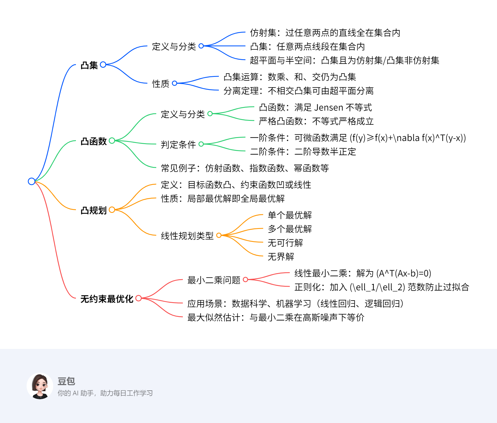

# 最优化入门
## 总览
---  
### 一段话总结  
文档围绕最优化方法展开，首先介绍**凸集**的定义（如仿射集、超平面、半空间）及性质（如凸集交仍为凸集、超平面分离定理），接着阐述**凸函数**的判定条件（一阶、二阶条件）及常见例子（仿射函数、指数函数等），然后讨论**凸规划**的性质（局部最优即全局最优）和线性规划的不同类型（单个最优解、多个最优解、无可行解、无界解），最后介绍**无约束最优化问题**（如最小二乘问题）及其在数据科学和机器学习中的应用（正则化、最大似然估计等），强调凸优化在保证全局最优解上的优势。  

---  

---  
### 详细总结  

#### 一、凸集及其性质  
**定义**：  
- **仿射集**：包含任意两点连线的集合，如线性方程组 \(Ax=b\) 的解集。  
- **凸集**：包含任意两点线段的集合，仿射集是凸集的子集。  
- **超平面与半空间**：  
  - 超平面：\(\{x | a^T x = b\}\)，既是凸集又是仿射集。  
  - 半空间：\(\{x | a^T x ≤ b\}\)，是凸集但非仿射集。  

**性质**：  
1. **运算封闭性**：  
   - 凸集的数乘（\(kS\)）、和（\(S+T\)）、交（\(S∩T\)）仍为凸集。  
2. **分离定理**：不相交的凸集可由超平面分离，即存在 \(p\) 和 \(\alpha\) 使得 \(S_1 \subseteq \{x | p^T x ≤ \alpha\}\) 且 \(S_2 \subseteq \{x | p^T x ≥ \alpha\}\)。  
3. **投影唯一性**：非空闭凸集外一点到该集合存在唯一最近点。  

#### 二、凸函数及其判定  
**定义**：  
- 若函数 \(f\) 的定义域为凸集，且对任意 \(x, y\) 和 \(0≤\theta≤1\)，有 \(f(\theta x + (1-\theta)y) ≤ \theta f(x) + (1-\theta)f(y)\)，则 \(f\) 为凸函数。严格凸函数要求不等式严格成立。  

**判定条件**：  
| 条件类型 | 具体描述 |  
|----------|----------|  
| **一阶条件**（可微） | \(f(y) ≥ f(x) + \nabla f(x)^T(y-x)\) 对任意 \(x, y\) 成立 |  
| **二阶条件**（二阶可微） | 海森矩阵 \(\nabla^2 f(x) \succeq 0\)（半正定） |  

**常见凸函数**：  
- 仿射函数（如 \(ax+b\)）、指数函数（\(e^{ax}\)）、幂函数（\(\alpha≥1\) 或 \(\alpha≤0\) 时 \(x^\alpha\)）、范数函数。  

#### 三、凸规划与线性规划  
**凸规划**：  
- **形式**：目标函数 \(f(x)\) 凸，不等式约束 \(c_i(x)\) 为凹函数，等式约束为线性函数。  
- **性质**：局部极小点即全局极小点，极小点集合为凸集。  

**线性规划（LP）类型**：  
| 类型 | 特点 | 示例 |  
|------|------|------|  
| 单个最优解 | 可行域有界且唯一极值点 | \(max Z=6x_1+4x_2\)，约束为线性不等式 |  
| 多个最优解 | 目标函数与某约束边界平行 | \(min z=-10x_1-15x_2\)，两约束边界斜率与目标函数一致 |  
| 无可行解 | 约束条件矛盾 | \(5x_1+6x_2≥900\) 与 \(2x_1+3x_2≤300\) 无交集 |  
| 无界解 | 可行域无界且目标函数可无限优化 | \(min z=-3x_1-4x_2\)，可行域向右上方无限延伸 |  

#### 四、无约束最优化问题  
**最小二乘问题**：  
- **线性最小二乘**：\(min \frac{1}{2}\|Ax-b\|_2^2\)，解为 \(x=(A^TA)^{-1}A^Tb\)（当 \(A\) 列满秩时）。  
- **正则化**：  
  - \(\ell_2\) 正则化：\(min \sum (b_i-\phi_i(x))^2 + \mu\|x\|_2^2\)，防止过拟合。  
  - \(\ell_1\) 正则化：\(min \sum (b_i-\phi_i(x))^2 + \mu\|x\|_1\)，促进解的稀疏性。  

**应用场景**：  
- **数据科学**：拟合含噪声数据，如线性回归模型 \(b=Ax+\varepsilon\)，高斯噪声下最小二乘等价于最大似然估计。  
- **机器学习**：  
  - 线性回归：\(min \sum \frac{1}{2}\|a_i^Tx-b_i\|_2^2 + \mu\varphi(x)\)  
  - 逻辑回归：\(min \sum \frac{1}{N} \log(1+\exp(-b_i a_i^Tx)) + \mu\varphi(x)\)  

---  
### 关键问题  
1. **问题**：凸集与仿射集的核心区别是什么？  
   **答案**：仿射集要求包含任意两点的**整条直线**，而凸集仅要求包含任意两点的**线段**。仿射集一定是凸集，但凸集不一定是仿射集（如半空间是凸集但非仿射集）。  

2. **问题**：如何判断一个二次函数是否为凸函数？  
   **答案**：对于二次函数 \(f(x)=\frac{1}{2}x^TPx+q^Tx+r\)，其凸性由矩阵 \(P\) 决定：当 \(P \succeq 0\)（半正定）时，\(f(x)\) 为凸函数；若 \(P \succ 0\)（正定），则为严格凸函数。  

3. **问题**：为什么凸规划的局部最优解一定是全局最优解？  
   **答案**：假设存在局部最优解 \(x\) 和全局最优解 \(y\)，构造凸组合 \(z=\theta y + (1-\theta)x\)（\(0<\theta<1\)），则 \(f(z) ≤ \theta f(y) + (1-\theta)f(x)\)。由于 \(f(y) < f(x)\)，当 \(\theta\) 足够小时，\(f(z) < f(x)\)，与 \(x\) 是局部最优解矛盾，故凸规划的局部最优解必为全局最优解。

## 凸集  

### 一、核心定义与基本概念  
**1. 仿射集与凸集**  
- **仿射集**：若集合 \( \mathcal{C} \) 中任意两点的连线全包含于 \( \mathcal{C} \)，即对任意 \( x_1, x_2 \in \mathcal{C} \) 和 \( \theta \in \mathbb{R} \)，有 \( \theta x_1 + (1-\theta) x_2 \in \mathcal{C} \)。  
  - **例**：线性方程组 \( Ax = b \) 的解集是仿射集，因解集中任意两点的线性组合仍为解。  
- **凸集**：若集合 \( \mathcal{C} \) 中任意两点的线段全包含于 \( \mathcal{C} \)，即对任意 \( x_1, x_2 \in \mathcal{C} \) 和 \( 0 \leq \theta \leq 1 \)，有 \( \theta x_1 + (1-\theta) x_2 \in \mathcal{C} \)。  
  - **关系**：仿射集是凸集的子集，凸集包含仿射集。  

**2. 特殊凸集**  
- **超平面**：形如 \( \{ x \mid a^T x = b \} \)（\( a \neq 0 \)）的集合，既是凸集又是仿射集。  
  - **例**：二维空间中，直线 \( 2x + 3y = 5 \) 是超平面。  
- **半空间**：形如 \( \{ x \mid a^T x \leq b \} \)（\( a \neq 0 \)）的集合，是凸集但非仿射集。  
  - **例**：二维空间中，区域 \( 2x + 3y \leq 5 \) 是半空间。  

### 二、凸集的性质与定理  
**1. 运算性质**  
- **数乘、和、交**：  
  - 若 \( S \) 是凸集，则 \( kS = \{ ks \mid s \in S \} \) 是凸集。  
  - 若 \( S \) 和 \( T \) 是凸集，则 \( S + T = \{ s + t \mid s \in S, t \in T \} \) 是凸集。  
  - **任意凸集的交集仍是凸集**，如多个半空间的交集构成凸多面体。  

**2. 超平面分离定理**  
- **定理**：若 \( S_1 \) 和 \( S_2 \) 是不相交的凸集，则存在非零向量 \( p \) 和常数 \( \alpha \)，使得：  
  \[
  S_1 \subseteq \{ x \mid p^T x \leq \alpha \}, \quad S_2 \subseteq \{ x \mid p^T x \geq \alpha \}
  \]  
  - **应用**：机器学习中的SVM算法基于此定理，通过寻找超平面分离不同类别数据。  
- **引理**：若 \( y \) 是凸集 \( S \) 外一点，则存在超平面分离 \( y \) 和 \( S \)，即存在 \( p \neq 0 \) 使得 \( p^T x \leq \alpha < p^T y \) 对任意 \( x \in S \) 成立。  

### 三、凸集的判定与示例  
**1. 判定方法**  
- **几何直观**：集合内任意两点连线不“穿出”集合边界。  
- **代数定义**：对任意 \( x, y \in \mathcal{C} \) 和 \( 0 \leq \theta \leq 1 \)，验证 \( \theta x + (1-\theta) y \in \mathcal{C} \)。  

**2. 示例**  
- **凸集**：  
  - 球体 \( \{ x \mid \| x - x_0 \| \leq r \} \)、正多边形内部、半空间。  
- **非凸集**：  
  - 圆环 \( \{ x \mid r_1 < \| x \| < r_2 \} \)、月牙形区域（因存在两点连线穿出区域）。  

### 四、凸集在优化中的应用  
**1. 仿射变换的保凸性**  
- 若 \( f(x) = Ax + b \) 是仿射变换，\( S \) 是凸集，则 \( f(S) \) 和 \( f^{-1}(S) \) 均为凸集。  
- **例**：线性矩阵不等式 \( x_1 A_1 + \cdots + x_m A_m \preceq B \) 的解集是凸集，因可视为仿射变换后的结果。  

**2. 凸集与优化问题**  
- 凸优化问题中，可行域为凸集，目标函数为凸函数，保证局部最优解即全局最优解。  
- **例**：线性规划、二次规划的可行域均为凸集，可利用凸性高效求解。  

### 五、关键定理证明（超平面分离定理）  
**目标**：证明不相交凸集 \( S_1 \) 和 \( S_2 \) 可被超平面分离。  
**步骤**：  
1. **构造差集**：令 \( S = \{ y - z \mid y \in S_1, z \in S_2 \} \)，显然 \( S \) 是凸集且 \( 0 \notin S \)。  
2. **应用引理**：存在 \( p \neq 0 \) 使得 \( p^T x < 0 \) 对任意 \( x \in S \)，即 \( p^T(y - z) < 0 \)，故 \( p^T y < p^T z \)。  
3. **选取常数 \( \alpha \)**：取 \( \alpha \) 为 \( p^T y \) 的上确界或 \( p^T z \) 的下确界，满足 \( p^T y \leq \alpha \leq p^T z \)。  

**结论**：超平面 \( \{ x \mid p^T x = \alpha \} \) 分离 \( S_1 \) 和 \( S_2 \)。  

### 六、重点总结  
| 概念         | 核心定义                                  | 关键性质/定理                          | 应用场景                |  
|--------------|-------------------------------------------|---------------------------------------|-------------------------|  
| 仿射集       | 包含任意两点连线的集合                    | 线性方程组解集是仿射集                 | 线性约束建模            |  
| 凸集         | 包含任意两点线段的集合                    | 交集、仿射变换保凸性                   | 优化可行域、分类问题    |  
| 超平面/半空间| 线性等式/不等式定义的集合                 | 超平面分离定理                        | SVM、凸优化            |  
| 分离定理     | 不相交凸集可由超平面分离                  | 引理证明凸集外点与凸集的分离性         | 机器学习分类、可行性分析|  

**总结**：凸集是最优化和机器学习的基础概念，超平面分离定理为分类问题提供了理论支撑，仿射集与凸集的性质确保了优化问题的高效求解。

## 凸函数  

### 一、核心定义与基础概念  
**1. 适当函数**  
- **定义**：若广义实值函数 \( f \) 满足：  
  - 存在 \( x \in \mathcal{X} \) 使得 \( f(x) < +\infty \)（至少一处有限）；  
  - 对任意 \( x \in \mathcal{X} \)，\( f(x) > -\infty \)（无负无穷值）。  
- **作用**：确保函数在定义域内可优化，避免极端值干扰。  

**2. 开集与闭集**  
- **开集**：集合中每一点均存在邻域完全包含于自身（如圆形内部）。  
- **闭集**：开集的补集，包含所有极限点（如圆形及其边界）。  

**3. 上方图与闭函数**  
- **上方图（epi f）**：\( \{(x, t) \mid f(x) \leq t\} \)，直观表示函数“上方”区域。  
- **闭函数**：若上方图 \( \text{epi } f \) 是闭集，则 \( f \) 为闭函数，常用于保证优化问题解的存在性。  

### 二、凸函数的定义与分类  
**1. 凸函数**  
- **定义**：设 \( f \) 为适当函数，定义域 \( \text{dom } f \) 为凸集，且对任意 \( x, y \in \text{dom } f \) 和 \( 0 \leq \theta \leq 1 \)，满足：  
  \[
  f(\theta x + (1-\theta)y) \leq \theta f(x) + (1-\theta)f(y)
  \]  
  - **几何意义**：函数图像上任意两点连线不在图像下方。  

**2. 严格凸函数**  
- **定义**：不等式严格成立（\( < \) 替代 \( \leq \)），即不存在平坦区域，极值唯一。  

**3. 常见凸函数与凹函数**  
| 类型       | 凸函数示例                          | 凹函数示例                |  
|------------|-------------------------------------|---------------------------|  
| 线性函数   | 仿射函数 \( ax + b \)（同时也是凹函数） | 无（仿射函数同时为凸/凹）  |  
| 幂函数     | \( x^\alpha \)（\( \alpha \geq 1 \) 或 \( \alpha \leq 0 \)，\( x > 0 \)） | \( x^\alpha \)（\( 0 \leq \alpha \leq 1 \)，\( x > 0 \)） |  
| 范数函数   | \( \| x \|_p \)（\( p \geq 1 \)）       | 无                        |  
| 指数函数   | \( e^{ax} \)（任意 \( a \)）           | 无                        |  
| 负熵       | \( x \log x \)（\( x > 0 \)）          | \( -\log x \)（\( x > 0 \)） |  

### 三、凸函数的判定方法  
**1. 限制到直线法（基本方法）**  
- **原理**：若函数 \( f \) 沿任意直线的限制 \( g(t) = f(x + tv) \) 是一维凸函数，则 \( f \) 是凸函数。  
- **示例**：验证 \( f(X) = -\log \det X \)（\( X \succ 0 \)）是否为凸函数：  
  - 取直线 \( X + tV \)（\( V \) 为对称矩阵），则 \( g(t) = -\log \det(X + tV) \)。  
  - 利用特征值分解证明 \( g(t) \) 是凸函数（细节见文档推导）。  

**2. 一阶条件（可微函数）**  
- **条件**：\( f \) 可微且对任意 \( x, y \in \text{dom } f \)，有：  
  \[
  f(y) \geq f(x) + \nabla f(x)^T(y - x)
  \]  
  - **几何意义**：函数在 \( x \) 处的切平面始终位于函数图像下方。  
- **证明（必要性）**：  
  由凸函数定义，\( f(x + t(y - x)) \leq (1 - t)f(x) + tf(y) \)，令 \( t \to 0 \) 取极限得一阶不等式。  
- **证明（充分性）**：  
  构造 \( z = \theta x + (1 - \theta)y \)，应用一阶条件于 \( x \) 和 \( y \)，相加后得凸函数定义式。  

**3. 二阶条件（二阶可微函数）**  
- **条件**：海森矩阵 \( \nabla^2 f(x) \succeq 0 \)（半正定）对任意 \( x \in \text{dom } f \) 成立。  
  - 若 \( \nabla^2 f(x) \succ 0 \)（正定），则 \( f \) 是严格凸函数。  
- **示例**：二次函数 \( f(x) = \frac{1}{2}x^T Px + q^T x + r \)：  
  - 梯度 \( \nabla f(x) = Px + q \)，海森矩阵 \( \nabla^2 f(x) = P \)。  
  - 当 \( P \succeq 0 \) 时，\( f(x) \) 是凸函数；当 \( P \succ 0 \) 时，是严格凸函数。  

**4. 梯度单调性**  
- **条件**：梯度 \( \nabla f \) 是单调映射，即对任意 \( x, y \)，有：  
  \[
  (\nabla f(x) - \nabla f(y))^T(x - y) \geq 0
  \]  
- **等价性**：与一阶条件等价，适用于分析优化算法收敛性。  

### 四、凸函数的性质与应用  
**1. Jensen不等式**  
- **基础形式**：对凸函数 \( f \)，有 \( f(\theta x + (1-\theta)y) \leq \theta f(x) + (1-\theta)f(y) \)。  
- **概率形式**：对随机变量 \( z \)，有 \( f(E[z]) \leq E[f(z)] \)。  
  - **例**：\( f(x) = x^2 \)（凸函数），则 \( (E[z])^2 \leq E[z^2] \)（方差非负性）。  

**2. 在优化中的意义**  
- **凸优化优势**：若目标函数为凸函数，可行域为凸集，则局部最优解即全局最优解（如线性规划、岭回归）。  
- **正则化应用**：  
  - \( \ell_2 \) 正则项 \( \|x\|_2^2 \) 是凸函数，确保优化问题为凸问题，避免局部极小。  

### 五、关键总结  
| 判定方法       | 适用条件          | 核心公式/条件                          | 示例验证                  |  
|----------------|-------------------|---------------------------------------|---------------------------|  
| 限制到直线法   | 任意函数          | \( g(t) = f(x + tv) \) 是凸函数         | \( f(X) = -\log \det X \)   |  
| 一阶条件       | 可微函数          | \( f(y) \geq f(x) + \nabla f(x)^T(y-x) \) | 线性函数、二次函数         |  
| 二阶条件       | 二阶可微函数      | \( \nabla^2 f(x) \succeq 0 \)            | \( f(x) = \frac{1}{2}x^T Px \) |  
| 梯度单调性     | 可微函数          | \( (\nabla f(x)-\nabla f(y))^T(x-y) \geq 0 \) | 凸函数梯度单调递增        |  

**总结**：凸函数通过严格的数学定义和判定条件，为优化问题提供了全局最优解的理论保证，广泛应用于机器学习（如正则化）、统计分析（如最大似然估计）和工程优化等领域。理解凸函数的性质是设计高效优化算法的基础。

## 凸规划  

### 一、核心定义与问题形式  
**定义**：  
凸规划是一类特殊的优化问题，其**目标函数为凸函数**，**不等式约束函数为凹函数**，**等式约束函数为线性函数**。其一般形式为：  
\[
\begin{aligned}
\min & \quad f(x) \\
\text{s.t.} & \quad g_i(x) \leq 0, \quad i=1,2,\dots,m \quad \text{（凹函数）} \\
& \quad h_j(x) = 0, \quad j=1,2,\dots,l \quad \text{（线性函数）}
\end{aligned}
\]  
- **核心性质**：凸规划的**局部最优解必定是全局最优解**，且最优解的集合为凸集。  

### 二、凸规划与非凸规划的对比  
| **特征**         | **凸规划**                              | **非凸规划**                          |  
|------------------|-----------------------------------------|---------------------------------------|  
| 目标函数         | 凸函数                                  | 非凸函数（如非正定二次函数）          |  
| 约束函数         | 不等式约束为凹函数，等式约束为线性      | 约束函数可能为非凸函数                |  
| 最优解性质       | 局部最优即全局最优                      | 可能存在多个局部最优解，需全局搜索    |  
| 求解难度         | 可通过梯度法等高效求解                  | 需启发式算法或特殊处理                |  

**示例**：  
**非凸规划**：  
\[
\min \quad x_1^2 + x_2^2 \\
\text{s.t.} \quad \frac{x_1}{1 + x_2^2} \leq 0 \quad \text{（非线性非凹约束）}
\]  
**凸规划**：  
\[
\min \quad x_1^2 + x_2^2 \\
\text{s.t.} \quad x_1 \leq 0 \quad \text{（线性凹约束，因 \(g(x)=-x_1\) 是凸函数，故 \(x_1 \leq 0\) 等价于凹约束）} \\
\quad \quad x_1 + x_2 = 0 \quad \text{（线性等式约束）}
\]  
- **等价性说明**：两问题定义域相同，但第一个约束为非线性非凹，第二个约束为线性，故前者非凸、后者凸。  

### 三、关键定理：局部最优解即全局最优解  
**定理内容**：  
若 \(x\) 是凸规划的局部最优解，则 \(x\) 必为全局最优解。  

**证明思路**：  
1. **反证法假设**：设 \(x\) 是局部最优解，存在全局最优解 \(y\) 满足 \(f(y) < f(x)\)。  
2. **构造凸组合**：取 \(z = \theta y + (1-\theta)x\)，其中 \(\theta = \frac{R}{2\|y - x\|_2}\)（\(R\) 为局部最优邻域半径），则 \(z\) 在 \(x\) 的邻域内（\(\|z - x\|_2 = \frac{R}{2} < R\)）。  
3. **利用凸性**：由凸函数性质，\(f(z) \leq \theta f(y) + (1-\theta)f(x)\)。  
4. **导出矛盾**：因 \(f(y) < f(x)\)，得 \(f(z) < f(x)\)，与 \(x\) 是局部最优解矛盾，故假设不成立。  

### 四、求解方法与示例  
**1. 求解方法概述**  
- **梯度下降法**：适用于可微凸函数，迭代更新 \(x_{k+1} = x_k - \alpha \nabla f(x_k)\)。  
- **牛顿法**：利用二阶导数信息，收敛速度更快，适用于二次凸函数。  
- **拉格朗日乘数法**：处理带约束的凸规划，通过引入拉格朗日乘子将约束问题转化为无约束问题。  

**2. 示例：线性规划（凸规划特例）**  
**问题**：  
\[
\max \quad 6x_1 + 4x_2 \\
\text{s.t.} \quad 2x_1 + x_2 \leq 10 \\
\quad \quad x_1 + x_2 \leq 8 \\
\quad \quad x_2 \leq 7 \\
\quad \quad x_1, x_2 \geq 0
\]  
**求解步骤**：  
1. **确定可行域**：由不等式约束画出凸多边形，顶点为 \((0,0)\)、\((0,7)\)、\((2,6)\)、\((5,0)\)、\((8,0)\)（但需验证是否满足所有约束）。  
2. **顶点评估**：  
   - \((0,0)\)：目标值 \(0\)  
   - \((0,7)\)：目标值 \(4 \times 7 = 28\)  
   - \((2,6)\)：目标值 \(6 \times 2 + 4 \times 6 = 36\)（最大值）  
   - \((5,0)\)：目标值 \(6 \times 5 = 30\)  
3. **结论**：最优解为 \((2,6)\)，目标值 \(36\)。  

### 五、应用场景  
1. **机器学习**：  
   - 线性回归、逻辑回归的正则化模型（如岭回归、LASSO）均为凸规划，保证全局最优解。  
2. **工程优化**：  
   - 资源分配、网络流优化等问题可建模为线性规划或二次规划（凸规划特例）。  
3. **统计分析**：  
   - 最大熵模型、支持向量机（SVM）的对偶问题均属于凸规划。  

### 六、重点总结  
- **核心优势**：凸规划通过严格的凸性保证，避免陷入局部最优，且可利用成熟的凸优化算法高效求解。  
- **判定关键**：验证目标函数凸性、约束函数的凹性或线性性。  
- **典型示例**：线性规划、二次规划（如最小二乘问题）、带凸约束的优化问题。  

**总结**：凸规划是最优化理论中的重要分支，其理论性质为高效求解提供了保障，广泛应用于数据科学、工程和机器学习领域。

## 线性规划与无约束最优化：最小二乘问题  

### 一、线性规划的无界解  
**定义**：  
线性规划（LP）的可行域无界且目标函数可无限优化时，称为**无界解**。此时不存在有限最优解，目标值趋向正无穷或负无穷。  

**判定条件**：  
- 可行域无界（如二维平面中约束形成开放区域）。  
- 目标函数在可行域方向上无界（如目标函数梯度与可行域延伸方向夹角小于90度）。  

**示例**：  

\[
\begin{aligned}
\min \quad & -3x_1 - 4x_2 \\
\text{s.t.} \quad & x_1 \leq 3 \\
& x_1 - x_2 \leq 1 \\
& x_1, x_2 \geq 0
\end{aligned}
\]  

**步骤分析**：  

1. **绘制可行域**：  
   - \(x_1 \leq 3\)：直线 \(x_1=3\) 左侧区域。  
   - \(x_1 - x_2 \leq 1\)：直线 \(x_2 \geq x_1 - 1\) 上方区域。  
   - \(x_1, x_2 \geq 0\)：第一象限。  
   - 可行域为第一象限内，\(x_1 \leq 3\) 且 \(x_2 \geq x_1 - 1\) 的开放区域（向右上方无限延伸）。  
2. **目标函数趋势**：  
   - 目标函数 \(z = -3x_1 - 4x_2\) 在 \(x_2\) 增大时趋向负无穷，可行域允许 \(x_2\) 无限增大，故无界解存在。  

**结论**：该LP问题无界，目标值可无限减小。  

### 二、无约束最优化问题  
**定义**：  
无约束最优化问题形如：  

\[
\min_{x \in \mathbb{R}^n} f(x)
\]  

其中 \(f(x)\) 为连续可导函数，无需满足显式约束条件。  

**求解方法**：  

1. **解析法**：通过求导找临界点（梯度为零），适用于简单函数。  
   - 一阶必要条件：\(\nabla f(x^*) = 0\)（全局最优需二阶充分条件 \(\nabla^2 f(x^*) \succ 0\)）。  
2. **数值法**：梯度下降、牛顿法等迭代算法，适用于复杂函数。  

**示例：线性最小二乘问题**  
**问题**：求解 \( \min_{x} \frac{1}{2}\|Ax - b\|_2^2 \)，其中 \(A = \begin{bmatrix}1 & 2 \\ 3 & 4 \\ 5 & 6\end{bmatrix}\)，\(b = \begin{bmatrix}10 \\ 20 \\ 30\end{bmatrix}\)。  

**解析解法步骤**：  

1. **目标函数展开**：  

   \[
   f(x) = \frac{1}{2} \left[(x_1 + 2x_2 - 10)^2 + (3x_1 + 4x_2 - 20)^2 + (5x_1 + 6x_2 - 30)^2\right]
   \]  
2. **求梯度**：  
   \[
   \nabla f(x) = A^T(Ax - b) = \begin{bmatrix}1 & 3 & 5 \\ 2 & 4 & 6\end{bmatrix} \left( \begin{bmatrix}1 & 2 \\ 3 & 4 \\ 5 & 6\end{bmatrix} \begin{bmatrix}x_1 \\ x_2\end{bmatrix} - \begin{bmatrix}10 \\ 20 \\ 30\end{bmatrix} \right)
   \]  
   计算得：  
   \[
   \nabla f(x) = \begin{bmatrix}35x_1 + 44x_2 - 220 \\ 44x_1 + 56x_2 - 280\end{bmatrix}
   \]  
3. **令梯度为零**：  
   \[
   \begin{cases}
   35x_1 + 44x_2 = 220 \\
   44x_1 + 56x_2 = 280
   \end{cases}
   \]  
4. **求解线性方程组**：  
   - 系数矩阵行列式 \(35 \times 56 - 44 \times 44 = -4 \neq 0\)，唯一解为 \(x_1 = 0\)，\(x_2 = 5\)。  
5. **验证凸性**：  
   - 海森矩阵 \(A^TA = \begin{bmatrix}35 & 44 \\ 44 & 56\end{bmatrix}\) 正定（特征值均正），故为全局最优解。  

**结论**：最优解 \(x = \begin{bmatrix}0 \\ 5\end{bmatrix}\)，目标值 \(f(x) = 50\)。  

### 三、最小二乘问题的扩展  
**1. 正则化最小二乘**  
**问题形式**：  
\[
\min_{x} \frac{1}{2}\|Ax - b\|_2^2 + \mu \|x\|_2^2 \quad (\ell_2 \text{正则化})
\]  
- **作用**：防止过拟合，\(\mu > 0\) 平衡拟合误差与解的光滑性。  
- **解析解**：\(x = (A^TA + \mu I)^{-1}A^Tb\)。  

**2. 非线性最小二乘**  
**问题形式**：  
\[
\min_{x} \sum_{i=1}^m r_i(x)^2, \quad r_i(x) \text{为非线性函数}
\]  
- **求解方法**：  
  - **梯度下降**：\(x_{k+1} = x_k - \alpha \sum_{i=1}^m r_i(x_k) \nabla r_i(x_k)\)。  
  - **高斯-牛顿法**：利用雅可比矩阵线性化，迭代求解 \(J^TJ \Delta x = -J^Tr\)。  

**示例：指数拟合**  
**问题**：拟合数据 \(\{(1, 2), (2, 5), (3, 10)\}\) 到模型 \(y = ae^{bx}\)。  
**步骤**：  
1. **线性化**：取对数得 \(\ln y = \ln a + bx\)，令 \(z = \ln y\)，\(c = \ln a\)，转化为线性最小二乘 \(z = c + bx\)。  
2. **构造矩阵**：  
   \(A = \begin{bmatrix}1 & 1 \\ 1 & 2 \\ 1 & 3\end{bmatrix}\)，\(b = \begin{bmatrix}\ln 2 \\ \ln 5 \\ \ln 10\end{bmatrix}\)。  
3. **求解**：利用解析法得 \(c \approx 0.3, b \approx 1.1\)，故拟合函数为 \(y = e^{0.3}e^{1.1x} \approx 1.35e^{1.1x}\)。  

### 四、重点总结  
| 问题类型       | 核心特征                          | 求解方法                  | 典型示例                  |  
|----------------|-----------------------------------|---------------------------|---------------------------|  
| 线性规划无界解 | 可行域无界，目标函数可无限优化    | 几何分析可行域延伸方向    | 二维开放区域最小化问题    |  
| 无约束优化     | 无显式约束，依赖函数导数性质      | 解析法、梯度下降法        | 线性最小二乘              |  
| 最小二乘       | 最小化误差平方和，线性/非线性     | 矩阵求逆、迭代算法        | 数据拟合、回归分析        |  

**关键结论**：  
- 线性规划无界解需通过可行域几何形状判定；  
- 无约束优化中，凸函数（如最小二乘）可通过梯度为零求全局最优；  
- 正则化技术是处理过拟合的有效手段，广泛应用于机器学习。

## 数据科学中的最优化应用  

### 一、最小二乘问题  
**核心定义**：  
最小二乘问题旨在最小化误差的平方和，形式为：  
\[
\min_{x \in \mathbb{R}^n} \sum_{i=1}^{m} r_i^2(x)
\]  
- **线性最小二乘**：当 \( r_i(x) = a_i^T x - b_i \) 时，目标函数为二次凸函数，可通过矩阵运算高效求解。  
- **非线性最小二乘**：当 \( r_i(x) \) 为非线性函数时，需迭代算法求解。  

**求解方法**：  
1. **线性最小二乘（解析法）**：  
   - 目标函数：\( f(x) = \frac{1}{2}\|Ax - b\|_2^2 \)（\( A \) 为设计矩阵，\( b \) 为观测值）。  
   - 最优解：通过梯度为零求得 \( x = (A^T A)^{-1} A^T b \)（当 \( A \) 列满秩时）。  
2. **非线性最小二乘（迭代法）**：  
   - 如高斯-牛顿法：利用雅可比矩阵线性化，迭代更新 \( x_{k+1} = x_k - (J^T J)^{-1} J^T r \)。  

**示例：线性回归拟合**  
**问题**：用线性模型 \( y = \theta_1 x + \theta_0 \) 拟合数据点 \((1, 2)\)、\((2, 4)\)、\((3, 6)\)。  
**步骤**：  
1. **构造矩阵**：  
   \[
   A = \begin{bmatrix}1 & 1 \\ 1 & 2 \\ 1 & 3\end{bmatrix}, \quad b = \begin{bmatrix}2 \\ 4 \\ 6\end{bmatrix}
   \]  
2. **计算最优解**：  
   \[
   x = (A^T A)^{-1} A^T b = \begin{bmatrix}1 & 1 & 1 \\ 1 & 2 & 3\end{bmatrix}^{-1} \begin{bmatrix}1 & 1 & 1 \\ 1 & 2 & 3\end{bmatrix} \begin{bmatrix}2 \\ 4 \\ 6\end{bmatrix} = \begin{bmatrix}0 \\ 2\end{bmatrix}
   \]  
**结论**：拟合模型为 \( y = 2x \)，误差平方和为0（完美拟合）。  

### 二、正则化技术  
**核心思想**：  
在目标函数中加入正则项，平衡拟合误差与解的复杂度，防止过拟合。常见形式：  
- **\(\ell_2\) 正则化（岭回归）**：\( \min \sum (b_i - \phi_i(x))^2 + \mu \|x\|_2^2 \)  
- **\(\ell_1\) 正则化（LASSO）**：\( \min \sum (b_i - \phi_i(x))^2 + \mu \|x\|_1 \)（促进稀疏解）  

**求解方法**：  
- **岭回归解析解**：\( x = (A^T A + \mu I)^{-1} A^T b \)。  
- **迭代法**：如梯度下降法，对正则项求导后更新参数。  

**示例：带 \(\ell_2\) 正则化的线性回归**  
**问题**：拟合数据 \( A = \begin{bmatrix}1 & 1 \\ 1 & 2 \\ 1 & 3\end{bmatrix}, b = \begin{bmatrix}2 \\ 4 \\ 7\end{bmatrix} \)，取 \(\mu = 0.1\)。  
**步骤**：  
1. **构造正则化矩阵**：  
   \[
   A^T A + \mu I = \begin{bmatrix}3 & 6 \\ 6 & 14\end{bmatrix} + 0.1\begin{bmatrix}1 & 0 \\ 0 & 1\end{bmatrix} = \begin{bmatrix}3.1 & 6 \\ 6 & 14.1\end{bmatrix}
   \]  
2. **求解**：  
   \[
   x = (A^T A + \mu I)^{-1} A^T b = \begin{bmatrix}1.32 \\ 1.88\end{bmatrix}
   \]  
**结论**：拟合模型为 \( y = 1.88x + 1.32 \)，正则化抑制了过拟合风险。  

### 三、最大似然估计（MLE）  
**核心定义**：  
通过最大化观测数据的似然函数，估计概率分布参数。若数据 \( b_i = a_i^T x + \varepsilon_i \)，且噪声 \(\varepsilon_i \sim \mathcal{N}(0, \sigma^2)\)，则对数似然函数为：  
\[
\ell(x) = -\frac{m}{2}\ln(2\pi\sigma^2) - \frac{1}{2\sigma^2}\|Ax - b\|_2^2
\]  
**与最小二乘的关系**：高斯噪声下，最大似然估计等价于最小二乘问题。  

**求解方法**：  
1. **解析法**：对高斯分布，直接求导得最小二乘解。  
2. **数值法**：对非高斯分布，如泊松分布，使用梯度上升法最大化似然函数。  

**示例：高斯噪声下的MLE**  
**问题**：已知数据 \( b = Ax + \varepsilon \)，\(\varepsilon \sim \mathcal{N}(0, 1)\)，求 \( x \) 的最大似然估计。  
**步骤**：  
1. **对数似然函数**：  
   \[
   \ell(x) = -\frac{1}{2}\|Ax - b\|_2^2 + \text{常数}
   \]  
2. **最大化等价于最小化**：\( \min \|Ax - b\|_2^2 \)，解为最小二乘解 \( x = (A^T A)^{-1} A^T b \)。  

### 四、机器学习中的最优化问题  
**1. 线性回归**  
- **目标函数**：\( \min \frac{1}{2N}\|Ax - b\|_2^2 + \mu \|x\|_2^2 \)（正则化版本）。  
- **求解**：解析解或随机梯度下降（SGD）。  

**2. 逻辑回归**  
- **目标函数**：\( \min \frac{1}{N} \sum_{i=1}^N \ln(1 + e^{-b_i a_i^T x}) + \mu \|x\|_2^2 \)。  
- **求解**：梯度下降，梯度为 \( \frac{1}{N} \sum_{i=1}^N \frac{-b_i a_i e^{-b_i a_i^T x}}{1 + e^{-b_i a_i^T x}} + 2\mu x \)。  

**示例：二分类逻辑回归**  
**问题**：用逻辑回归区分两类数据，特征矩阵 \( A \) 和标签 \( b \in \{-1, 1\} \)。  
**步骤**：  
1. **初始化参数**：\( x_0 = 0 \)。  
2. **迭代更新**：  
   \[
   x_{k+1} = x_k - \alpha \left( \frac{1}{N} \sum_{i=1}^N \frac{-b_i a_i e^{-b_i a_i^T x_k}}{1 + e^{-b_i a_i^T x_k}} + 2\mu x_k \right)
   \]  
3. **收敛条件**：梯度范数小于阈值，输出最终 \( x \)。  

### 五、重点总结  
| 应用场景       | 核心方法                | 目标函数示例                          | 关键性质                  |  
|----------------|-------------------------|---------------------------------------|---------------------------|  
| 数据拟合       | 最小二乘法              | \( \min \|Ax - b\|_2^2 \)              | 凸问题，全局最优解        |  
| 过拟合控制     | 正则化（\(\ell_1/\ell_2\)）| \( \min \|Ax - b\|_2^2 + \mu \|x\|_1 \) | \(\ell_1\) 促稀疏，\(\ell_2\) 促光滑 |  
| 概率建模       | 最大似然估计            | \( \max \ell(x) = \sum \ln p(b_i|a_i; x) \)| 高斯噪声下等价于最小二乘 |  
| 机器学习       | 梯度下降/解析法         | 逻辑回归、线性回归损失函数            | 迭代求解，需调参学习率    |  

**总结**：数据科学中的最优化以最小二乘为基础，通过正则化和最大似然估计扩展应用场景，结合机器学习算法实现高效建模，核心目标是在拟合精度与模型复杂度间取得平衡。