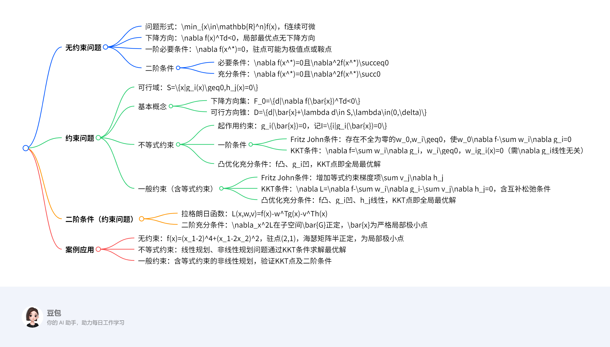

# 最优条件
## 总览

---
### 一段话总结  
文档主要介绍最优化问题的最优性条件，包括**无约束问题**和**约束问题**。无约束问题中，**一阶必要条件**要求梯度为零，**二阶条件**通过海瑟矩阵的正定性判断局部极值（正定则为极小点）；约束问题分为不等式和一般约束，引入**可行方向、下降方向**等概念，**Fritz John条件**和**KKT条件**是核心一阶必要条件，其中KKT条件需满足互补松弛性，凸优化问题中KKT条件还是全局最优的充分条件。此外，还涉及二阶充分条件及具体案例求解。

---
### 思维导图  

---
### 详细总结  

#### 一、无约束优化问题  
**问题形式**：$\min_{x\in\mathbb{R}^n}f(x)$，其中$f$为连续可微函数。  

##### 1. 下降方向  
- **定义**：若存在向量$d$使$\nabla f(x)^Td<0$，则$d$为$f$在点$x$处的下降方向。  
- **性质**：若$x$为局部最优点，则不存在下降方向。  

##### 2. 一阶最优性条件（必要条件）  
- **条件**：若$x^*$是局部极小点，则$\nabla f(x^*)=0$。  
- **驻点（稳定点）**：满足$\nabla f(x)=0$的点，可能是极小点、极大点或鞍点（如$f(x)=x^3$在$x=0$处为鞍点）。  

##### 3. 二阶最优性条件  
- **必要条件**：若$x^*$是局部极小点，则$\nabla f(x^*)=0$且海瑟矩阵$\nabla^2f(x^*)$半正定（$\nabla^2f(x^*)\succeq0$）。  
- **充分条件**：若$\nabla f(x^*)=0$且$\nabla^2f(x^*)$正定（$\nabla^2f(x^*)\succ0$），则$x^*$是局部极小点。  
- **案例**：  
  - $f(x)=(x_1-2)^4+(x_1-2x_2)^2$，驻点$(2,1)$，海瑟矩阵为$\begin{pmatrix}2&-4\\-4&8\end{pmatrix}$（半正定），故为局部极小点。  

#### 二、约束优化问题  
**可行域**：$S=\{x|g_i(x)\geq0,i=1,\dots,m;h_j(x)=0,j=1,\dots,l\}$。  

##### 1. 基本概念  
- **下降方向集**：$F_0=\{d|\nabla f(\bar{x})^Td<0\}$。  
- **可行方向锥**：$D=\{d|\exists\delta>0,\bar{x}+\lambda d\in S,\forall\lambda\in(0,\delta)\}$。  

##### 2. 不等式约束问题（$s.t.\ g_i(x)\geq0$）  
- **起作用约束**：$g_i(\bar{x})=0$（记$I=\{i|g_i(\bar{x})=0\}$），否则为不起作用约束。  
- **一阶必要条件**：  
  - **Fritz John条件**：存在不全为零的$w_0\geq0$和$w_i\geq0(i\in I)$，使$w_0\nabla f(\bar{x})-\sum_{i\in I}w_i\nabla g_i(\bar{x})=0$。  
  - **KKT条件**（需$\{\nabla g_i(\bar{x})\}$线性无关）：  
    - $\nabla f(\bar{x})=\sum_{i\in I}w_i\nabla g_i(\bar{x})$，  
    - $w_i\geq0$，  
    - 互补松弛条件：$w_ig_i(\bar{x})=0$。  
- **凸优化充分条件**：若$f$为凸函数、$g_i$为凹函数，且KKT条件成立，则$\bar{x}$为全局最优解。  

##### 3. 一般约束问题（含等式约束$h_j(x)=0$）  
- **Fritz John条件**：存在不全为零的$w_0\geq0$、$w_i\geq0(i\in I)$和$v_j$，使  
  $$w_0\nabla f(\bar{x})-\sum_{i\in I}w_i\nabla g_i(\bar{x})-\sum_{j=1}^lv_j\nabla h_j(\bar{x})=0.$$  
- **KKT条件**：  
  - $\nabla L(\bar{x},w,v)=0$（$L=f-w^Tg-v^Th$为拉格朗日函数），  
  - $w_i\geq0$，$w_ig_i(\bar{x})=0$，  
  - $h_j(\bar{x})=0$。  
- **凸优化充分条件**：若$f$凸、$g_i$凹、$h_j$线性，且KKT条件成立，则$\bar{x}$为全局最优解。  

#### 三、二阶最优性条件（约束问题）  
- **拉格朗日函数**：$L(x,w,v)=f(x)-w^Tg(x)-v^Th(x)$。  
- **二阶充分条件**：若存在$(\bar{x},\bar{w},\bar{v})$满足KKT条件，且$\nabla_x^2L(\bar{x},\bar{w},\bar{v})$在子空间  
  $$\bar{G}=\{d|\nabla g_i(\bar{x})^Td=0(w_i>0),\nabla g_i(\bar{x})^Td\geq0(w_i=0),\nabla h_j(\bar{x})^Td=0\}$$  
  上正定，则$\bar{x}$为严格局部极小点。  

#### 四、关键案例  
| **问题类型**       | **案例**                                                                 | **结论**                                                                 |  
|--------------------|-------------------------------------------------------------------------|--------------------------------------------------------------------------|  
| 无约束             | $f(x)=x_1^2-6x_1x_2+5x_2^2$                                               | 驻点$(0,0)$，海瑟矩阵正定，为全局极小点                                 |  
| 不等式约束         | $\min (x_1-1)^2+x_2,\ s.t.\ -x_1-x_2+2\geq0,\ x_2\geq0$                | KKT点$(1,0)$，满足互补松弛条件，为最优解                                 |  
| 一般约束（含等式） | $\min x_1,\ s.t.\ 3(x_1-3)^2+x_2\geq0,\ (x_1-3)^2+x_2^2=10$            | $x^{(4)}=(3-\sqrt{10},0)$满足KKT条件且海瑟矩阵正定，为局部极小点         |  

---
### 关键问题及答案  

#### 1. 无约束问题中，驻点、局部极小点和全局极小点的关系是什么？  
**答案**：  
- **驻点**是梯度为零的点（$\nabla f(x)=0$），可能是**局部极小点**、局部极大点或鞍点（如$f(x)=x^3$在$x=0$处）。  
- **局部极小点**一定是驻点（一阶必要条件），但驻点不一定是局部极小点。  
- **全局极小点**是特殊的局部极小点，若函数为凸函数（如正定二次函数），则驻点即全局极小点。  

#### 2. 约束优化中，KKT条件与Fritz John条件的主要区别是什么？  
**答案**：  
- **Fritz John条件**允许乘子$w_0$为零，可能导致无法排除“平凡解”（如所有乘子为零），且不要求约束梯度线性无关。  
- **KKT条件**要求$\{\nabla g_i(\bar{x})\}$线性无关，且强制$w_0=1$（即$f$的梯度非零），保证乘子$w_i\geq0$对应实际约束，更具实用性。  
- **核心区别**：KKT条件通过线性无关假设排除了$w_0=0$的平凡情况，直接关联目标函数和约束梯度。  

#### 3. 如何利用二阶条件判断约束问题的局部最优性？  
**答案**：  
- **步骤**：  
  1. 验证点是否为KKT点（满足一阶必要条件）。  
  2. 计算拉格朗日函数的二阶导数矩阵（海瑟矩阵）$\nabla_x^2L$。  
  3. 确定子空间$\bar{G}$（由起作用约束和等式约束的梯度方向决定）。  
  4. 若$\nabla_x^2L$在$\bar{G}$上正定，则该点为严格局部极小点；若存在负特征值，则非局部极小点。  
- **案例**：在约束问题$\min x_1,\ s.t.\ 3(x_1-3)^2+x_2\geq0,\ (x_1-3)^2+x_2^2=10$中，$x^{(4)}=(3-\sqrt{10},0)$的$\nabla_x^2L$正定，故为局部极小点。

## 无约束优化问题的极值条件  

### 一、核心概念与理论  
#### 1. **下降方向**  
- **定义**：对于可微函数 \( f(x) \) 和点 \( x \in \mathbb{R}^n \)，若存在向量 \( d \) 满足 \( \nabla f(x)^T d < 0 \)，则称 \( d \) 为 \( f \) 在点 \( x \) 处的**下降方向**。  
- **意义**：若存在下降方向，则沿该方向移动可使函数值减小，因此**局部最优点处不存在下降方向**。  

#### 2. **一阶必要条件**  
- **条件**：若 \( x^* \) 是局部极小点，则 \( \nabla f(x^*) = 0 \)（梯度为零）。  
- **驻点（稳定点）**：满足 \( \nabla f(x) = 0 \) 的点，可能是极小点、极大点或鞍点（如 \( f(x) = x^3 \) 在 \( x=0 \) 处为鞍点）。  
- **证明思路**：通过泰勒展开分析任意方向 \( v \) 上的函数变化，利用局部最优性推导出梯度必须为零。  

#### 3. **二阶最优性条件**  
- **必要条件**：若 \( x^* \) 是局部极小点，则 \( \nabla f(x^*) = 0 \) 且海瑟矩阵 \( \nabla^2 f(x^*) \) 半正定（\( \nabla^2 f(x^*) \succeq 0 \)）。  
- **充分条件**：若 \( \nabla f(x^*) = 0 \) 且 \( \nabla^2 f(x^*) \) 正定（\( \nabla^2 f(x^*) \succ 0 \)），则 \( x^* \) 是严格局部极小点。  
- **鞍点**：若海瑟矩阵既有正特征值又有负特征值，驻点为鞍点（如 \( f(x) = x_1 x_2 \) 在 \( (0,0) \) 处）。  

#### 4. **凸优化的一阶充要条件**  
- **定理**：若 \( f(x) \) 是可微凸函数，则 \( \bar{x} \) 为全局极小点的充要条件是 \( \nabla f(\bar{x}) = 0 \)。  
- **证明思路**：利用凸函数性质 \( f(x) \geq f(\bar{x}) + \nabla f(\bar{x})^T (x-\bar{x}) \)，结合梯度为零可证全局最优性。  

### 二、求解方法  
#### 1. **一阶条件求解步骤**  
1. 计算目标函数的梯度 \( \nabla f(x) \)。  
2. 令 \( \nabla f(x) = 0 \)，求解方程组得到驻点。  
3. 结合函数性质或二阶条件判断驻点是否为极值点。  

#### 2. **二阶条件判断步骤**  
1. 计算驻点处的海瑟矩阵 \( \nabla^2 f(x^*) \)。  
2. 分析海瑟矩阵的正定性：  
   - 若所有特征值 \( > 0 \)，则为严格局部极小点；  
   - 若所有特征值 \( \geq 0 \)，则为局部极小点（可能退化）；  
   - 若存在正、负特征值，则为鞍点。  

### 三、示例解析  
#### 示例1：无约束二次函数优化  
**问题**：求 \( f(x) = 5x_1^2 - 6x_1x_2 + 5x_2^2 \) 的极小点。  
**求解步骤**：  
1. **计算梯度**：  
   \[
   \nabla f(x) = \begin{pmatrix} 10x_1 - 6x_2 \\ -6x_1 + 10x_2 \end{pmatrix}
   \]  
2. **求解一阶条件**：  
   令 \( \nabla f(x) = 0 \)，得方程组：  
   \[
   \begin{cases} 10x_1 - 6x_2 = 0 \\ -6x_1 + 10x_2 = 0 \end{cases} \implies x_1 = x_2 = 0  
   \]  
   驻点为 \( x^* = (0, 0)^T \)。  
3. **计算海瑟矩阵并判断正定性**：  
   \[
   \nabla^2 f(x) = \begin{pmatrix} 10 & -6 \\ -6 & 10 \end{pmatrix}
   \]  
   特征值计算：\( \lambda = 10 \pm 6 \)，即 \( \lambda_1 = 16 \), \( \lambda_2 = 4 \)，均为正数，故 \( \nabla^2 f(x^*) \) 正定。  
**结论**：\( x^* = (0, 0)^T \) 是全局极小点。  

#### 示例2：含鞍点的三次函数  
**问题**：分析 \( f(x) = x_1^3 - 3x_1x_2^2 \) 的驻点性质。  
**求解步骤**：  
1. **计算梯度**：  
   \[
   \nabla f(x) = \begin{pmatrix} 3x_1^2 - 3x_2^2 \\ -6x_1x_2 \end{pmatrix}
   \]  
2. **求解一阶条件**：  
   令 \( \nabla f(x) = 0 \)，得：  
   \[
   \begin{cases} x_1^2 = x_2^2 \\ x_1x_2 = 0 \end{cases} \implies x^* = (0, 0)^T  
   \]  
3. **计算海瑟矩阵**：  
   \[
   \nabla^2 f(x) = \begin{pmatrix} 6x_1 & -6x_2 \\ -6x_2 & -6x_1 \end{pmatrix} \implies \nabla^2 f(0,0) = \begin{pmatrix} 0 & 0 \\ 0 & 0 \end{pmatrix}
   \]  
   海瑟矩阵为零矩阵，无法通过二阶条件判断，需结合高阶导数或函数性质分析。  
**结论**：\( (0, 0) \) 是驻点，且为鞍点（沿 \( x_1 \) 轴方向函数值为 \( x_1^3 \)，既有增大也有减小方向）。  

### 四、重点总结  
- **无约束优化核心逻辑**：通过梯度（一阶条件）找驻点，再用海瑟矩阵（二阶条件）判断极值类型。  
- **凸函数特殊性**：凸函数的驻点即全局极小点，无需二阶条件（一阶充要条件）。  
- **关键公式**：  
  - 下降方向：\( \nabla f(x)^T d < 0 \)  
  - 一阶必要条件：\( \nabla f(x^*) = 0 \)  
  - 二阶充分条件：\( \nabla f(x^*) = 0 \) 且 \( \nabla^2 f(x^*) \succ 0 \)

## 约束极值问题的最优性条件  

### 一、核心概念与理论  
#### 1. **约束极值问题的基本形式**  
- **一般形式**：  
  \[
  \begin{cases}
  \min & f(x) \\
  \text{s.t.} & g_i(x) \geq 0 \ (i=1,2,\cdots,m) \\
  & h_j(x) = 0 \ (j=1,2,\cdots,l)
  \end{cases}
  \]  
  其中，\(S = \{x \mid g_i(x) \geq 0, h_j(x) = 0\}\) 称为**可行域**，\(g_i(x) \geq 0\) 为**不等式约束**，\(h_j(x) = 0\) 为**等式约束**。  

#### 2. **关键方向定义**  
- **下降方向**：若存在向量 \(d\) 使 \(f(\bar{x} + \lambda d) < f(\bar{x})\)（\(\lambda > 0\) 充分小），则 \(d\) 为 \(f\) 在 \(\bar{x}\) 处的下降方向，等价于 \(\nabla f(\bar{x})^T d < 0\)。  
- **可行方向**：若存在 \(\delta > 0\) 使 \(\bar{x} + \lambda d \in S\)（\(\lambda \in (0, \delta)\)），则 \(d\) 为可行域 \(S\) 在 \(\bar{x}\) 处的可行方向。  

#### 3. **几何最优性条件**  
- **定理**：若 \(\bar{x}\) 是局部最优解，则**下降方向集与可行方向集的交集为空**（\(F_0 \cap D = \emptyset\)）。  
- **直观意义**：局部最优解处，不存在同时使函数值下降且保持可行的方向。  

### 二、不等式约束问题的一阶条件  
#### 1. **起作用约束与松弛约束**  
- **起作用约束**：若 \(g_i(\bar{x}) = 0\)，则称约束 \(g_i(x) \geq 0\) 在 \(\bar{x}\) 处为**起作用约束**（紧约束），记 \(I = \{i \mid g_i(\bar{x}) = 0\}\)。  
- **松弛约束**：若 \(g_i(\bar{x}) > 0\)，则称约束 \(g_i(x) \geq 0\) 在 \(\bar{x}\) 处为**松弛约束**（非紧约束）。  

#### 2. **Fritz John条件**  
- **条件**：若 \(\bar{x}\) 是局部最优解，则存在不全为零的非负数 \(w_0, w_i (i \in I)\)，使得：  
  \[
  w_0 \nabla f(\bar{x}) - \sum_{i \in I} w_i \nabla g_i(\bar{x}) = 0
  \]  
- **局限性**：允许 \(w_0 = 0\)，可能导致乘子全为零的平凡解，实际应用中需结合其他条件。  

#### 3. **KKT条件（Karush-Kuhn-Tucker条件）**  
- **条件**（需起作用约束梯度线性无关）：  
  1. **梯度条件**：\(\nabla f(\bar{x}) = \sum_{i=1}^m w_i \nabla g_i(\bar{x})\)（\(w_i = 0\) 对应松弛约束）；  
  2. **互补松弛条件**：\(w_i g_i(\bar{x}) = 0\)（起作用约束 \(w_i \geq 0\)，松弛约束 \(w_i = 0\)）；  
  3. **非负性**：\(w_i \geq 0\)。  
- **意义**：是Fritz John条件的强化，排除 \(w_0 = 0\) 的平凡解，成为约束优化的核心必要条件。  

#### 4. **Gordan定理（引理）**  
- **内容**：线性不等式组 \(A x < 0\) 有解的充要条件是不存在非零向量 \(y \geq 0\) 使得 \(A^T y = 0\)。  
- **作用**：用于证明Fritz John条件和KKT条件的理论基础，通过凸集分离定理推导。  

### 三、一般约束问题的最优性条件（含等式约束）  
#### 1. **Fritz John条件（扩展）**  
- **条件**：若 \(\bar{x}\) 是局部最优解，存在不全为零的非负数 \(w_0, w_i (i \in I)\) 和实数 \(v_j\)，使得：  
  \[
  w_0 \nabla f(\bar{x}) - \sum_{i \in I} w_i \nabla g_i(\bar{x}) - \sum_{j=1}^l v_j \nabla h_j(\bar{x}) = 0
  \]  

#### 2. **KKT条件（扩展）**  
- **拉格朗日函数**：\(L(x, w, v) = f(x) - \sum_{i=1}^m w_i g_i(x) - \sum_{j=1}^l v_j h_j(x)\)。  
- **条件**：  
  1. **梯度条件**：\(\nabla_x L(\bar{x}, w, v) = 0\)；  
  2. **互补松弛条件**：\(w_i g_i(\bar{x}) = 0\)，\(w_i \geq 0\)；  
  3. **等式约束**：\(h_j(\bar{x}) = 0\)。  

#### 3. **凸优化的充分条件**  
- **定理**：若 \(f\) 是凸函数，\(g_i\) 是凹函数，\(h_j\) 是线性函数，且KKT条件成立，则 \(\bar{x}\) 是全局最优解。  
- **证明思路**：利用凸函数性质 \(f(x) \geq f(\bar{x}) + \nabla f(\bar{x})^T (x-\bar{x})\)，结合约束条件推导全局最优性。  

### 四、二阶最优性条件（约束问题）  
#### 1. **拉格朗日函数的二阶导数**  
- **海瑟矩阵**：\(\nabla_x^2 L(\bar{x}, w, v)\) 表示拉格朗日函数在 \(\bar{x}\) 处的二阶导数矩阵。  

#### 2. **二阶充分条件**  
- **条件**：若 \(\bar{x}\) 满足KKT条件，且 \(\nabla_x^2 L(\bar{x}, w, v)\) 在子空间  
  \[
  \bar{G} = \left\{ d \mid \begin{array}{l}
  \nabla g_i(\bar{x})^T d = 0 \ (i \in I, w_i > 0) \\
  \nabla g_i(\bar{x})^T d \geq 0 \ (i \in I, w_i = 0) \\
  \nabla h_j(\bar{x})^T d = 0 \ (j=1,\cdots,l)
  \end{array} \right\}
  \]  
  上正定，则 \(\bar{x}\) 是严格局部极小点。  

### 五、求解方法与示例  
#### 1. **基于KKT条件的求解步骤**  
1. **确定起作用约束**：假设部分约束为起作用约束（\(g_i(x) = 0\)），其余为松弛约束（\(g_i(x) > 0\)，对应 \(w_i = 0\)）。  
2. **建立KKT方程组**：  
   - 对起作用约束 \(i \in I\)，保留 \(w_i \geq 0\) 并求解梯度条件；  
   - 对松弛约束 \(i \notin I\)，令 \(w_i = 0\)。  
3. **验证可行性与最优性**：检查解是否满足所有约束，并用二阶条件或问题性质判断是否为极值点。  

#### 2. **示例：不等式约束优化问题**  
**问题**：  
\[
\begin{cases}
\min & (x_1 - 1)^2 + x_2 \\
\text{s.t.} & -x_1 - x_2 + 2 \geq 0 \ (g_1(x)) \\
& x_2 \geq 0 \ (g_2(x))
\end{cases}
\]  
**求解步骤**：  
1. **计算梯度**：  
   \[
   \nabla f(x) = \begin{pmatrix} 2(x_1 - 1) \\ 1 \end{pmatrix}, \quad \nabla g_1(x) = \begin{pmatrix} -1 \\ -1 \end{pmatrix}, \quad \nabla g_2(x) = \begin{pmatrix} 0 \\ 1 \end{pmatrix}
   \]  
2. **假设起作用约束**：  
   - **情况1**：\(g_1(x) = 0\) 且 \(g_2(x) = 0\)（即 \(x_1 + x_2 = 2\) 且 \(x_2 = 0\)），解得 \(x_1 = 2\)，\(x_2 = 0\)，即 \(\bar{x} = (2, 0)^T\)。  
     - 建立KKT方程：  
       \[
       \nabla f(\bar{x}) = w_1 \nabla g_1(\bar{x}) + w_2 \nabla g_2(\bar{x}) \implies \begin{pmatrix} 2(2-1) \\ 1 \end{pmatrix} = w_1 \begin{pmatrix} -1 \\ -1 \end{pmatrix} + w_2 \begin{pmatrix} 0 \\ 1 \end{pmatrix}
       \]  
       解得：\(2 = -w_1\)，\(1 = -w_1 + w_2\)，显然 \(w_1 = -2 < 0\)，不满足非负性，舍去。  
   - **情况2**：\(g_1(x) = 0\) 且 \(g_2(x) > 0\)（即 \(x_2 > 0\)，对应 \(w_2 = 0\)），解得 \(x_1 + x_2 = 2\)，代入目标函数：  
     \[
     f(x) = (x_1 - 1)^2 + (2 - x_1) = x_1^2 - 2x_1 + 1 + 2 - x_1 = x_1^2 - 3x_1 + 3
     \]  
     求导得 \(2x_1 - 3 = 0 \implies x_1 = 1.5\)，\(x_2 = 0.5\)，即 \(\bar{x} = (1.5, 0.5)^T\)。  
     - 验证KKT条件：  
       \[
       \nabla f(\bar{x}) = \begin{pmatrix} 1 \\ 1 \end{pmatrix}, \quad w_1 \nabla g_1(\bar{x}) = w_1 \begin{pmatrix} -1 \\ -1 \end{pmatrix}
       \]  
       由梯度条件得 \(w_1 = -1 < 0\)，不满足非负性，舍去。  
   - **情况3**：\(g_1(x) > 0\) 且 \(g_2(x) = 0\)（即 \(x_1 + x_2 < 2\) 且 \(x_2 = 0\)，对应 \(w_1 = 0\)），此时问题退化为无约束优化：  
     \[
     f(x) = (x_1 - 1)^2 + 0 \implies \nabla f(x) = 2(x_1 - 1) = 0 \implies x_1 = 1, x_2 = 0
     \]  
     即 \(\bar{x} = (1, 0)^T\)。  
     - 验证KKT条件：  
       \[
       \nabla f(\bar{x}) = \begin{pmatrix} 0 \\ 1 \end{pmatrix}, \quad w_2 \nabla g_2(\bar{x}) = w_2 \begin{pmatrix} 0 \\ 1 \end{pmatrix}
       \]  
       由梯度条件得 \(w_2 = 1 \geq 0\)，互补松弛条件 \(w_2 g_2(\bar{x}) = 1 \times 0 = 0\)，满足所有条件。  
3. **结论**：唯一满足KKT条件的解为 \(\bar{x} = (1, 0)^T\)，且由于目标函数为凸函数，约束为凹函数，该解为全局最优解。  

### 六、重点总结  
- **约束优化核心逻辑**：通过KKT条件联立目标函数与约束梯度，利用互补松弛性排除无效约束，结合凸性判断全局最优性。  
- **关键公式**：  
  - 几何最优性条件：\(F_0 \cap D = \emptyset\)  
  - KKT条件：\(\nabla f = \sum w_i \nabla g_i\)，\(w_i g_i = 0\)，\(w_i \geq 0\)  
- **求解要点**：合理假设起作用约束，验证乘子非负性与互补松弛条件，结合问题凸性简化分析。