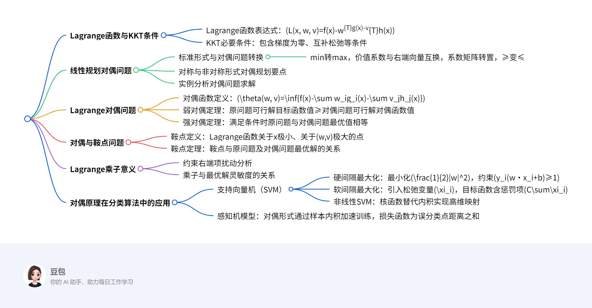

# 有约束优化
## 总览
---
### 一段话总结
文档围绕最优化方法中的对偶原理展开，先介绍了Lagrange函数及KKT必要条件，阐述线性规划问题及其对偶问题的形式与转换要点，通过实例说明对称与非对称形式对偶规划的求解，引入Lagrange对偶问题及对偶函数，证明弱对偶定理与强对偶定理，探讨对偶与鞍点问题的关系、Lagrange乘子的意义，最后结合支持向量机和感知机介绍对偶原理在分类算法中的应用，涉及硬间隔、软间隔最大化及非线性SVM的核函数等内容。

---
### 思维导图

---
### 详细总结
#### 一、最优化基础：Lagrange函数与KKT条件
- **Lagrange函数**：用于处理带约束的优化问题，表达式为 \(L(x, w, v)=f(x)-w^{T}g(x)-v^{T}h(x)\)，其中 \(w, v\) 为Lagrange乘子。
- **KKT必要条件**：一阶必要条件，包含：
  1. \(\nabla_{x}L(x, w, v)=0\)（梯度为零）
  2. \(w_i g_i(x)=0\)（互补松弛条件）
  3. \(g_i(x)≥0\)，\(h_j(x)=0\)，\(w_i≥0\)（约束条件）

#### 二、线性规划对偶问题
1. **标准形式与对偶转换**
   - **原问题**：\(\min cx\)，\(s.t. Ax≥b\)，\(x≥0\)
   - **对偶问题**：\(\max wb\)，\(s.t. wA≤c\)，\(w≥0\)
   - **转换要点**：
     - min变max，价值系数 \(c\) 与右端向量 \(b\) 互换
     - 系数矩阵 \(A\) 转置，约束不等式方向反转（≥变≤）
     - 原问题约束个数=对偶问题变量个数，反之亦然

2. **对称与非对称形式**
   - **对称形式**：约束均为≥或≤，对偶变量符号确定（≥0）。
   - **非对称形式**：含等式约束时，对偶变量无符号限制，如 \(Ax=b\) 对应对偶变量 \(w=u-v\)（\(u, v≥0\)）。

3. **实例分析**
   - **例1**：原问题 \(\min 8x_1+16x_2+12x_3\)，\(s.t. x_1+4x_2≥2\)，\(2x_1+4x_2+4x_3≥3\)，对偶问题为 \(\max 2w_1+3w_2\)，\(s.t. w_1+2w_2≤8\)，\(4w_1≤16\)，\(4w_2≤12\)。

#### 三、Lagrange对偶问题
1. **对偶函数与问题定义**
   - **对偶函数**：\(\theta(w, v)=\inf\{f(x)-w^{T}g(x)-v^{T}h(x)|x∈D\}\)，是关于 \(w, v\) 的凹函数。
   - **对偶问题**：\(\max \theta(w, v)\)，\(s.t. w≥0\)。

2. **对偶定理**
   - **弱对偶定理**：原问题可行解 \(x\) 与对偶问题可行解 \((w, v)\) 满足 \(f(x)≥\theta(w, v)\)，推论包括对偶间隙 \(\delta=f_{\min}-\theta_{\max}≥0\)。
   - **强对偶定理**：当 \(f\) 凸、\(g_i\) 凹、\(h_j\) 线性且存在严格可行解时，\(f_{\min}=\theta_{\max}\)。

#### 四、对偶与鞍点问题
1. **鞍点定义**：点 \((\bar{x}, \bar{w}, \bar{v})\) 满足对任意 \(x, w≥0, v\)，有 \(L(\bar{x}, w, v)≤L(\bar{x}, \bar{w}, \bar{v})≤L(x, \bar{w}, \bar{v})\)，即关于 \(x\) 极小、关于 \((w, v)\) 极大。

2. **鞍点定理**
   - 鞍点必为原问题与对偶问题的最优解。
   - 当 \(f\) 凸、\(g_i\) 凹、\(h_j\) 线性时，最优解对应鞍点。

#### 五、Lagrange乘子的意义
- **约束扰动分析**：
  - 等式约束 \(h(x)=\lambda\) 扰动时，乘子 \(v^*\) 表示目标函数对 \(\lambda\) 的灵敏度，即 \(\frac{d}{d\lambda}f(x^*(\lambda))|_{\lambda=0}=v^*\)。
  - 不等式约束 \(g(x)≥\varepsilon\) 扰动时，若约束起作用（\(g(x^*)=0\)），乘子 \(w^*\) 为灵敏度；若不起作用（\(g(x^*)>0\)），\(w^*=0\)。

#### 六、对偶原理在分类算法中的应用
1. **支持向量机（SVM）**
   - **硬间隔最大化**：
     - 目标：\(\min \frac{1}{2}\|w\|^2\)，约束 \(y_i(w·x_i+b)≥1\)。
     - 对偶问题：\(\max -\frac{1}{2}\sum_{i,j}\alpha_i\alpha_jy_iy_jx_i·x_j+\sum\alpha_i\)，\(s.t. \sum\alpha_iy_i=0\)，\(\alpha_i≥0\)。
   - **软间隔最大化**：引入松弛变量 \(\xi_i≥0\)，目标函数为 \(\min \frac{1}{2}\|w\|^2+C\sum\xi_i\)，对偶约束为 \(0≤\alpha_i≤C\)。
   - **非线性SVM**：通过核函数 \(K(x_i, x_j)=\phi(x_i)·\phi(x_j)\) 将数据映射到高维空间，常见核函数包括多项式核、RBF核。

2. **感知机模型**
   - **对偶形式**：将 \(w, b\) 表示为样本的线性组合 \(w=\sum n_ihy_ix_i\)，\(b=\sum n_ihy_i\)，通过计算样本内积矩阵 \(G=[x_i·x_j]\) 加速训练。

---
### 关键问题
1. **什么是弱对偶定理？其核心结论是什么？**
   - **答案**：弱对偶定理指出，原问题可行解的目标函数值不小于对偶问题可行解的对偶函数值（\(f(\bar{x})≥\theta(\bar{w}, \bar{v})\)）。核心结论包括：对偶间隙 \(\delta=f_{\min}-\theta_{\max}≥0\)；若原问题无界（\(f_{\min}=-\infty\)），则对偶函数恒为 \(-\infty\)；若对偶问题无界（\(\theta_{\max}=+\infty\)），则原问题无可行解。

2. **线性规划对偶问题的转换规则有哪些？以标准形式为例说明。**
   - **答案**：转换规则包括：
     - 目标函数：min转max，价值系数与右端向量互换。
     - 约束条件：系数矩阵转置，不等式方向反转（≥变≤）。
     - 变量符号：原问题约束为≥时，对偶变量≥0；等式约束对应对偶变量无符号限制。
   - **示例**：原问题 \(\min cx\)，\(s.t. Ax≥b\)，\(x≥0\) 的对偶问题为 \(\max wb\)，\(s.t. wA≤c\)，\(w≥0\)。

3. **支持向量机中核函数的作用是什么？常见的核函数有哪些？**
   - **答案**：核函数的作用是将低维空间中的非线性可分数据映射到高维空间，使其线性可分，同时避免直接计算高维向量的内积，降低计算复杂度。
   - **常见核函数**：
     - 多项式核：\(K(x, z)=(x·z)^d\)
     - 径向基函数（RBF）：\(K(x, z)=e^{-\|x-z\|^2/2\sigma}\)
     - 双曲正切核：\(K(x, z)=\tanh(\kappa x·z+\theta)\)

## 对偶原理与线性规划对偶问题总结  

### 一、核心概念：线性规划对偶问题  
**原问题标准形式**（以极小化为例）：  
\[
\begin{cases}
\min & c^T x \\
\text{s.t.} & Ax \geq b \\
& x \geq 0
\end{cases}
\]  
- **变量**：\(x \in \mathbb{R}^n\) 为决策变量，\(c\) 为价值系数向量，\(A\) 为约束矩阵，\(b\) 为右端项向量。  

**对偶问题形式**：  
\[
\begin{cases}
\max & w^T b \\
\text{s.t.} & w^T A \leq c^T \\
& w \geq 0
\end{cases}
\]  
- **变量**：\(w \in \mathbb{R}^m\) 为对偶变量，对应原问题的 \(m\) 个约束条件。  

**关键关系**：  
- 原问题是 **极小化**，对偶问题是 **极大化**（min ↔ max）。  
- 原问题的 **约束矩阵转置** 构成对偶问题的约束矩阵（\(A \to A^T\)）。  
- 原问题的 **右端项 \(b\)** 成为对偶问题的价值系数，原问题的 **价值系数 \(c\)** 成为对偶问题的右端项（\(b \leftrightarrow c\)）。  
- 原问题约束的 **不等式方向反转**（\(\geq \to \leq\)）。  

### 二、对偶问题的对偶是原问题（对偶性定理）  
**推导过程**：  
1. **对偶问题**（以矩阵形式表示）：  
   \[
   \max \ w^T b \quad \text{s.t.} \ w^T A \leq c^T, \ w \geq 0
   \]  
2. **将对偶问题转换为原问题形式**：  
   - 目标函数：\(\max \ w^T b \equiv \min \ -w^T b\)  
   - 约束条件：\(w^T A \leq c^T \equiv -w^T A \geq -c^T\)  
     令 \(w^T = u\)，则对偶问题等价于：  
     \[
     \min \ -u b \quad \text{s.t.} \ -A^T u \geq -c, \ u \geq 0
     \]  
3. **构造对偶问题的对偶问题**：  
   - 原问题（对偶问题的对偶）变量设为 \(x\)，则：  
     \[
     \max \ (-c)^T x \quad \text{s.t.} \ (-A^T)^T x \leq -b, \ x \geq 0
     \]  
   - 化简得：  
     \[
     \max \ -c^T x \quad \text{s.t.} \ A x \leq -b, \ x \geq 0 \quad \text{（此处可能存在符号修正，实际应为与原问题一致的约束）}
     \]  
     最终通过符号调整，可证明对偶问题的对偶 **等价于原问题**。  

**结论**：对偶问题与原问题互为对偶，形成对偶对称性。  

### 三、求解方法：对偶问题的转换规则  
#### 1. **对称形式对偶规划要点**  
- **目标函数**：min → max（或 max → min）。  
- **系数与右端项**：价值系数 \(c\) 与右端项 \(b\) 互换。  
- **约束矩阵**：转置（\(A \to A^T\)）。  
- **不等式方向**：反转（\(\geq \to \leq\) 或 \(\leq \to \geq\)）。  
- **变量与约束个数**：原问题约束个数 = 对偶问题变量个数；原问题变量个数 = 对偶问题约束个数。  

#### 2. **非对称形式对偶规划**  
- 若原问题包含 **等式约束**（如 \(Ax = b\)），则对偶变量 **无符号限制**（可正可负）。  
- 若原问题约束为 \(\leq\)，对偶变量符号为 **\(\geq 0\)**；若为 \(\geq\)，对偶变量符号为 **\(\leq 0\)**（需结合具体转换规则）。  

### 四、示例：线性规划对偶问题求解  
**原问题**（例1，选自文档）：  
\[
\begin{cases}
\min & 8x_1 + 16x_2 + 12x_3 \\
\text{s.t.} & x_1 + 4x_2 \geq 2 \\
& 2x_1 + 4x_2 + 4x_3 \geq 3 \\
& x_1, x_2, x_3 \geq 0
\end{cases}
\]  

**求解对偶问题步骤**：  
1. **确定原问题参数**：  
   - 价值系数向量：\(c = [8, 16, 12]^T\)  
   - 约束矩阵：\(A = \begin{bmatrix} 1 & 4 & 0 \\ 2 & 4 & 4 \end{bmatrix}\)  
   - 右端项向量：\(b = [2, 3]^T\)  
   - 变量：\(x = [x_1, x_2, x_3]^T \geq 0\)  

2. **根据对偶规则构造对偶问题**：  
   - **目标函数**：max \(w^T b = 2w_1 + 3w_2\)  
   - **约束条件**：  
     - 对原问题每个变量 \(x_i\)，对偶问题对应一个约束：  
       - \(x_1\)：\(w_1 \cdot 1 + w_2 \cdot 2 \leq 8\)（来自 \(A\) 的第一列）  
       - \(x_2\)：\(w_1 \cdot 4 + w_2 \cdot 4 \leq 16\)（来自 \(A\) 的第二列）  
       - \(x_3\)：\(w_1 \cdot 0 + w_2 \cdot 4 \leq 12\)（来自 \(A\) 的第三列）  
   - **变量符号**：\(w_1, w_2 \geq 0\)  

**对偶问题最终形式**：  
\[
\begin{cases}
\max & 2w_1 + 3w_2 \\
\text{s.t.} & w_1 + 2w_2 \leq 8 \\
& 4w_1 + 4w_2 \leq 16 \\
& 4w_2 \leq 12 \\
& w_1, w_2 \geq 0
\end{cases}
\]  

**验证对偶性定理**：  
- 若继续对上述对偶问题求对偶，可通过同样规则还原为原问题，证明对偶的对称性。  

### 五、重点总结  
1. **对偶原理核心**：通过构造对偶问题，将原问题转化为对称的优化问题，利用对偶性定理简化求解（如原问题难解时可转而求解对偶问题）。  
2. **关键性质**：  
   - 对偶问题的对偶是原问题（对偶对称性）。  
   - 弱对偶性：原问题最优值 ≥ 对偶问题最优值（当强对偶条件满足时，两者相等）。  
3. **应用场景**：  
   - 线性规划中通过对偶问题求解原问题（如单纯形法的对偶版本）。  
   - 机器学习中支持向量机（SVM）的对偶形式推导（利用核函数处理非线性问题）。  

**公式速查表**：  
| 原问题（min）         | 对偶问题（max）       |  
|-----------------------|-----------------------|  
| 目标函数：\(c^T x\)   | 目标函数：\(w^T b\)   |  
| 约束：\(Ax \geq b\)   | 约束：\(w^T A \leq c^T\) |  
| 变量：\(x \geq 0\)    | 变量：\(w \geq 0\)    |

## 对偶与支持向量机总结  

### 一、核心概念：超平面与线性分类器  
**定义**：  
- **超平面**：在 \(n\) 维空间中，线性分类器的决策边界为超平面 \(w^T x + b = 0\)，将空间划分为正负两类（如 \(y=+1\) 和 \(y=-1\)）。  
- **目标**：寻找最优超平面，使分类准确率高且对新样本泛化能力强。  

**关键问题**：  
1. 不同超平面对新样本分类效果是否相同？  
2. **最优超平面**的标准：使两类样本到超平面的**间隔（Margin）最大化**，降低误分类风险。  

### 二、间隔度量：函数间隔与几何间隔  
#### 1. **函数间隔**  
- **定义**：  
  - 样本点 \((x_i, y_i)\) 的函数间隔：\(\hat{\gamma}_i = y_i(w^T x_i + b)\)  
  - 数据集的函数间隔：\(\hat{\gamma} = \min_i \hat{\gamma}_i\)  
- **缺陷**：参数 \(w, b\) 成比例缩放时（如 \(2w, 2b\)），函数间隔随之缩放，但超平面本质不变，导致度量不唯一。  

#### 2. **几何间隔**  
- **定义**：  
  - 样本点 \((x_i, y_i)\) 的几何间隔：\(\gamma_i = \frac{y_i(w^T x_i + b)}{\|w\|}\)  
  - 数据集的几何间隔：\(\gamma = \min_i \gamma_i\)  
- **优点**：对 \(w, b\) 的缩放不敏感，是**标准化的距离度量**，直接反映样本到超平面的实际距离。  

**对比**：  
| 指标         | 函数间隔                | 几何间隔                |  
|--------------|-------------------------|-------------------------|  
| 缩放不变性   | 不不变（随 \(w, b\) 变化） | 不变（仅与超平面位置有关） |  
| 物理意义     | 带符号的“相对距离”      | 标准化的“绝对距离”      |  

### 三、硬间隔最大化支持向量机（线性可分）  
**目标**：寻找超平面，使几何间隔最大化，即：  
\[
\max \quad \gamma = \frac{2}{\|w\|} \quad \text{s.t.} \quad y_i(w^T x_i + b) \geq 1 \quad (i=1,2,\dots,n)
\]  
- **等价优化问题**：最小化 \(\frac{1}{2}\|w\|^2\)（凸二次规划问题），约束为 \(y_i(w^T x_i + b) \geq 1\)。  

**求解方法：对偶法**  
1. **构造Lagrange函数**：  
\[
L(w, b, \alpha) = \frac{1}{2}\|w\|^2 - \sum_{i=1}^n \alpha_i \left(y_i(w^T x_i + b) - 1\right), \quad \alpha_i \geq 0
\]  
2. **对 \(w, b\) 求极小值**：  
   - 求导并令梯度为零：  
     \[
     w = \sum_{i=1}^n \alpha_i y_i x_i, \quad \sum_{i=1}^n \alpha_i y_i = 0
     \]  
   - 代入化简得对偶函数：  
     \[
     \theta(\alpha) = \sum_{i=1}^n \alpha_i - \frac{1}{2} \sum_{i,j=1}^n \alpha_i \alpha_j y_i y_j x_i^T x_j
     \]  
3. **对 \(\alpha\) 求极大值**：  
\[
\max_\alpha \quad \theta(\alpha) \quad \text{s.t.} \quad \sum_{i=1}^n \alpha_i y_i = 0, \ \alpha_i \geq 0
\]  
4. **求解后验参数**：  
   - 最优 \(w^*\)：\(w^* = \sum_{i=1}^n \alpha_i^* y_i x_i\)  
   - 最优 \(b^*\)：对支持向量 \(x_j\)（\(\alpha_j^* > 0\)），\(b^* = y_j - w^{*T} x_j\)。  

**支持向量**：  
- 满足 \(y_i(w^T x_i + b) = 1\) 的样本点，决定超平面位置，其余样本不影响决策边界。  

### 四、示例：硬间隔SVM求解  
**问题**：已知正例点 \(x_1=(1,2)^T, x_2=(2,3)^T, x_3=(3,3)^T\)，负例点 \(x_4=(2,1)^T, x_5=(3,2)^T\)，求最大间隔超平面。  

**步骤**：  
1. **定义样本与标签**：  
   - 正例：\(y_1=y_2=y_3=+1\)，负例：\(y_4=y_5=-1\)。  
2. **构造对偶问题**：  
   - 目标函数：  
     \[
     \max \quad \sum_{i=1}^5 \alpha_i - \frac{1}{2} \sum_{i,j=1}^5 \alpha_i \alpha_j y_i y_j (x_i \cdot x_j)
     \]  
   - 约束：\(\alpha_1 + \alpha_2 + \alpha_3 - \alpha_4 - \alpha_5 = 0\)，\(\alpha_i \geq 0\)。  
3. **计算样本内积矩阵**：  
   | \(x_i \cdot x_j\) | \(x_1\) | \(x_2\) | \(x_3\) | \(x_4\) | \(x_5\) |  
   |-------------------|---------|---------|---------|---------|---------|  
   | \(x_1\)           | 5       | 8       | 9       | 4       | 5       |  
   | \(x_2\)           | 8       | 13      | 15      | 7       | 12      |  
   | \(x_3\)           | 9       | 15      | 18      | 9       | 15      |  
   | \(x_4\)           | 4       | 7       | 9       | 5       | 8       |  
   | \(x_5\)           | 5       | 12      | 15      | 8       | 13      |  
4. **求解对偶问题**（简化假设仅 \(\alpha_1, \alpha_4 > 0\)）：  
   - 设 \(\alpha_1 = \alpha, \alpha_4 = \alpha\)（由约束 \(\alpha_1 - \alpha_4 = 0\)），其余 \(\alpha_i=0\)，代入目标函数：  
     \[
     \max \quad 2\alpha - \frac{1}{2} \left( \alpha^2 (1 \cdot 1 \cdot 5) + \alpha^2 (-1 \cdot -1 \cdot 5) - 2\alpha^2 (1 \cdot -1 \cdot 4) \right)
     \]  
     化简得：\(\max \quad 2\alpha - 7\alpha^2\)，解得 \(\alpha = \frac{1}{7}\)。  
5. **计算最优参数**：  
   - \(w^* = \alpha y_1 x_1 + \alpha y_4 x_4 = \frac{1}{7}(x_1 - x_4) = \frac{1}{7}(-1, 1)^T\)  
   - 取支持向量 \(x_1\)，计算 \(b^* = y_1 - w^{*T} x_1 = 1 - \frac{1}{7}(-1 \cdot 1 + 1 \cdot 2) = \frac{6}{7}\)。  
6. **超平面方程**：  
   \[
   -\frac{1}{7}x_1 + \frac{1}{7}x_2 + \frac{6}{7} = 0 \quad \Rightarrow \quad -x_1 + x_2 + 6 = 0 \quad \text{（化简为）} \quad x_2 = x_1 - 6
   \]  

**结果可视化**：  
- 超平面：\(x_2 = x_1 - 6\)  
- 间隔边界：\(x_2 = x_1 - 4\) 和 \(x_2 = x_1 - 8\)  
- 支持向量：\(x_1\) 和 \(x_4\)（距超平面最近的样本点）。  

### 五、软间隔与非线性SVM（扩展）  
#### 1. **软间隔最大化（含噪音数据）**  
- **目标**：允许少量样本误分类，引入松弛变量 \(\xi_i \geq 0\)，目标函数为：  
  \[
  \min \quad \frac{1}{2}\|w\|^2 + C \sum_{i=1}^n \xi_i \quad \text{s.t.} \quad y_i(w^T x_i + b) \geq 1 - \xi_i, \ \xi_i \geq 0
  \]  
  - \(C\)：惩罚参数，平衡间隔大小与误分类代价。  

#### 2. **非线性SVM（核技巧）**  
- **思想**：通过映射 \(\phi: x \to \mathcal{H}\) 将数据映射到高维空间，使非线性问题线性可分。  
- **核函数**：避免显式高维计算，直接定义内积 \(K(x_i, x_j) = \phi(x_i) \cdot \phi(x_j)\)，常见核函数：  
  - 多项式核：\(K(x, z) = (x \cdot z + c)^d\)  
  - 高斯核（RBF）：\(K(x, z) = e^{-\|x-z\|^2/\sigma^2}\)  
- **对偶问题**：将内积替换为核函数，其余步骤与硬间隔SVM一致。  

### 六、总结  
| 方法         | 适用场景               | 核心思想                          | 关键公式/参数               |  
|--------------|------------------------|-----------------------------------|-----------------------------|  
| 硬间隔SVM    | 线性可分数据           | 最大化几何间隔，解凸二次规划      | \(\min \frac{1}{2}\|w\|^2\) |  
| 软间隔SVM    | 近线性可分数据（含噪音）| 引入松弛变量，平衡间隔与误分类    | \(C\)（惩罚参数）           |  
| 非线性SVM    | 非线性可分数据         | 核函数映射到高维空间              | \(K(x_i, x_j)\)             |  

**支持向量机三宝**：  
1. **间隔**：几何间隔最大化是优化目标；  
2. **对偶**：通过对偶法简化计算，引入核技巧；  
3. **核技巧**：解决非线性分类问题，避免维度灾难。

## 对偶与感知机总结  

### 一、感知机模型基础  
**定义**：  
感知机是**二分类线性判别模型**，用于解决线性可分问题。其数学表达式为：  
\[
f(x) = \text{sign}(w^T x + b)
\]  
- **输入**：特征向量 \(x \in \mathbb{R}^n\)  
- **输出**：类别 \(y \in \{-1, +1\}\)  
- **超平面**：决策边界 \(w^T x + b = 0\)，将空间分为正负两类。  

**核心思想**：  
通过迭代调整参数 \(w, b\)，使误分类点到超平面的距离之和最小。  

**损失函数**：  
\[
L(w, b) = -\sum_{x_i \in M} y_i (w^T x_i + b)
\]  
- \(M\)：误分类点集合  
- **特点**：非负函数，误分类点越少或距离越近，损失越小。  

### 二、感知机学习算法（原始形式）  
**求解方法：随机梯度下降法**  
1. **初始化参数**：取 \(w_0 = 0, b_0 = 0\) 或任意初值。  
2. **迭代更新**：  
   - 选取误分类点 \((x_i, y_i)\)，即满足 \(y_i (w^T x_i + b) \leq 0\)。  
   - 更新规则：  
     \[
     w \leftarrow w + \eta y_i x_i, \quad b \leftarrow b + \eta y_i
     \]  
     其中 \(\eta \in (0, 1]\) 为学习率。  
3. **终止条件**：无误分类点或达到最大迭代次数。  

**示例：二维线性可分数据分类**  
**问题**：已知正例点 \(x_1=(1,1)^T, x_2=(2,2)^T\)，负例点 \(x_3=(1,-1)^T\)，用感知机算法求分类超平面。  

**步骤**：  
1. **初始化**：\(w = (0, 0)^T, b = 0, \eta = 1\)。  
2. **迭代过程**：  
   - **第1次**：选取 \(x_1=(1,1)^T, y_1=+1\)，此时 \(w^T x_1 + b = 0 \leq 0\)（误分类），更新：  
     \[
     w = (0 + 1 \cdot 1 \cdot 1, 0 + 1 \cdot 1 \cdot 1) = (1, 1), \quad b = 0 + 1 \cdot 1 = 1
     \]  
     超平面：\(x_1 + x_2 + 1 = 0\)。  
   - **第2次**：检查 \(x_3=(1,-1)^T, y_3=-1\)，计算 \(1 \cdot 1 + 1 \cdot (-1) + 1 = 1 > 0\)（正确分类）。  
   - **第3次**：选取 \(x_2=(2,2)^T, y_2=+1\)，计算 \(1 \cdot 2 + 1 \cdot 2 + 1 = 5 > 0\)（正确分类）。  
   - **当前无误分类点，算法终止**。  
3. **最终超平面**：\(x_1 + x_2 + 1 = 0\)。  

### 三、感知机模型的对偶形式  
**核心思想**：  
将参数 \(w, b\) 表示为样本的线性组合，减少计算量。  
- 设每个样本 \((x_i, y_i)\) 被更新 \(n_i\) 次，则：  
  \[
  w = \sum_{i=1}^n n_i \eta y_i x_i, \quad b = \sum_{i=1}^n n_i \eta y_i
  \]  
- **对偶形式模型**：  
  \[
  f(x) = \text{sign}\left( \sum_{i=1}^n n_i \eta y_i (x_i \cdot x) + \sum_{i=1}^n n_i \eta y_i \right)
  \]  

**求解方法**：  
1. **初始化计数**：\(n_i = 0\)（\(i=1,2,\dots,n\)）。  
2. **计算Gram矩阵**：预计算样本内积矩阵 \(G = [x_i \cdot x_j]_{n \times n}\)，加速后续计算。  
3. **迭代更新**：  
   - 选取误分类点 \((x_j, y_j)\)，即满足：  
     \[
     y_j \left( \sum_{i=1}^n n_i \eta y_i (x_i \cdot x_j) + \sum_{i=1}^n n_i \eta y_i \right) \leq 0
     \]  
   - 更新 \(n_j \leftarrow n_j + 1\)。  
4. **终止条件**：无误分类点。  

**示例：对偶形式求解同一问题**  
**问题**：同上例，使用对偶形式求解。  

**步骤**：  
1. **初始化**：\(n_1 = n_2 = n_3 = 0, \eta = 1\)。  
2. **计算Gram矩阵**：  
   \[
   G = \begin{bmatrix}
   x_1 \cdot x_1 = 2 & x_1 \cdot x_2 = 4 & x_1 \cdot x_3 = 0 \\
   x_2 \cdot x_1 = 4 & x_2 \cdot x_2 = 8 & x_2 \cdot x_3 = 0 \\
   x_3 \cdot x_1 = 0 & x_3 \cdot x_2 = 0 & x_3 \cdot x_3 = 2
   \end{bmatrix}
   \]  
3. **迭代过程**：  
   - **第1次**：选取 \(x_1=(1,1)^T, y_1=+1\)，此时 \(n_1=1\)，计算：  
     \[
     w = 1 \cdot 1 \cdot (1,1) = (1,1), \quad b = 1 \cdot 1 = 1
     \]  
   - **第2次**：检查 \(x_3=(1,-1)^T, y_3=-1\)，计算：  
     \[
     y_3 \left( n_1 \eta y_1 (x_1 \cdot x_3) + b \right) = -1 \cdot (1 \cdot 1 \cdot 0 + 1) = -1 \leq 0 \quad \text{（误分类）}
     \]  
     更新 \(n_3=1\)，计算：  
     \[
     w = (1,1) + 1 \cdot (-1) \cdot (1,-1) = (0, 2), \quad b = 1 + 1 \cdot (-1) = 0
     \]  
   - **第3次**：检查 \(x_1=(1,1)^T, y_1=+1\)，计算：  
     \[
     y_1 \left( n_1 \eta y_1 (x_1 \cdot x_1) + n_3 \eta y_3 (x_3 \cdot x_1) + b \right) = 1 \cdot (1 \cdot 2 + 1 \cdot (-1) \cdot 0 + 0) = 2 > 0 \quad \text{（正确分类）}
     \]  
   - **后续无误分类点，算法终止**。  
4. **最终参数**：  
   \[
   w = (0, 2), \quad b = 0 \quad \Rightarrow \quad \text{超平面：} \ 2x_2 = 0 \quad \text{即} \ x_2 = 0
   \]  

### 四、原始形式与对偶形式对比  
| 形式       | 优点                          | 缺点                          | 适用场景               |  
|------------|-------------------------------|-------------------------------|------------------------|  
| **原始形式** | 直观，无需预计算内积          | 高维数据计算量大              | 特征维度低的数据       |  
| **对偶形式** | 利用Gram矩阵加速计算          | 需要存储内积矩阵，占用内存    | 样本数量少的数据       |  

### 五、重点总结  
1. **核心目标**：通过迭代调整超平面，使误分类点距离之和最小。  
2. **关键性质**：  
   - 仅适用于**线性可分数据**，若数据不可分则算法不收敛。  
   - 解不唯一，依赖初值和迭代顺序。  
3. **对偶形式核心**：将参数表示为样本线性组合，通过预计算内积矩阵减少重复计算。  

**公式速查表**：  
- 原始更新规则：\(w \leftarrow w + \eta y_i x_i, \ b \leftarrow b + \eta y_i\)  
- 对偶模型：\(f(x) = \text{sign}\left( \sum_{i=1}^n n_i \eta y_i (x_i \cdot x) + \sum_{i=1}^n n_i \eta y_i \right)\)