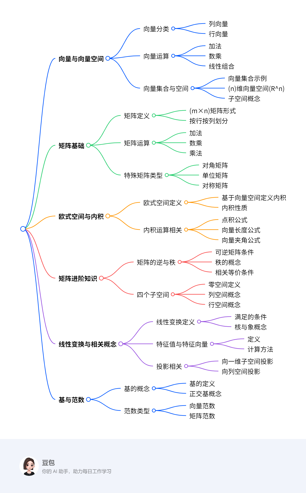
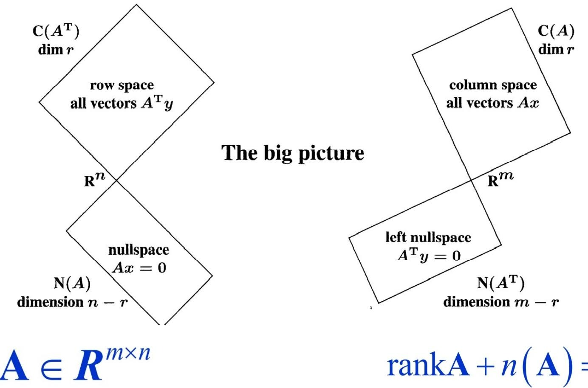

# 线代基础
## 概览
---
### 一段话总结
本文围绕线性代数展开，介绍向量与向量空间，包括向量运算、集合、子空间等；矩阵相关知识，如矩阵运算、特殊矩阵、逆与秩；**欧式空间定义内积，可计算向量长度和夹角**；矩阵乘法有多种理解方式；还涉及线性变换、特征值与特征向量、投影、基与正交基、范数等内容，这些知识在数据科学、神经网络等领域有重要应用。

---
### 思维导图

---
### 详细总结
1. **向量与向量空间**
    - **向量形式**：向量分为列向量（如\(v=\begin{bmatrix}1\\2\\3\end{bmatrix}\) ）和行向量（如\(v=\begin{bmatrix}1&2&3\end{bmatrix}\) ），多数场合向量指列向量。
    - **向量运算**：包括加法、数乘，其任意组合为线性组合。如\(c v+d w=c\begin{bmatrix}1\\1\\0\end{bmatrix}+d\begin{bmatrix}0\\1\\1\end{bmatrix}=\begin{bmatrix}c\\c + d\\d\end{bmatrix}\) 。
    - **向量集合与空间**：向量集合有有限元素和无限元素的情况。\(n\)维向量空间\(R^n\)包含所有\(n\)个分量的向量。子空间由向量张成，如\(Span(v, w)=\{c v+d w|c, d\in R\}\) ，非空子集满足加法和数乘封闭则为子空间。
2. **矩阵**
    - **矩阵概念**：\(m×n\)矩阵\(A=(a_{ij})_{1\leq i\leq m,1\leq j\leq n}\) ，全体记为\(M_{m×n}(R)\) 或\(Mat_{m×n}(R)\) ，可按行或列划分成向量。
    - **矩阵运算**：加法需同型矩阵对应元素相加；数乘是数与矩阵各元素相乘；乘法有多种理解方式，如\((i, j)\)元素是A的第\(i\)行与B的第\(j\)列的内积，也可看作列或行的线性组合等。
    - **特殊矩阵**：有对角矩阵、单位矩阵、上（下）三角矩阵、零矩阵等，还有对称矩阵（\(A^T = A\) ）和反对称矩阵（\(A^T=-A\) ）。
3. **欧式空间与内积**
    - **欧式空间定义**：在实数域\(R\)上的线性空间\(V\)中定义满足交换率、齐次性、分配率和正定性的二元实函数\((x, y)\)为内积，定义了内积的\(V\)为欧氏空间。
    - **内积相关运算**：点积是内积的一种形式，\(v\cdot w = v_1w_1+\cdots + v_nw_n\) 。向量长度\(\|v\|=\sqrt{v\cdot v}\) ，夹角\(\theta\)满足\(\cos\theta=\frac{v\cdot w}{\|v\|\|w\|}\) ，\(v\)与\(w\)正交当且仅当\(v\cdot w = 0\) 。
4. **矩阵的其他知识**
    - **矩阵的逆与秩**：方阵\(A\)满足\(AA^{-1}=A^{-1}A = I_n\)时可逆，不可逆的矩阵为奇异矩阵。矩阵主元个数是秩\(r(A)\) ，\(A\)可逆、\(r(A)=n\) 、方程\(Ax = b\)有唯一解这三条等价。
    - **四个子空间**：零空间\(N(A)\)是\(Ax = 0\)的解集，是子空间；列空间\(Col A\)由列向量张成；行空间\(Row A\)由行向量张成；行空间与零空间互为正交补，且\(rank A + n(A)=n\) 。
5. **线性变换等**
    - **线性变换**：设\(V\)、\(W\)为\(R\)上向量空间，\(T:V\to W\)满足\(T(v_{1}+v_{2}) = T(v_{1})+T(v_{2})\) ，\(T(cv_{1}) = cT(v_{1})\) 时为线性映射。\(ker T=\{v\in V|T(v)=0_W\}\) ，\(Im(T)=\{T(v)|v\in V\}\) ，且\(dim V = dim ker(T)+dim Im(T)\) 。
    - **特征值与特征向量**：非零向量\(x\)满足\(Ax=\lambda x\)时，\(x\)是特征向量，\(\lambda\)是特征值。计算时先求特征多项式\(f_A(\lambda)=det(A-\lambda I)\)的根得到特征值，再求解\((A - \lambda I)x = 0\)得特征向量。
    - **投影**：向量向一维子空间或矩阵列空间投影，通过向量正交关系求解投影向量和投影矩阵。
    - **基与正交基**：向量空间\(V\)的子集满足向量线性无关且张成\(V\)时为基，基中向量数量是\(V\)的维数。相互正交且单位化的向量组构成标准正交基。
    - **范数**：向量范数满足非负性、齐次性和三角不等式，如1 - 范数\(\|x\|_1=\sum|x_i|\) ，2 - 范数\(\|x\|=\sqrt{(x, x)}\) 等；矩阵范数类似，且有与向量范数相容的概念和多种具体范数形式。
---
### 关键问题
1. **线性相关和线性无关的向量组对张成子空间的维数有何影响？**
    - 若向量组\(v_1,\cdots,v_m\in R^n\)线性相关，那么\(dim Span(v_1,\cdots,v_m)<m\) ；若向量组线性无关，那么\(dim Span(v_1,\cdots,v_m)=m\) 。
2. **如何判断一个矩阵是否可逆？**
    - 可以通过判断矩阵是否满足\(AA^{-1}=A^{-1}A = I_n\)来确定，若满足则可逆；也可看矩阵的秩，当\(r(A)=n\)时可逆；还可看对于任意\(b\in R^n\) ，方程\(Ax = b\)是否有唯一解，有则可逆。
3. **向量范数和矩阵范数有哪些常见类型，它们的定义和性质是什么？**
    - 向量范数常见类型有1 - 范数\(\|x\|_1=\sum|x_i|\) ，2 - 范数\(\|x\|=\sqrt{(x, x)}\) ，\(\infty\) - 范数\(\|x\|=\max_i|x_i|\) 等，都满足非负性、齐次性和三角不等式。矩阵范数常见类型有Frobenius范数\(\|A\|_F=(\sum_{i = 1}^{n}\sum_{j = 1}^{n}|a_{ij}|^{2})^{\frac{1}{2}}\) ，列和范数\(\|A\|_1=\max_j\{\sum_{i = 1}^{m}|a_{ij}|\}\) 等，满足正定条件、齐次条件、三角不等式，部分还满足相容条件。 
## 四个子空间
### 零空间
1. **定义**：矩阵\(A\)的零空间记为\(N(A)\)，是方程\(Ax = 0\)的解集，它是一个子空间，满足对加法和数乘封闭。当\(A\)是可逆的线性变换（一对一）时，零空间仅含零向量 。
2. **求解方法**：
    - 对矩阵\(A\)进行初等行变换，将其化为行最简形矩阵。通过行最简形矩阵确定自由变量，自由变量对应的列在原矩阵中去掉后，剩余列向量构成的向量组的极大线性无关组，就是零空间的解的基础形式。
    - 用自由变量表示其他变量，进而得到零空间的通解。具体来说，设行最简形矩阵对应的方程组，自由变量有\(x_{i_1},x_{i_2},\cdots,x_{i_k}\)，其他变量为\(x_{j_1},x_{j_2},\cdots,x_{j_{n - k}}\)（\(n\)为矩阵\(A\)的列数）。从行最简形矩阵对应的方程中解出\(x_{j_1},x_{j_2},\cdots,x_{j_{n - k}}\)关于\(x_{i_1},x_{i_2},\cdots,x_{i_k}\)的表达式，然后将这些表达式代入向量形式\(\begin{bmatrix}x_1\\x_2\\\vdots\\x_n\end{bmatrix}\)，得到零空间的通解。

### 列空间
1. **定义**：矩阵\(A\)的列空间记作\(Col A\)或\(C(A)\) ，是由矩阵\(A\)的列向量张成的空间。若矩阵\(A\)表示一个函数，那么列空间就是该函数的值域。
2. **求解方法**：
    - 对矩阵\(A\)进行初等行变换，化为行阶梯形矩阵。
    - 找出阶梯形矩阵中主元（每行从左至右第一个非零元素）所在的列。
    - 这些主元所在列对应的原矩阵\(A\)中的列向量，就构成了列空间的一组基。用这组基线性表示的所有向量，就是列空间的元素。

### 行空间
1. **定义**：矩阵\(A\)的行空间记作\(Row A\)或\(R(A)\)，是由矩阵\(A\)的行向量张成的空间。
2. **求解方法**：
    - 对矩阵\(A\)进行初等行变换，化为行最简形矩阵。
    - 行最简形矩阵中的非零行向量构成了行空间的一组基。因为初等行变换不改变矩阵行向量组的线性相关性和行空间，所以这些非零行向量张成的空间就是原矩阵\(A\)的行空间。用这组基线性表示的所有向量，就是行空间的元素。
3. **举例**
    设矩阵\(A = \begin{bmatrix}1&2&3\\2&4&6\\1&3&4\end{bmatrix}\)，求解其行空间。
    1. **对矩阵\(A\)进行初等行变换化为行最简形矩阵**：
        - 第二行减去第一行的\(2\)倍，第三行减去第一行，得到\(\begin{bmatrix}1&2&3\\0&0&0\\0&1&1\end{bmatrix}\)。
        - 交换第二行和第三行，得到\(\begin{bmatrix}1&2&3\\0&1&1\\0&0&0\end{bmatrix}\)。
        - 第一行减去第二行的\(2\)倍，得到行最简形矩阵\(R=\begin{bmatrix}1&0&1\\0&1&1\\0&0&0\end{bmatrix}\)。
    2. **确定行空间的一组基**：
        - 行最简形矩阵\(R\)的非零行向量为\(\begin{bmatrix}1&0&1\end{bmatrix}\)和\(\begin{bmatrix}0&1&1\end{bmatrix}\)。
        - 所以矩阵\(A\)的行空间\(Row A = Span\left\{\begin{bmatrix}1&0&1\end{bmatrix},\begin{bmatrix}0&1&1\end{bmatrix}\right\}\)，这两个向量构成了行空间的一组基，行空间中的任意向量都可以表示为这两个向量的线性组合，如\(k_1\begin{bmatrix}1&0&1\end{bmatrix}+k_2\begin{bmatrix}0&1&1\end{bmatrix}\)，其中\(k_1,k_2\in R\) 。 
### 左零空间
### 正交补关系
矩阵的行空间与其对应的零空间是正交子空间，即行空间和零空间互为正交补。这意味着行空间中的任意一个向量都和零空间中的任意向量正交。这种正交补关系是由子空间正交的定义决定的，在研究矩阵性质和向量空间结构时具有重要意义，例如在求解一些线性方程组和优化问题中可利用该性质简化计算。 
这张图展示了矩阵 \(A\in R^{m\times n}\) 的四个基本子空间及其关系，以下是详细解释：
### 关系

#### 矩阵 \(A\) 的基本信息
- \(A\) 是一个 \(m\times n\) 的实矩阵，即矩阵 \(A\) 有 \(m\) 行 \(n\) 列 。
#### 四个基本子空间
1. **行空间（Row Space）**
    - 表示为 \(C(A^T)\) ，是由 \(A^T\) 的列向量张成的空间，等同于 \(A\) 的行向量张成的空间。
    - 维度为 \(r\)（\(r\) 是矩阵 \(A\) 的秩） 。行空间中的向量都可以表示为 \(A^Ty\) 的形式，这里 \(y\) 是适当维度的向量。行空间是 \(R^n\) 的子空间。
2. **零空间（Nullspace）**
    - 表示为 \(N(A)\) ，是满足 \(Ax = 0\) 的所有向量 \(x\) 构成的空间，即齐次线性方程组 \(Ax = 0\) 的解空间。
    - 维度为 \(n - r\) ，是 \(R^n\) 的子空间。
3. **列空间（Column Space）**
    - 表示为 \(C(A)\) ，是由 \(A\) 的列向量张成的空间。
    - 维度为 \(r\) ，列空间中的向量都可以表示为 \(Ax\) 的形式，其中 \(x\) 是合适维度的向量。列空间是 \(R^m\) 的子空间。 
4. **左零空间（Left Nullspace）**
    - 表示为 \(N(A^T)\) ，是满足 \(A^Ty = 0\) 的所有向量 \(y\) 构成的空间 。
    - 维度为 \(m - r\) ，是 \(R^m\) 的子空间。
#### 子空间关系
- **维度关系**：图中体现了秩 - 零度定理，即 \(rank(A)+n(A)=n\) （这里 \(rank(A)\) 是矩阵 \(A\) 的秩，\(n(A)\) 是零空间 \(N(A)\) 的维度，也叫零度 ）。对于列空间和左零空间，有 \(rank(A)+ \text{dim}(N(A^T)) = m\) 。
- **空间正交关系**：行空间 \(C(A^T)\) 与零空间 \(N(A)\) 是 \(R^n\) 中的正交补空间；列空间 \(C(A)\) 与左零空间 \(N(A^T)\) 是 \(R^m\) 中的正交补空间 。即行空间中的向量与零空间中的向量正交，列空间中的向量与左零空间中的向量正交。 图中通过分开绘制不同子空间来体现这种关系。 
## 线性变换
### 线性变换定义
 - **定义内容**： 从向量空间 \(V\) 到 \(V\) 自身的映射，称为 \(V\) 到 \(V\) 的变换，若该变换满足线性性质（设 \(T\) 是变换，\(\vec{u},\vec{v}\in V\) ，\(k\) 为标量 ，则 \(T(\vec{u}+\vec{v}) = T(\vec{u})+T(\vec{v})\) 且 \(T(k\vec{u})=kT(\vec{u})\) ），就是线性变换 。文中虽未明确写出线性性质，但从“线性变换”名称可推知。
 - **反例**：未给出具体反例，一般来说，若变换 \(T\) 不满足上述线性性质，如 \(T(\vec{u}+\vec{v})\neq T(\vec{u})+T(\vec{v})\) 或 \(T(k\vec{u})\neq kT(\vec{u})\) ，就不是线性变换。比如 \(T(\vec{x})=\vec{x}+\vec{b}\) （\(\vec{b}\neq\vec{0}\) ） ， \(T(\vec{u}+\vec{v})=\vec{u}+\vec{v}+\vec{b}\) ， \(T(\vec{u}) + T(\vec{v})=\vec{u}+\vec{b}+\vec{v}+\vec{b}\) ， \(T(\vec{u}+\vec{v})\neq T(\vec{u})+T(\vec{v})\) ，不是线性变换。
 - **例子**：未给出详细例子，以二维平面向量为例，设 \(T:\mathbb{R}^2\rightarrow\mathbb{R}^2\) ， \(T\left(\begin{bmatrix}x\\y\end{bmatrix}\right)=\begin{bmatrix}0& - 1\\1&0\end{bmatrix}\begin{bmatrix}x\\y\end{bmatrix}\) 。
    - **步骤**：设向量 \(\vec{v}=\begin{bmatrix}x\\y\end{bmatrix}\) ，根据矩阵乘法规则，\(T(\vec{v})=\begin{bmatrix}0\times x+( - 1)\times y\\1\times x + 0\times y\end{bmatrix}=\begin{bmatrix}-y\\x\end{bmatrix}\) 。验证线性性质：
        - 设 \(\vec{u}=\begin{bmatrix}x_1\\y_1\end{bmatrix}\) ，\(\vec{v}=\begin{bmatrix}x_2\\y_2\end{bmatrix}\) ，\(\vec{u}+\vec{v}=\begin{bmatrix}x_1 + x_2\\y_1 + y_2\end{bmatrix}\) ，\(T(\vec{u}+\vec{v})=\begin{bmatrix}-(y_1 + y_2)\\x_1 + x_2\end{bmatrix}\) ，\(T(\vec{u})+T(\vec{v})=\begin{bmatrix}-y_1\\x_1\end{bmatrix}+\begin{bmatrix}-y_2\\x_2\end{bmatrix}=\begin{bmatrix}-(y_1 + y_2)\\x_1 + x_2\end{bmatrix}\) ，满足 \(T(\vec{u}+\vec{v}) = T(\vec{u})+T(\vec{v})\) 。
        - 设 \(k\) 为标量，\(T(k\vec{v})=\begin{bmatrix}-ky\\kx\end{bmatrix}\) ，\(kT(\vec{v})=k\begin{bmatrix}-y\\x\end{bmatrix}=\begin{bmatrix}-ky\\kx\end{bmatrix}\) ，满足 \(T(k\vec{v})=kT(\vec{v})\) ，所以 \(T\) 是线性变换 ，此变换效果是将向量逆时针旋转 \(90^{\circ}\) 。 

### 作用于向量的线性变换
 - **本质**：作用于向量的线性变换就是矩阵变换 。
 - **效果**：包括旋转、伸长和缩短 。平移不属于线性变换，属于仿射变换 。例如在二维平面上，矩阵 \(A = \begin{bmatrix}2&0\\0&2\end{bmatrix}\) 作用于向量 \(\vec{v}=\begin{bmatrix}x\\y\end{bmatrix}\) ，\(A\vec{v}=\begin{bmatrix}2x\\2y\end{bmatrix}\) ，是将向量 \(\vec{v}\) 伸长为原来的 \(2\) 倍；矩阵 \(B=\begin{bmatrix}\cos\theta&-\sin\theta\\\sin\theta&\cos\theta\end{bmatrix}\) 作用于向量 \(\vec{v}\) ，是将向量 \(\vec{v}\) 绕原点逆时针旋转 \(\theta\) 角度 。
 - **求解方法（针对矩阵变换形式的线性变换 ）**：已知线性变换对应的矩阵 \(M\) 和向量 \(\vec{v}\) ，求变换后的向量 \(\vec{v}'\) ，只需进行矩阵乘法 \(\vec{v}' = M\vec{v}\) 。例如已知 \(M=\begin{bmatrix}3&0\\0&1\end{bmatrix}\) ，\(\vec{v}=\begin{bmatrix}2\\4\end{bmatrix}\) ，则 \(\vec{v}'=\begin{bmatrix}3&0\\0&1\end{bmatrix}\begin{bmatrix}2\\4\end{bmatrix}=\begin{bmatrix}3\times2 + 0\times4\\0\times2+1\times4\end{bmatrix}=\begin{bmatrix}6\\4\end{bmatrix}\) ，即向量在 \(x\) 方向伸长为原来 \(3\) 倍，\(y\) 方向不变。 
## 特征值与特征向量
### 定义
#### 特征向量与特征值定义
 - 若 \(x\in\mathbb{R}^n\) 满足：\(x\) 非零且存在实数 \(\lambda\) ，使得 \(Ax = \lambda x\) ，则 \(x\) 称为矩阵 \(A\) 的特征向量 ，\(\lambda\) 称为 \(A\) 的特征值 ，同时限定 \(A\) 必须是方阵 。 
#### 求解方法
 - 计算行列式 \(f_A(\lambda)=\det(A - \lambda I)\) ，得到特征多项式 。
 - 求解特征多项式 \(f_A(\lambda)=0\) 的所有根，这些根即为矩阵 \(A\) 的所有特征值 。
 - 针对每个求出的特征值 \(\lambda\) ，求解齐次线性方程组 \((A - \lambda I)x = 0\) ，得到对应特征值的特征向量 。 
# **P48**