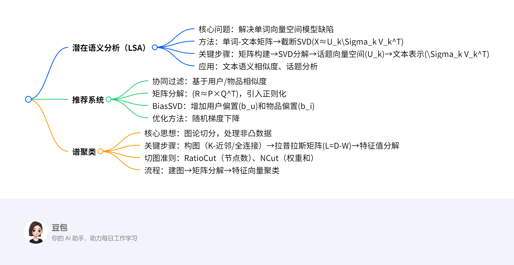

# 线代应用
## 总览

---  
### 一段话总结  
文档主要介绍**线性代数在潜在语义分析（LSA）、推荐系统和谱聚类中的应用**。**潜在语义分析**通过单词-文本矩阵的**截断奇异值分解（SVD）**挖掘文本与单词的话题关系，解决一词多义与多词一义问题；**推荐系统**利用矩阵分解（如Funk-SVD、BiasSVD）预测用户评分，结合用户/物品偏置提升精度；**谱聚类**基于图论构建邻接矩阵和拉普拉斯矩阵，通过特征值分解实现非凸数据聚类，对比K-means更灵活。  

---  
### 思维导图  

---  
### 详细总结  

#### 一、潜在语义分析（LSA）  
**目标**：通过矩阵分解发现文本与单词的潜在话题关系，提升语义相似度准确性。  
1. **单词向量空间模型**  
   - **表示方法**：单词-文本矩阵 \(X_{m×n}\)，元素为TF-IDF值，反映单词在文本中的重要性：  
     \[
     \text{TF-IDF}_{ij} = \frac{\text{tf}_{ij}}{\text{tf}_{\cdot j}} \log\frac{\text{df}}{\text{df}_i}
     \]  
     - \(\text{tf}_{ij}\)：单词\(i\)在文本\(j\)中的频数；\(\text{df}_i\)：含单词\(i\)的文本数。  
   - **缺陷**：无法处理一词多义（如“apple”）和多词一义（如“airplane”与“aircraft”）。  

2. **话题向量空间模型**  
   - **核心思想**：将文本表示为话题向量的线性组合，通过**截断奇异值分解（SVD）**实现：  
     \[
     X \approx U_k \Sigma_k V_k^T
     \]  
     - \(U_k\)：话题向量空间（左奇异向量），每列表示一个话题。  
     - \(\Sigma_k V_k^T\)：文本在话题空间的表示，每列对应一个文本的话题权重。  

3. **示例**  
   - **输入**：11×9单词-文本矩阵（含9个文本、11个单词的频数）。  
   - **截断SVD（\(k=3\)）**：  
     - 左矩阵\(U_3\)：3个话题向量（如“investing”在话题1的权重为0.74）。  
     - 对角矩阵\(\Sigma_3\)：奇异值为3.91、2.61、2.00（重要性递减）。  
     - 右矩阵\(V_3^T\)：9个文本的话题权重（如文本T1在话题1的权重为0.35）。  

4. **非负矩阵分解（补充）**  
   - **形式**：\(X≈WH\)，\(W\)为话题向量，\(H\)为文本话题表示，均为非负矩阵。  
   - **优化**：平方损失函数+梯度下降求解。  

#### 二、推荐系统  
**目标**：通过用户-物品交互矩阵预测评分，实现个性化推荐。  
1. **协同过滤**  
   - **基于用户（UserCF）**：寻找相似用户，推荐其喜欢的物品。  
   - **基于物品（ItemCF）**：寻找相似物品，推荐给目标用户。  
   - **相似度计算**：余弦相似度、皮尔逊相关系数。  

2. **矩阵分解方法**  
   - **Funk-SVD**：  
     - 分解评分矩阵\(R≈P×Q^T\)，\(P\)（用户特征）和\(Q\)（物品特征）。  
     - 目标函数：\(\min \sum(r_{ui}-p_u^T q_i)^2 + \lambda(\|p_u\|^2+\|q_i\|^2)\)（正则化防止过拟合）。  
   - **Bias-SVD**：  
     - 引入全局平均分\(u\)、用户偏置\(b_u\)、物品偏置\(b_i\)：  
       \[
       \hat{r}_{ui} = u + b_u + b_i + p_u^T q_i
       \]  
     - 目标函数：\(\min \sum(r_{ui}-u-b_u-b_i-p_u^T q_i)^2 + \lambda(\|p_u\|^2+\|q_i\|^2+\|b_u\|^2+\|b_i\|^2)\)。  

3. **示例**  
   - **输入**：6用户×12电影的评分矩阵（部分已知评分，如用户1对电影21评1分）。  
   - **预测**：用户1对电影62的评分通过相似用户（如用户3、6）的加权平均计算，结合偏置项优化。  

#### 三、谱聚类  
**目标**：基于图论将数据点转换为图节点，通过切图实现聚类，适用于非凸分布。  
1. **构图方法**  
   - **K-近邻法**：仅当两点互为K近邻时连边，权重\(w_{ij}=e^{-\frac{\|x_i-x_j\|^2}{2\sigma^2}}\)。  
   - **全连接法**：所有点连边，常用高斯核（RBF）：\(w_{ij}=e^{-\frac{\|x_i-x_j\|^2}{2\sigma^2}}\)。  

2. **关键矩阵**  
   - **度矩阵** \(D\)：对角元素为节点度数\(d_i=\sum_j w_{ij}\)。  
   - **拉普拉斯矩阵** \(L=D-W\)，性质：对称半正定，\(f^T L f = \frac{1}{2}\sum_{i,j} w_{ij}(f_i-f_j)^2\)。  

3. **切图准则**  
   - **RatioCut**：最小化割边权重和，同时最大化子图节点数：  
     \[
     \text{RatioCut} = \sum_i \frac{W(A_i, \bar{A_i})}{|A_i|}
     \]  
   - **NCut**：基于子图权重和\(vol(A_i)\)，更鲁棒：  
     \[
     \text{NCut} = \sum_i \frac{W(A_i, \bar{A_i})}{vol(A_i)}
     \]  

4. **算法流程（以NCut为例）**  
   1. 构建相似度矩阵\(S\)→邻接矩阵\(W\)和度矩阵\(D\)。  
   2. 计算标准化拉普拉斯矩阵\(D^{-1/2} L D^{-1/2}\)。  
   3. 取前\(k_1\)个最小特征值对应的特征向量，标准化后得到矩阵\(F\)。  
   4. 对\(F\)的行向量进行K-means聚类，得到最终簇划分。  

---  
### 关键问题  
1. **问题**：潜在语义分析如何提升文本相似度计算的准确性？  
   **答案**：通过截断SVD将文本从单词向量空间转换到话题向量空间，将文本相似度从单词频率比较转为话题权重比较，解决一词多义（如“apple”区分为“水果”和“品牌”话题）和多词一义（如“airplane”与“aircraft”归属同一话题）问题。  

2. **问题**：Bias-SVD相比Funk-SVD的改进点是什么？  
   **答案**：Bias-SVD引入**用户偏置**（如用户评分习惯偏高/低）和**物品偏置**（如热门物品评分普遍高），公式为\(\hat{r}_{ui}=u+b_u+b_i+p_u^T q_i\)，而Funk-SVD仅依赖潜在特征。偏置项能修正用户和物品的固有偏差，提升预测精度。  

3. **问题**：谱聚类为何能处理K-means无法解决的非凸数据？  
   **答案**：  
   - K-means基于欧氏距离和簇中心，仅适用于凸形聚类。  
   - 谱聚类将数据转换为图结构，通过拉普拉斯矩阵特征值分解捕捉数据的全局结构，允许簇间通过“切图”分离，适用于任意形状（如环形、半月形）数据。例如，对“半月形”数据，谱聚类通过邻接矩阵仅连接局部近邻点，避免K-means的错误聚合。

## 潜在语义分析（LSA）  

### 一、核心概念与目标  
**定义**：  
潜在语义分析（LSA）是一种**无监督学习方法**，通过**矩阵分解**挖掘文本与单词之间的**潜在话题关系**，解决传统单词向量空间模型的语义表示缺陷（如一词多义、多词一义）。  
**核心目标**：  
- 将文本从**单词向量空间**转换到**话题向量空间**，以话题向量表示文本语义，提升文本相似度计算的准确性。  
- 通过**截断奇异值分解（SVD）**或**非负矩阵分解（NMF）**实现矩阵降维，发现文本集合中的隐含话题结构。  

### 二、单词向量空间模型的局限性  
**表示方法**：  
- **单词-文本矩阵（X）**：元素为单词在文本中的**TF-IDF值**，反映单词重要性：  
  \[
  \text{TF-IDF}_{ij} = \frac{\text{tf}_{ij}}{\text{tf}_{\cdot j}} \log\frac{\text{df}}{\text{df}_i}
  \]  
  - \(\text{tf}_{ij}\)：单词\(i\)在文本\(j\)中的频数；\(\text{df}_i\)：含单词\(i\)的文本数。  
- **相似度计算**：向量内积或余弦相似度，假设“共同单词越多，语义越相似”。  

**缺陷**：  
1. **一词多义**：如“apple”可能表示“水果”或“品牌”，单词向量空间无法区分。  
2. **多词一义**：如“airplane”与“aircraft”视为不同单词，导致相似文本相似度计算偏低。  

### 三、话题向量空间模型与潜在语义分析  
**核心思想**：  
- 每个文本由**多个话题**的线性组合表示，每个话题由一组语义相关的单词构成。  
- 通过矩阵分解将单词-文本矩阵 \(X \approx T \times Y\)，其中：  
  - \(T\)（单词-话题矩阵）：列向量为话题向量，表示单词与话题的关联强度。  
  - \(Y\)（话题-文本矩阵）：列向量为文本的话题权重，表示文本中各话题的重要性。  

**关键步骤**：  
1. **矩阵分解**：对单词-文本矩阵 \(X\) 进行**截断SVD**或**非负矩阵分解（NMF）**。  
2. **话题向量空间构建**：分解得到的左矩阵（如SVD中的\(U_k\)或NMF中的\(W\)）即为话题向量空间。  
3. **文本话题表示**：右矩阵（如SVD中的\(\Sigma_k V_k^T\)或NMF中的\(H\)）表示文本在话题空间中的投影。  

### 四、求解方法：截断奇异值分解（SVD）  
**算法流程**：  
1. **构造单词-文本矩阵** \(X_{m \times n}\)（\(m\)为单词数，\(n\)为文本数）。  
2. **截断SVD分解**：  
   \[
   X \approx U_k \Sigma_k V_k^T
   \]  
   - \(U_k\)：\(m \times k\) 矩阵，列向量为话题向量（左奇异向量），表示每个话题中单词的权重。  
   - \(\Sigma_k\)：\(k \times k\) 对角矩阵，奇异值按降序排列，反映话题的重要性。  
   - \(V_k^T\)：\(k \times n\) 矩阵，行向量为文本的话题权重（右奇异向量）。  
3. **话题与文本表示**：  
   - 每个话题由\(U_k\)的列向量表示，文本由\(V_k^T\)的行向量表示。  

**示例**：  
**输入**：11×9单词-文本矩阵（9个文本，11个单词的频数，如“investing”在多个文本中高频出现）。  
**截断SVD（\(k=3\)）**：  
1. **分解结果**：  
   - **左矩阵\(U_3\)**（话题向量空间）：  
     | 单词       | 话题1 | 话题2 | 话题3 |  
     |------------|-------|-------|-------|  
     | investing  | 0.74  | 0.21  | 0.21  |  
     | book       | 0.15  | -0.27 | 0.04  |  
     | stock      | 0.25  | -0.42 | -0.28 |  
   - **对角矩阵\(\Sigma_3\)**：奇异值为3.91（话题1）、2.61（话题2）、2.00（话题3）。  
   - **右矩阵\(V_3^T\)**（文本话题权重）：  
     | 文本   | 话题1 | 话题2 | 话题3 |  
     |--------|-------|-------|-------|  
     | T1     | 0.35  | -0.32 | -0.41 |  
     | T6     | 0.49  | 0.55  | -0.51 |  
2. **语义解释**：  
   - 话题1（奇异值最大）可能代表“投资”相关话题，包含“investing”“market”等单词。  
   - 文本T6在话题1和话题2的权重较高，可能同时涉及“投资”和“家庭”话题。  

### 五、求解方法：非负矩阵分解（NMF）  
**算法流程**：  
1. **构造非负单词-文本矩阵** \(X_{m \times n} \geq 0\)。  
2. **分解目标**：寻找非负矩阵\(W_{m \times k}\)（话题向量）和\(H_{k \times n}\)（文本话题权重），使得：  
   \[
   X \approx W \times H
   \]  
3. **优化目标**（平方损失函数）：  
   \[
   \min_{W,H} \frac{1}{2} \| X - W H \|^2 \quad \text{s.t.} \quad W \geq 0, H \geq 0
   \]  
4. **梯度下降更新规则**：  
   \[
   W_{il} \leftarrow W_{il} \cdot \frac{(X H^T)_{il}}{(W H H^T)_{il}}, \quad H_{lj} \leftarrow H_{lj} \cdot \frac{(W^T X)_{lj}}{(W^T W H)_{lj}}
   \]  

**示例**：  
假设单词-文本矩阵\(X\)同SVD示例，分解后得到：  
- **话题向量矩阵\(W\)**：非负元素，如“investing”在话题1的权重为0.8，“book”为0.1。  
- **文本话题矩阵\(H\)**：非负元素，如文本T1在话题1的权重为0.9，话题2为0.1。  

### 六、对比与应用场景  
| 方法       | 优势                          | 局限性                      | 应用场景                |  
|------------|-------------------------------|-----------------------------|-------------------------|  
| **截断SVD**| 数学理论完善，支持负权重      | 要求矩阵稠密，需处理稀疏性  | 文本检索、语义分析      |  
| **NMF**    | 非负性符合实际语义，可解释性强| 收敛速度较慢，需调参        | 图像分析、推荐系统      |  

**典型应用**：  
- 文本聚类：将相似话题的文本归为一类。  
- 信息检索：通过话题向量提升查询与文档的语义匹配精度。  
- 词义消歧：区分多义词在不同话题中的含义（如“apple”在“科技”与“食品”话题中的不同权重）。  

### 七、重点总结  
- **核心价值**：通过矩阵分解将“单词-文本”关联转换为“话题-文本”关联，解决传统模型的语义缺陷。  
- **关键工具**：SVD和NMF均通过降维实现话题挖掘，前者基于正交变换，后者基于非负约束。  
- **实施要点**：需预处理稀疏矩阵（如TF-IDF加权），合理选择话题数\(k\)（通常通过奇异值累积贡献率或肘部法则确定）。

## 线性代数与推荐系统  

### 一、核心概念与目标  
**定义**：  
推荐系统通过分析用户与物品的交互数据（如评分、点击），预测用户对物品的偏好，实现个性化推荐。**线性代数方法**（如矩阵分解、协同过滤）是其核心技术，旨在解决数据稀疏性和高维问题。  
**核心目标**：  
- 利用用户-物品交互矩阵（评分矩阵）挖掘潜在特征，预测未知评分，提升推荐精度。  
- 解决协同过滤算法在高维稀疏场景下的计算瓶颈和精度问题。  

### 二、协同过滤算法  
**基本思想**：  
- **基于用户的协同过滤（UserCF）**：根据用户间的兴趣相似度推荐物品（“人以群分”）。  
- **基于物品的协同过滤（ItemCF）**：根据物品间的特征相似度推荐物品（“物以类聚”）。  

**关键步骤**：  
1. **构建评分矩阵**：\(R_{m \times n}\)（\(m\)为用户数，\(n\)为物品数），元素\(r_{ui}\)为用户\(u\)对物品\(i\)的评分。  
2. **相似度计算**：  
   - **余弦相似度**：  
     \[
     \text{sim}(x, y) = \frac{x \cdot y}{\|x\| \|y\|}
     \]  
   - **皮尔逊相关系数**：  
     \[
     \text{sim}(x, y) = \frac{\sum(x_k - \bar{x})(y_k - \bar{y})}{\sqrt{\sum(x_k - \bar{x})^2 \sum(y_k - \bar{y})^2}}
     \]  
3. **评分预测**：通过相似用户/物品的评分加权平均预测未知评分。  

**示例：用户A的图书推荐**  
- **用户兴趣**：用户A喜欢“侦探小说、科普图书、计算机技术书”，用户B喜欢“数学、机器学习”。  
- **UserCF步骤**：  
  1. 找到与用户A兴趣相似的用户（如用户C，同喜欢计算机技术）。  
  2. 推荐用户C喜欢但用户A未读的书（如《数据结构》）。  
- **ItemCF步骤**：  
  1. 找到与“计算机技术书”相似的物品（如《机器学习》）。  
  2. 推荐给用户A。  

**局限性**：  
- **计算瓶颈**：用户/物品数量激增时，相似度矩阵计算复杂度高（\(O(m^2)\)或\(O(n^2)\)）。  
- **稀疏性问题**：评分矩阵稀疏时，相似度计算不准确。  

### 三、矩阵分解方法  
**核心思想**：  
将评分矩阵分解为**用户潜在特征矩阵\(P\)**和**物品潜在特征矩阵\(Q\)**，通过低维 latent 空间捕捉用户兴趣和物品属性：  
\[
R \approx P \times Q^T, \quad \hat{r}_{ui} = p_u^T q_i = \sum_{k=1}^K p_{uk} q_{ki}
\]  
其中，\(K\)为潜在特征数（如“科幻”“悬疑”等话题）。  

#### 1. Funk-SVD  
**优化目标**：  
\[
\min_{P, Q} \sum_{(u,i) \in R} (r_{ui} - p_u^T q_i)^2 + \lambda (\|p_u\|^2 + \|q_i\|^2)
\]  
- 第一项为**损失函数**，衡量预测评分与真实评分的误差；  
- 第二项为**正则化项**，防止过拟合。  

**求解方法**：随机梯度下降（SGD）  
1. **初始化**：随机初始化\(P\)和\(Q\)。  
2. **梯度计算**：  
   \[
   \frac{\partial L}{\partial p_u} = -2(r_{ui} - p_u^T q_i) q_i + 2\lambda p_u, \quad \frac{\partial L}{\partial q_i} = -2(r_{ui} - p_u^T q_i) p_u + 2\lambda q_i
   \]  
3. **参数更新**：  
   \[
   p_u \leftarrow p_u + \eta (2(r_{ui} - \hat{r}_{ui}) q_i - 2\lambda p_u)  
   \]  
   \[
   q_i \leftarrow q_i + \eta (2(r_{ui} - \hat{r}_{ui}) p_u - 2\lambda q_i)  
   \]  
   （\(\eta\)为学习率）  

**示例：电影评分预测**  
- **输入**：6用户×12电影评分矩阵（部分已知，如用户1对电影21评1分，对电影62未评分）。  
- **分解过程**：  
  1. 设\(K=2\)（潜在特征为“动作片”“剧情片”）。  
  2. 迭代更新\(P\)和\(Q\)，使预测评分\(\hat{r}_{ui}\)接近真实值。  
- **输出**：用户1对电影62的预测评分为3.5分（基于潜在特征“动作片”的偏好）。  

#### 2. Bias-SVD（带偏置的矩阵分解）  
**改进点**：引入**全局偏置项**，区分用户评分习惯和物品固有属性：  
\[
\hat{r}_{ui} = \mu + b_u + b_i + p_u^T q_i
\]  
- \(\mu\)：全局平均分；  
- \(b_u\)：用户偏置（如用户A评分普遍偏高）；  
- \(b_i\)：物品偏置（如热门电影评分普遍较高）。  

**优化目标**：  
\[
\min_{P, Q, b_u, b_i} \sum_{(u,i) \in R} (r_{ui} - \mu - b_u - b_i - p_u^T q_i)^2 + \lambda (\|p_u\|^2 + \|q_i\|^2 + b_u^2 + b_i^2)
\]  

**求解方法**：SGD同时更新\(P, Q, b_u, b_i\)  
\[
b_u \leftarrow b_u + \eta (2(r_{ui} - \hat{r}_{ui}) - 2\lambda b_u)  
\]  
\[
b_i \leftarrow b_i + \eta (2(r_{ui} - \hat{r}_{ui}) - 2\lambda b_i)  
\]  

**示例：用户评分修正**  
- 用户1评分普遍偏低（\(b_u = -0.5\)），电影62为热门影片（\(b_i = 0.8\)），全局平均分\(\mu = 3.5\)。  
- 预测评分：\(\hat{r}_{ui} = 3.5 - 0.5 + 0.8 + p_u^T q_i = 3.8 + p_u^T q_i\)，提升准确性。  

### 四、隐含语义分析（LSA）的应用  
**思路**：将用户-物品交互矩阵视为“单词-文本矩阵”，通过**截断SVD**挖掘潜在特征（类似话题分析）：  
\[
R \approx U_k \Sigma_k V_k^T
\]  
- \(U_k\)：用户潜在特征矩阵；  
- \(V_k\)：物品潜在特征矩阵；  
- \(\Sigma_k\)：奇异值矩阵（特征重要性）。  

**优势**：  
- 处理高维稀疏矩阵，降低计算复杂度；  
- 捕捉用户和物品的隐含关联（如用户对“科幻”话题的偏好）。  

**示例：视频推荐**  
- **用户Dave的向量**：在隐变量空间中接近《Ocean's 11》（动作片）和《The Lion King》（动画片）的向量。  
- **推荐逻辑**：根据向量距离排序，推荐《Ocean's 11》（距离更近）和同类影片。  

### 五、方法对比与适用场景  
| 方法         | 优势                          | 局限性                      | 适用场景                |  
|--------------|-------------------------------|-----------------------------|-------------------------|  
| 协同过滤     | 可解释性强，实现简单          | 高维稀疏场景效率低          | 小规模数据集，冷启动    |  
| Funk-SVD     | 降维处理，泛化能力强          | 需填充稀疏矩阵              | 中大规模推荐系统        |  
| Bias-SVD     | 引入偏置，精度更高            | 参数更多，计算量略增        | 评分存在显著偏置场景    |  
| LSA+SVD      | 捕捉隐含语义，抗稀疏性        | 依赖矩阵稠密性假设          | 文本/多媒体推荐         |  

### 六、重点总结  
- **核心问题**：推荐系统的关键是处理高维稀疏数据，线性代数方法通过矩阵分解降维，提升推荐效率和精度。  
- **求解核心**：随机梯度下降优化损失函数，正则化防止过拟合，偏置项修正用户/物品固有偏差。  
- **应用要点**：根据数据特点选择方法（如协同过滤用于可解释场景，矩阵分解用于大规模数据），合理设置潜在特征数\(K\)（通常10-100）。

## 谱聚类  

### 一、核心概念与背景  
**定义**：  
谱聚类是一种基于**图论**的聚类算法，将样本点视为图的节点，通过构建邻接矩阵衡量样本间相似度，再利用**拉普拉斯矩阵的特征值分解**实现聚类。  
**核心思想**：  
- 将聚类问题转化为**图切分（Graph Cut）**问题，通过最小化割边权重（即样本间差异）实现簇划分。  
- 适用于**非凸形状数据**（如环形、月牙形），克服K-means对凸形数据的依赖。  

### 二、关键步骤与方法  

#### 1. **构图（构建邻接矩阵 \(W\)）**  
**目标**：量化样本间的相似度，形成图结构。  
**方法**：  
- **K-近邻法（KNN）**：  
  - 对每个样本，连接最近的\(k\)个邻居，权重为高斯核函数值：  
    \[
    w_{ij} = 
    \begin{cases} 
    \exp\left(-\frac{\|x_i - x_j\|^2}{2\sigma^2}\right), & x_i \in KNN(x_j) \text{ 或 } x_j \in KNN(x_i) \\
    0, & \text{否则}
    \end{cases}
    \]  
  - 确保对称性（双向近邻）。  
- **全连接法（高斯核）**：  
  - 所有样本点连边，权重为高斯核值：  
    \[
    w_{ij} = \exp\left(-\frac{\|x_i - x_j\|^2}{2\sigma^2}\right)
    \]  
  - 适用于数据分布密集的场景。  

**示例**：  
- 样本集：二维平面上的“月牙形”数据点（紫色和红色点局部接近，全局分离）。  
- **邻接矩阵构建**：  
  - 紫色点仅与邻近紫色点连边，红色点同理，跨颜色点距离远则权重为0。  

#### 2. **构建度矩阵 \(D\) 与拉普拉斯矩阵 \(L\)**  
- **度矩阵 \(D\)**：对角矩阵，\(D_{ii} = \sum_j w_{ij}\)（节点\(i\)的边权和）。  
- **拉普拉斯矩阵 \(L\)**：  
  \[
  L = D - W
  \]  
  **性质**：对称半正定，\(f^T L f = \frac{1}{2}\sum_{i,j} w_{ij}(f_i - f_j)^2\)，衡量向量\(f\)在图上的光滑性。  

#### 3. **切图准则与优化目标**  
**目标**：找到最优切分，使簇内连接紧密，簇间连接稀疏。  
- **RatioCut（比率切图）**：  
  \[
  \text{RatioCut} = \sum_{i=1}^k \frac{W(A_i, \bar{A_i})}{|A_i|}
  \]  
  - 其中，\(W(A_i, \bar{A_i})\)为簇\(A_i\)与其他簇的边权和，\(|A_i|\)为簇内节点数。  
  - **优化目标**：最小化割边权重和，同时最大化簇内节点数，避免划分出孤立小簇。  
- **NCut（归一化切图）**：  
  \[
  \text{NCut} = \sum_{i=1}^k \frac{W(A_i, \bar{A_i})}{\text{vol}(A_i)}
  \]  
  - \(\text{vol}(A_i) = \sum_{v \in A_i} d_v\)（簇内节点度之和），归一化处理使切分更均衡。  

#### 4. **特征值分解与聚类**  
**理论基础**：  
- 拉普拉斯矩阵的特征向量对应图的低频信号，最小特征值对应的特征向量可用于簇划分。  
- **瑞利商定理**：对于对称矩阵\(L\)，最小特征值对应瑞利商\(R(L, f) = \frac{f^T L f}{f^T f}\)的最小值，此时\(f\)为最优切分向量。  

**求解步骤**：  
1. **标准化拉普拉斯矩阵**：  
   \[
   L_{\text{norm}} = D^{-1/2} L D^{-1/2}
   \]  
2. **求解前\(k\)个最小特征值对应的特征向量**，构成矩阵\(F \in \mathbb{R}^{n \times k}\)。  
3. **行标准化**：将\(F\)的每行归一化为单位向量。  
4. **传统聚类**：对标准化后的行向量应用K-means等算法，得到离散簇划分。  

### 三、示例解析：二维月牙形数据聚类  
**输入**：二维平面上两类“月牙形”数据点（紫色和红色，共100个样本）。  

**步骤1：构图（全连接法，\(\sigma=0.5\)）**  
- 计算所有点对的高斯核权重，邻近点权重接近1，远离点权重接近0。  

**步骤2：构建拉普拉斯矩阵 \(L\)**  
- 度矩阵\(D\)对角线元素为各点权重和，\(L = D - W\)。  

**步骤3：特征值分解**  
- 计算\(L_{\text{norm}}\)的前2个最小特征值（\(\lambda_1 \approx 0\)，\(\lambda_2 \approx 0.2\)）对应的特征向量\(f_1, f_2\)。  
- 标准化特征向量矩阵\(F = [f_1, f_2]\)，每行代表样本在二维特征空间的坐标。  

**步骤4：K-means聚类**  
- 对\(F\)的行向量应用K-means（\(k=2\)），得到紫色和红色簇的划分，准确率接近100%。  

### 四、对比K-means的优势  
| 特性         | K-means                     | 谱聚类                      |  
|--------------|-----------------------------|-----------------------------|  
| **数据形状** | 适用于凸形、球形簇          | 适用于任意形状（如环形、月牙形） |  
| **相似度**   | 基于欧氏距离                | 基于图权重（可自定义核函数）   |  
| **计算复杂度**| \(O(nkI)\)（\(I\)为迭代次数）| \(O(n^3)\)（特征分解）        |  
| **参数敏感** | 对初始中心敏感              | 对核参数\(\sigma\)、\(k\)敏感   |  

### 五、重点总结  
- **核心流程**：构图→构建矩阵→特征分解→聚类，通过图论将非线性聚类转化为线性代数问题。  
- **关键优势**：处理非凸数据、灵活性高（可自定义相似度核），但需注意参数调优（如\(\sigma\)、\(k\)）。  
- **应用场景**：图像分割、社交网络聚类、高维数据降维聚类等。