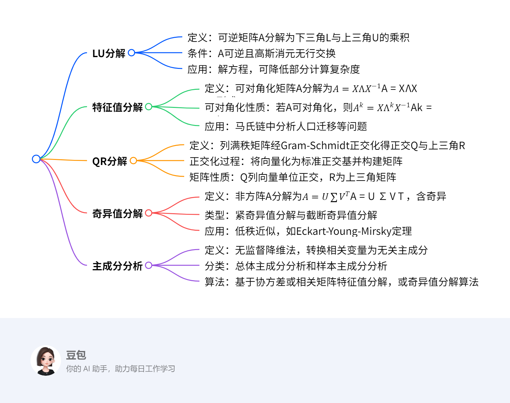

# 线代矩阵分解
## 概览
---
### 一段话总结
本文围绕线性代数在数据科学中的应用展开，介绍了多种矩阵分解方法及其应用。**LU分解**将可逆且消元时无行交换的矩阵分解为下三角矩阵L和上三角矩阵U；**LDU分解**在此基础上引入对角矩阵D 。**特征值分解**针对可对角化矩阵，若矩阵A有n个线性无关的特征向量，可分解为$A = X\Lambda X^{-1}$ ，对称矩阵可进一步分解为$S = Q\Lambda Q^{T}$ 。**QR分解**利用Gram - Schmidt正交化将列满秩矩阵分解为正交矩阵Q和上三角矩阵R。**奇异值分解**可处理非方阵，将矩阵$A$分解为$A = U\sum V^{T}$ ，还有紧奇异值分解和截断奇异值分解 。**主成分分析（PCA）**是一种无监督学习降维方法，通过正交变换将线性相关变量转换为线性无关的主成分，可基于协方差矩阵或相关矩阵的特征值分解实现，也可借助数据矩阵的奇异值分解算法求解。

---

---
### 详细总结
1. **LU分解**
    - **定义**：对于非奇异矩阵（可逆）A，可利用高斯消元法写成$A = LU$的形式，其中L为下三角矩阵，U为上三角矩阵 。例如，矩阵$A=\begin{bmatrix}1&2&3\\4&5&6\\8&9&7\end{bmatrix}$可分解为$A=\begin{bmatrix}1&0&0\\4&1&0\\8&\frac{7}{3}&1\end{bmatrix}\begin{bmatrix}1&2&3\\& - 3& - 6\\&& - 3\end{bmatrix}$。
    - **条件**：A必须可逆，且在高斯消元过程中没有交换两行的操作。
    - **应用**：用于解方程$Ax = b$，将其转化为$LUx = b$，先求解$Lc = b$，再求解$Ux = c$。虽然LU分解时间复杂度为$O(n^{3})$，但分解后的两个方程求解时间复杂度为$O(n^{2})$，且三角矩阵可压缩存储，节省存储空间。
2. **LDU分解**：在LU分解基础上，进一步将矩阵A分解为$A = LDU$的形式，其中D为对角矩阵。如上述矩阵A可分解为$A=\begin{bmatrix}1&0&0\\4&1&0\\8&\frac{7}{3}&1\end{bmatrix}\begin{bmatrix}1&0&0\\0& - 3&0\\0&0& - 3\end{bmatrix}\begin{bmatrix}1&2&3\\&1&2\\&&1\end{bmatrix}$。
3. **特征值分解**
    - **定义**：假设矩阵A有n个线性无关的特征向量$x_{1},...,x_{n}$，对应的特征值为$\lambda_{1},...,\lambda_{n}$，令$X = [x_{1},...,x_{n}]$为n阶可逆矩阵，则有$X^{-1}AX=\begin{bmatrix}\lambda_{1}& & \\& \ddots & \\& & \lambda_{n}\end{bmatrix}=\Lambda$，即$A = X\Lambda X^{-1}$。
    - **可对角化性质**：若A可对角化，则$A^{k}=X\Lambda^{k}X^{-1}$。
    - **应用**：以某地区城镇化速度的矩阵$A=\begin{bmatrix}0.97&0.05\\0.03&0.95\end{bmatrix}$为例，可用于分析人口分布随时间的变化，如初始人口分布为$\begin{bmatrix}0.4\\0.6\end{bmatrix}$，经过k年，人口分布为$u_{k}=A^{k}\begin{bmatrix}0.4\\0.6\end{bmatrix}$。
4. **对称矩阵的特征值分解**：存在正交矩阵Q，使得对称矩阵S满足$S = Q\Lambda Q^{-1}=Q\Lambda Q^{T}$，即S有n个相互正交的特征向量。例如，对于特征多项式$f_{S}(\lambda)=(1 - \lambda)^{2}(2+\lambda)$的对称矩阵S，其特征值为1（重数2）， - 2（重数1） ，通过求解特征方程得到相应特征向量，进而得到正交矩阵Q和对角矩阵$\Lambda$，实现分解。
5. **QR分解**：对于列满秩矩阵$A\in M_{m×3}(\mathbb{R})$，利用Gram - Schmidt正交化将A的列向量化为标准正交基$q_{1},q_{2},q_{3}$，满足特定的子空间关系，进而得到$A = QR$的分解形式，其中Q的列向量单位正交，R为上三角矩阵。若A为$n×n$可逆方阵，同样适用该分解。
6. **奇异值分解**
    - **定义**：对于矩阵$A\in M_{m×n}(\mathbb{R})$ ，存在正交矩阵$U\in M_{m×m}(\mathbb{R})$ 、$V\in M_{n×n}(\mathbb{R})$，使得$A = U\sum V^{T}$，其中$\sum\in M_{m×n}(\mathbb{R})$为（广义）对角矩阵，$\sum=\begin{bmatrix}\sigma_{1}& & & \\& \ddots & & \\& & \sigma_{r}& \end{bmatrix}$，且$\sigma_{1}\geq\sigma_{2}\geq...\geq\sigma_{r}>0$ ，$UU^{T}=I$ ，$VV^{T}=I$ 。
    - **类型**
        - **紧奇异值分解**：与原始矩阵等秩，对于$m×n$实矩阵A，秩为$rank(A)=r$，$r\leq min(m,n)$，分解为$A = U_{r}\sum_{r}V_{r}^{T}$ ，其中$U_{r}$为$m×r$矩阵，$V_{r}$为$n×r$矩阵，$\sum_{r}$为r阶对角矩阵。
        - **截断奇异值分解**：实际应用中常用，设A为$m×n$实矩阵，秩为$rank(A)=r$，且$0<k<r$，分解为$A\approx U_{k}\sum_{k}V_{k}^{T}$ ，其中$U_{k}$为$m×k$矩阵，$V_{k}$为$n×k$矩阵，$\sum_{k}$为k阶对角矩阵。
    - **应用**：矩阵的低秩近似，A可表示为多个秩一矩阵的和，如$A=\sigma_{1}u_{1}v_{1}^{T}+\sigma_{2}u_{2}v_{2}^{T}+...+\sigma_{r}u_{r}v_{r}^{T}$（紧奇异值分解），$A_{k}=\sigma_{1}u_{1}v_{1}^{T}+\sigma_{2}u_{2}v_{2}^{T}+...+\sigma_{k}u_{k}v_{k}^{T}$（截断奇异值分解） ，根据Eckart - Young - Mirsky定理，$A_{k}$是所有秩k矩阵中对A的“最佳逼近”。
7. **主成分分析（PCA）**
    - **定义**：一种常用的无监督学习方法，利用正交变换将线性相关变量表示的观测数据转换为少数线性无关变量（主成分）表示的数据，属于降维方法，用于发现数据中的基本结构。
    - **分类**
        - **总体主成分分析**：针对m维随机变量$x=(x_{1},x_{2},...,x_{m})^{T}$，涉及均值向量$\mu$、协方差矩阵$\sum$等概念。主成分需满足系数向量为单位向量、变量互不相关、方差最大等条件。第k主成分$y_{k}=\alpha_{k}^{T}x$，方差$var(y_{k})=\lambda_{k}$（$\lambda_{k}$为$\sum$的第k个特征值）。主成分的协方差矩阵是对角矩阵，方差之和等于随机变量x的方差之和。通常根据累计方差贡献率（如达到70%以上）确定主成分个数k ，还定义了主成分对原有变量的贡献率等指标。
        - **样本主成分分析**：对m维随机变量进行n次独立观测，得到样本矩阵X ，可估计样本均值、样本协方差矩阵S和样本相关矩阵R。样本主成分的定义与总体主成分类似，且总体主成分的相关定理对样本主成分依然成立。使用样本主成分时，一般对样本数据进行规范化处理，使样本协方差矩阵S变为样本相关矩阵R。
    - **算法**
        - **基于相关矩阵的特征值分解**：先对观测数据规范化处理，计算样本相关矩阵R ，求解R的特征方程得到特征值和单位特征向量，确定主成分个数k，求出k个样本主成分，计算主成分与原变量的相关系数和贡献率，最后计算样本的主成分值。例如对学生四门课程考试成绩数据进行主成分分析，可得到反映学生整体成绩和文理科成绩关系的主成分。
        - **数据矩阵的奇异值分解算法**：构造新矩阵$X'=\frac{1}{\sqrt{n - 1}}X^{T}$，其每一列均值为0，$X'^{T}X'$等于X的协方差矩阵$S_{X}$。通过对$X'$进行截断奇异值分解，V的列向量就是X的主成分，进而得到样本主成分矩阵Y。
---
### 关键问题
1. **不同矩阵分解方法的适用场景有何不同？**
    - LU分解适用于可逆且高斯消元无行交换的矩阵，主要用于解方程；特征值分解适用于可对角化矩阵，在马氏链等场景分析矩阵幂运算问题；QR分解用于列满秩矩阵，常用于数值计算等领域；奇异值分解对非方阵和方阵都适用，在数据压缩、低秩近似等方面应用广泛；主成分分析则用于数据降维、发现数据结构，处理多变量线性相关的数据。
2. **主成分分析中如何确定主成分的个数？**
    - 通常根据累计方差贡献率来确定，如取累计方差贡献率达到规定百分比（如70%）以上的主成分个数k。还可考虑主成分对各个原有变量的贡献率，综合判断保留哪些主成分能更好地保留原有变量的信息，简化问题的同时尽可能减少信息损失。
3. **奇异值分解的几何意义是什么？**
    - 从线性变换角度，m×n矩阵A表示从n维空间$\mathbb{R}^{n}$到m维空间$\mathbb{R}^{m}$的线性变换。奇异值分解将其分解为三个简单变换：一个是坐标系的旋转或反射变换（由正交矩阵V表示），一个是坐标轴的缩放变换（由对角矩阵$\sum$表示），另一个是坐标系的旋转或反射变换（由正交矩阵U表示）。任意向量$x\in\mathbb{R}^{n}$，经$V^{T}$、$\sum$、U变换后得到$Ax\in\mathbb{R}^{m}$，这清晰地解释了线性变换的内在结构。 
## LU分解
### 一、定义与条件  
**定义**：对于非奇异矩阵（可逆矩阵）\(A\)，通过高斯消元法可将其分解为**下三角矩阵\(L\)**和**上三角矩阵\(U\)**的乘积，即 \(A = LU\)。  
**条件**：  
1. \(A\) 可逆（非奇异）。  
2. 高斯消元过程中**无需交换两行**（即主元均不为零）。  

**补充说明**：  
- 若进一步将\(U\)的对角线元素提取为对角矩阵\(D\)，可得到**LDU分解**：\(A = LDU\)，其中\(L\)为单位下三角矩阵，\(D\)为对角矩阵，\(U\)为单位上三角矩阵。  

### 二、核心应用：解方程 \(Ax = b\)  
**求解方法**：  
1. **分解阶段**：将\(A\)分解为\(LU\)。  
2. **前向替换**：求解下三角方程 \(Lc = b\)，得到中间变量\(c\)。  
3. **后向替换**：求解上三角方程 \(Ux = c\)，得到原方程的解\(x\)。  

**时间复杂度**：  
- 分解 \(A = LU\) 的时间复杂度为 \(O(n^3)\)。  
- 单次求解 \(Lc = b\) 和 \(Ux = c\) 的时间复杂度均为 \(O(n^2)\)，优于直接求解 \(Ax = b\) 的 \(O(n^3)\)。  

**存储优势**：  
- 三角矩阵（\(L\)和\(U\)）可通过**压缩存储**（仅存储非零元素）节省空间，而存储\(A^{-1}\)需完整存储\(n^2\)个元素。  

### 三、示例解析  
**例**：对矩阵 \(A = \begin{bmatrix}1 & 2 & 3 \\ 4 & 5 & 6 \\ 8 & 9 & 7\end{bmatrix}\) 进行LU分解，并求解方程 \(Ax = \begin{bmatrix}1 \\ 2 \\ 3\end{bmatrix}\)。  

**步骤1：LU分解**  
1. 高斯消元过程：  
   - 第一行不变，消去第二行、第三行的第一列元素：  
     - 第二行减去\(4 \times\)第一行：\(R_2' = R_2 - 4R_1 = [0, -3, -6]\)  
     - 第三行减去\(8 \times\)第一行：\(R_3' = R_3 - 8R_1 = [0, -7, -17]\)  
   - 新矩阵为 \(\begin{bmatrix}1 & 2 & 3 \\ 0 & -3 & -6 \\ 0 & -7 & -17\end{bmatrix}\)。  
   - 继续消去第三行的第二列元素：第三行减去\(\frac{7}{3} \times\)第二行：  
     \(R_3'' = R_3' - \frac{7}{3}R_2' = [0, 0, -3]\)  
   - 最终上三角矩阵 \(U = \begin{bmatrix}1 & 2 & 3 \\ 0 & -3 & -6 \\ 0 & 0 & -3\end{bmatrix}\)。  
2. 构造下三角矩阵\(L\)：  
   - 消元系数作为\(L\)的下三角元素：  
     \(L = \begin{bmatrix}1 & 0 & 0 \\ 4 & 1 & 0 \\ 8 & \frac{7}{3} & 1\end{bmatrix}\)（对角线为1，下方元素为消元倍数）。  

**步骤2：解方程 \(Ax = b\)**  
已知 \(b = \begin{bmatrix}1 \\ 2 \\ 3\end{bmatrix}\)，分解为：  
1. **前向替换求解 \(Lc = b\)**：  
   \[
   \begin{cases}
   c_1 = 1 \\
   4c_1 + c_2 = 2 \implies c_2 = 2 - 4 \times 1 = -2 \\
   8c_1 + \frac{7}{3}c_2 + c_3 = 3 \implies 8 \times 1 + \frac{7}{3} \times (-2) + c_3 = 3 \implies c_3 = 3 - 8 + \frac{14}{3} = \frac{1}{3}
   \end{cases}
   \]  
   得 \(c = \begin{bmatrix}1 \\ -2 \\ \frac{1}{3}\end{bmatrix}\)。  

2. **后向替换求解 \(Ux = c\)**：  
   \[
   \begin{cases}
   -3x_3 = \frac{1}{3} \implies x_3 = -\frac{1}{9} \\
   -3x_2 - 6x_3 = -2 \implies -3x_2 - 6 \times (-\frac{1}{9}) = -2 \implies -3x_2 + \frac{2}{3} = -2 \implies x_2 = \frac{8}{9} \\
   x_1 + 2x_2 + 3x_3 = 1 \implies x_1 + 2 \times \frac{8}{9} + 3 \times (-\frac{1}{9}) = 1 \implies x_1 = 1 - \frac{16}{9} + \frac{3}{9} = -\frac{4}{9}
   \end{cases}
   \]  
   最终解为 \(x = \begin{bmatrix}-\frac{4}{9} \\ \frac{8}{9} \\ -\frac{1}{9}\end{bmatrix}\)。  

### 四、重点总结  
- **核心优势**：通过分解三角矩阵降低单次解方程的复杂度，压缩存储节省空间。  
- **适用场景**：当同一矩阵\(A\)需多次求解不同右端项\(b\)时，提前分解\(A = LU\)可显著提升效率。
## 特征值分解
### 一、定义与条件  
**定义**：若矩阵 \(A\) 存在 \(n\) 个线性无关的特征向量 \(\{x_1, x_2, \dots, x_n\}\)，其对应的特征值为 \(\{\lambda_1, \lambda_2, \dots, \lambda_n\}\)，则可将 \(A\) 分解为：  
\[ A = X\Lambda X^{-1} \]  
其中，\(X = [x_1, x_2, \dots, x_n]\) 为可逆矩阵（由特征向量组成），\(\Lambda = \text{diag}(\lambda_1, \lambda_2, \dots, \lambda_n)\) 为对角矩阵。  

**条件**：  
1. \(A\) 可对角化（即特征向量线性无关）。  
2. 若 \(A\) 为对称矩阵，则必可**正交对角化**，即存在正交矩阵 \(Q\) 使得 \(A = Q\Lambda Q^T\)（\(Q^T = Q^{-1}\)）。  

**物理意义**：将矩阵分解为特征向量方向上的缩放变换（\(\Lambda\)）与基变换（\(X\) 和 \(X^{-1}\)）的组合。  

### 二、对称矩阵的特征值分解（重点）  
**性质**：  
- 对称矩阵的特征值均为实数，且对应特征向量正交。  
- 可通过**正交矩阵**实现对角化，简化计算。  

**求解方法**：  
1. **求特征值**：解特征方程 \(|A - \lambda I| = 0\)，得到特征值 \(\lambda_i\)。  
2. **求特征向量**：对每个 \(\lambda_i\)，解齐次方程 \((A - \lambda_i I)x = 0\)，得到特征向量 \(x_i\)。  
3. **正交化与单位化**（对称矩阵专用）：  
   - 对重特征值对应的特征向量进行**Gram-Schmidt正交化**。  
   - 将所有特征向量单位化，构成正交矩阵 \(Q\)。  

### 三、应用：马氏链（状态转移建模）  
**场景**：用于描述系统状态随时间的转移概率，如人口迁移、网页排名等。  
**核心思想**：若状态转移矩阵 \(A\) 可对角化，则 \(k\) 步转移后的状态为：  
\[ u_k = A^k u_0 = X\Lambda^k X^{-1} u_0 \]  
其中，\(u_0\) 为初始状态向量，\(\Lambda^k\) 可通过特征值幂次快速计算。  

### 四、示例解析  
**例1：对称矩阵的正交对角化**  
设对称矩阵 \(S = \begin{bmatrix}0 & 1 & 1 \\ 1 & 0 & -1 \\ 1 & -1 & 0\end{bmatrix}\)，求其特征值分解。  

**步骤1：求特征值**  
特征多项式：  
\[ |S - \lambda I| = \begin{vmatrix}-\lambda & 1 & 1 \\ 1 & -\lambda & -1 \\ 1 & -1 & -\lambda\end{vmatrix} = (1 - \lambda)^2(2 + \lambda) \]  
解得特征值：\(\lambda_1 = -2\)（单根），\(\lambda_2 = \lambda_3 = 1\)（二重根）。  

**步骤2：求特征向量**  
- 对 \(\lambda_1 = -2\)，解 \((S + 2I)x = 0\)：  
  \[
  \begin{bmatrix}2 & 1 & 1 \\ 1 & 2 & -1 \\ 1 & -1 & 2\end{bmatrix} \sim \begin{bmatrix}1 & 0 & 1 \\ 0 & 1 & -1 \\ 0 & 0 & 0\end{bmatrix} \implies x_1 = [1, -1, -1]^T
  \]  
  单位化：\(q_1 = \frac{x_1}{\|x_1\|} = \left[\frac{1}{\sqrt{3}}, -\frac{1}{\sqrt{3}}, -\frac{1}{\sqrt{3}}\right]^T\)。  

- 对 \(\lambda_2 = \lambda_3 = 1\)，解 \((S - I)x = 0\)：  
  \[
  \begin{bmatrix}-1 & 1 & 1 \\ 1 & -1 & -1 \\ 1 & -1 & -1\end{bmatrix} \sim \begin{bmatrix}1 & -1 & -1 \\ 0 & 0 & 0 \\ 0 & 0 & 0\end{bmatrix} \implies \text{基础解系为 } x_2 = [1, 1, 0]^T, x_3 = [1, 0, 1]^T
  \]  
  **正交化**（Gram-Schmidt）：  
  - 取 \(v_2 = x_2 = [1, 1, 0]^T\)，单位化：\(q_2 = \frac{v_2}{\|v_2\|} = \left[\frac{1}{\sqrt{2}}, \frac{1}{\sqrt{2}}, 0\right]^T\)。  
  - 对 \(x_3\) 正交化：  
    \[
    v_3 = x_3 - \frac{x_3 \cdot q_2}{q_2 \cdot q_2} q_2 = [1, 0, 1]^T - \frac{1}{2}[1, 1, 0]^T = \left[\frac{1}{2}, -\frac{1}{2}, 1\right]^T
    \]  
    单位化：\(q_3 = \frac{v_3}{\|v_3\|} = \left[\frac{1}{\sqrt{6}}, -\frac{1}{\sqrt{6}}, \frac{\sqrt{2}}{\sqrt{3}}\right]^T\)。  

**步骤3：构造正交矩阵 \(Q\) 和对角矩阵 \(\Lambda\)**  
\[
Q = [q_1, q_2, q_3] = \begin{bmatrix}\frac{1}{\sqrt{3}} & \frac{1}{\sqrt{2}} & \frac{1}{\sqrt{6}} \\ -\frac{1}{\sqrt{3}} & \frac{1}{\sqrt{2}} & -\frac{1}{\sqrt{6}} \\ -\frac{1}{\sqrt{3}} & 0 & \frac{\sqrt{2}}{\sqrt{3}}\end{bmatrix}, \quad \Lambda = \begin{bmatrix}-2 & 0 & 0 \\ 0 & 1 & 0 \\ 0 & 0 & 1\end{bmatrix}
\]  
最终分解：\(S = Q\Lambda Q^T\)。  

**例2：马氏链应用——人口迁移模型**  
设某地区人口迁移矩阵为 \(A = \begin{bmatrix}0.97 & 0.05 \\ 0.03 & 0.95\end{bmatrix}\)，初始城市人口占比 \(u_0 = \begin{bmatrix}0.4 \\ 0.6\end{bmatrix}\)（总人口100万），求1年后人口分布。  

**步骤1：特征值分解 \(A\)**  
- 特征值：\(\lambda_1 = 1\)（对应稳态），\(\lambda_2 = 0.92\)（衰减因子）。  
- 特征向量：  
  - \(\lambda_1 = 1\)：\(x_1 = [5, 3]^T\)（单位化后 \(q_1 = \left[\frac{5}{\sqrt{34}}, \frac{3}{\sqrt{34}}\right]^T\)）。  
  - \(\lambda_2 = 0.92\)：\(x_2 = [1, -1]^T\)（单位化后 \(q_2 = \left[\frac{1}{\sqrt{2}}, -\frac{1}{\sqrt{2}}\right]^T\)）。  

**步骤2：计算 \(u_1 = A u_0\)**  
直接计算：  
\[
u_1 = \begin{bmatrix}0.97 & 0.05 \\ 0.03 & 0.95\end{bmatrix} \begin{bmatrix}0.4 \\ 0.6\end{bmatrix} = \begin{bmatrix}0.4 \times 0.97 + 0.6 \times 0.05 \\ 0.4 \times 0.03 + 0.6 \times 0.95\end{bmatrix} = \begin{bmatrix}0.418 \\ 0.582\end{bmatrix}
\]  
即1年后城市人口41.8万，农村人口58.2万。  

**补充说明**：通过特征值分解可快速计算 \(k\) 年后状态：  
\[
u_k = c_1 \lambda_1^k x_1 + c_2 \lambda_2^k x_2 \quad (\text{其中 } c_1, c_2 \text{ 为初始状态在特征向量基下的坐标})
\]  
当 \(k \to \infty\) 时，\(\lambda_2^k \to 0\)，状态收敛于稳态 \(c_1 x_1\)。  

### 五、重点总结  
- **对称矩阵优势**：必可正交对角化，特征向量正交，计算更高效（如例1）。  
- **马氏链核心**：利用特征值分解将矩阵幂运算转化为对角矩阵幂运算，简化长期状态预测（如例2）。  
- **关键步骤**：求特征值→特征向量→正交化（对称矩阵）→构造变换矩阵。

## 奇异值分解（SVD）  
### 一、核心定义与类型  
**定义**：对任意 \(m \times n\) 实矩阵 \(A\)，存在正交矩阵 \(U_{m \times m}\)、\(V_{n \times n}\) 和对角矩阵 \(\Sigma_{m \times n}\)（对角线元素为奇异值 \(\sigma_1 \geq \sigma_2 \geq \dots \geq \sigma_r > 0\)），使得：  
\[ A = U \Sigma V^T \]  
- **左奇异向量**：\(U\) 的列向量，对应 \(A A^T\) 的特征向量。  
- **右奇异向量**：\(V\) 的列向量，对应 \(A^T A\) 的特征向量。  
- **奇异值**：\(\sigma_i = \sqrt{\lambda_i}\)，\(\lambda_i\) 为 \(A^T A\) 或 \(A A^T\) 的非零特征值。  

#### 类型  
1. **紧奇异值分解**  
   - **定义**：保留 \(A\) 的全部非零奇异值（共 \(r = \text{rank}(A)\) 个），分解为 \(A = U_r \Sigma_r V_r^T\)，其中：  
     - \(U_r\)：\(U\) 的前 \(r\) 列（\(m \times r\)）。  
     - \(V_r\)：\(V\) 的前 \(r\) 列（\(n \times r\)）。  
     - \(\Sigma_r\)：\(\Sigma\) 的前 \(r\) 个对角线元素（\(r \times r\) 对角矩阵）。  
   - **性质**：与原始矩阵等秩，用于精确表示 \(A\) 的秩结构。  

2. **截断奇异值分解**  
   - **定义**：选取前 \(k < r\) 个最大奇异值，近似表示为 \(A \approx U_k \Sigma_k V_k^T\)，其中：  
     - \(U_k\)：\(U\) 的前 \(k\) 列（\(m \times k\)）。  
     - \(V_k\)：\(V\) 的前 \(k\) 列（\(n \times k\)）。  
     - \(\Sigma_k\)：\(\Sigma\) 的前 \(k\) 个对角线元素（\(k \times k\) 对角矩阵）。  
   - **性质**：低秩近似，用于数据压缩和降维（如图片压缩、推荐系统）。  

### 二、几何解释  
**线性变换分解**：矩阵 \(A\) 可视为从 \(n\) 维空间 \(\mathbb{R}^n\) 到 \(m\) 维空间 \(\mathbb{R}^m\) 的线性变换，其过程可拆解为：  
1. **坐标系旋转/反射（\(V^T\)）**：在原空间 \(\mathbb{R}^n\) 中进行正交变换，将标准正交基转换为 \(V\) 的列向量方向。  
2. **坐标轴缩放（\(\Sigma\)）**：沿新坐标轴方向进行缩放，缩放因子为奇异值 \(\sigma_i\)。  
3. **坐标系旋转/反射（\(U\)）**：在目标空间 \(\mathbb{R}^m\) 中进行正交变换，将缩放后的基转换为 \(U\) 的列向量方向。  

**直观理解**：任意向量 \(x \in \mathbb{R}^n\) 经 \(A\) 变换后，等价于先在原空间旋转，再按奇异值缩放，最后在目标空间旋转的结果（如图1所示）。  

### 三、求解方法  
#### 基于 \(A^T A\) 特征值分解的证明思路  
1. **求 \(A^T A\) 的特征值与特征向量**：  
   - \(A^T A\) 为对称半正定矩阵，其特征值 \(\lambda_i \geq 0\)，对应特征向量 \(v_i\) 构成正交矩阵 \(V\)。  
2. **构造奇异值与左奇异向量**：  
   - 奇异值 \(\sigma_i = \sqrt{\lambda_i}\)（按降序排列）。  
   - 对非零奇异值 \(\sigma_i > 0\)，左奇异向量 \(u_i = \frac{A v_i}{\sigma_i}\)，构成矩阵 \(U\) 的前 \(r\) 列。  
3. **扩充正交基**：  
   - 若 \(m > r\)，将 \(u_1, \dots, u_r\) 扩充为 \(\mathbb{R}^m\) 的标准正交基，构成完整正交矩阵 \(U\)。  

#### 计算步骤（以 \(A_{m \times n}\) 为例）  
1. **计算协方差矩阵 \(A^T A\)**：  
   \[ A^T A = \begin{bmatrix} \vdots & \vdots & \vdots \\ v_1 & v_2 & \dots & v_n \\ \vdots & \vdots & \vdots \end{bmatrix} \begin{bmatrix} \vdots & v_1 & \vdots \\ \vdots & v_2 & \vdots \\ \vdots & v_n & \vdots \end{bmatrix} = \sum_{i=1}^n v_i v_i^T \]  
2. **特征值分解 \(A^T A = V \Lambda V^T\)**：  
   - 特征值 \(\lambda_1 \geq \lambda_2 \geq \dots \geq \lambda_r > 0\)，对应特征向量 \(v_1, \dots, v_r\)。  
3. **构造 \(\Sigma\) 和 \(U\)**：  
   - \(\Sigma\)：对角线为 \(\sigma_i = \sqrt{\lambda_i}\)，其余为0。  
   - \(u_i = \frac{A v_i}{\sigma_i}\)（\(i=1, \dots, r\)），扩充后得到 \(U\)。  

### 四、示例解析  
**例：紧奇异值分解与截断奇异值分解**  
设矩阵 \(A = \begin{bmatrix}1 & 0 & 0 & 0 \\ 0 & 0 & 0 & 4 \\ 0 & 3 & 0 & 0 \\ 0 & 0 & 0 & 0 \\ 2 & 0 & 0 & 0\end{bmatrix}\)（\(5 \times 4\)，\(\text{rank}(A) = 3\)）。  

#### 步骤1：求 \(A^T A\) 及其特征值分解  
\[ A^T A = \begin{bmatrix}1^2 + 2^2 & 0 & 0 & 0 \\ 0 & 3^2 & 0 & 0 \\ 0 & 0 & 0 & 0 \\ 0 & 0 & 0 & 4^2\end{bmatrix} = \begin{bmatrix}5 & 0 & 0 & 0 \\ 0 & 9 & 0 & 0 \\ 0 & 0 & 0 & 0 \\ 0 & 0 & 0 & 16\end{bmatrix} \]  
特征值：\(\lambda_1 = 16\)，\(\lambda_2 = 9\)，\(\lambda_3 = 5\)，\(\lambda_4 = 0\)（对应奇异值 \(\sigma_1 = 4\)，\(\sigma_2 = 3\)，\(\sigma_3 = \sqrt{5}\)，\(\sigma_4 = 0\)）。  

#### 步骤2：构造右奇异向量矩阵 \(V\)**  
特征向量为标准正交基：  
\[ v_1 = \begin{bmatrix}0 \\ 0 \\ 0 \\ 1\end{bmatrix}, \quad v_2 = \begin{bmatrix}0 \\ 1 \\ 0 \\ 0\end{bmatrix}, \quad v_3 = \begin{bmatrix}1 \\ 0 \\ 0 \\ 0\end{bmatrix}, \quad v_4 = \begin{bmatrix}0 \\ 0 \\ 1 \\ 0\end{bmatrix} \]  
\[ V = \begin{bmatrix}v_1 & v_2 & v_3 & v_4\end{bmatrix} = \begin{bmatrix}0 & 0 & 1 & 0 \\ 0 & 1 & 0 & 0 \\ 0 & 0 & 0 & 1 \\ 1 & 0 & 0 & 0\end{bmatrix}^T \quad (\text{注意：示例中 } V^T \text{ 为转置形式}) \]  

#### 步骤3：构造左奇异向量矩阵 \(U\)**  
- 对 \(\sigma_1 = 4\)：\(u_1 = \frac{A v_1}{4} = \frac{1}{4} \begin{bmatrix}0 \\ 4 \\ 0 \\ 0 \\ 0\end{bmatrix} = \begin{bmatrix}0 \\ 1 \\ 0 \\ 0 \\ 0\end{bmatrix}\)  
- 对 \(\sigma_2 = 3\)：\(u_2 = \frac{A v_2}{3} = \frac{1}{3} \begin{bmatrix}0 \\ 0 \\ 3 \\ 0 \\ 0\end{bmatrix} = \begin{bmatrix}0 \\ 0 \\ 1 \\ 0 \\ 0\end{bmatrix}\)  
- 对 \(\sigma_3 = \sqrt{5}\)：\(u_3 = \frac{A v_3}{\sqrt{5}} = \frac{1}{\sqrt{5}} \begin{bmatrix}1 \\ 0 \\ 0 \\ 0 \\ 2\end{bmatrix} = \begin{bmatrix}1/\sqrt{5} \\ 0 \\ 0 \\ 0 \\ 2/\sqrt{5}\end{bmatrix}\)  
- 扩充正交基（\(m=5\)，需补充2个向量，如标准基 \(e_4 = [0,0,0,1,0]^T\)，\(e_5 = [\sqrt{0.8}, 0, 0, 0, -\sqrt{0.2}]^T\) 以正交于 \(u_1, u_2, u_3\)）：  
\[ U = \begin{bmatrix}0 & 0 & 1/\sqrt{5} & 0 & \sqrt{0.8} \\ 1 & 0 & 0 & 0 & 0 \\ 0 & 1 & 0 & 0 & 0 \\ 0 & 0 & 0 & 1 & 0 \\ 0 & 0 & 2/\sqrt{5} & 0 & -\sqrt{0.2}\end{bmatrix} \]  

#### 步骤4：紧奇异值分解（\(r=3\)）  
\[ U_r = U[:, 1:3] = \begin{bmatrix}0 & 0 & 1/\sqrt{5} \\ 1 & 0 & 0 \\ 0 & 1 & 0 \\ 0 & 0 & 0 \\ 0 & 0 & 2/\sqrt{5}\end{bmatrix}, \quad \Sigma_r = \begin{bmatrix}4 & 0 & 0 \\ 0 & 3 & 0 \\ 0 & 0 & \sqrt{5}\end{bmatrix}, \quad V_r = V[:, 1:3] = \begin{bmatrix}0 & 0 & 1 \\ 0 & 1 & 0 \\ 1 & 0 & 0 \\ 0 & 0 & 0\end{bmatrix} \]  
\[ A = U_r \Sigma_r V_r^T \]  

#### 步骤5：截断奇异值分解（取 \(k=2\)）  
\[ U_k = U[:, 1:2] = \begin{bmatrix}0 & 0 \\ 1 & 0 \\ 0 & 1 \\ 0 & 0 \\ 0 & 0\end{bmatrix}, \quad \Sigma_k = \begin{bmatrix}4 & 0 \\ 0 & 3\end{bmatrix}, \quad V_k = V[:, 1:2] = \begin{bmatrix}0 & 0 \\ 0 & 1 \\ 1 & 0 \\ 0 & 0\end{bmatrix} \]  
\[ A \approx U_k \Sigma_k V_k^T = \begin{bmatrix}0 & 0 \\ 1 & 0 \\ 0 & 1 \\ 0 & 0 \\ 0 & 0\end{bmatrix} \begin{bmatrix}4 & 0 \\ 0 & 3\end{bmatrix} \begin{bmatrix}0 & 0 & 1 & 0 \\ 0 & 1 & 0 & 0\end{bmatrix} = \begin{bmatrix}0 & 0 & 0 & 0 \\ 0 & 0 & 4 & 0 \\ 0 & 3 & 0 & 0 \\ 0 & 0 & 0 & 0 \\ 0 & 0 & 0 & 0\end{bmatrix} \]  

### 五、重点总结  
- **紧奇异值分解**：保留全部非零奇异值，精确表示矩阵秩结构，用于理论分析。  
- **截断奇异值分解**：通过舍弃小奇异值实现低秩近似，应用于降维（如PCA）、数据压缩（如图片降噪）和推荐系统（矩阵填充）。  
- **几何意义**：将线性变换拆解为“旋转→缩放→旋转”，直观解释矩阵作用于向量的过程。  
- **计算核心**：依赖对称矩阵特征值分解，利用 \(A^T A\) 或 \(A A^T\) 的特征向量构造奇异向量。

## 主成分分析（PCA）  
### 一、核心定义与目标  
**定义**：  
主成分分析是一种**无监督学习降维方法**，通过**正交变换**将**线性相关的原始变量**转换为**线性无关的主成分**（新变量），保留数据主要信息的同时减少变量个数。  
- **主成分**：由原始变量线性组合而成，按方差从大到小排序（第一主成分方差最大，依次递减）。  
- **本质**：寻找数据中的“主要变化方向”，通过坐标系旋转实现降维。  

**核心目标**：  
1. **降维**：用少数主成分（如2-3个）替代原始变量，简化数据结构。  
2. **去相关性**：消除原始变量间的线性关联，使主成分彼此独立。  
3. **信息保留**：主成分的方差和尽可能大，确保保留原始数据的主要信息。  

### 二、基本思想与关键步骤  
#### 1. **数据规范化**  
- **目的**：消除变量量纲影响，使各变量均值为0，方差为1。  
- **方法**：  
  \[
  x_i^* = \frac{x_i - \bar{x}_i}{\sqrt{\text{var}(x_i)}}
  \]  
  其中，\(\bar{x}_i\) 为变量均值，\(\text{var}(x_i)\) 为方差。  

#### 2. **正交变换与方差最大化**  
- **正交变换**：将原始变量 \(x = (x_1, x_2, \dots, x_m)^T\) 转换为新变量 \(y = (y_1, y_2, \dots, y_k)^T\)，满足 \(y = A^T x\)，其中 \(A\) 为正交矩阵（\(A^T A = I\)）。  
- **方差最大化**：  
  - 第一主成分 \(y_1\) 是原始变量所有线性组合中方差最大的方向。  
  - 第二主成分 \(y_2\) 是与 \(y_1\) 正交且方差次大的方向，依此类推。  

#### 3. **坐标系旋转变换的几何意义**  
- 原始数据分布在以各变量为轴的坐标系中，规范化后集中在原点附近。  
- 通过旋转变换，将数据投影到新坐标系的轴上，新轴（主成分）方向为数据方差最大的方向。  
- **投影性质**：数据在主成分轴上的投影方差越大，保留的信息越多（如图1所示）。  

### 三、求解方法：基于协方差矩阵的特征值分解  
#### 1. **数学原理**  
- 设原始数据的协方差矩阵为 \(\Sigma\)，其特征值分解为：  
  \[
  \Sigma = Q \Lambda Q^T
  \]  
  其中，\(Q\) 为正交矩阵（列向量为特征向量），\(\Lambda = \text{diag}(\lambda_1, \lambda_2, \dots, \lambda_m)\) 为特征值对角矩阵（\(\lambda_1 \geq \lambda_2 \geq \dots \geq \lambda_m \geq 0\)）。  
- **主成分表达式**：第 \(i\) 个主成分 \(y_i = q_i^T x\)，其中 \(q_i\) 为 \(\Sigma\) 的第 \(i\) 个特征向量。  

#### 2. **关键步骤**  
1. **计算协方差矩阵**：  
   对规范化后的数据，计算样本协方差矩阵 \(S = \frac{1}{n-1} X X^T\)，其中 \(X\) 为规范化后的样本矩阵。  
2. **特征值分解**：  
   求解 \(S\) 的特征值 \(\lambda_i\) 和对应的单位特征向量 \(q_i\)。  
3. **确定主成分个数 \(k\)**：  
   选取前 \(k\) 个特征值，使累计方差贡献率 \(\sum_{i=1}^k \lambda_i / \sum_{i=1}^m \lambda_i \geq \text{阈值}\)（如70%）。  
4. **构造主成分**：  
   主成分 \(y_j = \sum_{i=1}^m q_{ij} x_i\)（\(j = 1, 2, \dots, k\)）。  

### 四、示例解析：学生成绩主成分分析  
**问题**：对4门课程（语文、外语、数学、物理）的学生成绩数据进行主成分分析，提取主成分并解释其意义。  

#### 1. **数据与规范化**  
假设标准化后的样本相关矩阵 \(R\) 如下：  
\[
R = \begin{bmatrix}
1 & 0.44 & 0.29 & 0.33 \\
0.44 & 1 & 0.35 & 0.32 \\
0.29 & 0.35 & 1 & 0.60 \\
0.33 & 0.32 & 0.60 & 1
\end{bmatrix}
\]  

#### 2. **特征值分解**  
求解 \(R\) 的特征值和特征向量，前2个最大特征值及对应特征向量如下：  
| 主成分 | 特征值 \(\lambda_i\) | 方差贡献率 \(\eta_i\) | 累计贡献率 | 特征向量 \(q_i\) |  
|--------|---------------------|----------------------|------------|------------------|  
| \(y_1\) | 2.172               | 54.3%                | 54.3%      | [0.460, 0.476, 0.523, 0.537] |  
| \(y_2\) | 0.873               | 21.8%                | 76.1%      | [0.574, 0.486, -0.476, -0.456] |  

#### 3. **构造主成分**  
- **第一主成分（整体成绩）**：  
  \[
  y_1 = 0.460x_1 + 0.476x_2 + 0.523x_3 + 0.537x_4
  \]  
  - 各课程系数均为正且相近，反映学生的整体成绩水平，物理成绩权重最大（0.537）。  
- **第二主成分（文理科差异）**：  
  \[
  y_2 = 0.574x_1 + 0.486x_2 - 0.476x_3 - 0.456x_4
  \]  
  - 语文、外语系数为正，数学、物理系数为负，反映文科与理科成绩的差异。  

#### 4. **降维与解释**  
- 保留前2个主成分，累计贡献率76.1%，可替代原始4维数据。  
- 原始变量在主成分上的因子负荷量（相关系数）如下：  
  | 课程   | \(y_1\) 负荷量 | \(y_2\) 负荷量 | 累计贡献率 |  
  |--------|----------------|----------------|------------|  
  | 语文   | 0.678          | 0.536          | 0.747      |  
  | 外语   | 0.701          | 0.453          | 0.697      |  
  | 数学   | 0.770          | -0.444         | 0.790      |  
  | 物理   | 0.791          | -0.425         | 0.806      |  
- **结论**：  
  - \(y_1\) 代表“整体成绩”，物理对整体成绩影响最大。  
  - \(y_2\) 代表“文理科倾向”，语文/外语成绩高、数学/物理成绩低的学生在 \(y_2\) 上得分高。  

### 五、重点总结  
- **核心步骤**：数据规范化→协方差矩阵→特征值分解→选取主成分。  
- **关键指标**：  
  - **方差贡献率**：单个主成分方差占总方差的比例（\(\eta_i = \lambda_i / \sum \lambda_i\)）。  
  - **累计贡献率**：前 \(k\) 个主成分的方差和占比，用于确定 \(k\)。  
- **应用场景**：  
  - 数据可视化（如将高维数据降为2维投影到平面）。  
  - 特征工程（去除冗余变量，提升模型效率）。  
  - 信号处理与图像压缩（如人脸识别中的特征提取）。  

**几何直观**：PCA通过旋转变换找到数据分布的“长轴”（第一主成分）和“短轴”（第二主成分），降维即保留长轴方向的信息，忽略短轴方向的细节（如图2所示）。