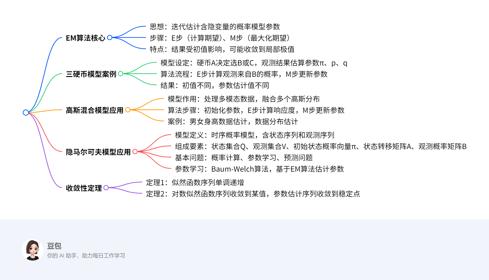

# EM算法及其应用
## 总览

---
### 一段话总结  
文档围绕**EM算法（期望最大化算法）**展开，介绍其核心思想为通过迭代估计含有隐变量的概率模型参数，包含**E步（计算期望）**和**M步（最大化期望）**。以**三硬币模型**为例说明算法流程，指出其结果受**初值选择影响**，可能收敛到局部极值。还介绍了EM算法在**高斯混合模型**（用于处理多模态数据）和**隐马尔可夫模型**（用于时序数据建模）中的应用，涉及模型定义、参数估计步骤及具体案例，最后提及算法的**收敛性定理**，强调其简单性与普适性，但无法保证全局最优。

---
### 思维导图  

---
### 详细总结  

#### **一、EM算法概述**  
**核心思想**：通过迭代估计含有隐变量的概率模型参数，解决无解析解的极大似然估计问题。  
**核心步骤**：  
1. **E步（期望步）**：利用当前参数估计值，计算隐变量的条件期望（如三硬币模型中观测来自某硬币的概率）。  
2. **M步（最大化步）**：基于E步结果，最大化似然函数的下界，更新模型参数。  

**关键性质**：  
- 结果依赖**初值选择**，不同初值可能导致不同局部极值（如三硬币模型初值为(0.5,0.5,0.5)和(0.4,0.6,0.7)时结果不同）。  
- **收敛性**：似然函数序列单调递增，最终收敛到局部极值（定理1、定理2）。  

#### **二、三硬币模型案例**  
**模型设定**：  
- 硬币A（正面概率π）决定选择硬币B（正面概率p）或C（正面概率q），观测结果为1/0序列（如1101001011），需估计π、p、q。  
- **似然函数**：\( P(Y|\theta) = \prod_{j=1}^{n} [\pi p^{y_j}(1-p)^{1-y_j} + (1-\pi) q^{y_j}(1-q)^{1-y_j}] \)，无解析解，需用EM算法。  

**算法流程**：  
1. **初始化**：如\( \theta^{(0)}=(0.5,0.5,0.5) \)。  
2. **E步**：计算观测\( y_j \)来自B的概率\( \mu_j^{(i+1)} = \frac{\pi^{(i)}p^{(i)^{y_j}}(1-p^{(i)})^{1-y_j}}{\pi^{(i)}p^{(i)^{y_j}}(1-p^{(i)})^{1-y_j} + (1-\pi^{(i)})q^{(i)^{y_j}}(1-q^{(i)})^{1-y_j}} \)。  
3. **M步**：  
   - \( \pi^{(i+1)} = \frac{1}{n}\sum_{j=1}^{n}\mu_j^{(i+1)} \)  
   - \( p^{(i+1)} = \frac{\sum_{j=1}^{n}\mu_j^{(i+1)}y_j}{\sum_{j=1}^{n}\mu_j^{(i+1)}} \)  
   - \( q^{(i+1)} = \frac{\sum_{j=1}^{n}(1-\mu_j^{(i+1)})y_j}{\sum_{j=1}^{n}(1-\mu_j^{(i+1)})} \)  

**结果示例**：  
- 初值(0.5,0.5,0.5)时，迭代后\( \pi=0.5, p=0.6, q=0.6 \)；  
- 初值(0.4,0.6,0.7)时，结果为\( \hat{\pi}=0.4064, \hat{p}=0.5368, \hat{q}=0.6432 \)。  

#### **三、高斯混合模型应用**  
**模型作用**：处理多模态数据，假设数据由K个高斯分布混合生成，每个分布权重为\( \alpha_k \)（\( \sum\alpha_k=1 \)）。  
**参数估计流程**：  
1. **初始化**：设定各高斯分布的均值\( \mu_k \)、方差\( \sigma_k^2 \)和权重\( \alpha_k \)。  
2. **E步**：计算观测数据\( y_j \)来自第k个分模型的响应度\( \hat{\gamma}_{jk} = \frac{\alpha_k \phi(y_j|\theta_k)}{\sum_{k=1}^{K}\alpha_k \phi(y_j|\theta_k)} \)。  
3. **M步**：  
   - \( \hat{\mu}_k = \frac{\sum_{j=1}^{N}\hat{\gamma}_{jk}y_j}{\sum_{j=1}^{N}\hat{\gamma}_{jk}} \)  
   - \( \hat{\sigma}_k^2 = \frac{\sum_{j=1}^{N}\hat{\gamma}_{jk}(y_j-\mu_k)^2}{\sum_{j=1}^{N}\hat{\gamma}_{jk}} \)  
   - \( \hat{\alpha}_k = \frac{\sum_{j=1}^{N}\hat{\gamma}_{jk}}{N} \)  

**案例**：  
- **男女身高问题**：200个未知性别身高数据，通过EM算法估计男女分布的均值、方差及样本归属概率。  

#### **四、隐马尔可夫模型（HMM）应用**  
**模型定义**：描述隐藏状态序列生成观测序列的过程，适用于时序数据。  
**组成要素**：  
| 要素         | 符号               | 含义                                                                 |  
|--------------|--------------------|----------------------------------------------------------------------|  
| 状态集合     | \( Q \)            | 如{盒子1, 盒子2, 盒子3, 盒子4}                                      |  
| 观测集合     | \( V \)            | 如{红球, 白球}                                                      |  
| 初始状态概率 | \( \pi \)          | 初始时刻各状态概率向量                                               |  
| 状态转移矩阵 | \( A \)            | \( a_{ij} \)为从状态i到j的转移概率                                  |  
| 观测概率矩阵 | \( B \)            | \( b_j(k) \)为状态j生成观测k的概率                                  |  

**参数学习（Baum-Welch算法）**：  
1. **E步**：计算状态序列的联合概率期望（如\( P(O, i_t=i, i_{t+1}=j|\bar{\lambda}) \)）。  
2. **M步**：  
   - \( \pi_i = \frac{P(O, i_1=i|\bar{\lambda})}{P(O|\bar{\lambda})} \)  
   - \( a_{ij} = \frac{\sum_{t=1}^{T-1}P(O, i_t=i, i_{t+1}=j|\bar{\lambda})}{\sum_{t=1}^{T-1}P(O, i_t=i|\bar{\lambda})} \)  
   - \( b_j(k) = \frac{\sum_{t=1}^{T}P(O, i_t=j|\bar{\lambda})I(o_t=v_k)}{\sum_{t=1}^{T}P(O, i_t=j|\bar{\lambda})} \)  

**案例**：  
- **盒子和球模型**：通过5次观测序列{红, 红, 白, 白, 红}，估计状态转移矩阵和观测概率矩阵。  

#### **五、收敛性定理**  
| 定理   | 内容                                                                 |  
|--------|----------------------------------------------------------------------|  
| 定理1  | 似然函数序列\( P(Y|\theta^{(i)}) \)单调递增。                        |  
| 定理2  | 对数似然函数序列收敛到某值\( L^* \)，参数估计序列收敛到\( L(\theta) \)的稳定点（可能为局部极值）。 |  

---
### 关键问题  
#### **1. EM算法的核心步骤是什么？其数学本质如何理解？**  
**答案**：  
EM算法核心步骤为**E步（计算期望）**和**M步（最大化期望）**。  
- **E步**：利用当前参数\( \theta^{(i)} \)计算隐变量Z的条件期望，即Q函数\( Q(\theta, \theta^{(i)}) = E_{Z}[logP(Y,Z|\theta)|Y,\theta^{(i)}] \)。  
- **M步**：最大化Q函数以更新参数\( \theta^{(i+1)} = \arg\max_\theta Q(\theta, \theta^{(i)}) \)。  
**数学本质**：通过Jensen不等式构造对数似然函数\( L(\theta) \)的下界\( B(\theta, \theta^{(i)}) \)，迭代逼近其极大值，每次迭代保证似然函数非递减。  

#### **2. 为什么EM算法的结果依赖初值选择？如何缓解这一问题？**  
**答案**：  
- **原因**：EM算法收敛到对数似然函数的**局部极值**，初值不同可能导致陷入不同局部解（如三硬币模型中不同初值得到不同参数估计）。  
- **缓解方法**：  
  1. 选取多个不同初值进行迭代，比较结果并选择最优解；  
  2. 结合先验知识或数据特征，为初值提供合理猜测（如高斯混合模型中根据数据分布初始化均值）。  

#### **3. 高斯混合模型与隐马尔可夫模型在应用场景上的核心区别是什么？**  
**答案**：  
| 模型               | 应用场景                                                                 | 核心区别                                                                 |  
|--------------------|--------------------------------------------------------------------------|--------------------------------------------------------------------------|  
| **高斯混合模型**   | 处理**无序列的多模态数据**（如人群身高、样本聚类）。                     | 假设数据由多个独立高斯分布混合生成，无时间序列依赖，侧重静态数据的簇划分。 |  
| **隐马尔可夫模型** | 建模**时序数据**（如语音识别、天气预测、生物序列分析）。                 | 引入状态转移和观测生成的时序依赖，状态序列隐含动态变化规律，侧重序列生成过程。 |

## EM算法及三硬币模型应用总结  

### 一、EM算法核心理论  
#### 1. **算法定义与核心思想**  
- **定义**：EM算法（期望最大化算法）是一种通过迭代估计含有**隐变量**的概率模型参数的方法，适用于无解析解的极大似然估计问题。  
- **核心思想**：通过**E步（期望步）**和**M步（最大化步）**交替迭代，逐步逼近对数似然函数的极大值。  

#### 2. **算法流程**  
1. **初始化参数**：选取初始值\(\theta^{(0)}=(\pi^{(0)}, p^{(0)}, q^{(0)})\)。  
2. **E步（计算期望）**：  
   - 利用当前参数\(\theta^{(i)}\)，计算隐变量\(Z\)的条件期望（即观测数据来自某模型的概率）。  
   - **三硬币模型E步公式**：  
     \[
     \mu_j^{(i+1)} = \frac{\pi^{(i)} (p^{(i)})^{y_j} (1-p^{(i)})^{1-y_j}}{\pi^{(i)} (p^{(i)})^{y_j} (1-p^{(i)})^{1-y_j} + (1-\pi^{(i)}) (q^{(i)})^{y_j} (1-q^{(i)})^{1-y_j}}
     \]  
     其中\(\mu_j^{(i+1)}\)表示第\(j\)次观测来自硬币B的概率。  
3. **M步（最大化期望）**：  
   - 基于E步结果更新参数，最大化似然函数下界。  
   - **三硬币模型M步公式**：  
     \[
     \pi^{(i+1)} = \frac{1}{n} \sum_{j=1}^n \mu_j^{(i+1)}, \quad p^{(i+1)} = \frac{\sum_{j=1}^n \mu_j^{(i+1)} y_j}{\sum_{j=1}^n \mu_j^{(i+1)}}, \quad q^{(i+1)} = \frac{\sum_{j=1}^n (1-\mu_j^{(i+1)}) y_j}{\sum_{j=1}^n (1-\mu_j^{(i+1)})}
     \]  
4. **迭代终止条件**：当参数变化量小于阈值（如\(\|\theta^{(i+1)}-\theta^{(i)}\| < \varepsilon\)）或似然函数增长停滞时停止。  

#### 3. **关键性质**  
- **初值敏感性**：不同初值可能导致不同局部极值（如三硬币模型中初值\((0.5,0.5,0.5)\)和\((0.4,0.6,0.7)\)得到不同结果）。  
- **收敛性**：似然函数序列单调递增，最终收敛到**局部极值**（非全局最优）。  

### 二、三硬币模型问题与求解  
#### 1. **问题描述**  
- **模型设定**：  
  - 硬币A（正面概率\(\pi\)）决定选择硬币B（正面概率\(p\)）或C（正面概率\(q\)）。  
  - 观测结果为二进制序列（如\(Y = [1,1,0,1,0,0,1,0,1,1]\)），需估计参数\(\pi, p, q\)。  
- **难点**：隐变量\(Z\)（硬币A的结果）不可观测，似然函数含求和项，无解析解。  

#### 2. **求解方法：EM算法**  
**步骤解析**：  
1. **初始化参数**：  
   - 例：取初值\(\theta^{(0)} = (0.5, 0.5, 0.5)\)（硬币A、B、C均为均匀硬币）。  
2. **第一次迭代（\(i=0\)）**：  
   - **E步**：计算每个观测\(y_j\)来自硬币B的概率\(\mu_j^{(1)}\)。  
     - 对于\(y_j=1\)：  
       \[
       \mu_j^{(1)} = \frac{0.5 \times 0.5^1 \times 0.5^0}{0.5 \times 0.5 + 0.5 \times 0.5} = 0.5
       \]  
     - 对于\(y_j=0\)：  
       \[
       \mu_j^{(1)} = \frac{0.5 \times 0.5^0 \times 0.5^1}{0.5 \times 0.5 + 0.5 \times 0.5} = 0.5
       \]  
   - **M步**：  
     - 计算\(\pi^{(1)}\)：\(\pi^{(1)} = \frac{1}{10} \times (0.5 \times 10) = 0.5\)  
     - 计算\(p^{(1)}\)：观测中1的个数为6，0的个数为4，  
       \[
       p^{(1)} = \frac{0.5 \times 6}{0.5 \times 10} = 0.6
       \]  
     - 计算\(q^{(1)}\)：  
       \[
       q^{(1)} = \frac{(1-0.5) \times 6}{(1-0.5) \times 10} = 0.6
       \]  
3. **第二次迭代（\(i=1\)）**：  
   - **E步**：参数更新为\(\theta^{(1)}=(0.5, 0.6, 0.6)\)，重新计算\(\mu_j^{(2)}\)。  
     - 对于\(y_j=1\)：  
       \[
       \mu_j^{(2)} = \frac{0.5 \times 0.6^1 \times 0.4^0}{0.5 \times 0.6 + 0.5 \times 0.6} = 0.5
       \]  
     - 对于\(y_j=0\)：  
       \[
       \mu_j^{(2)} = \frac{0.5 \times 0.4^1 \times 0.6^0}{0.5 \times 0.4 + 0.5 \times 0.4} = 0.5
       \]  
   - **M步**：参数不变，迭代收敛，结果为\(\pi=0.5, p=0.6, q=0.6\)。  

#### 3. **初值影响示例**  
- **初值\(\theta^{(0)}=(0.4, 0.6, 0.7)\)**：  
  - 经过迭代后，参数估计为\(\hat{\pi}=0.4064, \hat{p}=0.5368, \hat{q}=0.6432\)。  
- **结论**：初值不同导致最终参数不同，需通过多次初始化选取最优解。  

### 三、EM算法数学推导要点  
#### 1. **目标函数与难点**  
- **不完全数据对数似然函数**：  
  \[
  L(\theta) = \log P(Y|\theta) = \log \sum_Z P(Y,Z|\theta)
  \]  
  难点：求和项的对数无法直接求导，需通过不等式放缩构造下界。  

#### 2. **Jensen不等式的应用**  
- **核心推导**：  
  \[
  L(\theta) - L(\theta^{(i)}) \geq \sum_Z P(Z|Y,\theta^{(i)}) \log \frac{P(Y,Z|\theta)}{P(Y,Z|\theta^{(i)})}
  \]  
  定义下界函数\(B(\theta, \theta^{(i)})\)，通过最大化\(B\)间接优化\(L(\theta)\)。  

#### 3. **Q函数的作用**  
- **定义**：  
  \[
  Q(\theta, \theta^{(i)}) = E_Z[\log P(Y,Z|\theta) | Y, \theta^{(i)}]
  \]  
  - 本质：完全数据对数似然函数在当前参数下的期望，作为\(L(\theta)\)的逼近目标。  
  - **M步等价于**：\(\theta^{(i+1)} = \arg\max_\theta Q(\theta, \theta^{(i)})\)。  

### 四、总结  
- **EM算法优势**：适用于含隐变量的复杂模型，通过迭代逐步优化参数。  
- **局限性**：依赖初值，易收敛到局部极值，需结合实际问题多次初始化。  
- **应用场景**：机器学习（如高斯混合模型、隐马尔可夫模型）、统计推断等。

## EM算法收敛性分析总结  

### 一、核心问题与结论  
#### 1. **核心疑问**  
1. **EM算法的估计序列是否收敛？**  
2. **若收敛，收敛到全局极大值还是局部极大值？**  

#### 2. **关键结论**  
- **收敛性**：EM算法生成的**似然函数序列**必定收敛（单调递增且有上界），但**参数估计序列**未必一定收敛（可能振荡或收敛到稳定点）。  
- **极值性质**：即使参数收敛，也只能保证收敛到**对数似然函数的稳定点**（可能是局部极大值、鞍点甚至局部极小值），**无法保证全局极大值**。  

### 二、收敛性定理详解  
#### 1. **定理1：似然函数序列的单调性**  
- **内容**：设 \( P(Y|\theta) \) 为观测数据的似然函数，\( \{\theta^{(i)}\} \) 为EM算法的参数序列，对应似然函数序列 \( \{P(Y|\theta^{(i)})\} \) 单调递增，即：  
  \[
  P(Y|\theta^{(i+1)}) \geq P(Y|\theta^{(i)})
  \]  
- **证明要点**：  
  - 利用**Jensen不等式**构造似然函数差的下界，证明每次迭代后似然函数非递减。  
  - 数学表达式：通过 \( H(\theta, \theta^{(i)}) = \sum_Z \log P(Z|Y,\theta) P(Z|Y,\theta^{(i)}) \) 推导，结合不等式 \( \sum_Z \log \frac{P_1}{P_2} \cdot P_2 \leq \log \sum_Z P_1 \)（其中 \( P_1, P_2 \) 为概率分布），得出 \( H(\theta^{(i+1)}, \theta^{(i)}) \leq H(\theta^{(i)}, \theta^{(i)}) \)，从而证明似然函数单调递增。  

#### 2. **定理2：对数似然函数与参数的收敛性**  
- **内容**：  
  1. 若 \( P(Y|\theta) \) 有上界，则对数似然函数序列 \( L(\theta^{(i)}) = \log P(Y|\theta^{(i)}) \) 收敛到某一值 \( L^* \)。  
  2. 在 \( Q(\theta, \theta') \) 与 \( L(\theta) \) 满足一定条件下，参数序列 \( \{\theta^{(i)}\} \) 收敛到 \( L(\theta) \) 的**稳定点**（一阶导数为0的点）。  
- **说明**：  
  - **稳定点**：可能是局部极大值、鞍点或局部极小值（实际应用中多为局部极大值）。  
  - **条件**：定理2的条件在大多数实际问题中（如连续可微的概率模型）成立。  

### 三、收敛性的局限性与应对方法  
#### 1. **局限性**  
- **参数收敛的不确定性**：似然函数收敛不保证参数收敛（可能出现参数振荡但似然函数稳定的情况）。  
- **初值敏感性**：不同初值可能导致参数收敛到不同稳定点（如三硬币模型中初值影响最终参数）。  

#### 2. **应对方法**  
1. **多初值迭代**：  
   - **方法**：选取多个不同初值运行EM算法，比较最终似然函数值，选择最优解。  
   - **例子**：在三硬币模型中，分别用初值 \( (0.5, 0.5, 0.5) \) 和 \( (0.4, 0.6, 0.7) \) 迭代，前者收敛到 \( (\pi=0.5, p=0.6, q=0.6) \)，后者收敛到 \( (\pi=0.4064, p=0.5368, q=0.6432) \)，通过比较似然函数值确定更优解。  
2. **结合先验知识**：  
   - **方法**：利用领域知识为初值提供合理范围（如高斯混合模型中根据数据分布初始化均值）。  
3. **改进算法**：  
   - **方法**：结合全局优化算法（如模拟退火、遗传算法）寻找初值，或使用梯度下降等方法辅助EM算法逃离局部极值。  

### 四、实例解析：三硬币模型的收敛性验证  
#### 1. **问题回顾**  
- 三硬币模型通过EM算法估计参数 \( \pi, p, q \)，观测序列为 \( Y = [1,1,0,1,0,0,1,0,1,1] \)（共10次观测，6次1，4次0）。  

#### 2. **收敛性验证步骤**  
1. **初值1：对称初值 \( (0.5, 0.5, 0.5) \)**  
   - 迭代过程：  
     - 第1次迭代后参数：\( (0.5, 0.6, 0.6) \)  
     - 第2次迭代后参数不变，似然函数收敛。  
   - 结论：参数收敛到局部极大值，似然函数单调递增。  
2. **初值2：非对称初值 \( (0.4, 0.6, 0.7) \)**  
   - 迭代过程：  
     - 经过多次迭代后参数收敛到 \( (0.4064, 0.5368, 0.6432) \)，似然函数仍单调递增但值低于初值1的结果。  
   - 结论：参数收敛到另一局部极大值，说明初值影响收敛结果。  

#### 3. **关键观察**  
- 无论初值如何，似然函数序列始终单调递增，但参数可能收敛到不同局部极值，印证了EM算法的收敛性定理。  

### 五、总结  
| **要点**         | **详细说明**                                                                 |  
|------------------|-----------------------------------------------------------------------------|  
| **收敛性保证**   | 似然函数序列必收敛（定理1），参数序列可能收敛（定理2条件满足时）。          |  
| **极值性质**     | 收敛到对数似然函数的稳定点（通常为局部极大值），非全局最优。              |  
| **应对策略**     | 多初值迭代、结合先验知识、改进优化算法。                                    |  
| **应用启示**     | 在实际应用中需通过实验验证结果的鲁棒性，避免依赖单一初值导致的局部最优解。 |

## EM算法在高斯混合模型中的应用总结  

### 一、高斯混合模型（GMM）基础  
#### 1. **模型定义与作用**  
- **定义**：高斯混合模型是由**多个高斯分布线性组合而成的概率模型**，用于描述多模态数据（即数据呈现多个密集簇状分布）。  
- **数学表达式**：  
  \[
  P(y|\theta) = \sum_{k=1}^{K} \alpha_k \phi(y|\theta_k), \quad \text{其中} \ \alpha_k \geq 0, \ \sum_{k=1}^{K} \alpha_k = 1
  \]  
  - \( \alpha_k \)：第\( k \)个高斯分模型的权重（选择概率）；  
  - \( \phi(y|\theta_k) \)：第\( k \)个高斯分模型的概率密度函数，参数\( \theta_k = (\mu_k, \sigma_k^2) \)。  

#### 2. **应用场景**  
- **核心问题**：当单高斯模型无法拟合多模态数据时（如男女身高混合数据、多类别样本聚类），需用GMM建模。  
- **与单高斯模型的对比**：  
  - 单高斯模型假设数据来自单一分布，对多模态数据拟合差（如数据分布呈双峰值时，单高斯模型的中心区域样本量少，拟合不合理）。  
  - GMM通过多个高斯分布的加权和，灵活拟合复杂数据分布。  

### 二、高斯混合模型的参数估计：EM算法  
#### 1. **问题难点**  
- **隐变量存在**：每个观测数据\( y_j \)的来源分模型未知（即隐变量\( \gamma_{jk} \)：\( \gamma_{jk}=1 \)表示\( y_j \)来自第\( k \)个分模型）。  
- **直接求解不可行**：对数似然函数含求和项的对数，无法通过直接求导得到解析解，需用EM算法迭代求解。  

#### 2. **EM算法流程**  
**步骤1：初始化参数**  
- 设定分模型个数\( K \)，初始化各分模型的参数\( \theta_k^{(0)}=(\mu_k^{(0)}, \sigma_k^{2(0)}) \)和权重\( \alpha_k^{(0)} \)（如随机初始化或基于先验知识）。  

**步骤2：E步（计算响应度）**  
- **目标**：计算每个观测数据\( y_j \)来自第\( k \)个分模型的概率（响应度，Responsibility）。  
- **公式**：  
  \[
  \hat{\gamma}_{jk} = P(\gamma_{jk}=1 | y_j, \theta^{(i)}) = \frac{\alpha_k^{(i)} \phi(y_j|\theta_k^{(i)})}{\sum_{m=1}^{K} \alpha_m^{(i)} \phi(y_j|\theta_m^{(i)})}
  \]  
  - \( \phi(y_j|\theta_k^{(i)}) = \frac{1}{\sqrt{2\pi\sigma_k^{2(i)}}} \exp\left(-\frac{(y_j-\mu_k^{(i)})^2}{2\sigma_k^{2(i)}}\right) \)为高斯概率密度。  

**步骤3：M步（更新模型参数）**  
- **目标**：基于响应度更新分模型参数和权重，最大化似然函数下界。  
- **更新公式**：  
  1. **均值**：\( \mu_k^{(i+1)} = \frac{\sum_{j=1}^{N} \hat{\gamma}_{jk} y_j}{\sum_{j=1}^{N} \hat{\gamma}_{jk}} \)  
  2. **方差**：\( \sigma_k^{2(i+1)} = \frac{\sum_{j=1}^{N} \hat{\gamma}_{jk} (y_j - \mu_k^{(i+1)})^2}{\sum_{j=1}^{N} \hat{\gamma}_{jk}} \)  
  3. **权重**：\( \alpha_k^{(i+1)} = \frac{\sum_{j=1}^{N} \hat{\gamma}_{jk}}{N} \)  

**步骤4：迭代终止**  
- 当参数变化量小于阈值（如\( \|\theta^{(i+1)} - \theta^{(i)}\| < \varepsilon \)）或响应度变化极小时，停止迭代。  

### 三、实例解析：男女身高数据建模  
#### 1. **问题描述**  
- **数据**：200个未知性别的身高数据（假设来自男生和女生两个高斯分布）。  
- **目标**：  
  1. 估计男生、女生身高分布的参数（均值\( \mu_1, \mu_2 \)，方差\( \sigma_1^2, \sigma_2^2 \)）；  
  2. 确定每个样本属于男生或女生的概率。  

#### 2. **求解步骤**  
**Step 1：初始化参数**  
- 设\( K=2 \)（男生、女生两个分模型），初始化：  
  - 男生分布：\( \mu_1^{(0)}=1.64 \, \text{m}, \sigma_1^{2(0)}=0.06 \, \text{m}^2 \)（假设均值为1.64，方差较小）；  
  - 女生分布：\( \mu_2^{(0)}=1.56 \, \text{m}, \sigma_2^{2(0)}=0.04 \, \text{m}^2 \)；  
  - 权重：\( \alpha_1^{(0)}=\alpha_2^{(0)}=0.5 \)（假设男女样本数相等）。  

**Step 2：E步计算响应度**  
- 对每个身高数据\( y_j \)，计算其属于男生的概率\( \hat{\gamma}_{j1} \)和女生的概率\( \hat{\gamma}_{j2}=1-\hat{\gamma}_{j1} \)。  
  - 例：某样本\( y_j=1.70 \, \text{m} \)，  
    \[
    \hat{\gamma}_{j1} = \frac{0.5 \cdot \phi(1.70|1.64, 0.06)}{0.5 \cdot \phi(1.70|1.64, 0.06) + 0.5 \cdot \phi(1.70|1.56, 0.04)}
    \]  
    计算得\( \hat{\gamma}_{j1} \approx 0.8 \)，即该样本有80%概率属于男生分布。  

**Step 3：M步更新参数**  
- **男生分布参数更新**：  
  - 均值：\( \mu_1^{(1)} = \frac{\sum_{j=1}^{200} \hat{\gamma}_{j1} y_j}{\sum_{j=1}^{200} \hat{\gamma}_{j1}} \)（加权平均，高响应度样本贡献更大）；  
  - 方差：\( \sigma_1^{2(1)} = \frac{\sum_{j=1}^{200} \hat{\gamma}_{j1} (y_j - \mu_1^{(1)})^2}{\sum_{j=1}^{200} \hat{\gamma}_{j1}} \)；  
  - 权重：\( \alpha_1^{(1)} = \frac{\sum_{j=1}^{200} \hat{\gamma}_{j1}}{200} \)（若多数样本响应度高，则权重增大）。  
- **女生分布参数更新**：同理，使用\( \hat{\gamma}_{j2} \)计算。  

**Step 4：迭代直至收敛**  
- 重复E步和M步，直至男生、女生分布的参数不再显著变化（如均值变化小于0.01 m，方差变化小于0.001 m²）。  

#### 3. **结果解释**  
- 最终得到男生分布参数（如\( \mu_1=1.75 \, \text{m}, \sigma_1^2=0.05 \)）和女生分布参数（如\( \mu_2=1.60 \, \text{m}, \sigma_2^2=0.03 \)），以及每个样本的归属概率。  
- 权重\( \alpha_1, \alpha_2 \)反映男女样本比例（如\( \alpha_1=0.52, \alpha_2=0.48 \)，接近实际比例1:1）。  

### 四、高斯混合模型与K-means的对比  
| **对比维度**       | **高斯混合模型（EM算法）**                | **K-means聚类**                          |  
|--------------------|------------------------------------------|------------------------------------------|  
| **模型性质**       | 概率生成模型，输出样本属于各簇的概率     | 非概率模型，输出硬聚类（样本仅属一个簇） |  
| **核心目标**       | 最大化数据似然函数，拟合分布参数         | 最小化簇内距离平方和（SSD）              |  
| **输出结果**       | 簇分布参数、样本软归属（概率）           | 簇质心、样本硬归属（类别标签）           |  
| **适用场景**       | 密度估计、生成式建模（如异常检测）       | 无监督分类、数据分组                     |  

### 五、总结  
#### 1. **核心价值**  
- 高斯混合模型通过EM算法实现**多模态数据的柔性建模**，解决了单高斯模型的局限性。  
- EM算法通过迭代估计隐变量（样本归属概率）和模型参数，是处理含隐变量问题的通用框架。  

#### 2. **关键要点**  
- **响应度**：E步计算的样本归属概率是连接隐变量与观测数据的桥梁。  
- **初值影响**：需通过多组初值迭代避免局部最优（如男女身高案例中不同初值可能导致簇划分偏差）。  
- **扩展应用**：GMM可推广至多维数据（如二维平面数据聚类），或与其他模型结合（如HMM中的观测概率建模）。

## EM算法在隐马尔可夫模型中的应用总结  

### 一、隐马尔可夫模型（HMM）基础  
#### 1. **模型定义与核心要素**  
- **定义**：隐马尔可夫模型是描述**时序数据中隐藏状态与观测序列关系**的概率模型，由**隐藏状态序列**生成**观测序列**，适用于语音识别、生物序列分析等场景。  
- **核心要素（三要素）**：  
  - **状态集合 \( Q \)**：所有可能的隐藏状态（如盒子和球模型中的{盒子1, 盒子2, 盒子3, 盒子4}）。  
  - **观测集合 \( V \)**：所有可能的观测值（如{红球, 白球}）。  
  - **参数组 \( \lambda = (A, B, \pi) \)**：  
    - **初始状态概率向量 \( \pi \)**：\( \pi_i = P(i_1 = q_i) \)，即初始时刻处于状态 \( q_i \) 的概率。  
    - **状态转移矩阵 \( A \)**：\( a_{ij} = P(i_{t+1}=q_j | i_t=q_i) \)，表示状态转移概率。  
    - **观测概率矩阵 \( B \)**：\( b_j(k) = P(o_t=v_k | i_t=q_j) \)，表示状态生成观测的概率。  

#### 2. **基本假设**  
- **齐次马尔可夫性假设**：当前状态仅依赖前一状态，即 \( P(i_t | i_{t-1}, o_{t-1}, \dots) = P(i_t | i_{t-1}) \)。  
- **观测独立性假设**：当前观测仅依赖当前状态，即 \( P(o_t | i_t, i_{t-1}, \dots) = P(o_t | i_t) \)。  

### 二、隐马尔可夫模型的三个基本问题  
| **问题类型**       | **输入**                          | **输出/目标**                                  | **求解方法**               |  
|--------------------|-----------------------------------|-----------------------------------------------|----------------------------|  
| **1. 概率计算**    | \( \lambda, O \)                  | \( P(O | \lambda) \)                          | 前向算法、后向算法         |  
| **2. 参数学习**    | \( O \)（无状态序列）            | \( \lambda = (A, B, \pi) \) 使 \( P(O | \lambda) \) 最大 | **Baum-Welch算法（EM算法）** |  
| **3. 预测（解码）**| \( \lambda, O \)                  | 最可能的状态序列 \( I \)                      | Viterbi算法                |  

### 三、参数学习问题：Baum-Welch算法（EM算法应用）  
#### 1. **问题难点**  
- **隐变量存在**：状态序列 \( I \) 不可观测，需通过EM算法迭代估计参数 \( \lambda = (A, B, \pi) \)。  
- **目标函数**：最大化观测数据的对数似然函数 \( L(\lambda) = \log P(O | \lambda) = \log \sum_I P(O, I | \lambda) \)，其中求和涉及所有可能的状态序列 \( I \)，无法直接求解。  

#### 2. **Baum-Welch算法流程（EM框架）**  
**步骤1：明确完全数据与隐变量**  
- **完全数据**：\( (O, I) \)（观测序列+状态序列）。  
- **对数似然函数**：\( \log P(O, I | \lambda) = \log \left[ \pi_{i_1} \prod_{t=1}^{T-1} a_{i_t i_{t+1}} \prod_{t=1}^T b_{i_t}(o_t) \right] \)。  

**步骤2：E步（计算Q函数）**  
- **Q函数定义**：  
  \[
  Q(\lambda, \bar{\lambda}) = E_I \left[ \log P(O, I | \lambda) \mid O, \bar{\lambda} \right] = \sum_I \log P(O, I | \lambda) \cdot P(I \mid O, \bar{\lambda})
  \]  
  - 其中 \( P(I \mid O, \bar{\lambda}) \) 是在当前参数 \( \bar{\lambda} \) 下，状态序列 \( I \) 的后验概率。  

**步骤3：M步（最大化Q函数更新参数）**  
通过拉格朗日乘子法，分别对 \( \pi, A, B \) 求偏导并最大化，得到更新公式：  
1. **初始状态概率 \( \pi_i \)**：  
   \[
   \pi_i = \frac{P(i_1 = q_i \mid O, \bar{\lambda})}{P(O \mid \bar{\lambda})} = P(i_1 = q_i \mid O, \bar{\lambda})
   \]  
2. **状态转移矩阵 \( a_{ij} \)**：  
   \[
   a_{ij} = \frac{\sum_{t=1}^{T-1} P(i_t = q_i, i_{t+1} = q_j \mid O, \bar{\lambda})}{\sum_{t=1}^{T-1} P(i_t = q_i \mid O, \bar{\lambda})}
   \]  
3. **观测概率矩阵 \( b_j(k) \)**：  
   \[
   b_j(k) = \frac{\sum_{t=1}^T P(i_t = q_j \mid O, \bar{\lambda}) \cdot \delta(o_t, v_k)}{\sum_{t=1}^T P(i_t = q_j \mid O, \bar{\lambda})}
   \]  
   - \( \delta(o_t, v_k) = 1 \) 当 \( o_t = v_k \)，否则为0。  

**步骤4：迭代终止**  
重复E步和M步，直至参数变化量小于阈值或对数似然函数收敛。  

### 四、实例解析：盒子和球模型参数学习  
#### 1. **问题描述**  
- **模型设定**：  
  - 状态集合 \( Q = \{\text{盒子1}, \text{盒子2}, \text{盒子3}, \text{盒子4}\} \)，观测集合 \( V = \{\text{红球}, \text{白球}\} \)。  
  - 观测序列 \( O = \{\text{红}, \text{红}, \text{白}, \text{白}, \text{红}\} \)（\( T = 5 \)）。  
- **目标**：利用Baum-Welch算法估计参数 \( \lambda = (A, B, \pi) \)。  

#### 2. **求解步骤（简化版）**  
**Step 1：初始化参数**  
- 假设初始参数：  
  - \( \pi = (0.25, 0.25, 0.25, 0.25) \)（均匀分布），  
  - 状态转移矩阵 \( A \) 和观测矩阵 \( B \) 随机初始化（如盒子1→盒子2的概率为1，其他转移均匀分布；观测概率均匀为0.5）。  

**Step 2：E步计算后验概率**  
- 计算状态序列 \( I \) 的后验概率 \( P(I \mid O, \bar{\lambda}) \)，需通过前向-后向算法计算中间量：  
  - **前向变量** \( \alpha_t(i) = P(o_1, o_2, \dots, o_t, i_t = q_i \mid \bar{\lambda}) \)，  
  - **后向变量** \( \beta_t(i) = P(o_{t+1}, \dots, o_T \mid i_t = q_i, \bar{\lambda}) \)。  
- 利用前向-后向变量计算：  
  - \( P(i_t = q_i \mid O, \bar{\lambda}) = \frac{\alpha_t(i) \beta_t(i)}{P(O \mid \bar{\lambda})} \)，  
  - \( P(i_t = q_i, i_{t+1} = q_j \mid O, \bar{\lambda}) = \frac{\alpha_t(i) a_{ij} b_j(o_{t+1}) \beta_{t+1}(j)}{P(O \mid \bar{\lambda})} \)。  

**Step 3：M步更新参数**  
- **更新 \( \pi \)**：  
  \[
  \pi_i = P(i_1 = q_i \mid O, \bar{\lambda}) = \frac{\alpha_1(i)}{P(O \mid \bar{\lambda})}
  \]  
- **更新 \( a_{ij} \)**：  
  以盒子1→盒子2为例，  
  \[
  a_{12} = \frac{\sum_{t=1}^{4} P(i_t=\text{盒子1}, i_{t+1}=\text{盒子2} \mid O, \bar{\lambda})}{\sum_{t=1}^{4} P(i_t=\text{盒子1} \mid O, \bar{\lambda})}
  \]  
- **更新 \( b_j(\text{红球}) \)**：  
  以盒子2为例，  
  \[
  b_2(\text{红球}) = \frac{\sum_{t=1}^5 P(i_t=\text{盒子2} \mid O, \bar{\lambda}) \cdot \delta(o_t, \text{红球})}{\sum_{t=1}^5 P(i_t=\text{盒子2} \mid O, \bar{\lambda})}
  \]  

**Step 4：迭代优化**  
重复E步和M步，直至参数稳定。例如，若观测中前两帧为红球，后两帧为白球，最后一帧为红球，迭代后盒子2和盒子3的观测概率可能分别偏向红球和白球，状态转移矩阵更符合“盒子2/3以0.4左、0.6右转移”的规则。  

### 五、总结  
#### 1. **核心思想**  
- Baum-Welch算法是EM算法在隐马尔可夫模型中的具体应用，通过**E步计算状态序列的后验期望**，**M步最大化期望似然**，迭代估计不可观测的状态转移和观测概率。  

#### 2. **关键公式**  
| **参数**       | **更新公式**                                                                 |  
|----------------|-----------------------------------------------------------------------------|  
| \( \pi_i \)    | \( \pi_i = P(i_1 = q_i \mid O, \bar{\lambda}) \)                             |  
| \( a_{ij} \)   | \( a_{ij} = \frac{\text{状态i转移到j的期望次数}}{\text{状态i的期望停留次数}} \) |  
| \( b_j(k) \)   | \( b_j(k) = \frac{\text{状态j生成观测k的期望次数}}{\text{状态j的期望停留次数}} \) |  

#### 3. **应用场景**  
- 语音识别（状态为音素，观测为声学特征）、自然语言处理（词性标注）、生物信息学（DNA序列建模）等时序数据建模任务。