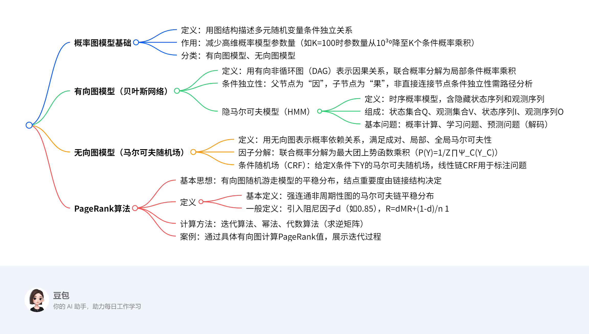

# 概率图模型

---
### 一段话总结
文档主要介绍了概率图模型（PGM），包括其通过图结构描述多元随机变量条件独立关系以减少参数量的核心思想，分为**有向图模型（贝叶斯网络）**和**无向图模型（马尔可夫随机场）**两大类，分别阐述了隐马尔可夫模型、条件随机场等具体模型的定义与基本问题；还介绍了PageRank算法，包括其基于有向图随机游走模型计算结点重要度的原理，以及迭代算法、幂法、代数算法等计算方法，通过具体案例展示了模型应用与计算过程。

---
### 思维导图


---
### 详细总结
#### 一、概率图模型概述
1. **核心思想**  
   用图结构可视化描述多元随机变量间的**条件独立关系**，减少高维概率模型的参数量。例如，K维离散变量（M=2）在无独立假设时需\(M^{K-1}\)参数（K=100时约\(10^{30}\)），引入独立假设后可分解为K个条件概率乘积。

2. **分类与图模型基本问题**  
   - **分类**：有向图模型（贝叶斯网络）、无向图模型（马尔可夫随机场）。  
   - **基本问题**：  
     - **表示问题**：图结构描述变量依赖关系；  
     - **学习问题**：图结构学习与参数学习；  
     - **推断问题**：已知部分变量求其他变量的条件概率。

#### 二、有向图模型（贝叶斯网络）
1. **定义与结构**  
   - 用**有向非循环图（DAG）**表示因果关系，每个节点对应变量，边表示非独立的因果关系。  
   - 联合概率分解：\(p(x)=\prod_{k=1}^{K} p(x_k | x_{\pi_k})\)，其中\(x_{\pi_k}\)为父节点集合。

2. **条件独立性**  
   - 直接连接节点非条件独立（因果关系）；  
   - 非直接连接节点的条件独立性需通过路径分析（如三节点的间接因果、共因等关系）。

3. **隐马尔可夫模型（HMM）**  
   - **定义**：时序概率模型，包含隐藏状态序列（不可观测）和观测序列（可观测）。  
   - **组成**：  
     - 状态集合\(Q=\{q_1,\dots,q_N\}\)，观测集合\(V=\{v_1,\dots,v_M\}\)；  
     - 状态序列\(I=(i_1,\dots,i_T)\)，观测序列\(O=(o_1,\dots,o_T)\)。  
   - **基本问题**：  
     | 问题类型       | 输入/已知条件                | 输出/目标                          |
     |----------------|-----------------------------|-----------------------------------|
     | 概率计算问题   | \(\lambda=(A,B,\pi)\)、O     | \(P(O|\lambda)\)                  |
     | 学习问题       | O                           | 估计\(\lambda=(A,B,\pi)\)使\(P(O|\lambda)\)最大 |
     | 预测问题（解码）| \(\lambda\)、O               | 使\(P(I|O)\)最大的状态序列I       |

#### 三、无向图模型（马尔可夫随机场）
1. **定义与马尔可夫性**  
   - 用无向图表示变量间概率依赖关系，满足：  
     - **成对马尔可夫性**：无连边节点在给定其他节点时条件独立；  
     - **局部马尔可夫性**：节点在给定邻居时独立于其他节点；  
     - **全局马尔可夫性**：被分隔的节点集合在给定时条件独立。

2. **因子分解与势函数**  
   - **团与最大团**：无向图中任意两节点有边相连的子集为团，无法扩展的团为最大团。  
   - **联合概率分解**：\(P(Y)=\frac{1}{Z}\prod_{C}\Psi_C(Y_C)\)，其中\(\Psi_C(Y_C)=exp\{-E(Y_C)\}\)为势函数，Z为规范化因子。

3. **条件随机场（CRF）**  
   - 给定输入变量X时，输出变量Y的马尔可夫随机场，线性链CRF用于标注问题。  
   - 参数化形式：\(P(y|x)=\frac{1}{Z(x)}exp(\sum_{i,k}\lambda_k t_k+\sum_{i,l}\mu_l s_l)\)，其中\(t_k\)为转移特征，\(s_l\)为状态特征。

#### 四、PageRank算法
1. **基本思想与定义**  
   - 基于有向图的随机游走模型（一阶马尔可夫链），平稳分布即为PageRank值，表示结点重要度。  
   - **一般定义**：引入阻尼因子\(d\)（通常0.85），平衡按链接跳转（概率d）和随机跳转（概率1-d），公式为：  
     \[
     PR(v_i)=d\sum_{v_j\in M(v_i)}\frac{PR(v_j)}{L(v_j)}+\frac{1-d}{n}
     \]  
     其中\(M(v_i)\)为指向\(v_i\)的节点集合，\(L(v_j)\)为\(v_j\)的出边数。

2. **计算方法**  
   - **迭代算法**：按\(R_{t+1}=dMR_t+\frac{1-d}{n}1\)迭代直至收敛。  
   - **幂法**：通过计算转移矩阵的主特征向量近似PageRank值。  
   - **代数算法**：求逆矩阵\((I-dM)^{-1}\)直接计算。

3. **案例**  
   - 强连通图中，初始分布\(R_0=[1/4,1/4,1/4,1/4]^T\)经迭代收敛至\([3/9,2/9,2/9,2/9]^T\)。  
   - 含悬挂节点的图通过一般定义避免概率归零，如\(d=0.8\)时迭代得到各节点非零PageRank值。

---
### 关键问题
1. **概率图模型为何能减少高维数据的参数量？**  
   答：通过引入**条件独立假设**，将高维联合概率分解为低维条件概率的乘积。例如，K维变量若存在条件独立关系，参数量可从\(M^{K-1}\)（如K=100时\(10^{30}\)）大幅减少至各条件概率参数之和。

2. **有向图模型与无向图模型的核心区别是什么？**  
   答：  
   - **有向图模型（贝叶斯网络）**：用**有向边表示因果关系**，节点间连边代表直接因果依赖（如父节点→子节点），联合概率按因果顺序分解。  
   - **无向图模型（马尔可夫随机场）**：用**无向边表示概率依赖**，不区分因果关系，联合概率通过最大团的势函数乘积分解，需满足成对、局部或全局马尔可夫性。

3. **PageRank算法中阻尼因子d的作用是什么？**  
   答：阻尼因子\(d\)（通常取0.85）用于平衡两种跳转行为：  
   - 以概率\(d\)按有向图的链接结构跳转（体现链接关系的重要性）；  
   - 以概率\(1-d\)随机跳转至任意节点（避免因图非强连通或存在悬挂节点导致概率分布无法收敛）。  
   其作用是确保马尔可夫链存在唯一平稳分布，使PageRank值适用于任意有向图结构。

## 概率图模型基础知识总结  


### 一、核心概念  
**概率图模型（PGM）**是一种用**图结构描述多元随机变量间条件独立关系**的概率模型，核心作用是**简化高维概率分布的表示与计算**。  
- **核心优势**：通过**独立性假设**减少参数量。  
  - **无独立假设时**：K维离散变量（每个变量M取值）需 \(M^{K-1}\) 个参数。例：\(M=2, K=100\) 时，参数量约 \(10^{30}\)。  
  - **引入独立假设后**：联合概率可分解为K个条件概率的乘积，参数量大幅减少。  


### 二、图结构的可视化作用  
通过图结构直观表示变量间的条件独立关系。  
**示例**：  
- **变量**：4个二值变量 \(X_1, X_2, X_3, X_4\)。  
- **条件独立关系**：  
  - 已知 \(X_1\) 时，\(X_2\) 和 \(X_3\) 独立，即：  
    \[
    p(X_2 | X_1, X_3) = p(X_2 | X_1), \quad p(X_3 | X_1, X_2) = p(X_3 | X_1)
    \]  
  - 已知 \(X_2\) 和 \(X_3\) 时，\(X_4\) 和 \(X_1\) 独立，即：  
    \[
    p(X_4 | X_1, X_2, X_3) = p(X_4 | X_2, X_3)
    \]  
- **图形化表示**：  
  ```
  X1 ── X2  
  │    │  
  └─ X3 ── X4  
  ```  
  （边表示依赖关系，无直接边表示条件独立）  


### 三、图模型的三个基本问题  
#### 1. **表示问题**  
- **目标**：用图结构描述变量间的依赖关系。  
- **方法**：  
  - 有向图（DAG）：表示因果关系（如贝叶斯网络）。  
  - 无向图：表示概率依赖关系（如马尔可夫随机场）。  

#### 2. **学习问题**  
- **目标**：学习图结构和参数。  
- **方法**：  
  - **结构学习**：从数据中推断最优图结构（如基于评分函数或约束条件）。  
  - **参数学习**：已知图结构时，估计条件概率分布的参数（如极大似然估计）。  

#### 3. **推断问题**  
- **目标**：已知部分变量，计算其他变量的条件概率分布。  
- **方法**：  
  - 精确推断：变量消元法、信念传播算法。  
  - 近似推断：蒙特卡洛采样、变分推断。  


### 四、图模型的分类  
#### 1. **有向图模型（贝叶斯网络）**  
- **特点**：  
  - 用**有向非循环图（DAG）**表示因果关系。  
  - 边表示“因果依赖”，无中间变量使两节点条件独立。  
- **联合概率分解**：  
  \[
  p(X) = \prod_{k=1}^K p(X_k | \text{父节点集合 of } X_k)
  \]  
- **示例**：疾病-症状网络（疾病→症状，如感冒→发烧）。  

#### 2. **无向图模型（马尔可夫随机场）**  
- **特点**：  
  - 用**无向图**表示概率依赖关系，不区分因果。  
  - 边仅表示依赖，不隐含方向性。  
- **联合概率分解**：基于“团”和“最大团”的势函数乘积（需满足马尔可夫性）。  
- **示例**：图像像素依赖（相邻像素颜色相关，无因果方向）。  


### 五、求解方法与示例  
#### 1. **参数量计算示例**  
**问题**：3个二值变量（\(M=2, K=3\)），若已知 \(X_1\) 与 \(X_3\) 在给定 \(X_2\) 时独立，求参数量。  
**步骤**：  
1. **无独立假设**：参数量 \(2^{3-1} = 4\)（实际需存储联合概率表）。  
2. **引入独立假设**：联合概率分解为 \(p(X_1)p(X_2|X_1)p(X_3|X_2)\)。  
   - \(p(X_1)\)：1个参数（\(P(X_1=1)\)）。  
   - \(p(X_2|X_1)\)：2个参数（\(P(X_2=1|X_1=0)\) 和 \(P(X_2=1|X_1=1)\)）。  
   - \(p(X_3|X_2)\)：2个参数（\(P(X_3=1|X_2=0)\) 和 \(P(X_3=1|X_2=1)\)）。  
   - **总参数量**：\(1 + 2 + 2 = 5\)（远小于无独立假设的4个？此处需注意：实际参数数量需根据条件概率表计算，独立假设可能进一步减少冗余）。  

#### 2. **图结构表示示例**  
**问题**：用图表示“吸烟（S）→肺癌（C）←空气污染（A）”的因果关系。  
**步骤**：  
1. **确定变量与依赖**：  
   - S和A是“因”，C是“果”。  
   - S与A无直接边（假设两者独立）。  
2. **绘制有向图**：  
   ```
   S → C ← A  
   ```  
   （S和A分别指向C，表示两者共同导致C）。  


### 六、重点总结  
- **核心价值**：通过图结构和独立假设简化高维概率模型，解决表示、学习和推断问题。  
- **分类本质**：有向图显式建模因果关系，无向图隐式建模概率依赖。  
- **关键公式**：联合概率分解（有向图：父节点条件概率乘积；无向图：最大团势函数乘积）。

## 有向图模型总结  


### 一、核心概念  
**有向图模型**（又称**贝叶斯网络**或**信念网络**）是用**有向非循环图（DAG）**描述随机变量间**因果依赖关系**的概率模型。  
- **核心特点**：  
  - 节点表示随机变量，有向边表示**直接因果关系**（父节点→子节点）。  
  - 若两节点直接连接（有边），则**非条件独立**；若通过路径间接连接，条件独立性需具体分析。  


### 二、贝叶斯网络的条件独立性  
#### 1. **直接连接节点**  
- **性质**：父节点与子节点直接相连时，**非条件独立**，体现因果关系（如“吸烟→肺癌”）。  

#### 2. **间接连接节点（三节点模型）**  
| 类型         | 结构         | 条件独立性描述                                                                 |
|--------------|--------------|------------------------------------------------------------------------------|
| **(a) 间接因果** | \(X_1 \to X_2 \to X_3\) | 给定 \(X_2\)，\(X_1 \perp X_3\)（如“吸烟→焦油沉积→肺癌”，已知焦油沉积，吸烟与肺癌独立）。 |
| **(b) 间接果因** | \(X_1 \leftarrow X_2 \to X_3\) | 给定 \(X_2\)，\(X_1 \perp X_3\)（如“成绩好←努力→竞赛获奖”，已知努力，成绩与竞赛获奖独立）。 |
| **(c) 共因关系** | \(X_1 \leftarrow X_2 \to X_3\) | 给定 \(X_2\)，\(X_1 \perp X_3\)（如“气温高→冰淇淋销量↑和空调销量↑”，已知气温，两者独立）。 |
| **(d) 共果关系** | \(X_1 \to X_2 \leftarrow X_3\) | **未给定 \(X_2\) 时**，\(X_1 \perp X_3\)；**给定 \(X_2\) 时**，\(X_1\) 与 \(X_3\) 可能非独立（如“地震∨ burglar→警报响”，已知警报响，地震与盗窃可能相关）。 |

#### 3. **局部马尔可夫性质**  
每个变量在**给定父节点**时，**条件独立于所有非后代节点**。  
- **数学表达**：\(X_k \perp Z \mid \text{父节点}(X_k)\)，其中 \(Z\) 为非后代节点集合。  


### 三、隐马尔可夫模型（HMM）  
#### 1. **定义与核心要素**  
- **定义**：描述**时序数据**中**隐藏状态序列**与**观测序列**的概率模型。  
  - **隐藏状态**：不可观测（如天气：晴、雨）。  
  - **观测序列**：由状态生成（如湿度：潮湿、干燥）。  
- **组成**：  
  - **状态集合** \(Q = \{q_1, q_2, \dots, q_N\}\)（如天气状态）。  
  - **观测集合** \(V = \{v_1, v_2, \dots, v_M\}\)（如湿度观测）。  
  - **状态序列** \(I = (i_1, i_2, \dots, i_T)\)（长度为 \(T\) 的隐藏状态序列）。  
  - **观测序列** \(O = (o_1, o_2, \dots, o_T)\)（与状态序列对应的观测）。  

#### 2. **三个基本问题**  
| 问题类型       | 已知条件                          | 目标/求解内容                              | **求解方法**                          |
|----------------|-----------------------------------|-------------------------------------------|---------------------------------------|
| **1. 概率计算** | \(\lambda=(A, B, \pi)\)，\(O\)    | 计算 \(P(O \mid \lambda)\)                | **前向算法**、后向算法、前向-后向算法 |
| **2. 学习问题** | \(O\)                             | 估计 \(\lambda=(A, B, \pi)\) 使 \(P(O \mid \lambda)\) 最大 | **Baum-Welch算法**（EM算法变种）     |
| **3. 预测问题** | \(\lambda=(A, B, \pi)\)，\(O\)    | 求使 \(P(I \mid O)\) 最大的状态序列 \(I\)  | **维特比算法**（动态规划）            |  


### 四、求解方法与示例  
#### 1. **概率计算问题：前向算法示例**  
**问题**：假设隐藏状态 \(Q = \{\text{晴}, \text{雨}\}\)，观测 \(V = \{\text{干燥}, \text{潮湿}\}\)，初始状态分布 \(\pi = [0.6, 0.4]\)（晴=0.6，雨=0.4），转移矩阵 \(A\) 和观测矩阵 \(B\) 如下：  
\[
A = \begin{bmatrix} 0.7 & 0.3 \\ 0.4 & 0.6 \end{bmatrix}, \quad B = \begin{bmatrix} 0.8 & 0.2 \\ 0.3 & 0.7 \end{bmatrix}
\]  
观测序列 \(O = (\text{干燥}, \text{潮湿})\)，计算 \(P(O \mid \lambda)\)。  

**解题步骤（前向算法）**：  
1. **初始化前向变量**（\(t=1\)）：  
   \[
   \alpha_1(\text{晴}) = \pi(\text{晴}) \cdot B(\text{干燥} \mid \text{晴}) = 0.6 \times 0.8 = 0.48  
   \]  
   \[
   \alpha_1(\text{雨}) = \pi(\text{雨}) \cdot B(\text{干燥} \mid \text{雨}) = 0.4 \times 0.3 = 0.12  
   \]  

2. **递推计算前向变量**（\(t=2\)）：  
   \[
   \alpha_2(\text{晴}) = \left[\alpha_1(\text{晴}) \cdot A(\text{晴} \to \text{晴}) + \alpha_1(\text{雨}) \cdot A(\text{雨} \to \text{晴})\right] \cdot B(\text{潮湿} \mid \text{晴})  
   \]  
   \[
   = (0.48 \times 0.7 + 0.12 \times 0.4) \times 0.2 = (0.336 + 0.048) \times 0.2 = 0.0768  
   \]  
   \[
   \alpha_2(\text{雨}) = \left[\alpha_1(\text{晴}) \cdot A(\text{晴} \to \text{雨}) + \alpha_1(\text{雨}) \cdot A(\text{雨} \to \text{雨})\right] \cdot B(\text{潮湿} \mid \text{雨})  
   \]  
   \[
   = (0.48 \times 0.3 + 0.12 \times 0.6) \times 0.7 = (0.144 + 0.072) \times 0.7 = 0.1512  
   \]  

3. **求和得到结果**：  
   \[
   P(O \mid \lambda) = \alpha_2(\text{晴}) + \alpha_2(\text{雨}) = 0.0768 + 0.1512 = 0.228  
   \]  

#### 2. **预测问题：维特比算法示例**  
**问题**：沿用上述HMM参数，观测序列 \(O = (\text{干燥}, \text{潮湿})\)，求最可能的状态序列 \(I\)。  

**解题步骤（维特比算法）**：  
1. **初始化维特比变量**（\(t=1\)）：  
   \[
   \delta_1(\text{晴}) = \pi(\text{晴}) \cdot B(\text{干燥} \mid \text{晴}) = 0.48, \quad \psi_1(\text{晴}) = -  
   \]  
   \[
   \delta_1(\text{雨}) = \pi(\text{雨}) \cdot B(\text{干燥} \mid \text{雨}) = 0.12, \quad \psi_1(\text{雨}) = -  
   \]  

2. **递推计算维特比变量**（\(t=2\)）：  
   \[
   \delta_2(\text{晴}) = \max_{\text{状态} s \in Q} \left[\delta_1(s) \cdot A(s \to \text{晴})\right] \cdot B(\text{潮湿} \mid \text{晴})  
   \]  
   \[
   = \max(0.48 \times 0.7, 0.12 \times 0.4) \times 0.2 = \max(0.336, 0.048) \times 0.2 = 0.336 \times 0.2 = 0.0672  
   \]  
   \[
   \psi_2(\text{晴}) = \text{晴} \quad (\text{来自状态晴的转移})  
   \]  
   \[
   \delta_2(\text{雨}) = \max_{\text{状态} s \in Q} \left[\delta_1(s) \cdot A(s \to \text{雨})\right] \cdot B(\text{潮湿} \mid \text{雨})  
   \]  
   \[
   = \max(0.48 \times 0.3, 0.12 \times 0.6) \times 0.7 = \max(0.144, 0.072) \times 0.7 = 0.144 \times 0.7 = 0.1008  
   \]  
   \[
   \psi_2(\text{雨}) = \text{晴} \quad (\text{来自状态晴的转移})  
   \]  

3. **回溯最优路径**：  
   - \(t=2\) 时，最大概率状态：\(\text{雨}\)（\(\delta_2(\text{雨}) = 0.1008 > 0.0672\)）。  
   - 回溯：\(\text{雨}\) 的前一状态由 \(\psi_2(\text{雨}) = \text{晴}\) 得到。  
   - **最优状态序列**：\(I = (\text{晴}, \text{雨})\)。  


### 五、重点总结  
- **有向图模型核心**：通过DAG建模因果关系，利用条件独立性简化概率计算。  
- **HMM三大问题**：  
  - 概率计算（前向/后向算法）、参数学习（Baum-Welch）、预测（维特比算法）。  
- **关键公式**：  
  - 贝叶斯网络联合概率：\(p(X) = \prod p(X_k \mid \text{父节点})\)。  
  - HMM观测概率：\(P(O \mid \lambda) = \sum_I P(O \mid I, \lambda)P(I \mid \lambda)\)。

## 无向图模型与条件随机场总结  


### 一、无向图模型的因子分解  
#### 1. **核心概念**  
**概率无向图模型**（马尔可夫随机场）通过**无向图**描述变量间的**概率依赖关系**，不涉及因果方向。其核心是将**联合概率分布分解为最大团上的势函数乘积**，由 **Hammersley-Clifford定理** 保证合法性。  

- **关键定义**：  
  - **团（Clique）**：无向图中任意两节点均有边相连的子集。  
  - **最大团（Maximal Clique）**：无法再加入任何节点的团（即极大团）。  
  - **势函数（Potential Function）**：定义在最大团上的非负函数，通常表示为 \(\Psi_C(Y_C) = \exp\{-E(Y_C)\}\)，其中 \(E(Y_C)\) 为能量函数。  

- **联合概率分解公式**：  
  \[
  P(Y) = \frac{1}{Z} \prod_{C} \Psi_C(Y_C), \quad Z = \sum_Y \prod_C \Psi_C(Y_C)
  \]  
  - \(Z\) 为规范化因子，确保概率和为1。  

#### 2. **求解方法：因子分解步骤**  
1. **识别最大团**：遍历无向图，找出所有无法扩展的团。  
2. **定义势函数**：根据领域知识或数据，为每个最大团设计势函数（如指数形式）。  
3. **计算规范化因子**：对所有可能的变量取值求和，归一化联合概率。  

**示例：图像像素依赖模型**  
- **图结构**：4个像素节点 \(Y_1, Y_2, Y_3, Y_4\) 构成正方形，边表示相邻像素的依赖关系。  
- **最大团识别**：  
  - 边相连的两节点团：\(\{Y_1,Y_2\}, \{Y_2,Y_3\}, \{Y_3,Y_4\}, \{Y_4,Y_1\}\)（均为最大团，因无法加入第三个节点保持全连接）。  
- **联合概率分解**：  
  \[
  P(Y) = \frac{1}{Z} \Psi_{12}(Y_1,Y_2) \Psi_{23}(Y_2,Y_3) \Psi_{34}(Y_3,Y_4) \Psi_{41}(Y_4,Y_1)
  \]  
  - 势函数 \(\Psi_{ij}(Y_i,Y_j)\) 可表示相邻像素颜色相似度（如颜色差异越小，势函数值越高）。  


### 二、条件随机场（CRF）  
#### 1. **定义与类型**  
- **条件随机场**：给定输入变量 \(X\) 时，输出变量 \(Y\) 构成的马尔可夫随机场，即 \(P(Y|X)\) 满足马尔可夫性：  
  \[
  P(Y_v | X, Y_w, w \neq v) = P(Y_v | X, Y_w, w \sim v)
  \]  
  （\(w \sim v\) 表示与 \(v\) 相邻的节点）。  

- **线性链条件随机场（Linear Chain CRF）**：  
  - **应用场景**：序列标注（如词性标注、命名实体识别）。  
  - **结构**：\(X = (X_1, X_2, \dots, X_n)\) 和 \(Y = (Y_1, Y_2, \dots, Y_n)\) 均为线性链，最大团为相邻节点对 \(\{Y_i, Y_{i+1}\}\)。  

#### 2. **参数化形式与求解**  
- **因子分解**：基于相邻节点的势函数（转移特征和状态特征）。  
  \[
  P(y|x) = \frac{1}{Z(x)} \exp\left( \sum_{i,k} \lambda_k t_k(y_{i-1}, y_i, x, i) + \sum_{i,l} \mu_l s_l(y_i, x, i) \right)
  \]  
  - **转移特征 \(t_k\)**：定义在边 \((y_{i-1}, y_i)\) 上，依赖前一状态和当前状态（如“前一标签为名词，当前标签为动词”的概率）。  
  - **状态特征 \(s_l\)**：定义在节点 \(y_i\) 上，依赖当前状态和输入 \(x\)（如“当前词是‘跑步’，标签为动词”的概率）。  
  - \(\lambda_k, \mu_l\)：特征权重，通过学习确定。  

- **求解方法：参数学习与推断**  
  1. **参数学习**：  
     - **目标**：给定训练数据 \(\{(X^{(m)}, Y^{(m)})\}\)，最大化对数似然 \(L(\lambda, \mu) = \sum_m \log P(Y^{(m)}|X^{(m)})\)。  
     - **方法**：梯度下降、拟牛顿法（如L-BFGS），或使用开源工具（如CRF++）。  
  2. **推断问题**：  
     - **任务**：给定 \(X\) 和参数，求最可能的标签序列 \(Y\)（解码）。  
     - **方法**：维特比算法（与HMM解码类似，动态规划求解最优路径）。  

**示例：词性标注任务**  
- **输入序列**：\(X = [\text{“跑步”}, \text{“是”}, \text{“一种”}, \text{“运动”}]\)。  
- **输出标签**：\(Y = [\text{动词}, \text{动词}, \text{量词}, \text{名词}]\)。  
- **转移特征示例**：  
  - \(t_k(\text{动词}, \text{动词}, X, i)\)：前一词标签为动词，当前词标签为动词的转移概率。  
- **状态特征示例**：  
  - \(s_l(\text{动词}, X, i)\)：当前词“跑步”属于动词的概率（基于词典或上下文）。  
- **解码步骤**：  
  1. 初始化维特比变量：计算每个位置的初始状态概率（如“跑步”为动词的概率）。  
  2. 递推计算：对每个位置 \(i\)，计算从所有前一状态 \(y_{i-1}\) 转移到当前状态 \(y_i\) 的最大概率，并记录路径。  
  3. 回溯最优路径：从最后一个位置逆推，得到最可能的标签序列。  


### 三、重点总结  
- **无向图模型核心**：通过最大团和势函数分解联合概率，适用于无因果关系的依赖建模（如图像、文本序列）。  
- **条件随机场核心**：在给定输入 \(X\) 的条件下，对输出 \(Y\) 建模，尤其适合序列标注任务，通过转移特征和状态特征捕捉上下文依赖。  
- **关键公式**：  
  - 无向图因子分解：\(P(Y) = \frac{1}{Z} \prod \Psi_C(Y_C)\)。  
  - 线性链CRF：\(P(y|x) = \frac{1}{Z(x)} \exp(\text{转移特征和+状态特征和})\)。

## PageRank算法总结  


### 一、核心概念与基本思想  
**PageRank算法**是一种基于**有向图随机游走模型**的链接分析算法，用于评估图中结点的重要性，核心思想是将结点的重要性转化为**马尔可夫链的平稳分布概率**。  
- **适用场景**：互联网网页排序、社会影响力分析、文本摘要等有向图数据。  
- **关键假设**：  
  1. 结点的重要性由**入边数量**和**入边结点的重要性**共同决定（即“重要网页指向的网页更重要”）。  
  2. 通过**随机游走模型**模拟浏览者行为：浏览者以概率 \(d\) 按超链接跳转，以概率 \(1-d\) 随机跳转到任意网页（\(d\) 为阻尼因子，通常取0.85）。  


### 二、理论基础  
#### 1. **有向图与随机游走模型**  
- **有向图定义**：  
  - **强连通图**：任意两结点可相互到达。  
  - **周期性图**：存在结点，其所有返回路径长度为某个整数 \(k>1\) 的倍数（如3节点环：A→B→C→A，周期为3）。  
- **随机游走模型**：  
  - 转移矩阵 \(M\)：若结点 \(j\) 有 \(k\) 条出边，则每条出边的转移概率为 \(1/k\)。  
  - **马尔可夫性**：下一状态仅依赖当前状态，与历史无关。  

#### 2. **平稳分布与PageRank值**  
- **基本定义**（强连通非周期性图）：  
  当图满足强连通且非周期性时，随机游走的概率分布收敛于唯一平稳分布 \(R\)，即PageRank值，满足 \(R = MR\)。  
- **一般定义**（任意有向图）：  
  引入**平滑项**解决图非强连通或存在悬挂节点（无出边）的问题：  
  \[
  R = dMR + \frac{1-d}{n}\mathbf{1}
  \]  
  - \(d\)：阻尼因子（平衡结构跳转与随机跳转）；  
  - \(\frac{1-d}{n}\mathbf{1}\)：随机跳转的均匀分布，确保平稳分布存在。  


### 三、求解方法  
#### 1. **迭代算法（一般定义求解）**  
- **步骤**：  
  1. 初始化概率向量 \(R_0 = [1/n, 1/n, \dots, 1/n]^T\)。  
  2. 迭代计算 \(R_{t+1} = dMR_t + \frac{1-d}{n}\mathbf{1}\)，直至 \(R_{t+1}\) 与 \(R_t\) 差异小于阈值（如 \(10^{-6}\)）。  
- **示例**：  
  **问题**：简化网页图（4节点A、B、C、D），转移矩阵 \(M\) 如下，取 \(d=0.8\)，求PageRank值。  
  \[
  M = \begin{bmatrix}
  0 & 1/2 & 0 & 0 \\
  1/3 & 0 & 0 & 1/2 \\
  1/3 & 0 & 1 & 1/2 \\
  1/3 & 1/2 & 0 & 0
  \end{bmatrix}
  \]  
  **解题步骤**：  
  1. 计算 \(dM\) 和 \(\frac{1-d}{n}\mathbf{1}\)：  
     \[
     dM = 0.8 \times M = \begin{bmatrix}
     0 & 0.4 & 0 & 0 \\
     8/30 & 0 & 0 & 0.4 \\
     8/30 & 0 & 0.8 & 0.4 \\
     8/30 & 0.4 & 0 & 0
     \end{bmatrix}, \quad \frac{1-d}{n}\mathbf{1} = \begin{bmatrix}
     0.05 \\ 0.05 \\ 0.05 \\ 0.05
     \end{bmatrix}
     \]  
  2. 迭代计算：  
     - \(R_0 = [0.25, 0.25, 0.25, 0.25]^T\)  
     - \(R_1 = dMR_0 + \text{平滑项} = [0.15, 0.2167, 0.4167, 0.2167]^T\)  
     - 继续迭代直至收敛，最终得到 \(R \approx [0.101, 0.128, 0.635, 0.136]^T\)（节点C的PageRank值最高）。  

#### 2. **幂法（特征向量求解）**  
- **原理**：通过迭代计算转移矩阵 \(A = dM + \frac{1-d}{n}E\) 的主特征向量（对应特征值为1）。  
- **步骤**：  
  1. 初始化向量 \(x_0\)（如全1向量）。  
  2. 迭代计算 \(y_{t+1} = Ax_t\)，并归一化 \(x_{t+1} = y_{t+1}/\|y_{t+1}\|_{\infty}\)。  
  3. 收敛后归一化向量为PageRank值。  
- **示例**：  
  **问题**：3节点图，转移矩阵 \(M = \begin{bmatrix}0 & 0 & 1 \\ 1/2 & 0 & 0 \\ 1/2 & 1 & 0\end{bmatrix}\)，\(d=0.85\)，求PageRank。  
  **解题步骤**：  
  1. 构造转移矩阵 \(A = 0.85M + 0.15/3E\)：  
     \[
     A = \begin{bmatrix}
     0.05 & 0.05 & 0.9 \\
     0.475 & 0.05 & 0.05 \\
     0.475 & 0.9 & 0.05
     \end{bmatrix}
     \]  
  2. 初始化 \(x_0 = [1, 1, 1]^T\)，迭代计算：  
     - \(y_1 = Ax_0 = [1, 0.575, 1.425]^T\)，归一化 \(x_1 = [0.7018, 0.4035, 1]^T\)  
     - 继续迭代至收敛，最终 \(R \approx [0.3877, 0.2149, 0.3974]^T\)。  

#### 3. **代数算法（逆矩阵求解）**  
- **公式**：直接求解线性方程组 \((I - dM)R = \frac{1-d}{n}\mathbf{1}\)，得 \(R = (I - dM)^{-1}\frac{1-d}{n}\mathbf{1}\)。  
- **适用场景**：小规模图（因求逆矩阵复杂度高）。  


### 四、关键问题与应用  
#### 1. **阻尼因子 \(d\) 的作用**  
- **平衡机制**：  
  - \(d \approx 1\)：强调结构跳转，适用于强连通图；  
  - \(d \approx 0\)：接近均匀随机跳转，避免悬挂节点导致概率归零。  
- **经验值**：通常取 \(d=0.85\)，兼顾结构依赖与随机性。  

#### 2. **悬挂节点处理**  
- **问题**：若节点无出边（如示例2中节点C），传统转移矩阵列和不为1，导致概率流失为0。  
- **解决方案**：通过一般定义的平滑项，强制为悬挂节点分配非零概率。  


### 五、重点总结  
- **核心公式**：  
  \[
  \text{一般PageRank：} \quad PR(v_i) = d\sum_{v_j \in M(v_i)}\frac{PR(v_j)}{L(v_j)} + \frac{1-d}{n}
  \]  
  （\(M(v_i)\)：指向 \(v_i\) 的节点集；\(L(v_j)\)：\(v_j\) 的出边数）。  
- **算法对比**：  
  | 方法       | 优点                  | 缺点                  | 适用场景         |  
  |------------|-----------------------|-----------------------|------------------|  
  | 迭代算法   | 简单直观，易实现      | 收敛速度较慢          | 中小型图         |  
  | 幂法       | 收敛快，适合大规模图  | 需矩阵运算优化        | 互联网级图       |  
  | 代数算法   | 精确解                | 计算复杂度高          | 小规模图         |  
- **应用本质**：通过图的拓扑结构建模结点依赖，将重要性量化为概率分布，适用于排序与关键结点识别。