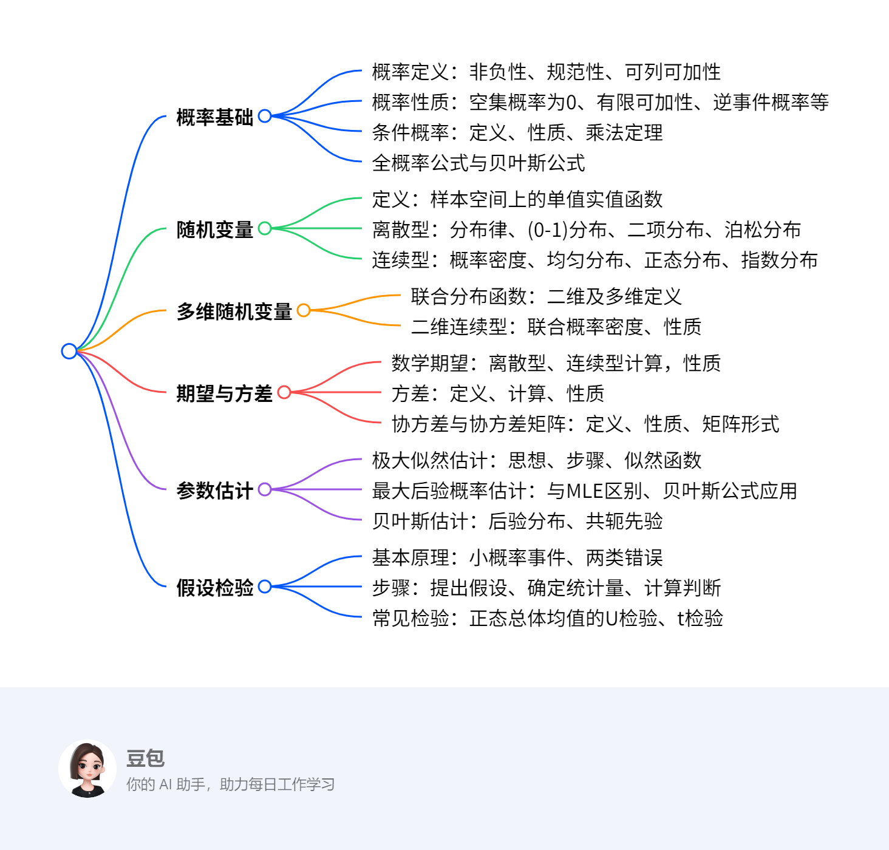

# 概率论与数理统计基础
## 概览

### 一段话总结
文档围绕概率论与数理统计展开，**先介绍概率的定义、性质，条件概率及全概率公式、贝叶斯公式**；**接着阐述随机变量的定义，包括离散型和连续型随机变量的分布及常见分布类型**；**然后讲解多维随机变量及其分布、期望与方差的定义、计算及性质，还涉及协方差和协方差矩阵**；**最后介绍参数估计方法如极大似然估计、最大后验概率估计、贝叶斯估计，以及假设检验的基本原理、步骤和常见检验方法**。

---

### 思维导图

---

### 详细总结

#### 一、概率基础
1. **概率的定义**  
   对随机试验E的每一事件A，赋予实数\(P(A)\)为其概率，满足：  
   - **非负性**：\(P(A) \geq 0\)  
   - **规范性**：必然事件\(P(S) = 1\)  
   - **可列可加性**：两两互斥事件\(A_1, A_2, \dots\)，有\(P(\bigcup_{i=1}^\infty A_i) = \sum_{i=1}^\infty P(A_i)\)。  

2. **概率的性质**  
   - \(P(\varnothing) = 0\)  
   - **有限可加性**：\(n\)个互斥事件\(A_1, \dots, A_n\)，\(P(\bigcup_{i=1}^n A_i) = \sum_{i=1}^n P(A_i)\)  
   - 逆事件概率：\(P(\overline{A}) = 1 - P(A)\)  
   - **加法公式**：任意两事件\(A, B\)，\(P(A \cup B) = P(A) + P(B) - P(AB)\)，可推广至\(n\)个事件。  

3. **条件概率与公式**  
   - 定义：\(P(B|A) = \frac{P(AB)}{P(A)}\)（\(P(A) > 0\)）  
   - **乘法定理**：\(P(AB) = P(B|A)P(A)\)，推广至\(n\)个事件链。  
   - **全概率公式**：样本空间划分\(B_1, \dots, B_n\)，则\(P(A) = \sum_{i=1}^n P(A|B_i)P(B_i)\)。  
   - **贝叶斯公式**：\(P(B_i|A) = \frac{P(A|B_i)P(B_i)}{\sum_{j=1}^n P(A|B_j)P(B_j)}\)。  

#### 二、随机变量
1. **离散型随机变量**  
   - 分布律：\(P(X = x_k) = p_k\)（\(k=1,2,\dots\)）  
   - **常见分布**：  
     | 分布名称 | 记号 | 概率公式 | 期望 | 方差 |
     |---|---|---|---|---|
     | (0-1)分布 | \(X \sim B(1, p)\) | \(P(X=k) = p^k(1-p)^{1-k}\) | \(p\) | \(p(1-p)\) |
     | 二项分布 | \(X \sim B(n, p)\) | \(P(X=k) = C_n^k p^k(1-p)^{n-k}\) | \(np\) | \(np(1-p)\) |
     | 泊松分布 | \(X \sim P(\lambda)\) | \(P(X=k) = \frac{\lambda^k e^{-\lambda}}{k!}\) | \(\lambda\) | \(\lambda\) |

2. **连续型随机变量**  
   - 概率密度\(p(x)\)满足：  
     - \(\int_{-\infty}^{+\infty} p(x)dx = 1\)  
     - \(P(a < X \leq b) = \int_a^b p(x)dx\)  
   - **常见分布**：  
     | 分布名称 | 记号 | 概率密度 | 期望 | 方差 |
     |---|---|---|---|---|
     | 均匀分布 | \(X \sim U[a, b]\) | \(p(x) = \frac{1}{b-a}\)（\(a \leq x \leq b\)） | \(\frac{a+b}{2}\) | \(\frac{(b-a)^2}{12}\) |
     | 正态分布 | \(X \sim N(\mu, \sigma^2)\) | \(p(x) = \frac{1}{\sqrt{2\pi}\sigma}e^{-\frac{(x-\mu)^2}{2\sigma^2}}\) | \(\mu\) | \(\sigma^2\) |
     | 指数分布 | \(X \sim E(\lambda)\) | \(p(x) = \lambda e^{-\lambda x}\)（\(x \geq 0\)） | \(\frac{1}{\lambda}\) | \(\frac{1}{\lambda^2}\) |

#### 三、多维随机变量
- **联合分布函数**：\(F(x_1, \dots, x_n) = P(X_1 \leq x_1, \dots, X_n \leq x_n)\)。  
- **二维连续型**：联合概率密度\(p(x, y)\)满足\(F(x, y) = \int_{-\infty}^y \int_{-\infty}^x p(u, v)dudv\)，且\(\iint_{-\infty}^{+\infty} p(x, y)dxdy = 1\)。  

#### 四、期望与方差
1. **数学期望**  
   - 离散型：\(E(X) = \sum_{k=1}^\infty x_k p_k\)  
   - 连续型：\(E(X) = \int_{-\infty}^{+\infty} x p(x)dx\)  
   - **性质**：\(E(C) = C\)，\(E(CX) = CE(X)\)，\(E(X+Y) = E(X)+E(Y)\)（独立时\(E(XY) = E(X)E(Y)\)）。  

2. **方差**  
   - 定义：\(D(X) = E[(X-E(X))^2] = E(X^2) - [E(X)]^2\)  
   - **性质**：\(D(C) = 0\)，\(D(CX) = C^2D(X)\)，\(D(X \pm Y) = D(X) + D(Y) \pm 2\text{Cov}(X, Y)\)（独立时\(D(X+Y) = D(X)+D(Y)\)）。  

3. **协方差与协方差矩阵**  
   - 协方差：\(\text{Cov}(X, Y) = E[(X-E(X))(Y-E(Y))] = E(XY) - E(X)E(Y)\)  
   - 相关系数：\(\rho_{XY} = \frac{\text{Cov}(X, Y)}{\sqrt{D(X)D(Y)}}\)  
   - 协方差矩阵：\(n\)维随机变量\(X=(X_1, \dots, X_n)^T\)的协方差矩阵\(C\)，其中\(c_{ij} = \text{Cov}(X_i, X_j)\)，对角线为方差。  

#### 五、参数估计
1. **极大似然估计（MLE）**  
   - 思想：选择参数使样本出现概率最大。  
   - 步骤：构造似然函数\(L(\theta) = \prod_{i=1}^n p(x_i;\theta)\)，取对数求导，解方程得估计值。  

2. **最大后验概率估计（MAP）**  
   - 引入先验概率\(p(\theta)\)，最大化后验概率\(p(\theta|X) \propto p(X|\theta)p(\theta)\)，适用于小样本场景。  

3. **贝叶斯估计**  
   - 计算后验分布\(p(\theta|X) = \frac{p(X|\theta)p(\theta)}{p(X)}\)，取期望作为估计值，常选共轭先验简化计算。  

#### 六、假设检验
1. **基本原理**  
   - 基于小概率事件原理，提出原假设\(H_0\)和备择假设\(H_1\)，通过检验统计量判断拒绝或接受\(H_0\)。  
   - **两类错误**：  
     - 第一类错误（弃真）：概率为显著性水平\(\alpha\)。  
     - 第二类错误（取伪）：概率为\(\beta\)，\(\alpha\)与\(\beta\)不能同时减小，需增大样本量。  

2. **正态总体均值检验**  
   - **U检验（\(\sigma^2\)已知）**：  
     - 双边检验：\(H_0: \mu = \mu_0\)，拒绝域\(|Z| \geq z_{\alpha/2}\)，\(Z = \frac{\overline{X}-\mu_0}{\sigma/\sqrt{n}}\)。  
   - **t检验（\(\sigma^2\)未知）**：  
     - 双边检验：\(H_0: \mu = \mu_0\)，拒绝域\(|t| \geq t_{\alpha/2}(n-1)\)，\(t = \frac{\overline{X}-\mu_0}{S/\sqrt{n}}\)。  

---

### 关键问题
1. **问题**：全概率公式与贝叶斯公式的核心区别是什么？  
   **答案**：  
   - 全概率公式用于**由因求果**，通过样本空间的划分，将复杂事件概率分解为各简单事件条件概率的加权和，公式为\(P(A) = \sum_{i=1}^n P(A|B_i)P(B_i)\)。  
   - 贝叶斯公式用于**由果溯因**，在已知结果发生的情况下，反推各原因的概率，公式为\(P(B_i|A) = \frac{P(A|B_i)P(B_i)}{\sum_{j=1}^n P(A|B_j)P(B_j)}\)，体现了先验概率到后验概率的更新。  

2. **问题**：离散型与连续型随机变量的数学期望计算有何本质差异？  
   **答案**：  
   - 离散型随机变量的期望是**加权求和**，公式为\(E(X) = \sum_{k=1}^\infty x_k p_k\)，其中\(p_k\)为离散概率值。  
   - 连续型随机变量的期望是**积分运算**，公式为\(E(X) = \int_{-\infty}^{+\infty} x p(x)dx\)，其中\(p(x)\)为概率密度函数，体现了密度在实数轴上的累积效应。  

3. **问题**：极大似然估计（MLE）与最大后验概率估计（MAP）的本质区别是什么？  
   **答案**：  
   - **MLE**属于频率学派，假设参数为固定值，仅通过样本数据最大化似然函数\(L(\theta) = \prod_{i=1}^n p(x_i;\theta)\)，不考虑先验信息。  
   - **MAP**属于贝叶斯学派，将参数视为随机变量，引入先验分布\(p(\theta)\)，最大化后验概率\(p(\theta|X) \propto p(X|\theta)p(\theta)\)，适合样本量小或需融入先验知识的场景。

## 概率基础总结

### 一、核心概念与性质
#### 1. 概率的定义（公理化定义）
- **三要素**：  
  - **非负性**：对任意事件 \( A \)，\( P(A) \geq 0 \)。  
  - **规范性**：必然事件 \( S \) 的概率 \( P(S) = 1 \)。  
  - **可列可加性**：若事件 \( A_1, A_2, \dots \) 两两互斥（即 \( A_i \cap A_j = \varnothing, i \neq j \)），则  
    \[
    P(A_1 \cup A_2 \cup \dots) = P(A_1) + P(A_2) + \dots
    \]

#### 2. 概率的性质
- **空集概率**：\( P(\varnothing) = 0 \)。  
- **有限可加性**：若 \( A_1, A_2, \dots, A_n \) 两两互斥，则  
  \[
  P(A_1 \cup \dots \cup A_n) = P(A_1) + \dots + P(A_n)
  \]  
- **逆事件概率**：对任意事件 \( A \)，\( P(\overline{A}) = 1 - P(A) \)。  
- **包含关系**：若 \( A \subseteq B \)，则 \( P(B - A) = P(B) - P(A) \)，且 \( P(B) \geq P(A) \)。  
- **加法公式**：对任意两事件 \( A, B \)，  
  \[
  P(A \cup B) = P(A) + P(B) - P(AB)
  \]  
  **推广到 \( n \) 个事件**：  
  \[
  P(\bigcup_{i=1}^n A_i) = \sum_{i=1}^n P(A_i) - \sum_{1 \leq i < j \leq n} P(A_i A_j) + \dots + (-1)^{n+1} P(A_1 \dots A_n)
  \]

#### 3. 条件概率
- **定义**：设 \( P(B) > 0 \)，在事件 \( B \) 发生的条件下，事件 \( A \) 发生的概率为  
  \[
  P(A|B) = \frac{P(AB)}{P(B)}
  \]  
- **性质**：  
  - 非负性：\( P(A|B) \geq 0 \)。  
  - 规范性：\( P(S|B) = 1 \)。  
  - 可列可加性：若 \( B_1, B_2, \dots \) 两两互斥，则  
    \[
    P(\bigcup_{i=1}^\infty B_i | A) = \sum_{i=1}^\infty P(B_i | A)
    \]

#### 4. 乘法定理（链式法则）
- **公式**：  
  - 两事件：若 \( P(A) > 0 \)，则 \( P(AB) = P(B|A)P(A) \)。  
  - \( n \) 事件：若 \( P(A_1 A_2 \dots A_{n-1}) > 0 \)，则  
    \[
    P(A_1 A_2 \dots A_n) = P(A_n | A_1 \dots A_{n-1}) \cdots P(A_2 | A_1) P(A_1)
    \]

### 二、全概率公式与贝叶斯公式
#### 1. 样本空间的划分
- **定义**：若事件 \( B_1, B_2, \dots, B_n \) 满足：  
  - 两两互斥：\( B_i \cap B_j = \varnothing \ (i \neq j) \)。  
  - 覆盖样本空间：\( B_1 \cup \dots \cup B_n = S \)。  
  则称 \( B_1, \dots, B_n \) 为样本空间 \( S \) 的一个**划分**。

#### 2. 全概率公式
- **公式**：若 \( B_1, \dots, B_n \) 是样本空间的划分，且 \( P(B_i) > 0 \)，则对任意事件 \( A \)，  
  \[
  P(A) = \sum_{i=1}^n P(A|B_i) P(B_i)
  \]  
- **本质**：将复杂事件 \( A \) 的概率分解为多个简单事件 \( B_i \) 条件下的概率加权和，用于**由因求果**。

#### 3. 贝叶斯公式
- **公式**：在全概率公式条件下，有  
  \[
  P(B_i | A) = \frac{P(A|B_i) P(B_i)}{\sum_{j=1}^n P(A|B_j) P(B_j)}
  \]  
- **本质**：已知结果 \( A \) 发生，反推各原因 \( B_i \) 的概率，用于**由果溯因**，体现先验概率到后验概率的更新。

### 三、求解方法与示例
#### 1. 条件概率求解方法
**步骤**：  
1. 确定样本空间 \( S \) 和事件 \( A, B \)。  
2. 计算 \( P(AB) \) 和 \( P(B) \)。  
3. 代入公式 \( P(A|B) = \frac{P(AB)}{P(B)} \)。  

**示例**：  
一袋中有 3 红球、2 白球，不放回摸球两次。设 \( A = \{\text{第二次摸到红球}\} \)，\( B = \{\text{第一次摸到白球}\} \)，求 \( P(A|B) \)。  
**解**：  
- \( P(B) = \frac{2}{5} \)（第一次摸白球的概率）。  
- \( P(AB) = \frac{2}{5} \times \frac{3}{4} = \frac{3}{10} \)（第一次白球且第二次红球的概率）。  
- \( P(A|B) = \frac{P(AB)}{P(B)} = \frac{3/10}{2/5} = \frac{3}{4} \)。

#### 2. 全概率公式求解方法
**步骤**：  
1. 确定样本空间的划分 \( B_1, \dots, B_n \)。  
2. 计算各 \( P(B_i) \) 和条件概率 \( P(A|B_i) \)。  
3. 代入公式 \( P(A) = \sum P(A|B_i) P(B_i) \)。  

**示例**：  
某工厂有三条生产线，产量分别占 20%、30%、50%，次品率分别为 5%、4%、2%。求随机抽取一件产品为次品的概率。  
**解**：  
- 设 \( B_1, B_2, B_3 \) 表示产品来自三条生产线，\( A = \{\text{次品}\} \)。  
- \( P(B_1) = 0.2 \)，\( P(B_2) = 0.3 \)，\( P(B_3) = 0.5 \)。  
- \( P(A|B_1) = 0.05 \)，\( P(A|B_2) = 0.04 \)，\( P(A|B_3) = 0.02 \)。  
- 全概率公式：  
  \[
  P(A) = 0.2 \times 0.05 + 0.3 \times 0.04 + 0.5 \times 0.02 = 0.032
  \]

#### 3. 贝叶斯公式求解方法
**步骤**：  
1. 利用全概率公式计算 \( P(A) \)。  
2. 对目标原因 \( B_i \)，计算 \( P(A|B_i) P(B_i) \)。  
3. 代入贝叶斯公式 \( P(B_i|A) = \frac{P(A|B_i) P(B_i)}{P(A)} \)。  

**示例**（续上例）：若抽到一件次品，求其来自第一条生产线的概率。  
**解**：  
- 已求得 \( P(A) = 0.032 \)。  
- \( P(B_1|A) = \frac{P(A|B_1) P(B_1)}{P(A)} = \frac{0.05 \times 0.2}{0.032} = \frac{0.01}{0.032} = \frac{5}{16} \)。

### 四、重点总结
- **核心公式**：加法公式、条件概率、全概率公式、贝叶斯公式。  
- **关键思想**：  
  - 全概率公式通过划分样本空间，将复杂事件分解为简单事件的组合。  
  - 贝叶斯公式结合先验概率与观测数据，更新对事件发生原因的信念。  
- **应用场景**：  
  - 全概率公式适用于多路径导致某结果的概率计算（如可靠性分析）。  
  - 贝叶斯公式适用于逆概率推断（如医学诊断、机器学习中的分类问题）。

## 概率的性质、条件概率及相关公式总结  

### 一、核心概念与公式  
#### 1. **概率的性质（多事件推广）**  
- **加法公式推广**：  
  对于任意三个事件 \(A_1, A_2, A_3\)，有  
  \[
  P(A_1 \cup A_2 \cup A_3) = P(A_1) + P(A_2) + P(A_3) - P(A_1A_2) - P(A_1A_3) - P(A_2A_3) + P(A_1A_2A_3)
  \]  
  **n 个事件推广**：  
  \[
  P\left(\bigcup_{i=1}^n A_i\right) = \sum_{i=1}^n P(A_i) - \sum_{1 \leq i < j \leq n} P(A_iA_j) + \sum_{1 \leq i < j < k \leq n} P(A_iA_jA_k) - \dots + (-1)^{n+1}P(A_1A_2\cdots A_n)
  \]  
  **本质**：通过**容斥原理**逐步加减交集概率，避免重复计算。  

#### 2. **条件概率**  
- **定义**：在事件 \(B\) 发生的条件下，事件 \(A\) 发生的概率为  
  \[
  P(A|B) = \frac{P(AB)}{P(B)} \quad (P(B) > 0)
  \]  
- **性质**：  
  - **非负性**：\(P(A|B) \geq 0\)；  
  - **规范性**：\(P(S|B) = 1\)（\(S\) 为必然事件）；  
  - **可列可加性**：若 \(B_1, B_2, \dots\) 两两互斥，则  
    \[
    P\left(\bigcup_{i=1}^\infty B_i \bigg| A\right) = \sum_{i=1}^\infty P(B_i|A)
    \]  

#### 3. **乘法定理（链式法则）**  
- **两事件**：\(P(AB) = P(A|B)P(B) = P(B|A)P(A)\)（需 \(P(A), P(B) > 0\)）。  
- **多事件**：对于 \(n\) 个事件 \(A_1, A_2, \dots, A_n\)，若 \(P(A_1A_2\cdots A_{n-1}) > 0\)，则  
  \[
  P(A_1A_2\cdots A_n) = P(A_n|A_1A_2\cdots A_{n-1}) \cdot P(A_{n-1}|A_1\cdots A_{n-2}) \cdots P(A_2|A_1) \cdot P(A_1)
  \]  

#### 4. **全概率公式与贝叶斯公式**  
- **样本空间划分**：  
  若事件 \(B_1, B_2, \dots, B_n\) 满足：  
  1. 两两互斥（\(B_i \cap B_j = \varnothing, i \neq j\)）；  
  2. 覆盖样本空间（\(B_1 \cup B_2 \cup \dots \cup B_n = S\)），  
  则称其为样本空间 \(S\) 的一个**划分**。  

- **全概率公式**：  
  \[
  P(A) = \sum_{i=1}^n P(A|B_i)P(B_i)
  \]  
  **作用**：将复杂事件 \(A\) 的概率分解为多个简单事件 \(B_i\) 条件下的概率加权和（**由因求果**）。  

- **贝叶斯公式**：  
  \[
  P(B_i|A) = \frac{P(A|B_i)P(B_i)}{\sum_{j=1}^n P(A|B_j)P(B_j)}
  \]  
  **作用**：已知结果 \(A\) 发生，反推各原因 \(B_i\) 的概率（**由果溯因**），需结合先验概率 \(P(B_i)\)。  

### 二、求解方法与示例  
#### 1. **条件概率与乘法定理求解**  
**方法步骤**：  
1. 确定目标事件 \(A\) 和条件事件 \(B\)；  
2. 计算 \(P(AB)\) 和 \(P(B)\)（或 \(P(A)\)）；  
3. 代入公式 \(P(A|B) = \frac{P(AB)}{P(B)}\) 或 \(P(AB) = P(A|B)P(B)\)。  

**示例**：  
盒中有 2 红 3 蓝球，不放回摸球两次。求：  
（1）第一次摸到红球（事件 \(A\)）的条件下，第二次摸到蓝球（事件 \(B\)）的概率；  
（2）两次都摸到红球的概率。  

**解**：  
（1）\(P(A) = \frac{2}{5}\)，\(P(AB) = \frac{2}{5} \times \frac{3}{4} = \frac{3}{10}\)，  
\[
P(B|A) = \frac{P(AB)}{P(A)} = \frac{3/10}{2/5} = \frac{3}{4}
\]  
（2）两次都红球为事件 \(AB'\)（\(B'\) 为第二次红球），  
\[
P(AB') = P(A) \cdot P(B'|A) = \frac{2}{5} \times \frac{1}{4} = \frac{1}{10}
\]  

#### 2. **全概率公式求解**  
**方法步骤**：  
1. 确定样本空间的划分 \(B_1, B_2, \dots, B_n\)；  
2. 计算各划分的概率 \(P(B_i)\) 和条件概率 \(P(A|B_i)\)；  
3. 代入公式 \(P(A) = \sum_{i=1}^n P(A|B_i)P(B_i)\)。  

**示例**：  
某工厂有三条生产线，产量占比分别为 30%、50%、20%，次品率分别为 4%、3%、5%。求随机抽取一件产品为次品（事件 \(A\)）的概率。  

**解**：  
- 划分 \(B_1, B_2, B_3\) 表示产品来自三条生产线，  
  \(P(B_1) = 0.3\)，\(P(B_2) = 0.5\)，\(P(B_3) = 0.2\)；  
- \(P(A|B_1) = 0.04\)，\(P(A|B_2) = 0.03\)，\(P(A|B_3) = 0.05\)；  
- 全概率公式：  
  \[
  P(A) = 0.3 \times 0.04 + 0.5 \times 0.03 + 0.2 \times 0.05 = 0.037
  \]  

#### 3. **贝叶斯公式求解**  
**方法步骤**：  
1. 用全概率公式计算 \(P(A)\)；  
2. 对目标原因 \(B_i\)，计算 \(P(A|B_i)P(B_i)\)；  
3. 代入公式 \(P(B_i|A) = \frac{P(A|B_i)P(B_i)}{P(A)}\)。  

**示例**（续上例）：若抽到次品，求其来自第二条生产线（事件 \(B_2\)）的概率。  

**解**：  
- 已求得 \(P(A) = 0.037\)；  
- \(P(B_2|A) = \frac{P(A|B_2)P(B_2)}{P(A)} = \frac{0.03 \times 0.5}{0.037} \approx 0.4054\)（即 40.54%）。  

### 三、重点总结  
- **核心公式**：  
  - 加法公式（容斥原理）、条件概率、乘法定理；  
  - 全概率公式（由因求果）、贝叶斯公式（由果溯因）。  
- **关键思想**：  
  - 条件概率体现事件依赖关系；  
  - 全概率公式通过分解样本空间简化计算；  
  - 贝叶斯公式结合先验概率与观测数据更新推断。  
- **应用场景**：  
  - 全概率公式：风险分析、可靠性评估；  
  - 贝叶斯公式：医学诊断、机器学习分类、逆概率问题。

## 随机变量及其分布总结  

### 一、核心概念与分类  
#### 1. **随机变量的定义**  
- **定义**：设随机试验的样本空间为 \( S = \{e\} \)，若存在单值实值函数 \( X = X(e) \)，将样本点 \( e \) 映射为实数，则称 \( X \) 为**随机变量**。  
- **本质**：将随机试验的结果数值化，便于用数学工具分析（如概率、期望等）。  
- **图示**：样本点 \( e \in S \) 通过 \( X(e) \) 与实数轴 \( R \) 建立对应关系（如 \( e_1 \to X(e_1) \)）。  

#### 2. **离散型随机变量**  
- **定义**：随机变量 \( X \) 的可能取值为有限个或可列无限个（如 \( x_1, x_2, \dots \)）。  
- **分布律**：  
  - 定义：\( P(X = x_k) = p_k \)（\( k = 1, 2, \dots \)），满足 \( p_k \geq 0 \) 且 \( \sum_{k=1}^\infty p_k = 1 \)。  
  - **常见分布**：  
    - **(0-1) 分布**：\( P(X = k) = p^k(1-p)^{1-k} \)（\( k = 0, 1 \)），用于描述二分类问题（如抛硬币）。  
    - **二项分布**：\( P(X = k) = C_n^k p^k(1-p)^{n-k} \)（\( k = 0, 1, \dots, n \)），表示 \( n \) 次独立试验中成功 \( k \) 次的概率。  
    - **泊松分布**：\( P(X = k) = \frac{\lambda^k e^{-\lambda}}{k!} \)（\( k = 0, 1, \dots \)），用于描述单位时间内随机事件的发生次数（如客服中心来电数）。  

#### 3. **连续型随机变量**  
- **定义**：存在非负可积函数 \( p(x) \)（概率密度函数），使得分布函数 \( F(x) = \int_{-\infty}^x p(t)dt \)。  
- **概率密度的性质**：  
  1. **非负性**：\( p(x) \geq 0 \)。  
  2. **规范性**：\( \int_{-\infty}^{+\infty} p(x)dx = 1 \)。  
  3. **概率计算**：\( P(a < X \leq b) = F(b) - F(a) = \int_a^b p(x)dx \)。  
  4. **单点概率**：\( P(X = c) = 0 \)（连续型变量在单点的概率为零）。  
- **常见分布**：  
  - **均匀分布** \( X \sim U[a, b] \)：  
    \[
    p(x) = \begin{cases} 
    \frac{1}{b-a}, & a \leq x \leq b \\
    0, & \text{其他} 
    \end{cases}
    \]  
    表示变量在区间 \([a, b]\) 内等概率取值（如随机数生成）。  
  - **正态分布** \( X \sim N(\mu, \sigma^2) \)：  
    \[
    p(x) = \frac{1}{\sqrt{2\pi}\sigma} e^{-\frac{(x-\mu)^2}{2\sigma^2}}
    \]  
    最常见的分布，描述自然现象中的误差或群体特征（如身高、体重）。  
  - **指数分布** \( X \sim E(\lambda) \)：  
    \[
    p(x) = \begin{cases} 
    \lambda e^{-\lambda x}, & x \geq 0 \\
    0, & x < 0 
    \end{cases}
    \]  
    用于描述随机事件的间隔时间（如设备故障时间）。  

#### 4. **多维随机变量（以二维为例）**  
- **联合分布函数**：  
  \[
  F(x, y) = P(X \leq x, Y \leq y)
  \]  
  表示随机点 \((X, Y)\) 落在区域 \((-\infty, x] \times (-\infty, y]\) 内的概率。  
- **二维连续型随机变量**：  
  - 存在联合概率密度 \( p(x, y) \)，满足：  
    \[
    F(x, y) = \int_{-\infty}^y \int_{-\infty}^x p(u, v)dudv
    \]  
  - **性质**：  
    1. \( p(x, y) \geq 0 \)；  
    2. \( \int_{-\infty}^{+\infty} \int_{-\infty}^{+\infty} p(x, y)dxdy = 1 \)；  
    3. \( P((X, Y) \in G) = \iint_G p(x, y)dxdy \)（\( G \) 为平面区域）。  

### 二、求解方法与示例  
#### 1. **离散型随机变量：分布律计算**  
**方法步骤**：  
1. 确定 \( X \) 的所有可能取值 \( x_k \)；  
2. 计算每个取值的概率 \( p_k = P(X = x_k) \)；  
3. 验证 \( \sum p_k = 1 \)。  

**示例**：抛一枚均匀硬币两次，设 \( X \) 为正面朝上的次数，求 \( X \) 的分布律。  
**解**：  
- \( X \) 可能取值：0, 1, 2。  
- 概率计算：  
  - \( P(X=0) = P(\text{反反}) = \frac{1}{2} \times \frac{1}{2} = \frac{1}{4} \)；  
  - \( P(X=1) = P(\text{正反}) + P(\text{反正}) = 2 \times \frac{1}{2} \times \frac{1}{2} = \frac{1}{2} \)；  
  - \( P(X=2) = P(\text{正正}) = \frac{1}{2} \times \frac{1}{2} = \frac{1}{4} \)。  
- 分布律：  
  \[
  \begin{array}{c|c|c|c}
  X & 0 & 1 & 2 \\
  \hline
  p_k & \frac{1}{4} & \frac{1}{2} & \frac{1}{4} \\
  \end{array}
  \]  

#### 2. **连续型随机变量：概率密度与分布函数**  
**方法步骤**：  
- **已知 \( p(x) \) 求概率**：计算 \( P(a < X \leq b) = \int_a^b p(x)dx \)。  
- **已知 \( F(x) \) 求 \( p(x) \)**：对 \( F(x) \) 求导，即 \( p(x) = F'(x) \)（在 \( p(x) \) 连续点处）。  

**示例**：设 \( X \sim U[0, 5] \)，求 \( P(1 < X < 3) \)。  
**解**：  
- 概率密度：\( p(x) = \begin{cases} 
\frac{1}{5}, & 0 \leq x \leq 5 \\
0, & \text{其他} 
\end{cases} \)  
- 概率计算：  
  \[
  P(1 < X < 3) = \int_1^3 \frac{1}{5}dx = \frac{1}{5} \times (3 - 1) = \frac{2}{5}
  \]  

#### 3. **二维连续型随机变量：联合概率计算**  
**方法步骤**：  
1. 确定联合概率密度 \( p(x, y) \)；  
2. 设定目标区域 \( G \)（如矩形、圆形等）；  
3. 计算二重积分 \( P((X, Y) \in G) = \iint_G p(x, y)dxdy \)。  

**示例**：设二维随机变量 \((X, Y)\) 的联合概率密度为  
\[
p(x, y) = \begin{cases} 
2e^{-x-2y}, & x > 0, y > 0 \\
0, & \text{其他} 
\end{cases}
\]  
求 \( P(X \leq 1, Y \leq 1) \)。  
**解**：  
- 目标区域：\( G = \{ (x, y) | 0 < x \leq 1, 0 < y \leq 1 \} \)  
- 概率计算：  
  \[
  P(X \leq 1, Y \leq 1) = \int_0^1 \int_0^1 2e^{-x-2y}dydx = 2 \left( \int_0^1 e^{-x}dx \right) \left( \int_0^1 e^{-2y}dy \right)
  \]  
  - 计算内层积分：  
    \[
    \int_0^1 e^{-2y}dy = \left[ -\frac{1}{2}e^{-2y} \right]_0^1 = \frac{1 - e^{-2}}{2}
    \]  
  - 计算外层积分：  
    \[
    \int_0^1 e^{-x}dx = \left[ -e^{-x} \right]_0^1 = 1 - e^{-1}
    \]  
  - 最终结果：  
    \[
    P(X \leq 1, Y \leq 1) = 2 \times (1 - e^{-1}) \times \frac{1 - e^{-2}}{2} = (1 - e^{-1})(1 - e^{-2})
    \]  

### 三、重点总结  
- **核心分类**：  
  - **离散型**：用分布律 \( P(X = x_k) = p_k \) 描述，常见分布包括 (0-1) 分布、二项分布、泊松分布。  
  - **连续型**：用概率密度 \( p(x) \) 和分布函数 \( F(x) \) 描述，常见分布包括均匀分布、正态分布、指数分布。  
- **关键思想**：  
  - 离散型变量通过求和计算概率，连续型变量通过积分计算概率；  
  - 多维变量需用联合分布描述变量间的依赖关系。  
- **应用场景**：  
  - 离散型：分类问题、计数问题（如产品合格数）；  
  - 连续型：测量数据、自然现象建模（如温度、时间）；  
  - 多维变量：联合分析（如身高与体重的相关性）。

## 期望与方差总结  

### 一、核心概念与公式  
#### 1. **数学期望（均值）**  
- **定义**：  
  - **离散型**：若随机变量 \(X\) 的分布律为 \(P(X=x_k)=p_k\)（\(k=1,2,\dots\)），且级数 \(\sum_{k=1}^\infty x_k p_k\) 绝对收敛，则  
    \[
    E(X) = \sum_{k=1}^\infty x_k p_k
    \]  
  - **连续型**：若 \(X\) 的概率密度为 \(f(x)\)，且积分 \(\int_{-\infty}^{+\infty} x f(x)dx\) 绝对收敛，则  
    \[
    E(X) = \int_{-\infty}^{+\infty} x f(x)dx
    \]  
- **性质**：  
  1. **常数性**：\(E(C) = C\)（\(C\) 为常数）。  
  2. **线性性**：\(E(CX) = CE(X)\)，\(E(X+Y) = E(X)+E(Y)\)（可推广至有限个变量）。  
  3. **独立性**：若 \(X, Y\) 独立，则 \(E(XY) = E(X)E(Y)\)（可推广至有限个独立变量）。  

- **常见分布的期望**：  
  | 分布 | 期望 \(E(X)\) |  
  |---|---|  
  | (0-1) 分布 \(X \sim B(1, p)\) | \(p\) |  
  | 二项分布 \(X \sim B(n, p)\) | \(np\) |  
  | 泊松分布 \(X \sim P(\lambda)\) | \(\lambda\) |  
  | 几何分布 \(X \sim \text{Geom}(p)\) | \(\frac{1}{p}\) |  
  | 均匀分布 \(X \sim U[a, b]\) | \(\frac{a+b}{2}\) |  
  | 正态分布 \(X \sim N(\mu, \sigma^2)\) | \(\mu\) |  
  | 指数分布 \(X \sim E(\lambda)\) | \(\frac{1}{\lambda}\) |  

#### 2. **方差**  
- **定义**：  
  随机变量 \(X\) 与期望 \(E(X)\) 的偏离程度，记为 \(D(X)\) 或 \(\text{Var}(X)\)，  
  \[
  D(X) = E\left[(X-E(X))^2\right] = E(X^2) - [E(X)]^2
  \]  
  - **离散型**：\(D(X) = \sum_{k=1}^\infty [x_k - E(X)]^2 p_k\)  
  - **连续型**：\(D(X) = \int_{-\infty}^{+\infty} [x - E(X)]^2 f(x)dx\)  

- **性质**：  
  1. **常数性**：\(D(C) = 0\)（\(C\) 为常数）。  
  2. **线性性**：\(D(CX) = C^2 D(X)\)，\(D(X+C) = D(X)\)。  
  3. **和差公式**：\(D(X \pm Y) = D(X) + D(Y) \pm 2\text{Cov}(X, Y)\)，若 \(X, Y\) 独立，则 \(D(X \pm Y) = D(X) + D(Y)\)。  

- **常见分布的方差**：  
  | 分布 | 方差 \(D(X)\) |  
  |---|---|  
  | (0-1) 分布 \(X \sim B(1, p)\) | \(p(1-p)\) |  
  | 二项分布 \(X \sim B(n, p)\) | \(np(1-p)\) |  
  | 泊松分布 \(X \sim P(\lambda)\) | \(\lambda\) |  
  | 几何分布 \(X \sim \text{Geom}(p)\) | \(\frac{1-p}{p^2}\) |  
  | 均匀分布 \(X \sim U[a, b]\) | \(\frac{(b-a)^2}{12}\) |  
  | 正态分布 \(X \sim N(\mu, \sigma^2)\) | \(\sigma^2\) |  
  | 指数分布 \(X \sim E(\lambda)\) | \(\frac{1}{\lambda^2}\) |  

#### 3. **协方差与相关系数**  
- **协方差**：  
  \[
  \text{Cov}(X, Y) = E\left[(X-E(X))(Y-E(Y))\right] = E(XY) - E(X)E(Y)
  \]  
  - **性质**：  
    - \(\text{Cov}(X, Y) = \text{Cov}(Y, X)\)  
    - \(\text{Cov}(aX, bY) = ab\text{Cov}(X, Y)\)（\(a, b\) 为常数）  
    - \(\text{Cov}(X_1+X_2, Y) = \text{Cov}(X_1, Y) + \text{Cov}(X_2, Y)\)  

- **相关系数**：  
  \[
  \rho_{XY} = \frac{\text{Cov}(X, Y)}{\sqrt{D(X)D(Y)}}
  \]  
  - **意义**：衡量 \(X, Y\) 的线性相关程度，\(|\rho_{XY}| \leq 1\)，\(\rho_{XY}=0\) 表示不相关。  

#### 4. **协方差矩阵**  
- **定义**：对于 \(n\) 维随机向量 \(X = (X_1, X_2, \dots, X_n)^T\)，其协方差矩阵为 \(n \times n\) 矩阵 \(C\)，其中  
  \[
  C_{ij} = \text{Cov}(X_i, X_j), \quad C_{ii} = D(X_i)
  \]  
- **性质**：对称半正定矩阵，即 \(x^T C x \geq 0\) 对任意向量 \(x\) 成立。  

### 二、求解方法与示例  
#### 1. **期望的计算**  
**方法步骤**：  
- **离散型**：确定分布律 \(p_k\)，代入公式 \(E(X) = \sum x_k p_k\)。  
- **连续型**：确定概率密度 \(f(x)\)，代入公式 \(E(X) = \int x f(x)dx\)。  
- **函数的期望**：若 \(Y = g(X)\)，则 \(E(Y) = \sum g(x_k)p_k\)（离散型）或 \(E(Y) = \int g(x)f(x)dx\)（连续型）。  

**示例**：  
设随机变量 \(X\) 服从参数为 \(\lambda=2\) 的泊松分布，求 \(E(X^2)\)。  
**解**：  
- 已知 \(E(X) = \lambda = 2\)，\(D(X) = \lambda = 2\)。  
- 利用方差公式 \(D(X) = E(X^2) - [E(X)]^2\)，得  
  \[
  E(X^2) = D(X) + [E(X)]^2 = 2 + 2^2 = 6
  \]  

#### 2. **方差的计算**  
**方法步骤**：  
1. 计算 \(E(X)\)；  
2. 利用定义式或公式 \(D(X) = E(X^2) - [E(X)]^2\) 计算方差。  

**示例**：  
掷一枚均匀骰子，设 \(X\) 为点数，求 \(D(X)\)。  
**解**：  
- \(X\) 的分布律：\(P(X=k) = \frac{1}{6}\)（\(k=1,2,\dots,6\)）。  
- 计算期望：  
  \[
  E(X) = \frac{1+2+3+4+5+6}{6} = 3.5
  \]  
- 计算 \(E(X^2)\)：  
  \[
  E(X^2) = \frac{1^2 + 2^2 + 3^2 + 4^2 + 5^2 + 6^2}{6} = \frac{91}{6} \approx 15.1667
  \]  
- 方差：  
  \[
  D(X) = E(X^2) - [E(X)]^2 = \frac{91}{6} - (3.5)^2 = \frac{35}{12} \approx 2.9167
  \]  

#### 3. **协方差与相关系数的计算**  
**方法步骤**：  
1. 计算 \(E(X)\)、\(E(Y)\)、\(E(XY)\)；  
2. 代入协方差公式 \(\text{Cov}(X, Y) = E(XY) - E(X)E(Y)\)；  
3. 计算 \(D(X)\)、\(D(Y)\)，代入相关系数公式 \(\rho_{XY} = \frac{\text{Cov}(X, Y)}{\sqrt{D(X)D(Y)}}\)。  

**示例**：  
设二维随机变量 \((X, Y)\) 的联合概率密度为  
\[
f(x, y) = \begin{cases} 
2, & 0 \leq x \leq 1, 0 \leq y \leq x \\
0, & \text{其他} 
\end{cases}
\]  
求 \(\text{Cov}(X, Y)\) 和 \(\rho_{XY}\)。  
**解**：  
1. 计算 \(E(X)\)、\(E(Y)\)：  
   \[
   E(X) = \int_0^1 \int_0^x x \cdot 2 dy dx = \int_0^1 2x^2 dx = \frac{2}{3}
   \]  
   \[
   E(Y) = \int_0^1 \int_0^x y \cdot 2 dy dx = \int_0^1 x^2 dx = \frac{1}{3}
   \]  
2. 计算 \(E(XY)\)：  
   \[
   E(XY) = \int_0^1 \int_0^x xy \cdot 2 dy dx = \int_0^1 x \cdot \left[\frac{2y^2}{2}\right]_0^x dx = \int_0^1 x^3 dx = \frac{1}{4}
   \]  
3. 协方差：  
   \[
   \text{Cov}(X, Y) = \frac{1}{4} - \frac{2}{3} \times \frac{1}{3} = \frac{1}{4} - \frac{2}{9} = \frac{1}{36}
   \]  
4. 计算 \(D(X)\)、\(D(Y)\)：  
   \[
   E(X^2) = \int_0^1 \int_0^x x^2 \cdot 2 dy dx = \int_0^1 2x^3 dx = \frac{1}{2}, \quad D(X) = \frac{1}{2} - \left(\frac{2}{3}\right)^2 = \frac{1}{18}
   \]  
   \[
   E(Y^2) = \int_0^1 \int_0^x y^2 \cdot 2 dy dx = \int_0^1 \frac{2x^3}{3} dx = \frac{1}{6}, \quad D(Y) = \frac{1}{6} - \left(\frac{1}{3}\right)^2 = \frac{1}{18}
   \]  
5. 相关系数：  
   \[
   \rho_{XY} = \frac{\frac{1}{36}}{\sqrt{\frac{1}{18} \times \frac{1}{18}}} = \frac{\frac{1}{36}}{\frac{1}{18}} = \frac{1}{2}
   \]  

### 三、重点总结  
- **核心公式**：  
  - 期望 \(E(X)\)、方差 \(D(X)\)、协方差 \(\text{Cov}(X, Y)\) 的定义与性质；  
  - 方差公式 \(D(X) = E(X^2) - [E(X)]^2\)；  
  - 协方差矩阵的对称性与半正定性。  

- **关键思想**：  
  - 期望是随机变量的加权平均，方差衡量取值的分散程度，协方差反映变量间的线性关联；  
  - 独立性可简化期望与方差的计算（如 \(E(XY)=E(X)E(Y)\)、\(D(X+Y)=D(X)+D(Y)\)）。  

- **应用场景**：  
  - 期望与方差：统计分析、风险评估（如投资收益的均值与波动）；  
  - 协方差与相关系数：变量相关性分析（如身高与体重的关联）；  
  - 协方差矩阵：多元统计分析、机器学习（如高斯分布建模、主成分分析）。

## 参数估计方法总结  

### 一、核心概念与方法  
#### 1. **极大似然估计（MLE）**  
- **基本思想**：选择参数使得观测样本出现的概率最大（**频率学派观点**，假设参数为确定值）。  
- **似然函数**：  
  - 若总体分布为离散型，似然函数为样本联合分布律：  
    \[
    L(\theta) = \prod_{i=1}^n p(x_i; \theta)
    \]  
  - 若为连续型，似然函数为样本联合概率密度：  
    \[
    L(\theta) = \prod_{i=1}^n f(x_i; \theta)
    \]  
- **求解步骤**：  
  1. **构造似然函数** \( L(\theta) \)；  
  2. **取对数**得 \( \ln L(\theta) \)（简化计算）；  
  3. **求导并解似然方程**：对参数 \( \theta \) 求导，令导数为零，解得参数估计值 \( \hat{\theta} \)；  
  4. **验证最大值**（通常由问题性质保证）。  

- **注意事项**：  
  - 要求 \( \ln L(\theta) \) 可微，否则需从定义出发求解；  
  - 解可能不唯一，需结合实际问题筛选。  

#### 2. **最大后验概率估计（MAP）**  
- **基本思想**：在MLE基础上引入参数的**先验分布** \( p(\theta) \)，最大化后验概率 \( p(\theta|X) \)（**贝叶斯学派观点**，视参数为随机变量）。  
- **后验概率公式**：  
  \[
  p(\theta|X) = \frac{p(X|\theta)p(\theta)}{p(X)} \propto p(X|\theta)p(\theta)
  \]  
  （分母 \( p(X) \) 与 \( \theta \) 无关，可忽略）。  
- **求解步骤**：  
  1. **构造后验概率核**：\( p(X|\theta)p(\theta) \)；  
  2. **取对数**得 \( \ln p(X|\theta) + \ln p(\theta) \)；  
  3. **求导并解方程**，得到参数估计值 \( \hat{\theta}_{\text{MAP}} \)。  

- **与MLE的区别**：  
  - MAP包含先验信息 \( p(\theta) \)，适用于小样本场景；  
  - MLE是MAP在先验 \( p(\theta) \) 为均匀分布时的特例。  

#### 3. **贝叶斯估计**  
- **基本思想**：不直接估计参数值，而是估计参数的**后验分布** \( p(\theta|X) \)，并通过后验分布的期望等统计量作为参数估计结果。  
- **关键概念**：  
  - **共轭先验**：若后验分布与先验分布为同一分布族（如二项分布的先验取Beta分布，后验仍为Beta分布），可简化计算。  
  - **后验分布计算**：  
    \[
    p(\theta|X) = \frac{p(X|\theta)p(\theta)}{\int p(X|\theta)p(\theta)d\theta}
    \]  
- **求解步骤**：  
  1. **选择先验分布** \( p(\theta) \)（通常为共轭先验）；  
  2. **计算后验分布** \( p(\theta|X) \)；  
  3. **求后验期望**作为参数估计值：  
    \[
    \hat{\theta} = E[\theta|X] = \int \theta p(\theta|X)d\theta
    \]  

### 二、求解方法与示例  
#### 1. **极大似然估计（MLE）示例**  
**问题**：设样本 \( X_1, X_2, \dots, X_n \) 来自正态分布 \( N(\mu, \sigma^2) \)，求 \( \mu \) 和 \( \sigma^2 \) 的MLE。  
**解**：  
1. **构造似然函数**：  
   \[
   L(\mu, \sigma^2) = \prod_{i=1}^n \frac{1}{\sqrt{2\pi}\sigma} e^{-\frac{(x_i-\mu)^2}{2\sigma^2}} = (2\pi\sigma^2)^{-n/2} e^{-\frac{1}{2\sigma^2}\sum_{i=1}^n (x_i-\mu)^2}
   \]  
2. **取对数**：  
   \[
   \ln L = -\frac{n}{2}\ln(2\pi) - \frac{n}{2}\ln\sigma^2 - \frac{1}{2\sigma^2}\sum_{i=1}^n (x_i-\mu)^2
   \]  
3. **求偏导并解方程**：  
   - 对 \( \mu \) 求导：  
     \[
     \frac{\partial \ln L}{\partial \mu} = \frac{1}{\sigma^2}\sum_{i=1}^n (x_i - \mu) = 0 \implies \hat{\mu} = \frac{1}{n}\sum_{i=1}^n x_i = \bar{x}
     \]  
   - 对 \( \sigma^2 \) 求导：  
     \[
     \frac{\partial \ln L}{\partial \sigma^2} = -\frac{n}{2\sigma^2} + \frac{1}{2(\sigma^2)^2}\sum_{i=1}^n (x_i-\mu)^2 = 0 \implies \hat{\sigma}^2 = \frac{1}{n}\sum_{i=1}^n (x_i - \bar{x})^2
     \]  
4. **结果**：  
   \[
   \hat{\mu}_{\text{MLE}} = \bar{X}, \quad \hat{\sigma}_{\text{MLE}}^2 = \frac{1}{n}\sum_{i=1}^n (X_i - \bar{X})^2
   \]  

#### 2. **最大后验概率估计（MAP）示例**  
**问题**：抛硬币10次，出现7次正面（事件 \( X \)），假设先验分布为Beta分布 \( \text{Beta}(\alpha, \beta) \)（参数 \( \alpha = \beta = 1 \)，即均匀分布），求正面概率 \( \theta \) 的MAP估计。  
**解**：  
1. **确定似然函数与先验**：  
   - 似然函数（二项分布）：  
     \[
     p(X|\theta) = C_{10}^7 \theta^7 (1-\theta)^3
     \]  
   - 先验分布：  
     \[
     p(\theta) = \text{Beta}(1, 1) = 1 \quad (0 \leq \theta \leq 1)
     \]  
2. **构造后验概率核**：  
   \[
   p(\theta|X) \propto \theta^7 (1-\theta)^3 \times 1 = \theta^7 (1-\theta)^3
   \]  
3. **取对数并求导**：  
   \[
   \ln p(\theta|X) = 7\ln\theta + 3\ln(1-\theta)
   \]  
   \[
   \frac{d}{d\theta}\ln p(\theta|X) = \frac{7}{\theta} - \frac{3}{1-\theta} = 0 \implies 7(1-\theta) = 3\theta \implies \hat{\theta}_{\text{MAP}} = \frac{7}{10}
   \]  
4. **结果**：  
   \[
   \hat{\theta}_{\text{MAP}} = \frac{7}{10}
   \]  
   （与MLE结果相同，因先验为均匀分布）  

#### 3. **贝叶斯估计示例（共轭先验）**  
**问题**：续上例，使用贝叶斯估计求 \( \theta \) 的估计值，先验为 \( \text{Beta}(\alpha, \beta) \)，取 \( \alpha = 2, \beta = 2 \)（先验期望为0.5）。  
**解**：  
1. **确定后验分布**：  
   - 二项分布的共轭先验为Beta分布，后验分布仍为Beta分布，参数为：  
     \[
     \alpha' = \alpha + 成功次数 = 2 + 7 = 9, \quad \beta' = \beta + 失败次数 = 2 + 3 = 5
     \]  
     即后验分布为 \( \text{Beta}(9, 5) \)。  
2. **求后验期望**：  
   \[
   E[\theta|X] = \frac{\alpha'}{\alpha' + \beta'} = \frac{9}{14} \approx 0.6429
   \]  
3. **结果**：  
   \[
   \hat{\theta}_{\text{贝叶斯}} = \frac{9}{14}
   \]  

### 三、重点总结  
| **方法**       | **核心思想**                 | **关键公式**                                   | **先验依赖** | **适用场景**               |  
|----------------|------------------------------|----------------------------------------------|--------------|---------------------------|  
| **MLE**        | 最大化似然函数               | \( \hat{\theta}_{\text{MLE}} = \arg\max_\theta L(\theta) \) | 无           | 大样本，无先验信息        |  
| **MAP**        | 最大化后验概率               | \( \hat{\theta}_{\text{MAP}} = \arg\max_\theta p(X|\theta)p(\theta) \) | 有（关键）   | 小样本，需融入先验知识    |  
| **贝叶斯估计** | 估计参数的后验分布期望       | \( \hat{\theta} = E[\theta|X] = \int \theta p(\theta|X)d\theta \) | 有（关键）   | 小样本，需概率分布估计    |  

- **共轭先验的优势**：简化后验分布计算，如二项式-Beta、高斯-高斯等组合。  
- **MLE与MAP的联系**：MAP可视为MLE的正则化版本，先验相当于对参数添加约束。  
- **贝叶斯估计的特点**：提供参数的完整分布信息，而非单一估计值，适合不确定性分析。

## 假设检验总结  

### 一、核心概念与原理  
#### 1. **基本思想**  
- **目标**：在总体分布未知或参数未知时，通过样本数据对关于总体的假设（如均值、分布形式）进行判断，决定接受或拒绝原假设 \(H_0\)。  
- **实际推断原理**：基于“小概率事件在一次试验中几乎不发生”，若样本结果导致小概率事件发生，则拒绝 \(H_0\)。  

#### 2. **关键术语**  
- **原假设（\(H_0\)）与备择假设（\(H_1\)）**：  
  - \(H_0\) 为待检验的假设（如“总体均值等于 \(\mu_0\)”）；  
  - \(H_1\) 为与 \(H_0\) 对立的假设（如“总体均值不等于 \(\mu_0\)”）。  
- **检验统计量**：用于判断是否拒绝 \(H_0\) 的统计量（如 \(Z = \frac{\bar{X} - \mu_0}{\sigma / \sqrt{n}}\)）。  
- **拒绝域与临界点**：  
  - 拒绝域：使 \(H_0\) 被拒绝的检验统计量取值区域；  
  - 临界点：拒绝域的边界值（如 \(z_{\alpha/2}\)、\(t_{\alpha/2}(n-1)\)）。  
- **显著性水平（\(\alpha\)）**：控制犯**第一类错误（弃真）**的概率，即 \(H_0\) 为真时拒绝 \(H_0\) 的概率。  

#### 3. **两类错误**  
| **错误类型** | **定义**                 | **概率**       | **控制方法**               |  
|--------------|--------------------------|----------------|---------------------------|  
| 第一类错误   | \(H_0\) 为真时拒绝 \(H_0\) | \(\leq \alpha\) | 通过显著性水平 \(\alpha\) 控制 |  
| 第二类错误   | \(H_0\) 为假时接受 \(H_0\) | \(\beta\)      | 增大样本量 \(n\) 降低 \(\beta\) |  

#### 4. **检验类型**  
- **双边检验**：\(H_0: \mu = \mu_0\) vs \(H_1: \mu \neq \mu_0\)（拒绝域在分布两侧）。  
- **单边检验**：  
  - 右边检验：\(H_0: \mu \leq \mu_0\) vs \(H_1: \mu > \mu_0\)（拒绝域在分布右侧）；  
  - 左边检验：\(H_0: \mu \geq \mu_0\) vs \(H_1: \mu < \mu_0\)（拒绝域在分布左侧）。  

### 二、求解方法与步骤  
#### 1. **假设检验通用步骤**  
1. **提出假设**：确定 \(H_0\) 和 \(H_1\)（如双边检验 \(H_0: \mu = \mu_0\)，\(H_1: \mu \neq \mu_0\)）。  
2. **选择检验统计量**：  
   - **正态总体且 \(\sigma^2\) 已知**：用 \(Z\) 检验（\(Z = \frac{\bar{X} - \mu_0}{\sigma / \sqrt{n}}\)）；  
   - **正态总体且 \(\sigma^2\) 未知**：用 \(t\) 检验（\(t = \frac{\bar{X} - \mu_0}{S / \sqrt{n}}\)，\(S\) 为样本标准差）。  
3. **确定拒绝域**：根据检验类型和显著性水平 \(\alpha\)，查分位数表得临界点（如双边 \(Z\) 检验的拒绝域为 \(|Z| \geq z_{\alpha/2}\)）。  
4. **计算统计量并决策**：代入样本数据计算统计量，若落入拒绝域则拒绝 \(H_0\)，否则接受 \(H_0\)。  

#### 2. **示例：单个正态总体均值的假设检验**  
**问题**：某工厂生产零件，已知零件长度服从正态分布 \(N(\mu, \sigma^2)\)，原均值 \(\mu_0 = 10\) cm。现抽取 \(n = 25\) 个样本，测得样本均值 \(\bar{x} = 10.5\) cm，样本标准差 \(S = 1.2\) cm。在显著性水平 \(\alpha = 0.05\) 下，检验均值是否发生显著变化（双边检验）。  

**解**：  
1. **提出假设**：  
   \[
   H_0: \mu = 10 \quad vs \quad H_1: \mu \neq 10
   \]  
2. **选择检验统计量**：  
   - \(\sigma^2\) 未知，用 \(t\) 检验，统计量为：  
     \[
     t = \frac{\bar{X} - \mu_0}{S / \sqrt{n}}
     \]  
3. **确定拒绝域**：  
   - 双边检验，\(\alpha = 0.05\)，自由度 \(df = n-1 = 24\)，查 \(t\) 分布表得临界点 \(t_{\alpha/2}(24) = 2.064\)，拒绝域为 \(|t| \geq 2.064\)。  
4. **计算统计量并决策**：  
   \[
   t = \frac{10.5 - 10}{1.2 / \sqrt{25}} = \frac{0.5}{0.24} \approx 2.083
   \]  
   - 由于 \(|t| = 2.083 > 2.064\)，落入拒绝域，故拒绝 \(H_0\)，认为零件均值发生显著变化。  

### 三、重点总结  
#### 1. **检验方法对比**  
| **条件**               | **检验方法** | **检验统计量**               | **拒绝域（双边）**       |  
|------------------------|--------------|------------------------------|--------------------------|  
| 正态总体，\(\sigma^2\) 已知 | \(Z\) 检验   | \(Z = \frac{\bar{X} - \mu_0}{\sigma / \sqrt{n}}\) | \(|Z| \geq z_{\alpha/2}\) |  
| 正态总体，\(\sigma^2\) 未知 | \(t\) 检验   | \(t = \frac{\bar{X} - \mu_0}{S / \sqrt{n}}\)   | \(|t| \geq t_{\alpha/2}(n-1)\) |  

#### 2. **关键要点**  
- **假设的方向性**：单边检验需根据实际问题确定拒绝域方向（如“是否大于”对应右边检验）。  
- **样本量影响**：增大样本量可同时降低两类错误概率，但实际中受限于成本。  
- **应用场景**：  
  - \(Z\) 检验：适用于大样本或方差已知的正态总体；  
  - \(t\) 检验：适用于小样本且方差未知的正态总体（实际中更常用）。  

#### 3. **注意事项**  
- 检验前需确认数据服从正态分布（或大样本下近似正态）；  
- 拒绝 \(H_0\) 意味着样本数据提供了反对 \(H_0\) 的证据，但不证明 \(H_1\) 绝对正确。