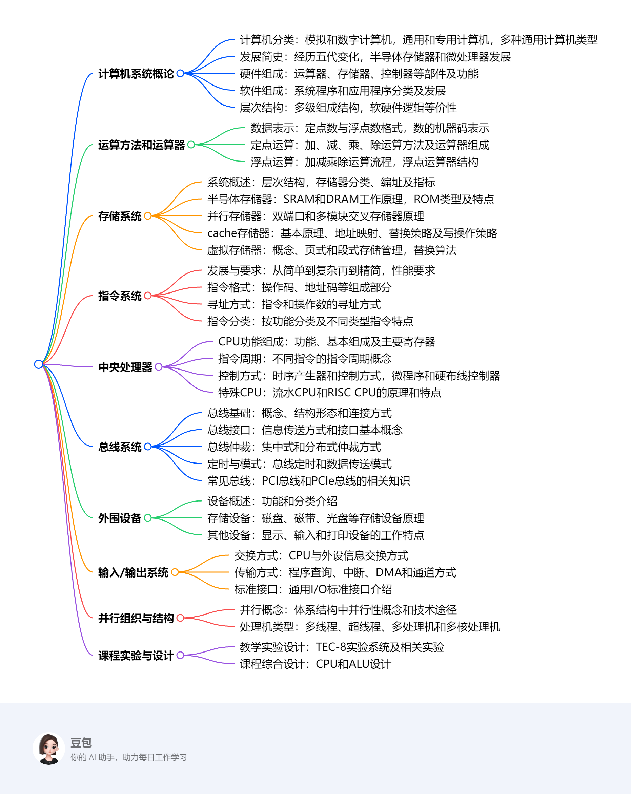

# 教材总览
该教材围绕计算机组成原理展开，系统全面地介绍了计算机的相关知识，具体内容如下：

1. **计算机系统概论**：阐述计算机的分类，介绍其发展简史，包括硬件、软件的概念和组成。同时，讲解计算机系统的层次结构，以及软件与硬件的逻辑等价性，使读者对计算机系统有整体认知。
2. **运算方法和运算器**：讲述计算机中数据与文字的表示方法，如定点数和浮点数的表示。详细介绍定点运算方法和浮点运算方法，以及定点运算器和浮点运算器的组成结构。
3. **存储系统**：讨论存储系统的基本概念，包括存储系统的层次结构、存储器的分类等。介绍半导体存储器的工作原理和接口方式，以及提高存储器访问性能的机制，如cache和虚拟存储器。
4. **指令系统**：说明指令系统的发展与性能要求，介绍指令的一般格式，包括操作码、地址码等。重点讲述寻址方式、指令的分类和功能，并给出指令系统实例。
5. **中央处理器**：介绍CPU的功能和组成，讲解指令周期、时序产生器和控制方式。详细阐述微程序控制器、硬布线控制器和流水CPU的工作原理，以及RISC CPU的特点和实例。
6. **总线系统**：讲解总线的概念、结构形态、接口、仲裁，以及总线的定时和数据传送模式。介绍常见的PCI总线和PCIe总线的相关知识。
7. **外围设备**：概述外围设备的功能和分类，介绍磁盘、磁带、光盘等存储设备，以及显示设备、输入设备和打印设备的工作原理和特点。
8. **输入/输出系统**：介绍CPU与外设之间的信息交换方式，包括程序查询方式、程序中断方式、DMA方式和通道方式。还介绍了通用I/O标准接口。
9. **并行组织与结构**：讲述体系结构中的并行性概念和提高并行性的技术途径，介绍多线程与超线程处理机、多处理机、多核处理机的相关知识和实例。
10. **课程教学实验设计**：以TEC-8实验系统平台为例，介绍模型计算机的结构、操作和指令系统，以及相关实验，如运算器组成实验、双端口存储器实验等。
11. **课程综合设计**：包括硬布线控制器的常规CPU设计和含有阵列乘法器的ALU设计，培养读者的综合设计能力。
