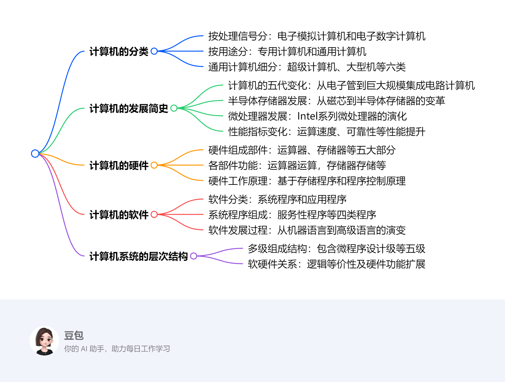

# 第一章：计算机系统概论
第1章主要介绍计算机系统的基本概念、组成部分、发展历程和性能指标等内容，为后续深入学习计算机组成原理奠定基础，具体如下：

1. **计算机的分类**：电子计算机分为电子模拟计算机和电子数字计算机，后者又可分为专用计算机和通用计算机。通用计算机进一步细分为超级计算机、大型机、服务器、PC机、单片机和多核机六类，它们在体积、性能、价格等方面存在差异。
2. **计算机的发展简史**：从使用器件的角度，计算机的发展经历了五代变化，运算速度、可靠性等性能不断提升。半导体存储器和微处理器也在不断发展，存储容量和处理能力不断提高。同时介绍了计算机的性能指标，如吞吐量、响应时间、利用率等。
3. **计算机的硬件**：由运算器、存储器、控制器、适配器和输入/输出设备等组成。运算器进行算术和逻辑运算，存储器保存数据和程序，控制器控制各部件工作，适配器用于连接外围设备，输入/输出设备实现人机交互。此外，还介绍了硬件组成要素和计算机的工作原理。
4. **计算机的软件**：分为系统程序和应用程序。系统程序包括服务性程序、语言程序、操作系统和数据库管理系统等，用于简化程序设计和提高计算机使用效率；应用程序是用户为解决特定问题而编制的程序。同时，讲述了软件的发展演变过程。
5. **计算机系统的层次结构**：通常由微程序设计级、一般机器级、操作系统级、汇编语言级和高级语言级组成，每一级都能进行程序设计。软件与硬件的逻辑等价性随着技术发展变得模糊，硬件功能范围不断扩大。 
