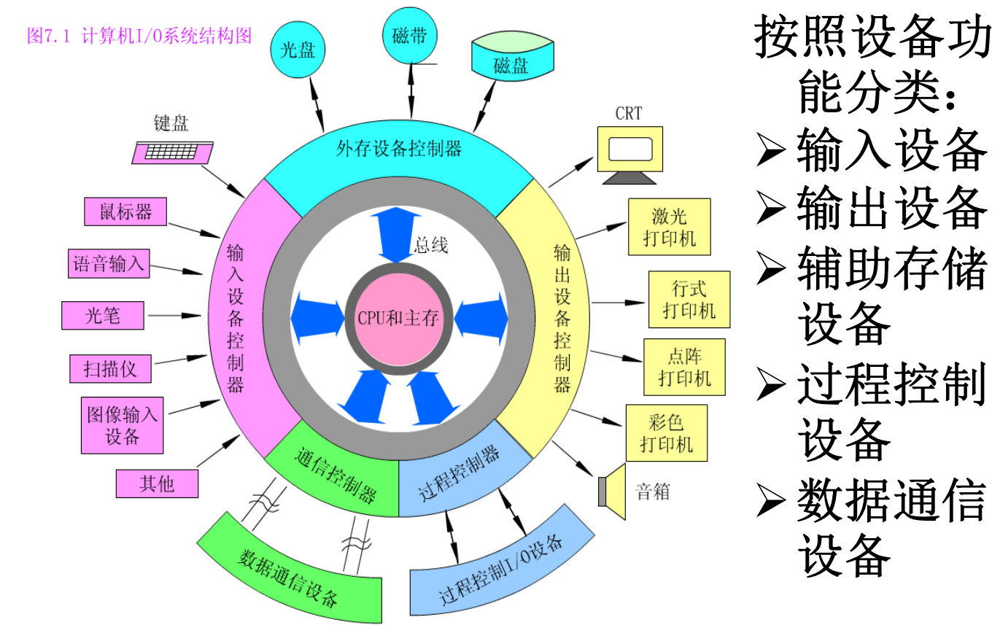

# 第七章：外围设备
## 7.1 外围设备概述
### 7.1.1 外围设备的一般功能
该节内容主要围绕计算机外围设备展开，涵盖其定义、发展状况、功能、组成部分，具体如下：

- **外围设备的定义**：**外围设备是指除CPU和主存外的计算机部件**，涉及范围广泛。
- **外围设备的发展状况**：20世纪末，主机与外围设备价格比为1∶6，反映出**外围设备发展重要但与主机发展尚不匹配**。尽管如此，外围设备仍快速发展，在指标上，不断采用新技术，朝着**低成本、小体积、高速、大容量、低功耗**方向发展；在结构上，从初级串行操作输入/输出方式，发展为有通道连接的多种外设并行操作方式；在种类上，从简单输入/输出装置，扩展到多种输入/输出装置、随机存取大容量外存、多种终端设备等；在性能上，信息交换速度大幅提高，输入输出形态除数字形式外，还包括直观的图像和声音等 。
- **外围设备的功能**：**在外围设备在计算机和其他机器之间、计算机与用户之间提供联系**，没有外围设备，计算机无法从外界接收信息，也不能对处理结果进行表达和反应。随着计算机发展和应用扩大，系统对外围设备类型需求增多，其智能化趋势愈发明显，尤其在多媒体技术出现后，未来外围设备将成为计算机真正的“五官四肢” 。
- **外围设备的组成**：一般由三个基本部分组成：
    - **存储介质**：具备保存信息的物理特征，例如磁盘通过盘上的磁化元来表示信息。
    - **驱动装置**：用于移动存储介质，如磁盘设备中，驱动装置可转动磁盘并进行定位。 
    - **控制电路**：负责向存储介质发送数据或从存储介质接收数据，例如磁盘读出时，控制电路将盘上磁化元表示的信息转换为计算机所需电信号，并通过电缆传送给主机。 
### 7.1.2 外围设备的分类

该节内容主要介绍了计算机外围设备的分类，以及其与主机的连接方式，具体如下：

- **外围设备的配备原则**：**一个计算机系统配备何种外围设备，由实际需求决定**，图7.1展示了典型的计算机环境中外围设备的配置情况。
- **计算机I/O系统结构**：中央是**CPU和主存**，通过系统总线与第二层的**适配器（接口）部件**相连，第三层为**各种外围设备控制器**，最外层是**外围设备** 。
- **外围设备的分类**：**外围设备可分为输入设备、输出设备、外存设备、数据通信设备和过程控制设备五大类**。
- **外围设备的工作与连接机制**：**每一种外围设备都在自身的设备控制器控制下工作**，而**设备控制器通过I/O接口与主机连接，并受主机控制** 。 
## 7.2 硬盘存储设备
### 7.2.1 磁记录原理
该节主要围绕磁记录原理展开，介绍了硬磁盘所属的磁表面存储设备相关知识，包括磁表面存储设备的特点、磁性材料特性、磁表面存储器读写原理等，具体内容如下：

- **磁表面存储设备概述**：**硬磁盘属于磁表面存储设备**，该类设备用磁性材料涂覆在金属或塑料表面作载磁体存储信息，如磁盘存储器、磁带存储器。其**优点**有：存储容量大且位价格低；记录介质可重复使用；信息能长期保存甚至脱机存档；非破坏性读出，无需再生信息。**缺点**在于存取速度慢、机械结构复杂、对工作环境要求高。磁表面存储器因容量大、成本低，在计算机系统中作为辅助大容量存储器，用于存放系统软件、大型文件等大量信息。
- **磁性材料的物理特性**：计算机存储设备使用的磁性材料具有矩形磁滞回线，被磁化后工作点在磁滞回线上。外加正向脉冲电流（磁场），电流消失后磁感应强度B处于**+Br状态（正剩磁状态）**；外加负向脉冲电流，B处于**-Br状态（负剩磁状态）**。利用这两个稳定剩磁状态可表示二进制代码1和0，规定+Br表示“1”，-Br表示“0” ，通过正负向脉冲电流使磁性材料正向或反向磁化，磁化元是记录二进制信息位的最小单位。
- **磁表面存储器的读写原理**：磁表面存储器通过“磁头”实现信息的写入和读出，磁头是由软磁材料做铁芯绕有读写线圈的电磁铁。
    - **写操作**：写线圈通一定方向脉冲电流，铁芯产生对应方向磁通，铁芯空隙处形成强磁场，使载磁体磁化形成磁化位或磁化元，不同方向电流对应不同极性磁化元，规定电流方向为写“1”，反向为写“0”，载磁体相对磁头运动可连续写入二进制信息。
    - **读操作**：磁头经过磁化元时，因磁头铁芯导磁，磁化元磁力线形成闭合回路，不同极性磁化元使铁芯磁通方向不同。磁头相对载磁体运动时，铁芯磁通变化使读出线圈感应出电动势e（\(e = -k\frac{d\phi}{dt}\) ），不同磁化状态感应电势方向不同，经读出放大器放大鉴别，可判断读出信息是“1”还是“0” 。
    - **总结**：磁表面存储器通过**电 - 磁变换写入信息**，即脉冲电流转换为载磁体不同剩磁状态；通过**磁 - 电变换读出信息**，即剩磁状态转换为电信号输出。存储元磁化后可多次读出，不需要时可全部抹去（写“0”），通常读写合用一个磁头，每个磁头对应一个信息记录磁道。 
### 7.2.2 磁盘的组成和分类
该节内容主要介绍了硬磁盘的组成、分类及工作原理，具体如下：

- **硬磁盘的组成**：**硬磁盘是记录介质为硬质圆形盘片的磁表面存储器**，主要由**磁记录介质、磁盘控制器、磁盘驱动器**三大部分组成。其中，磁盘控制器包含控制逻辑与时序、数据并 - 串变换电路和串 - 并变换电路；磁盘驱动器包括写入电路与读出电路、读写转换开关、读写磁头与磁头定位伺服系统等 。
- **硬磁盘的工作原理**：
    - **写入**：计算机并行送来的数据先在并 - 串变换寄存器变为串行数据，再由写电流驱动器功率放大后加到写磁头线圈产生电流，从而在盘片磁层上形成按位的磁化存储元。
    - **读出**：记录介质相对磁头运动时，位磁化存储元的空间磁场在读磁头线圈中产生感应电势，经放大检测还原成数据。由于数据串行读出，需在串 - 并变换寄存器变换为并行数据后，再并行送至计算机。
- **硬磁盘的分类**：
    - **按盘片结构分类**：可分成**可换盘片式**与**固定盘片式**两种。
    - **按磁头类型分类**：可分为**可移动磁头**和**固定磁头**两种。不同组合的磁盘机特点各异：
        - **可移动磁头固定盘片的磁盘机**：盘片固定在主轴上不可更换，每面一个磁头，存取数据时磁头沿盘面径向移动 。
        - **固定磁头磁盘机**：磁头位置固定，每个磁道对应一个磁头，盘片不可更换，优点是存取速度快，缺点是结构复杂。
        - **可移动磁头可换盘片的磁盘机**：盘片可更换，磁头可沿盘面径向移动，盘片能脱机保存且同种型号盘片具有互换性 。
        - **温切斯特磁盘机**：简称温盘，是采用先进技术的可移动磁头固定盘片的磁盘机，属于密封组合式硬磁盘，磁头、盘片等部件组装成不可随意拆卸的整体。工作时盘片高速旋转形成气垫浮起磁头，**其防尘性能好、可靠性高，对使用环境要求不高**，是最具代表性的硬磁盘存储器；而普通硬磁盘要求超净环境，仅用于大型计算机。常用温盘盘片直径有5.25英寸、3.5英寸、2.5英寸、1.75英寸等 。 
### 7.2.3 磁盘驱动器和控制器
该节主要介绍了磁盘驱动器和控制器的相关内容，具体如下：

- **磁盘驱动器**：磁盘驱动器是精密的电子和机械装置，温盘驱动器要求在超净环境下组装，各类磁盘驱动器基本结构相同，主要由**定位驱动系统、主轴系统和数据转换系统**组成。
    - **定位驱动系统**：在可移动磁头的磁盘驱动器中，用于驱动磁头沿盘面径向运动寻找目标磁道，由驱动部件、传动部件、运载部件（磁头小车）构成。磁盘存取数据时，磁头小车驱动磁头进入指定磁道中心并精确跟踪。目前磁头小车驱动方式主要有**步进电机**和**音圈电机**两种。步进电机靠脉冲信号驱动，控制简单，为开环控制，定位精度低，常用于道密度不高的硬磁盘驱动器；音圈电机是线性电机，可直接驱动磁头做直线运动，为闭环控制系统，驱动速度快、定位精度高，用于较先进的磁盘驱动器。
    - **主轴系统**：主要作用是安装盘片，并驱动盘片以额定转速稳定旋转，主要部件包括主轴电机和有关控制电路。
    - **数据转换系统**：用于控制数据的写入和读出，包含磁头、磁头选择电路、读写电路以及索引、区标电路等 。
- **磁盘控制器**：是主机与磁盘驱动器之间的接口，由于磁盘存储器是高速外存设备，与主机采用成批交换数据方式。磁盘控制器有两个方面的接口：
    - **系统级接口**：与主机相连，控制外存与主机总线之间交换数据 。
    - **设备级接口**：与磁盘设备相连，根据主机命令控制设备操作。
    - 磁盘上的信息经读磁头读出后，依次经过读出放大器、数据与时钟分离、串 - 并变换、格式变换，存入数据缓冲器，再经DMA控制传送到主机总线。目前磁盘控制器的功能全部转移到设备中，主机与设备之间采用如**SCSI接口（小型计算机系统接口）**等标准通用接口，使设备相对独立。 
### 7.2.4 磁盘上信息的分布
该节主要介绍了磁盘上信息的分布情况，涵盖记录面、磁道、扇区的定义，磁盘地址的组成，信息存储与读写相关概念，以及数据在磁盘上的记录格式，具体如下：

- **磁盘结构基本概念**：
    - **记录面**：盘片的上下两面都能记录信息，磁盘片表面被称为**记录面** 。
    - **磁道**：记录面上一系列同心圆称作**磁道**，每个盘片表面通常有几百到几千个磁道。磁道编址从外向内依次编号，最外为**0磁道**，最里面的为**n磁道**，n磁道里面的圆面积不用于记录信息 。
    - **扇区**：每个磁道又分为若干个**扇区**，外面扇区比里面扇区面积大。扇区编号方式多样，可连续编号或间隔编号。磁盘上磁道和扇区的排列方式称为**格式**。
- **磁盘地址组成**：磁盘经编址后，可用“n磁道m扇区”找到对应记录区。对于**活动头磁盘组**，磁盘地址由**记录面号（磁头号）、磁道号和扇区号**三部分组成，其中记录面号用于明确处理的是哪个记录面 。
- **信息存储与读写**：
    - **存储**：在磁道上，信息按**区**存放，每个区存放一定数量字或字节，且各个区存放数量相同 。
    - **读写**：磁盘存储器以**扇区**为单位进行读/写操作，每个扇区记录一个记录块。为确定磁道起始位置，引入**索引**概念，索引标志在传感器检索下产生脉冲信号，经磁盘控制器处理后可确定磁道起始位置 。
- **数据记录格式**：每个扇区开始时，磁盘控制器产生**扇标脉冲**，标志一个扇区开始，两个扇标脉冲间的磁道区域为一个扇区（记录块）。每个记录块由**头部空白段、序标段、数据段、校验字段及尾部空白段**组成。其中，空白段用于磁盘控制器读写准备；序标作为同步定时信号；数据段存放本扇区记录的数据；校验字段用于校验读出数据是否正确 。 
### 7.2.5 磁盘存储器的技术指标
该节主要介绍了磁盘存储器的技术指标，包括存储密度、存储容量、存取时间及数据传输率，具体内容如下：

- **存储密度**：存储密度分为**道密度、位密度和面密度**。道密度指沿磁盘半径方向单位长度上的磁道数，单位为道/英寸；位密度是磁道单位长度上能记录的二进制代码位数，单位为位/英寸；面密度是位密度和道密度的乘积，单位为位/英寸²。
- **存储容量**：磁盘存储器所能存储的字节总数即为存储容量，分为**格式化容量和非格式化容量**。格式化容量是按特定记录格式可存储信息的总量，是用户实际可用容量；非格式化容量是磁记录表面可利用的磁化单元总数。格式化容量一般是非格式化容量的60% - 70%，3.5英寸硬盘容量可达数十TB 。
- **平均寻址时间**：寻址时间是从读写命令发出后，磁头移动至新记录位置，到所需扇区移到磁头下方的时间，包括**寻道时间和等待时间**。寻道时间是磁头定位至目标磁道的时间；等待时间是目标扇区移到磁头下方的时间。通常用平均值表示，平均寻道时间是最大与最小寻道时间的平均值，一般小于10ms；平均等待时间与磁盘转速有关，为磁盘旋转一周时间的一半，若磁盘旋转速率为r转/秒，则平均等待时间为1/(2r) 。
- **平均存取时间**：存取时间是从读/写指令发出到开始第一笔数据读/写的平均时间，包括寻道时间、等待时间及内务操作时间（一般约0.2ms，可忽略），故**平均访问时间近似等于平均寻道时间 + 平均等待时间（即平均寻址时间）**。总的平均读写操作时间Ta = Ts + 1/(2r) + b/(rN)，其中Ts为平均寻道时间，b为传送字节数，N为每磁道字节数，b/(rN)为数据传输时间 。
- **数据传输率**：磁盘存储器单位时间内向主机传送数据的字节数。分为**外部数据传输率和内部数据传输率**。外部数据传输率是单位时间内从硬盘cache向主机传送的数据量，与磁盘接口类型和缓存大小有关；内部数据传输率是磁头找到访问位置后，单位时间读/写的字节数，等于每个磁道字节数/磁盘旋转一周时间。若磁盘旋转速度为n转/秒，每条磁道容量为N字节，则内部数据传输率Dr = nN（字节/秒）或Dr = D·v（字节/秒），其中D为位密度，v为磁盘旋转线速度，磁盘存储器数据传输率可达几十兆字节/秒 。
- **例题**：通过具体例题，对磁盘存储器的柱面数、总存储容量、内部数据传输率等指标进行计算，并介绍了采用定长数据块记录格式时直接寻址的最小单位为一个记录块（扇区）及磁盘地址表示格式，还说明了文件长度超一个磁道容量时，记录在同一柱面可提高读/写速度 。 
### 7.2.6 磁盘 cache
该节内容围绕磁盘cache展开，从概念与原理两方面进行介绍，具体内容如下：

- **磁盘cache的概念**：**由于CPU和主存速度增长快，磁盘驱动器存取时间仍为毫秒级，导致磁盘I/O系统成为系统瓶颈**。为减少存取时间，可采取提高磁盘机主轴转速、I/O总线速度及采用磁盘cache等措施。磁盘cache的作用与主存和CPU之间的高速缓存cache类似，**是为了弥补慢速磁盘和主存之间速度上的差异**。
- **磁盘cache的原理**：
    - **cache行与数据读写**：磁盘cache中由数据块组成的基本单位称为cache行。当有I/O请求时，若为读操作且数据在cache中则命中，可直接读取，否则从磁盘介质读取；写入操作和CPU中的cache类似，有“直写”和“写回”两种方法 。
    - **原理依据与预读策略**：磁盘cache利用被访问数据的**空间局部性（当某些数据被存取时，其附近数据可能很快被存取）**和**时间局部性（数据被存取后，不久可能再次存取）**原理。基于此，大多数磁盘驱动器采用预读策略，将可能读入的数据预先放到磁盘cache中。
    - **与CPU cache的区别**：CPU的cache存取时间小于10ns，命中率95%以上，全由硬件实现；而磁盘cache一次存取数量大、数据集中、速度要求较低、管理复杂，**一般由硬件和软件共同完成**，cache采用SRAM或DRAM。 
### 7.2.7 磁盘阵列 RAID
该节内容主要围绕磁盘阵列RAID展开，详细介绍了其定义、起源、标准分级以及RAID 0级的具体情况，具体如下：

- **RAID的定义与原理**：RAID最初称作**廉价冗余磁盘阵列**，后改为**独立冗余磁盘阵列**，是由多台磁盘存储器构成的大容量外存系统。它基于**数据分块技术和并行处理技术**，在多个磁盘上交错存放数据实现并行存取。在RAID控制器管理下，能实现数据的**并行存储、交叉存储、单独存储**。因阵列部分磁盘存有**冗余信息**，当某一磁盘失效时，可利用冗余信息重建用户数据。
- **RAID的起源与应用**：1988年由**美国加州大学伯克利分校研究小组提出**，设计理念是用多个小容量磁盘替代一个大容量磁盘，通过分布数据同时从多个磁盘存取数据，从而**改善I/O性能、增加存储容量**，现已应用于超级或大型计算机中。
- **RAID的标准分级**：工业上制定的RAID标准分为7级（RAID 0 - RAID 6），这些级别并非层次关系，而是针对**不同存储容量、可靠性、数据传输能力、I/O请求速率等应用需求**。
- **RAID 0级介绍**：**RAID 0级未采用奇偶校验等冗余技术**，更注重低成本而非可靠性，适用于**高速数据传输和高速I/O请求**。用户和系统数据分布在阵列所有磁盘上，相比单个大容量磁盘，其优势在于**可并行处理两个不同磁盘上的数据块请求，减少I/O排队时间**。此外，所有数据看作逻辑条带存于逻辑磁盘，实际物理磁盘也划分为条带，数据条带以轮转方式映射到阵列磁盘，若单个I/O请求由多个逻辑相邻条带组成，**最多可并行处理n个条带请求，大幅减少I/O传输时间**（n为磁盘阵列中的磁盘数量）。 
### 7.2.8 固态盘
该节内容主要介绍固态盘（SSD）的特性、组成结构及核心技术，重点围绕**NAND闪存固态盘**展开，具体总结如下：  
#### **一、固态盘概述**  
**定义与定位**：  

- 作为**机械硬盘的替代方案**，接口和使用方式与机械硬盘兼容，可平滑替换。  
- 核心特点：采用**半导体存储器件（NAND闪存或DRAM）**替代磁介质，本书重点介绍**NAND闪存固态盘**。  

**优势**：  

- **无机械部件**：无传动装置，具备**防震抗摔、无噪音、体积小、质量轻**等特性，适合移动场景。  
- **性能提升**：读写速度显著快于机械硬盘，无机械故障风险。  

**缺点**：  

- **成本较高**：相同容量下价格高于机械硬盘。  
- **容量限制**：单盘容量较小，数据恢复难度大。  
#### **二、固态盘的组成结构**  
固态盘主要由**存储矩阵、缓存、主控单元**三部分组成：  

1. **存储矩阵**  
   - **构成**：由多个**NAND闪存芯片（颗粒）**组成，是数据存储的核心。  
   - **闪存类型**：  
     - **SLC（单层单元）**：每个单元存1比特，**可靠性高、成本高**，适用于企业级场景。  
     - **MLC（双层单元）**：每个单元存2比特，成本与可靠性折中。  
     - **TLC（三层单元）、QLC（四层单元）**：存储密度更高、成本更低，适合消费级产品（如U盘、家用SSD）。  
   - **技术演进**：从**二维平面闪存**发展为**三维NAND（3D NAND）**，通过垂直堆叠数百层单元提升密度，解决干扰问题，增强可靠性。  

2. **缓存**  
   - **作用**：类似磁盘cache，通过配置**DRAM**作为读写缓存，提升访问速度。  
   - **原理**：NAND闪存按页读取、按块擦除，且擦除寿命有限。缓存可优化小文件读写性能，**延长固态盘寿命**。  

3. **主控单元**  
   - **定位**：固态盘的**智能控制核心**，集成处理器和固件，属于嵌入式系统。  
   - **功能**：  
     - 协调多个闪存颗粒并行工作，实现类似**RAID的并行存储功能**。  
     - 数据管理与中转、接口交互控制，提供**错误校正（ECC）**以增强可靠性。  
     - 主控性能直接影响固态盘的整体速度和稳定性。  
#### **三、闪存转换层（FTL）**  
**定义**：管理固态盘操作的软件层，核心任务是将主机的读写请求映射到闪存芯片，通常运行于主控单元。  

**核心功能**：  

1. **地址映射**：  
   - 主机通过**逻辑地址**访问固态盘，FTL将其转换为闪存的**物理地址（块号、页号等）**，屏蔽底层存储细节。  

2. **数据校验与坏块管理**：  
   - NAND闪存可能存在**坏块**（编程/擦除时失效的块），通过**空闲字节**存储纠错码（ECC）和标志信息。  
   - 标记坏块并启用备用区域，确保有效容量小于颗粒总容量。  

3. **磨损均衡**：  
   - 闪存**擦除次数（PE次数）有限**，通过均衡数据分布，使各块擦除次数相近，避免局部过度磨损，延长寿命。  
   - 优化策略：合并写入请求，减少擦除频率。  

4. **垃圾回收**：  
   - 写入前需擦除块，删除数据仅标记为无效（不立即擦除）。  
   - 当空间不足时，迁移有效数据至空闲块，擦除原块以释放空间，提升存储效率。  

**其他功能**：接口适配、数据压缩、加密、读干扰处理、掉电恢复等。  
#### **总结**  
固态盘通过**半导体存储技术**突破机械硬盘的性能瓶颈，其核心依赖**NAND闪存颗粒的类型与工艺**（如3D NAND）、**主控单元的智能调度**及**闪存转换层的算法优化**。尽管存在成本和容量限制，但其高性能、低功耗和抗冲击特性使其成为主流存储方案，尤其在移动设备和高性能计算场景中优势显著。
## 7.3 光盘和磁光盘存储设备
### 7.3.1 光盘存储设备
### 7.3.2 磁光盘存储设备
## 7.4 显示设备
### 7.4.1 显示设备的分类与有关概念
### 7.4.2 字符/图形显示器
### 7.4.3 图像显示设备
### 7.5 输入设备和打印设备
### 7.5.1 输入设备
### 7.5.2 打印设备