# 第三章：储存系统
## 3.1 存储系统概述
### 3.1.1 存储系统的层次结构
#### 1.程序局部性原理
该部分内容主要介绍了程序的局部性原理，具体如下：

 - **原理定义**：程序的局部性原理是指在较短时间间隔内，程序访问的存储器地址大多集中在地址空间的小范围内，对该范围外的地址访问较少。
 - **两个角度分析**
    - **时间局部性**：表现为最近被访问的信息再次被访问的可能性很大。例如，在一个循环程序中，循环体内的指令和数据会被反复访问，这就是时间局部性的体现。这是因为在程序的执行过程中，一些数据和指令会被频繁使用，所以它们在短时间内有较高的再次被访问概率。
    - **空间局部性**：意味着最近被访问信息的邻近地址的信息也可能被访问 。比如，当程序访问数组时，通常会按顺序访问数组中的元素，这些元素在内存中是相邻存储的，访问了一个元素后，其邻近元素很可能也会被访问。这是由于程序在处理数据时，往往具有一定的连续性，会对相邻的存储单元进行操作。

程序的局部性原理是计算机存储系统设计的重要依据，为多级存储系统的构建提供了理论基础，通过利用这一原理，可以提高存储系统的性能和效率。 
#### 2.多级存储系统的组成
该节内容主要介绍了多级存储系统的组成，具体内容如下：

1. **两级存储系统**：CPU内部寄存器访问速度快但数量少。内存储器（主存）速度高、容量小、价格高，由半导体器件构成，用于存储正在执行程序的指令和数据，是CPU能直接访问的狭义存储器。外存储器（辅存）容量更大、速度稍慢、价格便宜，由磁盘、光盘等非半导体器件或固态半导体存储器构成 。CPU不能直接访问外存，外存信息需调入内存后才能被CPU处理，内、外存储器构成两级存储系统。
2. **三级存储系统**：随着半导体技术发展，CPU速度提升比内存储器更快，为解决速度匹配问题，在常规内存储器（主存）与CPU之间增加了高速缓冲存储器（cache），它速度更高、容量更小，用于存放主存中正在使用的信息块副本 。至此，内存储器分为cache和主存两部分，构成三级存储系统。在这个系统中，cache提升访问速度以匹配CPU运算速度，外存解决存储容量问题，主存容纳系统核心软件和用户程序。三级存储系统旨在提高存储系统的性能/价格比，让整个系统在速度上接近cache，容量和价格上接近外存。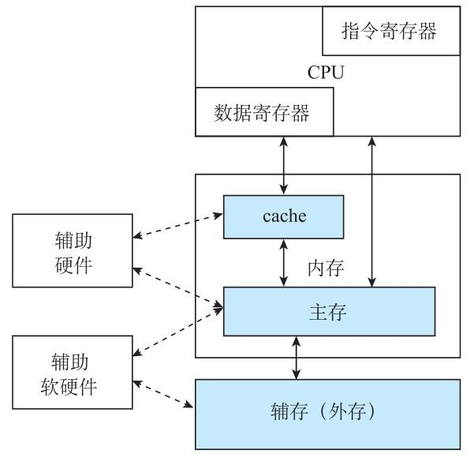
3. **多级存储系统的扩展**：对性能要求更高的系统，cache可进一步分为一级（L1）cache和二级（L2）cache等更多级；对存储容量要求更多的系统，还可用磁带等可更换介质实现更大容量存储。由cache、主存、磁盘和磁带构成的多级存储体系，存储容量和存储密度逐级提升，访问速度和价格逐级降低，呈金字塔式存储结构。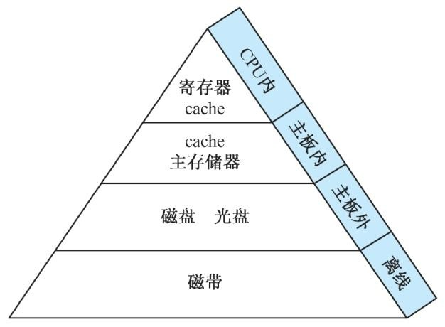
### 3.1.2 存储器的分类
该部分内容主要介绍了存储器的存储介质、分类方法以及不同类型存储器的特点，具体如下：

1. **存储介质**：构成存储器的存储介质主要有半导体器件和磁性材料，一个双稳态半导体电路、CMOS晶体管或磁性材料的存储元都能存储一位二进制代码，这就是存储位元。多个存储位元组成存储单元，众多存储单元构成存储器 。存储介质需有两种明显区别的物理状态来表示0和1，其存取速度取决于物理状态的改变速度。当前使用的存储介质包括半导体器件、磁性材料和光存储器，基于这些介质构成的存储器分别为半导体存储器、磁表面存储器（如磁盘、磁带）和光存储器（只读光盘、读写光盘），磁盘和光盘存储容量大且信息不易丢失。
2. **分类方法及对应类型特点**
    - **按存取方式分类**：随机存取存储器的任何存储单元内容都能被随机存取，且存取时间与存储单元物理位置无关；顺序存取存储器只能按某种顺序存取，存取时间与物理位置有关，如磁带存储器；磁盘存储器是半顺序（直接）存取存储器，沿磁道方向顺序存取，垂直半径方向随机存取。
    - **按读写功能分类**：只读存储器（ROM）在工作过程中只能读出不能写入；读写存储器或随机存取存储器（RAM）既能读出又能写入。
    - **按信息易失性分类**：断电后信息消失的是易失性存储器，如半导体存储器中的RAM；断电后仍能保存信息的是非易失性存储器，像ROM和磁性材料做成的存储器。
    - **按与CPU的耦合程度分类**：可分为内部存储器和外部存储器，内存又可细分为主存和高速缓冲存储器。主存通常分为RAM和ROM两类，RAM用于储存当前运行的程序和数据，可在程序运行中更改内容，根据信息储存方法又分为静态RAM（SRAM）和动态RAM（DRAM），SRAM靠半导体管的“导通”或“截止”记忆信息，不掉电信息就不会丢失，DRAM则是用电荷储存在电容上，需周期性“刷新” ；ROM常用来储存不变或基本不变的程序和数据，如监控程序等。只读存储器根据工艺和特性不同，还可分为掩膜ROM、一次可编程ROM（PROM）和可擦除PROM（EPROM），其中EPROM又包括紫外线擦除EPROM（UV-EPROM）、电擦除EPROM（EEPROM或E²PROM）和闪速（Flash）只读存储器。 
### 3.1.3 存储器的编址和端模式
该节主要介绍了存储器的编址方式和端模式，具体内容如下：

1. **编址方式**：编址方式是存储器地址的组织方式，在设计处理器时就已确定，分为按字编址和按字节编址。存放一个机器字的存储单元叫**字存储单元**，其地址为**字地址**；存放一字节的单元叫**字节存储单元**，其地址为**字节地址**。若计算机编址的最小单位是字存储单元，就是按字编址的计算机；若最小单位是字节，则为按字节编址的计算机。由于一个机器字可能包含多个字节，所以按字节编址时，一个存储单元会占用数个可单独编址的字节地址，如16位二进制的字存储单元包含两字节，采用字节编址时就占两字节地址。
2. **端模式**：当存储字的字长高于八位时，存储字内部多字节的排列顺序就是**端模式**。主要有大端模式和小端模式：
    - **大端模式**：将一个字的高有效字节放在内存的低地址端，低有效字节放在内存的高地址端。例如，32位数\((0A0B0C0D)_{16}\)按大端模式存放时，最低地址存放\((0A)_{16}\)，最高地址存放\((0D)_{16}\)。
    - **小端模式**：与大端模式相反，将一个字的低有效字节放在内存的低地址端，高有效字节放在内存的高地址端。如上述32位数按小端模式存放时，字节顺序与大端模式相反。
常用的英特尔64系列处理器采用小端模式，ARM系列处理器默认采用小端模式，但能在程序中切换大小端模式。

3. **寻址宽度**：许多处理器允许CPU每次访问存储器时，根据需求动态确定读写的信息量大小，进而选择不同的寻址宽度，如**字寻址**每次访存读写一个存储字，**半字寻址**每次访存读写半个存储字，**字节寻址**每次访存读写一字节。 
### 3.1.4 存储器的技术指标
该节主要介绍了内存储器的性能指标，包括存储容量、存取速度（通过存取时间、存储周期和存储器带宽描述），具体内容如下：

1. **存储容量**：指一个存储器中可存储的信息比特数，用于衡量存储器能存储数据的多少。常用比特数（bit）、字节数（B）表示，也会使用KB、MB、GB、TB等单位，它们的换算关系为**1KB = \(2^{10}\)B**，**1MB = \(2^{20}\)B**，**1GB = \(2^{30}\)B**，**1TB = \(2^{40}\)B** 。为清晰展示存储器组织结构，存储容量还可表示为**存储字数（存储单元数）×存储字长（每单元的比特数）**。例如，1Mbit容量的存储器有多种组织形式，如1M×1bit、128K×8bit、512K×4bit 。
2. **存取时间**：也叫存储器访问时间，是从存储器接收到读/写命令开始，到信息被读出或写入完成所需的时间。这一指标取决于存储介质的物理特性和寻址部件的结构，不同的存储介质和寻址方式会使存取时间有所不同 。
3. **存储周期（存取周期）**：是存储器连续读写过程中一次完整存取操作所需的时间，也就是CPU连续两次访问存储器的最小间隔时间。通常情况下，存储周期略大于存取时间，这是因为在一次存取操作完成后，存储器需要一些时间来为下一次操作做准备 。
4. **存储器带宽（数据传送速率，频宽）**：表示单位时间里存储器所存取的信息量，常用位/秒或字节/秒作为度量单位。若已知系统的总线宽度为W位，那么存储器带宽的计算公式为**带宽 = W/存取周期(bit/s)** ，该指标反映了存储器的数据传输能力。 
## 3.2 静态随机存取存储器
### 3.2.1 基本的静态存储元阵列
该节主要介绍了基本的静态随机存取存储器（SRAM）元阵列，内容如下：

1. **存储元特性**：SRAM使用**锁存器（触发器）**作为存储元，在直流供电电源持续作用时，能无限期保持记忆的1状态或0状态，但断电后存储的数据会丢失。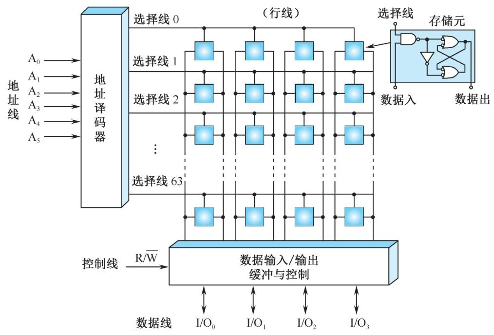
2. **与外部连接的信号线**
    - **地址线**：文中示例有6条地址线（A0 - A5），通过这些地址线可指定存储器的容量，此例中存储器容量为**2⁶ = 64个存储单元**，地址线的数量决定了存储单元的数量。
    - **数据线**：该例中有4条数据线（I/O0 - I/O3） ，这表明存储器的**字长为4位**，存储位元总数是存储单元数（64）与字长（4位）的乘积，即**64×4 = 256**，数据线的数量体现了每次能传输的数据位数。
    - **控制线**：有R/W控制线，通过它的电平状态来指定对存储器进行读操作（**R/W高电平**）还是写操作（**R/W低电平**） ，且读写操作不能同时进行。
3. **地址译码器的作用**：地址译码器输出64条选择线（行线），其功能是打开每个存储位元的输入与非门。当外部输入数据为1时，对应的锁存器会记忆1；当外部输入数据为0时，锁存器记忆0 ，从而实现数据的存储。 
### 3.2.2 基本的SRAM 逻辑结构
该节主要介绍了目前SRAM芯片采用的双译码方式，以及32K×8位SRAM的逻辑结构和控制信号，具体内容如下：

1. **双译码方式**：目前SRAM芯片采用**双译码方式**来组织更大的存储容量。这种方式将地址分成x向、y向两部分，先进行第一级的x向（行译码）和y向（列译码）独立译码，再在存储阵列中完成第二级交叉译码 。数据宽度有1位、4位、8位等多种情况。
2. **32K×8位SRAM的逻辑结构**：以存储容量为32K×8位的SRAM为例，它有15条地址线 ，其中**x方向8条（A0～A7）**，经行译码输出256行；**y方向7条（A8～A14）**，经列译码输出128列，存储阵列为256行×128列×8位的三维结构。还有8条双向数据线（I/O0～I/O7） ，写入时8个输入缓冲器打开、输出缓冲器关闭，数据写入存储阵列；读出时则相反，8个输出缓冲器打开、输入缓冲器关闭，数据从存储阵列读出到I/O数据线上。 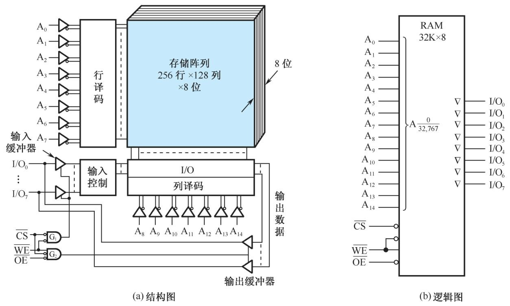
3. **控制信号**：该SRAM的控制信号包括**片选信号CS**、**读出使能信号OE**和**写命令WE**。当**CS有效（低电平）**时，门G1、G2均打开；**OE有效（低电平）**且**WE =1（高电平）**时，门G1关闭，存储器进行读操作；写操作时，**WE =0**，门G1开启，门G2关闭。门G1和G2互锁，确保读时不写、写时不读。 
### 3.2.3 SRAM 读/写时序
该节主要围绕SRAM读/写周期波形图，介绍了SRAM工作时的时间关系，具体内容如下：

1. **读周期**：SRAM读周期工作时，**地址线**会率先有效，其目的是进行地址译码，从而选中特定的存储单元。随后，为了能成功读出数据，**片选信号CS**和**读出使能信号OE**都必须有效，即从高电平变为低电平。从地址有效开始，经过**tAQ（读出）时间**后，数据总线I/O上就会出现有效的读出数据。当数据读出后，**CS、OE信号**会恢复高电平，并且要在**tRC**时间之后，地址总线才允许发生改变，这里的**tRC时间**就是读周期时间，它反映了完成一次读操作所需的完整时间间隔 。
2. **写周期**：在SRAM的写周期，同样是**地址线**先有效，紧接着**片选信号CS**有效，然后**写命令WE**有效（处于低电平） 。在写命令有效期间，数据总线I/O上必须放置要写入的数据，并且会在**tWD时间段**将数据写入存储器。完成数据写入操作后，需要撤销**写命令WE**和**片选信号CS** 。为确保写入数据的可靠性，I/O线的写入数据需要有**维持时间thD**，而且**CS的维持时间**相比读周期要更长。这里的**tWC时间**被称为写周期时间，在实际控制中，为了方便管理，一般会使**tRC = tWC**，这个时间通常被称作**存取周期**，它综合涵盖了读操作和写操作的时间周期。 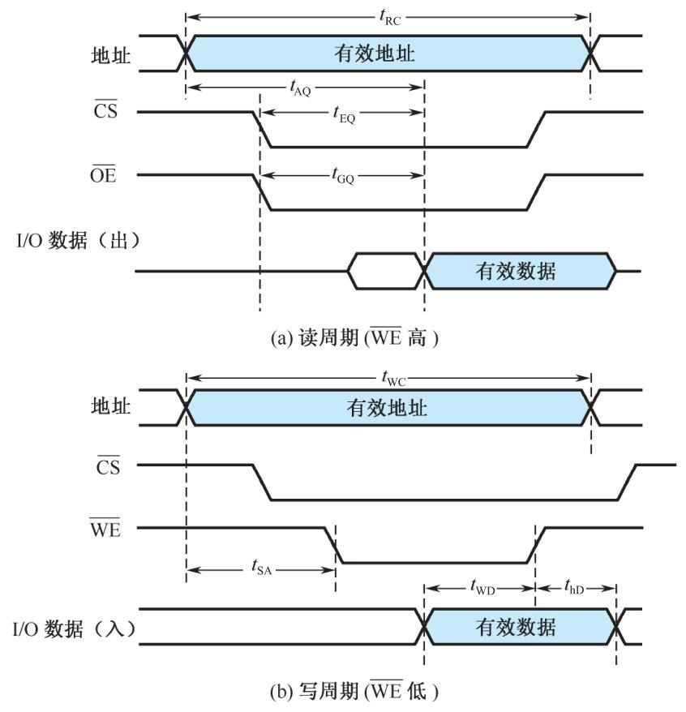
### 3.2.4 存储器容量的扩充
该节主要介绍了在单个存储器芯片容量无法满足系统需求时，通过组合多片芯片扩大存储容量的三种方法，具体内容如下：

1. **芯片扩展的需求及计算方法**：当单个存储器芯片容量不足时，需将多片芯片组合使用。所需芯片数量的计算方法为：**d = 设计要求的存储器容量/已知芯片存储容量**。 
2. **位扩展**：若给定芯片的字数（地址数）符合设计要求，但位数较短，不能满足存储器字长要求时，采用位扩展方法。此时，让多片芯片并行工作，三组信号线中地址线和控制线共用，数据线单独分开连接 。例如，用多片1M×4位的SRAM芯片设计1M×8位的SRAM存储器，根据公式计算需2片芯片，连接时地址线、控制线共用，数据线分高4位、低4位分别与两片芯片的I/O端相连，使两片芯片同时工作。 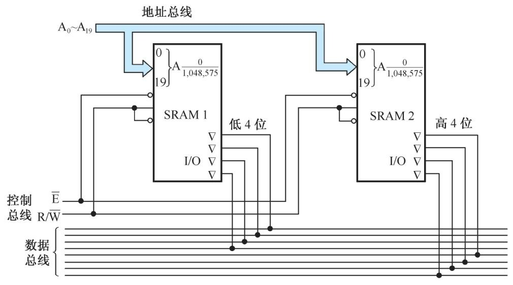
3. **字扩展**：当给定芯片存储容量较小（字数少），不满足设计要求的总存储容量时，进行字扩展。这种方式下，多片芯片分时工作，给定芯片的地址总线、数据总线和读写控制信号线共用，由地址总线的高位译码产生片选信号来控制各个芯片分时工作 。比如，利用256K×8位的SRAM芯片设计2048K×8位的存储器，经计算需8片芯片，8个芯片的数据总线和读写控制信号线共用，地址总线中A17 - A0同时连到各芯片片内地址输入端，A20 - A18通过三 - 八线译码器产生8个片选信号，控制8个芯片分时工作。 
4. **字位扩展**：若给定芯片的字数和位数都不符合要求，则先进行位扩展，再进行字扩展 ，以此满足设计对存储容量和字长的要求。 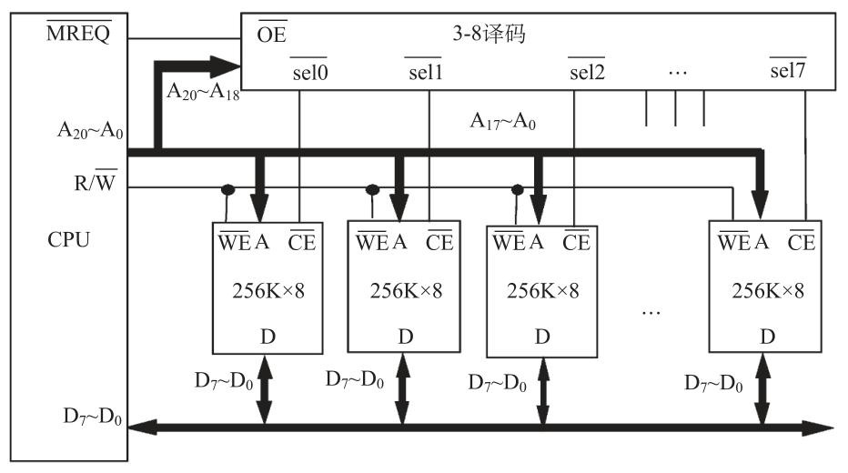
## 3.3 动态随机存取存储器
### 3.3.1 DRAM 存储元的工作原理
该节主要介绍了动态随机存取存储器（DRAM）存储元的工作原理，包括其结构、读写及刷新操作，以及与SRAM的对比，具体如下：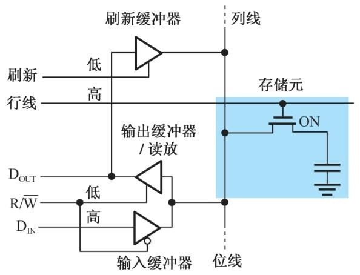

1. **DRAM存储元结构及信息存储方式**：DRAM通常用作计算机主存储器，其存储元结构较SRAM更为简化，由一个**MOS晶体管**和**电容器**组成单管记忆电路。通过电容器上的电荷量来表示存储的信息，**电容器充满电荷时代表存储1，放电无电荷时代表存储0**。
2. **DRAM的写入操作**：写入时，相关缓冲器状态会根据写入数据进行调整。写1时，**输出缓冲器、刷新缓冲器关闭，输入缓冲器打开（R/W为低）**，输入数据DIN = 1送到位线，同时**行选线为高**打开MOS管，使位线高电平给电容器充电来存储1；写0时，同样关闭输出和刷新缓冲器，打开输入缓冲器，输入数据DIN = 0送到位线，行选线为高打开MOS管，使电容放电存储0。
3. **DRAM的读出操作及刷新**：读出时，**输入缓冲器和刷新缓冲器关闭，输出缓冲器/读放打开（R/W为高）**，行选线为高打开MOS管。若存储信息为1，电容上的1送到位线，经输出缓冲器/读出放大器发送到DOUT。由于读出过程会破坏电容上的信息，所以读出后需要重新写入进行**刷新**。例如读出1后，输入缓冲器关闭，刷新缓冲器打开，输出缓冲器/读放打开，将读出的数据再写回电容。
4. **DRAM与SRAM的对比**：与SRAM相比，DRAM存储元所需元件更少，因此**存储密度更高**。但DRAM的附属电路更为复杂，在访问时需要额外的电路和操作支持。 
### 3.3.2 DRAM 芯片的逻辑结构
该节主要介绍了1M×4位DRAM芯片的逻辑结构，重点说明了与SRAM的不同之处以及地址传送方式，具体内容如下：

1. **DRAM芯片的引脚和逻辑结构图示**：通过图3.10(a)展示了1M×4位DRAM芯片的外部引脚图，图3.10(b)呈现了其逻辑结构图，为理解芯片的工作原理提供直观参考。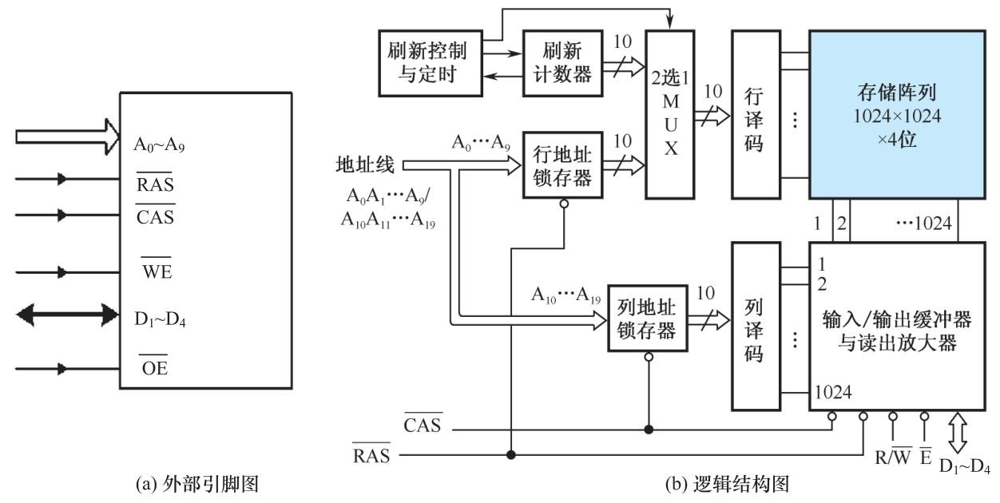
2. **与SRAM的区别及原因**：DRAM芯片与SRAM不同，增加了**行地址锁存器**和**列地址锁存器** 。这是因为DRAM容量大，地址线数目多，为减少芯片引脚数量，采取将地址分为行、列两部分分时传送的方式。
3. **地址传送方式**：对于存储容量为1M字的该芯片，共需20位地址线，但芯片地址引脚只有10位。具体操作是先传送**行地址码A0～A9**，由**行选通信号RAS**将其打入到行地址锁存器；之后传送**列地址码A10～A19**，由**列选通信号CAS**将其打入到列地址锁存器 。此外，片选信号的功能由新增的RAS和CAS信号实现。这种设计使得DRAM在保证大容量存储的同时，有效减少了芯片引脚数量，优化了芯片的物理结构和性能。 
### 3.3.3 DRAM 读/写时序
该节内容主要介绍了DRAM的读/写周期波形及时序特点，具体如下：

1. **DRAM读周期**：在DRAM读周期中，首先是**地址线上行地址有效**，随后**行选通信号RAS**将行地址打入行地址锁存器 。之后，地址线上传送**列地址**，并由**列选通信号CAS**将列地址打入列地址锁存器。经过行、列地址译码，当**读/写命令R/W =1（高电平表示读）**时，数据线上就会出现输出数据，完成数据读取操作。
2. **DRAM写周期**：在写周期，**读/写命令R/W =0（低电平表示写）** ，在此期间，需要在数据线上送入欲写入的数据**DIN（1或0）**，从而实现数据的写入。
3. **读/写周期时间**：每个读周期或写周期是从**行选通信号RAS下降沿**开始，到下一个**RAS信号的下降沿**为止的时间，这个时间间隔也就是连续两个读/写周期的时间间隔。在实际应用中，为了控制方便，通常会使读周期和写周期时间相等。 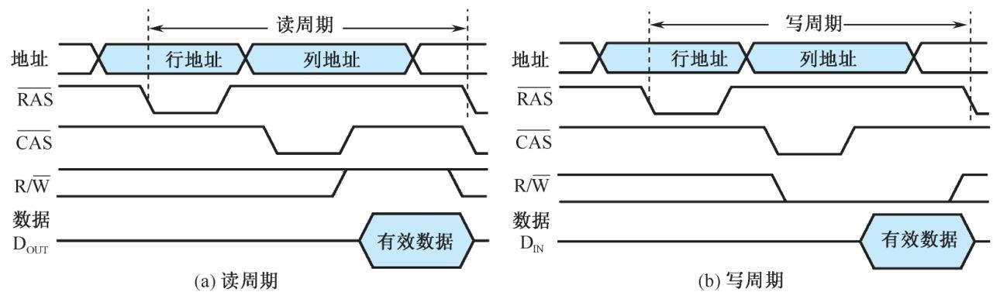
### 3.3.4 DRAM 的刷新操作
该节主要介绍了DRAM的刷新操作，包括刷新的原因、方式、策略以及相关控制器的作用，具体内容如下：

1. **刷新的原因**：DRAM基于电容器电荷量存储信息，其**读操作具有破坏性**，会导致电容器电荷流失，且未读写的存储元电荷也会因逐渐泄漏而减少，所以读出后及未读写的存储元都需要进行刷新，以保持记忆的信息不丢失。
2. **刷新的方式**：从外部看，刷新操作和读操作相似，但刷新时无需送出数据，且能同时刷新一行的所有存储元。现代DRAM芯片通常在一次读操作后自动刷新选中行的所有存储位元，但因读操作时间不固定，所以仍需对DRAM进行周期性刷新。早期DRAM的刷新需由存储器控制器从外部送入刷新行地址并启动，现代DRAM则支持**自动刷新功能**，由芯片内部的**刷新计数器（刷新行地址发生器）**提供刷新行地址，可利用**CAS信号先于RAS信号有效**来启动刷新操作，此时地址线上的地址无效 。
3. **刷新的策略**
    - **集中式刷新**：在每个刷新周期内，集中一段时间对DRAM的所有行进行刷新。以有8192行、刷新周期为64ms的DRAM内存为例，64ms分为正常读/写操作时间和集中刷新操作时间，集中刷新时会暂停正常读/写操作，封锁数据线输出，这种方式存在“**死时间**” 。
    - **分散式刷新**：将每一行的刷新操作均匀分配到刷新周期内。如上述DRAM内存，每隔约7.8μs刷新一行 。
4. **相关控制器的作用**：由于CPU访存地址需分行、列两次送入DRAM芯片，且DRAM要定时刷新，所以使用DRAM做系统主存的系统通常需借助**存储器控制器**或**DRAM控制器**来产生DRAM访问和刷新所需的时序控制与地址信号。 
### 3.3.5 突发传输模式
该节主要介绍了DRAM的突发传输模式，以及相关技术对提升其访问速度的作用，具体内容如下：

1. **提升DRAM访问速度的需求**：DRAM因存储密度高、价格相对较低适合用作系统主存，但它访问速度较低，提升其速度对改进系统性能很重要 。
2. **突发传输模式的概念**：**突发访问**是指在存储器同一行中对相邻存储单元进行连续访问的方式。其**突发长度**可变，从几字节到数千字节不等。这种方式只需发送一次访问地址，先激活一行，再按顺序发列选择信号访问目标存储单元。
3. **突发传输模式的优势**：突发方式能消除地址建立时间和第一次存取后的行、列线预充电时间。在首次存取后，数据可快速输出，从而提升了数据访问速度。
4. **相关技术提升等效数据访问速度**：支持**突发模式**、**快速页模式**和**扩展数据输出**等方式，可使DRAM在重复存取存储矩阵的行缓冲区时，无需增加额外的行存取时间，进而提升等效数据访问速度。 
### 3.3.6 同步DRAM(SDRAM)
该节主要介绍了同步DRAM（SDRAM）相较于传统DRAM的改进、特征、控制方式及命令，具体内容如下：

1. **SDRAM的改进背景及原因**：传统DRAM异步工作，处理器送信号后需等待存储器内部操作完成才能存取数据，这消耗较长时间，影响系统性能。在DRAM接口增加时钟信号可降低同步开销，优化与CPU的接口，这便是SDRAM的主要改进之处。
2. **SDRAM的特征**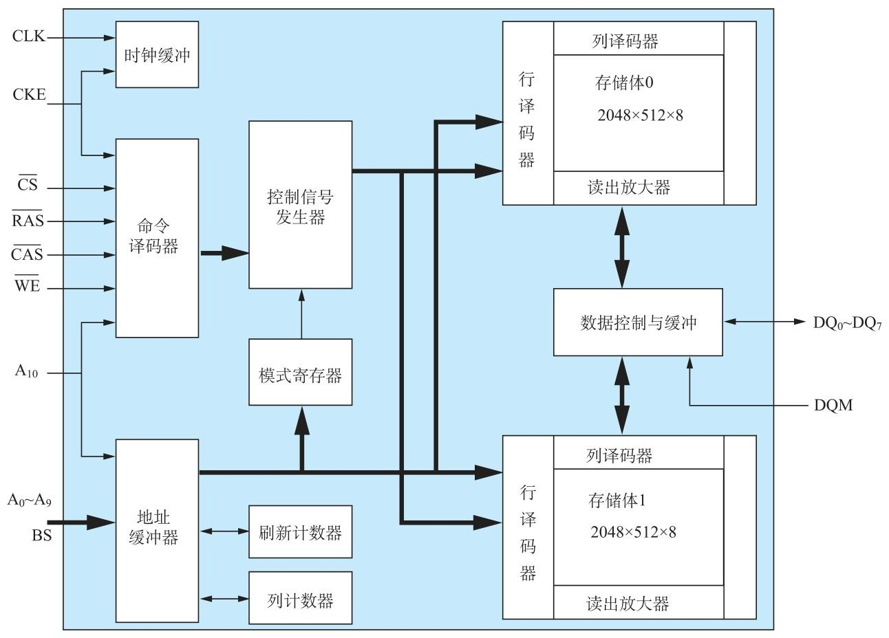
    - **同步操作**：SDRAM的所有输入、输出信号均在系统时钟CLK的上升沿被锁定和输出，通过这种方式使SDRAM操作与系统高速操作严格同步。**CKE为时钟使能信号**，只有其有效时，时钟输入才对SDRAM芯片起作用。
    - **多存储体配置**：SDRAM将存储体拆分为多个相互独立的存储体（**bank**），支持流水线并行操作。各存储体可同时、独立工作，也能顺序或交替工作，如一个存储体刷新时，另一个可正常读写，从而提高存取速度。通常由片内地址线的最高一位或若干位选择存储体 。
    - **命令控制**：与传统异步DRAM依据控制信号电平组合选择工作方式不同，SDRAM将一组控制信号电平编码组合为“命令” ，像**RAS**、**CAS**、**WE**、**CS**以及特定地址线的不同组合，分别代表激活存储体、读、写、预充等不同操作命令。
    - **模式寄存器**：SDRAM加电后要先设置**模式寄存器**，以此控制SDRAM工作在不同模式下，可设置**CAS延迟**、突发类型、突发长度和测试模式等。通过与传统异步DRAM功能差异对比（如异步DRAM无时钟，SDRAM根据系统时钟运行；异步DRAM RAS为电平控制，SDRAM为脉冲控制等），更清晰地展现SDRAM的特性。

    |功能|异步DRAM|SDRAM|
    |--|--|--|
    |时钟信号|无|根据系统时钟运行|
    |RAS控制方式|RAS为电平控制|RAS为脉冲控制|
    |存储体个数|单存储体|多存储体|
    |突发传输|一次传输一个列地址|每个列地址突发传送1、2、4、8或256个字|
    |读延迟|读延迟不能编程|读延迟可编程|

3. **SDRAM的控制方式**：以读周期为例，在T1时钟上升沿，激活命令ACT和行地址被锁存，开始存取操作；T3时钟上升沿，读命令和列地址被锁存；之后SDRAM进行内部准备操作，2个时钟周期后送出数据，从列地址锁存到数据有效输出的时间间隔即**CAS延迟CL**（图中CL = 2） ；T6时钟上升沿，控制器送入预充命令。SDRAM操作时序确定，CPU送出地址和控制命令后，在等待期间可执行其他任务，提高了系统效率。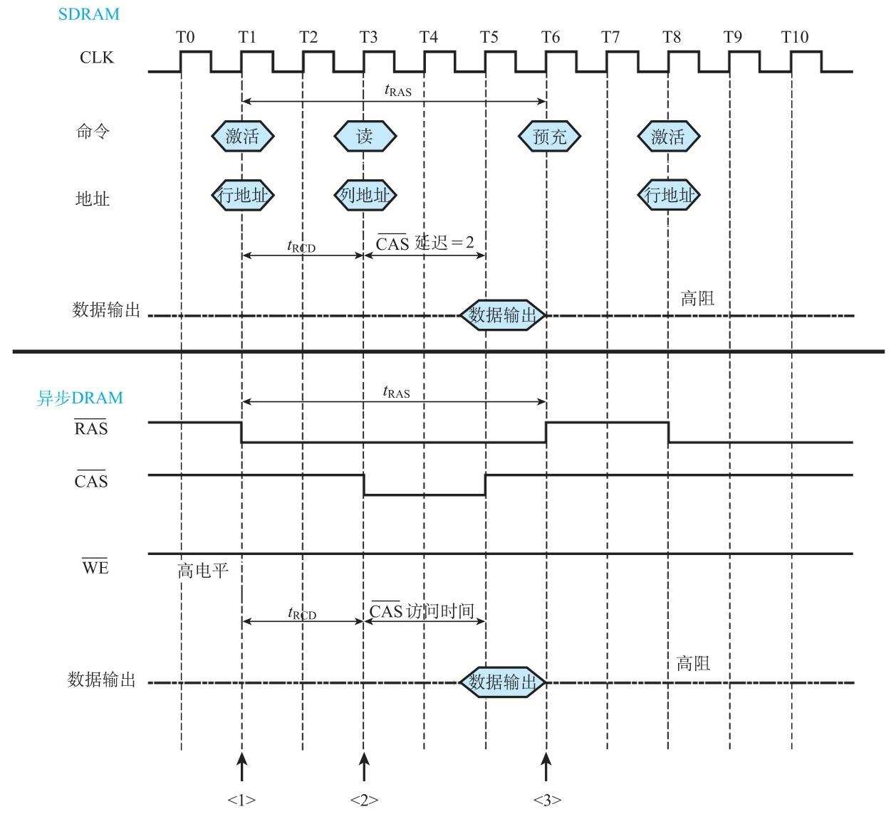
4. **SDRAM的命令**：在T1时钟上升沿，控制器按特定信号组合（**CS =0**、**RAS =0**、**CAS =1**、**WE =1**，**A11 =0**）发出存储体A的激活命令；T3时钟上升沿，按**CS =0**、**RAS =1**、**CAS =0**、**WE =1**发出读命令，2个时钟周期后，即T5时钟上升沿开始送出数据（此例突发长度**BL = 4**，后续四个时钟周期各送一个数据字）；T9时钟上升沿，DQ输出设为高阻状态；T10时钟上升沿，按**CS =0**、**RAS =1**、**CAS =0**、**WE =0**发出写命令；T14时钟上升沿开始下一次读操作。 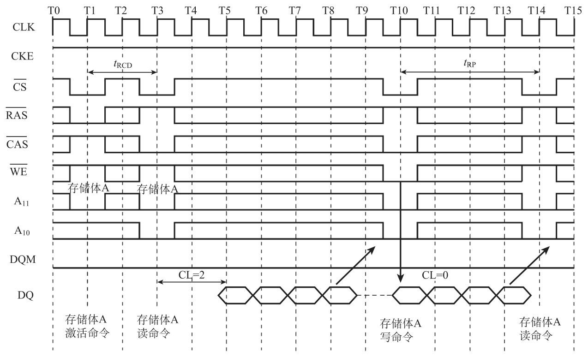
### 3.3.7 双倍数据率SDRAM(DDR SDRAM)
该节主要介绍了双倍数据率SDRAM（DDR SDRAM）的相关知识，包括其与SDR SDRAM的关系、结构特点、技术改进及优势，具体如下：

1. **DDR SDRAM与SDR SDRAM的关系**：DDR SDRAM是在SDRAM基础上发展而来，SDR SDRAM是单数据率的SDRAM，狭义的SDRAM仅指SDR SDRAM 。
2. **DDR SDRAM的结构特点**：DDR SDRAM最大的特点是在时钟的上升沿和下降沿都能传输数据 ，采用**2n预取结构**，内部总线宽度是外部总线宽度的两倍，每个时钟周期从存储矩阵到I/O缓冲区传输2n比特数据，I/O缓冲区到数据总线在时钟触发沿的上下沿都能传输数据。同时，**差分时钟**是DDR SDRAM的必要设计，由于数据传输周期缩短一半，为保证传输稳定，CK的反相时钟信号CK起到触发时钟校准的作用。 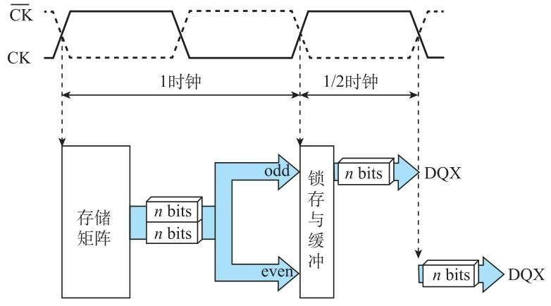
3. **DDR SDRAM的技术发展**：第一代DDR SDRAM出现后，相继出现了DDR2、DDR3和DDR4等技术。DDR2采用**4n预取结构**，将数据总线的时钟频率提升至内部传输频率的2倍，使外部总线数据率比DDR SDRAM提升一倍；DDR3采用**8n预取结构**；DDR4 SDRAM采用8n预取，还允许使用两个或四个存储体组，每个存储体组有独立的激活、读取、写入和刷新操作，若设计两个独立存储体组，内存预取值提高到16n，若为四个独立存储体组，预取值提高到32n。这些技术改进的主要目的是提升存储矩阵输出的数据率 。 
### 3.3.8 DRAM 读/写校验
该节主要介绍了DRAM读/写校验的相关内容，包括校验的重要性、方法及不同校验方式的特点，具体如下：

1. **DRAM读/写校验的重要性**：DRAM常作为主存储器，其读/写操作的正确性和可靠性很关键。为保证这一点，除正常数据位宽度外，会增加**附加位**用于校验读/写操作的正确性，且附加位要和数据位一同写入DRAM保存，这会增加DRAM的**位成本**。
2. **奇偶校验**：最简单的校验方式是**奇偶校验**，只需增加1位附加位（k = 1），可进行奇校验或偶校验。通过图3.16中的**异或运算电路F**实现校验，若读/写正确，写入和读出时F的运算结果应一致，否则给出错误信号。奇偶校验只能检测出1位错误，无法纠正错误，但因其技术简单、成本低，在早期主存储器中常用 。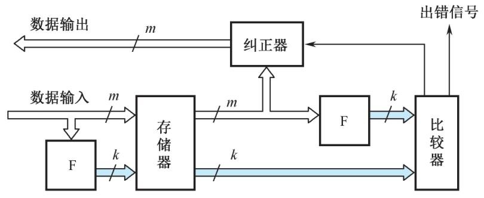

| 数据位 | 单纠错时校验位 | 单纠错/双纠错时校验位 |
| --- | --- | --- |
| 8 | 4 | 5 |
| 16 | 5 | 6 |
| 32 | 6 | 7 |
| 64 | 7 | 8 |

3. **纠错码（以汉明码为例）**：为能纠正错误，会设置k位纠错码，若数据字为m位，则实际存储字长为m + k位。**汉明码**是最简单的纠错码，不同数据位对应的汉明码校验位长度不同，如8位数据位时，需4位附加校验码，存储器字长变为12位，位成本增加50%；64位数据位时，需7位校验码，字长变为71位，位成本增加约11%。汉明码校验中，**F电路的运算比奇偶校验复杂**，如8位数据时F部分有4位，对应4个异或运算表达式。**纠正器电路部分**通过新、老校验位比较形成故障字，也是由异或运算得到。 
### 3.3.9 CDRAM
该节主要介绍了CDRAM（Cached DRAM，附带高速缓冲存储器的动态存储器）的相关内容，包括芯片结构、存储模块组成及优势，具体如下：

1. **CDRAM芯片的结构**：CDRAM在常规DRAM芯片封装内集成小容量**SRAM作为高速缓冲存储器**，以此提升访问速度。以1M×4位CDRAM芯片为例，由一片512×4位的SRAM构成cache，用于保存最近访问的一行数据。同时增加**最后读出行地址锁存器**和**行地址比较器** ，若后续访问数据在最近访问行中，可直接从cache读出，无需访问DRAM存储体。访问该芯片需20位内存地址，高11位行地址在行选通信号RAS作用下输入并锁存，指定行的512×4位数据读入SRAM暂存；低9位列地址在列选通信号CAS有效时输入并锁存。首次读操作时，读命令信号有效，SRAM中对应列地址的4位组送出芯片。下一次读取时，新输入11位行地址与最后读出行地址锁存器内容比较，相符则SRAM命中，由列地址从SRAM选4位组送出；不相符则重新访问DRAM阵列，更新SRAM和最后读出行地址锁存器内容并送出数据。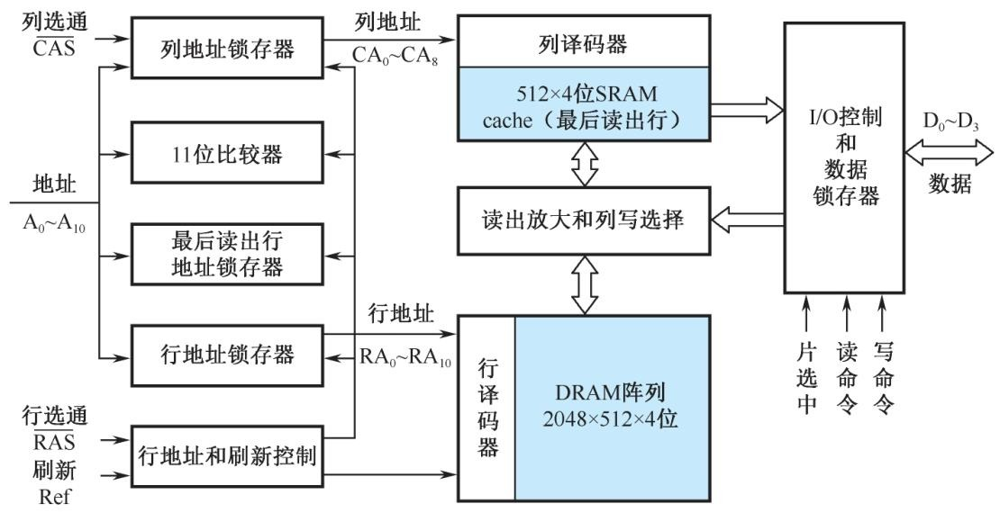
2. **CDRAM的优点**：CDRAM在常规DRAM基础上增加少量成本，却有显著优势。一是**突发操作速度高**，连续访问地址高11位相同时，只需变动9位列地址就能从SRAM快速读出数据；二是**SRAM读出期间可同时刷新DRAM阵列**；三是**允许写操作完成时启动同一行读操作**，因为芯片内数据输出与输入路径分开 。
3. **CDRAM存储模块**：8片1M×4位的CDRAM芯片可组成1M×32位（4MB）的存储模块。8个芯片共用片选信号Sel、行选通信号RAS、刷新信号Ref和地址输入信号A0～A10，每两片芯片的列选通信号CAS相连形成1M×8位片组，4个片组构成1M×32位存储模块。数据总线宽32位，支持CPU进行字存取（32位）、半字存取（高16位或低16位）或字节存取（任意8位） 。模块按**小端模式**安排地址，系统存储地址最高两位A23、A22作为模块选择地址，可配置4个模块，使存储器容量达16MB。该存储模块具备高速突发存取能力，连续访问数据块高13位地址相同时，首个存储字需完整存取周期，后续因数据在SRAM中，存取周期大幅缩短，写入速度也有类似提升。 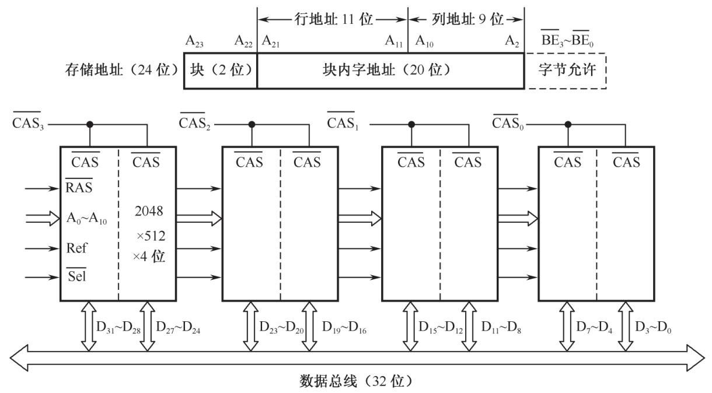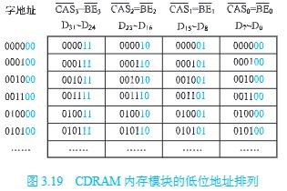
## 3.4 只读存储器
### 3.4.1 只读存储器概述
该节主要围绕半导体只读存储器（ROM）展开，介绍了其特点、分类及不同类型的特性，具体内容如下：

1. **ROM概述**：ROM最大特点是**非易失性**，访问速度比RAM稍低，能按地址随机访问并在线执行程序，用于储存固件、引导加载程序等。“只读”指工作时只能读出不能写入，早期ROM原始数据需离线存入，现代许多ROM能在线更新，但更新操作复杂、耗时长、次数少，实际是“编程”。
2. **ROM分类及特点**
    - **掩模ROM**：狭义ROM仅指掩模ROM，其存储内容固定，由厂家根据用户信息在生产时存入，制成后无法改变。成本低，适用于无更新需求的大批量应用，用于存储标准或特殊功能程序数据（已转换为二进制码）。
    - **可编程ROM（PROM）**：用户可更新ROM内容，包括一次性编程ROM、紫外线擦除PROM（EPROM）、E²PROM和闪速存储器。
        - **一次性编程ROM（OTP ROM）**：狭义PROM即指OTP ROM，只能编程一次。
        - **紫外线擦除PROM（UV-EPROM）**：简称EPROM，器件上方有石英窗口，从插座拔下后用紫外线照射数分钟至十余分钟可擦除信息，能多次编程和验证。
        - **电可擦PROM（EEPROM，E²PROM）**：采用电擦除，无需离线擦除，速度快，可单字节编程和擦除，使用方便。容量小、单位成本高，可重复擦除约一百万次，用于存储偶尔更新的系统信息等，许多单片机或电子模块内置该芯片。常规并行总线E²PROM访问速度快、接口简单，但引脚多、封装尺寸大，近年多被串行E²PROM（SEEPROM）或闪存取代，常见串行E²PROM支持多种串行总线，芯片封装引脚少。
        - **闪速（Flash）存储器（闪存）**：电可擦、可在线编程的非易失性只读存储器，擦除速度高，存储密度高、工作速度快，擦除块尺寸大，可擦除次数相对较少（NOR闪存为一万到十万次），应用普遍，取代了很多传统ROM。按存储元工作原理和制造工艺分不同类别，应用最普遍的是NOR和NAND技术。
            - **NOR闪存**：又称线性闪存，由英特尔和AMD等公司最早生产。特点是可随机读出任意地址内容，读出速度高；指令代码可直接在线执行；可单字节或单字编程（先擦除）；以区块或芯片为单位擦除；有独立数据线和地址线，接口与SRAM相似；信息存储可靠性高。适用于擦除和编程操作少、直接执行代码的场合，可取代UV-EPROM和大部分E²PROM，存储不常改变的程序代码或系统配置数据。
            - **NAND闪存**：又称非线性闪存，由三星和东芝等公司最早生产。特点是每次读出以页为单位，非随机访问；指令代码不能直接在线执行；以页为单位编程；以块为单位擦除；编程和擦除快速；数据线、地址线和控制线复用，接口与传统ROM不同；位成本低、位密度高；存在较高比特错误率，需软件处理坏块。一般不直接用于存储在线执行代码，但存储密度高、价格低、容量大，增加控制器后可用于程序代码存储，适用于大容量存储设备，已部分取代磁介质辅存。 

    | 存储器类型 | 非易失性 | 高密度 | 低功耗 | 可在线更新 | 快速读出 |
    | --- | --- | --- | --- | --- | --- |
    | Flash 闪存 | √ | √ | √ | √ | √ |
    | SRAM |  |  |  | √ | √ |
    | DRAM |  | √ |  | √ | √ |
    | EEPROM | √ |  | √ | √ | √ |
    | OTP ROM | √ | √ | √ |  | √ |
    | UV-EPROM | √ | √ | √ |  | √ |
    | 掩模ROM | √ | √ | √ |  | √ |
    | 硬盘 | √ | √ |  | √ |  |
    | CD-ROM 光盘 | √ | √ |  |  |  | 

### 3.4.2 NOR 闪存
该节以飞索公司（现赛普拉斯公司）生产的S29AL016J系列16Mbit闪存为例，介绍了NOR闪存的相关知识，具体如下：

1. **外部接口与逻辑结构**：S29AL016J有字模式（1M×16bit ，20位地址，16位数据线）和字节模式（2M×8bit ，21位地址，8位数据线），由引脚**BYTE#**选择。**CE#**为片选信号线，**OE#**为输出允许线，**WE#**为写使能信号，**RESET#**用于硬件复位，**WP#**可使芯片处于写保护状态，**RY/BY#**能反映芯片工作状态。该芯片由单一3.3V电源供电，内部集成编程和擦除电压发生器，通过命令寄存器接收外部命令，内部有状态机和状态控制逻辑，通过定时器定时。
2. **区块划分**：S29AL016J为区块式闪存，外部按1M×16bit或2M×8bit组织，内部有35个区块。低地址区常存系统引导程序和参数，区块尺寸小且可设写保护，前4个区块大小分别为16KB、8KB、8KB、32KB ，其余SA4 - SA34区块均为64KB。存储单元地址由区块地址（A12以上）和区块内偏移地址组成。
3. **总线操作与工作方式**：NOR闪存外部接口信号线与SRAM类似，除常规PROM操作外，还可通过“命令写”和“状态读”操作灵活控制。上电或复位后，芯片自动进入“读存储矩阵”状态，此时读操作与传统ROM相同。执行其他操作需特定命令序列，使芯片转入相应状态，如芯片擦除、区块擦除等。不同厂商芯片命令序列不同，常见有AMD/Fujitsu标准命令集和Intel/Sharp扩展命令集。擦除、编程操作需执行内嵌算法，完成前不能接收新命令，可通过读取**RY/BY#**信号电平、**data# polling**等方法判断操作状态，闪存内部状态机设置超时时间，超时时**DQ5**输出为1表示操作失败 。NOR闪存编程前需擦除，编程命令复杂，编程和读出速度远低于RAM，虽可在线编程但仍属ROM，一般不能取代RAM。 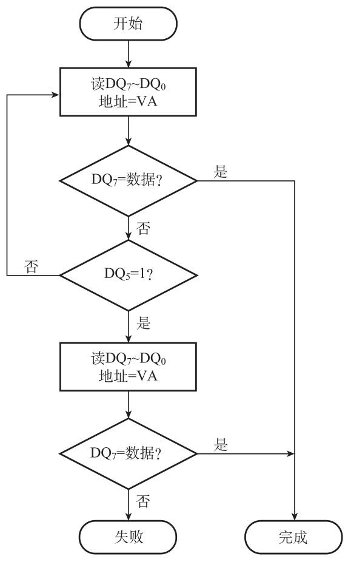
## 3.5 并行存储器
该节主要介绍了**并行存储器**相关内容，目的是解决CPU和主存储器之间速度不匹配的问题，具体如下：

1. **问题背景**：CPU和主存储器存在速度不匹配的情况，这是限制高速计算机设计的**主要问题**。为提高两者之间的数据交换速率，可在不同层次采用不同技术加速存储器访问速度。
2. **加速技术**
    - **芯片技术**：通过提高单个芯片的访问速度来实现，具体方式包括选用更高速的半导体器件，或改善存储芯片内部结构和对外接口方式。比如采用**突发传输技术**、**同步DRAM（SDRAM）技术**和**CDRAM（附带高速缓冲存储器的动态存储器）技术**等。
    - **结构技术**：改进存储器与CPU之间的连接方式，加速两者间的有效传输。例如采用**并行技术**的**双口存储器**（甚至多口存储器）以及**多体交叉存储器**，这些技术能让CPU在一个周期中访问多个存储字。
    - **系统结构技术**：从整个存储系统角度出发，采用分层存储结构解决访问速度问题。例如增加**cache（高速缓冲存储器）**，采用**虚拟存储器**等。
3. **本节重点**：本节主要讲授**双端口存储器**和**多体交叉存储器**，其中双端口存储器采用**空间并行技术**，多体交叉存储器采用**时间并行技术**。 
### 3.5.1 双端口存储器
该节围绕双端口存储器展开，介绍了其产生背景、逻辑结构、读写控制等内容，具体如下：

1. **产生背景**：早期计算机以CPU为中心，影响CPU效能，后逐渐被以内存为中心的结构取代。该结构下多个部件可与主存直接交换信息，使主存访问次数增多，传统存储器无法满足需求，由此提出多口存储器结构。
2. **逻辑结构**：双端口存储器因同一存储器具有两组相互独立的读写控制电路得名，可高速并行独立操作。以IDT7133为例，其为2K×16位的SRAM，提供左、右两个独立端口，各有地址线（A0～A10）、数据线（I/O0～I/O15）和控制线（R/ W 、 CE 、 OE 、 BUSY ），可独立存取数据，且双端口存储器也可由DRAM构成。
3. **读写控制**
    - **无冲突读写控制**：当两个端口地址不同时进行读写操作，不会发生冲突。端口被选中驱动时可对整个存储器存取，读操作时OE（低电平有效）打开输出驱动器，数据出现在I/O线上，表格详细列出了无冲突的读写条件。
    - **有冲突的读写控制**：当两个端口同时存取同一存储单元且至少一个端口为写操作时，发生读写冲突。通过设置**BUSY标志**解决，片上判断逻辑决定优先写操作端口，延迟端口的BUSY标志置低关闭端口，优先端口完成写操作后，延迟端口的BUSY标志复位后开放。当两个端口均开放且存取地址相同时发生写冲突，仲裁逻辑依据地址匹配或片选使能信号有效时间判断，分为**CE判断**和**地址有效判断**两种方式，表格列出了左、右端口读写操作的功能判断 。 
### 3.5.2 多模块交叉存储器
该节主要介绍了多模块交叉存储器，内容涵盖存储器模块化组织、基本结构、数据传输率计算及二模块交叉存储器示例，具体如下：

1. **存储器的模块化组织**
    - **地址安排方式**：主存储器由若干模块组成，地址安排有**顺序方式**和**交叉方式**。顺序方式下，访问地址按顺序分配给各模块，某模块存取时其他模块不工作，其优点是扩充容量方便，缺点是各模块串行工作，限制存储器带宽。
    - **交叉方式**：地址分配是先将连续的多个线性地址依次分配给不同模块，用地址码低位选择模块，高位指向模块内存储字，连续地址分布在相邻不同模块。这种方式可实现多模块流水式并行存取，提高存储器带宽，基于此思想提出多模块交叉存储器。
2. **多模块交叉存储器的基本结构**
    - **结构与工作原理**：以四模块交叉存储器为例，主存分为4个相互独立、容量相同的模块，各模块有独立读写控制电路、地址寄存器和数据寄存器。CPU同时访问四个模块，由存储器控制部件控制分时使用数据总线，对单个模块存取仍需一个存储周期，但CPU可在一个存取周期内连续访问四个模块，实现并行存取 。
    - **定量分析**：设模块字长等于数据总线宽度，模块存取一个字的存储周期为T，总线传送周期为τ，交叉模块数为m，为实现流水线存取需满足**T≤mτ**，**m的最小值mmin =T/τ**称为交叉存取度，模块数需大于等于mmin。连续读取m个字，交叉存储器所需时间**t1 =T+(m–1)τ**，顺序存储器所需时间**t2 =mT**，**t1＜t2**，交叉存储器带宽更高。通过实例计算，进一步验证了交叉存储器数据传输率高于顺序存储器。
3. **二模块交叉存储器举例**
    - **结构组成**：二模块交叉存储器每个模块容量为1MB，由8片256K×4位DRAM芯片位扩展组成，总容量2MB。数据总线32位，地址总线24位，24位物理地址按“存储体 - 块 - 字”寻址，高3位选存储体，A20 - A3选模块内存储字，A2用于模块选择，连续存储字交错分布在两个模块 。
    - **工作特点**：DRAM有读、写和刷新周期，刷新周期优先级高。CPU地址无A1和A0位，由4字节允许信号实现字节或字读写。采用二模块交叉存取，可实现零等待存取，避免因DRAM读出破坏性和刷新导致的等待状态，提高存取效率。 
## 3.6 cache存储器
### 3.6.1 cache 基本原理
该节围绕cache的基本原理展开，从功能、原理、命中率、结构设计等方面进行介绍，具体内容如下：

1. **cache的功能**：cache是**高速缓冲存储器**，为解决**CPU和主存速度不匹配**而设，基于程序运行的**空间局部性和时间局部性**原理。它介于CPU和主存之间，容量小、存取速度快，由高速**SRAM**组成，功能全由硬件实现，对程序员**透明**。如今小容量cache可与CPU集成，组成多级cache系统。
2. **cache的基本原理**：cache由**SRAM和控制逻辑**构成，控制逻辑可与主存控制逻辑合成或由CPU提供。CPU与cache以**字**交换数据，cache与主存以**块**交换数据。CPU读取内存字时，cache控制逻辑判断字是否在cache中，命中则直接传送，未命中则从主存读取字和包含字的块到CPU和cache ，并由硬件逻辑实现替换算法。
3. **cache的命中率**：cache目的是让主存平均读出时间接近cache读出时间，需保证高命中率（接近1）。命中率$h$定义为$h=\frac{N_c}{N_c + N_m}$（$N_c$为cache完成存取次数，$N_m$为主存完成存取次数）。cache/主存系统平均访问时间$t_a = ht_c + (1 - h)t_m$（$t_c$为命中访问时间，$t_m$为未命中访问时间），访问效率$e=\frac{1}{1+(r - 1)h}$（$r=\frac{t_m}{t_c}$） ，提高命中率可提升访问效率，$r$以5 - 10为宜。命中率与程序行为、cache容量、组织方式、块大小相关。
4. **cache结构设计必须解决的问题**：cache设计遵循**高命中率**和**对CPU透明**原则，需cache控制器实现。设计时要解决四个问题：
    - **地址映射与变换**：主存内容调入cache的存放方式及主存地址到cache地址的变换，即确定主存信息在cache中的位置，通过硬件实现。
    - **替换算法**：cache空间不足时选择和执行替换算法，用于cache未命中时替换已有内容。
    - **写操作策略**：更新时保持主存与cache的一致性，解决cache写操作时的内容改写问题 。 
### 3.6.2 主存与cache 的地址映射
该节主要介绍了主存与cache之间的三种地址映射方式，分别为全相联方式、直接方式和组相联方式，具体内容如下：

1. **全相联映射方式**：cache的**行**与主存的**块**等长，每个块（行）由若干连续的字组成。在全相联映射中，主存块地址与块内容一起存于cache行中，块地址存于cache行的**标记（tag）**部分，这种方式使主存块可直接复制到cache任意一行，灵活性高。检索时，主存地址块号与cache中所有行的标记同时比较，命中则按字地址从cache读字，未命中则从主存读取。全相联cache中，标记用相联存储器实现，数据存储用普通RAM实现。但该方式**高速比较器电路设计和实现困难**，仅适用于小容量cache。
2. **直接映射方式**：这是一种多对一的映射关系，主存块只能拷贝到cache特定行位置，cache行号i和主存块号j的函数关系为**i = j mod m** （m为cache总行数）。主存可分区，每个区块数与cache行数相等，各区对应块只能映射到cache固定行。直接映射将主存块地址分成两部分，低r位作为cache行地址，s - r位区号作为标记与块数据存于该行。检索时，先由r位区内块号找到cache特定行，再用s - r位区号与该行标记比较，相符则命中，不符则从主存读取。该方式**硬件简单、成本低、地址变换速度快**，但主存块存放位置固定，易发生冲突，适合大容量cache以减少冲突。
3. **组相联映射方式**：此方式是全相联和直接映射的折中方案，将cache分成u组，每组v行，主存块存到哪组固定，存到组内哪行灵活，组号q = j mod u 。内存地址中，s位块号的低d位（2d = u）表示cache组号，高s - d位区号作为标记与块数据存于该组某行。检索时，先由d位区内块号找到cache相应组，再将主存地址高s - d位区号与该组v行标记同时比较，相符则命中，按字地址存取，不符则从主存访问。组相联映射每组行数v取值较小，v路比较器易设计实现，且减少了冲突，被普遍采用。
4. **示例**：通过三个示例分别展示了直接映射、组相联映射和全相联映射下内存地址格式分析以及标记、行、字地址的计算，帮助理解不同映射方式的地址处理逻辑 。 
### 3.6.3 cache 的替换策略
该节主要围绕**cache的替换策略**展开，介绍了替换产生的原因、不同cache组织方式下的替换特点以及三种常用的硬件实现替换算法，具体如下：

1. **替换产生的原因及与cache组织方式的关系**：cache需尽量保存最新数据，当新的主存块需拷贝到cache，而对应存放位置已被占满时，就需要进行替换。对于**直接映射的cache**，由于主存块只有一个特定行位置可存放，替换简单，直接换出特定位置的原主存块；对于**全相联和组相联cache**，则需从允许存放新主存块的若干特定行中选取一行换出，这就涉及到替换策略（算法） 。
2. **常用硬件实现的替换算法**
    - **最不经常使用（LFU）算法**：该算法认为应换出一段时间内被访问次数最少的行数据。通过为每行设置计数器，新行调入后计数器从0开始，每访问一次对应行计数器加1 。需要替换时，比较特定行计数值，将最小计数值的行换出，同时特定行计数器清零。但此算法计数周期限定在两次替换间隔内，无法严格反映近期访问情况。
    - **近期最少使用（LRU）算法**：该算法将近期长久未被访问的行换出。同样为每行设置计数器，cache每命中一次，命中行计数器清零，其他行计数器加1 。替换时，比较各特定行计数值，换出计数值最大的行。此算法能保护新数据行，符合cache工作原理，可提高cache命中率。对于**2路组相联的cache**，LRU算法硬件实现可简化，用一个二进制位即可实现二选一替换，如奔腾CPU内的数据cache采用此简捷方式。
    - **随机替换**：该策略不依赖特定算法，从特定行位置中随机选取一行换出，硬件实现简单，速度快。但缺点是可能换出马上要使用的数据，降低命中率和cache工作效率，不过这一不足会随cache容量增大而减小。研究表明，其性能稍逊于前两种策略 。
3. **cache容量补充说明**：一般所说的cache容量指数据存储空间大小，实际实现cache时，还需额外增加标记、修改位、行计数器等状态信息的存储空间。 
### 3.6.4 cache 的写操作策略
该节内容主要围绕**cache的写操作策略**展开，介绍了为保持cache与主存内容一致而采用的三种策略，具体如下：

1. **写回法（write back, copy back）**
    - **核心规则**：当**CPU写cache命中**时，仅修改cache内容，不立即写入主存；仅当该行被换出时，才将内容写回主存。这样能使cache在CPU与主存之间的读写过程中充分发挥高速缓存作用，多次写命中都可在cache快速完成，仅在替换时才与速度较慢的主存交互，从而**减少访问主存次数**。
    - **实现条件**：需为每个cache行配置一个**修改位**，用于标识该行是否被CPU修改。当某行被换出时，依据修改位状态决定是写回主存（修改位为1）还是直接弃去（修改位为0） 。
    - **未命中处理**：若**CPU写cache未命中**，需先在cache中为包含欲写字的主存块分配一行，将该块整体复制到cache后再进行修改，主存的写修改操作留到该行被换出时执行。此方式虽能减少写主存次数，但存在**数据不一致性隐患**。
2. **全写法（write through）**
    - **命中处理**：当**写cache命中**时，cache与主存**同时进行写修改**，可有效维护cache与主存内容的一致性。
    - **未命中处理**：当**写cache未命中**时，直接向主存写入。对于是否将修改后的主存块取到cache，存在两种策略 ：**WTWA法**（将主存块取到cache并分配行位置）和**WTNWA法**（不取主存块到cache）。
    - **优缺点**：优点是cache中每行无需设置修改位及相关判断逻辑；缺点是cache对CPU向主存的写操作无高速缓冲功能，**降低了cache性能**。
3. **写一次法（write once）**
    - **策略本质**：基于写回法并结合全写法的策略，写命中与写未命中的处理方式与写回法基本一致。
    - **特殊处理**：在**第一次写命中**时，除修改cache内容外，还会**同时写入主存**。这是为了在CPU启动存储写周期时，其他cache可通过监听到的主存块地址及写信号，复制该块或及时作废，从而**维护系统中全部cache的一致性**。例如，**奔腾CPU的片内数据cache**就采用了写一次法。 
### 3.6.5 使用多级cache 减少缺失损失
该节主要介绍了使用多级cache（以二级cache为例）减少缺失损失以及对处理器性能的影响，具体如下：

1. **多级cache的背景**：现代计算机的cache常与CPU集成，为缩小现代处理器高时钟频率和访问DRAM速度慢的差距，高性能微处理器可支持附加一级cache（二级cache）。二级cache位于处理器芯片内或芯片外单独的一组SRAM，在主cache（第一级cache）缺失后访问。若二级cache包含所需数据，缺失损失为二级cache访问时间，比主存访问时间少；若两级cache都不包含，则需访问主存，产生更大缺失损失 。
2. **计算示例**：
    - **已知条件**：现有一处理器，基本CPI为1.0，所有访问在第一级cache中命中，时钟频率为5GHz，访问一次主存储器时间为100ns（含缺失处理），平均每条指令在第一级cache中缺失率为2%。增加二级cache后，命中或缺失访问时间都为5ns，使必须访问主存的缺失率减为0.5%。
    - **计算过程**：
        - 计算访问主存储器的缺失损失，将100ns换算为时钟周期，因为时钟频率为5GHz，即一个时钟周期为0.2ns，所以100ns为500个时钟周期。
        - 计算只有一级cache的机器有效CPI，总的CPI = 基本CPI + 每条指令中存储器停顿的时钟周期 = 1.0 + 2%×500 = 11.0。
        - 计算访问第二级cache的缺失损失，5ns换算为时钟周期是25个（5ns÷0.2ns/时钟周期 = 25个时钟周期）。
        - 计算有二级cache时总的CPI，总的CPI = 基本CPI + 每条指令的一级停顿 + 每条指令的二级停顿 = 1 + 2%×25 + 0.5%×500 = 1 + 0.5 + 2.5 = 4.0。
    - **结果分析**：有二级cache的处理器性能是没有二级cache的处理器性能的2.8倍（11.0÷4.0≈2.8 ），说明使用二级cache能显著提高处理器性能。 
## 3.7 虚拟存储器
### 3.7.1 虚拟存储器的基本概念
该节围绕虚拟存储器的基本概念展开，涵盖实虚地址定义、虚存访问过程、cache与虚存异同及虚存关键问题，具体如下：

1. **实地址与虚地址**：早期单用户单任务系统中，程序小且单一，虚拟存储器作用有限。但随着程序容量增长与多用户多任务系统出现，程序所需容量与实际主存容量产生矛盾。为解决此问题，编程时采用**虚地址（逻辑地址）**独立编址，不考虑物理存放问题；程序运行时，由地址转换部件将虚地址转换为**实地址（物理地址）**，此过程即程序再定位。
2. **虚存的访问过程**：用户程序按虚地址编程存于辅存，运行时地址变换机构将部分程序调入实存。每次访存先判断虚地址对应部分是否在实存，在则地址转换后访问主存，不在则按算法调度辅存程序进内存再访问。虚地址空间可大于或小于实地址空间，虚存由主存、辅存及管理部件构成，对应用程序员透明。
3. **cache与虚存的异同**
    - **相同点**：二者都是为提升存储系统性能价格比构建的分层存储体系，都利用程序局部性原理，将常用信息块从低速大容量存储器调入高速小容量存储器。
    - **不同点**
        - **侧重点**：cache侧重解决主存与CPU速度差异，虚存主要解决存储容量，还涉及存储管理等。
        - **数据通路**：CPU与cache、主存间有直接通路，cache不命中可直访主存；虚存的辅存与CPU无直接通路，主存不命中需调页后访主存。
        - **透明性**：cache管理全由硬件完成，对系统和应用程序员均透明；虚存由软硬件共同管理，对系统程序员不透明，对应用程序员透明（段式和段页式“半透明”）。
        - **未命中损失**：主存未命中性能损失远大于cache未命中损失。
4. **虚存机制要解决的关键问题**
    - **调度**：确定调入主存的程序和数据。
    - **地址映射**：访问主存时虚地址转主存物理地址（内地址变换），访问辅存时虚地址转辅存物理地址（外地址变换），并处理主存分配等问题。
    - **替换**：决定调出主存的程序和数据。
    - **更新**：保证主存与辅存数据一致 。 
### 3.7.2 页式虚拟存储器
该节主要围绕页式虚拟存储器展开，介绍了其地址映射、内页表和外页表、转换后援缓冲器（TLB）以及虚拟存储器、TLB和cache的协同操作等内容，具体如下：

1. **页式虚存地址映射**
    - **基本概念**：在页式虚拟存储系统中，虚地址空间分为**逻辑页**，主存空间分为**物理页**。虚地址由**逻辑页号**（高字段）和**页内地址**（低字段）组成；实存地址由**物理页号**（高字段）和页内地址组成。通过**页表**实现虚地址到物理地址的转换。
    - **页表与地址变换**：每个进程对应一个页表，页表中每个虚存页面的表项包含其所在主存页面的物理页号及指示该页是否已调入主存的**有效位** 。地址变换时，用逻辑页号索引页表找到物理页号，与虚地址的页内偏移量拼接成物理地址。现代CPU有专门硬件支持地址变换。
    - **页表优化**：由于进程页数不固定，页表长度可变，通常将页表基地址存于寄存器，页表放主存。为节省主存空间，有的系统将页表存于虚存并分页，或采用**二级页表结构** 。页表长度大的系统还可采用**反向页表**实现物理页号到逻辑页号的反向映射，有的系统通过散列表改进。
2. **内页表和外页表**
    - **内页表**：即虚地址到主存物理地址的变换表。
    - **外页表**：用于虚地址与辅存地址之间的变换，其结构与辅存寻址机制相关，通常放在辅存中，需要时可调入主存。主存不命中时，存储管理部件发出“缺页中断”进行调页操作。
3. **转换后援缓冲器（TLB）**
    - **作用与结构**：为避免因页表在主存导致访存时多访问一次主存，对页表进行二级缓存，**TLB（快表）**存放页表中活跃部分，保存在主存中的完整页表称为**慢表**。TLB通常由相联存储器实现，容量小，可完成硬件高速检索操作。
    - **地址变换过程**：地址变换时同时查快表和慢表，快表中有对应逻辑页号则快速找到物理页号。存储管理部件先用虚地址中的虚页号检索TLB，成功则拼接物理地址；不成功则查询主存页表，再拼接物理地址。若物理地址所在页不在主存，需调入主存并装入cache，修改页表和TLB表项 。
4. **虚拟存储器、TLB和cache的协同操作**
    - **协同机制**：虚拟存储器和cache系统协同工作，操作系统在其中起关键作用，如将某页移到磁盘时，会删除该页在cache中的内容，同时修改页表和TLB，此时访问该页可能导致缺页。
    - **访问情况分析**：最好情况下，虚拟地址由TLB转换后送cache获取数据；最坏情况下，一次访问可能在TLB、页表和cache都产生缺失。访问存储器可能遇到cache缺失、TLB缺失和缺页三种类型缺失，存在7种组合情况，其中4种可能发生，3种不可能发生 。 
### 3.7.3 段式虚拟存储器和段页式虚拟存储器
该节主要介绍了段式虚拟存储器和段页式虚拟存储器的概念、地址映射、优缺点等内容，具体如下：

1. **段式虚拟存储器**
    - **基本概念**：分页方式存在页长与程序逻辑大小不相关的缺点，分段方式则将可寻址存储空间按程序自然分界划分成**长度动态可变的区域（段）**，程序员可将不同类型数据划分到不同段。在段式虚拟存储系统中，**虚地址由段号和段内地址组成**，通过**段表**实现虚地址到实主存地址的变换，每个程序对应一个段表，段表项包含**有效位**（指明段是否调入实存）、**段起址**（段在实存中的首地址）和**段长**（记录段实际长度，防止地址越界）。
    - **地址变换过程**：存储管理部件以段号为索引访问段表对应表项，若有效位为1，将段内偏移量与段长比较，未越界则将段起址与偏移量相加得实地址并访存；若有效位为0，则产生缺段中断，从辅存调入该段并修改段表。
    - **优缺点**：优点是段具有逻辑独立性，便于编译、管理、修改、保护和共享，段长可动态改变利于主存空间调度；缺点是主存空间分配麻烦，易产生外碎片，地址变换需加法运算，硬件支持需求更多 。
2. **段页式虚拟存储器**
    - **基本概念**：段页式虚拟存储器结合了段式和页式的特点，实存等分成页，程序先分段再分页，按页进行调入调出，按段进行编程、保护和共享。虚地址由**基号（多任务系统）、段号、段内页号和页内偏移量**构成，通过**一个段表和多个页表**进行两级再定位，段表项指针指向对应段的页表，页表记录该段各页在主存中的位置及状态信息。
    - **地址变换过程**：以程序C为例，先根据基号找到段表基址寄存器表项，获取程序C段表基址，再依据段号找到段表对应表项得到页表起始地址，然后根据段内逻辑页号检索页表得到物理页号，最后与页内地址偏移量拼接成物理地址。若表项有效位为0，则需中断操作进行建表或调页。
    - **缺点**：在虚地址向主存地址映射过程中需多次查表，实现复杂度较高。 
### 3.7.4 虚存的替换算法
该节内容围绕**虚存的替换算法**展开，具体内容如下：

1. **替换算法的产生及类型**：当从辅存调页至已满的主存时，需要进行主存页面的替换。虚拟存储器的替换算法与cache的替换算法类似，常见的有**FIFO算法、LRU算法、LFU算法**等。
2. **虚存与cache替换算法的区别**
    - **实现方式**：cache的替换全部靠硬件实现，而虚拟存储器的替换有**操作系统的支持**。
    - **对系统性能的影响**：虚存缺页对系统性能的影响比cache未命中要大得多，因为调页需要访问辅存，并且要进行任务切换 。
    - **替换选择范围**：虚存页面替换的选择余地很大，属于一个进程的页面都可替换。
3. **虚存替换的支持机制**：为支持虚存的替换，通常在页表或段表的每一表项中设置一个**修改位**，标识该表项对应的主存页或段空间在被调入主存后是否被修改过。对于将被替换出去的空间，若内容未被修改过，不必进行额外处理；若已被修改，则需把该空间存储的内容重新写入辅存，以保证辅存中数据的正确性。
4. **算法示例及分析**
    - **示例**：假设主存只允许存放a、b、c三个页面，逻辑上构成a进c出的FIFO队列。某次操作中进程访存的序列是0，1，2，4，2，3，0，2，1，3，2(虚页号)。分别采用FIFO算法、FIFO+LRU算法，通过列表法计算两种替换策略情况下主存的命中率。
    - **分析**：在FIFO算法中，FIFO队列中的页面始终按照从a到c的顺序依次推进，页面从a位置进入队列，替换始终在页面c的位置进行；FIFO+LRU算法是对FIFO算法的一种改进，若某个页面命中，则将该页面移动到FIFO队列入口位置（页面a所在的位置），因为刚被访问的页面在最近的将来被再次访问的概率较大，故将其被替换的时间延后。最终，FIFO+LRU算法比FIFO算法的命中率高 。 
### 3.7.5 存储管理部件
该节主要介绍了存储管理部件（MMU）的相关内容，具体如下：

1. **MMU的定义与地位**：存储管理部件（**Memory Management Unit，MMU**）是系统中进行**虚实地址转换**的**核心部件**。
2. **MMU的主要功能**
    - 在**转换后援缓冲器（TLB）**的协助下完成虚实地址转换。
    - 维护TLB的控制机制。
    - 负责存储保护。
    - 在TLB失效或非法访问时向处理器发起中断。
    - 维护一个TLB失效后的再填充机制（**table walking**）。
3. **MMU的工作流程**
    - CPU发出访存的**虚拟地址**后，MMU通过**页表查找机制**访问主存页表，获得映射关系。
    - **主存命中**时，MMU将**虚页号**变换为**物理页号**，产生**物理地址**进行访存。
    - **主存缺页**时，CPU将转到操作系统的**页面失效程序入口**，由操作系统进行调页操作 。 
## 3.8 鲲鹏 920 处理器的内存储系统
该节主要介绍了华为海思鲲鹏920处理器片上系统的存储系统，包括存储系统的层次结构、主存系统、地址映射与变换三部分内容，具体如下：

1. **鲲鹏存储系统的层次结构**：鲲鹏920处理器片上系统的内存储系统由**多级高速缓冲存储器cache和主存**构成。多个内核集群组成超级内核集群，采用片内共享L3 cache架构。每个处理器内核集成**64KB L1 I - cache（指令cache）、64KB L1 D - cache（数据cache）以及512KB L2 cache**。L3 cache为系统级片上三级高速缓存，由超级内核集群共享，其数据块位于内核集群外，标记块集成在每个内核集群中。L3 cache采用**组相联结构**，固定使用**写回策略**，支持随机替换、DRRIP和PLRU三种替换算法，cache行大小为128字节（32字）。当处理器内核集群或加速器读取主存DDR可缓存地址空间时，若L3_TAG地址命中，向L3_DATA发出读操作请求获取数据；若缺失且数据在主存，则向DDR存储器发出读数据请求，数据返回后在L3 cache分配空间并写入 。
2. **鲲鹏920处理器片上系统的主存系统**：主存主要是片外DDR SDRAM大容量存储器，主存储系统由**Hydra根代理（HHA）、DDR SDRAM控制器（DDRC）和片外DDR存储器颗粒或DDR DIMM内存条**组成。DDR SDRAM存储器是数据存储中心，DDRC实现对其存取控制，完成时序转换和流量管理；HHA位于DDR控制器与片上总线环总线之间，提供DDR访问通路。鲲鹏920有8个DDR控制器子系统，对应8个独立DDR通道，每个通道数据位宽72位（64位有效数据，8位校验数据），支持DDR3和DDR4存储器颗粒或DIMM内存条，每个控制器子系统最多支持2个DIMM内存插槽，每个插槽最多支持4个物理存储体。系统读写访问经DDR控制器子系统处理后，与符合JEDEC标准JESD79 - 4B协议的片外DDR4 SDRAM颗粒或DIMM内存条通信。每个DDR控制器子系统包括RASC、HPC、DMC和HSPHY四个模块，分别实现RAS特性、访问调度、地址转换及协议转换等功能 。
3. **鲲鹏920处理器片上系统的地址映射与变换**：泰山V110处理器核支持**48位的虚拟地址和48位的物理地址**。内核集群和I/O集群访问物理存储器空间时，分别依据存储管理单元中的页表、页表或数据源确定地址。系统存储管理单元是ARMv8 - A架构下实现虚拟化扩展的重要组件，可用于设备虚拟化，在AArch64模式下可实现对48位物理地址空间的访问。地址变换可采用单级或两级连续变换，不使用虚拟化功能时用单级变换；支持虚拟化操作则启用两级变换，两级变换中虚拟地址VA先转换为40位中间物理地址IPA，再变换为物理地址PA 。 