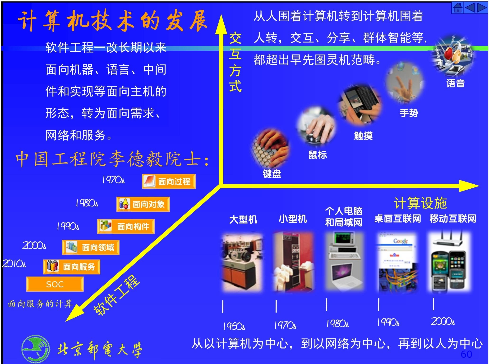
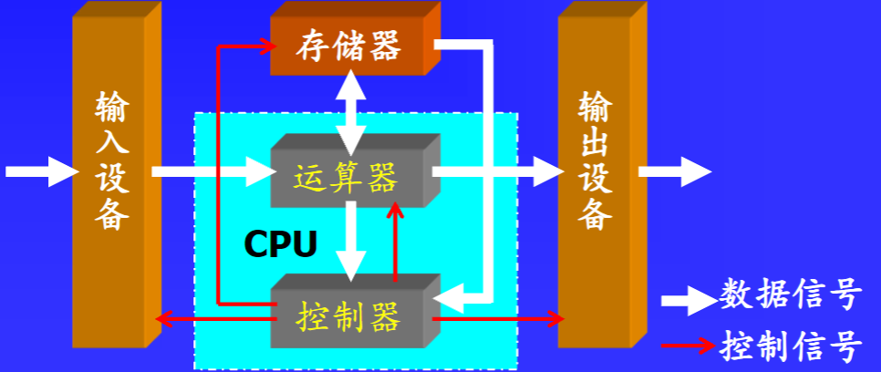
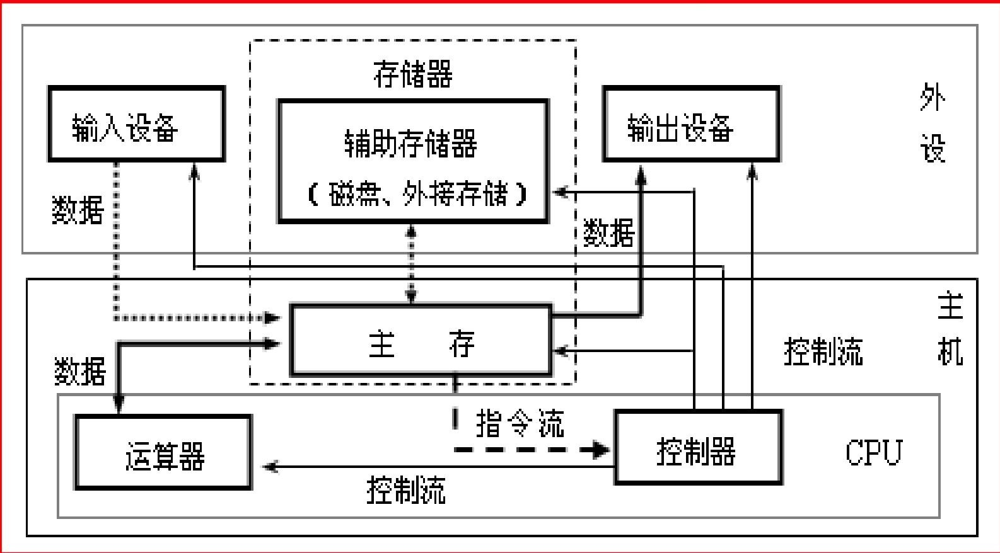
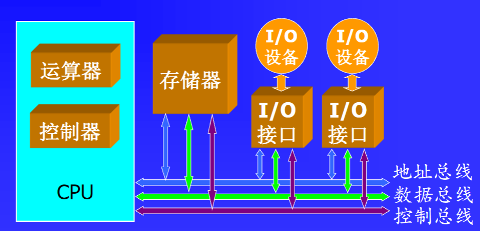

# 第一章：计算机系统概述
该文档是关于计算机组成原理中计算机系统概述的教学资料，主要涵盖计算机分类、发展历程、硬件组成、体系结构、性能指标、系统层次结构等内容。

1. **计算机分类**：提及嵌入式计算机，选项包括台式计算机、笔记本计算机、工业控制计算机、平板计算机、移动电话（智能手机）、智能眼镜（可穿戴计算机）等。
2. **发展历史**：介绍了计算机体系结构创始人、存储程序概念，以及世界上第一台电子数字计算机（如ABC ）。还阐述了摩尔定律及其面临的终结，以及不同年代计算机技术的发展，如从面向过程到面向对象、构件、领域和服务的转变。
3. **硬件组成**：详细说明了计算机硬件由存储器、输入设备、CPU、输出设备等构成，介绍了各部分功能及相互间的信号传输，还以鲲鹏处理器片上系统为例阐述了其组成部件。
4. **体系结构**：对比了冯·诺依曼结构和哈佛体系结构，现代高性能计算机常采用哈佛结构，主存采用冯·诺依曼结构 ，并提及非诺依曼化发展趋势。
5. **性能指标**：介绍了吞吐量、响应时间、利用率、字长、主频、时钟周期等性能指标，并给出了相关例题，还涉及测试基准的内容。
6. **系统层次结构**：计算机系统分为微程序级、操作系统级、汇编语言级、机器语言级等多个层次，阐述了各层次的功能及相互关系，以及软件与硬件的逻辑等价性。
7. **其他内容**：介绍了计算机组成的层次，包括计算机组织、结构和实现；最后列出了教学安排、本章小结、重点内容和作业。 
## 计算机的分类
- **按输入输出信号的形式分类**：
    - **电子模拟计算机**：以模拟信号作为输入输出，通过对连续变化的物理量进行处理和运算。
    - **电子数字计算机**：处理和存储数字信号，采用二进制代码表示数据和指令，是目前应用最广泛的计算机类型。
- **按照计算机的体系结构、运算速度、结构规模、适用领域分类**：
    - **个人计算机（Personal Computer）**：简称PC，供个人使用，常见的有台式机和笔记本电脑，用于日常办公、学习、娱乐等场景。
    - **工作站（Workstation）**：如SUN、HP工作站，具备高性能的图形处理能力和运算能力，主要用于专业领域，像科学计算、图形设计、动画制作等。
    - **小型计算机（Mini - computer）**：以VAX - 11为代表，规模和性能介于微型计算机和大型计算机之间，可支持多个用户同时使用，常用于企业部门级应用。
    - **主机（Mainframe）**：例如IBM4381，具有强大的处理能力和存储容量，能同时处理大量数据和多个用户的任务，常用于大型企业、金融机构、政府部门等对数据处理和可靠性要求极高的场合。
    - **小巨型计算机（Mini - supercomputer）**：如ELXSII6400，性能接近巨型计算机，但体积更小、成本更低，适用于对计算性能有较高要求且预算有限的科研机构或企业。
    - **巨型计算机（Super - computer ）**：以Cray - I为代表，运算速度极快、存储容量极大，是计算机中性能最强的一类，主要用于解决复杂的科学计算问题，如天气预报、核物理研究、航天航空模拟等。
- **以应用为中心的分类方法**：
    - **通用计算机**：具有标准的计算机形态，通过安装不同的应用软件，可广泛应用于社会各个领域，能满足多样化的通用需求。
    - **专用计算机/嵌入式（Embedded）计算机**：被嵌入到各类设备中，作为设备的一部分，以嵌入式系统的形式存在，实现特定的功能，如交通工具、仪器仪表、控制系统、通信设备、家用电器中的数据处理功能。 
## 计算机的发展历史——计算机体系结构创始人
1. **重要人物与发明**
    - **冯·诺伊曼**：1946年7月，他在论文《电子计算工具逻辑设计初探》中提出“存储程序”概念和完整的计算机模型，其冯·诺依曼体系结构对现代计算机发展影响深远。
    - **约翰. 毛克利与普莱思伯. 艾克特**：1946年，他们设计制造了ENIAC（“电子数字积分计算机”），这是世界上第一台电子数字计算机。
    - **约翰·文森特·阿塔那索夫与克利福特·贝瑞**：1939年10月，第一台电子计算机的试验样机ABC（Atanasoff - Berry - Computer）开始运转，由阿塔那索夫和他的研究生贝瑞完成。
    - **高登·摩尔**：英特尔创始人之一，提出摩尔定律，指出集成电路大体上每18个月翻一番，但该定律面临终结。
2. **发展阶段变革**
    - **硬件设备发展**：从20世纪60年代的大型机，到70年代的小型机，80年代的个人电脑和局域网，90年代的桌面互联网，再到2000s的移动互联网，计算设施不断演进。
    - **软件工程变革**：从早期面向机器、语言、中间件和实现等面向主机的形态，转变为面向需求、网络和服务。
    - **交互方式变化**：从最初的人围着计算机转，交互方式局限于鼠标、键盘等，发展到计算机围着人转，出现触摸、手势、语音等交互方式，交互、分享、群体智能等超出了早先图灵机的范畴。
    - **编程范式演进**：从1970s的面向过程，到1980s的面向对象，1990s的面向构件，2000s的面向领域，再到面向服务，编程范式不断发展。 

## 计算机的硬件组成
这段内容主要围绕计算机硬件组成展开，详细介绍了各部件的功能、特性、指令相关知识以及总线等内容，具体如下：

1. **计算机硬件基本构成**：计算机系统硬件由五大核心部件构成，分别是控制器、运算器、存储器、输入设备和输出设备。这五大部件相互协作，共同保障计算机的正常运行，完成各种计算和处理任务。
2. **运算器**：
    - **别称与功能**：运算器也叫算术/逻辑运算单元（ALU） ，主要负责对数据进行算术运算（如加、减、乘、除）、逻辑运算（如与、或、非）以及移位操作等，是数据处理的关键部件。
    - **字长特性**：运算器的字长指其一次能处理二进制数的位数，常见为8位、16位、32位或64位（bit）。字长越长，计算精度越高，但所需电子器件增多，成本也会增加。
3. **存储器**：
    - **存储内容**：用于存储指令、数据以及运算的中间和最终结果。其中，指令是指挥计算机工作的命令，数据是处理对象或结果，且都以二进制形式存储。
    - **分类及特点**：为平衡容量、成本和速度的关系，存储器分为内存储器和外存储器。内存储器由半导体存储器构成，包括主存和高速缓冲存储器（cache） ，速度较快但容量相对较小；外存储器多由磁盘、磁带、光盘等构成，容量大但速度较慢。狭义的存储器仅指内存储器。
    - **容量计算**：存储器容量指能保存的二进制信息数量，通过“存储单元数×位数/单元”计算，8个比特构成一个字节（Byte，用B表示）。
4. **控制器**：
    - **工作流程**：从内存中取出指令并分析，然后发出控制信号，指挥计算机各部件执行相应操作。
    - **指令与程序**：指令可完成算术、逻辑运算或数据存取等操作。程序是能实现特定功能的指令序列，控制器依据程序来协调系统工作。
5. **指令**：
    - **功能与组成**：指令需表明操作类型和操作数据的内存位置，由操作码和地址码组成，都用二进制表示。
    - **操作码**：指明指令操作种类，如加、减、乘、除等。
    - **地址码**：表示参与运算数据的取数单元或运算结果的存储单元，一条指令的地址码数量不定。
6. **控制器的工作任务**：按程序指令序列，依次从存储器取指令到控制器，通过指令译码器分析操作码，根据指令性质向各部件发控制信号，控制部件完成操作，同时程序计数器加1，准备取下一条指令。取指和执行指令分别有对应的取指周期和执行周期。
7. **指令流和数据流**：
    - **信息单位**：信息单位有比特（二进制位）、字节（8位二进制数组成）和字（分为数据字和指令字，字长即组成一个字的二进制位数）。
    - **指令流与数据流区分**：取指周期从内存读出流向控制器的信息流是指令流；执行周期从内存读出流向运算器的信息流是数据流。
8. **输入输出设备**：
    - **设备功能**：输入/输出设备（I/O设备）也叫外围设备，负责信息形式转换，将外界信息转换为计算机能识别的二进制电信号，或进行反向转换。
    - **适配器作用**：由于外围设备种类多、速度不同，不能直接与高速主机相连，需通过适配器（I/O接口）连接，适配器起到转换作用，确保设备与计算机之间正确传输信息。
9. **总线**：
    - **定义与作用**：总线是计算机各部件间传送信息的公共通路，各部件分时复用总线，保障数据、地址、指令和控制信息在各部件间传输。
    - **分类**：基本总线包括数据总线（DB）、地址总线（AB）和控制（命令）总线（CB） 。 