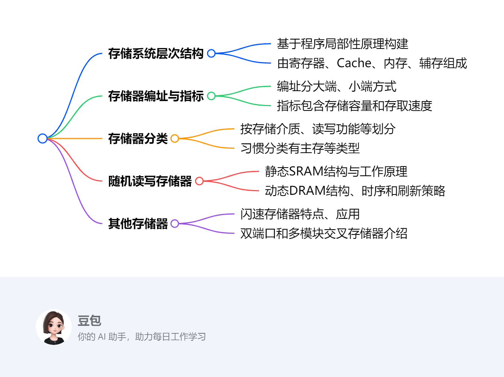
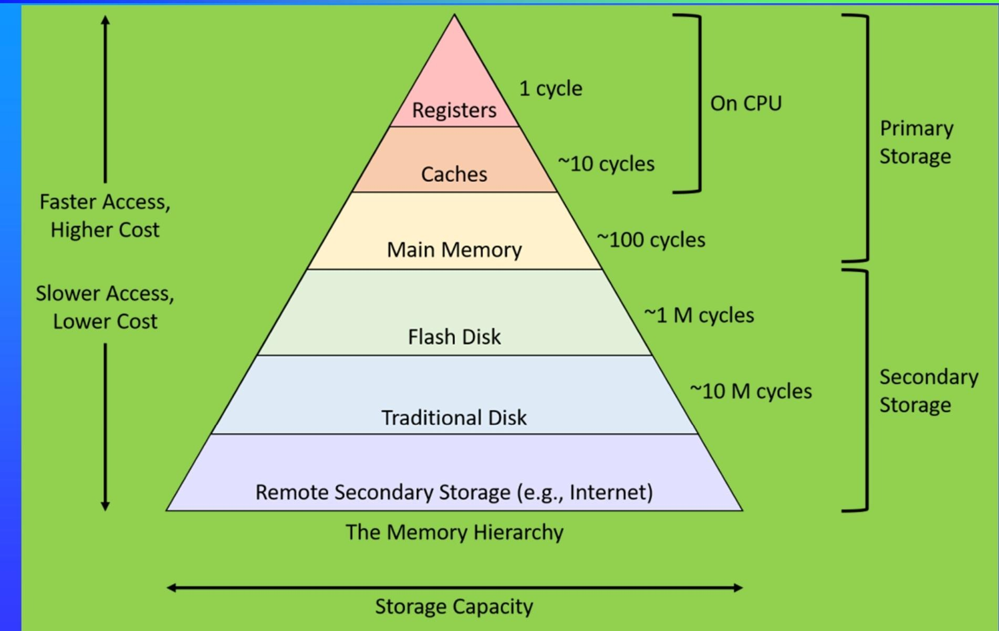

# 第三章：储存系统
## 概述
---
### 一段话总结
本文围绕计算机存储系统展开，**存储系统基于程序局部性原理构建层次结构**，包含寄存器、Cache、内存、辅存等。**内存技术指标有存储容量和存取速度** ，其编址方式分大端、小端。**存储器分类多样**，按存储介质、读写功能等划分。**随机读写存储器包括静态和动态两种**，各有其结构、时序和刷新策略。此外，还介绍了**闪速存储器、双端口存储器和多模块交叉存储器**的特点、应用等内容。 

---
### 思维导图

---
### 详细总结
1. **存储系统的层次结构**
    - **原理基础**：依据程序的局部性原理，包括时间局部性和空间局部性，构建存储系统层次结构。
    - **层次组成**：从高到低依次为寄存器、Cache、内存（主存）、辅存（外存）。各级存储的访问速度逐渐变慢、成本降低、容量增大。例如，寄存器访问速度小于1ns，Cache访问时间为1 - 5ns，内存访问时间为10 - 50ns，Flash Disk访问时间为0.1ms，Traditional Disk访问时间为10ms 。
2. **内存储器的相关知识**
    - **编址方式**：有大端（Big - endian）和小端（Little - endian）之分。大端模式下，数据高位存于低地址；小端模式则相反。
    - **技术指标**：主要有存储容量和存取速度，存取速度包括访问时间和存取周期。
    - **分类方式**：分类方式多样，按存储介质、与CPU的耦合程度、读写功能、掉电后信息保持情况、数据存取随机性、访问串并行性、时钟特性、访问方式、信息储存方法、功能等进行分类。习惯上分为主存等。
    - **总体结构**：主存由控制总线、控制电路、存储体、读写电路、MDR（数据寄存器）、驱动器、译码器、MAR（地址寄存器）等组成。
    - **随机读写存储器**
        - **静态随机存取存储器（SRAM）**：有其特定的结构，包括地址反相器、译码器、驱动器、存储矩阵等。可进行位扩展、字扩展和字位扩展。读、写周期各有相应时序。
        - **动态随机存取存储器（DRAM）**：管脚信号有A0 - A9、RAS、CAS等。具有刷新控制与定时电路，刷新策略有集中式刷新和分散式刷新。读、写、刷新周期均有时序要求。
3. **其他存储器**
    - **闪速存储器（Flash Memory）**
        - **技术分类**：主要有线性闪存和非线性闪存（NOR flash和NAND flash）。两者在读写、擦除、编程、接口方式、信息存储可靠性、可擦除次数和适用场景等方面存在差异 。
        - **组织结构与操作**：有特定的组织结构和逻辑结构，操作包括读、写、保持、输出禁止、复位等，各操作对应不同的控制信号组合。
    - **双端口存储器**：有两个独立端口可同时访问，逻辑结构包含两个地址寄存器、译码器、存储体等。读写控制方式分无冲突和有冲突两种，有冲突时需进行仲裁。
4. **总结**：计算机存储系统的层次结构设计，旨在平衡速度、成本和容量。不同类型存储器的特性差异，决定了它们在系统中的不同应用场景。随着技术发展，存储系统不断优化，以满足计算机性能提升的需求。 
---
### 关键问题
1. **程序局部性原理如何影响存储系统的层次结构设计？**
    - 答案：程序局部性原理包含时间局部性和空间局部性。时间局部性指程序中近期被访问的信息可能再次被访问，空间局部性指被访问的信息附近的数据也可能被访问。基于此，存储系统将访问速度快、容量小、成本高的寄存器和Cache放在靠近CPU的位置，用于存储近期频繁访问的数据和指令；而将访问速度慢、容量大、成本低的内存和辅存放在下层，存储大量不常立即访问的数据。这样的层次结构能利用程序局部性，提高存储系统的整体访问效率。
2. **NOR flash和NAND flash的主要区别有哪些？**

|比较项目|NOR flash|NAND flash|
|---|---|---|
|读操作|快速随机读|以页为单位读|
|在线执行指令|支持|不支持|
|擦除方式|以区块（sector）或芯片为单位|以块（block）为单位|
|编程方式|以字为单位|以页为单位|
|接口方式|独立的DB和AB|DB、AB复用|
|信息存储可靠性|高|低|
|可擦除次数|较少|约为NOR flash的10倍|
|适用场景|适用于擦除和编程操作较少而直接执行代码的场合，不适用于纯数据存储和文件存储|适用于高容量存储设备，增加控制器后也可用于程序存储|

3. **双端口存储器在读写控制方面，无冲突和有冲突的情况有何不同？**
    - 答案：无冲突时，双端口存储器的两个端口可根据不同的读写控制信号组合，独立进行数据读写操作，如不同的字节读写、数据写入和读出等。而有冲突时，当两个端口试图同时访问同一存储单元，就需要进行仲裁。仲裁方式包括控制仲裁和地址仲裁，通过BUSY信号等机制来协调访问顺序，避免数据冲突，确保存储系统的正常运行。 
## 存储系统的层次结构
该部分内容主要围绕计算机存储系统的层次结构展开，包括其发展背景、原理基础、组成结构以及典型案例，具体如下：

1. **发展背景**：早期计算机系统对存储容量和访问速度要求不高，如20世纪70年代中型机的存储器为十几kB，个人计算机操作系统MS - DOS的存储为1MB。近年来，随着软件复杂度提高、多媒体和网络技术普及，对存储容量需求不断增加；同时CPU工作速度提升，且比内存速度提高更快，而存储器价格较高，在整机成本中占比较大，因此需要在成本和性能间寻求平衡策略，即存储器分层。
2. **原理基础**：程序的局部性原理是存储系统分层的重要依据。该原理指在一段时间内，程序访问的存储器地址集中在较小范围内。其中，时间局部性指最近被访问的信息很可能再次被访问；空间局部性指最近被访问信息临近的信息也可能被访问。
3. **组成结构**
    - **基本组成**：存储系统层次结构由寄存器、Cache、主存、辅存（外存）构成 。CPU内部寄存器速度高但数量少。内存速度高、容量小、价格高，由半导体器件构成；外存速度低、容量大、价格便宜 。
    - **多级存储体系**：三级存储体系由高速缓冲存储器（cache）、主存、辅存组成，内存包含cache和主存。cache主要解决速度问题，外存主要满足存储容量需求，整个存储系统追求接近cache的速度、外存的容量和价格，实现高性价比 。此外，还有一级（L1）cache、二级（L2）cache、三级（L3）cache，以及指令cache（I - cache）和数据cache（D - cache）。
4. **典型案例 - 鲲鹏920处理器片上系统**：其存储系统采用多级Cache的片内共享L3 Cache架构。每个内核有私有的64KB L1 I - Cache、64KB L1 D - Cache和512KB L2 Cache；每个超级内核集群配置共享L3 Cache，L3 Cache数据块位于内核集群外，标记块集成在每个内核集群中，可降低监听延迟，此外还包括主存和硬盘。 
## 内存储器的编址方式
该节内容主要介绍了存储器访问和内存的主要技术指标，具体如下：

1. **存储器访问**：存储器访问每次读写信息量的方式有字寻址、半字寻址和字节寻址。字寻址每次访存读写一个存储字，半字寻址每次访存读写半个存储字，字节寻址每次访存读写一个字节，此处字长设定为4字节。
2. **内存的主要技术指标**
    - **存储容量**：指存储器可存储信息的字节数或比特数，通常表示为“存储字数×存储字长” ，即存储单元数与每单元的比特数的乘积。例如，1M比特的存储器可组织成1M×1比特、128K×8比特、256K×4比特等形式。
    - **存取速度**
        - **访问时间（存取时间）TA**：是从存储器接收到读/写命令到信息被读出或写入完成所需的时间，它取决于存储介质的物理特性和寻址部件的结构。
        - **存取周期TM**：在存储器连续读写过程中，一次完整的存取操作所需的时间，也是CPU连续两次访问存储器的最小时间间隔。
        - **数据传送速率（频宽）BM**：单位时间内能够传送的信息量。若系统的总线宽度为W bit，其计算公式为BM = W/TM（b/s）。 
## 存储器的分类
该节内容主要介绍了存储器的多种分类方式，以及内存储器的习惯分类，具体如下：

1. **按存储介质分类**：分为半导体存储器、磁介质存储器、光存储器。半导体存储器常见于计算机内存；磁介质存储器如磁盘；光存储器如光盘。
2. **按与CPU的耦合程度分类**：可分为内存（包含主存和cache）和外存。内存与CPU直接相连，速度快，用于存储当前正在运行的程序和数据；外存用于长期存储大量数据，速度相对较慢，如硬盘、U盘等。
3. **按读写功能分类**：包括读写存储器（RWM）和只读存储器（ROM）。读写存储器允许对其存储内容进行读取和写入操作；只读存储器中的内容一般只能读取，不能随意写入，常用于存储固定的程序或数据。
4. **按掉电后信息保持情况分类**：有易失性（挥发性）存储器和非易失性（不挥发）存储器。易失性存储器在断电后存储的信息会丢失，如常见的内存；非易失性存储器断电后信息仍能保存，如硬盘、ROM等。
5. **按数据存取随机性分类**：分为随机存取存储器（RAM）、顺序存取存储器（SAM）和直接存取存储器（DAM）。随机存取存储器可随机访问存储单元，访问时间与存储单元位置无关；顺序存取存储器只能按顺序依次访问存储单元；直接存取存储器对存储单元的访问介于随机存取和顺序存取之间，可直接快速定位到存储区域，但在区域内仍需顺序查找。
6. **按访问串并行性分类**：有并行存取存储器和串行存取存储器。并行存取存储器能同时对多个存储单元进行读写操作，速度快；串行存取存储器则依次对存储单元进行读写，速度相对较慢。
7. **按时钟特性分类**：分为同步存储器和异步存储器。同步存储器的操作与时钟信号同步，按固定的时钟周期进行读写；异步存储器的操作不依赖时钟信号，根据控制信号和数据的状态进行读写。
8. **按访问方式分类**：包括按地址访问的存储器和按内容访问的存储器（CAM，即相联存储器）。按地址访问的存储器通过指定地址来访问存储单元；相联存储器按存储内容的特征进行访问，常用于高速缓存和快速查找等场景。
9. **按半导体存储器信息储存方法分类**：分为静态（static）存储器和动态（dynamic）存储器。静态存储器利用触发器存储信息，只要电源正常，信息就能稳定保存；动态存储器利用电容存储信息，需要定期刷新以保持信息的正确性 。
10. **按功能分类**：有系统存储器、显示存储器、控制存储器等。系统存储器用于存储计算机系统运行所需的程序和数据；显示存储器用于存储显示设备所需的图像数据；控制存储器用于存储微程序等控制信息。
11. **内存储器的习惯分类**
    - **RAM（易失性半导体读写存储器）**：包括静态RAM（SRAM）和动态RAM（DRAM）。SRAM速度快，但成本高、集成度低；DRAM成本低、集成度高，但速度相对较慢，常见的有FastPage DRAM、SDR SDRAM、DDR SDRAM等。
    - **ROM（非易失性半导体只读存储器）**：包括掩膜ROM（MASK ROM）、可编程ROM（PROM）  。PROM又分为一次性可编程ROM（OTP ROM）和可擦除PROM（EPROM）  。EPROM包括紫外线擦除EPROM（UV EPROM）和电擦除EPROM（EEPROM，E²PROM）  ，还有闪速存储器（FLASH ROM），如NOR Flash和NAND Flash等。 