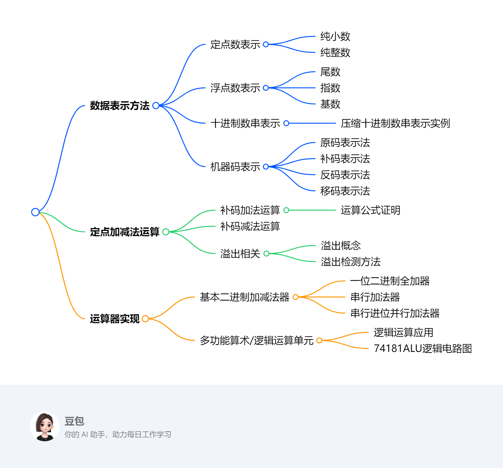

# 第二章：运算方法和运算器
---
### 一段话总结
文档围绕计算机组成原理中运算方法与运算器展开。介绍了数据的多种表示方法，如**定点数（纯小数、纯整数）、浮点数、十进制数串**，以及**原码、补码、反码、移码**等机器码表示法及其特点、相互关系。还阐述了**定点加减法运算**（补码加法、减法及溢出检测方法），并详细介绍了**运算器的实现**，包括不同类型的二进制加减法器（一位二进制全加器、串行加法器、串行进位并行加法器等）以及**多功能算术/逻辑运算单元**，最后布置了作业。

---
### 思维导图

---
### 详细总结
1. **数据表示方法**
    - **定点数**：分为纯小数和纯整数，通过符号和尾数表示，有一定表示范围。
    - **浮点数**：由尾数、指数和基数组成，机器浮点数也按此构成。
    - **十进制数串**：介绍了压缩十进制数串表示实例。
    - **机器码**：
      - **原码**：有数学定义和表示特点，0有两种编码，可表示的数范围正负对称。
      - **补码**：通过时针退格等例子引入，有数学定义，负数补码可由反码加1得到，符号位在加减运算时可当数值看待，0有唯一编码，可表示的负数比正数多一个最小值 。
      - **反码**：有数学定义，与补码关系为同一个负数的补码和反码最低有效比特差1，可通过反码求补码。
      - **移码**：与真值有关，符号位表示规律与其他码相反，与补码仅差符号位，尾码相同，0有唯一编码。
2. **定点加减法运算**
    - **补码加法**：有运算公式证明过程，在计算机运算中起重要作用。
    - **补码减法**：基于补码加法原理进行运算。
    - **溢出**：介绍溢出概念，以及定点数运算溢出检测方法，以避免运算错误。
3. **运算器实现**
    - **基本二进制加减法器**：
      - **一位二进制全加器**：是运算器基础组成部分。
      - **串行加法器**：按位依次进行运算。
      - **串行进位并行加法器**：介绍其结构、工作方式、延迟，以及进位产生和传递函数，还有不同分组方式（如4位先行进位、位单级分组、两级分组等）的先行进位并行加法器 。
    - **多功能算术/逻辑运算单元**：以74181ALU为例，介绍其逻辑电路图和功能，可实现逻辑运算和算术运算。
4. **其他内容**：包含课堂练习、考研综合应用题、实验一运算器组成，最后对第二章第一部分进行小结、布置作业。
---
### 关键问题
1. **原码、补码、反码和移码在表示范围上有何不同？**
    - 原码和反码可表示的数的范围正负对称；补码和移码可表示的负数比正数多一个（最小值）。例如，在n位机器码中，原码和反码表示范围是$-(2^{n - 1}-1)$到$+(2^{n - 1}-1)$，补码表示范围是$-2^{n - 1}$到$+(2^{n - 1}-1)$，移码与补码表示范围相同，但符号位表示不同。
2. **补码加法运算公式的证明思路是什么？**
    - 补码加法运算公式证明基于补码的定义和模运算原理。以整数为例，两个数$X$和$Y$的补码相加，通过将补码转换为真值进行加法运算，再将结果转换回补码，结合模运算（如以$2^n$为模 ），证明其与直接用补码相加的结果一致。
3. **串行进位并行加法器和先行进位并行加法器的主要区别是什么？**
    - 串行进位并行加法器进位信号是逐位传递的，延迟较大；先行进位并行加法器通过进位产生和传递函数，提前计算进位，实现更快的运算速度。例如4位先行进位部件，能同时产生多个进位信号，减少进位延迟，而串行进位并行加法器进位是从低位向高位依次传递，每一位都要等待前一位的进位信号。 

## 数据的表示方法及其机器存储
该文档围绕计算机数据的表示方法及其机器存储展开，涵盖了多种数据表示形式及相关概念，具体如下：

### **定点数表示方法**
- **分类**：分为纯小数和纯整数。
- **构成**：由符号和尾数组成。符号位用于表示数的正负，尾数则表示数的具体数值部分 。
- **表示范围**：受位数限制，有一定的取值区间，超出该范围会出现数据表示错误。
### **浮点数表示方法**
- **构成**：由尾数、指数和基数组成。尾数体现数的有效数字部分，指数决定数的大小范围，基数通常为常数（如2） 。
- **机器浮点数**：依据上述组成构建，在计算机中以特定格式存储和处理，以表示更大范围和精度的数值。

机器浮点数由阶和尾数两大部分组成，各部分都有其特定的作用和表示方式。

1. **尾数**：它是用定点小数或定点整数来表示的，主要作用是给出有效数字，这直接决定了浮点数的表示精度。比如在科学计数法中类似小数部分的概念，像\(1.23\times10^3\)里的\(1.23\) 。尾数部分的位数越多，能表示的有效数字就越多，精度也就越高。在机器浮点数表示中，尾数的数值范围和精度取决于其采用定点小数还是定点整数表示，以及具体的位数设定。
2. **阶**：以整数形式存在，它的关键作用是指明小数点在数据中的位置，进而决定了浮点数的表示范围。仍以科学计数法为例，\(1.23\times10^3\)中的\(3\)就类似于浮点数中的阶。如果阶码是较大的正数，那么整个浮点数表示的数值就会很大；若阶码是较小的负数，浮点数表示的数值就会很小。在机器浮点数的表示形式“ES E1 E2 … Em M1 M2 … MnMS”中，“ES E1 E2 … Em”这部分表示阶码，其中“ES”是阶符，用来确定阶码的正负；“M1 M2 … MnMS”表示尾数，“MS”是尾符，确定尾数的正负。通过阶码和尾数的共同作用，机器浮点数能够灵活表示不同范围和精度的数值 。 
### **十进制数串表示方法**
介绍了压缩十进制数串表示实例，这是一种在计算机中表示十进制数的方式，通过特定的编码规则将十进制数转换为适合机器存储的形式，提高数据处理效率。

1. **字符串形式（非压缩型）**：这种表示方法是一个字节存放一个十进制的数位或符号位。例如数字“1234” ，在计算机存储中就是每个字节分别存放字符“1”“2”“3”“4”。其优点是与ASCII码兼容，这意味着在处理文本和数字混合的场景时，无需复杂的转换操作，便于计算机系统统一处理。因为ASCII码是计算机中广泛使用的字符编码标准，许多文本处理和输入输出设备都遵循该标准，所以这种表示方式在文本处理相关的应用中具有优势。
2. **压缩的十进制数串形式**：该方法一个字节存放两个十进制的数位，每个数值位数占用半个字节，采用BCD码（Binary - Coded Decimal，二进制编码的十进制数）表示。符号位占半个字节，利用四位编码中的六种冗余值来表示。 具体约定符号位存放在最低数字位之后，用12（c，即二进制1100）表示正号，13（d，即二进制1101）表示负号，并且要求数值位数与符号位数之和必须为偶数。 例如，“+123”表示为“0001 0010 0011 1100” ，“-12”表示为“0000 0001 0010 1101”。这种表示方式既节省存储空间，相较于非压缩型，同样表示一组十进制数，占用的字节数更少；又便于直接完成十进制数的算术运算，无需在运算前将十进制数转换为其他进制，提高了运算效率 。 
### **数的机器码表示**
#### **原码表示法**
有明确的数学定义，其特点是符号位明确表示正负，数值部分为真值的绝对值 ，易于理解但在运算时存在不便。
#### **补码表示法**
给出数学定义，在计算机运算中应用广泛。通过特定规则计算，可将减法转换为加法，简化运算过程，提高运算效率。
#### **反码表示法**
有相应数学定义，与补码关系紧密，同一个负数的补码和反码仅在最低有效比特上差1，可通过反码求补码，即符号位置1，其余各位按位取反，然后在最末位上加1。
#### **移码表示法**
移码与真值存在特定关系，符号位表示规律与原码、补码、反码相反，且移码与补码仅差符号位，常用于表示浮点数的指数部分，方便比较大小。
该节内容主要介绍了移码（增码）表示法，包括其用途、原理、定义、与真值的关系，还通过实例进行说明，并阐述了移码与其他机器码的差异，具体如下：

1. **用途**：移码通常用于表示浮点数的阶。在浮点数体系中，阶的大小决定了数的数量级，移码的应用能简化浮点数运算中对阶码的处理。
2. **原理**：为使所有阶码均为正数，便于操作，对所有阶加上一个固定的正常数，即偏置常数。一般选择偏置常数的值为最负阶的绝对值。若用\(n\)位整数表示阶（不含符号位），偏置常数为\(2^n\) 。这种方式将原本可能为负的阶码转化为正数，在比较和运算时更方便，无需额外考虑符号位带来的差异。
3. **定义**：对于定点整数\(x_1x_2…x_n\) ，移码定义为\([x]_{移} ＝ 2^n ＋ x\) ，其中\(2^n ＞ x ≥ －2^n\) 。这意味着在移码表示中，通过将真值加上偏置常数\(2^n\) ，得到对应的移码值。
4. **与真值的关系**：移码和真值之间存在特定的对应关系，通过图表可以直观看到，随着真值\(x\)的变化，移码\([x]_{移}\) 也相应变化。例如当阶码数值部分为\(5\)位时，偏置常数为\(2^5\) ，对于不同的真值，按照\([x]_{移} ＝ 2^5 ＋ x\) 计算移码。
5. **实例**：当正数\(x＝＋10101\)时，\([x]_{移} ＝ 1,10101\) （这里逗号前的\(1\)是符号位，因为移码表示正数时符号位为\(1\) ），\([x]_{补} ＝ 010101\) ；当负数\(x＝－10101\)时 ，\([x]_{移} ＝ 2^5 ＋ x ＝ 2^5 － 10101 ＝ 0,01011\) ，\([x]_{补} ＝ 2^6 ＋ x ＝ 2^6 － 10101 ＝ 101011\) 。
6. **与其他机器码的差异**：移码符号位表示规律与原码、补码、反码相反。并且移码与补码仅差符号位，这一特性使得在某些运算和转换中，移码和补码之间存在特定的关联和转换方式 。 

### **机器码相关运算及特性**
包括机器码右移位、补码位数扩展等操作，这些操作在数据处理和运算过程中起着重要作用，影响着数据的表示和运算结果。还通过实例展示了机器码的表示范围和最值，帮助理解不同机器码在表示数值时的特点和限制。 

## 定点数运算
该节内容主要介绍了定点数运算中的溢出检测方法，包括单符号位法和变形补码法，具体如下：

1. **单符号位法**
    - **正溢和负溢判断**：正溢是指最高有效位有进位而符号位无进位；负溢是指最高有效位无进位而符号位有进位。
    - **溢出检测逻辑表达式**：使用\(V = C_f⊕C_0\)来检测溢出。其中，\(C_f\)是符号位产生的进位，\(C_0\)是最高有效位产生的进位。通过该表达式，可以方便地判断定点数运算是否发生溢出。例如，当\(C_f\)和\(C_0\)不同时，即异或结果为1时，表示发生溢出；反之则未溢出。
2. **变形补码法**
    - **基本概念**：采用双符号位“变形补码”（模4补码），两个符号位均当作数值一样参加运算，运算法则为\([x]_{补}+[y]_{补}=[x + y]_{补} (mod 4)\) ，其数学定义基于同余式\([x]_{补} ＝4＋x (mod 4)\) 。
    - **符号位判断规则**：任何小于1的正数，符号位为00；任何大于－1的负数，符号位为11。若结果的符号位出现“01”或“10”，则表示发生溢出，且最高符号位永远表示结果的正确符号。
    - **溢出检测规则与表达式**：运算结果的两个符号位相异时，表示溢出；两个符号位相同时，表示未溢出。溢出逻辑表达式为\(V＝S_{f1}⊕S_{f2}\) ，其中\(S_{f1}\)和\(S_{f2}\)分别为最高符号位和第二符号位。通过这个表达式，可以快速判断运算结果是否溢出。
    - **实例**：在例17中，已知\(x＝＋0.1100\) ，\(y＝＋0.1000\) ，计算得到\([x + y]_{补}=01.0100\) ，两个符号位为“01”，表示已经溢出。在例18中，已知\(x＝－0.1100\) ，\(y＝－0.1000\) ，计算得到\([x + y]_{补}=110.1100\) ，两个符号位为“10”，同样表示已经溢出。 

## 运算器的实现: 基本二进制加减法器
### 一位二进制全加器
该内容主要围绕一位二进制全加器展开，介绍了其功能、输入输出信号、真值表以及逻辑表达式，具体如下：

1. **功能**：一位二进制全加器用于对两个操作数的一个二进制位进行求和运算。
2. **输入输出信号**
    - **输入信号**：有三个，分别是第\(i\)位加数\(A_{i}\)、\(B_{i}\)以及进位输入\(C_{i}\)。
    - **输出信号**：有两个，第\(i\)位全加和\(S_{i}\)以及第\(i\)位向第\(i + 1\)位的进位\(C_{i+1}\)。
3. **真值表**：通过列举\(A_{i}\)、\(B_{i}\)、\(C_{i}\)所有可能的取值组合（共8种），给出了相应的\(S_{i}\)和\(C_{i+1}\)的输出结果 。例如当\(A_{i}=0\)、\(B_{i}=0\)、\(C_{i}=0\)时，\(S_{i}=0\)，\(C_{i+1}=0\)；当\(A_{i}=1\)、\(B_{i}=1\)、\(C_{i}=1\)时，\(S_{i}=1\)，\(C_{i+1}=1\)。
4. **逻辑表达式**：给出了一位全加器逻辑表达式相关内容，但原内容表述不太清晰完整。一般来说，\(S_{i}=A_{i}\oplus B_{i}\oplus C_{i}\)（其中\(\oplus\)表示异或运算），\(C_{i+1}=(A_{i}B_{i})+(A_{i}C_{i})+(B_{i}C_{i})\)  ，这些逻辑表达式是基于真值表推导得出，用于从输入信号准确计算出输出信号。 

### 典型门电路的逻辑符号和时间延迟

### 串行和并行加法
该内容主要介绍了串行进位并行加法器和先行进位加法器相关知识，包括延迟计算、进位函数、不同类型加法器的结构及延迟对比，具体如下：

1. **串行进位并行加法器延迟**
    - **考虑溢出检测**：延迟\(t_a=(2n + 9)T\) ，其中\(n\)为加法器的位数，\(T\)为门电路的时间延迟。
    - **不考虑溢出检测**：延迟\(t_a=(2n + 7)T\)。
    - **提高运算速度方法**：选择高速器件、改进全加器的组织、改为并行进位。
2. **进位产生和传递函数**
    - **函数定义**：\(G_i = A_iB_i\)为进位产生函数（本地进位） ，\(P_i = A_i\oplus B_i\)为进位传递函数（进位条件） ，\(P_iC_i\)为传送进位（条件进位 ） ，\(C_{i + 1}=G_i + P_iC_i\)。
    - **进位规律**：只有\(A_i = B_i = 1\)时，本位才向高位进位；当\(A_i≠B_i\)时，低一位的进位将向更高位传送；传送进位和本地进位不可能同时为1。
    - **递推公式**：依公式递推，所有进位可从最低进位\(C_0\)直接求得，先行进位逻辑的总时间延迟为\(5T\) 。
3. **先行进位加法器**
    - **4位先行进位（超前进位）部件**：通过公式计算各进位，延迟时间为\(2T\)（不含求\(P_i\)的时间） 。
    - **16位单级分组先行进位并行加法器**：由4个4位CLA组成，总延迟时间（含溢出判断）为\(14T\) ，串行进位16位加法器总延迟时间为\(41T\) 。
    - **两级分组16位先行进位加法器（并 - 并行进位方式）**：组内并行、组间并行，通过组间先行进位逻辑公式计算进位 ，组内先行进位部件延迟时间为\(2T\)（不含求\(P_i\)的时间） 。
    - **32位进位选择加法器**：未详细介绍工作原理，仅给出名称 。 

## 定点除法运算
该部分内容围绕逻辑运算及多功能算术/逻辑运算单元展开，具体如下：
1. **逻辑运算**
    - **运算规则**：仅在无符号数之间进行，与算术运算不同，逻辑运算只在对应位间进行，各位无进位/借位关系。
    - **基本运算类型**
      - **逻辑非（逻辑反）**：对操作数按位取反。
      - **逻辑加（逻辑或）**：只要对应位中有一个为1，结果位就为1，即\(1∨x = 1\)，\(0∨x = x\)。可用于将一个数的某些指定比特置1，如\(a ∨01000010\)能将\(a\)的第1和第6位置1 。
      - **逻辑乘（逻辑与）**：只有对应位都为1时，结果位才为1，即\(1 ∧ x = x\)，\(0 ∧ x = 0\)。可用来将一个数的某些指定比特清0，例如\(a ∧ 10111101\)可将\(a\)的第1和第6位清0。
      - **逻辑异（逻辑异或，按位加）**：对应位不同时结果为1，相同时为0，即\(1⊕x = x\)，\(0 ⊕ x = x\)。能把一个数的某些指定比特取反，像\(a ⊕ 01000010\)可将\(a\)的第1和第6位取反。
2. **多功能算术/逻辑运算单元**
    - **ALU概述**：ALU即算术逻辑单元，这里介绍的是4位多功能ALU——74181。它能进行算术运算，采用4位先行进位方式，输出\(Cn+4\)、\(P\)、\(G\)，支持组间串行进位或组间先行进位。
    - **逻辑表达式**：一位算术/逻辑运算单元有其特定逻辑表达式，如\(Fi＝Xi⊕Y i⊕Cn+i\)用于计算本位结果，\(Cn+i+1 =X i Y i +Y i Cn+i +C n+iX i\)用于计算下一位进位。还给出了\(Xi\)、\(Yi\)的逻辑表达式，通过不同的选择信号组合确定其值。
    - **功能表**：74181功能表展示了不同输入组合下的运算结果。\(M\)信号控制是逻辑运算还是算术运算（\(M = H\)为逻辑运算，\(M = L\)为算术运算） ，\(Cn\)表示是否有进位（\(Cn = 1\)无进位，\(Cn = 0\)有进位）。
    - **逻辑电路图**：给出74181的逻辑电路图，其中函数发生器根据输入和控制信号产生相应运算结果。还提及74182 BCLA的逻辑电路图以及三级分组“并 - 并 - 串”先行进位并行ALU，它们在复杂运算中起到优化和扩展功能的作用 。 