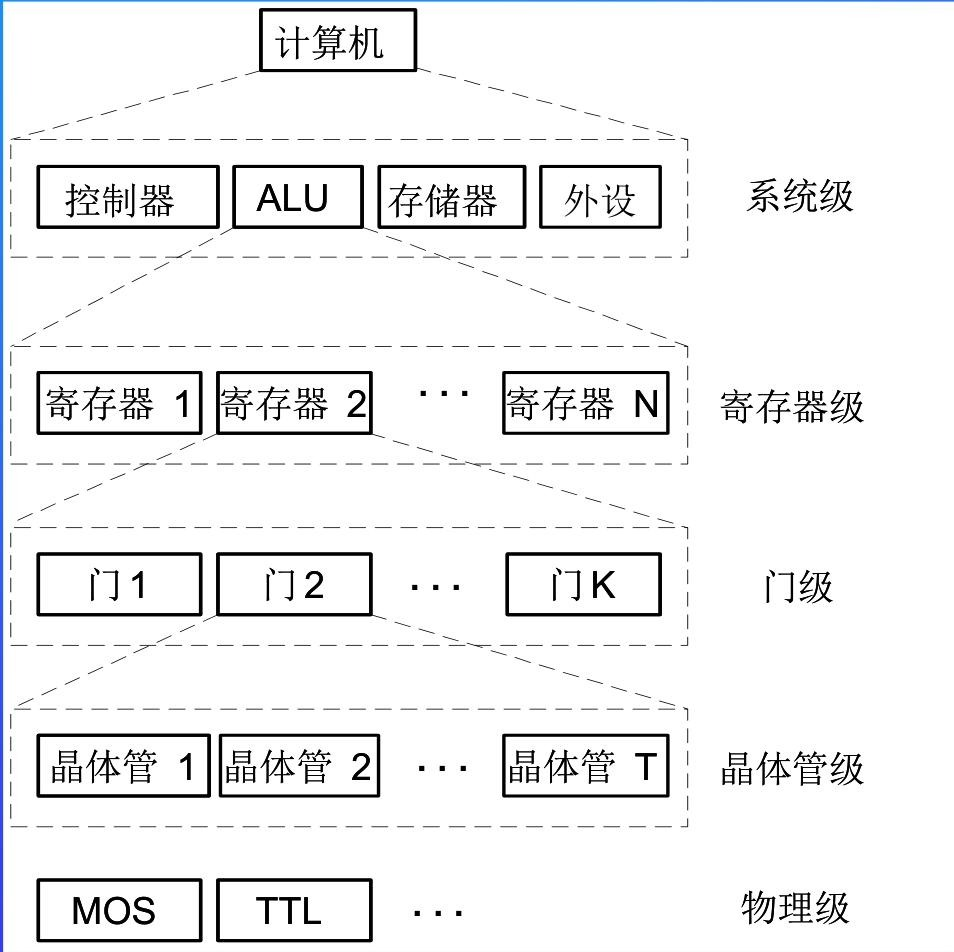
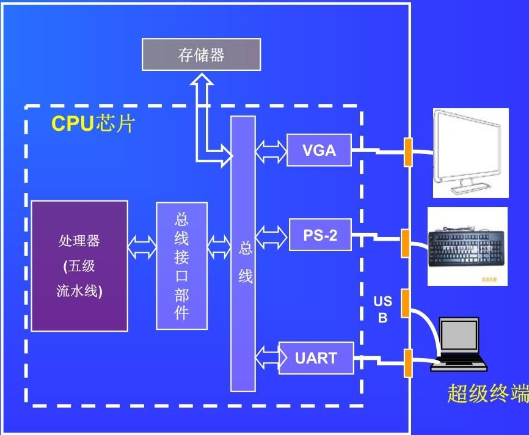
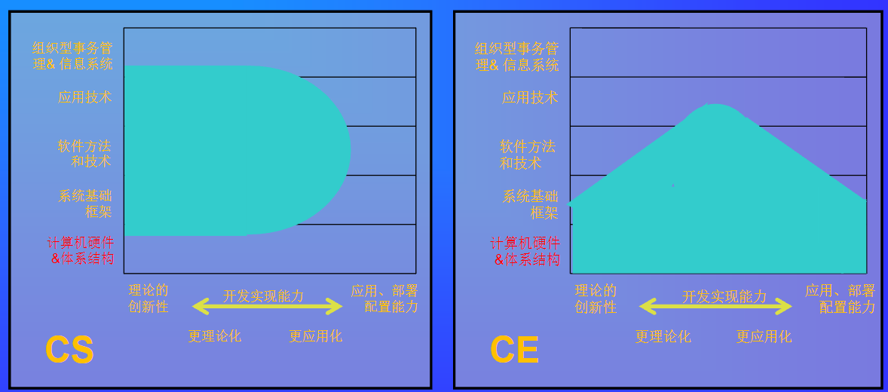

# 课程总览
该文档围绕计算机组成原理课程展开，涵盖课程内容、性质、教学相关信息等多个方面，为理解该课程提供了全面指引。

1. **课程基本信息**
    - **课程内容**：研究计算机内部构造、硬件及软硬件接口，涉及系统基本组成、工作原理、逻辑实现、设计方法等。
    - **课程性质**：计算机相关专业的核心专业基础课，在课程体系中起承上启下作用。
2. **课程在专业教学中的地位**
    - **专业课程体系**：在计算机科学与技术、网络工程、数据科学与大数据技术等专业课程体系中，处于关键基础位置，一般在第4学期开设，后续衔接多门专业课程。
    - **考研科目**：自2009年起，成为计算机学科全国硕士研究生入学统一考试专业基础课考试科目之一，占45分。
3. **教学相关信息**
    - **教学目的**：培养学生计算机硬件结构的分析、应用、设计和开发能力，帮助学生了解系统层次化结构，建立整机概念，并为后续课程学习打基础。
    - **教学方法**：以模型机为背景讨论原理，通过“解剖麻雀”方式，结合课堂与实践，处理好抽象概念与实例的关系。
    - **教学形式**：包括课堂教学、作业、实验（课程设计）和课外实践。
    - **成绩评定**：由平时作业、期末考试和实验共同构成。
4. **教材与参考资料**：文字主教材为《计算机组成原理》（第七版），还有文字辅教材、主教材配套资源库，以及其他经典参考教材和考研大纲等资料。
5. **实验设备**：拥有计算机综合实验系统和计算机组成虚拟仿真实验系统，支持处理器设计等实验。 
6. **参考实例**：以鲲鹏处理器为例，帮助学生理解计算机组成原理在实际处理器中的应用。 
