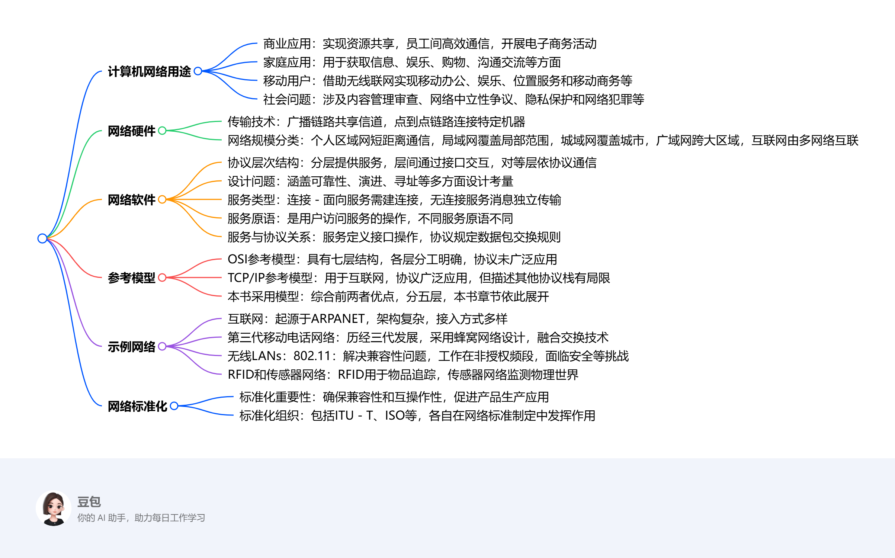
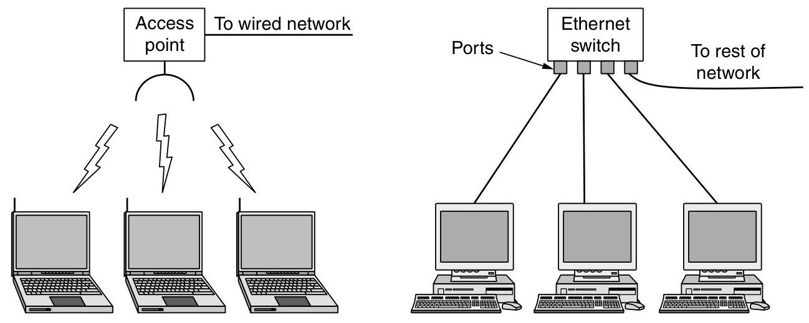
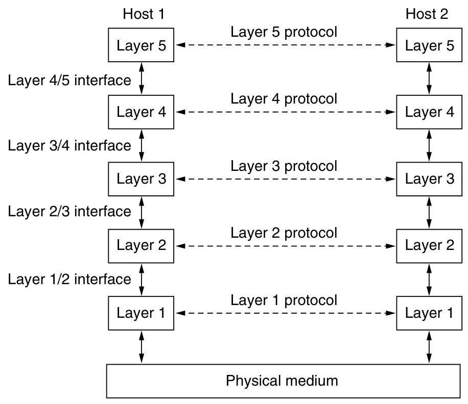
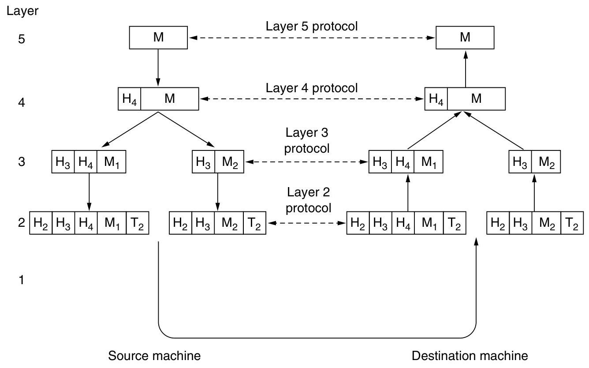
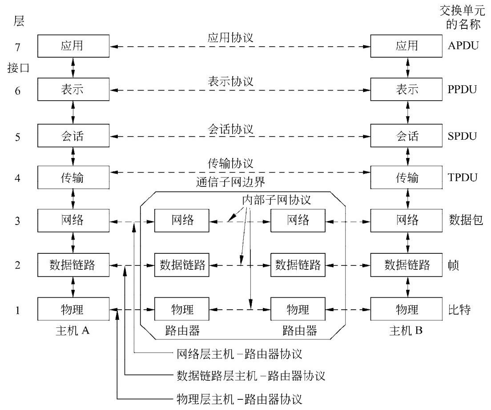

# 1 INTRODUCTION
1. **计算机网络的用途**
    - **商业应用**：公司借助计算机网络实现资源共享，如员工共享打印机、数据库等，通过客户端 - 服务器模型访问远程数据。同时，网络促进了员工间的通信，如电子邮件、IP电话等，还支持电子商务活动，如在线销售和采购。
    - **家庭应用**：人们利用网络获取各类信息，进行娱乐活动，如观看视频、听音乐等，还可通过网络购物、进行电子支付。此外，网络也方便了人与人之间的沟通，如电子邮件、即时通讯等。
    - **移动用户**：移动设备通过无线联网实现多种功能，如移动办公、在线娱乐等。无线热点和蜂窝网络为移动设备提供网络连接，位置相关服务基于移动设备的定位功能实现，移动商务也逐渐兴起。
    - **社会问题**：计算机网络带来了诸多社会问题，如网络内容的管理和审查、网络中立性的争议、隐私保护以及网络犯罪等。不同国家和地区对这些问题的法律规定和处理方式存在差异。
2. **网络硬件**
    - **传输技术**：分为广播链路和点到点链路。广播链路中，多台机器共享通信信道，通过地址字段确定接收方；点到点链路则是连接两台特定机器，信息传输可能需经过多个中间节点。
    - **网络规模分类**：个人区域网用于个人设备间的短距离通信；局域网覆盖范围较小，常用于连接办公室或家庭中的设备；城域网覆盖城市范围；广域网跨越较大地理区域；互联网则是由多个网络互联而成。
3. **网络软件**
    - **协议层次结构**：为降低设计复杂度，多数网络采用分层结构，每一层为上层提供服务，并隐藏服务实现细节。层与层之间通过接口进行交互，不同机器上的对应层遵循特定协议进行通信。
    - **设计问题**：涉及可靠性、网络演进、寻址、网络互联、可扩展性、资源分配、流量控制、服务质量和安全性等方面。
    - **服务类型**：连接 - 面向服务类似电话系统，需先建立连接再传输数据；无连接服务则像邮政系统，每个消息独立传输。两种服务类型各有其适用场景，且都可进一步分为可靠和不可靠服务。
    - **服务原语**：是用户进程访问服务的操作，不同类型的服务具有不同的原语。例如，面向连接的可靠字节流服务可能包含LISTEN、CONNECT等原语。
    - **服务与协议的关系**：服务定义了层与层之间的接口操作，而协议规定了对等实体间交换数据包的规则，二者相互独立又协同工作。
4. **参考模型**
    - **OSI参考模型**：有七层结构，从物理层到应用层，各层功能明确，如物理层负责传输原始比特流，数据链路层处理传输错误等，但该模型的协议在实际中未被广泛应用。
    - **TCP/IP参考模型**：是互联网采用的模型，包含链路层、网络层、传输层和应用层，其协议得到了广泛应用，但模型本身在描述其他协议栈时存在一定局限性。
    - **本书采用的模型**：综合了OSI和TCP/IP模型的优点，分为物理层、链路层、网络层、传输层和应用层，各层分工明确，本书章节顺序以此模型为基础展开。
5. **示例网络**
    - **互联网**：起源于ARPANET，经历了多个发展阶段，如今已成为全球最大的网络。其架构包括ISP网络、IXP等，网络接入方式多样，数据传输依赖于各种协议和技术。
    - **第三代移动电话网络**：发展历经三代，从模拟语音到数字语音和数据传输。采用蜂窝网络设计，核心网络融合了电路交换和分组交换技术，同时注重安全和隐私保护。
    - **无线LANs：802.11**：为解决无线设备联网兼容性问题而制定的标准。工作在非授权频段，采用多种技术提高传输速率和抗干扰能力，同时面临着安全和移动性等方面的挑战。
    - **RFID和传感器网络**：RFID使日常物品可接入网络，用于物品追踪等；传感器网络用于监测物理世界，由众多传感器节点组成，节点间通过自组织方式进行通信。
6. **网络标准化**
    - **标准化的重要性**：网络标准化确保不同设备和系统间的兼容性和互操作性，促进产品的大规模生产和应用。标准分为事实标准和法定标准，前者如HTTP，后者由正式标准化组织制定。
    - **标准化组织**：包括ITU-T、ISO、IEEE和IAB等，它们在不同领域和层面推动网络标准的制定和发展，各自发挥着重要作用 。 

Computer Networks（计算机网络）和Distributed system（分布式系统）有明显区别但也存在重叠，具体对比如下：

- **定义与表现形式**：
    - **计算机网络**：是由单一技术互联的自治计算机集合，用户直接接触实际机器。若机器硬件和操作系统不同，用户能明显感知。例如用户想在远程机器上运行程序，需登录该机器进行操作。
    - **分布式系统**：是在用户看来像单个连贯系统的独立计算机集合，通常基于单一模型或范式，由操作系统之上的中间件实现。如万维网，运行在互联网之上，向用户呈现的模型中所有内容都类似文档（网页）。
- **软件层面差异**：分布式系统是构建于网络之上的软件系统，其软件赋予系统高度的内聚性和透明性，用户无需关注底层实现细节；而计算机网络本身不具备这种统一的软件层面的连贯性和模型，软件层面相对分散。所以二者的区别主要在于软件（尤其是操作系统），而非硬件。
- **功能重叠与区别**：在文件传输等功能上，二者存在重叠。但在文件传输的调用主体上有区别，计算机网络中文件传输通常由用户发起；而分布式系统中，系统会基于自身的逻辑和需求来调用文件传输，对用户而言相对透明。 
## Network Hardware
### Transmission Technology and Scale
- **Unicasting（单播）**：可用于点到点网络和广播网络，是从一个发送方到一个特定接收方的通信方式，像两台计算机间的文件传输。
- **Broadcasting（广播）**：属于广播网络，一个发送方的数据包会被网络中所有机器接收，如局域网内的通知消息发送。
- **Multicasting（多播）**：通常用于广播网络，发送方将数据包发给多播组内所有成员，如在线直播数据发送。
- **Anycasting（任播）**：在广播网络和点到点网络都能实现，把数据包发送给一组接收方中的任意一个，如CDN中请求被发送到最近的服务器。 
### Classification by Scale
| Interprocessor distance | Processors located in same | Example Personal area network |
| --- | --- | --- |
| 1 m | Square meter | Personal area network |
| 10 m | Room | Local area network |
| 100 m | Building | Local area network |
| 1 km | Campus | Local area network |
| 10 km | City | Metropolitan area network |
| 100 km | Country |  | Wide area network |
| 1000 km | Continent | Wide area network |
| 10,000 km | Planet | Wide area network(The Internet)|

#### Personal Area Networks（PAN）
这段内容主要介绍了个人区域网（PANs），并以蓝牙技术为例展开说明，具体如下：

1. **个人区域网（PANs）概述**：PANs允许设备在个人范围内进行通信，常见例子是连接计算机及其外围设备的无线网络。由于连接计算机和外围设备的线缆安装繁琐，一些公司共同设计了蓝牙这种短距离无线网络来解决该问题。
2. **蓝牙（Bluetooth）**：
    - **产生背景**：为帮助新用户摆脱寻找和连接线缆的困扰，一些公司设计了蓝牙技术。其优势在于设备具备蓝牙功能时，无需线缆连接，操作便捷，开启设备即可协同工作。
    - **应用场景**：除连接计算机及其外围设备外，还常用于无线连接手机和耳机，让数字音乐播放器与汽车连接，以及实现嵌入式医疗设备（如起搏器、胰岛素泵、助听器）与用户操作的遥控器之间的通信。
3. **主从模式（Master-slave paradigm）**：这是蓝牙网络的一种基本架构模式。在该模式下，系统单元（如个人电脑PC）通常作为主设备，鼠标、键盘等则作为从设备。主设备负责控制从设备的运行参数，如告知从设备使用的地址、允许广播的时间、传输时长以及可用频率等 。
4. **其他构建PANs的技术**：除蓝牙外，像智能卡和图书馆书籍上使用的RFID（射频识别）技术，也能用于构建个人区域网，相关内容将在第4章详细学习。 
#### Lacal Area Networks (LAN)
这段内容主要围绕局域网（LAN）展开，包括LAN的定义、分类、传输技术、拓扑结构，以及家庭局域网的相关特点和发展趋势，同时介绍了网络信道的静态和动态分配方式，具体如下：

1. **局域网（LAN）概述**：
    - **定义与用途**：LAN是在家庭、办公室或工厂等单个建筑物内部及周边使用的私有网络，用于连接个人计算机和消费电子产品，实现资源共享和信息交换，企业使用的LAN也叫企业网络。
    - **分类**：分为无线局域网和有线局域网。
        - **无线局域网**：如今非常流行，尤其在难以安装线缆的场所。计算机通过无线调制解调器和天线通信，多数情况下与接入点（AP）设备交互，AP负责在无线计算机之间以及它们与互联网之间转发数据包。计算机距离较近时也可直接进行对等通信。IEEE 802.11（WiFi）是无线局域网的标准，速度范围为11Mbps到数百Mbps。
        - **有线局域网**：使用多种传输技术，多数用铜线，部分使用光纤。其传输速度通常在100Mbps到1Gbps，延迟低、错误少，新型有线局域网速度可达10Gbps。在性能方面优于无线网络。
2. **有线局域网的拓扑结构**：
    - 总线型拓扑结构
        - **结构特点**：如左侧图所示，所有的计算机（节点）都连接到一条共享的电缆（总线）上 ，这条电缆充当传输介质。
        - **工作原理**：任何一个节点发送的信号都可以沿着总线传播，并被总线上的其他所有节点接收。但在同一时刻，只能有一个节点发送数据，否则会产生信号冲突。
        - **优缺点**：优点是结构简单，易于布线和维护，成本较低；缺点是一旦总线出现故障，整个网络就会瘫痪，而且随着节点数量的增加，冲突的概率也会增大，导致网络性能下降。
    - 环型拓扑结构
        - **结构特点**：如右侧图所示，各个计算机（节点）通过通信线路依次连接，形成一个封闭的环。每个节点只与相邻的两个节点相连。
        - **工作原理**：数据在环中沿着一个方向逐节点传输，每个节点接收并转发数据，直到数据到达目标节点。
        - **优缺点**：优点是传输控制机制简单，传输延迟固定；缺点是某个节点或链路出现故障会影响整个网络的通信，并且添加或删除节点时需要中断整个网络。 
3. **家庭局域网**：未来家庭中的所有电器可能都能联网并通过互联网访问，但它与其他网络相比有不同特性，包括设备安装要简单、操作要傻瓜式、价格要低、可扩展性强、安全可靠等。家庭局域网在选择有线还是无线连接上存在争议，也可考虑利用家庭现有的电线网络，但面临同时传输电力和数据信号的难题，不过可通过使用不同频段来解决。
4. **网络信道分配方式**：
    - **典型的静态分配（A typical static allocation）**：将时间划分为离散的间隔，采用循环算法，让每台机器仅在其时间槽到来时进行广播。这种方式在机器无数据发送时会浪费信道容量，因此多数系统倾向于动态分配。
    - **动态分配方式（Dynamic allocation methods）**：分为集中式和分散式。集中式分配由一个实体（如蜂窝网络中的基站）决定下一个传输者，它可以接收多个数据包并依据内部算法确定优先级；分散式分配则没有中央实体，每台机器自行决定是否传输，虽然看似可能引发混乱，但实际上有专门算法维持秩序。 
#### MAN and WAN
##### 广域网（WAN）相关内容总结
1. **WAN的定义与组成**：广域网跨越很大的地理区域，通常覆盖一个国家或大洲。其由通信子网和主机组成，通信子网又包含传输线路和交换元件（如路由器），传输线路用于在机器间传输比特，交换元件负责在数据到达时选择输出线路进行转发。
2. **WAN与LAN的区别**：
    - **所有权不同**：WAN中主机和子网通常由不同人拥有和运营；而LAN一般是企业或个人在有限区域内构建和使用，所有权相对集中。
    - **连接技术不同**：WAN的路由器常连接不同类型的网络技术，如办公室内部是交换以太网，长距离传输可能用SONET链路；LAN通常使用较为单一的技术，如以太网。
    - **连接对象不同**：WAN连接的既可以是单个计算机，也可以是整个LAN；LAN主要连接区域内的各种设备。
3. **WAN的其他类型**：
    - **虚拟专用网络（VPN）**：公司不租赁专用传输线路，而是通过互联网连接各办公室，形成虚拟链路。其优点是资源复用灵活，如添加新办公室较为容易；缺点是对底层资源缺乏控制，网络性能依赖互联网服务质量。
    - **由网络服务提供商（ISP）运营的WAN**：子网由ISP运营，办公室作为客户接入。ISP除连接客户网络外，还连接其他网络以提供完整的互联网服务。
4. **相关关键问题**：在WAN中，当两个不直接相连的路由器通信时，需要通过其他路由器间接进行。网络选择路径的方式涉及路由算法，每个路由器决定下一跳转发的方式涉及转发算法，这些将在第5章详细学习。
5. **使用无线技术的WAN**：
    - **卫星系统**：地面计算机通过天线与卫星进行数据传输，卫星网络具有广播特性，适用于需要广播功能的场景。
    - **蜂窝电话网络**：已历经三代，正向第四代发展。第一代是模拟语音，第二代是数字语音，第三代是数字语音和数据。其基站覆盖范围比无线LAN大，数据速率通常在1Mbps左右，低于无线LAN（可达100Mbps左右）。

##### WAN拓扑结构中的子网、LAN、Host内容
|项目|描述|
|---|---|
|子网（Subnet）|由传输线路和交换元件（如路由器）组成，负责在主机之间传输消息。最初指将数据包从源主机传输到目标主机的路由器和通信线路的集合，在网络寻址中有了新含义（将在第5章讨论）|
|局域网（LAN）|在有限区域（如单个建筑物内）使用的私有网络，用于连接个人计算机和消费电子产品以实现资源共享和信息交换。速度通常在100Mbps - 1Gbps，延迟低、错误少，新型的可达10Gbps。常见类型如以太网，可分为无线和有线，无线的如IEEE 802.11（WiFi），有线的基于铜线或光纤|
|主机（Host）|连接在网络中的计算机或其他具有独立通信能力的设备，运行用户应用程序。在广域网中，是通信子网服务的对象，通过子网实现相互通信|

##### MAN与WAN的区别
|比较项目|城域网（MAN）|广域网（WAN）|
|---|---|---|
|覆盖范围|通常覆盖一个城市|覆盖一个国家或大洲等大范围|
|常见例子|有线电视网络、IEEE 802.16（WiMAX）|连接不同城市公司办公室的网络、卫星网络、蜂窝电话网络|
|网络组成|以有线电视网络为例，由早期社区天线系统发展而来，包含头端设备、传输线缆等；IEEE 802.16包含基站、用户设备等|由通信子网（传输线路和交换元件）和主机组成|
|传输技术|部分基于无线（如IEEE 802.16），部分基于有线（如有线电视网络的同轴电缆或光纤）|传输线路包括铜线、光纤、无线电链路等，技术多样，连接不同类型网络技术|
|与LAN关系|可作为LAN与WAN之间的桥梁，连接多个LAN，扩大网络覆盖范围|可连接多个LAN，也可连接单个计算机|
|应用场景|提供城市范围内的网络接入服务，如有线电视网络用于电视节目传输和互联网接入|满足长距离、跨区域的通信需求，如公司不同城市办公室间的通信、全球范围内的卫星通信和蜂窝电话网络通信| 

## Network Software
### Protocal Hierarchies
#### Network architecture
这段内容围绕网络架构展开，主要介绍了其定义、构成要素、关键特性及相关示例，具体总结如下：

1. **定义**：网络架构是一组层和协议的集合。其规范需包含足够信息，以便开发者为各层编写程序或构建硬件，使其能正确遵循相应协议。
2. **构成要素**：
    - **层**：多数网络采用分层结构，各层基于下层构建，不同网络的层数、层名、内容和功能各不相同。每一层都为上层提供特定服务，同时将服务的具体实现细节对上层屏蔽，类似于虚拟机器。
    - **协议**：当不同机器上的第n层进行通信时，所遵循的规则和约定就是第n层协议。协议是通信双方关于通信方式的约定，如同人际交往中的礼仪规范，违反协议会使通信受阻。
    - **接口**：相邻两层之间存在接口，接口定义了下层为上层提供的基本操作和服务。清晰的接口设计至关重要，它能减少层间传递的信息量，并且便于用新的协议或实现替换某一层，只要新的协议或实现能为上层提供与旧版本相同的服务即可。
3. **关键特性**：网络架构不包含具体的实现细节和接口规范，这些内容隐藏在机器内部，从外部不可见。而且，网络中不同机器的接口无需完全相同，只要每台机器能正确使用所有协议即可。
4. **相关示例**：文中通过哲学家交流的例子，形象地解释了多层通信的概念。哲学家相当于第3层的对等进程，翻译人员相当于第2层的对等进程，秘书相当于第1层的对等进程。哲学家通过翻译和秘书进行跨语言交流，这其中翻译语言的选择相当于第2层协议，秘书传递信息的方式（如邮件）相当于第1层协议，只要接口不变，各层协议可以独立变化。此外，还以五层网络中消息传输为例，说明消息在各层间传递时，会添加头部信息用于标识和控制，进一步体现了网络架构中各层的协作。 

#### Layers, Peers, Protocals, and Interfaces
这段内容围绕网络中的Layers（层）、Peers（对等实体）、Protocols（协议）和Interfaces（接口）展开，介绍了它们的定义、功能和相互关系，具体总结如下：

1. **Layers（层）**：多数网络按分层结构组织，各层基于下层构建，不同网络的层数、名称、内容和功能存在差异。层的主要目的是为上层提供特定服务，并将服务的具体实现细节对上层屏蔽，每一层都类似一个为上层提供服务的虚拟机器。
2. **Peers（对等实体）**：不同机器上对应层的实体被称为对等实体，它们可能是软件进程、硬件设备甚至是人类。对等实体之间通过使用协议进行相互通信。
3. **Protocols（协议）**：当不同机器上的第n层进行通信时，所遵循的规则和约定被统称为第n层协议。协议是通信双方就通信方式达成的一致，违反协议可能导致通信困难甚至无法进行。协议与具体实现和接口规范无关，并且同一系统中不同主机可能使用同一协议的不同实现版本，协议本身也可以在不影响上下层的情况下进行改变。
4. **Interfaces（接口）**：相邻两层之间存在接口，接口定义了下层为上层提供的基本操作和服务。网络设计者在规划网络层数和各层功能时，清晰定义层间接口至关重要。这不仅能减少层间传递的信息量，还使得替换某一层的协议或实现变得更为简便，只要新的协议或实现能为上层提供与旧版本相同的服务即可。 
#### Information flow

#### Virtual Communication of Layer 5 Peers
在五层网络中，各层处理的事务如下：

1. **第五层（应用层）**：运行应用进程，产生消息M并传递给第四层用于传输。
2. **第四层（传输层）**：接收来自第五层的消息，在消息前添加首部以识别消息，首部包含地址等控制信息，便于目的机器的第四层进行消息投递，然后将添加首部后的结果传递给第三层。在很多网络中，第四层协议对传输消息的大小没有限制。
3. **第三层（网络层）**：接收来自第四层的消息，由于第三层协议通常对消息大小有限制，所以需将接收到的消息拆分成较小的单元（数据包），并为每个数据包添加第三层首部。之后，决定数据包从哪条输出线路发送，并将数据包传递给第二层。
4. **第二层（数据链路层）**：接收来自第三层的数据包，不仅为每个数据包添加首部，还添加尾部，然后将处理后的单元传递给第一层进行物理传输。
5. **第一层（物理层）**：负责将数据链路层传来的信息进行实际的物理传输，在接收端，消息从物理层开始向上逐层传递，各层在传递过程中会去除相应的首部信息。

此外，虽然本节主要讨论网络软件，但协议层次结构的较低层（如第一、二层）常由硬件或固件实现，即便如此，其中也涉及复杂的协议算法 。 
### Design Issues for the Layers
该部分内容主要讨论了计算机网络在层次设计方面的关键问题，这些问题贯穿于网络的各个层次，对网络的正常运行、发展和性能起着至关重要的作用，具体内容如下：

1. **可靠性**：网络需保证在组件不可靠的情况下仍能正常运行。通过检错编码发现数据包中的错误比特，利用纠错编码从可能不正确的比特中恢复正确消息，这两种机制都需添加冗余信息。同时，网络要能在源和目的地之间存在多条路径且部分链路或路由器可能故障时，自动选择工作路径，即路由决策。
2. **网络演进**：随着网络的发展，新设计需要与现有网络连接。协议分层是支撑这种变化的关键结构化机制，它将复杂问题分解，隐藏实现细节。此外，网络中每一层都需要标识发送方和接收方的机制，在下层称为寻址，在高层称为命名。不同网络技术存在不同限制，如消息顺序和最大长度差异，这导致了消息编号和分段等解决方案的出现，这些主题综合起来就是网络互联。能在规模变大时仍良好工作的网络设计被称为可扩展的。
3. **资源分配**：网络基于底层资源向主机提供服务，需要分配资源的机制，以避免一台主机过度干扰另一台主机。统计复用是一种常见的资源分配方式，它根据主机的短期需求变化动态共享网络带宽，而非固定分配。在每一层都需要解决流量控制问题，即防止快速发送方用数据淹没慢速接收方，同时还要应对网络超载即拥塞的情况。此外，网络还需为不同需求的应用程序提供服务，如实时传递和高吞吐量需求，这涉及到服务质量的调和机制。
4. **网络安全**：网络需要保护自身抵御各种威胁。保密性机制防止通信被窃听，认证机制用于防止身份假冒，完整性机制防止消息被篡改。这些安全设计大多基于加密技术，在网络的多个层次都有应用。 

### Connection-Oriented and Connectionless Services
该部分主要介绍了计算机网络中下层向上层提供的两种服务类型，即面向连接的服务和无连接的服务，并对两者进行了详细的对比分析，具体内容如下：

1. **面向连接的服务**：这种服务是按照电话系统的模式构建的。在使用前，服务用户需要先建立连接，接着利用该连接传输数据，最后释放连接。其本质如同一个管道，发送方将数据压入管道一端，接收方在另一端按顺序取出数据。在建立连接时，发送方、接收方和子网可能会协商一些参数，如最大消息长度、服务质量等。电路是与资源关联的连接的另一种说法，在电话网络中，一条电路就是通过铜线传送电话交谈内容的路径。
2. **无连接服务**：该服务以邮政系统为模型。每个报文都携带完整的目标地址，由系统中的中间节点独立进行路由。在无连接服务中，存在存储 - 转发交换和直通式交换两种处理方式。存储 - 转发交换是指中间节点在收到报文全部内容后再转发给下一个节点；直通式交换则是在报文未完全接收完毕前就向下一个节点传输。由于报文的路由独立，先发送的报文可能会因延迟而后到达。
3. **服务的可靠性及类型**
    - **可靠的面向连接服务**：适用于对数据准确性和顺序要求较高的应用，如文件传输。它有报文序列和字节流两种变异形式。报文序列能保持报文边界，字节流则没有报文边界。但对于一些对延迟敏感的应用，如IP语音和视频会议，因确认机制引入的延迟是不可接受的。
    - **不可靠的无连接服务**：也称为数据报服务，类似于电报服务，一般不会给发送方反馈确认消息。虽然不可靠，但在大多数网络中是主导的传输形式，因为它无需建立连接，适合一些对可靠性要求不高但追求便捷性的应用，如垃圾邮件发送。
    - **有确认的数据报服务**：这种服务在无连接的基础上增加了确认机制，如同寄挂号信要求回执一样，能让发送方确认报文已送达对方。手机上的文本消息就是这种服务的实例。
    - **请求 - 应答服务**：发送方传输包含请求的数据报，接收方以包含请求结果的应答数据报作为反馈，常用于客户机 - 服务器模型中。
4. **两种服务的对比**：可靠通信和不可靠通信在网络中同时存在。在某些层次，可能无法使用可靠通信，例如以太网就不提供可靠通信，一些可靠服务是建立在不可靠数据报服务之上的。此外，为提供可靠服务引入的延迟在多媒体等实时应用中无法被接受，这也是不可靠通信存在的原因之一。 
### Service Primitives
该部分内容主要介绍了服务原语的概念，以及面向连接服务原语在客户机 - 服务器环境下的工作过程，具体如下：

1. **服务原语的定义**：服务原语是正式说明服务的一组操作，用户进程通过这些原语访问服务。它可告知服务执行某个动作，或向用户报告对等实体所执行的动作。若协议栈位于操作系统中，这些服务原语通常是系统调用，会陷入内核模式，由操作系统控制机器发送必要的数据包。
2. **面向连接服务原语的示例**：以实现可靠字节流的服务为例，介绍了6个常见的服务原语，这些原语与Berkeley套接字接口类似。
    - **LISTEN**：阻塞操作，用于等待入境连接请求。服务器执行该原语，表示已准备好接收入境连接，通常实现为阻塞的系统调用，执行后服务器进程被阻塞，直至有连接请求到来。
    - **CONNECT**：用于与等待中的对等实体建立连接请求。客户进程执行此原语时，需指定要连接的服务器地址，操作系统会向对方发送请求建立连接的数据包，之后客户进程被挂起，直到收到应答。
    - **ACCEPT**：用于接受来自对等实体的入境连接请求。当服务器收到连接请求包，且存在监听进程时，操作系统会解除监听进程的阻塞，并用该调用创建连接，然后向客户进程发送响应。
    - **RECEIVE**：阻塞操作，用于等待入境报文。服务器从LISTEN的阻塞状态被释放后，通常会马上执行该原语，此时它会再次被阻塞，直到收到客户的请求。
    - **SEND**：用于给对等实体发送一个报文。客户执行该原语发送请求，服务器收到请求后解除阻塞并处理，处理完后再通过该原语将请求结果送回给客户。
    - **DISCONNECT**：用于终止一个连接。客户任务完成后，执行该原语终止当前连接，这通常是一个阻塞调用，会向服务器发送数据包表明不再需要该连接。服务器收到后，也会发出自己的DISCONNECT作为确认并释放连接。
3. **服务原语在客户机 - 服务器环境下的应用**：以有确认数据报服务的简单协议实现为例，展示了这些原语在客户机 - 服务器交互中的具体工作过程。在实际情况中，可能会出现各种错误情况，如时间顺序出错、数据包丢失等，但该示例主要展示了正常情况下基于有确认数据报的通信过程，说明了可靠有序字节流在进程通信中的便利性。 
## Reference Models
### The OSI Reference Model

该部分主要介绍了两个重要的网络体系结构参考模型——OSI参考模型和TCP/IP参考模型，对比了它们的特点，并对本书使用的模型进行了说明，具体内容如下：
1. **OSI参考模型**
    - **模型概述**：由国际标准化组织（ISO）提出，全称为开放系统互连（OSI）参考模型，旨在连接开放系统。它有7层，从物理层到应用层，各层都有明确的功能定义。但该模型本身并非网络体系结构，只是指明各层应做的事情，ISO为各层制定了相应标准。
    - **各层功能**
        - **物理层**：关注在通信信道上传输原始比特，涉及电子信号表示、传输时间、连接建立与撤销等机械、电子和时序接口问题，以及物理传输介质相关问题。
        - **数据链路层**：将原始传输设施转变为无漏检传输错误的线路，通过拆分数据为帧并进行确认来实现。同时还需解决流量调节和共享信道访问控制问题，广播式网络中专门有介质访问控制子层处理此问题。
        - **网络层**：控制子网运行，关键是数据包的路由选择，同时要处理拥塞、服务质量以及异构网络互联等问题。在广播式网络中，路由问题相对简单，网络层可能较单薄。
        - **传输层**：接收上层数据，必要时分割并传递给网络层，确保数据正确到达另一端。同时决定向会话层提供的服务类型，是真正的端 - 端的层。
        - **会话层**：允许不同机器上的用户建立会话，提供对话控制、令牌管理和同步等服务。
        - **表示层**：关注所传递信息的语法和语义，管理抽象数据结构，定义数据交换的标准编码方法。
        - **应用层**：包含用户常用的各种协议，如HTTP是万维网的基础协议，还有用于文件传输、电子邮件和网络新闻等的协议。
2. **TCP/IP参考模型**
    - **模型背景**：由美国国防部资助的ARPANET所采用，后被Internet使用。设计目标是无缝连接多个网络，即使在子网硬件受损的情况下网络仍能继续工作，同时满足不同应用程序对网络的多样化需求。
    - **各层功能**
        - **链路层**：描述链路为满足无连接的互联网络层需求所应具备的功能，是主机与传输线路之间的接口，早期文档对此提及较少。
        - **互联网层**：是模型的关键层，大致对应OSI的网络层。其任务是允许主机将数据包注入网络并独立到达接收方，定义了数据包格式和协议（IP）以及辅助协议（ICMP），主要解决数据包路由和拥塞控制问题。
        - **传输层**：允许源主机和目标主机上的对等实体进行对话，定义了两个端 - 端的传输协议。TCP是可靠的、面向连接的协议，负责处理流量控制，确保字节流正确交付；UDP是不可靠的、无连接协议，适用于对有序性和流量控制要求不高的应用。
        - **应用层**：包含所有高层协议，如早期的虚拟终端协议（TELNET）、文件传输协议（FTP）和电子邮件协议（SMTP）等，后来又加入了域名系统（DNS）、HTTP等协议。该层没有会话层和表示层，相关功能由应用层直接包含。
3. **本书使用的模型**：本书采用了一个混合模型，该模型有5层，从物理层到应用层。物理层负责在不同介质上传输比特；链路层关注在两台直接相连计算机之间发送有限长度消息，并保证一定的可靠性；网络层处理多条链路结合及网络互联问题，负责数据包的路径寻找；传输层增强网络层的传递保证，提供更高可靠性的数据交付抽象；应用层包含使用网络的应用程序及相关支撑程序。
4. **两种参考模型的比较**
    - **共同点**：都基于协议栈概念，协议栈中的协议相互独立，且各层功能大致相似，传输层及以上各层都为通信进程提供端 - 端、独立于网络的传输服务，且都是面向应用的。
    - **不同点**：OSI模型明确区分了服务、接口和协议三个概念，协议隐蔽性更好，更具通用性，但在协议发明前产生，导致设计者对各层功能设置经验不足。TCP/IP模型最初未明确区分这三个概念，它是已有协议的描述，与协议高度吻合，但不适合描述其他非TCP/IP网络。此外，OSI模型有7层，TCP/IP模型有4层；OSI模型的网络层同时支持无连接和面向连接的通信，传输层只支持面向连接的通信，而TCP/IP模型在网络层只支持无连接通信，传输层同时支持两种通信模式。 